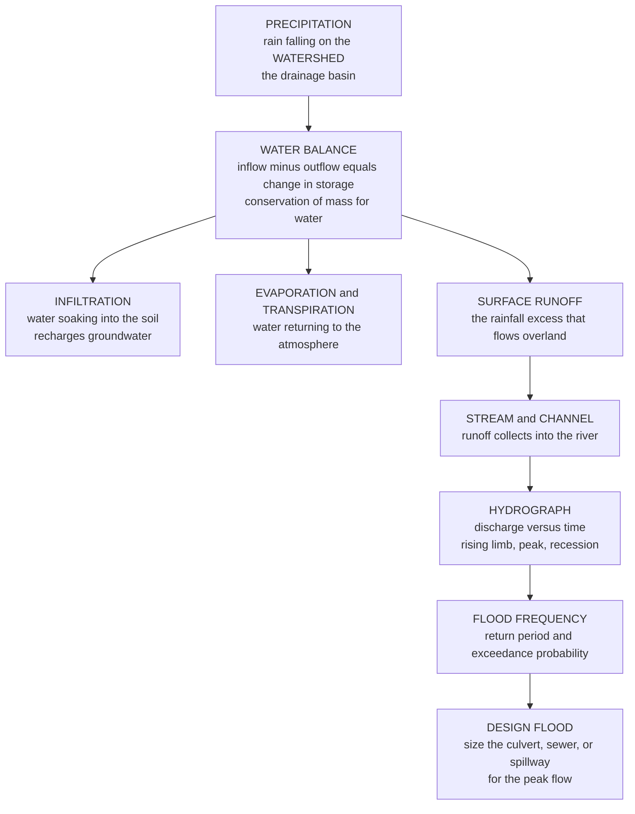

# 🌧️ Hydrology and the Water Cycle

> [!abstract] TL;DR
> **Hydrology** is the engineering science of **predicting the movement and quantity of water** so that infrastructure can be sized to survive it. Where the Earth-science water cycle *describes* how water circulates, **engineering hydrology quantifies it**: how much rain falls on a **watershed** (drainage basin — the fundamental hydrologic unit), how much **infiltrates** into the soil or leaves as **evapotranspiration (ET)**, and how much becomes **surface runoff** that a storm drain, culvert, or spillway must carry. The bookkeeping tool is the **water balance** — pure conservation of mass, *inflow − outflow = change in storage*. The forecasting tools are **runoff models** (the **Rational Method** $Q = CiA$ for small urban catchments; the **SCS/NRCS Curve Number** method for soil-and-land-use effects) and the **unit hydrograph**, which captures a watershed's response to a unit of rainfall and is **convolved** with a storm to produce the flood **hydrograph** — the telltale *rising limb, peak, and recession* curve of river flow. Risk is set statistically: annual peak flows are fit to a distribution (**Log-Pearson III**) to define a **return period** — the "**100-year flood**" is the flow with a **1 % annual exceedance probability**, *not* a flood that happens once a century. Hydrology sizes nearly all water infrastructure — storm **sewers**, culverts and bridges, **dams and reservoirs**, levees, water supply, and floodplain maps — so **under-design floods a city while over-design wastes millions**. And because a warming climate is shifting rainfall intensities, the discipline's bedrock assumption of **stationarity** is breaking down, putting hydrology at the center of designing resilient, adaptive infrastructure.

---

## Intuition

**Analogy — to build a bridge over a river or a storm drain for a city, an engineer must answer one deceptively hard question: how much water will come, and how fast?** Imagine you are handed a bare patch of hillside and told to design the drain that will run beneath the new road at its foot. Everything hinges on a number you cannot yet see: the **peak flow** the drain must swallow during the worst storm in the road's lifetime. Guess too small and the first big storm backs water up, floods the road, and drowns the neighborhood behind it. Guess too large and you have buried a needlessly enormous, expensive concrete culvert that will never fill. Hydrology is the **detective work of predicting that number** — reading the clues of rainfall, soil, slope, and land use to forecast a flood that has not happened yet.

Here is the whole logic in one picture. When rain falls on a **watershed** — the patch of land whose runoff all drains to one point — the water splits three ways: some **soaks in** (infiltration), some **evaporates or is breathed out by plants** (evapotranspiration), and the rest **runs off** across the surface. The runoff gathers into a stream, and if you stood at the outlet with a flow meter through a storm, you would trace a distinctive curve — flow **rising** as the runoff arrives, cresting at a **peak**, then slowly **receding** as the watershed drains. That curve is the **hydrograph**, and its peak is the number the engineer must forecast. The core accounting tool is the **water budget** — nothing more than conservation of mass for water: what comes in as rain must leave as runoff, evaporation, or go into storage. Getting this centuries-old forecasting wrong floods a city or over-builds a dam — and in a warming climate where the storms themselves are shifting, the forecasting is being rewritten.

---

## How It Works

### Core Mechanics

1. **Define the watershed and write its water balance.** The **watershed** (or drainage basin/catchment) is the fundamental unit of hydrology: the area of land from which all rainfall drains to a single outlet, bounded by topographic ridgelines. Over that area you apply **conservation of mass** — the **water balance**: $P - ET - Q - \Delta G = \Delta S$, where $P$ is precipitation in, and evapotranspiration $ET$, streamflow (runoff) $Q$, and groundwater change $\Delta G$ are the outflows/storage. Every hydrologic method is ultimately this budget applied at some time scale.

2. **Estimate the precipitation input and the losses.** Rainfall is measured by **gauges** and **radar** and generalized for design into **Intensity–Duration–Frequency (IDF) curves** (how intense a storm of a given duration and rarity is). Not all of it becomes runoff: **interception** (caught on leaves), **depression storage** (puddles), **evapotranspiration** (estimated by the **Penman** combination equation), and above all **infiltration** — modeled by **Horton's** decaying-rate equation or the physically based **Green–Ampt** wetting-front model — remove the "losses." What is left is **rainfall excess**, the part that actually runs off.

3. **Convert rainfall excess to a runoff rate.** For small catchments the **Rational Method** gives the peak directly: $Q_p = C \, i \, A$ (runoff coefficient × rainfall intensity × area). For soil- and land-use-dependent volume, the **SCS/NRCS Curve Number** method computes runoff *depth* from rainfall depth via a single **Curve Number (CN)** that encodes soil type and cover. The rainfall intensity used is that falling over the **time of concentration** $t_c$ — the time for runoff from the hydraulically most distant point to reach the outlet.

4. **Route rainfall excess into a flood hydrograph.** The **unit hydrograph (UH)** is the watershed's *signature*: the runoff hydrograph produced by **one unit of rainfall excess** applied uniformly over a fixed duration. Because the watershed responds (approximately) **linearly**, the flood hydrograph for any real storm is the **convolution** of that storm's excess-rainfall blocks with the unit hydrograph — superposing lagged, scaled copies to build the full **rising limb, peak, and recession**.

5. **Assign a risk with flood-frequency analysis.** The design question is not "what is the biggest possible flood" but "what flood should we design for." Annual peak flows over many years are fit to a probability distribution (in US practice, **Log-Pearson Type III**) to yield the **return period** $T$: a flood with return period $T$ has annual **exceedance probability** $p = 1/T$. The **100-year flood** ($T = 100$) has $p = 0.01$ — a **1 % chance each year** — and can strike twice in a decade.

6. **Size the infrastructure — and question stationarity.** The forecast peak (plus **reservoir routing** and **groundwater** analysis where relevant) sets the size of culverts, sewers, spillways, levees, and floodplain maps. Classical practice assumes the flood statistics are **stationary** (the past predicts the future); **climate change** is invalidating that, forcing **non-stationary** methods and larger design margins.

### Flow / Architecture



---

## Key Concepts

### Secondary Level

- **The water cycle is a loop that never loses water.** Water evaporates from oceans and lakes, rises and cools into clouds, falls as **precipitation**, then either soaks into the ground, flows down rivers back to the sea, or evaporates again. Engineers care about the loop because they must catch, carry, or hold the water at the right moment.
- **A watershed is nature's funnel.** A **watershed** is all the land whose rain drains to one point — a stream, a lake, a drain. Stand at the bottom of a valley: every drop that falls uphill of you, on your side of the ridges, eventually flows past your feet. That funnel is the unit an engineer studies.
- **Rain splits three ways.** When rain hits the ground, some **soaks in**, some **evaporates**, and the rest **runs off** across the surface. A forest soaks up most of its rain; a city of concrete and asphalt lets almost all of it run off — which is why cities flood so fast.
- **The hydrograph is a river's heartbeat after a storm.** Plot river flow against time during a storm and you get a curve that **rises**, hits a **peak**, and slowly **falls back** (recession). Engineers size drains and bridges for that **peak**.
- **The "100-year flood" is a chance, not a schedule.** It does *not* mean one flood per century. It means a flood so big it has a **1-in-100 chance of happening in any single year** — so it can happen two years in a row and still be a "100-year flood."

### Undergraduate Level

- **The water balance (budget).** For a watershed over a time period, conservation of mass gives $P = Q + ET + \Delta S$ (precipitation equals runoff plus evapotranspiration plus change in storage; add groundwater exchange as needed). This single equation underlies reservoir yield, drought analysis, and long-term runoff estimation.
- **The Rational Method.** For small (typically $< 80\text{–}200$ ha), largely impervious catchments, the peak runoff is $Q_p = C \, i \, A$. In SI, $Q_p\,[\text{m}^3/\text{s}] = \tfrac{1}{3.6}\,C\,i\,[\text{mm/hr}]\,A\,[\text{km}^2]$. The **runoff coefficient** $C$ ranges from $\sim 0.1$ (forest, sandy soil) to $\sim 0.95$ (paved). The design intensity $i$ is read from an **IDF curve** at a duration equal to the **time of concentration** $t_c$, because that is when the *whole* catchment contributes simultaneously.
- **SCS/NRCS Curve Number method.** Runoff *depth* $Q$ from rainfall depth $P$ is
$$Q = \frac{(P - I_a)^2}{P - I_a + S}, \qquad S = \frac{25400}{CN} - 254 \ \ [\text{mm}], \qquad I_a \approx 0.2\,S,$$
where $S$ is the potential maximum retention and $I_a$ the initial abstraction. The **Curve Number** $CN$ (from $\sim 30$ for forest on sandy soil to $\sim 98$ for pavement) encodes soil hydrologic group and land cover — the method's power is turning a land-use map into a runoff forecast.
- **Unit hydrograph and convolution.** The **unit hydrograph** $u(t)$ is the direct-runoff hydrograph from **1 cm (or 1 in) of excess rainfall** over a specified duration. Assuming **linearity and time-invariance**, a storm with excess-rainfall blocks $P_1, P_2, \dots$ produces the discrete convolution $Q_n = \sum_{m} P_m \, u_{n-m+1}$ — lagged, scaled copies of the UH summed into the storm hydrograph.
- **Time of concentration and peak timing.** $t_c$ governs *when* the peak arrives and *how sharp* it is: shorter $t_c$ (steeper, smoother, more urban catchments) means faster, higher, "flashier" peaks. Urbanization simultaneously **raises** $C$/$CN$ and **shortens** $t_c$ — a double blow that both increases and accelerates the flood peak.
- **Return period and exceedance probability.** If annual peak flows are independent, a flow with return period $T$ has annual exceedance probability $p = 1/T$, and the probability it is **exceeded at least once in $n$ years** is the **risk** $R = 1 - (1 - 1/T)^{n}$. A 100-year design over a 50-year life carries $R = 1 - 0.99^{50} \approx 0.39$ — a **39 % chance** of being exceeded within its lifetime.

### Graduate Level

- **Infiltration physics.** **Horton's** empirical model $f(t) = f_c + (f_0 - f_c)e^{-kt}$ captures the decay of infiltration capacity from an initial $f_0$ to a steady $f_c$. The physically based **Green–Ampt** model tracks a sharp wetting front via Darcy's law: $f = K\!\left(1 + \dfrac{(\theta_s - \theta_i)\,\psi_f}{F}\right)$, linking infiltration rate $f$ to cumulative infiltration $F$, hydraulic conductivity $K$, and suction $\psi_f$ — the bridge from soil physics to runoff generation.
- **Flood-frequency analysis with Log-Pearson III.** Fit the logarithms of annual peaks to a **Pearson Type III** (gamma-family) distribution using sample mean, standard deviation, and **skew** $g$. Quantiles follow $\log Q_T = \overline{\log Q} + K(g, T)\,\sigma_{\log Q}$, where $K$ is the frequency factor (Bulletin 17C in US practice, with regional skew weighting). The **confidence intervals** on a 100-year flood estimated from 30 years of record are enormous — hydrologic risk is itself deeply uncertain.
- **Synthetic and instantaneous unit hydrographs.** When gauged data are absent, **synthetic UHs** (Snyder, SCS dimensionless, Clark) derive the UH from watershed geometry ($t_c$, area, slope). The **Instantaneous Unit Hydrograph (IUH)** is the response to an *instantaneous* unit input; the storm hydrograph is then the continuous convolution $Q(t) = \int_0^{t} i_e(\tau)\, u(t - \tau)\, d\tau$ of the excess-rainfall hyetograph $i_e$ with the IUH — the linear-systems view of a watershed.
- **Reservoir and channel routing.** Storage routing solves the continuity storage equation $I(t) - O(t) = \dfrac{dS}{dt}$ to move a flood hydrograph *through* a reservoir (level-pool/modified Puls) or *down* a channel (**Muskingum**, $S = K[xI + (1-x)O]$). Routing **attenuates and delays** the peak — the physical basis for flood-control reservoirs and the reason a downstream hydrograph is lower and later than the inflow.
- **Groundwater hydrology.** Subsurface flow obeys **Darcy's law** $q = -K\,\dfrac{dh}{dx}$; steady radial flow to a well in a confined aquifer follows the **Thiem** equation and transient drawdown the **Theis** solution. Baseflow — the slow groundwater contribution — sustains streams between storms and forms the hydrograph's recession tail.
- **Non-stationarity and design under climate change.** Classical frequency analysis assumes **stationarity**: that the statistical distribution of extremes is fixed in time. A warming atmosphere holds more moisture (**Clausius–Clapeyron**, $\sim 7\%$ more per °C), intensifying extreme rainfall and invalidating that assumption. **Non-stationary** frequency analysis makes distribution parameters functions of time or covariates (e.g., global temperature), and design shifts toward **robust/adaptive** approaches, larger freeboard, and scenario-based storms — reframing the "100-year flood" as a moving target.

---

## Python Demo

```python
# ============================================================================
# ENGINEERING HYDROLOGY IN ONE FIGURE
#
#   (a) RATIONAL METHOD  ->  peak runoff  Q = C * i * A.  Plot how the design
#       peak flow scales with rainfall intensity for three land covers
#       (FOREST, SUBURB, URBAN) -- the runoff coefficient C makes urbanization's
#       flood impact jump off the page.
#
#   (b) SCS CURVE-NUMBER  ->  runoff DEPTH vs rainfall depth for several Curve
#       Numbers.  The gap between the 1:1 line and each curve is the water that
#       INFILTRATED / was lost -- forest keeps most of it, pavement almost none.
#
#   (c) UNIT HYDROGRAPH CONVOLUTION  ->  convolve a storm's excess-rainfall
#       hyetograph with a synthetic unit hydrograph to build the flood
#       HYDROGRAPH: rising limb, PEAK, recession.  This peak is what a culvert
#       or spillway must be sized to pass.
#
# Requires: numpy, matplotlib
import numpy as np
import matplotlib.pyplot as plt

# ============================================================================
# (a) RATIONAL METHOD :  Q_p = (1/3.6) * C * i[mm/hr] * A[km^2]   ->  m^3/s
# ============================================================================
A_km2 = 2.0                                  # catchment area [km^2]
i     = np.linspace(0, 120, 200)             # rainfall intensity [mm/hr]

covers = {"Forest (C=0.15)":   0.15,
          "Suburb (C=0.50)":   0.50,
          "Urban  (C=0.90)":   0.90}
Qp = {name: C * i * A_km2 / 3.6 for name, C in covers.items()}

# design-storm intensity (say a 10-yr, t_c-duration storm) for a headline number
i_design = 80.0                              # mm/hr
peaks = {name: C * i_design * A_km2 / 3.6 for name, C in covers.items()}
print("=== (a) Rational method: peak flow at i = %.0f mm/hr, A = %.1f km^2 ===" % (i_design, A_km2))
for name, q in peaks.items():
    print(f"  {name:18s} ->  Qp = {q:6.2f} m^3/s")
print(f"  urbanization multiplies the peak by ~{peaks['Urban  (C=0.90)']/peaks['Forest (C=0.15)']:.1f}x")

# ============================================================================
# (b) SCS / NRCS CURVE-NUMBER :  runoff depth Q from rainfall depth P
# ============================================================================
def scs_runoff(P_mm, CN):
    S  = 25400.0 / CN - 254.0                # potential max retention [mm]
    Ia = 0.2 * S                             # initial abstraction [mm]
    Q  = np.where(P_mm > Ia, (P_mm - Ia)**2 / (P_mm - Ia + S), 0.0)
    return Q

P = np.linspace(0, 150, 200)                 # storm rainfall depth [mm]
CNs = {"Forest  CN=55": 55, "Suburb  CN=75": 75, "Urban   CN=90": 90}
Qdepth = {name: scs_runoff(P, cn) for name, cn in CNs.items()}
print("\n=== (b) SCS curve number: runoff depth from a 100 mm storm ===")
for name, cn in CNs.items():
    print(f"  {name:14s} ->  runoff = {scs_runoff(np.array([100.0]), cn)[0]:5.1f} mm of 100 mm")

# ============================================================================
# (c) UNIT HYDROGRAPH  x  STORM HYETOGRAPH  ->  flood hydrograph (convolution)
# ============================================================================
# Synthetic gamma-shaped unit hydrograph: response to 1 cm of excess rain in 1 hr.
t   = np.arange(0, 24, 1.0)                   # time [hr]
tp  = 4.0                                     # time to peak [hr]
m   = 3.5                                     # shape parameter
uh  = (t / tp) ** m * np.exp(m * (1.0 - t / tp))   # dimensionless UH shape
uh  = uh / uh.sum()                           # normalize -> unit volume response

# Storm excess-rainfall hyetograph: excess depth [cm] in each 1-hr block.
hyeto = np.array([0.5, 1.8, 2.5, 1.2, 0.4])   # a rising-then-falling design storm

# Flood direct-runoff hydrograph = discrete convolution of hyetograph with UH.
Q_storm = np.convolve(hyeto, uh)              # relative discharge ordinates
t_storm = np.arange(len(Q_storm))             # time [hr]

i_peak  = int(np.argmax(Q_storm))
print("\n=== (c) Unit-hydrograph convolution: storm hydrograph ===")
print(f"  peak (relative) discharge {Q_storm[i_peak]:.2f} occurs at t = {t_storm[i_peak]} hr")
print("  rising limb -> PEAK -> recession is the shape a culvert/spillway is sized for")

# ---------------------------------------------------------------------------
# PLOTS
# ---------------------------------------------------------------------------
fig, ax = plt.subplots(1, 3, figsize=(16, 5))
fig.suptitle("Engineering Hydrology: Rainfall -> Runoff -> Flood Hydrograph",
             fontsize=15, fontweight="bold")

# --- (a) Rational method ---
a0 = ax[0]
colors = {"Forest (C=0.15)": "#2ca02c", "Suburb (C=0.50)": "#ff7f0e", "Urban  (C=0.90)": "#d62728"}
for name in covers:
    a0.plot(i, Qp[name], lw=2.4, color=colors[name], label=name)
a0.axvline(i_design, color="gray", ls="--", lw=1)
a0.text(i_design + 1, 0.5, "design storm", rotation=90, va="bottom", fontsize=8, color="gray")
a0.set_xlabel("Rainfall intensity  i  [mm/hr]")
a0.set_ylabel("Peak runoff  Q  [m$^3$/s]")
a0.set_title("(a) Rational method  Q = C i A\nurbanization steepens the flood")
a0.legend(fontsize=8, loc="upper left")
a0.grid(alpha=0.3)

# --- (b) SCS curve number ---
a1 = ax[1]
cn_colors = {"Forest  CN=55": "#2ca02c", "Suburb  CN=75": "#ff7f0e", "Urban   CN=90": "#d62728"}
a1.plot(P, P, color="k", ls=":", lw=1.2, label="1:1 (all rain runs off)")
for name in CNs:
    a1.plot(P, Qdepth[name], lw=2.4, color=cn_colors[name], label=name)
a1.fill_between(P, Qdepth["Forest  CN=55"], P, color="#2ca02c", alpha=0.08)
a1.set_xlabel("Rainfall depth  P  [mm]")
a1.set_ylabel("Runoff depth  Q  [mm]")
a1.set_title("(b) SCS curve number\ngap below 1:1 = infiltration + losses")
a1.legend(fontsize=8, loc="upper left")
a1.grid(alpha=0.3)

# --- (c) Unit-hydrograph convolution -> storm hydrograph ---
a2 = ax[2]
a2.bar(np.arange(len(hyeto)), hyeto, width=0.9, color="#9ecae1",
       alpha=0.7, label="excess rainfall [cm/hr]")
a2.plot(t_storm, Q_storm, color="#08519c", lw=2.6, marker="o", ms=4,
        label="storm hydrograph")
a2.fill_between(t_storm, Q_storm, color="#08519c", alpha=0.12)
a2.scatter([t_storm[i_peak]], [Q_storm[i_peak]], color="#d62728", zorder=5, s=60)
a2.annotate("PEAK\n(size the culvert here)",
            xy=(t_storm[i_peak], Q_storm[i_peak]),
            xytext=(t_storm[i_peak] + 3, Q_storm[i_peak] * 0.9),
            fontsize=8, color="#d62728", fontweight="bold",
            arrowprops=dict(arrowstyle="->", color="#d62728"))
a2.text(t_storm[i_peak] - 3.5, Q_storm[i_peak] * 0.45, "rising\nlimb",
        fontsize=8, ha="center", color="gray")
a2.text(t_storm[i_peak] + 5.5, Q_storm[i_peak] * 0.30, "recession",
        fontsize=8, ha="center", color="gray")
a2.set_xlabel("Time  [hr]")
a2.set_ylabel("Discharge  (relative)")
a2.set_title("(c) Unit hydrograph  *  storm\n= flood hydrograph")
a2.legend(fontsize=8, loc="upper right")
a2.grid(alpha=0.3)

plt.tight_layout(rect=[0, 0, 1, 0.93])
plt.savefig("hydrology_and_the_water_cycle.png", dpi=150)
# Expected: urban peak ~5x the forest peak (a); forest passes only ~30 mm of a
# 100 mm storm vs ~65 mm for urban (b); a single sharp storm hydrograph (c).
```

Running it prints the numbers and draws the three panels that walk rainfall all the way to a design flood. Panel **(a)** shows the **Rational Method**: the same storm on the same catchment produces a peak flow roughly **five times larger** over urban pavement ($C = 0.90$) than over forest ($C = 0.15$) — urbanization made visible. Panel **(b)** shows the **SCS Curve Number** relationship: the vertical gap between each curve and the $1{:}1$ line is the water that **infiltrated or was lost**, and it shrinks dramatically as land cover hardens. Panel **(c)** performs the **unit-hydrograph convolution** — a storm's excess-rainfall blocks (the bars) are convolved with the watershed's unit hydrograph to build the flood **hydrograph**, with its **rising limb, peak, and recession**. That single peak ordinate is precisely the number a culvert, storm sewer, or spillway is sized to pass.

---

## Real-World Applications

> **Example:** A **highway culvert under a new road** is sized by exactly this chain. The engineer delineates the upstream **watershed** from a topographic map, reads a **10- or 50-year design storm** off the regional **IDF curve**, and estimates the peak flow with the **Rational Method** ($Q = CiA$) for a small catchment or, for a larger one, builds a **SCS curve-number hydrograph** and takes its **peak**. The culvert's diameter is then set so it passes that peak without overtopping the road — and the road's *profile* is set above the **100-year flood** elevation. Under-size it and the road washes out in the first major storm; over-size it and public money is buried in oversized concrete. The same logic scales up to a **dam spillway**, sized to pass the **Probable Maximum Flood** so the dam cannot be overtopped and fail.

- **Urban storm-drainage and sewers.** City drainage networks are designed to the Rational Method or hydrograph methods at a chosen return period (commonly 5–10 years for minor systems, 100 years for major floodways). Rising impervious cover from development directly increases $C$/$CN$ and shrinks $t_c$, the engineering root of urban flash flooding.
- **Dams, reservoirs, and spillways.** **Reservoir routing** transforms an inflow flood hydrograph into a lower, delayed outflow, sizing both the storage (for water-supply yield via the water balance) and the **spillway** (to pass the extreme flood safely).
- **Bridge and culvert hydraulics.** The **design flood** sets waterway opening size, deck elevation (freeboard), and **scour** protection — the interface where hydrology hands off to open-channel hydraulics.
- **Floodplain mapping and insurance.** Agencies like **FEMA** map the **100-year (1 % annual chance) floodplain** using flood-frequency analysis plus hydraulic modeling; those maps drive zoning, building codes, and flood-insurance rates for millions of properties.
- **Water supply and drought planning.** The long-term **water balance** over a basin sets sustainable reservoir yield and reveals drought risk — the same conservation-of-mass accounting run over years instead of hours.
- **Climate-adaptive design.** Because observed extreme-rainfall intensities are rising, agencies increasingly apply **non-stationary** frequency analysis and climate-adjusted IDF curves, enlarging design storms so infrastructure built today survives the storms of 2075.

---

## Common Pitfalls

- **Treating the "100-year flood" as a once-per-century event.** It is a **1 % annual exceedance probability**, not a schedule. Two "100-year floods" can occur in consecutive years, and over a 50-year design life the chance of exceedance is about **39 %** — a fact routinely misread by the public and, dangerously, sometimes by decision-makers.
- **Applying the Rational Method outside its range.** $Q = CiA$ assumes a **small, fairly uniform, mostly impervious** catchment with a single runoff coefficient and a storm lasting at least the time of concentration. On large, mixed, or storage-dominated basins it can badly misestimate the peak; use a full hydrograph (unit-hydrograph or continuous-simulation) method instead.
- **Mis-estimating the time of concentration.** $t_c$ controls both the design intensity (via the IDF curve) and the peak sharpness. Getting it wrong — especially ignoring how urbanization *shortens* it — skews the whole peak. A too-long $t_c$ picks a gentler intensity and under-designs the drain.
- **Ignoring antecedent moisture and initial abstraction.** The SCS method's runoff depends heavily on **antecedent soil moisture** (dry vs. saturated ground) and the initial abstraction $I_a$. A curve number calibrated for average conditions can grossly under-predict runoff when the same storm falls on already-saturated ground.
- **Assuming stationarity in a changing climate.** Classical frequency analysis assumes flood statistics are fixed in time. With intensifying extreme rainfall, a "100-year" design storm from a 1980s IDF curve may already be a 50-year storm — silently eroding the safety margin of infrastructure designed to it.
- **Confusing rainfall with runoff (forgetting the losses).** Rain is not runoff. Infiltration, ET, interception, and depression storage remove a large, land-cover-dependent fraction. Designing a drain for total rainfall over-builds it; ignoring that a paved catchment loses almost nothing under-builds it.
- **Extrapolating a short record too far.** Estimating a 100-year (or 500-year) flood from 20–30 years of data yields enormous, often unreported uncertainty. Treating a single point estimate as exact hides that the true design flood could be far larger.

---

## Related Concepts

**The atmospheric side of the water cycle (Meteorology & Climatology vault)**
- [[Precipitation_Processes]] — how the rainfall that drives every hydrologic model actually forms, and what sets its intensity and duration (the input to IDF curves).
- [[Moisture_and_Humidity]] — atmospheric moisture governs both the precipitation supply and the **evapotranspiration** loss term in the water balance; Clausius–Clapeyron scaling is why a warming climate intensifies design storms.
- [[Droughts_and_Floods]] — the two failure modes at the tails of the runoff distribution that hydrologic design must bound: too little water (yield/drought) and too much (flood frequency).

**The surface and subsurface side (Earth Science vault)**
- [[Rivers_and_Fluvial_Landscapes]] — the streamflow and channel behavior that a hydrograph feeds into; the geomorphic counterpart of the runoff an engineer computes.
- [[Groundwater_and_Karst]] — the aquifer storage and baseflow that sustain streams between storms and form the recession tail of the hydrograph (Darcy, wells, recharge from infiltration).

**The ocean sink and the statistical backbone (Oceanography & Mathematics vaults)**
- [[Ocean_Atmosphere_Exchange_and_Air_Sea_Fluxes]] — ocean evaporation is the dominant source that closes the global water cycle whose land-based branch hydrology quantifies.
- [[Common_Probability_Distributions]] — flood-frequency analysis and the return period are applied probability; Log-Pearson III and extreme-value reasoning rest directly on distribution theory.

*Within this vault (Civil Engineering, Pillar 4 — Water Resources & Environmental, siblings): Hydraulics_and_Open_Channel_Flow takes the design flood computed here and routes it through channels and culverts (Manning's equation); Water_Supply_and_Distribution applies the long-term water balance to reservoir yield and demand; Coastal_and_Flood_Engineering extends flood risk to storm surge and levee design; Environmental_Engineering_and_Pollution_Control treats the water quality of the runoff and streams hydrology quantifies; and Sustainable_and_Smart_Infrastructure addresses the non-stationarity and green-infrastructure responses to a changing hydrologic climate.*

---

## Review Questions

**Secondary**
1. A forested hillside is cleared and paved for a shopping center. Using the idea that rain "splits three ways," explain in plain words why the stream at the bottom of the watershed now floods faster and higher after the same rainstorm than it did before. What does the word "watershed" mean, and why is it the natural unit for this question?

**Undergraduate**
2. A $1.5\ \text{km}^2$ catchment has a runoff coefficient $C = 0.6$ and a time of concentration $t_c = 30$ min. The IDF curve gives a 10-year, 30-minute storm intensity of $60\ \text{mm/hr}$. Compute the peak runoff with the Rational Method ($Q_p = \tfrac{1}{3.6}CiA$). Then explain why the storm duration is chosen equal to $t_c$, and what would change in your estimate if the catchment were urbanized to $C = 0.9$ **and** its $t_c$ dropped to 15 min.

**Graduate**
3. A culvert is designed to pass the "100-year flood" estimated by fitting 35 years of annual peak flows to a Log-Pearson III distribution. (a) State the annual exceedance probability and the probability the design flood is exceeded at least once during the culvert's 50-year service life. (b) Explain why the *confidence interval* on that 100-year estimate is wide given only 35 years of record. (c) Climate change is intensifying extreme rainfall — describe concretely how the assumption of **stationarity** enters this design and how a **non-stationary** frequency analysis would change the culvert size.

---

## Sources

- V. T. Chow, D. R. Maidment & L. W. Mays — *Applied Hydrology* (McGraw-Hill)
- P. B. Bedient, W. C. Huber & B. E. Vieux — *Hydrology and Floodplain Analysis*, 5th ed. (Pearson)
- W. Viessman Jr. & G. L. Lewis — *Introduction to Hydrology*, 5th ed. (Pearson)
- R. H. McCuen — *Hydrologic Analysis and Design*, 4th ed. (Pearson)
- USGS/USACE — *Bulletin 17C: Guidelines for Determining Flood Flow Frequency* and NRCS TR-55 *Urban Hydrology for Small Watersheds*

---

#civil-engineering #hydrology #watershed #hydrograph #return-period
