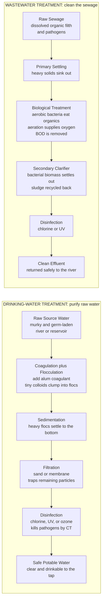

# 💧 Wastewater and Water Treatment

> [!abstract] TL;DR
> Water and wastewater treatment is arguably the **greatest public-health achievement in history** — the quiet infrastructure that added decades to human life expectancy by cutting off waterborne killers like cholera and typhoid. **Drinking-water treatment** takes murky, germ-laden raw water and makes it crystal-clear and safe through a *treatment train*: **coagulation and flocculation** (add alum so tiny colloids clump into settleable flocs), **sedimentation** (let the flocs settle), **filtration** (polish through sand or membranes), and **disinfection** (chlorine, UV, or ozone kill the surviving pathogens, quantified by the **CT** concept). **Wastewater treatment** runs the reverse journey and is even more elegant: after screening and **primary settling**, the heart of the plant puts **hungry aerobic bacteria** to work — the same microbes that decompose matter in nature, but concentrated and fed oxygen in aeration tanks (the **activated-sludge** process) — to devour the dissolved organic filth (measured as **BOD**, biochemical oxygen demand), then a **secondary clarifier** settles the biomass out, leaving clean effluent to return to the river. Advanced/**tertiary** stages strip **nitrogen and phosphorus** (preventing river **eutrophication**), and sludge is stabilized by **anaerobic digestion** (recovering biogas). It is biology run as a machine, and it is the reason modern cities are not cesspools of disease.

---

## Intuition

**Analogy:** This is the technology that quietly added decades to human life expectancy — it treats our water so it does not kill us, and cleans our sewage so it does not poison our rivers. Think of it as two opposite journeys. The **drinking-water** journey takes cloudy, dangerous raw water and *purifies* it step by step: first you make the invisible dirt particles clump together into visible flakes, then you let those flakes settle to the bottom, then you filter out whatever is left through a bed of sand, and finally you kill the surviving germs with a disinfectant — murky and lethal at one end, crystal-clear and safe at the other.

The **wastewater** journey is the reverse, and it is the more beautiful trick. Nature already has a machine for eating filth: bacteria. In a swamp or a forest floor, microbes decompose dead matter for free. A sewage plant simply *domesticates* that process — it concentrates those hungry bacteria in tanks, blows air through to feed them oxygen, and lets them gorge on the dissolved organic pollution in the sewage. Once the bacteria have eaten, you let *them* settle out (they clump into a "sludge"), and what floats off the top is clean water fit to return to a river. It is biology as a factory: the same decomposition that happens invisibly in nature, sped up, concentrated, and controlled inside a reactor. Before we built these machines, cities poured raw sewage into the same rivers they drank from — and cholera did the rest.

---

## How It Works

### Core Mechanics

**Drinking-water treatment — from raw source to safe tap:**

1. **Coagulation.** Raw water is cloudy because it carries **colloids** — clay, silt, microbes, and natural organic matter so tiny (submicron) and so negatively charged that they repel each other and never settle. Adding a **coagulant** (commonly **alum**, aluminium sulfate, or ferric chloride) floods the water with positive charge that *neutralizes* that repulsion. This is done in a rapid, violent mix lasting seconds.

2. **Flocculation.** Now that the particles no longer repel, gentle, slow stirring for 20–45 minutes lets them collide and stick, growing from invisible specks into fluffy, settleable **flocs** the size of snowflakes. Fast mix destabilizes; slow mix grows the floc — too much energy tears the flocs apart.

3. **Sedimentation.** The flocculated water flows slowly through a large tank where gravity pulls the heavy flocs to the bottom as **sludge**. The design is governed by the **overflow rate** (surface loading rate): a particle is captured only if its settling velocity exceeds the tank's rise rate. Bigger tank area → lower overflow rate → smaller particles captured.

4. **Filtration.** The clarified water still contains fine flocs and pathogens, so it percolates down through a bed of **sand** (or anthracite/sand multimedia, or a **membrane**), which strains and adsorbs the remaining particles. This is the barrier that produces the final low **turbidity** and removes chlorine-resistant pathogens like *Cryptosporidium*.

5. **Disinfection.** Finally, a disinfectant — **chlorine**, **ozone**, or **UV** — inactivates the surviving pathogens. Chemical disinfection follows the **CT concept**: kill depends on the product of disinfectant **C**oncentration and contact **T**ime. A chlorine *residual* is deliberately left in the water to protect it all the way through the distribution pipes to your tap.

**Wastewater treatment — from sewage to safe discharge:**

6. **Preliminary and primary.** Incoming sewage first passes **screens** (removing rags and debris) and **grit chambers** (removing sand and gravel). Then **primary sedimentation** lets settleable solids and floating grease separate out by gravity — this removes roughly a third of the organic load with no chemistry, just settling.

7. **Secondary (biological) — the heart.** The dissolved and colloidal organic matter that will *not* settle is removed by **microbes**. In the **activated-sludge** process, primary effluent enters an **aeration tank** where a dense, aerated culture of **aerobic bacteria** (the "mixed liquor") metabolizes the organics for energy and growth. Blowers supply oxygen; the bacteria convert pollution into more bacteria, CO₂, and water. The mixed liquor then flows to a **secondary clarifier** where the biomass settles; most settled sludge is *recycled* back to the aeration tank (to keep the bacterial population high), and the excess is wasted. Trickling filters and other **biofilm** reactors do the same job with bacteria growing on fixed media.

8. **Tertiary / advanced.** Where discharge limits are strict, extra steps follow: **nutrient removal** of **nitrogen** (via nitrification–denitrification by specialized bacteria) and **phosphorus** (biological or chemical), which is critical because N and P cause **eutrophication** — algal blooms and oxygen-starved dead zones in receiving waters. Additional **filtration** and **disinfection** finish the effluent.

9. **Sludge handling.** All the settled solids from primary and secondary are treated separately: **thickening**, **anaerobic digestion** (oxygen-free bacteria convert sludge to **biogas** — a methane fuel — while stabilizing it), **dewatering**, and disposal or beneficial reuse. Digestion is why modern plants are being renamed **water resource recovery facilities**: they recover energy, nutrients, and water.

**The key measurement — BOD.** The strength of organic pollution is measured as **BOD** (**biochemical oxygen demand**): the amount of dissolved oxygen the microbes would consume decomposing the organics. High BOD dumped into a river robs it of oxygen and suffocates fish; the entire purpose of secondary treatment is to slash BOD before discharge (a typical secondary limit is 30 mg/L BOD₅).

### Flow / Architecture



---

## Key Concepts

### Secondary Level

**Two opposite jobs.** *Drinking-water* treatment makes dirty raw water clean and safe to drink. *Wastewater* treatment makes dirty sewage clean enough to return to a river. Same goal — protecting health and the environment — from two directions.

**Cleaning drinking water, step by step.** (1) **Coagulation** — add a chemical that makes tiny invisible dirt particles stick together. (2) **Settling** — let the clumps sink. (3) **Filtering** — pass the water through sand to catch what is left. (4) **Disinfecting** — add chlorine or shine UV light to kill germs. Murky and dangerous goes in; clear and safe comes out.

**Cleaning sewage with bacteria.** The clever part of a sewage plant is that it uses **living bacteria** to do the work. The same microbes that rot leaves in a forest are put in tanks, fed **air** (oxygen), and let loose on the dissolved filth in the sewage. They eat the pollution and grow. Then you let the bacteria settle to the bottom and skim off the clean water on top.

**Why it matters so much.** Before these systems, cities dumped raw sewage into the rivers they drank from, and diseases like **cholera** and **typhoid** killed enormous numbers of people. Water and sewage treatment broke that chain — historians rate it among the most important reasons people live longer today.

**BOD in plain words.** **BOD** measures how much *oxygen-hungry pollution* is in water. When lots of organic waste enters a river, bacteria there eat it and use up the river's oxygen, suffocating fish. Treating sewage means lowering its BOD before it is released.

### Undergraduate Level

**Coagulation chemistry.** Colloids carry a negative surface charge and are surrounded by an electrical **double layer** that keeps them apart. A trivalent coagulant such as Al³⁺ (from alum) or Fe³⁺ works by **charge neutralization** and **sweep floc** (precipitating Al(OH)₃ / Fe(OH)₃ that enmeshes particles). The optimum coagulant dose and pH are found with the **jar test**. Rapid mix (high velocity gradient **G**, ~700–1000 s⁻¹, seconds) disperses the coagulant; flocculation (low **G**, ~20–70 s⁻¹, tens of minutes) grows floc — characterized by the dimensionless **Gt** product.

**Sedimentation and overflow rate.** For discrete particles, **Stokes' law** gives the terminal settling velocity:

$$v_s = \frac{g\,(\rho_p - \rho_w)\,d^2}{18\,\mu}$$

An ideal rectangular clarifier removes 100% of particles whose $v_s$ exceeds the **overflow rate** $v_o = Q/A_{surface}$ (flow per unit surface area) — note that removal depends on tank **area**, not depth. Particles slower than $v_o$ are removed in proportion $v_s/v_o$. Typical overflow rates are ~1–2.5 m/h.

**Filtration.** Rapid **sand/multimedia filters** remove particles by interception, straining, and attachment; head loss builds until the filter is **backwashed**. **Slow sand filters** and **membrane** systems (micro-, ultra-, nano-, and reverse-osmosis filtration, an application of [[Membrane_Separations]]) provide finer barriers, including for chlorine-resistant *Cryptosporidium*.

**Disinfection and CT.** Chemical disinfection follows **Chick–Watson** kinetics — the log inactivation is proportional to the **CT** product (concentration × contact time):

$$\log_{10}\!\left(\frac{N_0}{N}\right) = \Lambda \cdot C \cdot t$$

Regulators specify required CT values for a given log removal (e.g., 4-log virus). Ozone and UV achieve the same inactivation at far lower CT than chlorine, but chlorine's persistent **residual** protects the distribution system. A key trade-off: chlorine reacting with natural organic matter forms **disinfection byproducts (DBPs)** such as trihalomethanes, a regulated health concern.

**BOD kinetics.** Organic decomposition exerts oxygen demand following (approximately) **first-order** kinetics — the same rate-law machinery as [[Reaction_Kinetics_and_Rate_Laws]]. The oxygen demand *exerted* by time $t$ is:

$$L_t = L_0\left(1 - e^{-k_1 t}\right)$$

where $L_0$ is the **ultimate** BOD and $k_1$ the deoxygenation rate. The standard test measures **BOD₅** (5-day, 20 °C); note BOD₅ is only ~60–70% of ultimate BOD. Related indices: **COD** (chemical oxygen demand, faster and broader), **TSS** (total suspended solids), and nutrients (**N**, **P**).

**Activated sludge as a bioreactor.** The aeration tank is essentially a continuous-flow biological reactor (compare the ideal reactors of [[Ideal_Reactors_Batch_CSTR_PFR]] — a complete-mix aeration basin behaves like a CSTR). Microbial growth on the substrate (BOD) follows **Monod** kinetics:

$$\mu = \mu_{max}\frac{S}{K_s + S}$$

Design centers on the **solids retention time (SRT / sludge age)** and the **food-to-microorganism ratio (F/M)** — how much BOD is fed per unit of biomass. Long SRT gives more complete treatment and enables **nitrification** (slow-growing bacteria that oxidize ammonia). The oxygen the blowers must supply is itself a mass-transfer problem — gas–liquid transfer of the kind treated in [[Absorption_and_Stripping]].

### Graduate Level

**Nutrient removal and eutrophication.** Nitrogen and phosphorus drive **eutrophication** — the over-fertilization of receiving waters that causes algal blooms, hypoxic "dead zones," and fish kills (the nutrient side of the [[Biogeochemical_Cycles]]). **Biological nitrogen removal** couples aerobic **nitrification** (NH₄⁺ → NO₂⁻ → NO₃⁻ by autotrophic *Nitrosomonas*/*Nitrobacter*) with anoxic **denitrification** (NO₃⁻ → N₂ gas by heterotrophs using nitrate as electron acceptor), arranged in staged anoxic/aerobic zones (e.g., Modified Ludzack–Ettinger, A²/O). **Enhanced biological phosphorus removal (EBPR)** exploits **polyphosphate-accumulating organisms** cycled through anaerobic/aerobic zones; phosphorus can also be precipitated chemically with alum or ferric salts. Emerging **anammox** (anaerobic ammonium oxidation) enables energy-efficient nitrogen removal without organic carbon.

**Reactor modeling.** Rigorous design uses activated-sludge mass balances on biomass and substrate. A steady-state complete-mix model links effluent substrate to SRT:

$$S_e = \frac{K_s\,(1 + b\,\theta_c)}{\theta_c\,(\mu_{max} - b) - 1}$$

where $\theta_c$ is SRT and $b$ the endogenous decay coefficient — remarkably, effluent quality depends on **SRT**, not directly on flow. The **IWA Activated Sludge Models (ASM1/2/3)** extend this to multi-species, multi-substrate dynamic simulation (carbon, nitrogen, phosphorus, oxygen), the standard for process design and control.

**Settling in clarifiers — the limiting flux.** Secondary clarifiers face **hindered (zone) settling** of concentrated biomass, not discrete Stokes settling. **Solids flux theory** (Kynch) determines the limiting solids loading rate; poor settling (a high **SVI**, sludge volume index) from **filamentous bulking** or **rising sludge** (denitrification in the clarifier) is the most common cause of activated-sludge failure — biomass washes out over the weir, wrecking effluent quality.

**Advanced oxidation and membranes.** For recalcitrant compounds, **advanced oxidation processes (AOPs)** — ozone/H₂O₂, UV/H₂O₂, Fenton — generate hydroxyl radicals that mineralize organics. **Membrane bioreactors (MBRs)** replace the secondary clarifier with membrane filtration, producing very high-quality effluent in a compact footprint. **Granular activated carbon** adsorption polishes trace organics (an application of [[Adsorption_Drying_and_Crystallization]]).

**Emerging concerns and resource recovery.** Conventional plants were not designed for **micropollutants** — pharmaceuticals, endocrine disruptors, **PFAS** ("forever chemicals"), and **microplastics** — which pass through largely untreated and are now central to environmental-health toxicology. Simultaneously, the field is shifting from "disposal" to **resource recovery**: biogas-to-energy from digestion, **struvite** precipitation to recover phosphorus, and **potable and non-potable water reuse** (from indirect reuse to direct potable reuse with multi-barrier RO/AOP trains) as water scarcity intensifies. This reframes the sewage plant as a **water resource recovery facility** — a net producer of energy, nutrients, and water.

---

## Python Demo

```python
# Water/wastewater treatment process design, four core relationships:
#   (a) BIOLOGICAL / BOD REMOVAL: effluent BOD vs residence time in a complete-mix
#       (activated-sludge) reactor, first-order AND Monod kinetics, vs discharge limit
#   (b) BOD EXERTION CURVE: oxygen demand exerted over time, BOD5 vs ultimate BOD
#   (c) SEDIMENTATION: Stokes settling velocity vs particle size, and the overflow-rate
#       cutoff that sizes a sedimentation tank (which particles get captured)
#   (d) DISINFECTION: Chick-Watson log inactivation vs CT (concentration x time),
#       chlorine vs ozone, against a 4-log (99.99%) pathogen-removal target
#
# Requires: numpy, matplotlib
import numpy as np
import matplotlib.pyplot as plt

# ===========================================================================
# (a) BIOLOGICAL BOD REMOVAL in a complete-mix (CSTR-like) aeration basin
#     First-order removal:  S_out = S_in / (1 + k*tau)
#     Monod removal (steady CM biomass): solved for effluent substrate vs tau
# ===========================================================================
S_in   = 250.0        # influent BOD after primary settling, mg/L
k_bio  = 3.0          # first-order removal rate constant, 1/day
limit  = 30.0         # secondary discharge limit (BOD5), mg/L

tau = np.linspace(0.05, 3.0, 400)                 # hydraulic residence time, days
S_first = S_in / (1.0 + k_bio * tau)              # first-order effluent BOD

# Monod-style: dS/dtau removal with saturation (illustrative lumped form)
mu_max, Ks, X, Y = 6.0, 60.0, 2000.0, 0.5         # /day, mg/L, mg/L biomass, yield
# steady CM balance: (S_in - S)/tau = (mu_max/Y)*X*S/(Ks+S) ; solve per tau
S_monod = np.empty_like(tau)
for i, t in enumerate(tau):
    s = S_in
    for _ in range(200):                          # fixed-point iteration
        removal = (mu_max / Y) * X * s / (Ks + s)
        s_new = max(S_in - removal * t, 0.0)
        s = 0.5 * s + 0.5 * s_new                 # damped update
    S_monod[i] = s

tau_hit = tau[np.argmax(S_first <= limit)]        # HRT to reach the limit (first-order)
print("=== (a) Biological BOD removal ===")
print(f"  Influent BOD = {S_in:.0f} mg/L, discharge limit = {limit:.0f} mg/L")
print(f"  First-order: HRT to meet limit = {tau_hit*24:.1f} h  ({tau_hit:.2f} day)")

# ===========================================================================
# (b) BOD EXERTION CURVE:  L_t = L0 * (1 - exp(-k1 t))
# ===========================================================================
L0, k1 = 300.0, 0.23                              # ultimate BOD mg/L, deoxygenation /day
t_days = np.linspace(0, 20, 400)
L_exert = L0 * (1.0 - np.exp(-k1 * t_days))
BOD5 = L0 * (1.0 - np.exp(-k1 * 5.0))
print("\n=== (b) BOD exertion ===")
print(f"  Ultimate BOD L0 = {L0:.0f} mg/L,  BOD5 = {BOD5:.0f} mg/L "
      f"({BOD5/L0*100:.0f}% of ultimate)")

# ===========================================================================
# (c) STOKES SETTLING: v_s = g*(rho_p - rho_w)*d^2 / (18 mu)
# ===========================================================================
g, rho_w, mu = 9.81, 1000.0, 1.002e-3            # SI units
d = np.logspace(-6, -3, 400)                      # particle diameter, m (1 um .. 1 mm)

def v_stokes(rho_p):
    return g * (rho_p - rho_w) * d**2 / (18.0 * mu)   # m/s

v_floc = v_stokes(1050.0)                         # light biological/alum floc
v_sand = v_stokes(2650.0)                         # dense sand grain
overflow = 1.5 / 3600.0                           # overflow rate 1.5 m/h -> m/s

# smallest floc captured (v_s >= overflow rate)
d_cut = np.sqrt(overflow * 18.0 * mu / (g * (1050.0 - rho_w)))
print("\n=== (c) Sedimentation ===")
print(f"  Overflow rate = 1.5 m/h; smallest FLOC captured ~ {d_cut*1e6:.0f} um")

# ===========================================================================
# (d) DISINFECTION (Chick-Watson): log_inact = Lambda * C * t  (CT concept)
# ===========================================================================
CT = np.linspace(0, 200, 400)                     # mg-min/L
Lam_chlorine, Lam_ozone = 0.020, 1.2              # per (mg-min/L), illustrative
log_cl = Lam_chlorine * CT
log_o3 = Lam_ozone * CT
target = 4.0                                       # 4-log (99.99%) inactivation
CT_cl = target / Lam_chlorine
CT_o3 = target / Lam_ozone
print("\n=== (d) Disinfection CT for 4-log inactivation ===")
print(f"  Chlorine needs CT ~ {CT_cl:.0f} mg-min/L; ozone needs CT ~ {CT_o3:.1f} mg-min/L")

# ===========================================================================
# PLOTS
# ===========================================================================
fig, ax = plt.subplots(2, 2, figsize=(13, 9))
fig.suptitle("Water & Wastewater Treatment: biological BOD removal, settling, disinfection",
             fontsize=14, fontweight="bold")

# A: effluent BOD vs residence time
axA = ax[0, 0]
axA.plot(tau * 24, S_first, lw=2.5, color="#1f77b4", label="first-order removal")
axA.plot(tau * 24, S_monod, lw=2.2, ls="--", color="#2ca02c", label="Monod kinetics")
axA.axhline(limit, color="#d62728", lw=1.6, ls=":", label=f"discharge limit {limit:.0f} mg/L")
axA.set_xlabel("hydraulic residence time  [hours]")
axA.set_ylabel("effluent BOD  [mg/L]")
axA.set_title("A. Biological treatment: longer residence -> cleaner water")
axA.legend(fontsize=8); axA.grid(alpha=0.3); axA.set_ylim(0, S_in)

# B: BOD exertion curve
axB = ax[0, 1]
axB.plot(t_days, L_exert, lw=2.5, color="#8c564b")
axB.axhline(L0, color="gray", ls=":", lw=1.2)
axB.annotate("ultimate BOD (L0)", (12, L0 - 25), color="gray", fontsize=9)
axB.scatter([5], [BOD5], color="#d62728", zorder=5, s=60)
axB.annotate(f"BOD5 = {BOD5:.0f} mg/L", (5, BOD5), textcoords="offset points",
             xytext=(12, -18), color="#d62728", fontsize=9)
axB.set_xlabel("time  [days]"); axB.set_ylabel("oxygen demand exerted  [mg/L]")
axB.set_title("B. BOD exertion: oxygen demand over time")
axB.grid(alpha=0.3)

# C: Stokes settling velocity vs particle size
axC = ax[1, 0]
axC.loglog(d * 1e6, v_floc * 3600, lw=2.5, color="#2ca02c", label="light floc (rho=1050)")
axC.loglog(d * 1e6, v_sand * 3600, lw=2.5, color="#7f7f7f", label="sand grain (rho=2650)")
axC.axhline(1.5, color="#d62728", ls=":", lw=1.6, label="overflow rate 1.5 m/h")
axC.axvline(d_cut * 1e6, color="#1f77b4", ls="--", lw=1.4,
            label=f"floc cutoff ~{d_cut*1e6:.0f} um")
axC.set_xlabel("particle diameter  [micrometre]")
axC.set_ylabel("settling velocity  [m/h]")
axC.set_title("C. Sedimentation: only fast particles are captured")
axC.legend(fontsize=8); axC.grid(alpha=0.3, which="both")

# D: disinfection CT
axD = ax[1, 1]
axD.plot(CT, log_cl, lw=2.5, color="#1f77b4", label="chlorine (slow)")
axD.plot(CT, log_o3, lw=2.5, color="#9467bd", label="ozone (fast)")
axD.axhline(target, color="#d62728", ls=":", lw=1.6, label="4-log target (99.99%)")
axD.scatter([CT_cl, CT_o3], [target, target], color="k", zorder=5, s=45)
axD.set_xlabel("CT  =  concentration x contact time  [mg-min/L]")
axD.set_ylabel("log10 pathogen inactivation")
axD.set_title("D. Disinfection: kill scales with C x T")
axD.legend(fontsize=8); axD.grid(alpha=0.3); axD.set_ylim(0, 6)

plt.tight_layout(rect=[0, 0, 1, 0.95])
plt.show()
```

Running this prints the residence time needed to hit the 30 mg/L discharge limit, confirms BOD₅ is ~68% of the ultimate BOD, reports the smallest floc a 1.5 m/h clarifier can capture (~30 µm), and shows chlorine needs an order-of-magnitude higher CT than ozone for 4-log inactivation. **Panel A** is the core biological-treatment design curve: effluent BOD falls as residence time grows, and you size the reactor to cross below the discharge limit — the essence of activated-sludge design. **Panel B** is the classic BOD exertion curve, showing why the 5-day test captures only part of the ultimate oxygen demand. **Panel C** is the sedimentation-tank design principle: plotting Stokes settling velocity against particle size, with the **overflow rate** as the horizontal cutoff — dense sand settles easily, light flocs only if large enough, which is exactly why coagulation must grow big flocs first. **Panel D** is the **CT concept**: log inactivation rises linearly with concentration × contact time, and a fast disinfectant (ozone) reaches the 4-log target at a fraction of the CT a slow one (chlorine) needs.

---

## Real-World Applications

> **The London cholera epidemics and the birth of modern sanitation.** In 1854 John Snow traced a cholera outbreak to the Broad Street water pump, and the "Great Stink" of 1858 pushed London to build Bazalgette's sewer network — separating drinking water from sewage. The subsequent adoption of **sand filtration** and, from ~1908 (Jersey City), routine **chlorination** of drinking water caused typhoid and cholera death rates to collapse. Studies credit clean-water technology with roughly **half the total mortality decline** in U.S. cities in the early 20th century — the empirical basis for calling it the greatest public-health achievement (see [[Public_Health_and_Epidemiology]] and [[Infectious_Disease_Vaccines_and_Immunity]]).

> **Activated sludge — a century-old bioprocess still running the world.** Invented in Manchester in 1914 by Ardern and Lockett, the **activated-sludge** process is the workhorse of virtually every major city's wastewater treatment today. Plants like Chicago's Stickney (the world's largest) treat billions of litres per day using nothing more exotic than aerated tanks of domesticated bacteria (the microbes of [[Bacteria_and_Archaea]]) plus clarifiers — a direct industrial harnessing of natural decomposition.

> **Singapore NEWater — direct evidence that reuse works.** Facing water scarcity, Singapore treats secondary effluent through **microfiltration, reverse osmosis, and UV** to produce ultra-clean **NEWater**, blended into reservoirs and used for industry. It is a flagship of the shift from "treat-and-discharge" to **water reuse** and resource recovery, built on multi-barrier membrane treatment ([[Membrane_Separations]]).

> **Chesapeake Bay and nutrient limits.** Decades of nitrogen and phosphorus loading created vast summer **hypoxic dead zones** in the Chesapeake and the Gulf of Mexico. Regulatory "nutrient TMDLs" forced plants to add **biological nutrient removal** (nitrification–denitrification, EBPR), a textbook case of how eutrophication ([[Biogeochemical_Cycles]]) reshaped effluent standards and plant design.

> **PFAS and the limits of legacy plants.** "Forever chemicals" (PFAS) pass through conventional treatment almost untouched and concentrate in sludge. Utilities are now retrofitting **granular activated carbon**, ion exchange, and high-pressure membranes to remove them — a live environmental-health challenge ([[Environmental_Health_and_Toxicology]]) driving the next generation of treatment.

---

## Common Pitfalls

- **Thinking disinfection alone makes water safe.** Chlorine is the *last* barrier, not the only one. Turbidity and particles shield pathogens from disinfectant, and *Cryptosporidium* is highly chlorine-resistant. Effective treatment is a **multi-barrier** system — coagulation, sedimentation, and filtration must first remove the particle load so disinfection can finish the job. Relying on chlorine to fix dirty water fails.
- **Over- or under-dosing coagulant.** Coagulation has an *optimum* dose and pH found by the jar test; too little leaves colloids destabilized incompletely, and too much can **re-stabilize** the particles (charge reversal) and waste chemical. Getting the dose and rapid-mix energy wrong ripples through the entire downstream train.
- **Tearing flocs apart with too much mixing.** Flocculation needs *gentle* stirring. Excessive velocity gradient in the flocculation basin shears the fragile flocs back into small particles that will not settle — fast mix destabilizes, but slow mix must grow the floc.
- **Confusing BOD₅ with ultimate BOD.** The 5-day test captures only ~60–70% of the ultimate oxygen demand, and it misses **nitrogenous** demand entirely unless a nitrification inhibitor is used. Designing to BOD₅ as if it were the total load underestimates the true oxygen requirement and the receiving-water impact.
- **Washing out the biomass (SRT too short / clarifier failure).** Activated sludge only works if bacteria are retained long enough to grow (adequate **SRT**) and if the secondary clarifier settles them. **Filamentous bulking** (poor-settling sludge, high SVI) or hydraulic overload lets biomass escape over the weir — the single most common cause of a plant violating its permit. Nitrification is especially SRT-sensitive and fails first in cold weather or overload.
- **Ignoring nutrients.** A plant can meet its BOD and TSS limits yet still wreck a lake by discharging nitrogen and phosphorus that fuel **eutrophication**. BOD removal alone is not "clean" — nutrient removal is a separate, deliberate design objective.
- **Assuming legacy treatment removes everything.** Conventional plants were designed for organics, solids, and pathogens — not for **micropollutants** (pharmaceuticals, endocrine disruptors, PFAS, microplastics), which pass through largely untreated. Treating a discharge permit's classic parameters as proof of "clean" water misses the emerging-contaminant reality.
- **Neglecting disinfection byproducts.** Chlorinating water rich in natural organic matter forms **trihalomethanes** and other regulated DBPs. Chasing a large chlorine CT without first removing organic precursors trades a microbial risk for a chemical one.

---

## Related Concepts

Within the Civil Engineering vault, this note is the environmental-engineering core that connects to its **water-and-environment siblings**: *Water_Supply_and_Distribution* (how the treated potable water is pumped and piped to consumers, and where the raw water comes from), *Environmental_Engineering_and_Pollution_Control* (the broader framework of protecting air, water, and land, of which wastewater treatment is the flagship), *Hydrology_and_the_Water_Cycle* (the source waters and receiving rivers that treatment plants draw from and discharge to), *Hydraulics_and_Open_Channel_Flow* (the flow through basins, weirs, channels, and the overflow-rate hydraulics that size sedimentation tanks), and *Sustainable_and_Smart_Infrastructure* (water reuse, energy and nutrient recovery, and the "water resource recovery facility" future). These siblings are the surrounding water-infrastructure context for the unit processes described here.

Cross-vault connections (verified to exist):

- [[Bacteria_and_Archaea]] — the aerobic and anaerobic microbes that *are* the engine of secondary biological treatment and anaerobic digestion; treatment is domesticated microbial decomposition.
- [[Biogeochemical_Cycles]] — the nitrogen and phosphorus cycles whose disruption causes eutrophication, and which tertiary nutrient-removal processes deliberately manage.
- [[Ideal_Reactors_Batch_CSTR_PFR]] — the activated-sludge aeration basin is modeled as a complete-mix (CSTR) or plug-flow bioreactor; reactor design equations size the treatment.
- [[Reaction_Kinetics_and_Rate_Laws]] — first-order BOD decay and Monod microbial-growth kinetics are the rate laws underlying biological-treatment design.
- [[Membrane_Separations]] — micro-, ultra-, nano-, and reverse-osmosis filtration for advanced drinking-water treatment, membrane bioreactors, and potable reuse.
- [[Adsorption_Drying_and_Crystallization]] — granular activated carbon adsorption polishes trace organics and micropollutants; struvite crystallization recovers phosphorus.
- [[Absorption_and_Stripping]] — gas–liquid oxygen transfer in aeration tanks and ammonia stripping are the mass-transfer operations that feed and finish biological treatment.
- [[Public_Health_and_Epidemiology]] — clean-water technology as arguably the greatest public-health achievement, breaking the waterborne-disease transmission chain.
- [[Infectious_Disease_Vaccines_and_Immunity]] — the cholera, typhoid, and *Cryptosporidium* pathogens that treatment exists to eliminate.
- [[Environmental_Health_and_Toxicology]] — micropollutants, PFAS, and disinfection byproducts as the emerging chemical-risk frontier of treatment.

---

## Review Questions

1. **(Secondary)** A city takes its drinking water from a river that is downstream of another town's sewage outfall. (a) Describe, in order, the four main steps the city's water-treatment plant uses to make that river water safe to drink, and say in one line what each step does. (b) Explain in plain words how the sewage plant upstream uses *bacteria* to clean the town's sewage, and why dumping *untreated* sewage into the river would endanger the city downstream.

2. **(Undergraduate)** A secondary treatment plant receives 250 mg/L BOD (after primary settling) and must meet a 30 mg/L discharge limit. Assuming first-order removal in a complete-mix aeration basin, $S_{out} = S_{in}/(1 + k\tau)$ with $k = 3.0\ \text{day}^{-1}$: (a) What hydraulic residence time is required to meet the limit? (b) A sedimentation tank has an overflow rate of 1.5 m/h. Using Stokes' law, would a 20 µm alum floc (ρ ≈ 1050 kg/m³) be captured? What does this tell you about why coagulation and flocculation must precede sedimentation? (c) Why does chlorine need a much larger CT than ozone for the same log inactivation, yet chlorine is still the disinfectant of choice for the distribution system?

3. **(Graduate)** A conventional activated-sludge plant meets its BOD and TSS permit but the receiving lake is developing summer algal blooms and a hypoxic dead zone. (a) Explain the mechanism linking the plant's discharge to the dead zone, and which effluent parameters (beyond BOD/TSS) are responsible. (b) Describe how you would retrofit the plant for **biological nitrogen removal**, naming the two microbial processes involved and the reactor zoning (aerobic vs anoxic) they require, and explain the role of SRT. (c) The utility also detects PFAS in its effluent and sludge. Why does conventional biological treatment fail to remove PFAS, and what treatment additions would you consider? (d) Reframe this plant as a "water resource recovery facility": identify two resources it could recover and the unit process for each.

---

## Sources

- Davis, M. L. & Cornwell, D. A. — *Introduction to Environmental Engineering*, 5th ed. (McGraw-Hill, 2013) — the standard undergraduate text covering both water and wastewater unit processes.
- Metcalf & Eddy / Tchobanoglous, G., Stensel, H. D., Tsuchihashi, R. & Burton, F. — *Wastewater Engineering: Treatment and Resource Recovery*, 5th ed. (McGraw-Hill, 2014) — the definitive reference on wastewater treatment and the resource-recovery paradigm.
- Crittenden, J. C. et al. (MWH) — *MWH's Water Treatment: Principles and Design*, 3rd ed. (Wiley, 2012) — the authoritative treatise on drinking-water treatment design.
- Reynolds, T. D. & Richards, P. A. — *Unit Operations and Processes in Environmental Engineering*, 2nd ed. (PWS, 1996) — rigorous treatment of the physical, chemical, and biological unit processes.
- Rittmann, B. E. & McCarty, P. L. — *Environmental Biotechnology: Principles and Applications*, 2nd ed. (McGraw-Hill, 2020) — the microbial/kinetic foundations of biological treatment (Monod, SRT, nitrification, anammox).

---

#civil-engineering #water-treatment #wastewater #activated-sludge #BOD
