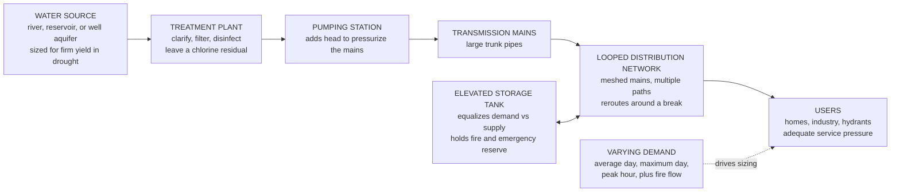

# 🚰 Water Supply and Distribution

> [!abstract] TL;DR
> Turn on any tap in a city and clean water gushes out at good pressure — any hour, any floor, even the twentieth. Behind that unremarkable miracle is a vast **pressurized network** of mains, pumps, and elevated tanks that must deliver *enough* water, to *everyone*, at *adequate pressure*, even in the middle of a fire when a hydrant suddenly demands a huge flow. The engineering hinges on a few coupled decisions: sizing the system for the right **demand** (not the average day but the **maximum day**, the **peak hour**, and the often-governing **fire flow**); arranging the pipes as a **looped mesh** rather than dead-end branches so water can reach any point by multiple paths and reroute around a broken main; adding **storage** (elevated tanks) to buffer the daily demand swing, hold a fire and emergency reserve, and steady the pumps; and then **solving the network** for flows and pressures. That last step is the beautiful part: it is exactly an electrical-circuit problem — flow is current, pressure head is voltage, pipe friction is resistance — solved historically by the iterative **Hardy Cross** loop-balancing method and today by computer models like EPANET. Reliable, safe water supply is foundational to public health (its arrival collapsed waterborne-disease rates), and aging pipes, leakage, contamination (Flint's lead), and drought make it one of the central infrastructure challenges of the century.

---

## Intuition

**Analogy — the tap is the visible tip of an invisible, pressurized nervous system, and its cleverness is that it is a *mesh*, not a *tree*.** We treat clean running water as a fact of nature, but every drop was pushed to your faucet through kilometres of buried pipe held at pressure so that the moment you open the valve, water is already there straining to get out. Now picture the network behind it. You could plumb a town like a **tree** — one trunk main branching into ever-smaller dead-end twigs — and it would work, until any single pipe broke and everyone *downstream* of the break went dry, or until the far twigs sat stagnant. Instead, good systems are looped into a **mesh**: every neighbourhood is fed from two or more directions at once. Close a main for a repair and the water simply flows the *other* way around the loop; nobody notices. That redundancy is the whole point.

And here is the lens that makes the mesh *solvable*: it behaves like an **electrical circuit**. Water **flow** through a pipe is like electric **current**; the **pressure head** at a junction is like **voltage**; pipe **friction** that eats head as water moves is like **resistance**; and the rule that flow in equals flow out at every junction is **Kirchhoff's current law**, while the rule that pressure drops sum to zero around any closed loop is **Kirchhoff's voltage law**. So "how do water and pressure distribute through this tangle of pipes?" is answered with the same network mathematics an electrical engineer uses on a resistor mesh — only the resistance is nonlinear (head loss grows roughly as flow squared) and the "current" is the most essential substance on Earth, delivered to millions, reliably, forever.

---

## How It Works

### Core Mechanics

1. **Find a source and check it can deliver — through a drought.** Water comes from **surface** sources (rivers, lakes, impounding reservoirs) or **groundwater** (wells tapping aquifers). The governing question is not the average yield but the **safe/firm yield** — how much the source can reliably supply through a multi-year drought of a chosen return period. A river that averages plenty can still fail in the dry season; storage reservoirs exist to carry water *over time* from wet months to dry.

2. **Treat it to a safe standard.** Raw water is clarified, filtered, and **disinfected** (typically with chlorine) to meet drinking-water standards, then a **disinfectant residual** is deliberately left in it so the water stays protected all the way through the pipes to the tap (see *Wastewater_and_Water_Treatment*).

3. **Estimate demand — and size everything for the *peaks*, not the average.** Demand starts from **per-capita use** (litres per person per day) times population, but the numbers that actually size pipes, pumps, and tanks are the *temporal peaks*: the **average day**, the **maximum day** (the busiest day of the year, often a hot dry day), the **peak hour** (the busiest hour, e.g. morning), and — critically — the **fire flow**: a large, short-duration hydrant demand that must be available *on top of* peak-hour domestic use. Fire flow frequently **governs** the sizing of mains and pumps in residential areas even though it is used only rarely.

4. **Pump it up to pressure.** **Pumps** add head (energy) to lift water into the network and hold it under pressure. A pump has a **head-vs-flow characteristic** (head falls as it delivers more flow); the operating point is where this curve meets the **system curve** (static lift plus friction, which rises with flow).

5. **Distribute through a *looped* pressurized network.** Water enters large **transmission mains** and spreads through **distribution mains** laid out as **looped/meshed** (preferred: multiple paths, reliable, no dead ends) or **branched** (cheaper, but dead-end and vulnerable). A minimum service pressure (commonly around 20–40 psi / ~140–275 kPa) must be maintained everywhere, with a higher minimum during fire flow.

6. **Add storage to decouple supply from demand.** **Elevated tanks** and reservoirs sit within the network and do four jobs at once: **equalize** the daily demand swing (fill at night when demand < supply, drain during peaks), **maintain pressure** (their water surface sets the hydraulic grade line), hold a **fire and emergency reserve**, and let the pumps run steadily near their efficient point instead of chasing every fluctuation.

7. **Solve the network for flows and pressures.** With demands, pipe sizes, and storage fixed, engineers solve for the **flow in every pipe** and the **pressure at every node** by enforcing **continuity at nodes** (flow in = flow out) and **head loss in pipes** (via **Hazen-Williams** or **Darcy-Weisbach**) summing to zero **around every loop**. The classic hand method is **Hardy Cross** (iteratively guess flows, compute the loop head imbalance, apply a correction, repeat until balanced); modern practice uses computer models such as **EPANET**.

### Flow / Architecture



---

## Key Concepts

### Secondary Level

**Where water comes from.** Two families of source: **surface water** (rivers, lakes, and human-built **reservoirs** that store wet-season water for the dry season) and **groundwater** (wells pumping from underground **aquifers**). Engineers must size the source for a **drought**, not an average year — the supply that can be trusted even in the worst dry spell is what counts (see *Hydrology_and_the_Water_Cycle*).

**Why we size for the busy times, not the average.** A town's water use is not steady. It is low at 3 a.m. and high at breakfast and dinner; it is higher on a hot dry day than a cool wet one. The system must handle the **peak hour** on the **maximum day** — and, on top of that, **fire flow**: when a fire breaks out, hydrants must suddenly deliver a *huge* flow. Fire flow is short but enormous, and it often decides how big the pipes and pumps must be.

**Looped pipes are more reliable than dead-end pipes.** A **branched** (tree) layout has dead ends: if a pipe breaks, everyone beyond it loses water, and dead-end water can go stale. A **looped** (mesh) layout feeds each area from more than one direction, so water can travel by another route if a pipe is shut off. Loops cost more pipe but are far more reliable — which is why cities prefer them.

**Storage tanks are the network's shock absorber.** The elevated water tank on the edge of many towns is not decoration. Its height gives the whole town its **pressure**, it **fills at night** and **empties during the busy hours** so the treatment plant can run steadily, and it keeps a **reserve** for fires and emergencies (like a power cut that stops the pumps).

**Solving the pipes is like solving a circuit.** Working out how much water goes down each pipe, and the pressure everywhere, is the same kind of puzzle as an electric circuit: **water flow is like electric current, pressure is like voltage, and pipe friction is like resistance.** The same balancing rules apply.

### Undergraduate Level

**Demand quantification and design factors.** Design starts from average per-capita demand $q$ (L/person/day) and population $P$, giving average-day flow $Q_{avg} = qP$. Peaks are obtained with **peaking factors**:
- Maximum day: $Q_{max\,day} = f_{md}\,Q_{avg}$, typically $f_{md} \approx 1.5$–$2.0$.
- Peak hour: $Q_{peak\,hr} = f_{ph}\,Q_{avg}$, typically $f_{ph} \approx 2.0$–$4.0$ (smaller for large populations, which average out).
- **Fire flow** $Q_f$ from empirical formulas (e.g. the Insurance Services Office / NFPA needed-fire-flow based on building area and construction), delivered for a required **duration**. The **design condition for distribution mains** is usually the greater of (peak-hour demand) or (**maximum-day demand + fire flow**) — the latter frequently governs.

**Head loss — the "resistance" of a pipe.** Two workhorse equations relate flow $Q$ to friction head loss $h_f$:
- **Darcy-Weisbach** (physically general): $h_f = f\dfrac{L}{D}\dfrac{V^2}{2g}$, with the friction factor $f$ from the Moody chart / Coleb/Swamee-Jain (the pipe-flow framework of [[Internal_and_Pipe_Flow]] and [[Momentum_Transport_and_Fluid_Flow]]).
- **Hazen-Williams** (empirical, water-only, popular in the industry): $h_f = \dfrac{10.67\,L}{C^{1.852} D^{4.87}}\,Q^{1.852}$ (SI), where $C$ is the roughness coefficient ($C\approx140$ new plastic/cement-lined, $\approx100$ old cast iron, dropping as pipes tuberculate). Both take the form $h_f = K\,Q^{n}$ — the nonlinear "Ohm's law" of a pipe.

**Governing network equations.** For a network, solve simultaneously:
- **Node continuity (mass conservation):** at each junction, $\sum Q_{in} = \sum Q_{out} + (\text{demand})$ — Kirchhoff's current law ([[Nodal_and_Mesh_Analysis]]).
- **Loop energy (head balance):** around any closed loop, $\sum h_f = 0$ — Kirchhoff's voltage law with nonlinear resistors ([[Circuit_Elements_and_Kirchhoffs_Laws]]).

**Hardy Cross method (loop-balancing).** Because head loss is nonlinear, the network is solved iteratively. Guess pipe flows satisfying continuity; for each loop compute the head imbalance and a **flow correction**
$$
\Delta Q = -\,\frac{\sum K\,Q\,|Q|^{\,n-1}}{\;n\sum K\,|Q|^{\,n-1}\;} = -\,\frac{\sum h_f}{\;n\sum (h_f/Q)\;},
$$
add $\Delta Q$ to every pipe in the loop (which *preserves* continuity), and repeat until the corrections vanish. It is Newton-Raphson applied loop-by-loop. Multi-loop systems correct each loop (with shared-pipe coupling) until all balance.

**Pump and system curves.** A pump supplies head that falls with flow, $H_p(Q)$; the network demands head $H_{sys}(Q) = H_{static} + K_{sys}Q^{2}$ that rises with flow. The **operating point** is their intersection. Storage tanks let a pump sit near its best-efficiency point while the tank absorbs demand swings, rather than the pump throttling up and down all day.

**Pressure requirements.** Codes set a **minimum service pressure** under peak-hour demand (commonly ~20 psi / 140 kPa minimum, ~40–60 psi / 275–415 kPa desirable) and a **minimum residual pressure during fire flow** (often ≥20 psi so hydrant flow does not collapse the system or suck in contamination).

### Graduate Level

**Modern network solvers — global methods.** Hardy Cross is pedagogically perfect but slow and can converge poorly on large, looped systems. Production tools (**EPANET** and its engine inside most commercial packages) solve the coupled continuity + energy equations **simultaneously** using the **global gradient algorithm (Todini-Pilati)** — a Newton method on the full system that alternates between updating heads and flows and converges quadratically. The unknowns are nodal heads and pipe flows; the Jacobian is sparse and symmetric-positive-definite, exploiting the same graph structure as nodal circuit analysis. **Extended-period simulation (EPS)** chains many steady-state solves over a 24-hour demand pattern, tracking tank levels, pump schedules, and energy use.

**Water-hammer and transient analysis.** Steady solvers assume constant flow. Rapid valve closure or pump trip launches **transient pressure waves** (water hammer): the Joukowsky surge $\Delta H = \dfrac{a\,\Delta V}{g}$ (with wave speed $a\sim 1000$ m/s) can spike pressures enough to burst mains or, on the *low* side, drop below vapor pressure and cause **column separation** and cavitation. Transient design uses the method of characteristics, surge tanks, air chambers, slow-closing valves, and soft-start pumps.

**Water quality in distribution — the hidden second problem.** Delivering *enough* water at *pressure* is only half the job; keeping it *safe* to the tap is the other half:
- **Disinfectant residual and water age.** Chlorine decays over time and distance; long residence in oversized mains and tank "dead zones" raises **water age**, letting residual disappear, **disinfection by-products** (trihalomethanes) form, and — with chloramine systems — **nitrification** flare up. Ironically, sizing pipes and tanks for rare fire flows creates oversized, slow-moving water that ages badly.
- **Backflow and cross-connections.** If network pressure drops (a main break, a hydrant draw, a pump trip), a **cross-connection** to a contaminated source can **back-siphon** pollutants into the drinking water. Backflow preventers and maintained positive pressure are the defenses — this is a direct public-health control ([[Public_Health_and_Epidemiology]]).
- **Pipe materials, corrosion, and Flint.** Iron mains **corrode and tuberculate** (raising head loss, dropping $C$); lead service lines and lead solder can leach **lead** into the water. The **Flint, Michigan crisis (2014–)** was fundamentally a *distribution water-quality* failure: a switch to more corrosive source water without proper **corrosion-control** (orthophosphate) treatment stripped protective scale off lead service lines and released lead into homes ([[Environmental_Health_and_Toxicology]]).

**Non-revenue water and aging infrastructure.** **Leakage** and unbilled use — **non-revenue water (NRW)** — routinely reach 15–40% of supply, wasting treated water and energy and drawing in contamination through leaks under low pressure. With much of the developed world's pipe network laid 50–100+ years ago, **asset management** (see *Infrastructure_Resilience_and_Asset_Management*) — condition assessment, leak detection (acoustic, pressure-transient), **district metered areas**, **pressure management**, and prioritized renewal — is now a core discipline. Under climate-driven **drought and scarcity**, conservation, reuse, and demand management turn water supply from a purely hydraulic problem into a sustainability and equity one (see *Environmental_Engineering_and_Pollution_Control*).

---

## Python Demo

```python
# Water Supply & Distribution -- two core analyses:
#   (a) LOOPED PIPE-NETWORK analysis by the HARDY CROSS method (Hazen-Williams
#       head loss), directly analogous to solving an electrical circuit:
#       flow ~ current, head ~ voltage, friction ~ resistance. We solve a
#       single-loop network A-B-C-D fed from a tank at A, then CLOSE a main and
#       show the looped network REROUTES water and pressure adjusts.
#   (b) DIURNAL DEMAND vs steady SUPPLY, and how a STORAGE tank buffers the
#       daily peaks and must also hold a FIRE reserve.
# numpy + matplotlib only.
import numpy as np
import matplotlib.pyplot as plt

# ==================================================================
# (a) HARDY CROSS -- single loop A -> B -> C -> D -> A (clockwise +ve)
# ==================================================================
n_hw = 1.852                                   # Hazen-Williams flow exponent

def hw_K(L, D, C):                             # HW resistance constant (SI, Q in m^3/s)
    return 10.67 * L / (C**1.852 * D**4.87)

# pipes oriented from->to; loop order AB, BC, CD, DA
pipe_data = [("AB", 600, 0.30, 120),
             ("BC", 600, 0.25, 120),
             ("CD", 600, 0.20, 120),
             ("DA", 600, 0.25, 120)]
names = [p[0] for p in pipe_data]
K = np.array([hw_K(L, D, C) for (_, L, D, C) in pipe_data])

Q_in   = 0.10                                  # supply into tank/node A [m^3/s] (avg-day)
dem    = {"B": 0.030, "C": 0.040, "D": 0.030}  # nodal demands, sum = 0.10

def continuity_flows(Q_AB):                    # propagate a guess around the loop
    Q_BC = Q_AB - dem["B"]
    Q_CD = Q_BC - dem["C"]
    Q_DA = Q_CD - dem["D"]                      # then Q_AB - Q_DA == Q_in automatically
    return np.array([Q_AB, Q_BC, Q_CD, Q_DA])

def signed_hl(Q):                              # signed head loss per pipe (clockwise +ve)
    return K * np.sign(Q) * np.abs(Q)**n_hw

def hardy_cross(Q, tol=1e-9, itmax=100):
    for _ in range(itmax):
        hl  = signed_hl(Q)
        num = hl.sum()                                     # loop head imbalance
        den = n_hw * np.sum(K * np.abs(Q)**(n_hw - 1))     # sum |dh/dQ|
        dQ  = -num / den
        Q   = Q + dQ                                       # correction preserves continuity
        if abs(dQ) < tol:
            break
    return Q

def node_heads(Q, H_A=60.0):                   # HGL [m] from a fixed source head at A
    hl = signed_hl(Q)                          # 0=AB, 1=BC, 2=CD, 3=DA
    H = {"A": H_A}
    H["B"] = H["A"] - hl[0]                     # A -> B
    H["C"] = H["B"] - hl[1]                     # B -> C
    H["D"] = H["A"] + hl[3]                     # pipe DA is D->A, so A->D flips the sign
    return H

# --- looped network solution ---
Q_loop = hardy_cross(continuity_flows(0.06))
H_loop = node_heads(Q_loop)

# --- pipe CD taken out of service: loop opens into a branched tree ---
# continuity now forces every flow (C fed only via B, D fed only via A):
Q_closed = np.array([dem["B"] + dem["C"],      # AB = 0.070
                     dem["C"],                 # BC = 0.040 (all of C the long way)
                     0.0,                      # CD = 0 (closed)
                     -dem["D"]])               # DA = -0.030 (flow A->D)
H_closed = node_heads(Q_closed)

print("HARDY CROSS -- looped network (converged):")
for nm, q in zip(names, Q_loop):
    print(f"  pipe {nm}: Q = {q*1000:+6.1f} L/s")
print("  node heads (HGL, m):",
      {k: round(v, 2) for k, v in H_loop.items()})
print("\nMain CD CLOSED -- water reroutes (branched tree):")
for nm, q in zip(names, Q_closed):
    print(f"  pipe {nm}: Q = {q*1000:+6.1f} L/s")
print("  node heads (HGL, m):",
      {k: round(v, 2) for k, v in H_closed.items()})
print(f"  --> pressure head at far node C drops "
      f"{H_loop['C'] - H_closed['C']:.2f} m when the loop is broken")

# ==================================================================
# (b) DIURNAL DEMAND vs STEADY SUPPLY + STORAGE buffering
# ==================================================================
hours = np.linspace(0, 24, 24*4 + 1)           # 15-min resolution
shape = (0.55
         + 0.85*np.exp(-((hours - 7.5)/2.0)**2)     # morning peak
         + 1.00*np.exp(-((hours - 18.5)/2.5)**2)    # evening peak
         + 0.20*np.exp(-((hours - 12.5)/3.0)**2))   # midday bump
shape = shape / np.trapz(shape, hours) * 24    # normalize: daily-average multiplier = 1
PHF   = shape.max()                            # peak-hour factor

Q_avg    = 0.10                                # average-day demand [m^3/s]
demand_t = Q_avg * shape                       # instantaneous demand [m^3/s]
supply_t = np.full_like(hours, Q_avg)          # steady treatment/pump supply

net  = supply_t - demand_t                     # +ve = tank filling
stor = np.concatenate(([0.0],
        np.cumsum((net[:-1] + net[1:]) / 2 * np.diff(hours) * 3600)))  # m^3
stor -= stor.min()                             # shift so worst point = empty
oper_storage = stor.max()                      # equalizing/operational storage [m^3]

Q_fire, t_fire = 0.25, 2.0                      # fire flow [m^3/s] for [h]
V_fire = Q_fire * t_fire * 3600                 # required fire reserve [m^3]

print(f"\nDIURNAL DEMAND: peak-hour factor = {PHF:.2f}  "
      f"(peak-hour demand = {PHF*Q_avg*1000:.0f} L/s)")
print(f"  operational (equalizing) storage needed = {oper_storage:,.0f} m^3")
print(f"  fire reserve ({Q_fire*1000:.0f} L/s for {t_fire:.0f} h) = {V_fire:,.0f} m^3")
print(f"  total tank sizing ~ operational + fire + emergency "
      f">= {oper_storage + V_fire:,.0f} m^3")

# ==================================================================
# PLOTS
# ==================================================================
fig, ax = plt.subplots(1, 3, figsize=(16, 5))

# --- (a1) pipe flows: looped vs closed (rerouting) ---
x = np.arange(len(names))
w = 0.38
ax[0].bar(x - w/2, Q_loop*1000,   w, color="#2563eb", label="looped (all mains open)")
ax[0].bar(x + w/2, Q_closed*1000, w, color="#dc2626", label="main CD closed")
ax[0].axhline(0, color="k", lw=0.8)
ax[0].set_xticks(x); ax[0].set_xticklabels(names)
ax[0].set_xlabel("pipe"); ax[0].set_ylabel("flow  [L/s]   (sign = direction)")
ax[0].set_title("(a) Hardy Cross: a looped network\nREROUTES when a main is closed")
ax[0].legend(fontsize=8); ax[0].grid(alpha=0.3, axis="y")

# --- (a2) node pressure heads: looped vs closed ---
nodes = ["A", "B", "C", "D"]
Hl = [H_loop[k]   for k in nodes]
Hc = [H_closed[k] for k in nodes]
ax[1].bar(np.arange(4) - w/2, Hl, w, color="#2563eb", label="looped")
ax[1].bar(np.arange(4) + w/2, Hc, w, color="#dc2626", label="CD closed")
ax[1].set_ylim(min(Hc) - 2, 62)
ax[1].set_xticks(np.arange(4)); ax[1].set_xticklabels(nodes)
ax[1].set_xlabel("node"); ax[1].set_ylabel("hydraulic grade line  [m]")
ax[1].set_title("(b) Node pressures\nfar node loses head when the loop breaks")
ax[1].legend(fontsize=8); ax[1].grid(alpha=0.3, axis="y")

# --- (b) diurnal demand + storage ---
ax2 = ax[2]
ax2.plot(hours, demand_t*1000, color="#0891b2", lw=2.4, label="demand")
ax2.plot(hours, supply_t*1000, color="#16a34a", lw=2.0, ls="--", label="steady supply")
ax2.fill_between(hours, supply_t*1000, demand_t*1000,
                 where=(demand_t > supply_t), color="#f59e0b", alpha=0.25,
                 label="tank draining (peak)")
ax2.fill_between(hours, supply_t*1000, demand_t*1000,
                 where=(demand_t <= supply_t), color="#3b82f6", alpha=0.20,
                 label="tank filling (night)")
ax2.set_xlabel("hour of day"); ax2.set_ylabel("flow  [L/s]", color="#0891b2")
ax2.set_title("(c) Diurnal demand vs supply\nstorage buffers the peaks")
ax2.set_xlim(0, 24); ax2.set_xticks(range(0, 25, 4))
ax2.legend(fontsize=8, loc="upper left"); ax2.grid(alpha=0.3)

ax3 = ax2.twinx()
ax3.plot(hours, stor, color="#7c3aed", lw=2.2)
ax3.set_ylabel("stored volume  [m^3]", color="#7c3aed")
ax3.annotate(f"operational\nstorage\n{oper_storage:,.0f} m^3",
             xy=(hours[np.argmax(stor)], stor.max()),
             xytext=(2, stor.max()*0.55), fontsize=8, color="#7c3aed",
             arrowprops=dict(arrowstyle="->", color="#7c3aed"))

plt.tight_layout()
plt.savefig("water_supply_and_distribution.png", dpi=150)
plt.show()
```

**Expected output (approximate):**

```
HARDY CROSS -- looped network (converged):
  pipe AB: Q =  +62.3 L/s
  pipe BC: Q =  +32.3 L/s
  pipe CD: Q =   -7.7 L/s
  pipe DA: Q =  -37.7 L/s
  node heads (HGL, m): {'A': 60.0, 'B': 58.11, 'C': 56.66, 'D': 56.66}
Main CD CLOSED -- water reroutes (branched tree):
  pipe AB: Q =  +70.0 L/s
  pipe BC: Q =  +40.0 L/s
  pipe CD: Q =   +0.0 L/s
  pipe DA: Q =  -30.0 L/s
  node heads (HGL, m): {'A': 60.0, 'B': 57.65, 'C': 55.5, 'D': 57.02}
  --> pressure head at far node C drops ~1.2 m when the loop is broken
```

Panel (a) is the headline: in the **looped** network, node C is fed from *both* sides (pipe CD even carries a small reverse flow, D→C), so no pipe is overloaded. **Close main CD** and continuity forces *all* of C's water the long way around A→B→C — pipes AB and BC pick up the slack (flows jump), pipe DA reverses to feed D, and the far node's pressure sags. That is a looped network *rerouting*, exactly like current finding a new path in a resistor mesh. Panel (b) shows the resulting node pressures. Panel (c) shows why storage exists: a **steady** supply cannot follow the twin morning/evening demand peaks, so an **elevated tank** fills at night (blue) and drains during the peaks (orange); its **operational storage** is the running deficit, and a real tank must add a **fire reserve** ($Q_{fire}\times t_{fire}$) and an emergency reserve on top.

---

## Real-World Applications

> **EPANET and the modern water utility.** Virtually every water utility runs a calibrated hydraulic model of its network in **EPANET** (the free US-EPA engine) or a commercial package built on it (WaterGEMS, InfoWater). Engineers use it to size new mains, check fire-flow availability at any hydrant, plan pump schedules to cut energy cost (pumping is often a utility's largest electricity bill), locate low-pressure zones, and — after the Hardy Cross era — to run **extended-period simulations** tracking tank levels and water age over a 24-hour cycle. It is the direct computational descendant of the loop-balancing method in the demo.

> **Elevated water towers as the pressure reference.** The ubiquitous water tower is a piece of hydraulic genius: its water surface elevation *sets* the hydraulic grade line for the whole zone, so pressure is maintained even if the pumps stop. It fills overnight when demand is low and the pumps run steadily at their efficient point, then supplies the morning and evening peaks — decoupling a smoothly running treatment plant from a spiky, human demand pattern, and holding a reserve for fire and power outages.

> **Fire flow governing residential main sizing.** In low-density residential areas, average domestic demand would only justify small pipes — but code-required **fire flow** (often 1,000–3,500+ gpm for a couple of hours at ≥20 psi residual) forces mains up to 150–200 mm (6–8 in) minimum and dictates hydrant spacing and looping. This is a classic case of a *rare* load governing the design of *everyday* infrastructure, exactly as fire and seismic loads govern structural design.

> **The Flint water crisis (2014).** A textbook *distribution* water-quality failure. Switching the source to more corrosive Flint River water **without corrosion-control treatment** destabilized the protective scale inside aging **lead** service lines and mains, leaching lead into tap water and triggering a Legionella outbreak. It is a stark reminder that a network can deliver plenty of water at good pressure and still poison people if pipe-material chemistry and residual management are neglected.

> **Non-revenue water and pressure management.** Utilities from London to Manila run **district metered areas (DMAs)** and active **pressure management** to attack **non-revenue water**: by lowering excess night pressure they cut both leakage volume and new pipe bursts, saving treated water, energy, and money. Acoustic and transient-based **leak detection** pinpoints losses in networks where 20–40% of treated water can otherwise vanish underground.

---

## Common Pitfalls

- **Designing for average demand instead of the peaks.** The average day never sizes anything. Mains, pumps, and tanks must handle the **peak hour** on the **maximum day**, and distribution mains usually the greater of that or **maximum-day + fire flow**. Sizing to the average leaves a system that browns out every dinnertime and cannot fight a fire.
- **Forgetting fire flow — or forgetting the residual-pressure floor during it.** Fire flow is a huge short-duration draw that often *governs* pipe and pump size; ignoring it undersizes the network. Equally, fire flow must be delivered while keeping ≥~20 psi everywhere — if pressure collapses, hydrants starve *and* contamination can be sucked in through leaks.
- **Building dead-end (branched) networks where looping is warranted.** Dead ends mean single points of failure (one break isolates everyone downstream) and stagnant water that loses disinfectant residual and grows biofilm. Loop the mains: multiple paths give reliability and keep water moving.
- **Oversizing pipes "for the future," creating water-age problems.** The instinct to lay big pipes backfires: oversized mains and tanks slow the water down, raising **water age**, letting chlorine residual decay, disinfection by-products form, and nitrification set in. Hydraulic capacity and water quality are in tension and must be balanced.
- **Ignoring pipe-material chemistry and corrosion control (the Flint lesson).** Changing source water, or simply aging lead/iron pipe, can leach lead or shed iron unless **corrosion-control** treatment (pH/alkalinity adjustment, orthophosphate) maintains a stable protective scale. Hydraulics is necessary but not sufficient — the water must stay *safe* to the tap.
- **Analyzing steady flow only and neglecting transients (water hammer).** A fast valve closure or pump trip can send pressure surges that burst mains or draw the pressure below vapor pressure. Rapid operations need surge analysis, slow-closing valves, air chambers, or soft-start pumps.
- **Treating leakage/non-revenue water as an afterthought.** Uncontrolled leakage wastes 20–40% of treated water and energy, and leaks under transient low pressure are contamination entry points. Pressure management, DMAs, and proactive leak detection belong in the design and operation from the start.
- **Trusting an uncalibrated model.** A Hardy Cross or EPANET result is only as good as its inputs — assumed pipe roughness $C$ drifts as pipes tuberculate, demands are estimates, and closed/throttled valves are often undocumented. Models must be **calibrated** against field pressure and flow measurements before decisions ride on them.

---

## Related Concepts

Within the Civil Engineering water & environmental group, this note is the *delivery* half of the urban water cycle and connects tightly to its siblings (prose references, same folder): **Hydraulics_and_Open_Channel_Flow** supplies the pressurized-pipe and open-channel flow theory (head loss, energy grade line) that the network math is built on; **Hydrology_and_the_Water_Cycle** determines the *source* — how much water rivers and aquifers can reliably yield, and how droughts constrain supply; **Wastewater_and_Water_Treatment** covers the *treatment* stage upstream of distribution and the disinfectant residual carried into the pipes; **Environmental_Engineering_and_Pollution_Control** frames water quality, conservation, reuse, and scarcity in the broader environmental context; and **Infrastructure_Resilience_and_Asset_Management** addresses the aging-pipe, leakage, and renewal challenge that dominates real utilities.

Cross-vault connections (Glob-verified to exist):

- [[Internal_and_Pipe_Flow]] — the mechanical-engineering foundation for pipe friction, the Darcy-Weisbach equation, and the Moody chart that underpin distribution head loss.
- [[Momentum_Transport_and_Fluid_Flow]] — the chemical-engineering transport view of the same friction physics: momentum loss, laminar/turbulent regimes, and the friction factor.
- [[Pumps_Compressors_and_Turbines]] — pump head-vs-flow characteristics, the system curve, the operating point, and pump efficiency that govern how water is pressurized into the network.
- [[Circuit_Elements_and_Kirchhoffs_Laws]] — the direct analogy: node continuity is Kirchhoff's current law and loop head balance is Kirchhoff's voltage law, with pipe friction as (nonlinear) resistance.
- [[Nodal_and_Mesh_Analysis]] — the electrical solution methods (nodal/mesh) that mirror how EPANET and Hardy Cross solve for network heads and flows.
- [[Public_Health_and_Epidemiology]] — why reliable safe water supply is foundational: clean distribution collapsed waterborne-disease rates, and backflow/contamination is a public-health hazard.
- [[Environmental_Health_and_Toxicology]] — the toxicology behind distribution water-quality failures such as lead leaching (Flint) and disinfection by-products.

---

## Review Questions

1. **(Secondary)** A small town lays its water pipes as a single trunk main with dead-end branches to save money. (a) Explain two problems this "branched" layout causes — one about reliability when a pipe breaks, and one about water sitting in the dead ends. (b) How does arranging the pipes in **loops** fix both problems? (c) Why must the town's pipes and pumps be sized for a *fire* even though fires are rare?

2. **(Undergraduate)** A residential zone has an average-day demand of 40 L/s. Using a maximum-day factor of 1.8 and a peak-hour factor of 3.0: (a) compute the maximum-day and peak-hour demands. (b) The required fire flow is 90 L/s for 2 hours. State the two candidate design flows for the distribution mains (peak-hour demand vs. maximum-day + fire flow) and say which one governs. (c) Using Hazen-Williams $h_f = 10.67\,L\,Q^{1.852}/(C^{1.852}D^{4.87})$, explain qualitatively what happens to the head loss (and thus the pressure delivered) in a 200 mm cast-iron main as it ages and its roughness coefficient $C$ falls from 130 to 90.

3. **(Graduate)** You model a looped distribution network in EPANET and, during a fire-flow scenario at a hydrant, the far end of the zone drops to 12 psi. (a) Explain, using continuity and loop head-balance, why closing one main for repair *and* drawing fire flow can jointly cause this, and how the looped topology partially mitigates it. (b) Your utility proposes lowering system pressure at night to cut leakage (non-revenue water). Discuss the trade-off between reduced leakage/bursts and the risk of dropping below the residual-pressure floor, including the backflow-contamination hazard. (c) Relating to the Flint crisis, explain why a change that improves or leaves hydraulics unchanged can still cause a severe *water-quality* failure in the distribution system, and what treatment safeguard was missing.

---

## Sources

- Mays, L. W. (ed.) — *Water Distribution Systems Handbook* (McGraw-Hill) — comprehensive reference on distribution system design, hydraulics, storage, and operation.
- Davis, M. L. & Cornwell, D. A. — *Introduction to Environmental Engineering*, 5th ed. (McGraw-Hill) — water demand, sources, distribution, and quality fundamentals.
- American Water Works Association (AWWA) — *Water Distribution Operator Training Handbook*, 4th ed. — practical operations, mains, storage, pressure, and water-quality management.
- Walski, T. M., Chase, D. V., Savic, D. A., et al. — *Advanced Water Distribution Modeling and Management* (Bentley/Haestad Press) — network modeling, EPANET, calibration, and transients.
- Rossman, L. A. — *EPANET 2 Users Manual* (US EPA) — the reference implementation of the global-gradient network solver used across the industry.

---

#civil-engineering #water-supply #distribution-network #hardy-cross #fire-flow
