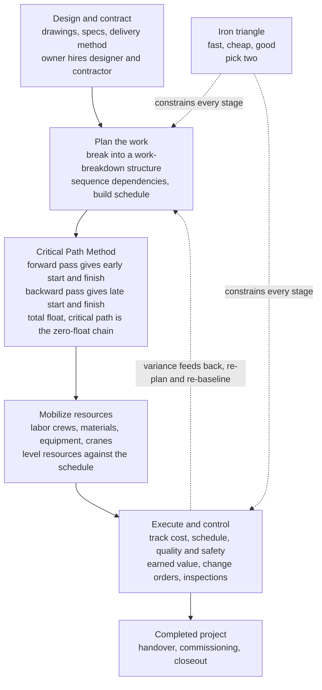

# 🏗️ Construction Engineering and Management

> [!abstract] TL;DR
> A beautiful design on paper is **worthless until someone actually builds it** — on time, on budget, and without anyone getting hurt — and doing *that* turns out to be its own enormous engineering discipline. **Construction engineering and management (CEM)** is the field that orchestrates a *temporary army* of hundreds of workers, dozens of subcontractors, mountains of material, and fleets of machines into a precisely-sequenced dance that raises a building, bridge, or highway. Its permanent adversary is the **iron triangle** — you want the project **fast, cheap, and good**, but you can rarely have all three, so managing scope, **time**, **cost**, and **quality** (with **safety** paramount) is a constant negotiated tradeoff. The intellectual core is a stunningly simple, powerful idea: break the job into a **work-breakdown structure** of activities, wire up their **dependencies**, and then find the one chain of tasks that — end to end — actually *determines the finish date*. That chain is the **critical path** (the longest path through the project network), computed by the **Critical Path Method (CPM)**: a forward pass gives each task its **early** start/finish, a backward pass gives its **late** start/finish, and the difference is **total float** (slack). Tasks with **zero float lie on the critical path** — delay any one of them and the whole project slips, while off-critical tasks have slack to spare. When a deadline must be pulled in, engineers **crash** the critical path — spend extra money to shorten its tasks — trading dollars for days along a **time-cost curve**, and they watch cost-versus-progress with **earned-value management (EVM)** (planned value vs earned value vs actual cost, yielding schedule and cost variances and the SPI/CPI performance indices). Around this scheduling spine sit **project delivery and contracts** (design-bid-build, design-build, CM-at-risk, public-private partnerships; lump-sum, unit-price, cost-plus), **estimating and bidding** (quantity takeoff), **construction methods and equipment** (earthmoving, formwork, cranes), **lean construction**, and the modern technology stack — **BIM**, scheduling software, drones, and modular prefabrication. It matters because construction is a huge slice of the economy and the step where *all* engineering design finally succeeds or fails in the physical world: cost and schedule overruns are endemic — megaprojects routinely blow both — and the CPM/critical-path and earned-value tools are what actually deliver infrastructure. CEM is the practical **capstone that gets things built**, where engineering meets management, economics, and human coordination.

---

## Intuition

**Analogy — a brilliant blueprint is just expensive paper until an army of people, machines, and materials turns it into steel and concrete, on a deadline, for a fixed pot of money, without anyone falling off the building.** Think of staging an enormous theatrical production. You have a script (the design), a fixed opening night (the deadline), a budget the producer will not exceed, and a stage crew of hundreds — carpenters, electricians, riggers — plus trucks of lumber and lighting that must arrive in exactly the right order. You cannot pour the concrete floor before the underground pipes are laid, you cannot hang the doors before the walls stand, and every one of those trades wants the stage at once. **Construction management is the art of choreographing that chaos** — deciding what happens when, who does it, what must finish before the next thing can start, and where the money and machines go — so that the curtain rises on time.

Now the crucial insight: in that tangle of hundreds of tasks, **only one particular chain of them actually decides opening night.** Some jobs have breathing room — the painters can start a few days late and no one notices, because they were waiting on someone else anyway. But other jobs are links in an unbroken chain from the first shovel to the final inspection, and **if any single link slips a day, the whole show slips a day.** That make-or-break chain is the **critical path**, and the tasks on it have zero slack — zero **float**. Everything else has float to spare. Master builders live and die by knowing exactly which tasks are on that chain, because that is where every ounce of attention, overtime, and money must go. And when the producer demands the show open *sooner*, you cannot speed up just anything — you must pour money specifically into the critical chain to **crash** it, trading dollars for days. Construction management is engineering applied to the messy, human, time-and-money reality of making a design real.

---

## How It Works

### Core Mechanics

1. **Start from a design and a contract.** An **owner** commissions a facility, a **designer** (architect/engineer) produces drawings and specifications, and a **contractor** agrees to build it under a chosen **delivery method** and **contract type**. This defines *scope* — the thing to be built — and sets the legal and financial rules of the game before a single shovel moves.

2. **Decompose the work (Work-Breakdown Structure).** The whole project is broken top-down into manageable **activities** — excavate, pour foundation, erect steel, rough-in electrical — each with an estimated **duration**, a cost, and required resources. The WBS turns an overwhelming whole into a countable list of tasks you can schedule, price, and assign.

3. **Wire up the dependencies.** Activities are linked by **precedence relations**: *finish-to-start* (you cannot frame the roof until the walls are up), and less commonly start-to-start or finish-to-finish. The result is a directed **project network** (an activity-on-node graph) — a map of what must come before what.

4. **Compute the schedule with CPM (forward pass).** Sweep the network from start to finish computing each activity's **Early Start (ES)** = the latest early-finish of its predecessors, and **Early Finish (EF)** = ES + duration. The largest EF in the network is the **project duration** — the soonest the whole job can finish.

5. **Compute the deadlines (backward pass).** Sweep back from the end, setting **Late Finish (LF)** = the earliest late-start of its successors (the project end for the last activity), and **Late Start (LS)** = LF - duration. LS/LF are the *latest* an activity can happen without delaying the project.

6. **Find the float and the critical path.** **Total float** = LS - ES = LF - EF is the slack each activity has. Activities with **zero total float** cannot slip at all — they form the **critical path**, the longest chain through the network, which *is* the project duration. Delay any critical activity and the whole project slips by the same amount; off-critical activities can absorb delay up to their float.

7. **Accelerate by crashing (time-cost tradeoff).** To finish sooner you must shorten the **critical path**, and only the critical path — speeding up a task with float buys nothing. Each activity has a **normal** and a shorter **crash** duration at a higher cost (extra crews, overtime, night shifts). You crash the **cheapest** critical activity first, watching for parallel paths that become critical, tracing a **time-cost curve**. Because on-site **indirect/overhead** cost accrues per day, total cost is a **U-shape** with an economically **optimal project duration**.

8. **Control cost and schedule with earned value.** As work proceeds you compare three curves: **Planned Value (PV)** — budgeted cost of scheduled work; **Earned Value (EV)** — budgeted cost of work *actually done*; and **Actual Cost (AC)** — what was really spent. **Schedule Variance** SV = EV - PV and **Cost Variance** CV = EV - AC (with indices SPI = EV/PV, CPI = EV/AC) tell you, early, whether you are behind and over budget — and forecast the final cost.

9. **Deliver — manage resources, quality, and safety throughout.** Cranes, formwork, and earthmoving equipment are mobilized and **resource-leveled** against the schedule; **quality control/assurance** inspects materials and work; **safety** (construction is among the most dangerous industries) governs everything via hazard control and OSHA compliance; **change orders and claims** absorb the inevitable surprises until handover and closeout.

### Flow / Architecture



---

## Key Concepts

### Secondary Level

- **Building is its own engineering job.** Designing a bridge and actually *building* it are two different skills. Construction management is the discipline of turning drawings into a real structure — getting the right people, materials, and machines to the right place at the right time.
- **The iron triangle: fast, cheap, good — pick two.** Every project juggles three demands: finish **quickly**, spend **little**, and build it **well**. Push hard on one and the others suffer. Rushing a job (fast) usually costs more (not cheap) or risks quality; doing it cheaply may make it slow or shoddy. Managing that tension is the manager's core job.
- **Break the big job into small tasks.** No one can plan "build a hospital" as one lump. You split it into hundreds of small jobs — dig the hole, pour the base, put up the frame — each with a length of time it takes.
- **Some tasks must wait for others.** You cannot put the roof on before the walls are up. These "must-come-before" rules chain the tasks together, and figuring out the order is most of the planning.
- **The critical path is the chain that sets the finish date.** In all those tasks, one particular chain, from start to end, is the *longest* and decides when the whole project finishes. Delay any task on that chain and the whole project is late. Tasks *not* on it have some spare time ("**float**" or slack) and can slip a little without hurting.
- **Safety comes first, always.** Construction sites are dangerous — heights, heavy machines, deep trenches. No schedule or budget is worth a life, so safety rules govern everything.

### Undergraduate Level

- **Work-Breakdown Structure (WBS) and the project network.** The project is decomposed hierarchically into **activities** with durations and resource needs, then linked by **precedence** (usually finish-to-start) into a directed acyclic **activity-on-node** network. This graph is the object every scheduling method operates on.
- **The Critical Path Method (CPM) — four numbers per activity.** A **forward pass** computes **Early Start** ES = max(EF of predecessors) and **Early Finish** EF = ES + d. A **backward pass** computes **Late Finish** LF = min(LS of successors) and **Late Start** LS = LF - d. **Total float** TF = LS - ES = LF - EF. The **critical path** is the connected chain of **TF = 0** activities; its length equals the project duration. **Free float** (delay possible without disturbing *any* successor's ES) is a stricter, per-activity slack.
- **PERT and uncertainty.** Where durations are uncertain, **PERT** models each with an **optimistic (a), most-likely (m), pessimistic (b)** estimate, taking mean $\mu = (a + 4m + b)/6$ and variance $\sigma^2 = ((b-a)/6)^2$. Summing means and variances along the critical path gives a **probabilistic completion date** — a normal distribution you can put confidence bounds on, unlike CPM's single deterministic number.
- **Gantt charts and resource leveling.** A **Gantt (bar) chart** plots each activity as a bar on a timeline — intuitive but hiding dependencies. **Resource leveling/smoothing** shifts non-critical activities within their float to flatten peaks in labor or equipment demand, respecting the schedule.
- **Crashing and the time-cost tradeoff.** Each activity has a **normal** duration/cost and a **crash** (minimum) duration/higher cost, defining a **cost slope** $= (\text{crash cost} - \text{normal cost}) / (\text{normal} - \text{crash duration})$ in dollars per day saved. To shorten the project, crash the **least-cost critical activity** first; when multiple critical paths appear, all must be shortened together. Adding **indirect (overhead) cost** per day makes total cost U-shaped with an **optimal duration**.
- **Earned-Value Management (EVM).** Track **PV** (planned value / BCWS), **EV** (earned value / BCWP), **AC** (actual cost / ACWP). **SV = EV - PV**, **CV = EV - AC**; **SPI = EV/PV** (< 1 behind schedule), **CPI = EV/AC** (< 1 over budget). Forecast the final cost with **EAC = BAC / CPI** (BAC = budget at completion). EVM catches trouble *early*, when there is still time to react.
- **Delivery methods and contracts.** **Design-Bid-Build** (sequential, low-bid, owner holds design risk), **Design-Build** (single entity designs and builds, faster, single point of accountability), **CM-at-Risk** (construction manager gives a guaranteed maximum price), **P3** (public-private partnership, private finance/operate). **Contract types** trade risk: **lump-sum** (fixed price, contractor bears overrun risk), **unit-price** (paid per measured quantity), **cost-plus** (owner reimburses cost plus fee, owner bears overrun risk). **Estimating** starts from a **quantity takeoff** priced with labor, material, and equipment rates.

### Graduate Level

- **The critical path is a longest-path problem on a DAG.** CPM's forward pass is exactly a **longest-path** computation on a directed acyclic graph (durations as edge/node weights), solvable in $O(V + E)$ by topological order — the same algorithmic machinery as shortest paths with negated weights. Total float is the classic **slack** of that longest-path relaxation; the set of zero-slack nodes is the critical path, generally **not unique** and often multiple parallel paths.
- **Resource-Constrained Project Scheduling (RCPSP).** Pure CPM assumes unlimited resources. Real projects cap crews, cranes, and cash, making the problem the **NP-hard RCPSP**: minimize makespan subject to precedence *and* renewable-resource limits. Formulated as an **integer/mixed-integer program** (time-indexed or event-based) and attacked with branch-and-bound, priority-rule heuristics, or metaheuristics. Resource contention can make the "critical" activities differ from the CPM critical path (the **critical chain**, per Goldratt, buffers the resource-constrained chain).
- **Optimal crashing as linear programming.** Minimum-cost time-cost tradeoff is a **linear program**: minimize total crash cost subject to each activity's crashable range and the constraint that every path's crashed length is at most the target deadline. Its **dual** is a **minimum-cut / network-flow** problem — shortening the project by one day costs the minimum **cut** of the critical subnetwork (Fulkerson's parametric method), a clean piece of combinatorial optimization underneath the practical rule "crash the cheapest critical activity."
- **PERT's bias and its fixes.** PERT computes completion statistics along a *single* critical path, systematically **underestimating** duration because it ignores that a near-critical parallel path can become the binding one under randomness (**merge-event bias**). **Monte-Carlo simulation** of the whole network (sampling every activity duration, recomputing the critical path each trial) gives the true completion distribution and a **criticality index** — the fraction of simulations in which each activity is critical — a far more honest picture than a single deterministic path.
- **Earned-value forecasting and its assumptions.** **EAC = BAC / CPI** assumes past cost efficiency persists; **EAC = AC + (BAC - EV)/(CPI × SPI)** weights both schedule and cost performance; the **To-Complete Performance Index** TCPI = (BAC - EV)/(BAC - AC) is the efficiency required to still hit budget. **Earned Schedule** (ES) fixes EVM's blind spot that SV collapses to zero at project end regardless of lateness, by measuring schedule variance in *time* rather than cost units.
- **Lean construction and production theory.** Beyond critical-path thinking, **Lean Construction** (Koskela's Transformation-Flow-Value view; the **Last Planner System**) treats a project as a **production system** whose enemy is **variability and waste**, not just a schedule. Reducing handoff variability and work-in-progress (Little's Law logic) improves reliability more than local task speed-ups — a queueing-theoretic complement to CPM's deterministic optimism.
- **Why megaprojects overrun — and the systemic view.** Empirically (Flyvbjerg), large infrastructure projects overrun cost and schedule far more often than not, driven by **optimism bias**, **strategic misrepresentation** in bidding, scope change, and the **coordination complexity** of thousands of interdependent tasks and stakeholders. **Reference-class forecasting** (predicting from the distribution of similar past projects rather than the inside view) demonstrably improves estimates — a direct application of taking the outside, systems-level view of construction as a socio-technical complex system.

---

## Python Demo

```python
# ============================================================================
# Construction project management: the Critical Path Method, crashing, and EVM.
#
#   (a) CRITICAL PATH METHOD (CPM)
#       Build a small construction network (activities + durations + dependencies),
#       run forward/backward passes to get Early/Late Start/Finish and TOTAL FLOAT,
#       identify the CRITICAL PATH (zero-float chain = project duration), and draw a
#       GANTT chart with critical (red) tasks and the slack bars on floated tasks.
#
#   (b) CRASHING -- the TIME-COST TRADEOFF
#       Greedily crash the cheapest critical activity to shorten the project, adding
#       per-day INDIRECT/overhead cost. Total cost is U-shaped -> OPTIMAL DURATION.
#
#   (c) EARNED-VALUE MANAGEMENT (EVM)
#       Planned Value vs Earned Value vs Actual Cost S-curves at a data date, giving
#       schedule/cost variance and the SPI/CPI performance indices.
#
# Requires: numpy, matplotlib  (no scipy)
import numpy as np
import matplotlib.pyplot as plt

# ---------------------------------------------------------------------------
# Project network: activities in topological order, durations (days), predecessors
# ---------------------------------------------------------------------------
acts  = ["A", "B", "C", "D", "E", "F", "G", "H"]
label = {"A": "Excavation",     "B": "Foundation",   "C": "Underground utils",
         "D": "Structural frame","E": "Roofing",      "F": "MEP rough-in",
         "G": "Interior finish", "H": "Final inspect"}
dur   = {"A": 3, "B": 4, "C": 2, "D": 6, "E": 3, "F": 4, "G": 5, "H": 2}
preds = {"A": [], "B": ["A"], "C": ["A"], "D": ["B"],
         "E": ["D"], "F": ["C", "D"], "G": ["E", "F"], "H": ["G"]}
succ  = {a: [b for b in acts if a in preds[b]] for a in acts}

def cpm(d):
    """Forward + backward pass. Returns ES, EF, LS, LF, total float, project duration."""
    ES, EF = {}, {}
    for a in acts:                                   # topological order
        ES[a] = max([EF[p] for p in preds[a]], default=0)
        EF[a] = ES[a] + d[a]
    proj = max(EF.values())
    LS, LF = {}, {}
    for a in reversed(acts):                         # reverse topological order
        LF[a] = min([LS[s] for s in succ[a]], default=proj)
        LS[a] = LF[a] - d[a]
    tf = {a: LS[a] - ES[a] for a in acts}            # total float
    return ES, EF, LS, LF, tf, proj

ES, EF, LS, LF, TF, PROJ = cpm(dur)
crit = [a for a in acts if TF[a] == 0]

print("=== (a) Critical Path Method ===")
print(f"{'act':>3} {'dur':>3} {'ES':>3} {'EF':>3} {'LS':>3} {'LF':>3} {'TF':>3}  {'crit'}")
for a in acts:
    print(f"{a:>3} {dur[a]:>3} {ES[a]:>3} {EF[a]:>3} {LS[a]:>3} {LF[a]:>3} {TF[a]:>3}"
          f"  {'*** CRITICAL' if TF[a]==0 else ''}")
print(f"  project duration = {PROJ} days")
print(f"  critical path    = {' -> '.join(crit)}")

# ---------------------------------------------------------------------------
# (b) CRASHING: greedily shorten the critical path; add indirect cost per day
# ---------------------------------------------------------------------------
# Only shared-critical activities are crashable here (keeps the single critical
# path binding, so each 1-day crash reduces the project by exactly 1 day).
crash_max  = {"G": 2, "B": 2, "A": 1, "D": 3}   # max crashable days per activity
crash_rate = {"G": 250, "B": 300, "A": 400, "D": 500}  # $/day direct-cost slope
indirect   = 350.0                               # $/day overhead while site is open
base_direct = 40000.0                            # normal-schedule direct cost ($)

d = dict(dur)
done = {a: 0 for a in crash_max}
durs, direct_crash = [PROJ], [0.0]
cum = 0.0
while True:
    _, _, _, _, tf, proj = cpm(d)
    cand = [a for a in crash_max if tf[a] == 0 and done[a] < crash_max[a]]
    if not cand:
        break
    a = min(cand, key=lambda x: crash_rate[x])   # cheapest critical crashable
    d[a] -= 1; done[a] += 1; cum += crash_rate[a]
    _, _, _, _, _, proj2 = cpm(d)
    durs.append(proj2); direct_crash.append(cum)

durs        = np.array(durs)
direct_cost = base_direct + np.array(direct_crash)   # normal + crash cost
indirect_c  = indirect * durs                        # overhead grows with duration
total_cost  = direct_cost + indirect_c
opt = int(np.argmin(total_cost))
print("\n=== (b) Crashing / time-cost tradeoff ===")
print(f"  normal duration {durs[0]:.0f} d,  fully-crashed {durs[-1]:.0f} d")
print(f"  OPTIMAL duration = {durs[opt]:.0f} days at total cost ${total_cost[opt]:,.0f}")

# ---------------------------------------------------------------------------
# (c) EARNED VALUE MANAGEMENT at a data date
# ---------------------------------------------------------------------------
budget = {"A": 6, "B": 10, "C": 4, "D": 18, "E": 8, "F": 9, "G": 14, "H": 3}  # $k
BAC = sum(budget.values())
def PV(t):                                       # planned value on normal schedule
    v = 0.0
    for a in acts:
        s, e = ES[a], EF[a]
        frac = 0.0 if t <= s else (1.0 if t >= e else (t - s) / (e - s))
        v += budget[a] * frac
    return v

DD = 12.0                                         # data date (day)
SPI_a, CPI_a = 0.80, 0.85                          # actual performance: behind + over
tt   = np.linspace(0, PROJ, 300); PVc = np.array([PV(x) for x in tt])
ttd  = np.linspace(0, DD, 150)
EVc  = SPI_a * np.array([PV(x) for x in ttd])      # earned value lags PV
ACc  = EVc / CPI_a                                  # actual cost exceeds EV
PVd, EVd, ACd = PV(DD), SPI_a*PV(DD), SPI_a*PV(DD)/CPI_a
SV, CV = EVd - PVd, EVd - ACd
EAC = BAC / CPI_a
print("\n=== (c) Earned Value at data date day 12 ===")
print(f"  PV={PVd:5.1f}k  EV={EVd:5.1f}k  AC={ACd:5.1f}k   (BAC={BAC}k)")
print(f"  SV={SV:+5.1f}k (behind)  CV={CV:+5.1f}k (over)   SPI={SPI_a:.2f}  CPI={CPI_a:.2f}")
print(f"  forecast EAC = BAC/CPI = {EAC:5.1f}k  -> overrun of {EAC-BAC:.1f}k")

# ---------------------------------------------------------------------------
# PLOTS
# ---------------------------------------------------------------------------
fig, ax = plt.subplots(1, 3, figsize=(17, 5.4))
fig.suptitle("Construction Project Management: Critical Path, Crashing, Earned Value",
             fontsize=14, fontweight="bold")

# --- (a) Gantt chart with critical path highlighted ---
a0 = ax[0]
ypos = {a: len(acts) - i for i, a in enumerate(acts)}   # A at top
for a in acts:
    y = ypos[a]
    is_crit = TF[a] == 0
    a0.barh(y, dur[a], left=ES[a], height=0.55,
            color="#d62728" if is_crit else "#1f77b4",
            edgecolor="black", zorder=3)
    if TF[a] > 0:                                        # slack bar to Late Finish
        a0.barh(y, TF[a], left=EF[a], height=0.55, color="#bbbbbb",
                alpha=0.6, hatch="//", edgecolor="gray", zorder=2)
    a0.text(ES[a] + dur[a] / 2, y, a, ha="center", va="center",
            color="white", fontweight="bold", fontsize=9, zorder=4)
a0.set_yticks([ypos[a] for a in acts])
a0.set_yticklabels([f"{a}: {label[a]}" for a in acts], fontsize=8)
a0.set_xlabel("time  [days]")
a0.set_title(f"(a) CPM Gantt  --  critical path {'-'.join(crit)}\n"
             f"project duration = {PROJ} days")
a0.axvline(PROJ, color="k", ls="--", lw=1.2)
from matplotlib.patches import Patch
a0.legend(handles=[Patch(fc="#d62728", label="critical (zero float)"),
                   Patch(fc="#1f77b4", label="has float"),
                   Patch(fc="#bbbbbb", hatch="//", label="slack / float")],
          loc="lower right", fontsize=7.5)
a0.grid(axis="x", alpha=0.3); a0.set_xlim(0, PROJ + 3)

# --- (b) crashing: time-cost tradeoff ---
a1 = ax[1]
a1.plot(durs, direct_cost, "o-", color="#d62728", lw=2, label="direct + crash cost")
a1.plot(durs, indirect_c,  "s-", color="#1f77b4", lw=2, label="indirect / overhead")
a1.plot(durs, total_cost,  "^-", color="#2ca02c", lw=2.4, label="TOTAL cost")
a1.scatter([durs[opt]], [total_cost[opt]], s=140, facecolor="none",
           edgecolor="k", lw=2, zorder=5)
a1.annotate(f"optimal = {durs[opt]:.0f} d",
            xy=(durs[opt], total_cost[opt]),
            xytext=(durs[opt] + 1.2, total_cost[opt] + 1500),
            fontsize=9, arrowprops=dict(arrowstyle="->"))
a1.set_xlabel("project duration  [days]  (crashing shortens ->)")
a1.set_ylabel("cost  [$]")
a1.set_title("(b) Crashing: pay more to go faster\ntotal cost U-shape sets optimal duration")
a1.invert_xaxis(); a1.legend(fontsize=8, loc="upper center"); a1.grid(alpha=0.3)

# --- (c) earned-value S-curves ---
a2 = ax[2]
a2.plot(tt,  PVc, color="#1f77b4", lw=2.3, label="PV  planned value")
a2.plot(ttd, EVc, color="#2ca02c", lw=2.3, label="EV  earned value")
a2.plot(ttd, ACc, color="#d62728", lw=2.3, label="AC  actual cost")
a2.axvline(DD, color="gray", ls="--", lw=1.2); a2.text(DD + 0.2, 3, "data date", fontsize=8)
a2.axhline(BAC, color="k", ls=":", lw=1.1); a2.text(0.4, BAC + 0.8, f"BAC = {BAC}k", fontsize=8)
a2.scatter([DD, DD, DD], [PVd, EVd, ACd], color=["#1f77b4", "#2ca02c", "#d62728"], zorder=5)
a2.annotate("", xy=(DD, EVd), xytext=(DD, PVd),
            arrowprops=dict(arrowstyle="<->", color="#2ca02c"))
a2.text(DD - 3.4, (PVd + EVd) / 2, f"SV={SV:+.0f}k\n(behind)", fontsize=7.5, color="#2ca02c")
a2.annotate("", xy=(DD, EVd), xytext=(DD, ACd),
            arrowprops=dict(arrowstyle="<->", color="#d62728"))
a2.text(DD + 0.3, (EVd + ACd) / 2, f"CV={CV:+.0f}k\n(over)", fontsize=7.5, color="#d62728")
a2.text(0.03, 0.97, f"SPI={SPI_a:.2f}  CPI={CPI_a:.2f}\nEAC={EAC:.0f}k",
        transform=a2.transAxes, va="top", fontsize=8.5,
        bbox=dict(boxstyle="round", fc="#fff7e6", ec="gray"))
a2.set_xlabel("time  [days]"); a2.set_ylabel("cumulative cost  [$k]")
a2.set_title("(c) Earned value: are we behind and over budget?")
a2.legend(loc="lower right", fontsize=8); a2.grid(alpha=0.3)

plt.tight_layout(rect=[0, 0, 1, 0.93])
plt.savefig("construction_engineering_and_management.png", dpi=150)
# Expected: critical path A-B-D-F-G-H = 24 d; crashing optimum ~20 d;
#           EVM at day 12 -> SV=-7k, CV~-4.9k, SPI=0.80, CPI=0.85, EAC~85k.
```

Running it prints the full CPM table — activities **A, B, D, F, G, H** carry **zero total float** and form the **critical path** (length **24 days = the project duration**), while **C** has 8 days of float and **E** has 1 — and the **Gantt chart (a)** paints those six critical tasks red with the floated tasks' slack shown as hatched grey bars. The **crashing curve (b)** shows the classic tug-of-war: crashing the cheapest critical activities buys days but raises **direct cost**, while **indirect/overhead** cost falls with duration, so **total cost is U-shaped** with an **optimal duration near 20 days** — faster than that costs more than the overhead you save. The **earned-value panel (c)** freezes the project at day 12 and reveals it is in trouble *early*: **EV sits below PV** (schedule variance **SV ≈ −7k**, SPI = 0.80, behind) and **AC sits above EV** (cost variance **CV ≈ −4.9k**, CPI = 0.85, over budget), forecasting a final cost **EAC ≈ 85k against a 72k budget**. Together the three panels are the working toolkit of a construction manager: *what sets the finish date, what it costs to beat it, and whether we are winning or losing as we go.*

---

## Real-World Applications

> **Example:** **Primavera P6** (Oracle) and **Microsoft Project** are the CPM engines running underneath nearly every large construction and infrastructure program on Earth — from the **Crossrail / Elizabeth Line** tunnels in London to airport, refinery, and power-plant builds. An owner's schedule in P6 is literally the activity-on-node network from this note: tens of thousands of activities with durations and finish-to-start links, from which the software runs the forward/backward pass, reports **total float**, highlights the **critical path**, and re-baselines it every month. Contractors submit **look-ahead schedules**, owners run **schedule-risk analysis** (Monte-Carlo over durations to get a P50/P80 completion date), and disputes over delay are litigated with formal **forensic schedule analysis** ("time impact analysis") — all built directly on the CPM float arithmetic the demo computes.

- **Megaproject cost/schedule control.** Programs like **Boston's Big Dig**, **California High-Speed Rail**, and Olympic builds are governed by **earned-value management** reporting (PV/EV/AC, SPI/CPI) mandated by owners and, for U.S. federal work, by the **ANSI/EIA-748 EVMS standard**. These same projects are the textbook cautionary tales of overrun — the Big Dig finished years late at multiples of its estimate — which is precisely why the discipline exists.
- **Building Information Modeling (BIM) and 4D scheduling.** Tools like **Autodesk Revit + Navisworks** link the 3D model to the CPM schedule ("4D BIM"), so the building can be *simulated rising* over time, with automated **clash detection** among structural, mechanical, and electrical systems before anyone builds the conflict in the field — cutting rework and change orders.
- **Lean construction on real jobs.** The **Last Planner System** (weekly work planning, "percent plan complete") pioneered by Lean Construction Institute members is used by contractors to reduce workflow variability; **pull planning** sessions where trades sequence their own handoffs are now standard on large commercial builds.
- **Modular and prefabricated delivery.** Hotels, hospitals, and data centers increasingly **prefabricate** volumetric modules or MEP racks in a factory in parallel with site foundation work — compressing the critical path by moving work off the critical site sequence, a direct application of crashing-by-resequencing.
- **Safety programs.** Because construction is among the most dangerous industries (falls are the leading cause of death), **OSHA** regulation, job-hazard analysis, and contractor safety metrics (EMR, recordable incident rates) are integral project controls — a bad safety record can disqualify a contractor from bidding at all.

---

## Common Pitfalls

- **Managing the wrong tasks (ignoring float).** Pouring attention and overtime into a task that has 8 days of slack while a zero-float critical task quietly slips is the classic error. **Only the critical path sets the finish date** — you must know which tasks are on it and protect them, and re-check because crashing or delay *moves* the critical path.
- **Crashing non-critical activities.** Spending money to speed up a floated task buys **zero** schedule improvement — the project still finishes on the critical path. Worse, crashing critical tasks without watching for a **parallel path that becomes critical** wastes money after the paths equalize. Crash the cheapest *critical* activity, then recompute.
- **Trusting a single deterministic date (PERT/merge bias).** CPM and single-path PERT **underestimate** completion time because they ignore that near-critical parallel paths can become binding under real variability. Optimistic single-point schedules are a leading cause of overrun; use **Monte-Carlo risk analysis** and report a **probability distribution** (P50/P80), not one number.
- **Optimism bias and strategic misrepresentation in estimates.** Estimates are systematically too low — sometimes from genuine optimism, sometimes because low bids win the contract. Anchoring on the "inside view" of your own plan ignores that **similar projects nearly always overran**; **reference-class forecasting** (predict from the outside distribution) corrects it.
- **Misreading earned value.** Reporting **percent-complete** without cost context hides overruns; a project can look "50% done" while burning 70% of the budget. **EV must be paired with AC and PV** — and beware that classic **SV collapses to zero at the end** regardless of lateness, which is why Earned Schedule exists. Also, a good CPI early does not guarantee it holds (front-loaded easy work).
- **Confusing contract type with risk transfer.** Choosing **lump-sum** does not make overrun risk vanish — it just moves it to the contractor, who prices in **contingency** or files **change-order claims** to recover it. Under-scoped drawings guarantee change orders regardless of contract; the risk lives in the **scope definition**, not the pricing label.
- **Scheduling as if resources were infinite.** Pure CPM assumes unlimited crews and cranes. When resources are constrained, the real bottleneck (the **critical chain**) can differ from the CPM critical path, and an "optimal" CPM schedule may be physically unbuildable — you need **resource-leveling** and RCPSP thinking.
- **Treating safety and quality as schedule casualties.** Compressing a schedule by cutting inspections or safety measures trades a visible delay for an invisible, catastrophic risk. Rework from poor quality and stop-work orders from incidents almost always cost *more* time than the corner-cutting saved.

---

## Related Concepts

**Project management and delivery (Engineering Leadership vault)**
- [[Delivery_and_Execution]] — software delivery wrestles the identical scope/time/cost/quality iron triangle; sprints, milestones, and burndown charts are the agile-software cousins of CPM schedules and earned-value curves.
- [[Technical_Roadmapping]] — sequencing dependent workstreams over time under uncertainty; a roadmap is a construction schedule for a product, with the same critical-dependency reasoning.

**Optimization foundations (Optimization vault)**
- [[Integer_Programming]] — resource-constrained project scheduling (RCPSP) and minimum-cost crashing are formulated and solved as (mixed-)integer programs; the NP-hardness of RCPSP lives here.
- [[Optimization/06_Applications/Network_Flow|Network Flow]] — the critical path is a longest-path problem on a DAG, and optimal min-cost crashing is dual to a minimum-cut / network-flow problem (Fulkerson's parametric method).

**Systems and organizational view (Systems Thinking vault)**
- [[Urban_and_Infrastructure_Systems]] — construction is *how* infrastructure systems physically come into being; megaprojects behave as complex adaptive socio-technical systems, explaining their chronic overruns.

**Cost estimating and economics (Chemical Engineering vault)**
- [[Process_Design_and_Economics]] — the parallel discipline of capital-cost estimation, contingency, and economic evaluation for process plants; the same quantity-takeoff-to-estimate and time-value-of-money logic applied to a different asset class.

*Within this Civil Engineering vault (siblings, prose-only): **Project_Planning_and_Scheduling** develops the CPM/PERT and Gantt machinery introduced here in depth; **Construction_Materials_and_Quality** covers the quality-control/assurance and materials-acceptance side that runs alongside the schedule; **Transportation_Engineering_and_Traffic_Flow** is a primary domain where these projects deliver highways and transit; **Design_Codes_and_Structural_Safety** provides the design intent and safety factors the constructed work must faithfully realize; and **Infrastructure_Resilience_and_Asset_Management** takes over once construction ends, managing the built asset across its whole life.*

---

## Review Questions

**Secondary**
1. A project has hundreds of tasks, but only some of them form the "critical path." In plain words, explain (a) what the critical path is, (b) what "float" (slack) means for a task that is *not* on it, and (c) why it is a mistake for a manager to pour overtime into a task that has plenty of float. Then state the "iron triangle" and explain why you usually cannot have a project be fast, cheap, *and* good all at once.

**Undergraduate**
2. A small project has activities with durations (days) and predecessors: **A**(3, none), **B**(4, A), **C**(2, A), **D**(6, B), **E**(3, D), **F**(4, C&D), **G**(5, E&F), **H**(2, G). (a) Run the CPM forward and backward passes to find each activity's ES, EF, LS, LF and **total float**, and identify the **critical path** and project duration. (b) Activity C has how many days of float — and what does that mean physically? (c) Management wants to finish one day sooner and can crash either **G** ($250/day) or **F** ($350/day), both on the critical path. Which do you crash, why, and what must you check *after* crashing before assuming the project is now one day shorter?

**Graduate**
3. A project is at its data date with **PV = 500k, EV = 400k, AC = 460k**, and **BAC = 900k**. (a) Compute SV, CV, SPI, CPI, and the forecast **EAC = BAC/CPI**; state in one sentence whether the project is ahead/behind and under/over budget. (b) The classic schedule variance **SV = EV − PV** is measured in *dollars* and mechanically collapses to zero at completion regardless of how late the project finishes — explain why this is a flaw and how **Earned Schedule** fixes it. (c) Single-path CPM/PERT is known to *underestimate* completion time on networks with parallel near-critical paths (merge-event bias). Explain the mechanism, and describe how **Monte-Carlo simulation** with a per-activity **criticality index** gives a more honest schedule forecast than a single deterministic critical path.

---

## Sources

- C. Hendrickson & T. Au — *Project Management for Construction: Fundamental Concepts for Owners, Engineers, Architects, and Builders* (Prentice Hall; free online edition, cmu.edu)
- D. W. Halpin & B. A. Senior — *Construction Management*, 4th ed. (Wiley, 2010)
- R. L. Peurifoy, C. J. Schexnayder, A. Shapira & R. Schmitt — *Construction Planning, Equipment, and Methods*, 8th ed. (McGraw-Hill, 2011)
- Project Management Institute — *A Guide to the Project Management Body of Knowledge (PMBOK Guide)*, 7th ed. (PMI, 2021)
- B. Flyvbjerg — *"What You Should Know About Megaprojects and Why: An Overview,"* Project Management Journal 45(2), 2014

---

#civil-engineering #construction-management #critical-path #scheduling #earned-value
