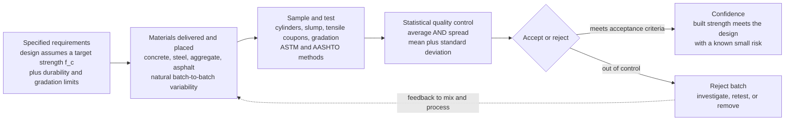

# 🧪 Construction Materials and Quality

> [!abstract] TL;DR
> A structure is only as good as the materials that actually get **delivered and installed** — and reality is messy: every truckload of concrete cures a little differently, every steel beam has slight variations, and the person mixing and placing it makes mistakes. A design assumes a certain material strength, but you can never test every cubic metre, so how do you *know* what you built is strong enough? The answer is **statistics**: sample, test, and use the **spread** of the results — not just the average — to guarantee that even the weak batches clear the requirement. This is precisely why concrete is designed to an average strength **above** the specified minimum $f'_c$: the over-design margin, sized from the batch **standard deviation**, leaves room for variability so only a tiny fraction of tests fall short. The engineer's toolkit spans the **materials** themselves (concrete, reinforcing and structural steel, asphalt and bitumen, aggregates, timber, masonry, and modern composites/FRP, geosynthetics, and admixtures), the **standardized tests** that verify them (ASTM/AASHTO methods — compression cylinders, slump, air content, tensile/yield, gradation, Proctor compaction, CBR — in both lab and field, including nondestructive rebound-hammer, ultrasonic, and ground-penetrating-radar checks), and the **management system** that ties it together: **quality control** (QC — the builder's own testing and control charts flagging out-of-spec batches) separated from **quality assurance** (QA — the owner's independent verification, specifications, inspection, and documentation). Getting materials and quality wrong causes failures — weak concrete, brittle welds — while rigorous QA/QC (and increasingly **sustainable, low-carbon** materials) is what makes infrastructure durable and safe. Quality control is applied probability meeting hammers and mixers: sampling physical reality to stay confident that what got built matches what was designed.

---

## Intuition

**Analogy — a structure is only as good as the material that actually shows up on the truck.** You can draw a flawless bridge and specify "30-megapascal concrete" on every sheet, but the concrete that gets *poured* is not a number on a drawing — it is a wet, gray slurry mixed at a plant an hour away, jostled in a rotating drum through traffic, possibly tempered with a splash of water by a tired crew, and cured on whatever day the weather gives you. Every load is a little different. Every steel beam rolled from a different heat has slightly different yield strength. The welder on the night shift is not the welder from the morning. The material you *design* with is an idealization; the material you *build* with is a cloud of scatter around it.

So here is the trap: you cannot break-test every cubic metre — testing is destructive and you would consume the whole structure. You can only pull **samples**. How, then, do you promise the public that the *un-tested* 99.9% is strong enough? You lean on **statistics**. You take samples, test them, and look not just at the **average** but at the **spread** — because the average tells you the typical batch, while the spread tells you how bad the *worst plausible* batch might be. And here is the punchline that surprises every student: if you design the mix so its *average* strength merely equals the specified minimum, then by definition **half of all batches are below spec**. That is a coin-flip, and it is unacceptable. So you deliberately **over-design** — you target an average strength *above* the minimum, and the size of that cushion is set by the standard deviation of your plant. A plant with tight, consistent concrete needs a small cushion; a sloppy, variable plant needs a big one. Quality control is applied probability meeting hammers and mixers: you sample reality to be confident that the built structure honors the assumptions the design was built on.

---

## How It Works

### Core Mechanics

1. **The design makes an assumption.** Every structural calculation rests on a nominal material property — a specified compressive strength $f'_c$ for concrete, a minimum yield $F_y$ for steel, a target density for compacted soil. These are the numbers the analysis trusts.

2. **Reality delivers a distribution, not a number.** The material that is actually batched, rolled, mixed, and placed varies — from batch to batch, from one part of a pour to another, and with the skill of the crew. The true in-place property is a **random variable** scattered around some mean.

3. **You cannot test everything, so you sample.** Testing consumes the specimen (a crushed cylinder, a pulled coupon), so you test a **sample** and infer the population. Standardized methods (ASTM in the U.S., AASHTO for transportation) fix *how* to sample and test so results are comparable and defensible.

4. **You characterize the mean *and* the spread.** From the sample you estimate the **average strength** and the **standard deviation** $s$. The spread is the star of the show: it quantifies how far the weak tail reaches below the mean.

5. **You over-design so the weak tail still clears the requirement.** Because designing to the mean would put half the batches below spec, the mix is proportioned to a **required average strength** $f'_{cr}$ that exceeds the specified $f'_c$ by a margin proportional to $s$. Larger scatter demands a larger margin — variability, not just the average, sets the target.

6. **You accept or reject against defined criteria.** During construction, results are compared to **acceptance criteria** and plotted on **control charts** that flag out-of-control batches. This is **quality control (QC)** — the builder's real-time feedback loop on the process.

7. **An independent party verifies the whole system.** Separately, the owner's **quality assurance (QA)** program audits the specifications, sampling, testing labs, inspection, and documentation to confirm the QC actually delivered what was specified — the checker of the checker.

8. **The result is calibrated confidence.** The output is not certainty (impossible with variable materials) but a **known, small probability** that the built strength falls short — the same disciplined-pessimism logic that underlies limit-state design, pushed back one layer into the materials themselves.

### Flow / Architecture



---

## Key Concepts

### Secondary Level

- **Materials are the real building blocks.** Civil structures are made of a handful of workhorse materials: **concrete** (cement paste gluing sand and gravel together), **steel** (both the reinforcing bars inside concrete and the beams and columns of a frame), **asphalt/bitumen** (the black binder that holds road pavements together), **aggregates** (sand, gravel, and crushed stone — the cheap bulk of both concrete and roads), **timber**, and **masonry** (brick and block). Newer additions include **composites/FRP** (fiber-reinforced plastics), **geosynthetics** (plastic sheets and grids that reinforce and drain soil), and **admixtures** (chemical doses that tune concrete).
- **Every material has to be checked.** You do not just trust the delivery ticket. Concrete is checked by crushing test cylinders and by the **slump test** (how far a cone of fresh concrete sags — a workability check). Steel is checked by pulling a sample until it yields and breaks. Soil is checked by how well it compacts. These are standardized tests so everyone measures the same way.
- **No material is perfectly uniform.** Two batches from the same recipe are never identical — this is normal and expected. The job of quality control is not to make them identical (impossible) but to make sure even the weakest ones are still strong *enough*.
- **That is why we aim high on purpose.** Because batches vary, engineers design the concrete mix to be *stronger on average* than the minimum the drawings require. That built-in extra is the cushion that keeps the weak batches above the line.
- **Two people watch the quality.** The **builder** tests their own work as they go (quality control). The **owner** hires an independent inspector to double-check (quality assurance). Two sets of eyes catch more mistakes than one.
- **Getting it wrong is dangerous.** Weak concrete, a bad weld, or under-compacted soil can crack, sag, or collapse. Good testing and inspection are how the profession prevents the material from betraying the design.

### Undergraduate Level

- **The material menu and their key properties.** Each material is chosen and verified for the properties that matter to its job: **strength** (how much stress before failure), **stiffness** (how much it deflects, i.e., elastic modulus), **durability** (resistance to weather, corrosion, freeze-thaw), and, for fresh concrete and asphalt, **workability** (how easily it can be placed and compacted). Concrete is strong in compression but weak in tension; steel is strong and ductile in both; asphalt is a viscoelastic binder that softens with heat and stiffens with cold; aggregates supply hardness and gradation; timber and masonry are anisotropic and moisture-sensitive.
- **Standardized material tests (ASTM / AASHTO).**
  - *Concrete:* **compressive strength** of molded cylinders (ASTM C39), **slump** (C143), **air content** (C231/C173), and unit weight — the daily quality trio on a jobsite.
  - *Steel:* the **tensile test** yielding the stress-strain curve, **yield strength**, ultimate strength, and elongation (ductility), plus bend and Charpy impact tests for toughness.
  - *Soils and aggregates:* **gradation** (sieve analysis of particle sizes), **compaction / Proctor** test (maximum dry density vs. moisture content), **California Bearing Ratio (CBR)** for pavement subgrades, and Atterberg limits.
  - *Asphalt:* binder grading, aggregate gradation, and mix-design methods (Marshall, Superpave).
- **Laboratory vs. field testing.** Some tests need a controlled lab (crushing cylinders, tensile coupons); others must happen **in the field** on the actual structure. Key **nondestructive** field methods: the **rebound (Schmidt) hammer** estimates surface concrete strength, **ultrasonic pulse velocity** probes internal soundness and voids, and **ground-penetrating radar (GPR)** locates rebar, thickness, and hidden defects — all without breaking the structure.
- **The statistical core — why over-design is mandatory.** Concrete strength is (approximately) **normally distributed** with mean $\bar{x}$ and standard deviation $s$. If you proportioned the mix so that $\bar{x} = f'_c$, then by symmetry **50% of tests fall below** the specified strength — clearly unsafe. So codes require a **required average strength** $f'_{cr}$ above $f'_c$ by a margin set by $s$. ACI 318 (following ACI 214) uses, for $f'_c \le 35$ MPa:
  $$f'_{cr} = \max\!\left(\,f'_c + 1.34\,s,\;\; f'_c + 2.33\,s - 3.45\ \text{MPa}\right)$$
  The **1.34** factor keeps the chance that a *moving average of three tests* dips below $f'_c$ near 1 in 100; the **2.33** factor keeps no more than about 1% of *individual* tests below $f'_c - 3.45$ MPa. The key insight: **the margin grows with the plant's variability** — a well-run plant with small $s$ over-designs by little; a sloppy plant with large $s$ must over-design a lot (and pay for the extra cement).
- **Acceptance criteria and sampling plans.** A "strength test" is itself the *average of two or three cylinders* from one sample, taken per volume placed (e.g., one sample per 115 m³ or per day). ACI 318 acceptance: concrete is satisfactory if (1) every **moving average of three consecutive tests** is $\ge f'_c$, **and** (2) no **individual test** falls below $f'_c$ by more than 3.45 MPa. Averaging suppresses noise so a single unlucky low cylinder does not condemn good concrete, while the individual limit still catches a genuinely bad batch.
- **QC vs. QA — different actors, different purpose.** **Quality Control (QC)** is the *producer/contractor's* activity: sampling, testing, and control charts to keep the *process* in control in real time. **Quality Assurance (QA)** is the *owner's* independent system: verification sampling, accredited labs, inspection, and the whole apparatus of specifications and documentation that provides confidence the QC worked. QC asks "is my process on target right now?"; QA asks "can we prove, independently, that the delivered product meets the contract?"
- **Control charts.** Plotting successive test results against a **center line** (the target) and **upper/lower control limits** (typically $\pm 3s$) turns raw numbers into a picture that flags an out-of-control process — a downward drift (a wearing screen, a wetter aggregate stockpile) or a sudden bad batch — *before* it becomes a rejection or a failure.

### Graduate Level

- **The producer's and consumer's risk (acceptance sampling).** Any sampling plan is a gamble with two error modes: the **producer's risk** $\alpha$ (rejecting good material) and the **consumer's risk** $\beta$ (accepting defective material). The plan's behavior is summarized by its **operating-characteristic (OC) curve** — probability of acceptance vs. the true quality level (e.g., the true percent-defective or true mean strength). Steeper OC curves (larger samples) discriminate good from bad more sharply. Modern transportation specs formalize this as **percent-within-limits (PWL)** acceptance with **pay factors**: the contractor is paid in proportion to the estimated fraction of the lot inside the specification limits, aligning economic incentive with statistical quality.
- **Why the ACI factors are what they are.** The 1.34 and 2.33 multipliers are simply standard-normal quantiles chosen for target exceedance probabilities. For individual tests, $2.33 = z_{0.99}$ ensures $\le 1\%$ below the reduced limit; for the three-test moving average, the standard error is smaller, so a *different* multiplier delivers the same 1-in-100 protection on the average. Everything reduces to $f'_{cr} = f'_c + z \cdot s$ for an appropriate $z$ and an appropriate estimate of $s$ — the whole edifice is one-sided tolerance-limit reasoning applied to a normal population, an applied case of [[Statistical_Inference]].
- **Estimating and trusting the standard deviation.** $s$ is not known a priori; it is estimated from field records. ACI 214 requires at least **15 tests** (ideally 30+) from similar materials and conditions to estimate $s$, and inflates the estimate with a **modification factor** when fewer than 30 tests are available (small-sample uncertainty in $s$ itself). With *no* strength record, a conservative default over-design (e.g., $f'_c + 7$ to $+10$ MPa depending on the strength level) is mandated until a record accumulates — you pay for ignorance in cement.
- **Within-test vs. batch-to-batch variability.** Total variance decomposes: $s_{total}^2 = s_{batch}^2 + s_{test}^2$. **Within-test** scatter (companion cylinders from the *same* sample) measures *testing* consistency — capping, curing, and lab technique — and shows up in the **range** between companion cylinders. **Batch-to-batch** scatter measures *production* consistency. Diagnosing which dominates tells you whether to fix the plant or the lab; a large within-test range often points to sloppy specimen handling, not bad concrete.
- **Statistical process control beyond the mean.** Beyond simple $\pm 3s$ Shewhart limits, mature QC uses $\bar{x}$-and-$R$ charts (tracking both level and spread), **CUSUM** and **EWMA** charts (which detect small sustained drifts far faster than Shewhart limits), and **process-capability indices** $C_p = (USL-LSL)/6\sigma$ and $C_{pk}$ that compare the *specification width* to the *process spread*. A plant can be perfectly *in control* (stable) yet *not capable* (too much scatter for the tolerance) — control and capability are distinct.
- **Nonconformance, service life, and durability.** When material fails acceptance, a formal **nonconformance** process follows: investigate, retest (e.g., cores per ASTM C42, with a lower acceptance threshold of $0.85 f'_c$ average), evaluate the affected structure (in-place testing, load test, or structural re-analysis), and repair, accept-as-is, or remove. Beyond initial strength, durability governs **service life**: chloride diffusion, carbonation, freeze-thaw, and sulfate attack are increasingly specified via performance (rapid chloride permeability, air-void spacing factor) rather than prescriptive recipes — connecting materials QC to long-term reliability. Brittle failure modes (weld cracks, aggregate fracture) tie directly to [[Fracture_Mechanics_and_Toughness]], and the underlying stress-strain behavior of every material to [[Stress_Strain_and_Elastic_Moduli]].
- **Sustainability and the shift to performance specs.** Decarbonizing construction — supplementary cementitious materials (fly ash, slag), limestone-calcined-clay cements, recycled aggregates, reclaimed asphalt pavement (RAP), and mass timber — introduces *more* material variability, which raises the statistical stakes: performance-based specifications and robust QC/QA become the enablers that let low-carbon, recycled materials be trusted in structural service. **Life-cycle assessment** and **embodied carbon** now sit alongside strength as acceptance-relevant properties.

---

## Python Demo

```python
# ============================================================================
# Construction-materials quality control as applied statistics.
#
#   (a) STRENGTH VARIABILITY & OVER-DESIGN (ACI 318 / ACI 214)
#       Concrete compressive strength is a DISTRIBUTION, not a number. If you
#       target the specified minimum f'c as the AVERAGE, half the batches fail.
#       So the required average strength f'cr must exceed f'c by a margin sized
#       from the standard deviation s -- larger scatter -> larger over-design.
#
#   (b) QUALITY-CONTROL CHART & ACCEPTANCE
#       Successive strength tests plotted with control limits and the ACI
#       moving-average-of-3 acceptance rule, flagging out-of-control batches.
#
# Requires: numpy, matplotlib   (normal CDF via math.erf; no scipy)
import numpy as np
import matplotlib.pyplot as plt
import math

rng = np.random.default_rng(7)

def Phi(z):                                   # standard-normal CDF
    return 0.5 * (1.0 + math.erf(z / math.sqrt(2.0)))

# ---------------------------------------------------------------------------
# (a) OVER-DESIGN: required average strength must beat f'c by a margin
# ---------------------------------------------------------------------------
fc_spec = 30.0        # specified minimum compressive strength f'c   [MPa]
s       = 3.5         # plant standard deviation (batch-to-batch)     [MPa]

# ACI 318 over-design (for f'c <= 35 MPa):
fcr = max(fc_spec + 1.34*s, fc_spec + 2.33*s - 3.45)   # required average [MPa]
margin = fcr - fc_spec

# Model many cylinder-break results as Normal(mean = fcr, sd = s)
N     = 5000
tests = rng.normal(fcr, s, N)

# Fraction of individual tests below spec, two design philosophies:
frac_below_overdesigned = Phi((fc_spec - fcr)     / s)   # aim at f'cr  -> tiny
frac_below_naive        = Phi((fc_spec - fc_spec) / s)   # aim at f'c   -> 0.50

print("=== (a) Strength variability & ACI over-design ===")
print(f"  specified minimum   f'c  = {fc_spec:5.1f} MPa")
print(f"  plant std deviation  s   = {s:5.1f} MPa")
print(f"  required average    f'cr = {fcr:5.1f} MPa   (over-design margin {margin:.1f} MPa)")
print(f"  fraction below f'c if we OVER-DESIGN to f'cr : {frac_below_overdesigned*100:5.1f}%")
print(f"  fraction below f'c if we NAIVELY aim at f'c  : {frac_below_naive*100:5.1f}%")

# ---------------------------------------------------------------------------
# (b) CONTROL CHART: batch-by-batch strength tests + moving-average acceptance
# ---------------------------------------------------------------------------
n_batches = 40
batch = rng.normal(fcr, s, n_batches)
# Inject an out-of-control excursion (a wet-aggregate morning): batches 25-27 sag
batch[25:28] -= 6.0

x_idx = np.arange(1, n_batches + 1)
UCL, LCL = fcr + 3*s, fcr - 3*s                       # Shewhart 3-sigma limits
mov3 = np.convolve(batch, np.ones(3)/3, mode="valid") # moving average of 3
mov3_x = np.arange(3, n_batches + 1)

# ACI acceptance flags
indiv_fail = batch < (fc_spec - 3.45)                 # individual > 3.45 MPa low
mov3_fail  = mov3  < fc_spec                          # 3-test average below f'c

# ---------------------------------------------------------------------------
# PLOTS
# ---------------------------------------------------------------------------
fig, ax = plt.subplots(1, 2, figsize=(15, 5.6))

# --- (a) distribution + over-design margin ---
a0 = ax[0]
a0.hist(tests, bins=45, density=True, color="#93c5fd", alpha=0.7,
        edgecolor="white", label="cylinder test results")
xx = np.linspace(tests.min(), tests.max(), 400)
pdf = np.exp(-0.5*((xx - fcr)/s)**2) / (s*math.sqrt(2*math.pi))
a0.plot(xx, pdf, color="#1d4ed8", lw=2.4, label="fitted normal")
a0.fill_between(xx, pdf, where=(xx < fc_spec), color="#dc2626", alpha=0.55,
                label="tests below f'c")
a0.axvline(fc_spec, color="#dc2626", lw=2.0, ls="--")
a0.axvline(fcr,     color="#065f46", lw=2.0, ls="--")
ytop = pdf.max()
a0.annotate("specified\nf'c = 30", (fc_spec, ytop*0.85), color="#dc2626",
            fontsize=9, ha="right")
a0.annotate("required average\nf'cr = %.1f" % fcr, (fcr, ytop*0.95),
            color="#065f46", fontsize=9, ha="left")
a0.annotate("", xy=(fcr, ytop*0.55), xytext=(fc_spec, ytop*0.55),
            arrowprops=dict(arrowstyle="<->", color="k", lw=1.5))
a0.text((fc_spec+fcr)/2, ytop*0.58, "over-design\nmargin", ha="center",
        fontsize=8.5, fontweight="bold")
a0.set_xlabel("compressive strength (MPa)")
a0.set_ylabel("probability density")
a0.set_title("(a) Why concrete is over-designed\naim the AVERAGE above the minimum")
a0.legend(loc="upper left", fontsize=8); a0.grid(alpha=0.3)

# --- (b) control chart + moving-average acceptance ---
a1 = ax[1]
a1.plot(x_idx, batch, "-o", color="#334155", lw=1.4, ms=5, label="strength test")
a1.plot(mov3_x, mov3, "-", color="#7c3aed", lw=2.2, label="moving avg of 3")
a1.axhline(fcr, color="#065f46", ls="-",  lw=1.6, label="center line f'cr")
a1.axhline(UCL, color="#0891b2", ls=":",  lw=1.4, label="control limits (+/-3s)")
a1.axhline(LCL, color="#0891b2", ls=":",  lw=1.4)
a1.axhline(fc_spec, color="#dc2626", ls="--", lw=1.8, label="specified f'c")
# flag failures
a1.scatter(x_idx[indiv_fail], batch[indiv_fail], color="#dc2626", s=120,
           zorder=6, marker="X", label="individual > 3.45 low")
a1.scatter(mov3_x[mov3_fail], mov3[mov3_fail], facecolors="none",
           edgecolors="#dc2626", s=160, lw=2.2, zorder=6, label="3-avg below f'c")
a1.set_xlabel("batch / sample number (time order)")
a1.set_ylabel("compressive strength (MPa)")
a1.set_title("(b) Quality-control chart\nflagging out-of-control batches")
a1.legend(loc="lower left", fontsize=7.5, ncol=2); a1.grid(alpha=0.3)

plt.tight_layout()
plt.savefig("construction_materials_quality.png", dpi=140)
# Expected: margin ~4.7 MPa; below-f'c ~9% if over-designed vs 50% if naive;
#           the injected batches 25-27 trip the moving-average acceptance rule.
```

Running it prints the heart of the matter: with a specified $f'_c = 30$ MPa and a plant standard deviation of $3.5$ MPa, ACI requires a **required average strength** of about $34.7$ MPa — an over-design **margin of roughly 4.7 MPa**. Aim the mix at that $f'_{cr}$ and only about **9% of individual cylinders** dip below the specified minimum (the acceptance rules tolerate this because they act on three-test averages); aim naively at the minimum itself and **50%** fall short. **Panel (a)** shows the strength histogram with the red tail below $f'_c$ and the green over-design margin that pushes that tail small. **Panel (b)** is the working QC chart: forty batches plotted in time order against the center line, the $\pm 3s$ control limits, and the specified strength, with the purple **moving-average-of-3** line and red flags where the injected bad batches (a wet-aggregate morning) trip the ACI acceptance criteria — exactly the early warning that lets a plant fix its process before a rejection or a failure.

---

## Real-World Applications

> **Example:** **Ready-mix concrete plants and the ACI 214 / ASTM C39 loop.** On any large pour — a high-rise mat foundation, a bridge deck, a dam — the ready-mix supplier and the testing lab run a continuous statistical loop. Field technicians cast cylinders per **ASTM C39**, break them at 28 days, and the results feed a running estimate of the mean and standard deviation. The plant proportions its mix to the **required average strength** $f'_{cr}$ computed from *its own* recent variability (ACI 214), and the results are tracked on control charts so a drifting aggregate stockpile or a mis-calibrated batching scale is caught within a few loads. Acceptance follows ACI 318's moving-average-of-three and individual-test rules. This is the textbook example of the whole note in one workflow: sample, characterize the spread, over-design, chart, accept or investigate.

- **Superpave asphalt with percent-within-limits pay factors.** State DOTs (via **AASHTO** methods) accept asphalt pavement using **PWL** statistical acceptance: cores and plant samples estimate the fraction of the lot within limits for air voids, binder content, and density, and the contractor's **pay factor** rises or falls with that statistic — a direct financial coupling of statistics to quality that has largely replaced pass/fail inspection on highways.
- **Structural steel mill certificates and coupon testing.** Every heat of structural steel ships with a **mill test report** (certified yield, tensile, elongation, chemistry). Fabricators and inspectors verify with independent tensile coupons and, for welds, ultrasonic and radiographic **nondestructive testing** — because a brittle or under-strength weld is a classic material-quality failure mode with catastrophic consequences.
- **Earthwork compaction control.** Before any pavement or foundation, fill is compacted and verified against the **Proctor** maximum dry density using nuclear density gauges or sand-cone tests, with a specified percent-compaction (e.g., 95%) and moisture window — a statistical acceptance on soil exactly parallel to concrete cylinders, tying materials QC to [[Statistics_for_Analytics]]-style sampling of a spatial population.
- **Nondestructive assessment of existing structures.** For aging bridges and buildings, engineers estimate in-place quality without demolition: **rebound hammer** and **ultrasonic pulse velocity** for concrete strength and voids, **GPR** for rebar location and deck delamination, and **half-cell potential** mapping for corrosion — turning field measurements into condition ratings for asset management.
- **Low-carbon concrete adoption.** As projects specify high-fly-ash, slag, or limestone-calcined-clay mixes to cut embodied carbon, the *added* variability of by-product materials is managed by tightened QC/QA and **performance-based** durability testing (rapid chloride permeability, resistivity), which is what lets owners trust sustainable mixes in structural service.

---

## Common Pitfalls

- **Designing to the average instead of the tail.** The single most important misconception: proportioning a mix so its *mean* equals the specified $f'_c$ puts **half** of all batches below spec. Safety lives in the spread — the over-design margin exists precisely because materials scatter, and it must grow with the standard deviation, not shrink to save cement.
- **Ignoring variability and quoting only the mean.** Two plants with the same average strength but very different standard deviations are *not* equally safe. A report that states "average 34 MPa" without the spread is nearly useless; the standard deviation determines how much over-design and how large a rejection risk you actually carry.
- **Adding water on site to improve workability.** The classic field abuse: tempering a stiff mix with extra water raises the water-cement ratio and silently slashes strength and durability — turning a good design into a weak, out-of-control batch. The right fix is a superplasticizer, not a hose.
- **Confusing QC with QA (or letting the builder be their own referee).** Quality control (the builder's process testing) and quality assurance (the owner's *independent* verification) serve different masters. Collapsing them — letting the contractor's lab be the only check — removes the independence that catches systematic bias and gives the whole system its credibility.
- **Condemning good concrete on one low cylinder — or accepting bad concrete by over-averaging.** A single unlucky specimen (often a *testing* error — poor capping, wrong curing, dropped cylinder) is not proof of bad concrete, which is why acceptance uses moving averages. But over-smoothing can also mask a genuinely bad batch, which is why the *individual* low-test limit exists alongside the average. Both rules are needed.
- **Blaming the concrete when the lab is at fault.** A large *within-test* range between companion cylinders points to specimen handling, capping, or curing problems — not the mix. Failing to separate within-test from batch-to-batch variance leads teams to chase the wrong cause.
- **Treating strength as the whole story while ignoring durability.** A mix can pass its 28-day strength yet be too permeable, poorly cured, or freeze-thaw-vulnerable. Long service life is governed by durability properties (permeability, air-void spacing, cover), which must be specified and tested separately from strength.
- **Confusing statistical control with capability.** A process can be perfectly stable ("in control") yet still produce too much scatter for the specification ("not capable"). Passing a control chart is not the same as meeting the tolerance — capability indices, not just control limits, tell you whether the spread fits the spec.

---

## Related Concepts

**Probability and statistics foundations (Mathematics vault)**
- [[Random_Variables]] — a batch's true strength is a random variable; the mean and standard deviation that drive over-design and acceptance are its first two moments.
- [[Common_Probability_Distributions]] — the (approximately) normal distribution of concrete strength, and the standard-normal quantiles (1.34, 2.33) baked into the ACI over-design formula and the tail-probability of falling below $f'_c$.
- [[Statistical_Inference]] — estimating the mean and standard deviation from a limited sample, one-sided tolerance limits, and the confidence behind acceptance criteria are direct applications of inference.

**Materials behavior (Materials Science vault)**
- [[Stress_Strain_and_Elastic_Moduli]] — the tensile test, yield strength, and elastic modulus that material testing measures and that quality control verifies for steel and concrete.
- [[Fracture_Mechanics_and_Toughness]] — brittle, flaw-controlled failures (weld cracks, aggregate fracture) are the catastrophic quality-failure modes that testing and inspection exist to prevent.

**Statistical practice and process control**
- [[Statistics_for_Analytics]] — sampling, distributions, and control-chart thinking are the same statistical toolkit applied here to physical materials rather than data.
- [[Process_Safety_and_Hazard_Analysis]] — chemical engineering's risk framework shares the philosophy of driving a failure probability below a society-accepted target through disciplined sampling and independent verification.

*Within this Civil Engineering vault (siblings, prose-only): Concrete_Technology_and_Cement supplies the material this note polices — the water-cement ratio, hydration, and curing that determine the very strength distribution being sampled; Design_Codes_and_Structural_Safety pushes the same disciplined-pessimism logic up into structural design, where the specified $f'_c$ (guaranteed by this note's over-design and acceptance testing) becomes the nominal resistance factored down by $\phi$; Structural_Steel_Design relies on the certified yield strength and weld quality that steel material testing verifies; Construction_Engineering_and_Management embeds QA/QC into the project's schedule, inspection, and documentation system; and Pavement_and_Highway_Design consumes the asphalt, aggregate, and compaction quality controlled by the statistical acceptance (PWL, Proctor, CBR) described here.*

---

## Review Questions

**Secondary**
1. A concrete supplier proudly says their concrete "averages exactly the 30 MPa the drawings require." Explain, in plain words, why an engineer would *not* be reassured by that statement — what is wrong with aiming the *average* at the minimum? Then explain the difference between the **builder testing their own work** and the **owner hiring an independent inspector**, and why having both matters.

**Undergraduate**
2. A ready-mix plant supplies concrete specified at $f'_c = 25$ MPa and has established a standard deviation of $s = 4.0$ MPa from its recent test record. (a) Using the ACI rule $f'_{cr} = \max(f'_c + 1.34s,\; f'_c + 2.33s - 3.45)$, compute the required average strength and the over-design margin. (b) If a competitor plant with sloppier production has $s = 6.0$ MPa, recompute $f'_{cr}$ and explain, in terms of cost and cement, why *reducing variability* is worth money. (c) Concrete acceptance uses both a "moving average of three tests" rule and an "individual test" rule — explain what each rule protects against and why one alone is insufficient.

**Graduate**
3. A transportation agency accepts asphalt lots with a **percent-within-limits (PWL)** plan tied to a pay factor. (a) Sketch qualitatively the **operating-characteristic (OC) curve** (probability of acceptance vs. true lot quality) and locate the **producer's risk** $\alpha$ and **consumer's risk** $\beta$ on it. (b) A contractor argues their process is "in statistical control" and therefore should always be accepted; distinguish **statistical control** from **process capability** ($C_p$, $C_{pk}$) and explain why an in-control process can still fail acceptance. (c) A batch of cylinders shows a large *within-test range* between companion specimens but an acceptable *batch-to-batch* mean; using the variance decomposition $s_{total}^2 = s_{batch}^2 + s_{test}^2$, explain what this diagnoses and whether you would first investigate the plant or the testing lab.

---

## Sources

- Mamlouk, M. S. & Zaniewski, J. P. — *Materials for Civil and Construction Engineers*, 4th ed. (Pearson, 2016) — the standard survey of construction materials and their standardized testing.
- Somayaji, S. — *Civil Engineering Materials*, 2nd ed. (Prentice Hall, 2001) — accessible materials-and-testing reference.
- ACI Committee 214 — *ACI 214R: Guide to Evaluation of Strength Test Results of Concrete* (American Concrete Institute) — the definitive statement of the strength-distribution, standard-deviation, and over-design methodology.
- Montgomery, D. C. — *Introduction to Statistical Quality Control*, 7th ed. (Wiley, 2013) — the reference on control charts, acceptance sampling, and process capability.
- ACI Committee 318 — *Building Code Requirements for Structural Concrete (ACI 318)* — the required-average-strength and acceptance-criteria provisions applied in practice.

---

#civil-engineering #construction-materials #quality-control #statistics #testing
