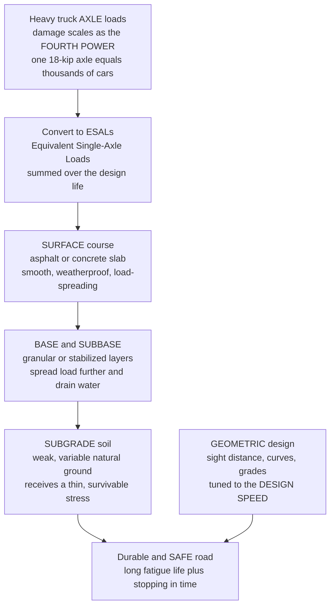

# 🛣️ Pavement and Highway Design

> [!abstract] TL;DR
> A road looks like a ribbon of asphalt but is really a **layered load-spreading sandwich** engineered to take the concentrated, pounding weight of a truck tire and fan it out over the soft **subgrade** soil so the ground never ruts and the surface never cracks — through millions of load cycles and decades of weather. Two problems must be solved at once. **Pavement design** picks the layer materials and thicknesses to survive repeated **axle loads**, which are converted into **ESALs** (Equivalent Single-Axle Loads) through a startling rule of thumb: road damage rises roughly as the **fourth power** of axle load, so one heavy truck can do as much wear as *thousands* of cars, and trucks — not traffic volume — govern the design. **Geometric design** shapes the road for a chosen **design speed** — how sharply it curves, how steeply it climbs, and above all how far a driver can *see* — with **stopping sight distance** (reaction distance + braking distance) as the governing life-safety criterion. Highway design is the one discipline where materials, soil, vehicle dynamics, and human reaction time all meet the ground.

---

## Intuition

**Analogy:** A road looks like the simplest thing in the world — a flat gray ribbon poured on the dirt. It is nothing of the kind. It is a carefully **layered sandwich** built to do one genuinely hard job: take the crushing, hammering weight of a loaded truck pressed onto a tire patch the size of your hand and *spread that force out* over the soft earth beneath, so the ground doesn't sink into ruts and the surface doesn't crack apart. Think of lying on soft snow: stand on one foot and you punch through; lie flat on a wide board and you float. The pavement layers are that board — each one takes the sharp pressure from above and hands a gentler, wider pressure to the layer below, until the weak subgrade soil at the bottom feels only a mild, survivable squeeze.

Now here is the shocking fact that drives the entire design: **road damage is not proportional to weight — it goes up roughly as the fourth power of axle load.** Double the load on an axle and you do about *sixteen* times the damage. A fully loaded truck axle can chew up a road as fast as several thousand passenger cars. That single number explains why trucks (and especially *overloaded* trucks) dominate pavement design and eat maintenance budgets, while the millions of cars barely register.

Meanwhile the road's **shape** is designed around a different physics entirely — a vehicle moving at speed and a human being with a slow reaction time behind the wheel. How sharply the road may curve, how steeply it may climb, and how far ahead you must be able to see are all set so that you can **stop in time** for a hazard and **round a curve without sliding** off it. Pavement keeps the road from breaking under load; geometry keeps *you* from crashing on it.

---

## How It Works

A pavement is a **layered elastic system** that receives a concentrated wheel load at the surface and delivers a spread-out, tolerable stress to the natural ground. The geometry wrapped around it is a **kinematics-and-friction** problem tuned to the design speed. Both are engineered against the same enemies: heavy repeated loads, water, and time.

1. **The layered structure spreads load.** From top down: a **surface course** (asphalt or concrete) that is smooth, weatherproof, and stiff enough to distribute load; a **base** and **subbase** (compacted granular or stabilized layers) that spread the load further and provide drainage; all resting on the compacted **subgrade** — the native soil, the weakest and most variable link. Each layer converts a sharp pressure into a wider, gentler one, so the pressure reaching the subgrade is a small fraction of the tire contact pressure.

2. **Two families of pavement.** **Flexible** pavements (asphalt/bituminous) *flex* and distribute load progressively through the granular layers; they fail by **fatigue cracking** (tensile strain repeatedly flexing the bottom of the asphalt) and **rutting** (permanent deformation accumulating in the wheel paths). **Rigid** pavements (Portland-cement concrete slabs) are stiff and act like a **beam**, bridging over soft spots and spreading load widely by their own bending stiffness; they fail by **slab cracking**, **joint faulting**, and pumping.

3. **Traffic is measured in ESALs, not vehicles.** The key design input is not how *many* vehicles pass but how heavy their **axles** are. Every axle load is converted to a number of **Equivalent Single-Axle Loads** — passes of a standard 18-kip (80-kN) axle — through the **load-equivalency (fourth-power) law**: damage scales as roughly *(axle load / 18 kip)⁴*. Summed over the design life this gives the cumulative **design ESALs (W₁₈)**, the demand the structure must survive.

4. **Design methods size the structure.** **Empirical** methods (the AASHTO equations, calibrated by the 1950s AASHO Road Test) relate design ESALs, subgrade strength, and a target ride quality to a required **structural number** (flexible) or **slab thickness** (rigid). **Mechanistic-empirical** methods go deeper: they compute the actual **stresses and strains** in each layer under a wheel and feed them into fatigue and rutting **transfer functions** to predict cracking and deformation over time.

5. **Geometry is designed for the design speed.** The road's shape follows the physics of a moving vehicle: **horizontal curves** balance **superelevation** (banking) plus tire **side friction** against the centripetal demand; **vertical curves** (crests and sags) and **grades** limit how fast the profile changes; and the governing safety criterion is **sight distance** — the driver must be able to see far enough to stop. **Stopping sight distance** = reaction distance (speed × perception-reaction time) + braking distance (which grows as speed *squared*).

6. **Water is the enemy, and roads must be managed.** Drainage of every layer is designed to keep water out, because a wet subgrade loses strength and pumping destroys slabs. Over the life cycle, **pavement management systems** track condition (ride roughness, cracking, rutting) and schedule maintenance and rehabilitation to minimize **life-cycle cost**.



---

## Key Concepts

### Secondary Level

- **A road is a layered sandwich, not a slab of tar.** Under the smooth top layer are coarser gravel layers, all sitting on the natural dirt. Each layer takes the sharp weight of a tire and spreads it wider, so by the time the load reaches the soft ground at the bottom, it is gentle enough that the ground doesn't sink.
- **Trucks wreck roads; cars barely touch them.** Road wear does not go up in step with weight — it explodes. Because damage rises with about the **fourth power** of axle load, one heavy truck can do the damage of thousands of cars. This is why highways are designed around trucks and why overloaded trucks are so costly.
- **Two kinds of road.** **Asphalt** roads (flexible) bend a little under each wheel and are cheap and fast to lay and repair. **Concrete** roads (rigid) are stiff slabs that last longer under heavy traffic but cost more up front. Most roads are asphalt; heavy-truck routes and airports often use concrete.
- **Water is the road's enemy.** Water that soaks into the layers softens the ground and lets traffic pound out potholes and ruts. Good drainage — crown, ditches, and permeable base layers — is as important as the paving itself.
- **The road's shape keeps you safe.** How sharply a road curves, how steep the hills are, and how far you can see ahead are all designed for a target speed. The key rule: you must be able to **see far enough to stop** — which is why curves and hilltops are gentled out, because at speed you need a long distance to react and brake.

### Undergraduate Level

- **Pavement structure and load spreading.** The system is **surface → base → subbase → subgrade**, with stiffness decreasing downward. A tire delivers a contact pressure of order 700 kPa over a small patch; through the layers this attenuates so the vertical stress on the subgrade is a small fraction of that. **Flexible** pavements distribute load through granular interlock and the asphalt's stiffness; **rigid** pavements distribute it through **slab bending**, so a concrete slab can bridge a weak subgrade spot that would rut an asphalt road.
- **ESALs and the load-equivalency law.** The **Load Equivalency Factor** for a single axle is approximately $\text{LEF} = (L / 18)^4$, where $L$ is the axle load in kips and 18 kip is the standard. A car axle (~2 kip) gives $\text{LEF} \approx 0.0002$; an 18-kip truck axle gives 1.0; a 22-kip overloaded axle gives ~2.2. **Design ESALs** $W_{18} = \text{AADT} \times \text{truck factor} \times \text{growth} \times \text{directional/lane factors}$, accumulated over the design life (often 20 years).
- **Material characterization.** Subgrade strength is captured by the **California Bearing Ratio (CBR)** or the **resilient modulus** $M_r$ (stiffness under repeated load). Asphalt mixes are proportioned by **Superpave** (or older **Marshall**) mix design, balancing binder content, air voids, and aggregate gradation for rut and fatigue resistance. Concrete is characterized by **flexural strength (modulus of rupture)** because rigid pavements fail in bending.
- **AASHTO empirical design.** For flexible pavement the design yields a **structural number** $SN = a_1 D_1 + a_2 D_2 m_2 + a_3 D_3 m_3$, where $a_i$ are layer coefficients, $D_i$ thicknesses, and $m_i$ drainage coefficients. Design is driven by $W_{18}$, $M_r$, a reliability level, and the loss of **serviceability** ($\Delta PSI$) the road is allowed to suffer.
- **Horizontal curves.** The banking-plus-friction balance is $e + f = \dfrac{V^2}{gR}$ (superelevation $e$ + side-friction factor $f$ vs centripetal demand), giving the minimum radius $R_{\min} = \dfrac{V^2}{g(e_{\max} + f_{\max})}$. Too small a radius at a given speed exhausts available friction and the vehicle slides.
- **Stopping sight distance (SSD).** $SSD = v\,t_r + \dfrac{v^2}{2a}$ with perception-reaction time $t_r \approx 2.5$ s and deceleration $a \approx 3.4\ \text{m/s}^2$ (AASHTO). The reaction term is **linear** in speed; the braking term grows as **speed squared** — so required sight distance climbs steeply with design speed and sets crest-curve length and lateral clearance on curves.
- **Vertical curves and grades.** Crest and sag parabolic curves are sized by the rate of curvature $K = L / A$ (length per percent change in grade) chosen so SSD is met (headlight-illumination criterion governs sag curves at night). Maximum grades are limited by truck climbing performance and by braking on descents.

### Graduate Level

- **Mechanistic-empirical (M-E) design.** The modern **MEPDG** framework computes, under each wheel pass and for each climate/season, the **tensile strain $\varepsilon_t$ at the bottom of the asphalt** (drives fatigue cracking) and the **vertical compressive strain $\varepsilon_v$ on the subgrade** (drives rutting), using **layered elastic theory** (Burmister multilayer, generalizing the Boussinesq point-load solution). These feed transfer functions such as fatigue $N_f = k_1 (1/\varepsilon_t)^{k_2}(1/E)^{k_3}$ and a rutting model, accumulating damage by **Miner's rule** over the ESAL spectrum and seasonal moduli. This is fatigue-and-fracture life prediction applied to a road.
- **Rigid-pavement analysis.** **Westergaard** solutions give slab stresses for **interior, edge, and corner** loading in terms of the **radius of relative stiffness** $\ell = \left[\dfrac{E h^3}{12(1-\nu^2)k}\right]^{1/4}$, where $k$ is the subgrade modulus of reaction and $h$ the slab thickness. Design also treats **thermal curling**, **joint load transfer** (aggregate interlock and **dowel bars**), **faulting**, and **pumping** of fines from a saturated subbase.
- **Origin of the fourth-power law.** The exponent ≈4 is empirical, distilled from the **AASHO Road Test** (Ottawa, Illinois, 1958–1960), where controlled truck fleets ran identical sections to failure. Load equivalency factors are not exactly 4 — they depend on axle configuration (single/tandem/tridem), pavement type, and terminal serviceability — but ~4 is the robust, design-governing takeaway.
- **Drainage, climate, and moisture.** Subgrade $M_r$ can drop by a factor of several when saturated; freeze-thaw causes **frost heave** and spring thaw-weakening. Design incorporates seasonal moduli, permeable bases, edge drains, and the AASHTO **drainage coefficients** $m_i$. Water is quantitatively, not rhetorically, the dominant durability variable.
- **Reliability and life-cycle cost.** Design ESALs and material properties are distributions, not numbers; a **reliability** level shifts the design conservatively via a standard-normal deviate $Z_R$ and overall variance $S_0$. **Life-cycle cost analysis (LCCA)** compares initial construction against the discounted stream of maintenance and rehabilitation, and **pavement management systems** use condition indices (**IRI** roughness, cracking, rutting, PCI) to optimize network-level spending.
- **Geometric design at the graduate edge.** Sight distance on **horizontal curves** requires a middle-ordinate offset $M = R\left[1 - \cos\dfrac{28.65\, SSD}{R}\right]$ to a sight obstruction; **passing** and **decision sight distance** exceed SSD; **superelevation runoff/transition** length, **spiral (clothoid)** transitions, and **sag-curve headlight** and comfort criteria all refine the basic balance. Design consistency (avoiding abrupt speed-inducing geometry) is itself a safety criterion.

---

## Python Demo

```python
# ==========================================================================
# WHY TRUCKS (NOT CARS) DESIGN ROADS, AND WHY GEOMETRY IS SET BY STOPPING.
#   (a) LOAD-EQUIVALENCY FOURTH-POWER LAW -> pavement damage in ESALs
#   (b) STOPPING SIGHT DISTANCE vs speed  -> sets crest/curve geometry
#   (c) LOAD SPREADING with depth         -> why layers protect the subgrade
# Requires numpy + matplotlib only.
# ==========================================================================
import numpy as np
import matplotlib.pyplot as plt

# --------------------------------------------------------------------------
# (a) FOURTH-POWER LAW:  LEF = (axle load / standard 18-kip axle) ** 4
#     One pass of an axle costs LEF "Equivalent Single-Axle Loads" (ESALs).
# --------------------------------------------------------------------------
P_STD = 18.0                                   # standard single axle, kip (80 kN)
load  = np.linspace(1.0, 24.0, 400)            # axle load, kip
LEF   = (load / P_STD) ** 4                     # AASHTO ~4th-power damage law

axles = {"passenger car ~2 kip": 2.0,
         "standard truck 18 kip": 18.0,
         "overloaded 22 kip": 22.0}
print("=== (a) Load equivalency (damage per pass) ===")
for name, P in axles.items():
    print(f"  {name:24s} -> {(P/P_STD)**4:8.4f} ESAL/pass")

# Cumulative ESALs over a 20-year design life for a mixed traffic stream
years, AADT, truck_pct = 20, 20000, 0.10
cars   = AADT * (1 - truck_pct) * 365 * years
trucks = AADT * truck_pct       * 365 * years
esal_car   = cars   * (2.0 / P_STD) ** 4 * 2    # ~2 axles per car
esal_truck = trucks * (18.0 / P_STD) ** 4 * 3   # ~3 equivalent 18-kip axles/truck
share = 100 * esal_truck / (esal_car + esal_truck)
print(f"\n  20-yr ESALs:  cars = {esal_car:,.0f}   trucks = {esal_truck:,.0f}")
print(f"  trucks are {truck_pct*100:.0f}% of traffic but {share:.1f}% of pavement damage")

# --------------------------------------------------------------------------
# (b) STOPPING SIGHT DISTANCE:  SSD = reaction dist + braking dist
#     SSD = v*t_r + v^2 / (2*a)     (v in m/s)   AASHTO t_r=2.5 s, a=3.4 m/s^2
# --------------------------------------------------------------------------
t_r, a   = 2.5, 3.4
Vkmh     = np.linspace(30, 130, 400)
v        = Vkmh / 3.6
d_react  = v * t_r
d_brake  = v ** 2 / (2 * a)
SSD      = d_react + d_brake

# --------------------------------------------------------------------------
# (c) LOAD SPREADING WITH DEPTH (Boussinesq, uniform circular tire load):
#     sigma_z / q = 1 - [ 1 / (1 + (r/z)^2) ]^(3/2)
#     A concentrated surface pressure is spread thin before it reaches the
#     weak subgrade -- the entire reason a layered pavement exists.
# --------------------------------------------------------------------------
q, rad = 700.0, 0.15                            # tire pressure (kPa), contact radius (m)
z       = np.linspace(0.001, 1.2, 400)          # depth below surface, m
sigma_z = q * (1 - (1 / (1 + (rad / z) ** 2)) ** 1.5)

# --------------------------------------------------------------------------
# Plot
# --------------------------------------------------------------------------
fig, ax = plt.subplots(1, 3, figsize=(16, 5))
fig.suptitle("Pavement and Highway Design: fourth-power damage, sight distance, "
             "and load spreading", fontsize=13, fontweight="bold")

# (a) fourth-power damage law
ax[0].plot(load, LEF, color="#b91c1c", lw=2.6)
ax[0].axhline(1.0, color="gray", ls=":", lw=1)
ax[0].axvline(P_STD, color="gray", ls=":", lw=1)
for name, P in axles.items():
    ax[0].scatter([P], [(P / P_STD) ** 4], s=60, zorder=5)
    ax[0].annotate(name, (P, (P / P_STD) ** 4),
                   textcoords="offset points", xytext=(-8, 12), fontsize=8)
ax[0].set_xlabel("axle load (kip)")
ax[0].set_ylabel("pavement damage per pass (ESAL)")
ax[0].set_title("(a) Fourth-power law\ndamage ~ (load / 18 kip)^4")
ax[0].grid(True, alpha=0.3)

# (b) stopping sight distance
ax[1].plot(Vkmh, SSD, color="#1d4ed8", lw=2.6, label="total SSD")
ax[1].plot(Vkmh, d_react, color="#059669", lw=1.8, ls="--", label="reaction (~ v)")
ax[1].plot(Vkmh, d_brake, color="#ea580c", lw=1.8, ls="--", label="braking (~ v^2)")
ax[1].set_xlabel("design speed (km/h)")
ax[1].set_ylabel("distance (m)")
ax[1].set_title("(b) Stopping sight distance\nreaction + braking sets geometry")
ax[1].legend(fontsize=8, loc="upper left")
ax[1].grid(True, alpha=0.3)

# (c) load spreading with depth
ax[2].plot(sigma_z, z, color="#7c3aed", lw=2.6)
ax[2].axhline(0.45, color="gray", ls=":", lw=1)
ax[2].annotate("top of subgrade\nstress spread thin", (0.15 * q, 0.45),
               fontsize=8, color="gray")
ax[2].invert_yaxis()
ax[2].set_xlabel("vertical stress sigma_z (kPa)")
ax[2].set_ylabel("depth below surface (m)")
ax[2].set_title("(c) Load spreading with depth\nlayers protect the weak subgrade")
ax[2].grid(True, alpha=0.3)

plt.tight_layout(rect=[0, 0, 1, 0.94])
plt.show()
```

Running this prints and plots three lessons. Panel **(a)** is the **fourth-power law**: the damage curve is nearly flat for cars and then rockets upward, so a passenger-car axle scores ~0.0002 ESAL while an 18-kip truck axle scores 1.0 and a 22-kip overloaded axle ~2.2 — and the cumulative tally shows that trucks, at just 10% of traffic, inflict roughly **99.9%** of the pavement damage. Panel **(b)** decomposes **stopping sight distance**: the reaction distance rises *linearly* with speed while the braking distance rises with the *square* of speed, so total required sight distance grows steeply and governs how gentle crests and curves must be. Panel **(c)** plots **Boussinesq stress attenuation**: a 700 kPa tire pressure at the surface is spread thin to around 100 kPa by the depth of the subgrade — the quantitative reason the layered sandwich exists.

---

## Real-World Applications

> **Example — the AASHO Road Test (1958–1960).** Nearly every road on Earth traces its design logic to a two-year experiment near Ottawa, Illinois, where the American Association of State Highway Officials built dozens of identical pavement sections and ran controlled fleets of trucks over them, axle by axle, until they failed. Out of that test came the **ESAL** concept and the **fourth-power load-equivalency law** — the empirical discovery that a road's remaining life is consumed far faster by a few heavy axles than by torrents of light ones. The resulting **AASHTO design equations** governed U.S. and international pavement design for half a century and still underpin the mechanistic-empirical methods that replaced them.

- **The U.S. Interstate Highway System.** Its consistent geometry — 12-ft lanes, generous **stopping and passing sight distance**, controlled grades, gentle superelevated curves designed for 70+ mph — is a direct application of geometric design for a high **design speed**, and is credited with a large share of the safety gains of limited-access highways over the roads they replaced.
- **Truck-load limits and weigh stations.** Because damage scales as the fourth power of axle load, a single **overloaded** truck can cost the pavement as much as a normal truck several times over. Legal axle-load limits, weigh-in-motion sensors, and overweight-permit fees exist precisely to protect the fourth-power-sensitive asset — enforcement is cheaper than reconstruction.
- **Concrete (rigid) pavements for heavy freight.** Airport aprons, port yards, bus lanes, and heavy-truck corridors (and much of Germany's Autobahn network) use jointed or continuously reinforced **concrete slabs** because their beam-like load spreading and long fatigue life pay off under relentless heavy axles, despite higher initial cost.
- **Perpetual (long-life) asphalt pavements.** By keeping the tensile strain at the bottom of a thick asphalt structure below the mix's **fatigue endurance limit**, designers build roads whose deep structure never fatigue-cracks; only the surface course is periodically milled and replaced, dramatically lowering life-cycle cost.
- **Recycled and warm-mix asphalt.** Modern resurfacing routinely reuses milled **reclaimed asphalt pavement (RAP)** and lowers production temperature (warm-mix), cutting binder demand, energy, and emissions — pavement's contribution to sustainable, lower-carbon infrastructure.

---

## Common Pitfalls

- **Designing for traffic *volume* instead of *axle loads*.** The most fundamental error is sizing a pavement by how many vehicles use it. Because of the fourth-power law, the **truck percentage and their axle loads** dominate; a road with modest volume but heavy truck traffic needs a far stronger structure than a busy commuter route full of cars.
- **Neglecting drainage.** Water is the pavement's true enemy: a saturated subgrade can lose much of its stiffness, and trapped water under a slab causes **pumping** and faulting. Skimping on crown, edge drains, and permeable base is the fastest route to premature rutting, potholes, and failure regardless of how thick the surface is.
- **Ignoring overloading and its fourth-power cost.** Treating an occasional overweight truck as harmless is a budget-killer — its damage grows as the fourth power of the excess load. Networks that tolerate widespread overloading see maintenance costs explode far out of proportion to the tonnage carried.
- **Confusing strength with durability.** Meeting a strength or thickness number does not guarantee a long life: **fatigue** cracking and **rutting** (flexible) and **faulting/cracking** (rigid) are accumulation-of-damage failures driven by repeated loads, temperature, and moisture — which is why mechanistic-empirical methods predict *distress over time*, not just a single capacity.
- **Under-designing sight distance.** Placing a hazard, sharp crest, or sight-obstructing barrier/vegetation where a driver cannot see far enough to stop is a direct life-safety failure. Because braking distance grows with the **square** of speed, geometry that felt safe at 50 km/h can be lethal at 100 km/h.
- **Over-sharp curves for the design speed.** A horizontal curve whose radius is too small for the posted speed exhausts the available side friction even with superelevation, and vehicles slide — especially trucks with high centers of gravity and in the wet, where friction collapses.
- **Ignoring temperature susceptibility of asphalt.** Asphalt binder is **viscoelastic**: stiff and brittle (cracking) in the cold, soft and rut-prone in the heat. Specifying a binder grade without matching it to the climate leads to thermal cracking in winter or rutting in summer.

---

## Related Concepts

**Failure and deformation of the pavement material (Mechanical Engineering vault)**
- [[Failure_Fatigue_and_Fracture]] — flexible-pavement bottom-up fatigue cracking is exactly the repeated-load, strain-driven fatigue failure formalized here, and the fourth-power ESAL law is a fatigue-damage-accumulation statement
- [[Stress_Strain_and_Deformation]] — rutting is accumulated permanent strain, and layered-elastic pavement analysis is the same stress-strain framework applied to a multilayer half-space

**What the layers are made of (Materials Science vault)**
- [[Polymer_Mechanics_and_Viscoelasticity]] — bitumen (asphalt binder) is a viscoelastic material; its time- and temperature-dependent stiffness governs rutting and fatigue directly
- [[Polymer_Structure_and_Glass_Transition]] — the binder's temperature susceptibility and low-temperature brittleness (thermal cracking) are glass-transition phenomena of the polymer/bitumen
- [[Ceramics_and_Glasses]] — rigid pavements are Portland-cement concrete, a member of the ceramic family whose flexural strength and brittle cracking control slab design
- [[Sustainable_Materials_and_Circular_Economy]] — recycled asphalt (RAP), warm-mix, and lower-carbon concrete are the sustainability frontier of pavement materials

**Vehicle dynamics behind the geometry (Physics vault)**
- [[Newtons_Laws_and_Kinematics]] — braking distance is straight kinematics, and the superelevation-plus-friction curve balance is centripetal force from Newton's second law
- [[Work_Energy_and_Conservation]] — braking dissipates the vehicle's kinetic energy through friction, the physics behind the speed-squared braking term in stopping sight distance

**The frontier — smart, EV-ready roads (Robotics and Control vault)**
- [[Aerial_and_Autonomous_Vehicles]] — self-driving vehicles rely on the very sight-distance, lane, and geometric standards designed here, and reshape how future roads and markings are specified

**The vault hub**
- [[Civil_Engineering_Overview]] — the six-pillar map of civil engineering; this note opens **Pillar 5, Transportation and Construction**

*Within this section and its neighbors (siblings, referenced in prose):* **Transportation_Engineering_and_Traffic_Flow** (the traffic demand and flow theory that sizes lanes and sets design speed), **Construction_Materials_and_Quality** (batching, compaction, and QA/QC of asphalt and concrete on site), **Concrete_Technology_and_Cement** (the material science of the rigid-pavement slab and its water-cement ratio), **Soil_Mechanics_Fundamentals** (the subgrade — its CBR, resilient modulus, and moisture behavior — that everything rests on), and **Sustainable_and_Smart_Infrastructure** (recycled materials, sensor-instrumented and EV-ready smart roads, and life-cycle thinking).

---

## Review Questions

**Secondary**
1. A quiet residential street and a busy highway both carry about the same number of vehicles per day, yet the highway is built much thicker and needs far more repair. Using the idea that a road is a **layered sandwich** and that **damage rises with roughly the fourth power of axle load**, explain in plain words why the two roads wear out so differently — and why one overloaded gravel truck can matter more than a thousand cars.

**Undergraduate**
2. A highway is designed for 100 km/h. (a) Using $SSD = v\,t_r + v^2/(2a)$ with $t_r = 2.5$ s and $a = 3.4\ \text{m/s}^2$, compute the required stopping sight distance and state how much of it is reaction versus braking. (b) The design speed is raised to 120 km/h — by roughly what factor does the *braking* portion grow, and why? (c) For a horizontal curve on this road with maximum superelevation $e = 0.08$ and side-friction factor $f = 0.12$, compute the minimum radius using $R_{\min} = V^2 / [g(e+f)]$, and explain what physically happens to a vehicle on a curve sharper than this.

**Graduate**
3. Two design teams must build a corridor carrying heavy port traffic (high truck percentage, some overloaded axles) over a **soft, moisture-sensitive clay subgrade** in a freeze-thaw climate. Team A proposes a thick **flexible (asphalt)** pavement; Team B proposes a **rigid (concrete)** pavement. (a) Using ESALs and the fourth-power law, explain why the *truck spectrum*, not the vehicle count, dominates both designs and how overloading disproportionately shortens life. (b) Contrast how each pavement type spreads load to the weak subgrade (layered flexure and rutting via subgrade strain vs slab bending and the Westergaard edge/corner stresses), and which distress modes govern each. (c) Explain why **drainage and seasonal subgrade modulus** may decide the choice more than the surface material, and how a mechanistic-empirical analysis would quantify fatigue and rutting damage over the design life for the two options.

---

## Sources

- Mannering, F. L. & Washburn, S. S. — *Principles of Highway Engineering and Traffic Analysis*, 7th ed. (Wiley, 2020) — standard text linking pavement, geometric design, and traffic analysis.
- Huang, Y. H. — *Pavement Analysis and Design*, 2nd ed. (Pearson, 2004) — the definitive text on flexible and rigid pavement mechanics, layered-elastic and Westergaard analysis.
- AASHTO — *A Policy on Geometric Design of Highways and Streets* ("The Green Book"), 7th ed. (2018) — the governing reference for design speed, sight distance, curves, and cross-section.
- Papagiannakis, A. T. & Masad, E. A. — *Pavement Design and Materials* (Wiley, 2008) — pavement materials characterization, ESALs, and mechanistic-empirical design.

---

#civil-engineering #pavement #highway-design #ESAL #sight-distance
