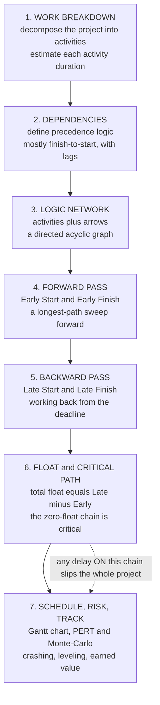

# 🗓️ Project Planning and Scheduling

> [!abstract] TL;DR
> Nearly **every engineering and construction project lives or dies by its schedule**, and the analytical heart of scheduling is one deceptively simple idea: out of a thousand interlocking tasks, **only one chain actually controls the finish date** — the **critical path**. Planning starts by **decomposing** the project into a **Work Breakdown Structure** of discrete **activities**, estimating each one's **duration**, and defining the **dependencies** (precedence logic — most commonly *finish-to-start*) that say what must happen before what. Draw those activities and dependencies as a network and you have a **directed acyclic graph**, and scheduling becomes a **longest-path** problem on it. The **Critical Path Method (CPM)** solves it in two sweeps: a **forward pass** computes every activity's **Early Start / Early Finish** (pushing each task as early as its predecessors allow), and a **backward pass** computes **Late Start / Late Finish** (working back from the deadline). Their difference is **total float** (slack) — how long an activity can slip before it delays the project. The **critical path is the longest chain through the network — the activities with *zero* float** — and it sets the **minimum possible project duration**: delay anything on it and the whole project slips, while non-critical activities have float to absorb hiccups. **This is where management attention belongs.** The schedule is visualized as a **Gantt (bar) chart**. Because real durations are **uncertain**, **PERT (Program Evaluation and Review Technique)** takes a **three-point estimate** — *optimistic / most-likely / pessimistic* — for each activity, turning each into a mean and variance; by the **central limit theorem** the project finish becomes a **probability distribution**, letting you compute the **probability of hitting a deadline** instead of pretending you know it exactly. But PERT is optimistic — the **flaw of averages** and **merge bias** (where parallel chains join, the finish takes the *max*, which is always later than any single mean) mean the true expected finish is later than the critical-path sum, so serious teams run **Monte-Carlo schedule simulation**. When the answer is "too slow," **crashing** spends money to shorten *critical* activities along the cheapest **time-cost tradeoff** curve, and **resource leveling / line-of-balance** reshape the plan around limited crews and equipment. Finally you **track** — updating progress, integrating **earned value**, and re-forecasting. Schedule overruns plague megaprojects precisely because teams neglect this logic; **mastering the critical path, float, and probabilistic scheduling is the difference between managing a project and being surprised by it.**

## Intuition

**Analogy — cooking a huge holiday dinner.** Picture the kitchen on the big day. The **turkey takes 4 hours** to roast, the **potatoes need 1 hour** to boil and mash, and **dessert needs the same oven the turkey is hogging** for the last hour. Some tasks *must wait* for others — you cannot carve the turkey before it roasts, and you cannot bake the pie until the turkey comes out. Other tasks *happen in parallel* — someone chops vegetables while the turkey roasts, costing no extra clock time. The whole meal is ready **only when the longest necessary chain of dependent tasks finishes.** If you want to know when dinner is served, you do not add up every task's time — you find that one **longest must-happen-in-order chain** (thaw → roast → rest → carve, plus the oven the pie is waiting on) and *that* sets the hour. The potatoes have **slack**: you can start them late and nobody notices. But burn an hour on the turkey and **dinner is late, period.**

Project scheduling is exactly this, scaled from a kitchen to a **skyscraper**. You list every activity, figure out what must precede what, and then find the **critical path** — the single longest chain of dependent tasks that dictates the earliest possible finish. Tasks *not* on that chain have **float**; you can delay them a little without hurting the deadline. Tasks *on* it have zero float — delay any one of them and the whole project slips by exactly that much. A tower crane cannot lift steel before the foundation cures; the curtain wall cannot go up before the frame tops out. Knowing **which of a thousand tasks actually control the finish date** — and therefore where to point your money, your best crew, and your worry — is the entire game. That is what the Critical Path Method computes, and what a Gantt chart lets you see at a glance.

---

## How It Works

### Core Mechanics

1. **Decompose the work — the Work Breakdown Structure (WBS).** Split the whole project hierarchically into progressively smaller pieces until you reach **activities**: discrete, assignable chunks of work with a clear start and end ("pour column footings," "erect steel level 3"). The WBS is the noun-list of the project; nothing that is not in it gets scheduled, resourced, or tracked.

2. **Estimate each activity's duration.** Using crew productivity rates, quantities, and history, assign each activity a **duration** (working days). This is where uncertainty enters — no single number is exactly right, which is the whole motivation for PERT below.

3. **Define the dependencies — the precedence logic.** State, for each activity, which activities must be complete (or started) before it can proceed. The dominant relation is **finish-to-start (FS)**: B cannot start until A finishes. Others exist — **start-to-start (SS)**, **finish-to-finish (FF)**, **start-to-finish (SF)** — often with **lags** ("wait 3 days for concrete to cure before stripping forms"). Together the activities-plus-dependencies form the **logic network**, a **directed acyclic graph (DAG)**: no activity can, directly or indirectly, depend on itself.

4. **Forward pass — Early Start / Early Finish.** Process activities in **topological order** (every activity after all its predecessors). Set each activity's **Early Start (ES)** = the *latest* Early Finish among its predecessors (you must wait for the slowest one), and **Early Finish (EF)** = ES + duration. The largest EF over all activities is the **project duration** — the earliest the whole thing can finish. Because ES takes a *max* over predecessors, the forward pass is literally computing the **longest path** through the DAG.

5. **Backward pass — Late Start / Late Finish.** Now sweep *backward* from the project end. Fix the final **Late Finish (LF)** = project duration, and for each activity set **LF** = the *earliest* Late Start among its successors (you must not delay past the tightest one) and **Late Start (LS)** = LF − duration. This tells you the latest each activity can happen *without* pushing the deadline.

6. **Total float and the critical path.** **Total float** = LS − ES = LF − EF: the amount an activity can slip without delaying the project finish. The **critical path** is the chain of activities with **zero total float** — the longest path through the network. It *is* the project duration; delaying any critical activity delays the whole project one-for-one, while non-critical activities have float to absorb disruption. **Free float** (a stricter cousin) is how much an activity can slip without delaying *even its immediate successors*, not just the project.

7. **Visualize, quantify risk, optimize, and track.** Draw the schedule as a **Gantt (bar) chart** — a bar per activity along a time axis — with the critical path highlighted. Model **uncertainty** with **PERT** three-point estimates and/or **Monte-Carlo** simulation to get the *probability* of meeting a date. If it is too slow, **crash** the critical path (spend to shorten it) along the **time-cost tradeoff**, and **level resources** to respect crew/equipment limits. As work proceeds, **update** actuals, integrate **earned value**, and **re-forecast** — the schedule is a living model, not a one-time drawing.

### Flow / Architecture



---

## Key Concepts

### Secondary Level

- **A project is a pile of tasks, and some tasks must wait for others.** You cannot paint a wall before you build it, or roof a house before you frame it. Drawing arrows from "must-happen-first" to "happens-next" gives you a **map of the project** — which is the first thing a planner makes.
- **Some tasks run at the same time; the project finishes when the longest chain does.** While the turkey roasts you can chop salad — that is *parallel* work and costs no extra time. The finish date is set by the **longest chain of tasks that must go one after another**, not by adding up everything.
- **That longest chain is the critical path.** It is the string of tasks that *controls the deadline*. If any task on it runs late, the **whole project runs late** by the same amount. This is where the manager watches most closely and puts the best crew.
- **Tasks off the critical path have "slack" (float).** They can start a little late or take a little longer without hurting the finish date, because something else on the critical path is the real bottleneck. Slack is the schedule's shock-absorber.
- **A Gantt chart is the picture of the plan.** It is a set of horizontal bars, one per task, laid out on a calendar — long bars for long tasks, lined up so you can see what overlaps and what waits. Almost every project you have ever seen managed used one.
- **Nobody knows durations exactly, so good planners plan for uncertainty.** A task "should" take 5 days but might take 3 on a lucky week or 8 on a bad one. Instead of one guess, planners use an *optimistic*, a *most-likely*, and a *pessimistic* number and ask, "What is the **chance** we finish by the promised date?" — which is far more honest than a single confident number.

### Undergraduate Level

- **The CPM two-pass algorithm.** On the activity DAG, the **forward pass** sets $ES_i = \max_{j \to i} EF_j$ and $EF_i = ES_i + d_i$; the project duration is $T = \max_i EF_i$. The **backward pass** sets $LF_i = \min_{i \to k} LS_k$ (with $LF = T$ at the finish) and $LS_i = LF_i - d_i$. **Total float** $TF_i = LS_i - ES_i = LF_i - EF_i$, and the **critical path** is the set of activities with $TF_i = 0$. Both passes are $O(V + E)$ — the same complexity as a topological-sort-based longest path — which is why even a schedule with tens of thousands of activities solves in milliseconds.
- **Free float vs total float.** $FF_i = \left(\min_{i \to k} ES_k\right) - EF_i$. Free float is float an activity can consume **without disturbing any successor's early start**; total float may be *shared* along a non-critical chain, so spending one activity's total float can steal it from the next. Confusing the two is a classic scheduling error.
- **Activity-on-Node (AoN / precedence diagramming) vs Activity-on-Arrow (AoA).** Modern practice uses **AoN**, where boxes are activities and arrows are dependencies (supporting SS/FF/SF relations and lags), superseding the older **AoA** networks that needed artificial "dummy" activities to express logic. All commercial tools (Primavera P6, MS Project) are AoN.
- **PERT three-point estimates.** For each activity take *optimistic* $a$, *most-likely* $m$, *pessimistic* $b$. The classic **beta approximation** gives expected duration $t_e = \dfrac{a + 4m + b}{6}$ and variance $\sigma^2 = \left(\dfrac{b - a}{6}\right)^2$. Run CPM on the $t_e$ values to find the expected critical path; the project's variance is the **sum of the variances of the critical activities**, $\sigma_T^2 = \sum_{i \in CP} \sigma_i^2$.
- **Probability of meeting a deadline.** By the **central limit theorem**, the sum of enough independent activity durations along the critical path is approximately **normal**, so $P(T \le T_{target}) \approx \Phi\!\left(\dfrac{T_{target} - \mu_T}{\sigma_T}\right)$ where $\Phi$ is the standard-normal CDF. This turns "we will finish June 1" into "we have a 72% chance of finishing by June 1" — a statement you can actually manage and negotiate against.
- **Reading a Gantt chart quantitatively.** A bar's left edge is ES, its length is the duration, and the gap to its Late Finish is its **total float**. Critical bars have no gap and touch end-to-end in an unbroken chain from start to finish.
- **Crashing and the time-cost tradeoff.** Each activity has a normal duration/cost and a shorter **crash** duration at higher cost; the **cost slope** is $\dfrac{C_{crash} - C_{normal}}{d_{normal} - d_{crash}}$ (dollars per day saved). To compress the schedule you **shorten the critical path by crashing the *cheapest* critical activity first**, re-checking after each step because shortening one path can make a *parallel* path become critical.

### Graduate Level

- **CPM as longest path — and why it is easy while general longest path is hard.** Longest path in an arbitrary graph is NP-hard, but on a **DAG** (which every valid precedence network is) it is solvable in linear time by relaxing edges in topological order — equivalent to running **Bellman-Ford / shortest path on negated weights** over a DAG. The acyclicity of dependencies is what makes scheduling tractable; a *cycle* in the logic (A waits on B waits on A) is both physically nonsensical and algorithmically fatal, and detecting it is exactly cycle detection on the DAG.
- **The merge bias and the flaw of averages.** PERT computes the mean of the *deterministic* critical path, but where two or more chains **merge**, the successor waits for the **maximum** of several random finishes, and $E[\max(X, Y)] \ge \max(E[X], E[Y])$. So the true expected project duration is **systematically longer** than the PERT estimate, and the more parallel near-critical paths merge, the worse the optimism. This is a case of Jensen's inequality / the "flaw of averages": plugging mean durations into a max-heavy network **understates** the schedule. It is why PERT is a first approximation, not the final word.
- **Monte-Carlo schedule risk analysis.** Sample each activity's duration from a fitted distribution (triangular, PERT-beta, lognormal), run CPM once per sample, and build the **empirical distribution of project completion** — capturing merge bias, correlated risks, and **path convergence** that analytic PERT misses. The output is a full **S-curve** (cumulative probability vs finish date) and a **criticality index** for each activity (the fraction of simulations in which it lands on the critical path), which reveals **near-critical** paths that a single deterministic CPM run hides entirely.
- **Resource-constrained project scheduling (RCPSP).** Classic CPM assumes **unlimited resources** — but you may have only two cranes or one paving crew. Adding renewable-resource capacity limits turns scheduling into the **NP-hard RCPSP**, solved in practice by priority-rule heuristics, metaheuristics, or (for small instances) **integer / constraint programming**. **Resource leveling** smooths peaks and troughs in resource demand (often by consuming float on non-critical activities), while **resource-limited scheduling** may *extend* the project beyond the CPM critical path — giving rise to the **critical chain** concept (Goldratt), which schedules around the binding *resource* constraint and inserts explicit **buffers** rather than padding each task.
- **Crashing as a linear program.** The **minimum-cost time-cost tradeoff** — compress the project to a target duration at least cost — is a classic **linear program**: minimize total crash cost subject to each activity's duration bounds and precedence constraints $t_j \ge t_i + d_i$ enforced through event times. Its structure is a **project-network / min-cost flow** dual, solvable by the simplex method or specialized network-flow algorithms; the full **time-cost tradeoff curve** (least cost for every achievable duration) is piecewise-linear and traced by parametric LP.
- **Line-of-balance and repetitive scheduling.** For **repetitive work** (floors of a tower, miles of pipeline, identical housing units), CPM's activity-per-task explodes and obscures crew flow. **Line-of-balance (LOB)** and **linear scheduling** instead plot *production rate* (units vs time), keeping crews continuously employed and revealing where a slow trade will **collide** with a fast one — a productivity-and-flow view that pure critical-path logic cannot express.
- **Earned Value Management (EVM) and forecasting.** Tracking integrates cost and schedule: **Schedule Variance** $SV = EV - PV$ and **Schedule Performance Index** $SPI = EV / PV$ quantify whether you are ahead or behind in *value* terms, and **Estimate at Completion** projects the final cost/date from performance to date. **Earned Schedule** corrects EVM's known flaw that classic $SV$ collapses to zero at project end regardless of lateness, by measuring schedule variance in **time units** along the planned value curve.
- **Why megaprojects overrun — the systemic view.** Empirically, large infrastructure projects overrun schedule and budget with striking regularity (Flyvbjerg's "iron law": *over budget, over time, under benefits, over and over*). Causes span **optimism bias** and **strategic misrepresentation** in estimating, **scope growth**, **merge bias** in overly parallel plans, and **ignored resource/logic constraints**. The antidotes are exactly this note's tools used honestly: **reference-class forecasting** (calibrate durations against past similar projects rather than inside-view guesses), **probabilistic** rather than single-point schedules, protected **critical-path/critical-chain** management, and disciplined **earned-value tracking**.

---

## Python Demo

```python
# ============================================================================
# PROJECT PLANNING & SCHEDULING -- CPM + PERT/Monte-Carlo, from scratch
#
#   (a) CRITICAL PATH METHOD: build an activity network (durations + precedence),
#       run the FORWARD pass (Early Start/Finish) and BACKWARD pass (Late
#       Start/Finish), compute TOTAL FLOAT, extract the zero-float CRITICAL
#       PATH (= project duration), and draw a GANTT chart with critical tasks
#       highlighted and each activity's float shown.
#
#   (b) SCHEDULE RISK: give every activity a PERT three-point estimate
#       (optimistic / most-likely / pessimistic). Analytically combine means &
#       variances along the critical path to get P(finish <= target) via the
#       normal CLT approximation, then run a MONTE-CARLO simulation of the whole
#       network -- exposing MERGE BIAS (the true mean finishes LATER than PERT).
#
# Requires: numpy, matplotlib   (normal CDF via math.erf -- no scipy needed)
import numpy as np
import matplotlib.pyplot as plt
from math import erf, sqrt

# ---------------------------------------------------------------------------
# The project: (name, most-likely duration, [predecessors])
# ---------------------------------------------------------------------------
activities = {
    "A": ("Design",          4, []),
    "B": ("Foundation",      6, ["A"]),
    "C": ("Order materials", 3, ["A"]),
    "D": ("Framing",         8, ["B", "C"]),
    "E": ("Roofing",         5, ["D"]),
    "F": ("Plumbing",        4, ["D"]),
    "G": ("Electrical",      3, ["D"]),
    "H": ("Interior",        6, ["E", "F", "G"]),
    "I": ("Finish/inspect",  2, ["H"]),
}

def topological_order(acts):
    """Kahn's algorithm on the precedence DAG (ties CPM to Topological_Sort)."""
    indeg = {k: len(v[2]) for k, v in acts.items()}
    succ  = {k: [] for k in acts}
    for k, (_, _, preds) in acts.items():
        for p in preds:
            succ[p].append(k)
    queue, order = [k for k in acts if indeg[k] == 0], []
    while queue:
        n = queue.pop(0)
        order.append(n)
        for m in succ[n]:
            indeg[m] -= 1
            if indeg[m] == 0:
                queue.append(m)
    if len(order) != len(acts):
        raise ValueError("cyclic precedence logic -- not a valid schedule!")
    return order, succ

ORDER, SUCC = topological_order(activities)

def cpm(durations):
    """Forward + backward pass -> ES,EF,LS,LF,float,critical set,duration."""
    ES, EF = {}, {}
    for n in ORDER:                                   # FORWARD: longest path
        ES[n] = max((EF[p] for p in activities[n][2]), default=0)
        EF[n] = ES[n] + durations[n]
    proj = max(EF.values())
    LS, LF = {}, {}
    for n in reversed(ORDER):                         # BACKWARD from deadline
        LF[n] = min((LS[s] for s in SUCC[n]), default=proj)
        LS[n] = LF[n] - durations[n]
    tf   = {n: LS[n] - ES[n] for n in activities}     # total float
    crit = [n for n in activities if tf[n] == 0]
    return ES, EF, LS, LF, tf, crit, proj

# ---------------------------------------------------------------------------
# (a) Deterministic CPM
# ---------------------------------------------------------------------------
dur = {k: v[1] for k, v in activities.items()}
ES, EF, LS, LF, TF, CRIT, T = cpm(dur)

print("=== (a) Critical Path Method ===")
print(f"{'act':<4}{'name':<16}{'dur':>4}{'ES':>4}{'EF':>4}{'LS':>4}{'LF':>4}"
      f"{'float':>7}  critical")
for n in ORDER:
    print(f"{n:<4}{activities[n][0]:<16}{dur[n]:>4}{ES[n]:>4}{EF[n]:>4}"
          f"{LS[n]:>4}{LF[n]:>4}{TF[n]:>7}   {'<== CRIT' if TF[n]==0 else ''}")
print(f"\nProject duration = {T} days")
print("Critical path    = " + " -> ".join(n for n in ORDER if n in CRIT))

# ---------------------------------------------------------------------------
# (b) PERT three-point estimates: (optimistic, most-likely, pessimistic)
# ---------------------------------------------------------------------------
pert = {
    "A": (3, 4, 7),  "B": (4, 6, 11), "C": (2, 3, 5),
    "D": (6, 8, 14), "E": (3, 5, 8),  "F": (3, 4, 6),
    "G": (2, 3, 5),  "H": (4, 6, 11), "I": (1, 2, 4),
}
te  = {k: (a + 4*m + b) / 6.0        for k, (a, m, b) in pert.items()}  # mean
var = {k: ((b - a) / 6.0) ** 2       for k, (a, m, b) in pert.items()}  # variance

# CPM on the PERT means -> expected critical path, then sum variances along it
_, _, _, _, TF_e, CRIT_e, mu_T = cpm(te)
sig2_T = sum(var[n] for n in CRIT_e)
sig_T  = sqrt(sig2_T)

def Phi(z):                                    # standard-normal CDF
    return 0.5 * (1.0 + erf(z / sqrt(2.0)))

T_target = 36.0
p_pert = Phi((T_target - mu_T) / sig_T)
print("\n=== (b) PERT schedule risk ===")
print(f"PERT expected duration mu_T = {mu_T:5.2f} days,  sigma_T = {sig_T:4.2f}")
print(f"Analytic P(finish <= {T_target:.0f}) = {p_pert*100:4.1f}%")

# Monte-Carlo: sample every activity, rerun CPM, collect project finish
rng = np.random.default_rng(7)
N   = 40000
sims = np.empty(N)
for i in range(N):
    d = {k: rng.triangular(a, m, b) for k, (a, m, b) in pert.items()}
    sims[i] = cpm(d)[6]                         # index 6 = project duration
mc_mean = sims.mean()
p_mc    = (sims <= T_target).mean()
print(f"Monte-Carlo mean duration   = {mc_mean:5.2f} days   "
      f"(MERGE BIAS: {mc_mean-mu_T:+.2f} d vs PERT)")
print(f"Monte-Carlo P(finish <= {T_target:.0f}) = {p_mc*100:4.1f}%")

# ---------------------------------------------------------------------------
# PLOTS
# ---------------------------------------------------------------------------
fig, ax = plt.subplots(1, 2, figsize=(15, 6))

# --- (a) Gantt chart with critical path + float ---------------------------
a0 = ax[0]
ypos = {n: len(ORDER) - 1 - i for i, n in enumerate(ORDER)}  # first activity on top
for n in ORDER:
    y = ypos[n]
    crit = TF[n] == 0
    a0.barh(y, dur[n], left=ES[n], height=0.55,
            color="crimson" if crit else "steelblue",
            edgecolor="black", zorder=3,
            label="critical (zero float)" if (crit and n == CRIT[0]) else
                  ("non-critical" if (not crit and n == "C") else None))
    if TF[n] > 0:                                # draw the float as a hollow bar
        a0.barh(y, TF[n], left=EF[n], height=0.55, color="none",
                edgecolor="steelblue", hatch="////", zorder=2)
        a0.text(LF[n] + 0.15, y, f"float {TF[n]}", va="center", fontsize=7,
                color="steelblue")
    a0.text(ES[n] + dur[n] / 2, y, n, va="center", ha="center",
            fontsize=8, color="white", fontweight="bold", zorder=4)
a0.set_yticks(list(ypos.values()))
a0.set_yticklabels([f"{n}: {activities[n][0]}" for n in ORDER])
a0.set_xlabel("time  [days]")
a0.set_title(f"(a) CPM Gantt chart -- critical path in red\nproject duration = {T} days")
a0.axvline(T, color="crimson", ls=":", lw=1.3)
a0.legend(loc="lower right", fontsize=8)
a0.grid(axis="x", alpha=0.3)

# --- (b) PERT/Monte-Carlo schedule-risk distribution ----------------------
a1 = ax[1]
a1.hist(sims, bins=60, density=True, color="steelblue", alpha=0.45,
        label="Monte-Carlo finishes")
xs = np.linspace(sims.min(), sims.max(), 400)
pdf = np.exp(-0.5 * ((xs - mu_T) / sig_T) ** 2) / (sig_T * sqrt(2 * np.pi))
a1.plot(xs, pdf, color="darkorange", lw=2.4, label="PERT normal approx.")
a1.axvline(mu_T, color="darkorange", ls="--", lw=1.6,
           label=f"PERT mean {mu_T:.1f} d")
a1.axvline(mc_mean, color="navy", ls="--", lw=1.6,
           label=f"MC mean {mc_mean:.1f} d  (merge bias)")
a1.axvline(T_target, color="crimson", lw=2.0,
           label=f"target {T_target:.0f} d")
a1.fill_between(xs, 0, pdf, where=(xs <= T_target), color="crimson", alpha=0.12)
a1.text(T_target + 0.3, a1.get_ylim()[1]*0.6,
        f"P(<= {T_target:.0f})\nPERT {p_pert*100:.0f}%  MC {p_mc*100:.0f}%",
        fontsize=8, color="crimson")
a1.set_xlabel("project completion  [days]")
a1.set_ylabel("probability density")
a1.set_title("(b) Schedule risk: PERT vs Monte-Carlo\nthe finish date is a distribution")
a1.legend(loc="upper right", fontsize=7.5)
a1.grid(alpha=0.3)

plt.tight_layout()
plt.savefig("project_planning_and_scheduling.png", dpi=150)
# Expected (approx): duration = 31 d; critical path A-B-D-E-H-I; C/F/G carry
#   float 3/1/2. PERT mu_T ~ 33.3 d, sigma_T ~ 2.4 d; analytic P(<=36) ~ 86%.
#   Monte-Carlo mean ~ 34+ d (LATER than PERT -- merge bias), P(<=36) a bit lower.
```

Running it prints the full CPM schedule table and draws the two panels that are the working planner's daily tools. **Panel (a)** is the **Gantt chart**: each activity is a bar starting at its Early Start, the **critical path glows red** in an unbroken chain from *Design* to *Finish/inspect* (A → B → D → E → H → I, totalling the **31-day** project duration), and every **non-critical** activity trails a hatched **float** bar showing exactly how much it can slip — *Order materials* has 3 days of float, *Plumbing* 1, *Electrical* 2. That picture answers the manager's first question instantly: *which tasks control the deadline, and which have room to breathe?* **Panel (b)** is **schedule risk**: because durations are uncertain, the finish date is not a number but a **distribution**. The orange curve is the tidy **PERT normal approximation** (mean ≈ 33.3 days), but the blue **Monte-Carlo histogram** — 40,000 full CPM runs on sampled durations — sits **visibly to the right**, its mean pushed later by **merge bias** every time parallel chains reconverge at *Framing* and *Interior*. The shaded region is the **probability of finishing by the target** (day 36): PERT says ≈ 86%, but the more honest Monte-Carlo says a little less. That gap between the neat average and the messy truth is precisely why serious schedules are simulated, not just summed.

---

## Real-World Applications

> **Example — the Polaris missile program and the birth of PERT (1958).** The U.S. Navy's Special Projects Office faced a staggering coordination problem: build a submarine-launched ballistic missile from thousands of interdependent, first-of-their-kind tasks, on a Cold-War deadline, with genuine uncertainty in every duration. Their answer, developed with Booz Allen and Lockheed, was **PERT** — model the program as a network, give each activity a three-point estimate, and compute the **probability** of hitting milestones and the **critical path** whose slippage would sink the schedule. Polaris was famously delivered ahead of schedule, and PERT's success made network scheduling standard practice across aerospace, defense, and construction. In the *same* years (1957) DuPont and Remington Rand developed the deterministic **Critical Path Method** for plant maintenance and construction, adding the **time-cost tradeoff / crashing** dimension. The two techniques — PERT for uncertainty, CPM for the critical path and crashing — fused into the network-scheduling toolkit every project engineer uses today.

- **Construction megaprojects and Primavera P6 / MS Project.** Every large building, bridge, tunnel, and refinery is planned in a CPM tool (Oracle **Primavera P6** dominates heavy construction). Owners contractually require a **critical-path schedule**, monthly **updates**, and often **schedule-risk (Monte-Carlo) analysis**; delay claims and litigation hinge on **critical-path forensic analysis** (which delays actually pushed the finish, and who owned the float). This is the direct descendant of the algorithm in the demo, scaled to tens of thousands of activities.
- **Turnarounds and shutdowns.** Refinery, power-plant, and factory **turnarounds** compress enormous scopes into brief outage windows where every hour of downtime costs a fortune. Planners **crash the critical path** relentlessly (extra crews, parallel work, pre-fabrication) and run the outage to the minute — a textbook time-cost-tradeoff optimization.
- **Aerospace and shipbuilding.** From spacecraft assembly to aircraft-carrier builds, the same PERT/CPM logic governs integration of thousands of subsystems with long-lead, uncertain durations — exactly Polaris's original problem, now with Monte-Carlo risk baked in.
- **Software delivery and roadmapping.** Although agile teams schedule differently (see the note below), **dependency mapping, critical-path thinking, and buffer management** still underpin release planning, cross-team roadmaps, and "what is actually blocking the launch" analysis — the same DAG-longest-path intuition applied to engineering work.
- **Event and film production.** Concert tours, stadium builds, and film shoots are one-shot projects with immovable dates and heavy parallelism; producers live and die by a critical path and the float that lets everything else flex around it.

---

## Common Pitfalls

- **Confusing the "critical path" with the "most important tasks."** The critical path is a *time* concept — the longest chain of dependencies — not a value or difficulty judgment. A trivial task with zero float (say, a required inspection sign-off) can be critical, while a hard, expensive task with ample float is not. Manage the schedule by **float**, not by gut feeling about importance.
- **Padding every activity instead of managing risk explicitly.** Adding "safety" to each task's duration (**Parkinson's Law** ensures the work expands to fill it, and the **student syndrome** ensures it starts late) inflates the whole schedule while *hiding* where the real risk lives. Use **explicit buffers** at merge points (critical-chain style) and **probabilistic estimates**, not silent per-task padding.
- **Treating PERT's single-point answer as the truth — the flaw of averages.** Plugging mean durations into a max-heavy network **underestimates** the finish because of **merge bias** ($E[\max] \ge \max E$). Where several near-critical chains converge, the true expected duration is later than the PERT sum. Simulate (Monte-Carlo) whenever parallelism and uncertainty both matter.
- **Ignoring near-critical paths.** A path with 2 days of float looks "safe" in a deterministic CPM run, but under uncertainty it may become critical in a large fraction of outcomes. A single deterministic critical path is a fragile view; use **criticality indices** from simulation to see which activities *might* control the finish.
- **Forgetting resource constraints — the schedule that assumes infinite crews.** Pure CPM assumes unlimited resources. If two "parallel" critical-region activities both need the *only* crane, they cannot actually run at once, and the real duration exceeds the CPM value. **Level resources** and check that the plan is physically executable before you commit to the date.
- **Total float is shared, not owned.** Spending one non-critical activity's total float can eliminate a downstream activity's float entirely (they lie on the same float chain). Track **free float** for what an activity can safely absorb alone, and never let one party quietly consume shared float.
- **A static schedule that is never updated.** A CPM network is a *model* of the future; once work starts, reality diverges. Failing to record **actual** progress, re-run the passes, and re-forecast means the "critical path" on the wall no longer reflects the real one — and the surprise lands at the deadline. Integrate **earned value / earned schedule** and update on a fixed cadence.
- **Crashing non-critical activities (spending money to save no time).** Accelerating an activity that is *not* on the critical path shortens nothing — you burn cost for zero schedule gain. Only crashing the **critical** path helps, and after each crash you must **re-identify** the critical path, because compressing one chain can make a parallel one newly critical.
- **Optimism bias and strategic misrepresentation in estimating.** Megaproject durations are systematically underestimated by inside-view guessing and, sometimes, deliberate lowballing to win approval. The corrective is **reference-class forecasting** — calibrate against the actual outcomes of past similar projects — plus honest probabilistic ranges instead of confident single numbers.

---

## Related Concepts

- [[Topological_Sort]] — the exact ordering the CPM forward and backward passes march in; scheduling *is* a longest-path computation over the topologically ordered precedence DAG, and a cycle here is an illegal (self-dependent) schedule.
- [[Bellman_Ford]] — CPM's longest path on a DAG is equivalent to shortest path on **negated** edge weights, which the relaxation logic of Bellman-Ford computes; on a DAG both run in linear time.
- [[Network_Flow]] — the project network is a flow-style graph, and the minimum-cost **crashing** problem is a network-flow / LP dual; float and bottleneck reasoning parallel flow and cut ideas.
- [[Simplex_Method]] — the minimum-cost **time-cost tradeoff** (compress the project to a target duration at least cost) is a **linear program** solved by simplex, tracing the piecewise-linear crash curve.
- [[Integer_Programming]] — the **resource-constrained project scheduling problem (RCPSP)** — CPM with limited crews and equipment — is NP-hard and modeled exactly as an integer/constraint program.
- [[Common_Probability_Distributions]] — PERT models each activity duration with a **beta / triangular** distribution and, via the CLT, the project finish as approximately **normal**; the normal CDF gives the probability of meeting a deadline.
- [[Random_Variables]] — the finish date is a **sum of random variables**; means add, variances of independent activities add along the critical path, and merge points introduce the $E[\max] \ge \max E$ bias.
- [[Delivery_and_Execution]] — the engineering-leadership discipline of shipping on time; critical-path thinking, dependency management, and buffering are the software analogue of construction scheduling.
- [[Technical_Roadmapping]] — sequencing dependent initiatives across quarters is the same DAG-longest-path logic applied to product and platform work.
- [[Agile_Product_Delivery]] — the contrasting paradigm: iterative, flow-based delivery rather than fixed CPM networks, yet still reliant on dependency mapping and critical-path reasoning for cross-team release planning.

*(Sibling Transportation & Construction notes extend this material: **Construction_Engineering_and_Management** is the broad companion this note deep-dives — it covers contracts, estimating, safety, and the management context in which scheduling lives; **Construction_Materials_and_Quality** supplies the cure times, lead times, and inspection holds that become durations and lags in the network; **Transportation_Engineering_and_Traffic_Flow** applies phased scheduling to road and rail construction under live traffic; **Infrastructure_Resilience_and_Asset_Management** extends scheduling into the long-horizon maintenance and renewal planning of built assets; and **The_Reach_and_Future_of_Civil_Engineering** frames why schedule performance — the chronic overrun of megaprojects — is one of the discipline's defining challenges.)*

---

## Review Questions

**Secondary**
1. Explain, using the holiday-dinner analogy, what the **critical path** of a project is and why a task with **slack (float)** can run a bit late without delaying the whole project — but a task on the critical path cannot. Then describe what a **Gantt chart** shows and why a manager finds it useful.

**Undergraduate**
2. A small project has activities with durations and predecessors: A(4, none), B(6, A), C(3, A), D(8, B & C), E(5, D), F(4, D), G(3, D), H(6, E,F,G), I(2, H). (a) Run the **forward and backward passes** to find each activity's ES, EF, LS, LF, and **total float**. (b) State the **project duration** and the **critical path**. (c) Activity C is delayed by 2 days — does the project slip? What if it is delayed by 4 days? Explain using its float. (d) Give each activity a PERT three-point estimate and outline how you would compute the **probability of finishing within 36 days**.

**Graduate**
3. Your deterministic CPM says a project finishes in 31 days with a single critical path, but the client wants a **probabilistic** commitment and the plan is heavily parallel. (a) Explain **merge bias** and why the PERT/CLT estimate of the mean finish is **optimistic** relative to a Monte-Carlo simulation; relate it to $E[\max(X,Y)] \ge \max(E[X], E[Y])$. (b) You must compress the schedule to 27 days at minimum cost — formulate the **crashing** problem as a linear program and explain why you must re-identify the critical path after each crash step. (c) The plan assumes unlimited crews, but you have only one crane shared by two critical-region activities — describe how **resource-constrained scheduling / resource leveling** changes the critical path and duration, and what **critical-chain** buffering would add. Which analyses would you actually run before signing a contractual completion date, and why?

---

## Sources

- Hendrickson, C. & Au, T. — *Project Management for Construction* (Prentice Hall; free online edition) — WBS, CPM/PERT networks, resource scheduling, and cost-time tradeoffs for civil projects.
- Callahan, M. T., Quackenbush, D. G. & Rowings, J. E. — *Construction Project Scheduling* (McGraw-Hill) — practical CPM network development, float analysis, updating, and delay analysis.
- Project Management Institute — *A Guide to the Project Management Body of Knowledge (PMBOK Guide)* — the standard schedule-management process: activity definition, sequencing, estimating, critical path, and control.
- Moder, J. J., Phillips, C. R. & Davis, E. W. — *Project Management with CPM, PERT and Precedence Diagramming* (Van Nostrand Reinhold) — the classic rigorous treatment of network scheduling, PERT probability, and precedence diagramming.
- Flyvbjerg, B. — *"What You Should Know About Megaprojects and Why"* (Project Management Journal, 2014) — the empirical case for reference-class forecasting and probabilistic scheduling against chronic overruns.

---

#civil-engineering #project-scheduling #critical-path #CPM-PERT #float
