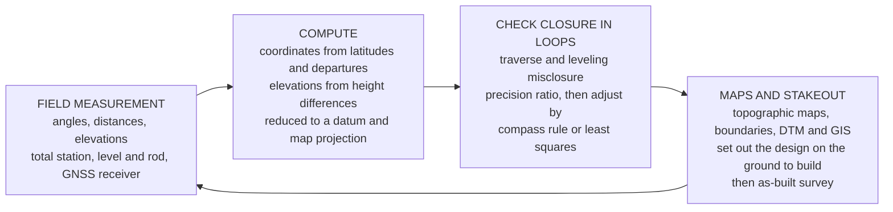

# 📐 Surveying and Geomatics

> [!abstract] TL;DR
> **Surveying** is the ancient, precise art of **measuring the Earth** — turning **angles, distances, and elevations** into **coordinates**, and coordinates into the **maps and stakes** that guide every construction project. Before anyone builds a bridge, lays a pipe with the right fall, subdivides a parcel, or sets out a building, someone must know **exactly where things are**: where the property line runs, how the ground slopes, where the pipe must sit so water flows downhill. Surveyors do this with the **total station** (angles and distances in one instrument), the **level and rod** (elevation differences), and **GNSS/GPS** (satellite positioning to the centimetre). The discipline's eternal wisdom is that **no measurement is perfect** — every tape and angle carries a tiny error — so surveyors close their work in **loops** and check that they return to where they started; the leftover **misclosure** exposes the error, which they then **distribute** (by the compass/**Bowditch rule**, or rigorously by **least squares**) to reconcile everything. Two great families of computation dominate: **traversing** (a connected loop of stations reduced to coordinates via **latitudes and departures**, with a closure check) and **leveling** (height differences chained along a line and looped back to a **benchmark**). Modern **geomatics** supercharges this with **GNSS RTK**, **LiDAR** point clouds, **photogrammetry and drones**, and **GIS** — while the timeless ideas of **datums, projections, the geoid versus the ellipsoid, error theory, and closure** keep the whole spatial framework honest. It is the **measurement backbone** of civil engineering and all geospatial data.

## Intuition

**Analogy:** Imagine you are handed a blank field and told to build a house exactly on a plot whose corners are described only by old deed measurements, then to trench a sewer from that house to a main 200 metres away so that it drops **precisely** enough for gravity to move the waste — no more, no less. You cannot start pouring concrete. First you have to **pin down reality's geometry**: where the four corners actually sit, how the ground rises and falls between them, which way is true north. That pinning-down is **surveying** — the art of converting the messy real world into clean numbers (coordinates and elevations) accurate enough to build on, and then converting those numbers *back* into stakes hammered into the dirt that tell the crew where to dig.

Now here is the surveyor's oldest and deepest wisdom. Suppose you pace out a big loop around the property — corner to corner and back to your starting stake — measuring each leg. When you finish, your computed position for the starting stake will **not** land exactly on the real stake; it misses by a few centimetres. That gap is the **misclosure**, and it is not a failure — it is a *gift*. Because you looped back to a known truth, the loop **reveals the total error** you accumulated, which you would otherwise never see. You then **spread that error back** across all the legs to make everything consistent. This is the beating heart of the craft: **measure, loop, check the closure, adjust** — and never, ever trust a measurement you have not checked against a redundant one.

---

## How It Works

### Core Mechanics

1. **Measure the three primitives.** Every survey reduces to three raw quantities: **distances** (a steel tape, or an **EDM** — electronic distance meter — firing a beam to a prism), **angles** (a **theodolite**, or a **total station** that combines angle and distance in one instrument), and **elevations** (**differential leveling** — sighting a graduated rod through a precise **level**). Measured slope quantities are reduced to **horizontal** distances and **vertical** height differences.

2. **Fix a framework: datum, projection, control.** Coordinates mean nothing without a reference. Positions are tied to a **geodetic datum** (WGS84, NAD83) and flattened onto a **map projection** (State Plane, **UTM**) so that curved-Earth positions become plane $x,y$ coordinates. Everything hangs off a **control network** — trusted **horizontal control** points and vertical **benchmarks** of known coordinate and elevation.

3. **Traverse: turn a loop of measurements into coordinates.** Run a connected series of stations. For each leg, the measured length $L$ and its **azimuth** (direction clockwise from north) give a **latitude** $= L\cos(\text{az})$ (the north–south component) and a **departure** $= L\sin(\text{az})$ (the east–west component). Accumulating these from a start point yields every station's coordinates.

4. **Check the closure.** For a **closed** loop, the latitudes must sum to zero and so must the departures — you ended where you began. In reality they do not: the residual sums are the **misclosure** $(\Delta N,\ \Delta E)$. Its magnitude $\sqrt{\Delta N^2+\Delta E^2}$ divided into the perimeter gives the **precision ratio** ($1:5000$ means one part error in five thousand).

5. **Adjust the error.** The **compass (Bowditch) rule** distributes the misclosure to each leg **in proportion to its length**, forcing the loop to close. The modern, rigorous replacement is **least-squares adjustment**, which uses *redundant* measurements and their uncertainties to find the single most probable set of coordinates and honest error estimates.

6. **Level for elevations.** Height is chained separately: at each setup, **height difference** $=$ backsight $-$ foresight. Running a level loop out to points and **back to the benchmark** should return the starting elevation; the residual is the leveling **misclosure**, distributed by distance.

7. **Deliver maps and stakeout.** The reconciled coordinates become **topographic maps, boundary plats, digital terrain models, and GIS layers** — and, run in reverse, **construction stakeout**: hubs and stakes that put the design's geometry onto the ground so it can be built, followed by an **as-built** survey that verifies what was constructed.

### Flow / Architecture



---

## Key Concepts

### Secondary Level

- **You cannot build until you know where things are.** Surveying is measuring the Earth precisely: taking **angles, distances, and heights** and turning them into **coordinates** — the exact spot of every corner, pipe, and property line. It is the very first step of any project.
- **The tools.** A **tape** or laser measures distance, a **level and rod** measure how the ground goes up and down, a **total station** measures both angles and distances, and **GPS** finds your position from satellites in the sky — to within a few centimetres.
- **Loops and checks are everything.** A surveyor measures around a loop and comes **back to the starting point**. If the numbers do not bring you exactly back to where you began, that little gap — the **misclosure** — shows how much error crept in. You then spread that error out to fix the whole loop. No measurement is trusted until it is checked.
- **Making maps and putting in stakes.** Surveyors do two opposite jobs: they **map** what already exists (the shape of the land, where the boundaries run), and they **stake out** what is to be built — hammering markers into the ground that tell the construction crew exactly where to dig, pour, and build.

### Undergraduate Level

- **Distance, angle, and leveling reduction.** **EDM** distances are reduced from slope to **horizontal**; theodolite/total-station **horizontal and vertical angles** orient each sight. **Differential leveling** uses the **height-of-instrument** method: $HI = \text{known elevation} + BS$, and a new point's elevation $= HI - FS$, where $BS$ is the backsight and $FS$ the foresight.
- **Traverse computation.** For each leg, **latitude** $= L\cos(\text{az})$ and **departure** $= L\sin(\text{az})$. For a **closed traverse**, $\sum \text{lat}=0$ and $\sum \text{dep}=0$ ideally; the actual sums are the **misclosure** $(\Delta N,\Delta E)$. **Linear misclosure** $=\sqrt{\Delta N^2+\Delta E^2}$, and **precision** $= \dfrac{\text{perimeter}}{\text{linear misclosure}}$, reported as $1:N$.
- **Compass (Bowditch) rule.** Distribute the misclosure to each leg proportional to its length: $\delta(\text{lat})_i = -\dfrac{L_i}{\sum L}\,\Delta N$, $\delta(\text{dep})_i = -\dfrac{L_i}{\sum L}\,\Delta E$. The **transit rule** distributes proportional to the latitude/departure magnitudes instead — used when angles are more reliable than distances.
- **Bearings, azimuths, and angle checks.** **Azimuths** run $0$–$360^\circ$ clockwise from north; **bearings** are quadrant angles (N $37^\circ$ E). The **interior-angle** sum of a closed polygon must equal $(n-2)\times 180^\circ$ — an independent angular closure check before coordinates are even computed.
- **Coordinate systems and control.** **Datums** (WGS84, NAD83) define the reference surface; **projections** (State Plane, **UTM**) map it to plane coordinates. Surveys tie into **horizontal control** and vertical **benchmarks**; **allowable leveling misclosure** scales like $C\sqrt{K}$ (constant times the square root of loop length).
- **Error types.** **Systematic** errors (a mis-standardized tape, EDM prism constant, level collimation) bias every reading the same way and must be *modeled out*; **random** errors scatter both ways and are *adjusted*; **blunders** (a transposed digit, a wrong target) must be *found and removed*, never adjusted. **Precision** (repeatability) is not **accuracy** (closeness to truth).

### Graduate Level

- **Least-squares adjustment.** With **redundant** observations, write an **observation equation** for each measurement, weight it by the inverse of its variance, and solve the **normal equations** $(A^{\mathsf T}WA)\hat{x}=A^{\mathsf T}Wl$ for the most-probable coordinates. This rigorous **parametric adjustment** replaces the compass rule, yields a full **variance–covariance** matrix, and produces station **error ellipses** — the honest geometry of uncertainty. *This is the same normal-equations machinery as statistical regression and linear-system solution.*
- **Geoid versus ellipsoid — why GPS heights are not elevations.** GNSS returns **ellipsoidal height** $h$ above the smooth mathematical **ellipsoid**; engineering **orthometric height** $H$ (elevation, plumb-line height above mean sea level) refers to the lumpy **geoid**. They differ by the **geoid undulation** $N$: $H = h - N$. Using raw GPS height as an elevation can put a "downhill" pipe running uphill. Vertical datums (**NAVD88**) and geoid models reconcile them.
- **GNSS positioning.** A receiver solves position from **pseudoranges** to $\geq 4$ satellites; **differential GPS** and **RTK** (real-time kinematic) exploit **carrier-phase** measurements and a base station to reach **centimetre** accuracy by resolving integer **phase ambiguities**; **network RTK / CORS** extends this over regions. The receiver's position solve is itself a small **least-squares** problem — see [[Guidance_Navigation_and_Control]].
- **Grid, ground, and scale factor.** Projected (grid) distances differ from true **ground** distances by a **scale factor** plus an elevation (sea-level) reduction. Large sites must apply a **combined factor** or stake out in the wrong place by parts per thousand.
- **Modern geomatics — reality capture.** **LiDAR / laser scanning** produce dense **point clouds**; **photogrammetry** and drone/**UAS** structure-from-motion build orthophotos and **digital terrain/elevation models (DTM/DEM)**; **GIS** stores and analyzes spatial layers; **remote sensing** and InSAR extend to satellite scale. These feed **BIM** and digital-twin workflows — the modern face of surveying.
- **Route surveying.** Roads and railways are set out with **horizontal circular curves** (and **spiral/transition** curves for smooth superelevation) and **vertical parabolic curves** joining grades, staked by **deflection angles** and station-plus-offset — the geometric bridge from surveying into highway design.

---

## Python Demo

```python
# ============================================================================
# SURVEYING COMPUTATIONS: the two workhorse loop-closure problems.
#
#   (a) CLOSED TRAVERSE -> from a loop of measured leg lengths and azimuths,
#       compute each station's coordinates via LATITUDES and DEPARTURES, find
#       the MISCLOSURE (how far the computed end misses the start), the
#       PRECISION RATIO, and adjust it with the COMPASS (BOWDITCH) RULE so the
#       loop closes exactly. We plot the RAW (open) loop vs the ADJUSTED one.
#
#   (b) DIFFERENTIAL LEVELING LOOP -> run height differences around a loop back
#       to a benchmark; the return elevation should equal the start. The
#       residual is the loop MISCLOSURE, distributed by distance. We plot the
#       elevation profile: RAW (does not close) vs ADJUSTED (returns to BM).
#
# The eternal lesson: because we loop back to a KNOWN truth, the leftover
# misclosure reveals the total error -- which we then distribute to reconcile.
#
# Requires: numpy, matplotlib
import numpy as np
import matplotlib.pyplot as plt

rng = np.random.default_rng(7)

# ============================================================================
# (a) CLOSED TRAVERSE: closure check + Bowditch (compass-rule) adjustment
# ============================================================================
# The "true" closed loop -- a surveyor never knows this; it only seeds
# realistic field measurements. Coordinates: Northing (N), Easting (E) in m.
stations = ["A", "B", "C", "D"]
true_N = np.array([   0.0,  90.0, -60.0, -140.0])   # a loop that closes to A
true_E = np.array([   0.0, 150.0, 240.0,   60.0])

# true legs A->B->C->D->A, then their lengths and azimuths (clockwise from N)
dN_true = np.diff(np.append(true_N, true_N[0]))
dE_true = np.diff(np.append(true_E, true_E[0]))
L_true  = np.hypot(dN_true, dE_true)
az_true = np.degrees(np.arctan2(dE_true, dN_true)) % 360.0

# FIELD MEASUREMENTS = truth + small instrument errors
#   EDM distance  ~ +/- 3 cm ,   total-station azimuth ~ +/- 0.02 deg
L_meas  = L_true  + rng.normal(0.0, 0.03, L_true.size)
az_meas = az_true + rng.normal(0.0, 0.02, az_true.size)

# latitudes (N-component) and departures (E-component) of each measured leg
lat = L_meas * np.cos(np.radians(az_meas))
dep = L_meas * np.sin(np.radians(az_meas))

# RAW traverse: accumulate from A -- it will NOT return exactly to A
raw_N = np.concatenate(([true_N[0]], true_N[0] + np.cumsum(lat)))
raw_E = np.concatenate(([true_E[0]], true_E[0] + np.cumsum(dep)))

# MISCLOSURE: computed endpoint minus the true start (should be zero)
mis_N   = raw_N[-1] - true_N[0]        # = sum(lat)
mis_E   = raw_E[-1] - true_E[0]        # = sum(dep)
lin_mis = np.hypot(mis_N, mis_E)       # linear misclosure
perim   = L_meas.sum()                 # traverse perimeter
precision = perim / lin_mis            # reported as 1 : precision

# COMPASS (BOWDITCH) RULE: distribute misclosure proportional to leg length
lat_adj = lat - (L_meas / perim) * mis_N
dep_adj = dep - (L_meas / perim) * mis_E
adj_N = np.concatenate(([true_N[0]], true_N[0] + np.cumsum(lat_adj)))
adj_E = np.concatenate(([true_E[0]], true_E[0] + np.cumsum(dep_adj)))

print("=== (a) Closed traverse -- closure & Bowditch adjustment ===")
print(f"  perimeter            : {perim:8.2f} m")
print(f"  misclosure  dN, dE   : {mis_N*1000:+7.1f} mm , {mis_E*1000:+7.1f} mm")
print(f"  linear misclosure    : {lin_mis*1000:7.1f} mm")
print(f"  precision ratio      : 1 : {precision:,.0f}")
print(f"  loop closes after adjustment (end - start): "
      f"{(adj_N[-1]-true_N[0])*1000:+.3f} mm , {(adj_E[-1]-true_E[0])*1000:+.3f} mm")

# ============================================================================
# (b) DIFFERENTIAL LEVELING LOOP: height differences around a loop to a
#     benchmark, then distribute the loop misclosure by distance.
# ============================================================================
BM       = 100.000                                                   # benchmark [m]
leg_dist = np.array([45, 60, 55, 70, 50, 65, 40, 55.0])              # leg lengths [m]
dz_true  = np.array([1.20, -0.65, 1.75, -1.20, 1.90, -1.10, -0.85, -1.05])  # sums 0
dz_meas  = dz_true + rng.normal(0.0, 0.004, dz_true.size)            # +/- ~4 mm reads

chain    = np.concatenate(([0.0], np.cumsum(leg_dist)))              # cumulative dist
elev_raw = np.concatenate(([BM], BM + np.cumsum(dz_meas)))           # raw elevations
mis_lev  = elev_raw[-1] - BM                                         # loop misclosure
corr     = -(chain / chain[-1]) * mis_lev                            # distribute by dist
elev_adj = elev_raw + corr                                           # closes to BM

print("\n=== (b) Differential leveling loop ===")
print(f"  loop length          : {chain[-1]:8.1f} m")
print(f"  loop misclosure      : {mis_lev*1000:+7.1f} mm")
print(f"  after distribution, return elevation - BM: {(elev_adj[-1]-BM)*1000:+.3f} mm")

# ------------------------------- plotting --------------------------------
fig, (axL, axR) = plt.subplots(1, 2, figsize=(14, 6))
fig.suptitle("Surveying & Geomatics: Traverse Closure/Adjustment  &  Leveling Loop",
             fontsize=14, fontweight="bold")

# LEFT: raw (open) traverse vs Bowditch-adjusted (closed) traverse
axL.plot(raw_E, raw_N, "o--", color="#d62728", lw=1.8, ms=6,
         label="raw traverse (measured, does not close)")
axL.plot(adj_E, adj_N, "o-",  color="#1f77b4", lw=2.4, ms=6,
         label="adjusted (Bowditch rule, closed)")
for i, name in enumerate(stations):                       # label the stations
    axL.annotate(name, (adj_E[i], adj_N[i]), textcoords="offset points",
                 xytext=(9, 7), fontsize=12, fontweight="bold")
# the misclosure: from the raw endpoint back to the true start A
axL.annotate("", xy=(true_E[0], true_N[0]), xytext=(raw_E[-1], raw_N[-1]),
             arrowprops=dict(arrowstyle="->", color="k", lw=1.8))
axL.plot([raw_E[-1]], [raw_N[-1]], "kx", ms=10)
axL.text(0.03, 0.03,
         f"linear misclosure = {lin_mis*1000:.0f} mm\n"
         f"precision = 1 : {precision:,.0f}\nperimeter = {perim:.0f} m",
         transform=axL.transAxes, fontsize=9, va="bottom",
         bbox=dict(boxstyle="round", fc="#fff7e6", ec="gray"))
axL.set_xlabel("Easting  E  [m]")
axL.set_ylabel("Northing  N  [m]")
axL.set_title("(a) Closed traverse: misclosure & Bowditch adjustment", fontsize=11)
axL.set_aspect("equal", adjustable="datalim")
axL.legend(loc="upper right", fontsize=8)
axL.grid(alpha=0.3)

# RIGHT: leveling loop profile -- raw (misses BM) vs adjusted (returns to BM)
axR.plot(chain, elev_raw, "o--", color="#d62728", lw=1.8, ms=6,
         label="raw levels (loop does not close)")
axR.plot(chain, elev_adj, "o-",  color="#1f77b4", lw=2.4, ms=6,
         label="adjusted (distributed by distance)")
axR.axhline(BM, color="#2ca02c", ls=":", lw=1.6, label=f"benchmark BM = {BM:.3f} m")
axR.annotate("", xy=(chain[-1], BM), xytext=(chain[-1], elev_raw[-1]),
             arrowprops=dict(arrowstyle="<->", color="k", lw=1.6))
axR.text(0.03, 0.03,
         f"loop length = {chain[-1]:.0f} m\n"
         f"loop misclosure = {mis_lev*1000:+.0f} mm\ndistributed by distance",
         transform=axR.transAxes, fontsize=9, va="bottom",
         bbox=dict(boxstyle="round", fc="#fff7e6", ec="gray"))
axR.set_xlabel("cumulative distance along level line  [m]")
axR.set_ylabel("elevation  [m]")
axR.set_title("(b) Leveling loop: closure check to the benchmark", fontsize=11)
axR.legend(loc="upper left", fontsize=8)
axR.grid(alpha=0.3)

plt.tight_layout(rect=[0, 0, 1, 0.94])
plt.show()
```

Running this prints both closure reports and draws the two panels that define practical surveying. The **left panel** overlays the **raw traverse** — the loop as *measured*, which drifts and fails to return to station **A**, the little black cross marking where the computation lands and the arrow measuring the **linear misclosure** (tens of millimetres over a ~700 m perimeter, a precision near $1:5000$) — against the **Bowditch-adjusted** loop, where the misclosure has been spread across the legs in proportion to their length so the polygon **closes exactly** on A. The **right panel** is the **leveling loop**: height differences chained from a **benchmark** out to eight turning points and back; the *raw* profile misses the benchmark on return by the **loop misclosure**, while the *adjusted* profile, corrected in proportion to distance travelled, lands back on BM to the millimetre. Both panels tell the same story that surveyors have lived by for centuries: **loop back to a known truth, read the misclosure it exposes, and distribute it** to make every coordinate and elevation consistent.

---

## Real-World Applications

> **Example:** The **Channel Tunnel** is surveying's discipline of closure written across the seabed. Two boring machines set out from **England and Folkestone** and from **France and Coquelles**, driving toward a rendezvous roughly **40 km** out under the sea where the workers on either side could never see each other or the sky. Everything depended on **geodetic control**: a common datum tying the British and French networks together, **gyro-theodolites** transferring a true azimuth down the shafts (where GPS cannot reach), and relentless traverse-and-leveling checks propagating coordinates through the growing tunnel. When the two service-tunnel headings broke through in **December 1990**, they met with a horizontal misalignment of only about **358 mm** and a vertical one of about **58 mm** — a "misclosure" of a third of a metre over tens of kilometres of blind tunneling. Every idea in this note is present: control networks, azimuth transfer, coordinate propagation by traverse, elevation by leveling, and the merciless checking of closure that turns accumulated tiny errors into a known, correctable quantity rather than a catastrophe.

- **Boundary and cadastral surveys.** Retracing property corners from deeds and monuments underpins **property law** and land title; a boundary survey's traverse closure is what makes a plat legally defensible.
- **Construction stakeout and machine control.** Surveyors set hubs, offset stakes, and grade marks so crews build to the design; modern **RTK-GPS machine control** guides dozers and graders to centimetre-accurate cut/fill in real time, with as-built surveys verifying the result.
- **Topographic mapping and GIS.** Ground and aerial surveys build the **topographic maps, DTMs, and GIS layers** every site design starts from — contours, drainage, existing utilities, and volumes.
- **Deformation and structural monitoring.** Repeated precise surveys (total station, GNSS, InSAR) track **dam, bridge, and slope movement** to millimetres — the engineering cousin of the crustal-motion work in [[Space_Geodesy_GPS_and_Crustal_Deformation]].
- **LiDAR and drone corridor mapping.** **Aerial LiDAR** and **UAS photogrammetry** capture highway corridors, quarries, and disaster zones as dense point clouds, computing stockpile volumes and terrain models in hours instead of weeks.
- **National geodetic frameworks.** Continental **control networks and CORS stations** (tied to datums like NAD83/WGS84) provide the shared coordinate backbone that every local survey, map, and GPS device inherits.

---

## Common Pitfalls

- **Skipping the closure / no redundancy.** An **open** traverse or a level run with no loop back to a known point has **no independent check** — a blunder is invisible and propagates silently into every downstream coordinate. Always close loops or tie into two known control points; redundancy is the only thing that reveals error.
- **Confusing ellipsoidal (GPS) height with elevation.** GNSS gives **ellipsoidal height** $h$; engineering needs **orthometric elevation** $H = h - N$ (with $N$ the geoid undulation). Treating raw GPS height as an elevation can make a gravity sewer or drainage swale run **uphill** — a classic, expensive field failure.
- **Datum and projection mismatches.** Mixing **NAD27** and **NAD83** coordinates, or the wrong **UTM zone** or State Plane zone, shifts positions by tens of metres with no obvious symptom. Always confirm the horizontal *and* vertical datum, the projection, and the epoch before combining data.
- **Grid versus ground distance.** Projected **grid** distances differ from real **ground** distances by the projection **scale factor** and an elevation reduction. On large or high-elevation sites, staking grid distances directly misplaces points by parts per thousand — apply the **combined factor**.
- **Leaving systematic errors uncorrected.** A tape not standardized, a wrong **EDM prism constant**, or a level with **collimation** error biases *every* reading the same direction and does **not** average out. Calibrate instruments and **balance backsight/foresight distances** in leveling to cancel collimation and curvature.
- **Adjusting a blunder.** Compass-rule and least-squares adjustment assume **random** error. A **blunder** (a transposed digit, a wrong target, a misread rod) must be **detected and removed first** — smearing a gross mistake across all legs corrupts the whole survey while hiding the culprit.
- **Mistaking precision for accuracy.** Tightly repeatable measurements around a **wrong control point** are precisely wrong. Accuracy demands tying to correct, higher-order control — not just consistent readings.

---

## Related Concepts

**Parent hub (this vault)**
- [[Civil_Engineering_Overview]] — the six-pillar map of civil engineering; this note **opens Pillar 5, Transportation & Construction**, whose surveying half provides the spatial framework every project needs

**The shape of the Earth and geodesy (Geophysics vault)**
- [[Earths_Gravity_Field_and_Geodesy]] — the **geoid versus ellipsoid**, gravity, and the reference surfaces that make "elevation" meaningful and explain why GPS heights differ from levelled elevations
- [[Space_Geodesy_GPS_and_Crustal_Deformation]] — the satellite-geodesy science behind **GNSS positioning** and the millimetre deformation monitoring that surveying applies to dams, bridges, and faults

**Satellite navigation (Aerospace Engineering vault)**
- [[Guidance_Navigation_and_Control]] — how a receiver solves **position from satellite ranges**, the least-squares fix at the heart of GNSS surveying
- [[Satellites_and_Space_Missions]] — the **GPS/GNSS constellations** themselves, the orbiting infrastructure surveying now depends on

**Error theory and least squares (Mathematics vault)**
- [[Statistical_Inference]] — the estimation and uncertainty framework behind **precision, accuracy, and error propagation** in measurements
- [[Regression_and_Correlation]] — **least-squares fitting** via the normal equations, the same mathematics as rigorous survey network adjustment
- [[Systems_of_Linear_Equations]] — solving the **normal equations** $(A^{\mathsf T}WA)\hat{x}=A^{\mathsf T}Wl$ that a least-squares traverse/network adjustment reduces to

*Within this vault (Pillar 5 siblings and a Pillar 3 neighbour, referenced here in prose):* **Transportation_Engineering_and_Traffic_Flow** (the geometry surveying stakes out for roads), **Pavement_and_Highway_Design** (route surveying's horizontal and vertical curves feed pavement layout), **Construction_Engineering_and_Management** (surveying provides construction layout and as-built control), **Soil_Mechanics_Fundamentals** (site investigation surveys the ground that everything rests on), and **Sustainable_and_Smart_Infrastructure** (GIS, digital terrain models, and BIM as the geospatial backbone of smart infrastructure).

---

## Review Questions

**Secondary**
1. A surveyor walks a big loop around a piece of land — corner to corner and finally back to the very stake they started from — measuring each side. When they finish the calculation, their computed position for the starting stake misses the real stake by 4 centimetres. Explain in plain words why this **gap** is actually *useful* rather than a failure, what it is called, and what the surveyor does about it. Why would an **open** line (one that never returns to a known point) give no such warning?

**Undergraduate**
2. A four-sided closed traverse has a perimeter of 700 m and, after computing latitudes and departures, a latitude misclosure of $+90$ mm and a departure misclosure of $-110$ mm. (a) Compute the **linear misclosure** and the **precision ratio** ($1:N$). (b) State the **compass (Bowditch) rule** correction you would apply to a 200 m leg's latitude and departure. (c) Explain why the interior-angle sum check $(n-2)\times 180^\circ$ is worth doing **before** you ever compute coordinates, and what class of error it catches that the closure alone might mask.

**Graduate**
3. A contractor sets out a 300 m gravity sewer using a hand-held **GNSS** unit and stakes the invert elevations directly from the receiver's reported heights. On construction, the pipe will not drain. (a) Using the relationship $H = h - N$, explain precisely what went wrong and how the **geoid undulation** produced the error even though the horizontal positions were fine. (b) Contrast the **compass rule** with a rigorous **least-squares network adjustment** for a survey with redundant, differently-weighted observations — what does least squares provide (in estimates *and* in uncertainty) that the compass rule cannot? (c) Sketch how the least-squares solution reduces to solving the normal equations $(A^{\mathsf T}WA)\hat{x} = A^{\mathsf T}Wl$, and what the resulting variance–covariance matrix tells you about each station's **error ellipse**.

---

## Sources

- C. D. Ghilani & P. R. Wolf — *Elementary Surveying: An Introduction to Geomatics*, 15th ed. (Pearson, 2018)
- B. F. Kavanagh & T. Mastin — *Surveying: Principles and Applications*, 9th ed. (Pearson, 2014)
- J. M. Anderson & E. M. Mikhail — *Surveying: Theory and Practice*, 7th ed. (McGraw-Hill, 1998)
- C. D. Ghilani — *Adjustment Computations: Spatial Data Analysis*, 6th ed. (Wiley, 2017)

---

#civil-engineering #surveying #geomatics #traverse-closure #GPS-GNSS
