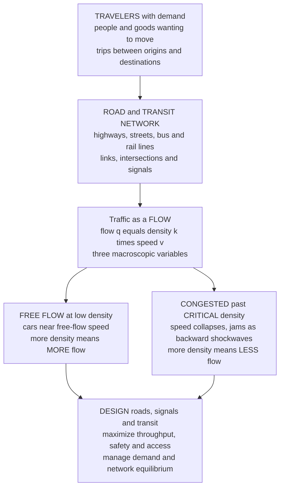

# 🚦 Transportation Engineering and Traffic Flow

> [!abstract] TL;DR
> **Transportation engineering** is the science of moving **people and goods** through networks — highways, streets, buses, rail, airports, ports, and freight — balancing **mobility, safety, cost, capacity, and increasingly sustainability and equity**. Its beating heart is **traffic-flow theory**, which treats a stream of cars as a **one-dimensional compressible fluid** described by three macroscopic variables: **flow** $q$ (vehicles per hour), **density** $k$ (vehicles per km), and **speed** $v$, tied together by the identity $q = k\,v$. Plot flow against density and you get the **fundamental diagram** — an **inverted U**: at low density traffic runs near **free-flow speed** and more cars means more flow, but past a **critical density** the flow reaches its **capacity** and then *falls*, so **packing in more cars carries FEWER vehicles per hour, not more**. Congestion is not a static blob but a **shockwave** — a jam boundary that ripples **backward** through the stream while every car moves **forward**, exactly captured by **LWR kinematic-wave theory** and the microscopic **car-following** models that explain **phantom jams** appearing from nowhere. On top of this physics sit **capacity and Level of Service** (an A–F grade of congestion), **queueing theory** (delay at bottlenecks and signals), **traffic operations** (signal timing, coordination "green waves," roundabouts, ramp metering, ITS), and **transportation planning** (the classic **four-step** demand model, **Wardrop** network equilibrium, and the counterintuitive **Braess's paradox** — where building a *new road can make everyone slower*). Because transportation networks are the **circulatory system of the economy and society**, their design decides congestion, road safety, emissions, land use, and access — making this the pillar where civil engineering meets human behavior.

## Intuition

**Analogy:** Traffic is a **fluid made of cars**, and for a while it behaves with the same maddening physics as water in a pipe — until it doesn't. On an empty road you can go full speed: this is **free flow**, and adding a few more cars simply means more vehicles per hour get through. But pack in more and more cars and, past a **critical density**, something perverse happens — the flow **chokes** and everyone crawls. A traffic jam is not a puddle of stationary cars sitting still; it is a **shockwave rippling BACKWARD through the stream while the cars themselves move forward**, precisely like the **hydraulic jump** where a fast, thin sheet of water suddenly piles up into a churning wall. You have felt this: you crawl for a minute, then accelerate away, and never see any cause — a **phantom jam** that formed miles ahead and marched back to meet you.

The counterintuitive punchline is that **adding MORE cars past the sweet spot makes the road carry FEWER cars per hour, not more** — a congested freeway physically *delivers less throughput* than the same freeway flowing freely. And weirder still, **Braess's paradox** says that **building a new road can sometimes make everyone's commute SLOWER**, because drivers each selfishly pick their fastest route and the new shortcut lures them into a worse collective equilibrium. Transportation engineering is the discipline of moving people and goods through networks where the "particles" **have minds of their own** — designing roads, signals, and transit to maximize flow, safety, and access despite the fact that every molecule of this fluid is a person making a decision.

---

## How It Works

Transportation engineering runs on three nested layers: a **flow theory** that describes how a stream of vehicles behaves, an **operations** layer that squeezes the most safe throughput from a fixed road, and a **planning** layer that shapes the whole network and the demand flowing through it.

### Core Mechanics

1. **Traffic as a flow — three variables, one identity.** Zoom out and forget individual cars: a traffic stream is described by **flow** $q$ (vehicles passing a point per hour), **density** $k$ (vehicles present per km of road), and **space-mean speed** $v$. They are locked by the exact hydrodynamic identity $q = k\,v$ — the same "flux equals concentration times velocity" relation as any conserved fluid. Any *two* of the three determine the third.

2. **The fundamental diagram and capacity.** Speed and density are not independent — a driver goes fast when the road is empty and slows as it fills. The simplest closure is the **Greenshields** linear law $v = v_f\left(1 - k/k_j\right)$, where $v_f$ is the **free-flow speed** and $k_j$ the **jam density** (bumper-to-bumper, $v=0$). Substituting into $q=kv$ gives the **fundamental diagram** $q = v_f\,k\left(1 - k/k_j\right)$ — a **downward parabola** in $q$–$k$. Its peak is the **capacity** $q_{max}$, occurring at the **critical density** $k_c = k_j/2$; for Greenshields $q_{max} = v_f\,k_j/4$. Below $k_c$ is the **free-flow branch** (adding density raises flow); above $k_c$ is the **congested branch** (adding density *lowers* flow) — the entire mathematics of "more cars, less flow."

3. **Shockwaves and the LWR model.** Because vehicles are conserved, the density field obeys a **conservation law** $\partial k/\partial t + \partial q/\partial x = 0$. With $q=q(k)$ from the fundamental diagram this becomes the **Lighthill–Whitham–Richards (LWR)** kinematic-wave equation — the **traffic analogue of gas dynamics**. Where two traffic states meet (free-flow upstream, jam downstream at a red light), a **shockwave** forms whose speed is $u_s = \dfrac{q_2 - q_1}{k_2 - k_1}$ — the slope of the chord on the fundamental diagram. When the downstream state is a jam ($q_2=0$, $k_2=k_j$), $u_s$ is **negative**: the back of the queue **propagates upstream**, against the traffic, even as every car drives forward.

4. **Microscopic car-following and phantom jams.** Zoom back in: each driver adjusts acceleration based on the gap and relative speed to the car ahead (Gipps, Intelligent Driver Model, etc.). If drivers react with even a small **delay** and over-brake, a tiny perturbation **amplifies** as it passes back through the platoon — a **string instability** that erupts into a **phantom jam** with no accident, no bottleneck, no cause but the collective dynamics themselves.

5. **Capacity, Level of Service, and queueing.** Engineers grade congestion with **Level of Service (LOS)** — letters **A** (free flow) through **F** (breakdown, stop-and-go) — tied to density, delay, or volume-to-capacity ratio via the **Highway Capacity Manual**. At **bottlenecks and signals**, arrivals meet a limited service rate, so **queueing theory** predicts **delay**: vehicles often arrive **randomly (Poisson)** while the signal serves them in bursts, and the delay is the gap between cumulative arrivals and departures.

6. **Traffic operations.** On a fixed road, throughput and safety are won by **signal timing** — choosing the **cycle length**, the **green split** among movements, and the **offset** between adjacent signals to create a **"green wave"** (progression) a platoon can ride without stopping. **Roundabouts**, **ramp metering** (drip-feeding vehicles onto a freeway to keep it below critical density), and **Intelligent Transportation Systems (ITS)** round out the toolkit.

7. **Transportation planning and network equilibrium.** Above operations sits the question of *how much* demand exists and *where* it flows. The classic **four-step model** — **trip generation → trip distribution → mode choice → traffic assignment** — forecasts flows on a network. Assignment obeys **Wardrop's user equilibrium**: selfish drivers redistribute until **no one can find a faster route**, which is generally **not** the system optimum — the gap that makes **Braess's paradox** and **induced demand** possible, and that congestion pricing tries to close.

### Flow / Architecture



---

## Key Concepts

### Secondary Level

- **Traffic is like a fluid made of cars.** On an empty road you drive full speed; the more cars you add, the slower everyone goes — just like water thickening in a crowded pipe. Engineers study this "flow of cars" to design roads that move the most people safely.
- **A jam moves backward while cars move forward.** In stop-and-go traffic, you crawl, then speed up, then crawl again. The **slow patch itself drifts backward** up the road even though every car is driving forward — that is a **traffic shockwave**, and it is why jams seem to have no cause.
- **More cars can mean fewer cars get through.** There is a **sweet spot**. Below it, adding cars moves more people per hour. Past it, the road is so packed that everyone slows down and **fewer** cars actually pass each minute. A jammed freeway carries *less* traffic than a flowing one.
- **Traffic lights are timed on purpose.** The **green wave** — where you hit one green light after another — is not luck; engineers time the signals so a group of cars can ride through without stopping.
- **Sometimes a new road makes traffic worse.** Because every driver picks their own fastest route, adding a shortcut can lure so many cars onto it that *everyone's* trip gets slower — the strange result called **Braess's paradox**.

### Undergraduate Level

- **The three macroscopic variables and $q = kv$.** **Flow** $q$ [veh/h], **density** $k$ [veh/km], and **space-mean speed** $v$ [km/h] satisfy the identity $q = k\,v$. Density is the state variable that "feels" congestion; flow is what you count at a detector.
- **Greenshields and the fundamental diagram.** Assume $v = v_f\left(1 - k/k_j\right)$. Then $q(k) = v_f\,k\left(1 - k/k_j\right)$, a parabola with **capacity** $q_{max} = v_f k_j / 4$ at **critical density** $k_c = k_j/2$ and critical speed $v_c = v_f/2$. The **free-flow branch** ($k<k_c$) and **congested branch** ($k>k_c$) give two densities for every sub-capacity flow — you cannot tell "flowing at 1500 veh/h" from "jammed at 1500 veh/h" by flow alone; you need density or speed.
- **Shockwave speed.** Between two stream states, $u_s = \dfrac{q_2-q_1}{k_2-k_1}$ — the chord slope on the fundamental diagram. A **stopping wave** into a jam has negative $u_s$ (queue grows upstream); a **starting wave** at green release also propagates back but is recovered as vehicles accelerate. This is the everyday face of **LWR kinematic-wave theory**.
- **Capacity and Level of Service.** **Capacity** is the maximum sustainable flow (roughly 1900–2400 veh/h/lane for freeways). **LOS A–F** grades operating quality; **LOS F** is oversaturated breakdown. The **volume-to-capacity ratio** $v/c$ is the key congestion metric.
- **Signalized-intersection delay.** With cycle length $C$, effective green $g$, and approach flow $q$, undersaturated **uniform delay** is $d = \dfrac{C\,(1 - g/C)^2}{2\,(1 - (g/C)\,x)}$ where $x = q/(s\,g/C)$ is the degree of saturation ($s$ = saturation flow). **Webster's formula** adds a random-delay term; total intersection delay drives the timing design.
- **The four-step travel-demand model.** **Trip generation** (how many trips each zone produces/attracts), **trip distribution** (a **gravity model** matching origins to destinations), **mode choice** (a **logit** model splitting among car/transit/walk), and **traffic assignment** (loading trips onto routes) — the workhorse of regional transportation planning.

### Graduate Level

- **LWR theory and the method of characteristics.** The scalar conservation law $k_t + q(k)_x = 0$ with $q=q(k)$ propagates information along **characteristics** of speed $q'(k) = dq/dk$ (the **kinematic-wave speed**, the *tangent* to the fundamental diagram — distinct from vehicle speed $v=q/k$, the *chord*). Where characteristics collide, an entropy-satisfying **shock** forms at the chord slope; where they diverge (green release), a **rarefaction/acceleration fan** appears. **Newell's** simplified kinematic-wave and the **cell-transmission model (CTM)** are the discretizations used in modern simulation.
- **Higher-order and second-order models.** LWR assumes instantaneous equilibrium $v=v_e(k)$; real traffic shows **hysteresis**, **capacity drop** at active bottlenecks, and **wide moving jams** (Kerner's **three-phase theory**: free flow, synchronized flow, wide moving jam). **Payne–Whitham / Aw–Rascle–Zhang** add a momentum equation to capture non-equilibrium and stop-and-go waves without the anisotropy paradoxes of naive second-order models.
- **Car-following stability.** Linearizing a car-following law gives a **string-stability** criterion: a platoon is stable only if drivers' response gain and reaction time satisfy a bound; violate it and perturbations **grow convectively upstream** into phantom jams. This is the microscopic origin of the macroscopic instability on the congested branch.
- **Network equilibrium and the price of anarchy.** **Wardrop's user equilibrium (UE)** — all used routes between an O–D pair have equal, minimal cost — is the **Nash equilibrium** of the routing game and solves a convex program (**Beckmann transformation**) under separable link costs. It generally differs from the **system optimum (SO)**; their ratio is bounded by the **price of anarchy**. **Braess's paradox** is the sharp demonstration that adding a link can raise the UE cost for everyone, and **marginal-cost (congestion) pricing** is the tolling scheme that makes UE coincide with SO.
- **Induced demand and land-use/transport feedback.** Expanding capacity lowers the generalized cost of driving, which **induces new trips, longer trips, and mode shifts** until congestion re-equilibrates — the empirical "**fundamental law of road congestion**" (elasticity of VMT to lane-km near one). Coupled **land-use/transport interaction (LUTI)** models close the loop: infrastructure reshapes where people live and work, which reshapes demand.
- **Safety science — the Safe System.** Classical crash analysis (crash frequency/rate, the **Highway Safety Manual** predictive method, hotspot identification) is giving way to the **Safe System / Vision Zero** philosophy: humans err, so the *system* — speeds, road design, vehicles, and post-crash care — must be engineered so mistakes are not fatal. Design speed and kinetic-energy management, not just driver blame, become the levers.

---

## Python Demo

```python
# ============================================================================
# TRAFFIC FLOW in one figure -- the two pillars of macroscopic traffic theory.
#
#   LEFT  panel -> the FUNDAMENTAL DIAGRAM: using the Greenshields closure
#                  v = v_f (1 - k/k_j), flow q = k v = v_f k (1 - k/k_j) is an
#                  INVERTED-U in the (density, flow) plane. The peak is CAPACITY
#                  at the CRITICAL DENSITY k_c = k_j/2; the FREE-FLOW branch
#                  (k < k_c, more density -> more flow) and the CONGESTED branch
#                  (k > k_c, more density -> LESS flow) are shown, making explicit
#                  WHY packing in more cars past the peak reduces throughput.
#
#   RIGHT panel -> a TRAFFIC SHOCKWAVE (LWR kinematic-wave theory): a signal turns
#                  RED, so approaching free-flow traffic (state 1) piles into a JAM
#                  (state 2). The back of the queue is a SHOCK whose speed
#                  u_s = (q2 - q1)/(k2 - k1) is NEGATIVE -- the jam propagates
#                  BACKWARD (upstream) while every vehicle drives forward. We draw
#                  the shock line plus several vehicle trajectories in space-time.
#
# Requires: numpy, matplotlib
import numpy as np
import matplotlib.pyplot as plt

# --- Greenshields fundamental-diagram parameters ---------------------------
v_f = 100.0     # free-flow speed          [km/h]
k_j = 140.0     # jam density              [veh/km]

def speed(k):   return v_f * (1.0 - k / k_j)     # Greenshields speed-density
def flow(k):    return k * speed(k)              # q = k v

k_c   = k_j / 2.0                                # critical density (peak of q)
q_max = flow(k_c)                                # capacity = v_f k_j / 4
v_c   = speed(k_c)                               # critical speed = v_f / 2

# ============================================================================
# (a) FUNDAMENTAL DIAGRAM  q(k)
# ============================================================================
k    = np.linspace(0.0, k_j, 400)
q    = flow(k)
free = k <= k_c                                  # free-flow vs congested branch

# ============================================================================
# (b) SHOCKWAVE at a red light  (two-state LWR construction)
# ============================================================================
# State 1: approaching FREE-FLOW traffic (moderate density, moving fast)
k1 = 25.0
v1 = speed(k1);  q1 = flow(k1)
# State 2: JAM behind the red signal (bumper-to-bumper, stopped)
k2 = k_j;        v2 = 0.0;  q2 = 0.0
u_s = (q2 - q1) / (k2 - k1)                       # SHOCKWAVE speed [km/h] (negative)

print("=== (a) Fundamental diagram (Greenshields) ===")
print(f"  free-flow speed v_f = {v_f:.0f} km/h,  jam density k_j = {k_j:.0f} veh/km")
print(f"  CAPACITY q_max      = {q_max:.0f} veh/h  at critical density k_c = {k_c:.0f} veh/km")
print(f"  critical speed v_c  = {v_c:.0f} km/h")
print("=== (b) Red-light shockwave (LWR two-state) ===")
print(f"  approaching state 1 : k1 = {k1:.0f} veh/km, v1 = {v1:.0f} km/h, q1 = {q1:.0f} veh/h")
print(f"  jam state 2         : k2 = {k2:.0f} veh/km, v2 = {v2:.0f} km/h, q2 = {q2:.0f} veh/h")
print(f"  SHOCKWAVE speed u_s = {u_s:.1f} km/h  (negative -> queue grows UPSTREAM)")

# convert speeds to km per MINUTE for a clean space-time plot
v1_m = v1 / 60.0
us_m = u_s / 60.0
T    = 3.0                                        # plot window [minutes]
tt   = np.linspace(0.0, T, 200)
x_shock = us_m * tt                               # back-of-queue position [km]

# vehicle trajectories: N vehicles upstream at t=0, spaced 1/k1 apart, in free flow
N   = 12
x0  = -np.arange(1, N + 1) / k1                   # initial positions [km] (upstream)
trajectories = []
for xi in x0:
    t_cross = -xi / (v1_m - us_m)                 # time this vehicle hits the shock
    x = np.where(tt < t_cross, xi + v1_m * tt, us_m * t_cross)  # then it stops in queue
    trajectories.append(x)

# ------------------------------- plotting ----------------------------------
fig, (axL, axR) = plt.subplots(1, 2, figsize=(14, 6))
fig.suptitle("Traffic Flow: the Fundamental Diagram  &  a Backward-Propagating Shockwave",
             fontsize=14, fontweight="bold")

# LEFT: the inverted-U fundamental diagram
axL.plot(k[free],  q[free],  color="#2ca02c", lw=2.6, label="FREE-FLOW branch  (more density -> more flow)")
axL.plot(k[~free], q[~free], color="#d62728", lw=2.6, label="CONGESTED branch  (more density -> LESS flow)")
axL.plot([k_c], [q_max], "o", color="#000000", ms=9, zorder=5)
axL.annotate(f"CAPACITY\nq_max = {q_max:.0f} veh/h\nat k_c = {k_c:.0f} veh/km",
             xy=(k_c, q_max), xytext=(k_c * 1.05, q_max * 0.62),
             fontsize=9, fontweight="bold",
             arrowprops=dict(arrowstyle="->", color="k"),
             bbox=dict(boxstyle="round", fc="#fff7e6", ec="gray"))
axL.axvline(k_c, color="gray", ls=":", lw=1)
axL.annotate("past the peak,\nadding cars\nREDUCES flow",
             xy=(0.80 * k_j, flow(0.80 * k_j)),
             xytext=(0.55 * k_j, 0.30 * q_max), fontsize=8.5, color="#d62728",
             arrowprops=dict(arrowstyle="->", color="#d62728"))
axL.set_xlabel("density  k  [veh/km]  (more cars packed in ->)")
axL.set_ylabel("flow  q  [veh/h]")
axL.set_title("(a) FUNDAMENTAL DIAGRAM:  q = k v = v_f k (1 - k/k_j)", fontsize=11)
axL.legend(loc="upper right", fontsize=8.5)
axL.grid(alpha=0.3)

# RIGHT: space-time diagram -- shock line + vehicle trajectories
for x in trajectories:
    axR.plot(tt, x, color="#1f77b4", lw=1.1, alpha=0.8)
axR.plot([], [], color="#1f77b4", lw=1.1, label="vehicle trajectories")
axR.plot(tt, x_shock, color="#d62728", lw=3.0, label=f"SHOCK (back of queue), u_s = {u_s:.0f} km/h")
axR.axhline(0.0, color="#7f7f7f", ls="--", lw=1.2)
axR.text(T * 0.55, 0.02, "STOP LINE / red signal at x = 0", fontsize=8, color="#7f7f7f")
axR.text(T * 0.05, x_shock[-1] * 0.6, "free-flow\ntrajectories\n(steep = fast)",
         fontsize=8, color="#1f77b4")
axR.annotate("jam boundary marches\nUPSTREAM (backward)",
             xy=(T * 0.85, us_m * T * 0.85), xytext=(T * 0.30, x_shock[-1] * 1.05),
             fontsize=8.5, fontweight="bold", color="#d62728",
             arrowprops=dict(arrowstyle="->", color="#d62728"))
axR.set_xlabel("time  t  [min]")
axR.set_ylabel("position  x  [km]   (signal at 0; upstream is negative)")
axR.set_title("(b) TRAFFIC SHOCKWAVE:  the jam ripples BACKWARD as cars move forward",
              fontsize=11)
axR.legend(loc="lower left", fontsize=8.5)
axR.grid(alpha=0.3)

plt.tight_layout(rect=[0, 0, 1, 0.93])
plt.show()
```

Running this prints the diagnostic numbers and draws the two panels that capture macroscopic traffic theory end to end. The **left panel** is the **fundamental diagram**: a clean **inverted U** whose **green free-flow branch** rises (adding density lifts flow) up to the black **capacity** point ($q_{max} = v_f k_j/4 = 3500$ veh/h at the **critical density** $k_c = 70$ veh/km), after which the **red congested branch** falls — the picture behind "more cars, *less* flow." The **right panel** is a **space-time diagram** of a red light: the steep blue **vehicle trajectories** are free-flow cars driving forward (rightward in time, upward in space), and the thick red line is the **shockwave** at the back of the queue. Its slope is **negative** ($u_s \approx -18$ km/h), so as cars keep flowing *forward*, the jam boundary sweeps *backward* to meet them — each trajectory bends flat the instant it crosses the shock and joins the stationary queue. This is exactly the "jam that moves backward while everyone drives forward" from the intuition, computed straight from the fundamental diagram via $u_s = (q_2-q_1)/(k_2-k_1)$.

---

## Real-World Applications

> **Example:** **Freeway ramp metering** — the traffic signals on highway on-ramps that release one car every few seconds — is the fundamental diagram turned into a control policy. A freeway carries the most vehicles per hour **right at its critical density**; let too many cars merge and the mainline tips onto the **congested branch**, where flow *collapses* and a **backward shockwave** propagates for miles. Ramp meters exist to **hold the mainline just below critical density** by throttling the inflow, keeping the road on the productive free-flow branch. Systems like Minnesota's and the Netherlands' coordinated ramp-metering deployments have measurably raised freeway throughput and cut travel time precisely by preventing "flow breakdown" — a direct field application of the demo's inverted-U and shockwave physics. When Minneapolis switched its meters *off* for a 2000 study, mainline throughput **fell** and travel times rose, empirically confirming that more unmetered demand delivers *less* flow.

- **Signalized-intersection timing and coordination.** Setting **cycle length, green splits, and offsets** with Webster/HCM delay models to minimize stops and delay, and coordinating adjacent signals into a **green wave** so platoons ride through arterials without stopping — the core of urban traffic operations.
- **Highway capacity and design.** The **Highway Capacity Manual** procedures size the number of lanes, weaving sections, and merge areas to deliver a target **Level of Service**, translating flow theory into concrete geometry.
- **Transportation master planning.** Regional agencies run **four-step (and activity-based) travel-demand models** to forecast the effect of a new rail line, a highway widening, or land-use change on network flows, mode share, and emissions — the basis of billion-dollar infrastructure decisions.
- **Congestion pricing.** London, Stockholm, Singapore, and New York price entry into congested cores to push the network from **user equilibrium toward the system optimum**, internalizing the delay each driver imposes on others — Wardrop and marginal-cost pricing in the real world.
- **Public transit and active mobility.** Bus rapid transit, rail scheduling, and protected bike/pedestrian networks move people at far higher **person-throughput per lane** than single-occupancy cars, the capacity argument behind the modern shift away from car-centric design.
- **Vision Zero road-safety programs.** Cities worldwide are redesigning speeds, intersections, and vehicle rules under the **Safe System** philosophy to eliminate traffic deaths — treating the ~1.2 million annual global road fatalities as an engineering problem, not merely a behavioral one.

---

## Common Pitfalls

- **Believing more lanes always cure congestion (ignoring induced demand).** Widening a road lowers the cost of driving, which **induces new and longer trips** until congestion returns — the empirical "fundamental law of road congestion." Capacity is necessary but rarely sufficient; without demand management the new lanes fill up. This is the macro cousin of Braess's paradox.
- **Reading flow without density.** A detector reporting 1500 veh/h cannot tell you whether the road is **flowing freely** or **jammed** — both branches of the fundamental diagram give the same sub-capacity flow. You must also know **density or speed** to place the state; confusing the two branches leads to exactly the wrong control action (e.g., admitting more cars into an already-congested regime).
- **Treating a jam as a fixed location.** Congestion is a **wave**, not a place. The queue's back propagates **upstream at the shockwave speed**, so the "cause" you eventually reach may be miles ahead of where you first slowed — and interventions must target the wave dynamics, not just the visible bottleneck.
- **Assuming user equilibrium is efficient.** Selfish routing (Wardrop UE) is generally **not** the system optimum; the gap (**price of anarchy**) means well-intentioned network changes can backfire, and only **pricing or coordination** aligns individual choices with collective good. Planners who optimize each link locally can worsen the whole.
- **Over-relying on the Greenshields line.** The linear speed-density law is a teaching model; **real fundamental diagrams** show scatter, **hysteresis**, a **capacity drop** at active bottlenecks, and multi-valued congested states. Calibrating capacity from an idealized parabola can overstate a facility's true reliable throughput.
- **Designing for average conditions, ignoring reliability and the tail.** Travelers care as much about **travel-time reliability** (the bad days) as the mean. Systems tuned only to average delay under-provision for the incident-driven, heavy-tailed breakdowns that dominate user frustration.
- **Blaming drivers instead of the system for crashes.** The old "nut behind the wheel" framing ignores that **road and speed design** determine whether a human error is survivable. The **Safe System** shift reframes safety as engineering kinetic energy and forgiving geometry — pitfalls of the old paradigm cost lives.

---

## Related Concepts

**The vault hub**
- [[Civil_Engineering_Overview]] — the six-pillar map of civil engineering; this note **opens Pillar 5, Transportation and Construction**, of which traffic-flow theory is the analytical core

**Traffic as a fluid — kinematic and shock waves (Fluid Dynamics vault)**
- [[Shock_Waves_and_Supersonic_Flow]] — the **gas-dynamics shock** that LWR traffic theory directly mirrors: a discontinuity where two flow states meet, propagating at a speed set by the jump conditions — the mathematical twin of a traffic jam's backward-marching front
- [[Surface_and_Internal_Waves]] — the **kinematic/gravity-wave** picture and characteristic speeds that underlie treating a car stream as a one-dimensional wave-bearing continuum

**Networks, equilibrium, and emergence (Systems Thinking & Complexity vault)**
- [[Network_Science_Fundamentals]] — the graph-theoretic view of a transportation network (nodes, links, paths) on which **Wardrop equilibrium** and **Braess's paradox** live; routing is flow on a network
- [[Urban_and_Infrastructure_Systems]] — the systems-thinking frame for cities and infrastructure, where transportation is one coupled subsystem shaping and shaped by land use
- [[Emergence_and_Self_Organization]] — **phantom jams** are textbook emergence: a macroscopic congestion pattern arising from local car-following rules with no external cause, the same self-organization studied across complex systems

**Randomness and queues (Mathematics vault)**
- [[Common_Probability_Distributions]] — the **Poisson process** modeling random vehicle arrivals and the distributions behind queueing-theory delay at signals and bottlenecks

*Within this section (Pillar 5 siblings, forthcoming — referenced here in prose):* **Pavement_and_Highway_Design** (the physical roadbed and geometry that carries this flow), **Construction_Engineering_and_Management** (scheduling and building the infrastructure), **Surveying_and_Geomatics** (laying out alignments and grades), **Sustainable_and_Smart_Infrastructure** (low-carbon, connected, and autonomous mobility), and **Infrastructure_Resilience_and_Asset_Management** (keeping the transportation network operating over its life).

---

## Review Questions

**Secondary**
1. Imagine a highway that starts empty and slowly fills with cars. Explain in plain words why, at first, **adding more cars lets more people get through per hour**, but after a certain point **adding cars makes everyone slower and fewer cars get through**. Then describe what a "traffic shockwave" is and why a jam can seem to have **no cause** even though you were stuck in it — and why the slow patch appears to drift **backward** up the road.

**Undergraduate**
2. A freeway lane follows the **Greenshields** model with free-flow speed $v_f = 100$ km/h and jam density $k_j = 140$ veh/km. (a) Derive the **fundamental diagram** $q(k)$ and find the **capacity**, the **critical density**, and the **critical speed**. (b) Sketch the diagram and label the **free-flow** and **congested** branches, explaining why one measured flow value can correspond to two different traffic states. (c) A red light creates a jam ($k_2 = 140$ veh/km, $q_2 = 0$) that approaching traffic at $k_1 = 25$ veh/km meets. Compute the **shockwave speed** $u_s$ and interpret its sign physically.

**Graduate**
3. Consider a road network in **Wardrop user equilibrium** under selfish routing. (a) Explain, with the definition of user equilibrium, why adding a new zero-cost link (Braess's paradox) can *increase* every traveler's cost, and how it relates to the **price of anarchy** between user equilibrium and system optimum. (b) Describe the **marginal-cost (congestion) pricing** scheme that would restore the system optimum, and what quantity each driver should be charged. (c) Separately, contrast the **LWR first-order** kinematic-wave model with a **second-order (Aw–Rascle–Zhang)** or **three-phase** model: what real phenomena — capacity drop, hysteresis, wide moving jams, string instability — does the first-order theory miss, and why do they matter for ramp-metering and variable-speed-limit control?

---

## Sources

- F. L. Mannering & S. S. Washburn — *Principles of Highway Engineering and Traffic Analysis*, 7th ed. (Wiley, 2020)
- R. P. Roess, E. S. Prassas & W. R. McShane — *Traffic Engineering*, 4th ed. (Pearson, 2011)
- Transportation Research Board — *Highway Capacity Manual (HCM), 6th ed.: A Guide for Multimodal Mobility Analysis* (2016)
- C. S. Papacostas & P. D. Prevedouros — *Transportation Engineering and Planning*, 3rd ed. (Prentice Hall, 2001)
- M. J. Lighthill & G. B. Whitham — "On Kinematic Waves II: A Theory of Traffic Flow on Long Crowded Roads," *Proc. R. Soc. A* 229 (1955); P. I. Richards — "Shock Waves on the Highway," *Operations Research* 4 (1956)

---

#civil-engineering #transportation #traffic-flow #fundamental-diagram #level-of-service
