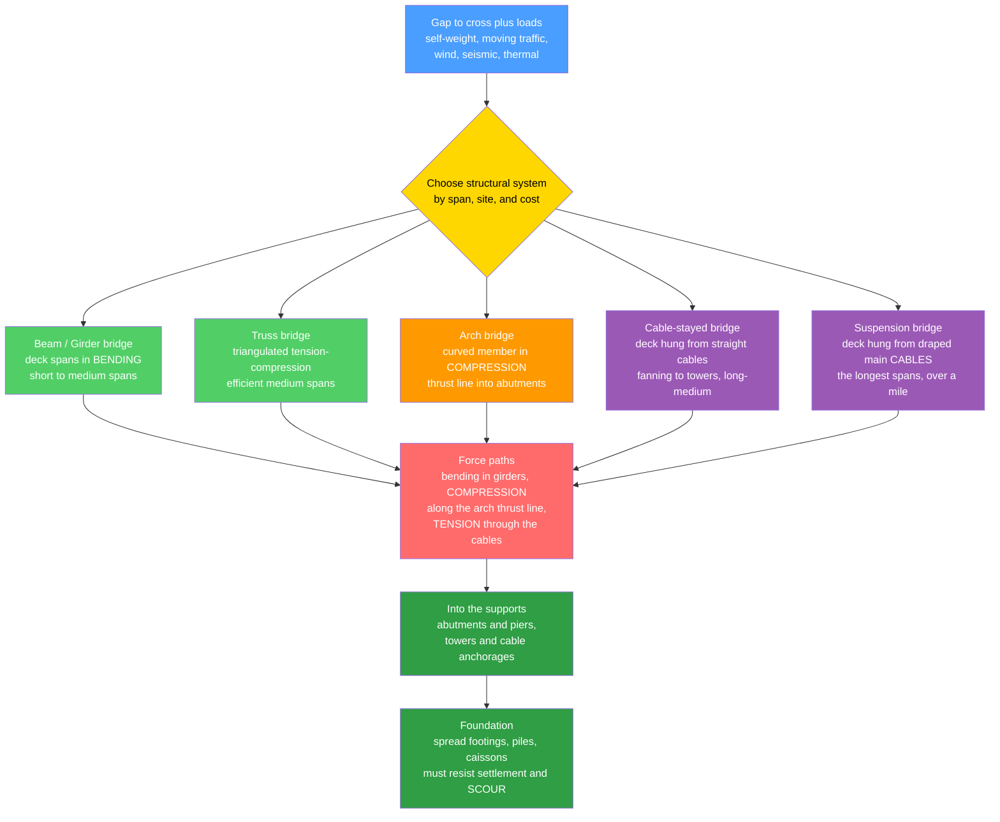

# 🌉 Bridge Engineering

> [!abstract] TL;DR
> A bridge has exactly one job — **carry a load across a gap and hand it safely to the two ends** — and every bridge type is a different clever answer to the question *"how do I route the forces across the void and down into the ground?"* A **beam / girder** bridge simply spans the gap stiffly in **bending** (simple, cheap, but limited in reach). A **truss** turns the same span into a triangulated web that carries load as member tension and compression far more efficiently. An **arch** curves the deck so the load flows as pure **compression** thrusting outward into the abutments (stone's ancient Roman trick). A **cable-stayed** bridge fans straight cables directly from towers to the deck. A **suspension** bridge hangs the deck from great main **cables** draped between towers, so the cables are in pure **tension** and the towers in compression — the only way steel spans more than a mile. The design problem is to match the structural system to the **span, the site, and the budget**, then defend it against its enemies: heavy moving trucks (find the *worst* position with **influence lines**), **wind** (the Tacoma Narrows flutter lesson made aerodynamic checks mandatory), **earthquakes**, **fatigue** from millions of load cycles, thermal movement, and the slow killers of rust and **scour** (river flow eroding the foundation — a leading cause of collapse). Bridge engineering is a capstone: it fuses structural analysis, materials, foundations, hydraulics, and wind and seismic dynamics into a structure that must carry the public for a century.

---

## Intuition

**Analogy first.** Stand at the edge of a stream too wide to step over. You have a few instinctive ways to get across, and each one is a different *type* of bridge.

1. **Lay a plank across.** The plank sags in the middle as you walk on it — it carries you by **bending**. Fine for a narrow stream, but try a wide river and the plank droops and snaps. That is a **beam / girder** bridge: simple, cheap, limited reach.
2. **Build up a pile of wedged stones curving over the gap.** Push down on the top and the stones jam *harder* against each other and shove outward against the banks — the load has become pure **compression** and the banks (abutments) swallow the outward push. That is an **arch**, and it is why Roman stone bridges still stand after two thousand years.
3. **String a rope tightly between two tall poles on either bank and hang a walkway from it.** The rope pulls taut in pure **tension**, the poles are squeezed in compression, and the anchored ends hold everything down. Add more rope and you can span an astonishing distance. That is a **suspension** bridge — the rope is the main cable, the poles are the towers, the ground anchors are the anchorages.

Every bridge is one of these ideas — or a hybrid — chosen to route the forces the cheapest, safest way for *this* gap. The art is picking the right one for the span and the site, then protecting it from the four things that kill bridges: **trucks, wind, earthquakes, and the slow rust and river-scour of time.**

---

## How It Works

### Core Mechanics

1. **State the core problem.** The deck must carry its own **dead weight**, the moving **live load** (traffic — cars, trucks, trains, crowds), and environmental actions — **wind**, **seismic**, thermal, and stream forces — and deliver all of it through the structure into the supports and finally the ground. The choice of **structural system** decides *how* those forces travel, and that choice is driven by **span length, site conditions, and cost**.
2. **Beam / girder — carry by bending.** The deck acts as a beam: load creates a **bending moment** and **shear** that the girder resists through the flexure formula $\sigma = Mc/I$. Steel plate girders or **prestressed-concrete** box girders are the workhorses for short-to-medium spans (roughly 10–200 m). Simple and economical, but the required depth grows fast with span, so girders run out of reach.
3. **Truss — carry by axial force.** Triangulate the span into a web of members that carry load almost purely as **tension and compression** (little bending). This uses material far more efficiently than a solid beam, extending the economical range into medium-long spans.
4. **Arch — carry by compression.** Shape the structure so the load flows along a **thrust line** of pure compression that pushes *outward* into the **abutments**. As long as the thrust line stays inside the arch ring (classically, within the *middle third*), there is no tension — perfect for masonry, and elegant in steel and concrete. The penalty is a large horizontal **thrust** that the site must be able to resist.
5. **Cable-stayed — carry by straight cables.** Fan straight cables directly from **towers** to points along the deck. Each cable carries its share of deck load in **tension** straight back to the tower, which stacks the load into compression down to its foundation. Highly efficient and elegant for long-medium spans (roughly 100–1100 m); the deck also picks up axial compression from the horizontal cable components.
6. **Suspension — carry by draped cables.** Hang the deck from vertical **suspenders** that transfer load to two great **main cables** draped in a parabola between the towers. The cables are in pure **tension**; the horizontal component of that tension is **constant** along the cable and is reacted at massive ground **anchorages**, while the vertical component peaks at the towers. This is the only system that reaches the very longest spans (over a mile / 1600 m+). A **stiffening truss or box** deck is essential to control deflection and, above all, wind-induced motion.
7. **Design against the moving load.** Because traffic *moves*, the worst case is not obvious — a load at one position maximizes midspan moment, another maximizes support shear. Engineers use **influence lines** to find the *critical position* of the live load for each response, then apply a **load rating** to judge how much real traffic an existing bridge can safely carry.
8. **Defend against the dynamic and time enemies.** **Wind** can drive aerodynamic instability — *flutter* — the lesson of the 1940 **Tacoma Narrows** collapse, after which wind-tunnel and aeroelastic checks became mandatory for long spans. **Seismic** design keeps the bridge standing and its spans from unseating. **Fatigue** from millions of truck cycles slowly grows cracks at weld details. **Thermal expansion** is absorbed by expansion joints and bearings. **Scour** — the erosion of streambed around piers and abutments by flowing water — quietly undermines foundations and is a leading cause of bridge failure.

### Flow / Architecture



---

## Key Concepts

### Secondary Level

- **A bridge crosses a gap and pushes the load into the two ends.** Whatever the shape, the weight of the deck and the traffic on it must travel out to the supports and down into the ground.
- **Three basic tricks.** A **beam** spans stiffly and *bends* (a plank across a stream). An **arch** curves so the load *squeezes* the stones together and shoves outward into the banks (Roman bridges). A **suspension** bridge *hangs* the deck from big cables strung between towers, and those cables are *pulled tight* (tension).
- **Tension and compression are opposites.** Compression is being **squeezed** (the arch, the towers). Tension is being **pulled** (the cables). Each bridge type is a way of turning the load into forces the material handles best — stone loves compression, steel cable loves tension.
- **Longer gap, fancier bridge.** Short streams get simple beam bridges; wide rivers and deep valleys need arches, cable-stayed decks, or the mile-plus reach of a suspension bridge.
- **Bridges have enemies.** Heavy trucks, strong **wind** (a bridge in Washington State famously twisted apart in the wind in 1940), **earthquakes**, and **rust and river erosion** all attack bridges — which is why they must be inspected and maintained.

### Undergraduate Level

- **Force path defines the type.** *Girder:* deck in bending, $\sigma = Mc/I$. *Truss:* members in near-pure axial force from joint equilibrium. *Arch:* a **thrust line** of compression; keep it within the middle third of the ring to avoid tension. *Cable-stayed / suspension:* the deck load is carried in cable **tension**.
- **The suspension cable is a parabola.** Under a load uniform *along the horizontal* (the deck's weight), the main cable hangs in a **parabola** with midspan sag $d$ over span $L$. The **horizontal** cable force is constant: $H = wL^2/(8d)$. The **maximum** cable tension is at the towers, $T_{max} = \sqrt{H^2 + (wL/2)^2} = H\sqrt{1+(4d/L)^2}$.
- **The sag ratio is the master trade-off.** A *small* sag $d/L$ gives a low, sleek profile but a *huge* horizontal force $H$ (heavier cables, bigger anchorages). A *large* sag lowers the cable force but demands *taller* towers. Real suspension bridges cluster near $d/L \approx 1/10$ — a sweet spot between cable cost and tower height.
- **Influence lines locate the worst load.** Because live load *moves*, the response (a moment, a shear, a reaction) at a point varies with where the load sits. The **influence line** plots that response vs load position, so you place the traffic where it does the most damage — the basis of code **load models** and **load rating**.
- **Cable-stayed vs suspension.** Cable-stayed decks hang from *straight* stays anchored *into the deck and tower* (self-anchored — no giant ground anchorage), efficient to ~1 km. Suspension bridges need enormous **anchorages** to hold the main cable tension but reach the longest spans.
- **Dynamics are not optional.** Long, flexible decks have low natural frequencies and are prone to **wind** excitation (vortex shedding, galloping, and **flutter**). Since Tacoma Narrows (1940), aerodynamic stability — checked in wind tunnels and by aeroelastic analysis — is a mandatory limit state, and decks are shaped (streamlined boxes, open trusses) to stay stable.
- **Foundations and scour.** Piers in rivers sit on footings, piles, or **caissons**; flowing water scours away the streambed around them. **Scour** is the single most common cause of bridge failure in many national statistics — a hydraulics problem that quietly destroys a structural one.

### Graduate Level

- **Cable statics and the catenary vs parabola.** A cable under its *own weight* (uniform per unit **length**) hangs as a **catenary** $y = (H/w)\cosh(wx/H)$; under a load uniform per unit **horizontal** length (a heavy deck) it is a **parabola**. For shallow sags the two nearly coincide, but the distinction matters for the unloaded main cable of a long span. Cable **elongation** and the nonlinear geometric stiffness (the cable stiffens as it tensions) require iterative form-finding.
- **Deflection theory of suspension bridges.** Early designs used *elastic theory* (cable geometry fixed); Moisseiff's **deflection theory** accounts for the change in cable geometry under live load, which *reduces* computed deck moments — and, taken too far with a shallow plate-girder deck, produced the fatally flexible **Tacoma Narrows** deck. Modern practice couples deflection theory with **aeroelastic** analysis: computing **flutter** critical wind speed from the deck's coupled bending-torsion modes and flutter derivatives.
- **Arch thrust-line and funicular analysis.** For a two- or three-hinged arch the internal force system is the **funicular** of the loads; the arch is efficient when its axis matches the funicular of the dominant (usually dead) load so bending is minimal. Live and point loads shift the thrust line; the arch must keep it within the ring (no tension) and check **in-plane and out-of-plane buckling** of the compressed rib — a stability problem, not just a strength one.
- **Live-load modeling and load rating.** Codes replace real traffic with envelope models (AASHTO **HL-93**: design truck or tandem *plus* lane load, with dynamic load allowance). **Influence surfaces** extend influence lines to 2-D decks. **Load rating** (Inventory and Operating levels, LRFR) governs posting, permitting of heavy hauls, and prioritizing the aging inventory.
- **Fatigue and fracture control.** Steel bridges accumulate millions of stress cycles; welded details are classified into **fatigue categories** (A–E'), and the fatigue life follows an $S$-$N$ law $N = A/\Delta\sigma^m$ under a *variable-amplitude* truck spectrum (Miner's rule). **Fracture-critical** members (whose failure drops a span) demand toughness requirements and redundancy — the lessons of the Silver Bridge (1967, eyebar fracture) and I-35W (2007, gusset-plate under-design) collapses.
- **Construction dictates the analysis.** How a bridge is *built* determines its locked-in forces: **balanced-cantilever** and **incremental launching** for box girders, **segmental** precast erection, **cable spinning** or prefabricated parallel-wire strands for suspension mains, and stay stressing sequences for cable-stayed decks. The structure must be checked at *every* construction stage, not just in service.
- **Asset management of an aging inventory.** A large fraction of bridges worldwide are **structurally deficient** or beyond design life. Modern practice couples routine and **fracture-critical inspection**, **structural health monitoring** (strain, acceleration, cable-force sensing), deterioration modeling, and life-cycle-cost optimization to schedule **retrofit** (seismic restrainers, cable dampers, deck replacement) against limited budgets — the infrastructure-renewal challenge.

---

## Python Demo

```python
# Bridge Engineering -- how the forces route through the structure
#   (a) SUSPENSION CABLE SHAPE: the main cable under a uniform deck load hangs in a
#         PARABOLA; plot several sag-to-span ratios d/L and the towers.
#   (b) SAG TRADE-OFF: horizontal force H = w L^2 / (8 d) and the max tower-end
#         tension T_max = H*sqrt(1+(4d/L)^2) vs sag ratio -> small sag = huge cable
#         force + short tower; large sag = low force + tall tower. Sweet spot ~1/10.
#   (c) ECONOMICAL SPAN RANGES by bridge type: beam < truss < arch < cable-stayed <
#         suspension (log scale).
#   (d) ARCH THRUST LINE: for a parabolic arch the thrust line of a UNIFORM load
#         coincides with the arch axis (pure compression); add a POINT load and the
#         thrust line bulges toward the edge -> bending. Stay within the ring.
import numpy as np
import matplotlib.pyplot as plt

# =====================================================================
# (a) Suspension main-cable parabola for several sag ratios
# =====================================================================
L = 1000.0                              # main span [m]
x = np.linspace(0.0, L, 400)
sag_ratios = [0.05, 0.10, 0.20]         # d/L
colors = ["#4a9eff", "#2f9e44", "#ff6b6b"]

# =====================================================================
# (b) Sag trade-off:  H and T_max normalized by (w*L)
#     H/(wL) = L/(8d) = 1/(8 n),   T_max/(wL) = (H/wL)*sqrt(1+(4n)^2)
# =====================================================================
n = np.linspace(0.03, 0.30, 300)        # sag ratio d/L
H_norm    = 1.0 / (8.0 * n)             # horizontal force / (w L)
Tmax_norm = H_norm * np.sqrt(1.0 + (4.0 * n)**2)
tower_norm = n                          # tower height above deck / L  (= d/L)
n_typical = 0.10

# =====================================================================
# (c) Economical span ranges [m] by bridge type
# =====================================================================
types  = ["Beam /\nGirder", "Truss", "Arch", "Cable-\nstayed", "Suspension"]
span_lo = np.array([10.0,  40.0,  50.0, 100.0,  300.0])
span_hi = np.array([200.0, 500.0, 550.0, 1100.0, 2000.0])
ypos = np.arange(len(types))
barcol = ["#51cf66", "#20c997", "#ff9900", "#9b59b6", "#4a9eff"]

# =====================================================================
# (d) Arch thrust line: parabolic arch, rise f, span S
#     axis y(x) = 4 f (x/S)(1 - x/S)  is the funicular of a uniform load.
#     Thrust line under any load = M(x)/H measured from springings, where M is the
#     simply-supported free moment and H = w S^2 / (8 f) is the uniform-load thrust.
# =====================================================================
S, f = 60.0, 12.0
xa = np.linspace(0.0, S, 400)
y_axis = 4.0 * f * (xa / S) * (1.0 - xa / S)     # arch axis (parabola)
w_arch = 1.0                                     # uniform load (per horiz length)
H = w_arch * S**2 / (8.0 * f)                    # horizontal thrust

M_udl = w_arch * xa * (S - xa) / 2.0             # UDL free moment -> matches axis
P, a = 25.0, 0.30 * S                            # added point load and its position
M_pt = np.where(xa <= a, P * (S - a) * xa / S,   # SS free moment of a point load
                          P * a * (S - xa) / S)
thrust_udl = M_udl / H                           # coincides with y_axis
thrust_tot = (M_udl + M_pt) / H                  # bulges near the point load
t_ring = 2.0                                     # arch ring thickness [m]

# =====================================================================
# PLOTS
# =====================================================================
fig, ax = plt.subplots(2, 2, figsize=(13, 9))

# (a) cable parabolas -------------------------------------------------
axa = ax[0, 0]
for r, c in zip(sag_ratios, colors):
    d = r * L
    y = 4.0 * d * (x / L) * (1.0 - x / L)        # sag measured downward from chord
    axa.plot(x, -y, color=c, lw=2.2, label=f"d/L = {r:.2f}   (sag {d:.0f} m)")
    axa.plot([0, 0], [0, -d * 1.15], color=c, lw=3, alpha=0.35)   # towers (schematic)
    axa.plot([L, L], [0, -d * 1.15], color=c, lw=3, alpha=0.35)
axa.axhline(0, color="k", lw=1.2)                # deck / chord
axa.set_title("(a) Suspension main cable is a PARABOLA")
axa.set_xlabel("x along span  [m]");  axa.set_ylabel("cable height  [m]  (sag down)")
axa.legend(fontsize=8, loc="lower center"); axa.grid(alpha=0.3)

# (b) sag trade-off ---------------------------------------------------
axb = ax[0, 1]
axb.plot(n, H_norm,    color="#ff6b6b", lw=2.4, label="horizontal force  H / (wL)")
axb.plot(n, Tmax_norm, color="#9b59b6", lw=2.4, label="max cable tension  T_max / (wL)")
axb.plot(n, tower_norm, color="#4a9eff", lw=2.4, label="tower height  d / L")
axb.axvline(n_typical, color="k", ls=":", lw=1.5, label="typical  d/L = 1/10")
axb.set_title("(b) Sag trade-off: cable force vs tower height")
axb.set_xlabel("sag ratio  d / L");  axb.set_ylabel("normalized quantity")
axb.set_ylim(0, 5); axb.legend(fontsize=8); axb.grid(alpha=0.3)

# (c) span ranges -----------------------------------------------------
axc = ax[1, 0]
axc.barh(ypos, span_hi - span_lo, left=span_lo, color=barcol, alpha=0.85, height=0.55)
for i in range(len(types)):
    axc.text(span_hi[i] * 1.05, ypos[i], f"{int(span_lo[i])}-{int(span_hi[i])} m",
             va="center", fontsize=8)
axc.set_yticks(ypos); axc.set_yticklabels(types, fontsize=9)
axc.set_xscale("log"); axc.set_xlim(8, 6000)
axc.set_title("(c) Economical span range by bridge type")
axc.set_xlabel("span  [m]  (log scale)"); axc.grid(alpha=0.3, axis="x")

# (d) arch thrust line ------------------------------------------------
axd = ax[1, 1]
axd.fill_between(xa, y_axis - t_ring/2, y_axis + t_ring/2,
                 color="#adb5bd", alpha=0.5, label="arch ring (thickness)")
axd.plot(xa, y_axis, color="k", lw=1.5, ls="--", label="arch axis")
axd.plot(xa, thrust_udl, color="#2f9e44", lw=2.6, label="thrust line: uniform load")
axd.plot(xa, thrust_tot, color="#ff6b6b", lw=2.6, label="thrust line: + point load")
axd.axvline(a, color="#ff6b6b", ls=":", lw=1.2)
axd.set_title("(d) Arch thrust line -- keep it inside the ring")
axd.set_xlabel("x along span  [m]"); axd.set_ylabel("rise  [m]")
axd.legend(fontsize=8, loc="upper right"); axd.grid(alpha=0.3)

plt.tight_layout()
plt.savefig("bridge_engineering_demo.png", dpi=120)

# Console summary
d10 = n_typical * L
H10 = 1.0 / (8.0 * n_typical)
print(f"(a,b) At d/L = 1/10 on a {L:.0f} m span: sag = {d10:.0f} m,")
print(f"      H/(wL) = {H10:.2f},  T_max/(wL) = {H10*np.sqrt(1+(4*n_typical)**2):.2f}")
print(f"      Halving the sag to d/L=0.05 DOUBLES the horizontal cable force.")
print(f"(d)   Uniform-load thrust line coincides with the parabolic arch axis;")
print(f"      max thrust-line offset from axis under the point load = "
      f"{np.max(np.abs(thrust_tot - y_axis)):.2f} m (ring half-thickness {t_ring/2:.1f} m).")
print("Saved figure -> bridge_engineering_demo.png")
```

**What it shows.** Panel (a) plots the suspension **main cable** as a **parabola** for three sag ratios — the deeper the sag, the more the cable dips and the taller the towers must rise. Panel (b) makes the master **trade-off** quantitative: the horizontal cable force $H = wL^2/(8d)$ blows up as the sag shrinks (halving $d/L$ doubles $H$ and the anchorage size), while a deep sag needs tall towers — the two curves cross near the real-world sweet spot $d/L \approx 1/10$. Panel (c) shows why span dictates type: girders are economical to a couple hundred metres, arches and trusses reach further, and only **cable-stayed** and **suspension** systems span kilometres. Panel (d) is the **arch** lesson — for a parabolic arch a *uniform* load's **thrust line coincides with the arch axis** (pure compression, no bending), but adding a *point* load makes the thrust line **bulge**; if it leaves the ring, the arch cracks in tension. Together the panels show the single theme: each bridge type is a different way of steering the load into forces the material can survive.

---

## Real-World Applications

- **Highway overpasses and viaducts (girder).** The overwhelming majority of the world's bridges are short-to-medium **girder** spans — rolled or plate steel girders and **prestressed-concrete** I-girders, bulb-tees, and box girders — mass-produced and erected on standard piers. Cheap, fast, and reliable for the everyday crossing.
- **Long concrete spans (segmental box girder).** Balanced-cantilever and incrementally launched **post-tensioned box girders** leap 50–300 m across rivers and valleys, the tendons draped to follow the moment envelope — the concrete-deck workhorse of modern highways.
- **The Golden Gate and Akashi Kaikyō (suspension).** The **Golden Gate** (1937, 1280 m main span) and Japan's **Akashi Kaikyō** (1998, 1991 m — long the world's longest) hang their decks from parallel-wire main cables at a sag ratio near 1/10, with deep anchorages and stiffening trusses/boxes tuned for **wind** stability after the Tacoma lesson.
- **Millau Viaduct and Russky Bridge (cable-stayed).** France's **Millau Viaduct** (2004) carries a motorway 270 m above a valley on slender cable-stayed spans from masts taller than the Eiffel Tower; Russia's **Russky Bridge** holds one of the longest cable-stayed spans (1104 m) — the elegant, self-anchored answer for the long-medium range.
- **Sydney Harbour and steel/masonry arches.** The **Sydney Harbour Bridge** and countless stone Roman and railway arches route load as **compression** into abutments — a form so efficient that two-thousand-year-old masonry arches still carry traffic.
- **Movable and special bridges.** Bascule, swing, and lift bridges (e.g., Tower Bridge) open for shipping; floating pontoon bridges cross deep, soft-bottomed water where piers are impractical — each a force-path solution to a site constraint.

> **Example — the Tacoma Narrows lesson.** The original **Tacoma Narrows Bridge** (1940) used a very shallow, solid **plate-girder** stiffening deck to look slender and save money. Its low torsional stiffness and bluff cross-section let the wind pump energy into a coupled bending-torsion **flutter** mode; at a modest ~68 km/h wind the deck twisted itself apart on film. The failure rewrote the rulebook: long-span decks are now **wind-tunnel tested**, given streamlined or open cross-sections, and checked for a **flutter critical wind speed** far above any expected gust. It is the canonical case that ties bridge engineering to aeroelasticity and structural dynamics.

---

## Common Pitfalls

- **Picking the type before the span and site.** A suspension bridge over a 60 m stream, or a girder over a 1 km strait, is absurd. The economical span range (Panel c) and the site's ability to resist **arch thrust** or anchor a **main cable** should drive the type, not aesthetics alone.
- **Designing for a load in the wrong place.** Live load *moves*; the position that maximizes midspan moment is not the one that maximizes support shear or a hanger force. Skipping **influence-line / influence-surface** analysis underestimates the governing action.
- **Treating a bridge as static.** Long flexible decks are **dynamic**. Ignoring vortex shedding, galloping, and **flutter** is exactly the Tacoma mistake; wind (and, in seismic zones, earthquake) must be explicit limit states, not afterthoughts.
- **Getting the suspension sag wrong.** Too shallow a sag to look sleek multiplies the horizontal cable force $H = wL^2/8d$, ballooning cable weight and anchorage cost; too deep needs uneconomically tall towers. The sag ratio is a *designed* optimum near 1/10, not a styling choice.
- **Pushing the arch thrust line out of the ring.** Under unsymmetrical or point loads the thrust line shifts; if it leaves the middle third the arch cracks in tension (masonry) or the rib sees bending it was not shaped for. And a compressed arch rib can **buckle** — check stability, not just strength.
- **Underestimating fatigue.** Millions of truck cycles grow cracks at welded and bolted details. Using static strength only, ignoring **fatigue categories** and the variable-amplitude spectrum, invites cracking at connections decades in — the Silver Bridge eyebar and I-35W gusset lessons.
- **Ignoring scour.** The foundation, not the superstructure, is the leading killer: flowing water quietly erodes the streambed around piers until they undermine. **Scour** is a hydraulics problem that must be designed for (scour depth, riprap, deeper foundations) and monitored, especially after floods.
- **Forgetting thermal movement and construction stages.** Locking a long deck without **expansion joints** and bearings builds up huge thermal forces; and analyzing only the finished bridge misses the often-critical **construction-stage** forces of cantilever, launching, or cable-stressing sequences.

---

## Related Concepts

- [[Structural_Loads_and_Load_Paths]] — a bridge *is* a load path: this note supplies the dead / live / wind / seismic load definitions and the principle of tracing every force from the deck out to the supports and into the ground.
- [[Beams_Shear_and_Bending_Moment]] — the shear and bending-moment diagrams that govern **girder** bridges, and the moment envelope a box-girder tendon or arch axis is shaped to follow.
- [[Analysis_of_Trusses_and_Frames]] — **truss** bridges are exactly the method-of-joints / method-of-sections machinery: a triangulated span carrying load as member tension and compression.
- [[Bending_and_Beam_Theory]] — the flexure formula $\sigma = Mc/I$ behind girder sizing; the mechanics-of-materials foundation for the deck-in-bending force path.
- [[Statics_and_Equilibrium]] — cable statics (the parabola, constant horizontal thrust) and arch thrust lines are pure equilibrium problems; reactions at abutments, piers, and anchorages come straight from it.
- [[Foundation_Engineering]] — piers, abutments, and anchorages must be founded on footings, piles, or caissons that resist settlement and, above all, **scour** — the geotechnical half of a bridge.
- [[Hydraulics_and_Open_Channel_Flow]] — **scour**, the leading cause of bridge failure, is an open-channel-flow problem: streambed shear, contraction and local pier scour set the required foundation depth.
- [[Structural_Stability_and_Buckling]] — compressed **arch ribs**, cable-stayed **towers**, and slender deck compression flanges must be checked for buckling; strength alone is not enough for compression members.
- [[Reinforced_Concrete_Design]] — decks, piers, and abutments are largely reinforced (and prestressed) concrete; the material design that fills in the bridge's structural members.
- [[Failure_Fatigue_and_Fracture]] — millions of truck cycles drive **fatigue** cracking at bridge weld details, and fracture-critical members demand toughness and redundancy (Silver Bridge, I-35W).
- [[Aeroelasticity_and_Flutter]] — the **Tacoma Narrows** flutter mechanism is the same coupled bending-torsion aeroelastic instability studied for aircraft wings; the direct bridge-to-aerospace link on wind stability.
- [[Fatigue_Creep_and_High_Temperature_Failure]] — the materials-science view of the fatigue $S$-$N$ behaviour and crack growth that limit the life of steel bridge details.
- [[Architecture_and_the_Built_Environment]] — bridges are iconic public **architecture** (the Golden Gate, Millau); the aesthetic and civic dimension that sits atop the structural engineering.

*Sibling notes in this section (referenced in prose): Structural Dynamics and Wind Engineering (the vortex-shedding, galloping, and flutter analysis behind the Tacoma lesson and all long-span wind checks), Earthquake Engineering and Seismic Design (keeping spans from unseating and piers from failing under ground motion), Prestressed Concrete (the technology that enables slender segmental and box-girder bridge decks), Structural Steel Design (the alternative long-span material for plate girders, trusses, and cable systems), and Infrastructure Resilience and Asset Management (inspection, structural-health monitoring, load rating, and retrofit of the aging bridge inventory).*

---

## Review Questions

1. **(Secondary)** Using the stream-crossing analogy, describe the three basic bridge ideas (plank, stone arch, hanging rope) and say which force — being **squeezed** or being **pulled** — dominates in each. Why can the hanging-rope idea (a suspension bridge) cross a far wider gap than the plank (a beam)?
2. **(Undergraduate)** A suspension bridge main cable of span $L$ carries a deck load $w$ per unit horizontal length with midspan sag $d$. Write the horizontal cable force $H$ and the maximum tension $T_{max}$, state *where* along the cable $T_{max}$ occurs, and explain the design trade-off in choosing the **sag ratio** $d/L$. Why do real bridges cluster near $d/L \approx 1/10$?
3. **(Undergraduate)** Explain how you would use an **influence line** to find the worst position of a moving truck for the midspan moment of a girder, and why this differs from simply placing the load at midspan. How does this feed into a **load rating**?
4. **(Graduate)** Contrast the force paths and reach of **cable-stayed** and **suspension** bridges (stay geometry, self-anchoring vs ground anchorages, economical span). Then explain, in terms of the deck's cross-section and coupled bending-torsion modes, *why* the original Tacoma Narrows deck fluttered and what changed in design practice afterward.
5. **(Graduate)** For a parabolic arch, show why the **thrust line** of a uniform load coincides with the arch axis (pure compression), and describe what happens to the thrust line under an asymmetric point load. Which two failure modes — one strength, one stability — must the compressed arch rib then be checked against?

---

## Sources

- Barker, R. M. & Puckett, J. A. *Design of Highway Bridges: An LRFD Approach*. Wiley. (Loads, influence lines, girder and substructure design.)
- Chen, W.-F. & Duan, L. (eds.) *Bridge Engineering Handbook*, 2nd ed. CRC Press. (Comprehensive reference across all bridge types, construction, and maintenance.)
- Gimsing, N. J. & Georgakis, C. T. *Cable Supported Bridges: Concept and Design*, 3rd ed. Wiley. (Cable, suspension, and cable-stayed statics, aerodynamics, and form-finding.)
- AASHTO. *LRFD Bridge Design Specifications*. American Association of State Highway and Transportation Officials. (The governing US design code: HL-93 loads, fatigue, scour, seismic.)
- Billington, D. P. *The Tower and the Bridge: The New Art of Structural Engineering*. Princeton University Press. (Structure as art — the efficiency, economy, and elegance of great bridges.)

---

#civil-engineering #bridge-engineering #suspension-bridge #arch #cable-stayed
