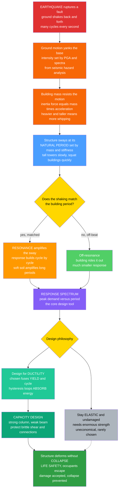

# 🌉 Earthquake Engineering and Seismic Design

> [!abstract] TL;DR
> An earthquake does not push a building — it **shakes the ground out from under it**, back and forth, many times a second, and the building's own **inertia** (its mass wanting to stay put) generates the destructive forces as it is whipped along. Every structure has a **natural period** of sway; when the ground shakes near that period, **resonance** pumps the motion higher and higher, so two neighbouring buildings of different heights can meet opposite fates in the same quake. The central and profoundly counterintuitive insight of modern seismic design is that you do **not** try to make a building strong enough to ride the quake out undamaged — that is impossibly expensive. Instead you deliberately design it to **bend and yield in controlled places** — to be **ductile** — sacrificing itself gracefully so that its hysteretic yielding **absorbs the earthquake's energy** and the frame deforms without **collapsing**, letting people escape even as the building is wrecked. The engineer's toolkit is the **response spectrum** (peak demand vs period, packaging a ground motion for design), **capacity design** (choosing which elements yield as ductile "fuses" while protecting brittle shear failures and connections — strong-column/weak-beam), the **force-reduction (R) factor** that trades strength for ductility, and advanced protection such as **base isolation** (decoupling the building from the ground on flexible bearings to shift its period away from resonance) and **dampers**. Because earthquakes are among the deadliest natural disasters, this "accept damage, prevent collapse" philosophy is the engineering that saves lives — a life-safety cornerstone of civil engineering, integrating structural dynamics, geotechnics, and materials.

---

## Intuition

**Analogy first.** Stand loosely on a rug and have someone yank it sharply back and forth. The rug (the ground) moves, but *you* — because of your **inertia** — want to stay where you were, so you get whipped, staggering one way then the other. A building in an earthquake is exactly that: the quake does not lean on it, it **jerks the foundation out from under it**, and the mass of every floor lags behind, generating the forces that tear the structure apart. The taller and heavier the building, the more violently it is whipped.

Now the terrifying twist: **resonance**. Every building has a natural sway rhythm — a tall tower sways slowly, like a long pendulum; a squat building buzzes quickly. If the ground happens to shake near a building's own rhythm, the swaying **builds and builds**, exactly like a child pumping a swing at just the right moment — small pushes at the right frequency add up to a huge arc. A building tuned to the quake can be destroyed while its neighbour of a different height, off the beat, rides it out almost untouched. Soft soil makes it worse, amplifying the slow, long-period shaking that tall buildings are most vulnerable to.

So how do you survive a force that can match your building's rhythm? Here is the profound engineering answer, and it feels backwards: **you do not try to stay strong and undamaged.** Making a building stiff and strong enough to remain elastic through a major quake is astronomically expensive and, worse, brittle things that finally break do so **suddenly, without warning**. Instead, modern design does the opposite — it lets the building **bend and yield on purpose**, in carefully chosen places, like crumple zones in a car. Those yielding regions **swallow the earthquake's energy** by deforming back and forth (each loop of yielding turns motion into heat), so the structure absorbs the blow, sags and cracks and leans — but **does not collapse**. Seismic design trades brute strength for **survivable flexibility**: the building may be a write-off, but everyone walks out.

---

## How It Works

### Core Mechanics

1. **The seismic demand is ground motion, not a force.** A fault ruptures and radiates waves (seismology's domain — see [[Earthquake_Source_and_Focal_Mechanisms]]); at a site this arrives as **dynamic base shaking** — a time history of ground acceleration lasting tens of seconds, with cycles several times a second. Its intensity is characterized by **peak ground acceleration (PGA)**, duration, and frequency content, quantified by seismic hazard analysis (see [[Seismic_Hazard_and_Ground_Motion]]).
2. **Inertia turns shaking into internal forces.** When the base accelerates by $a_g$, every mass $m$ in the structure resists with an **inertia force** $\approx m\,a_g$ (d'Alembert). The structure must carry these forces down to the ground through its members — so the seismic load a building feels is *proportional to its own mass and to how much its motion is amplified*.
3. **The structure responds as a dynamic oscillator.** Model a building as mass + stiffness + damping. Its **natural period** $T = 2\pi\sqrt{m/k}$ (tall/flexible = long period; short/stiff = short period) and its **damping ratio** $\zeta$ (typically 2–5% for buildings) govern the response. This is the single-degree-of-freedom (SDOF) equation $m\ddot u + c\dot u + k u = -m\,\ddot u_g(t)$ — identical machinery to [[Mechanical_Vibrations]] and [[Oscillations_and_SHM]], now forced by the ground.
4. **Resonance amplifies matched motion.** When the ground motion carries energy near the structure's natural period, the response **grows cycle by cycle** — resonance. This is why building **height/period matters** so much, and why **soft-soil sites** (which amplify long-period shaking) are especially dangerous for tall, long-period buildings: the 1985 Mexico City disaster killed mid-rise buildings whose periods matched the lakebed-amplified ground motion while shorter and taller buildings survived.
5. **The response spectrum packages the demand.** Run *many* SDOF oscillators of different periods through the same ground motion and record each one's **peak** response; plot peak response vs period and you have the **response spectrum** — the core design tool. It tells the engineer, at a glance, the maximum acceleration/displacement a structure of any given period will experience, and it shows the resonance hump and how **damping flattens the peak**. Codes replace jagged real spectra with smooth **design spectra**.
6. **The design philosophy — ductility over strength.** Designing a structure to stay **elastic** through a major earthquake demands enormous, uneconomical strength. Instead, modern **performance-based, life-safety** design accepts that a rare large quake *will* damage the building, and engineers it to survive that damage: selected regions **yield ductilely**, and the repeated yielding forms **hysteresis loops** whose enclosed area is **energy dissipated** (turned to heat). This **hysteretic energy dissipation** lets the structure deform far beyond its elastic limit without losing the ability to carry gravity — it bends instead of breaking.
7. **The force-reduction (R) factor trades strength for ductility.** Because a ductile structure can survive large deformations, codes let you design it for forces **much smaller** than the full elastic demand — divided by a **response-modification factor R** (roughly the available ductility). A special moment frame with $R\approx8$ is designed for one-eighth of the elastic force, *on the promise* that it can safely deform eight-fold past yield. The "equal-displacement rule" underpins this: for most periods, the peak displacement of a yielding system is about the same as an elastic one, so strength can be traded for ductility.
8. **Capacity design — choose where it yields.** The engineer deliberately designates **ductile "fuses"** (e.g., beam ends, brace cores) to yield first, and then makes everything else **stronger than the maximum force those fuses can deliver**, so the brittle, catastrophic failure modes never trigger. The canonical rule is **strong-column/weak-beam**: force plastic hinges into beams (repairable, non-collapse) rather than columns (which support gravity and can bring the building down). **Brittle failures — shear, poor connection detailing, non-ductile reinforcement — are the killers** and must be capacity-protected.
9. **Detailing makes ductility real.** Ductility is not free — it must be *detailed in*: **confinement** of concrete with closely-spaced ties/hoops so it can crush without shattering, **ductile welded/bolted connections** in steel, continuous well-anchored reinforcement, and avoiding sudden stiffness/strength changes.
10. **Advanced protection changes the game.** Rather than fight resonance, **base isolation** inserts flexible bearings between building and foundation, **lengthening the period** to 2–4 s — far from the damaging short-period energy — and adds damping, so the superstructure barely deforms. **Dampers** (viscous, friction, yielding) and **tuned mass dampers** add energy dissipation directly. Overall, engineers favour **regularity** (no soft stories, no torsional eccentricity), **redundancy** (multiple load paths), and the **lessons written in blood** from every past quake, each of which has tightened the codes.

### Flow / Architecture



---

## Key Concepts

### Secondary Level

- **The ground moves, not the building — at first.** An earthquake yanks the foundation back and forth; the building's weight (inertia) makes it want to stay put, so it gets **whipped**. The bigger and heavier the building, the harder the whip.
- **Every building has a natural sway rhythm.** Tall buildings sway slowly; short ones sway fast. **Resonance** is when the ground shakes at just that rhythm and the sway grows and grows — like pumping a swing at the right moment. Two neighbouring buildings of different heights can meet totally different fates.
- **Soft ground is dangerous.** Mud and loose soil amplify the slow shaking, so tall buildings on soft sites are hit hardest.
- **The big idea: bend, don't break.** You cannot make a building strong enough to be untouched — it is too expensive, and strong-but-brittle things snap without warning. Instead, engineers let the building **bend and yield on purpose** in chosen spots, soaking up the earthquake's energy so it **does not collapse** — people escape even if the building is ruined.
- **Clever tricks.** Some buildings sit on **rubber bearings (base isolation)** that let the ground slide underneath while the building stays still, or carry **dampers** (shock absorbers) that soak up the shaking.

### Undergraduate Level

- **The SDOF equation of motion.** A structure under base shaking obeys $m\ddot u + c\dot u + k u = -m\,\ddot u_g(t)$, i.e. $\ddot u + 2\zeta\omega_n\dot u + \omega_n^2 u = -\ddot u_g$, with **natural frequency** $\omega_n=\sqrt{k/m}$, **period** $T=2\pi/\omega_n$, and **damping ratio** $\zeta=c/(2\sqrt{km})$. The ground acceleration is the forcing.
- **Response spectrum.** For a given ground motion and damping, plot the **peak** response of an SDOF oscillator against its period $T$: **spectral displacement** $S_d(T)$, **pseudo-velocity** $S_v=\omega_n S_d$, and **pseudo-acceleration** $S_a=\omega_n^2 S_d$. $S_a$ (in $g$) times weight gives the design base shear. The spectrum shows a short-period acceleration-controlled plateau, a resonance hump, and a long-period displacement-controlled falloff; **higher damping lowers the whole curve**.
- **Base shear and equivalent lateral force.** Code static method: $V = C_s W$, where the seismic coefficient $C_s = S_a(T)/R \cdot I_e$ scales the spectral acceleration by the **response-modification factor R** and importance factor, then distributes $V$ up the height.
- **Ductility ratio.** $\mu = \Delta_{max}/\Delta_y$ (max displacement over yield displacement) measures how far past yield the structure goes. Ductile systems achieve $\mu$ of 4–8+; the **R factor** is closely tied to available $\mu$.
- **Hysteresis and energy dissipation.** Under cyclic load a yielding element traces a **force–displacement hysteresis loop**; the **area enclosed per cycle equals the energy dissipated**. This hysteretic damping, not elastic strength, is what protects a structure in a major quake. Elastic-perfectly-plastic and bilinear models capture the essence.
- **Capacity design and strong-column/weak-beam.** Designate ductile fuses, size everything else for the *overstrength* force the fuses can deliver, and ensure columns are stronger than beams so **plastic hinges form in beams**, preventing a **soft-story** column-hinge collapse. Avoid **brittle shear failure** — always make shear capacity exceed the shear associated with flexural yielding ("capacity shear").
- **Common lateral systems.** **Moment-resisting frames** (ductile beam-column joints, flexible, good drift performance), **braced frames** (stiff; concentric CBF vs energy-dissipating eccentric EBF and buckling-restrained BRBF), and **shear walls** (stiff, strong, control drift; need ductile boundary elements). Each has a code R value reflecting its ductility.
- **Site effects and geotechnics.** Soft soils amplify motion and shift the spectrum to longer periods; **liquefaction** (saturated loose sand losing strength) can cause bearing failure, settlement, and lateral spreading regardless of how good the superstructure is.

### Graduate Level

- **Multi-degree-of-freedom and modal analysis.** Real buildings are MDOF: $\mathbf{M}\ddot{\mathbf u}+\mathbf{C}\dot{\mathbf u}+\mathbf{K}\mathbf u=-\mathbf{M}\mathbf{r}\ddot u_g$. Solve the eigenproblem $\mathbf{K}\boldsymbol\phi=\omega^2\mathbf{M}\boldsymbol\phi$ for mode shapes and periods; **response-spectrum analysis** combines modal peaks via **SRSS** or **CQC** (accounting for closely-spaced modes). **Modal participation factors** and effective modal mass identify which modes matter.
- **Nonlinear time-history analysis.** For performance verification, integrate the full nonlinear equations (Newmark-$\beta$, average or constant acceleration) under a suite of scaled/spectrally-matched ground motions, with hysteretic element models (bilinear, Bouc-Wen, Takeda for concrete stiffness degradation, pinching for bond-slip). Captures higher-mode effects, P-Delta, and progressive damage that spectra cannot.
- **Performance-based earthquake engineering (PBEE).** The PEER framework chains **hazard** $\lambda(IM)$ → **structural response** $p(EDP\,|\,IM)$ → **damage** $p(DM\,|\,EDP)$ → **loss/decision variables** (cost, downtime, casualties), integrating to annualized loss. Performance objectives (Operational, Immediate Occupancy, Life Safety, Collapse Prevention) are tied to hazard levels (e.g., 43/475/2475-year returns) in ASCE 41 and FEMA P-58.
- **Capacity design theory.** Formalized by Park & Paulay: rank failure modes, force the hierarchy so ductile flexural yielding precedes all brittle modes by an **overstrength factor**. Requires computing probable (overstrength) member capacities including strain-hardening and, for concrete, confined-core enhancement, then designing shear and joints for those forces.
- **Confinement and section ductility.** Mander's confined-concrete model quantifies how transverse reinforcement raises strength and, crucially, ultimate strain — the source of curvature ductility in plastic hinges. Plastic-hinge length models convert curvature ductility to displacement ductility.
- **Base isolation dynamics.** Isolators (lead-rubber, friction pendulum) create a soft first "story," shifting the fundamental period to 2.5–4 s to move away from high-energy short periods; the near-rigid superstructure rides on the isolation mode. Design must check large **isolator displacements**, restoring force, and **long-period/near-fault pulse** demands that can be adverse.
- **Supplemental damping and tuned mass dampers.** Added viscous/friction/yielding dampers raise effective $\zeta$, shrinking spectral demand along the whole curve. A **tuned mass damper** (e.g., Taipei 101's 660-ton pendulum) is tuned to the fundamental period to counter-phase the sway, dissipating energy — the same principle as a vibration absorber in [[Mechanical_Vibrations]].
- **Near-fault and directivity effects.** Forward-directivity **velocity pulses** deliver large, sudden long-period energy that is especially demanding on flexible and isolated structures; fling-step and vertical components add further complexity beyond ordinary spectra.
- **Soil-structure interaction and liquefaction.** Foundation flexibility lengthens the period and adds radiation damping; kinematic and inertial interaction modify input motion. Liquefaction and cyclic softening require geotechnical mitigation (densification, drainage, ground improvement) — the superstructure's ductility is moot if the ground fails.

---

## Python Demo

```python
# Earthquake engineering: the two pillars of seismic design.
#   (a) RESPONSE SPECTRUM (SDOF) -- run single-degree-of-freedom oscillators of
#       many natural PERIODS through one ground-motion record and record each
#       peak response. The resulting pseudo-acceleration spectrum shows the
#       RESONANCE hump (periods that suffer most) and how DAMPING flattens it.
#   (b) DUCTILITY / HYSTERESIS -- drive a bilinear (yielding) element through
#       growing cyclic displacement. The force-displacement loops enclose an
#       AREA = energy dissipated (turned to heat). This hysteretic dissipation,
#       plus the R-factor reduction from elastic demand to design strength, is
#       why ductile structures survive quakes their elastic strength could not.
import numpy as np
import matplotlib.pyplot as plt

rng = np.random.default_rng(7)

# ----------------------------------------------------------------------
# Synthesize a broadband ground-motion acceleration record (m/s^2)
# ----------------------------------------------------------------------
dt   = 0.01
t    = np.arange(0.0, 30.0, dt)
# band-limited white noise -> low-pass smoothed, then a rise/decay envelope
raw  = rng.standard_normal(t.size)
kern = np.exp(-0.5 * (np.linspace(-3, 3, 25))**2); kern /= kern.sum()
sig  = np.convolve(raw, kern, mode="same")
env  = (t / 2.0) * np.exp(1.0 - t / 6.0)            # Bogdanoff-style envelope
env  = np.clip(env, 0, None)
ag   = sig * env
ag  *= (0.35 * 9.81) / np.max(np.abs(ag))           # scale to PGA ~ 0.35 g
PGA  = np.max(np.abs(ag))

# ----------------------------------------------------------------------
# (a) RESPONSE SPECTRUM via Newmark-beta (average acceleration, stable)
# ----------------------------------------------------------------------
def sdof_peak(period, zeta, ag, dt):
    """Peak spectral displacement Sd of a unit-mass SDOF under base accel ag."""
    wn = 2.0 * np.pi / period
    k, c, m = wn**2, 2.0 * zeta * wn, 1.0
    g, b = 0.5, 0.25                                 # Newmark average-acceleration
    a1 = m / (b * dt**2) + g * c / (b * dt)
    a2 = m / (b * dt) + (g / b - 1.0) * c
    a3 = (1.0 / (2.0 * b) - 1.0) * m + dt * (g / (2.0 * b) - 1.0) * c
    khat = k + a1
    u = v = 0.0
    p = -m * ag
    acc = (p[0] - c * v - k * u) / m
    umax = 0.0
    for i in range(len(ag) - 1):
        phat = p[i + 1] + a1 * u + a2 * v + a3 * acc
        u_new = phat / khat
        v_new = (g / (b * dt)) * (u_new - u) + (1 - g / b) * v + dt * (1 - g / (2 * b)) * acc
        acc   = (u_new - u) / (b * dt**2) - v / (b * dt) - (1 / (2 * b) - 1) * acc
        u, v = u_new, v_new
        umax = max(umax, abs(u))
    return umax

periods = np.linspace(0.05, 4.0, 120)
spectra = {}
for zeta in (0.02, 0.05, 0.10):
    Sd = np.array([sdof_peak(T, zeta, ag, dt) for T in periods])
    Sa = (2.0 * np.pi / periods)**2 * Sd / 9.81      # pseudo-accel in g
    spectra[zeta] = Sa

Sa5 = spectra[0.05]
Tpk = periods[np.argmax(Sa5)]
print("(a) RESPONSE SPECTRUM")
print(f"    PGA (T->0 anchor)             = {PGA/9.81:5.2f} g")
print(f"    Peak Sa at 5% damping         = {Sa5.max():5.2f} g  at T = {Tpk:.2f} s")
print(f"    Peak Sa at 10% damping        = {spectra[0.10].max():5.2f} g "
      f" -> damping cuts the resonance peak")

# ----------------------------------------------------------------------
# (b) BILINEAR HYSTERESIS -- energy dissipated by a yielding ductile element
# ----------------------------------------------------------------------
Fy, uy, alpha = 100.0, 0.02, 0.03                    # yield force/disp, post-yield ratio
k0 = Fy / uy                                         # initial stiffness
ke = (1.0 - alpha) * k0                              # EPP part stiffness
# cyclic displacement protocol: growing amplitude (as in lab qualification tests)
cyc = []
for amp in (1, 2, 3, 4, 5):                          # multiples of yield disp
    ph = np.linspace(0, 2 * np.pi, 200)
    cyc.append(amp * uy * np.sin(ph))
u_hist = np.concatenate(cyc)

F = np.zeros_like(u_hist)
up = 0.0                                             # plastic displacement (EPP part)
for i, u in enumerate(u_hist):
    f_epp = ke * (u - up)                            # trial elastic-perfectly-plastic force
    if f_epp >  Fy: f_epp, up =  Fy, u - Fy / ke
    if f_epp < -Fy: f_epp, up = -Fy, u + Fy / ke
    F[i] = alpha * k0 * u + f_epp                    # bilinear = linear spring + EPP

E_diss = np.abs(np.trapz(F, u_hist))                 # net enclosed area = energy dissipated
mu = np.max(np.abs(u_hist)) / uy                     # ductility demand reached
R_equal_disp = mu                                    # equal-displacement rule: R ~ mu
print("\n(b) DUCTILITY / HYSTERESIS")
print(f"    Ductility demand reached      mu = {mu:.1f}")
print(f"    Hysteretic energy dissipated     = {E_diss:8.1f} (force*disp units)")
print(f"    Implied R factor (equal-disp)    ~ {R_equal_disp:.1f}"
      f"  -> design for ~1/{R_equal_disp:.0f} of elastic force")

# ----------------------------------------------------------------------
# PLOTS
# ----------------------------------------------------------------------
fig, (axA, axB) = plt.subplots(1, 2, figsize=(14, 5.6))

# ---- (a) response spectrum ----
colors = {0.02: "firebrick", 0.05: "royalblue", 0.10: "seagreen"}
for zeta, Sa in spectra.items():
    axA.plot(periods, Sa, color=colors[zeta], lw=2.2,
             label=f"damping zeta = {int(zeta*100)}%")
axA.scatter([0.0], [PGA / 9.81], color="black", zorder=6)
axA.annotate("PGA anchor\n(rigid, T -> 0)", xy=(0.0, PGA / 9.81),
             xytext=(0.6, PGA / 9.81 * 0.85), fontsize=8,
             arrowprops=dict(arrowstyle="->"))
axA.axvline(Tpk, color="grey", lw=1.0, ls="--")
axA.annotate("RESONANCE hump:\nthese periods suffer most", xy=(Tpk, Sa5.max()),
             xytext=(Tpk + 0.5, Sa5.max() * 0.9), fontsize=8, color="firebrick",
             arrowprops=dict(arrowstyle="->", color="firebrick"))
axA.annotate("more damping\nlowers the whole curve", xy=(Tpk, spectra[0.10].max()),
             xytext=(1.8, spectra[0.10].max() + 0.3), fontsize=8, color="seagreen",
             arrowprops=dict(arrowstyle="->", color="seagreen"))
axA.set_xlabel("Structure natural period  T  (s)")
axA.set_ylabel("Pseudo-acceleration  Sa  (g)")
axA.set_title("(a) Response spectrum: resonance and the effect of damping")
axA.set_xlim(0, 4)
axA.set_ylim(0, max(Sa5.max(), spectra[0.02].max()) * 1.15)
axA.legend(fontsize=9)
axA.grid(alpha=0.3)

# ---- (b) hysteresis ----
axB.fill(u_hist, F, color="orange", alpha=0.18)
axB.plot(u_hist, F, color="darkorange", lw=1.6)
# elastic reference line (what an elastic system would demand: no yielding)
u_lin = np.linspace(u_hist.min(), u_hist.max(), 50)
axB.plot(u_lin, k0 * u_lin, color="royalblue", lw=1.4, ls="--",
         label="elastic demand (no yield)")
axB.axhline( Fy, color="grey", lw=0.8, ls=":")
axB.axhline(-Fy, color="grey", lw=0.8, ls=":")
axB.annotate("yield force Fy\n(design strength)", xy=(u_hist.max()*0.55, Fy),
             xytext=(u_hist.max()*0.15, Fy*1.9), fontsize=8,
             arrowprops=dict(arrowstyle="->"))
axB.annotate("shaded AREA =\nenergy dissipated", xy=(0, 0),
             xytext=(u_hist.max()*0.28, -Fy*1.5), fontsize=9, color="darkorange")
axB.annotate(f"ductility mu ~ {mu:.0f}\nR-factor cuts elastic\nforce to Fy = Fe/R",
             xy=(u_hist.max(), k0 * u_hist.max()), xytext=(u_hist.min()*0.95, Fy*2.4),
             fontsize=8, color="royalblue",
             arrowprops=dict(arrowstyle="->", color="royalblue"))
axB.set_xlabel("Displacement  u")
axB.set_ylabel("Restoring force  F")
axB.set_title("(b) Ductile hysteresis: yielding absorbs seismic energy")
axB.legend(fontsize=8, loc="lower right")
axB.grid(alpha=0.3)

plt.tight_layout()
plt.savefig("earthquake_engineering_seismic_design.png", dpi=120)
plt.show()
```

**What it shows.** Panel (a) is the **response spectrum**: each point is the *peak* response of a separate SDOF building of that period, driven through one ground-motion record. It rises from the **PGA anchor** (a rigid $T\to0$ structure just follows the ground), swells into a **resonance hump** where certain periods are amplified several-fold — those buildings suffer most — then falls off at long periods. Raising the **damping** from 2% to 10% pulls the entire curve down, which is exactly why added damping and base isolation help. Panel (b) is the **ductility story**: a yielding element driven through growing cycles traces fat **hysteresis loops**, and the shaded **area is energy dissipated as heat** — the structure's real defence. The dashed line shows the huge **elastic force demand** a non-yielding system would attract; capping the strength at $F_y=F_e/R$ (the **R-factor** reduction) and letting the element reach ductility $\mu$ is how design forces are made economical while the structure still survives. Strength buys nothing here that ductile energy dissipation cannot buy more cheaply.

---

## Real-World Applications

> **The 1985 Mexico City earthquake — resonance made visible.** An $M_w$ 8.0 quake 350 km away should have been survivable, but the soft, water-saturated clay of the old lakebed **amplified** long-period waves and rang at ~2 s. Mid-rise buildings (roughly 6–15 stories) whose natural periods matched this ground period went into **resonance** and collapsed, while shorter and taller buildings nearby survived — a textbook lesson in period matching, site amplification, and the response spectrum that reshaped codes worldwide.

> **Base isolation — hospitals and airports that must keep working.** Critical facilities (hospitals, emergency operations centers, data centers, museums) increasingly sit on **lead-rubber or friction-pendulum bearings** that lengthen the building period to ~3 s and add damping, so the superstructure barely deforms while the ground moves under it. Examples include seismically retrofitted city halls, LAX and San Francisco International terminals, and Japanese hospitals — after a major quake they remain **operational**, not merely standing.

> **Taipei 101 — a tuned mass damper against wind and quakes.** The 508 m tower carries a 660-ton steel **tuned mass damper** pendulum near the top, tuned to the building's fundamental period; it swings counter-phase to the tower's sway, dissipating energy and cutting occupant-felt motion — the structural cousin of a vibration absorber, and a marquee example of adding damping rather than brute strength (see [[Mechanical_Vibrations]]).

> **Capacity design and strong-column/weak-beam in codes.** ASCE 7 / ACI 318 / AISC 341 (US), Eurocode 8, and New Zealand's NZS 1170.5 all mandate **capacity design**: special moment frames must force plastic hinges into **beams**, demonstrate ductile connections (post-Northridge 1994 pre-qualified moment connections after brittle weld fractures), and provide **confinement** hoops so concrete columns can hinge without shattering. Each rule traces to a specific past failure — codes are, literally, written in the aftermath of disasters.

> **Buckling-restrained braces and dampers in retrofits.** Older non-ductile concrete and steel buildings are upgraded with **buckling-restrained braced frames (BRBF)**, **viscous/friction dampers**, and **fiber-reinforced-polymer jacketing** of columns to add ductility and energy dissipation without full reconstruction — turning brittle, collapse-prone structures into ductile ones that meet life-safety objectives.

---

## Common Pitfalls

- **Designing for strength instead of ductility.** The core misconception: making a building "stronger" is not the same as making it **seismically safe**. A very strong but non-ductile structure attracts large forces and then fails **brittlely, without warning**. The right lever is energy dissipation through controlled yielding, not raw capacity.
- **Ignoring the period / resonance.** Sizing a building for a single "seismic load" while ignoring where its **natural period** sits on the response spectrum can place it squarely on the resonance hump. Period (height, stiffness) and site amplification must drive the design — including the fact that damage during a quake **lengthens** the period.
- **Soft-story (weak first floor).** Open ground floors (parking, retail, tall lobbies) create a **soft/weak story** that concentrates all the drift and forms a column-hinge collapse mechanism — one of the deadliest and most common failure patterns (Northridge, Kobe, many others). Continuity of stiffness up the height is essential.
- **Brittle shear failure.** A member that yields in bending is ductile; the same member failing in **shear** is brittle and sudden. Under-designing shear relative to the flexural overstrength ("capacity shear") turns a ductile fuse into a catastrophic one — always make shear stronger than the shear that accompanies flexural yielding.
- **Poor connection and reinforcement detailing.** Inadequate **confinement**, short rebar development/lap lengths, discontinuous reinforcement, and non-ductile welds defeat ductility even in a well-conceived system. Northridge (1994) exposed brittle steel moment-connection welds; detailing *is* seismic design.
- **Plan/vertical irregularity and torsion.** Buildings with **eccentric stiffness** (asymmetric walls/cores) twist under shaking, overloading one side; setbacks and abrupt stiffness/mass changes concentrate demand. Regularity and redundancy (multiple load paths) are protective; irregularity must be explicitly analyzed.
- **Neglecting geotechnical failure — liquefaction.** A perfectly detailed ductile superstructure is useless if the **soil liquefies** and the foundation sinks, tilts, or spreads laterally. Site investigation, liquefaction assessment, and ground improvement are part of seismic design, not separate from it.
- **Pounding and separation.** Adjacent buildings (or wings) that sway out of phase and **collide** ("pounding") cause severe local damage; insufficient seismic **separation gaps** and mismatched floor levels are a frequent, overlooked hazard.
- **Treating base isolation as a cure-all.** Isolation is superb for short-period demand but can be **adverse under near-fault velocity pulses** and long-period basin motions, and requires large clearances for isolator displacement. It must be checked against the actual hazard, not applied blindly.

---

## Related Concepts

- [[Seismic_Hazard_and_Ground_Motion]] *(Geophysics)* — supplies the **demand** side: PGA, ground-motion prediction equations, and the site hazard/spectra that seismic design consumes; this note is the engineering response to that hazard.
- [[Earthquake_Seismology_Fundamentals]] *(Geophysics)* — the physics of how faults radiate the waves that become base shaking; magnitude, wave types, and attenuation set what a structure must survive.
- [[Earthquake_Source_and_Focal_Mechanisms]] *(Geophysics)* — the rupture process, directivity, and near-fault pulses that make some ground motions especially demanding on flexible and isolated structures.
- [[Mechanical_Vibrations]] *(Mechanical_Engineering)* — the shared machinery: natural frequency, damping, resonance, and the SDOF/MDOF equations; **tuned mass dampers** and vibration absorbers are directly borrowed from vibration engineering.
- [[Structural_Dynamics_and_Loads]] *(Aerospace_Engineering)* — the same dynamic-response, modal-analysis, and resonance concepts applied to airframe loads; a cross-domain view of forced vibration and dynamic amplification.
- [[Oscillations_and_SHM]] *(Physics)* — the foundational damped-driven oscillator whose resonance curve is the bare skeleton of the response spectrum; the physics beneath the engineering.

*Sibling notes in this Infrastructure and Frontiers section and across Civil Engineering (referenced in prose, to be linked when created): **Structural Dynamics and Wind Engineering** (the companion dynamic-load problem — resonance, damping, and P-Delta under lateral wind and quakes), **Bridge Engineering** (bridges are among the most seismically vulnerable and most isolated/damped structures), **Infrastructure Resilience and Asset Management** (the systems view of how seismic design protects networks and communities, not just single buildings), **Structural Stability and Buckling** (brace and member buckling as a brittle failure mode capacity design must prevent), and **Design Codes and Structural Safety** (the ASCE 7 / Eurocode 8 load-and-resistance framework and safety factors that formalize seismic provisions).*

---

## Review Questions

1. **(Secondary)** In the same earthquake, a 6-story building collapses while the 30-story tower next to it and the 2-story shop across the street are barely scratched. Using the words *natural rhythm* and *resonance*, explain how this is possible. Then explain, in plain terms, why engineers deliberately let a building **bend and yield** instead of trying to make it strong enough to stay undamaged.
2. **(Undergraduate)** A building has fundamental period $T=0.8$ s and 5% damping. (a) Sketch qualitatively where it falls on a response spectrum and explain what $S_a(0.8)$ tells you about its base shear. (b) The lateral system has $R=6$. Explain, using the ductility ratio $\mu$ and the equal-displacement rule, what promise the design is making when it uses only $1/6$ of the elastic force. (c) Why must the shear capacity of a ductile beam exceed the shear associated with its flexural yielding?
3. **(Graduate)** Contrast two strategies for protecting a hospital that must remain operational after a major quake: (i) a **base-isolated** fixed-base ductile moment frame, and (ii) a conventional ductile frame with **supplemental viscous dampers**. Discuss how each modifies the structure's position on the response spectrum (period shift vs added damping), their behaviour under **near-fault velocity pulses**, expected damage/downtime under a performance-based (PEER/FEMA P-58) framework, and the failure modes each must still guard against.

---

## Sources

- Chopra, A. K. — *Dynamics of Structures: Theory and Applications to Earthquake Engineering* (Pearson) — the definitive text on SDOF/MDOF response, response spectra, and earthquake analysis.
- Bozorgnia, Y. & Bertero, V. V. (eds.) — *Earthquake Engineering: From Engineering Seismology to Performance-Based Engineering* (CRC Press) — comprehensive bridge from seismology to PBEE.
- Naeim, F. (ed.) — *The Seismic Design Handbook*, 2nd ed. (Kluwer/Springer) — practical seismic design, systems, detailing, and code application.
- Priestley, M. J. N., Calvi, G. M. & Kowalsky, M. J. — *Displacement-Based Seismic Design of Structures* (IUSS Press) — modern displacement/performance-based design and capacity design.
- FEMA / ASCE — *ASCE 7 Minimum Design Loads and Associated Criteria* (seismic provisions), *FEMA P-58 Seismic Performance Assessment*, and *NEHRP Recommended Seismic Provisions* — the governing code and performance framework.

---

#civil-engineering #earthquake-engineering #seismic-design #ductility #response-spectrum
