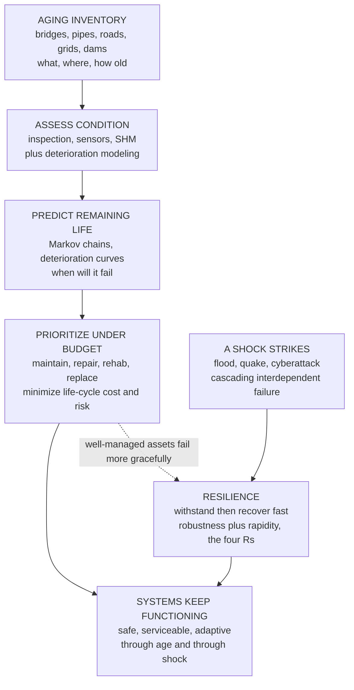

# 🏗️ Infrastructure Resilience and Asset Management

> [!abstract] TL;DR
> Humanity spent the last century **building the modern world** — bridges, water and sewer mains, power grids, roads, dams — and much of it is now **wearing out all at once**, like a house full of appliances all bought the same year failing together, while the money to fix it is chronically short (the recurring **"infrastructure report card" D-grades**). You cannot replace everything, so you must **manage** it. **Asset management** is the unglamorous but vital discipline of stewarding this vast aging inheritance across its whole **life cycle**: keep an **inventory** (what you have, where, how old), **assess condition** (inspection, sensors, **structural health monitoring**), **model deterioration** (predict decline and **remaining life** with Markov chains and deterioration curves), and **prioritize** maintain-repair-rehab-replace decisions under a hard budget to minimize **life-cycle cost** and risk — spending where it does the most good, like a doctor triaging a whole population's health rather than one patient. Its central trap is **deferred maintenance**: skipping the cheap repair now to face a catastrophic (and far more expensive) failure later, because repair cost rises steeply as condition falls, so the winning move is *the right repair at the right time* — an optimal-timing problem. **Resilience** adds a second question beyond "will it last?" — namely, "**when disaster strikes** (flood, quake, cyberattack, cascading blackout), how badly does it break, and how fast can it bounce back?" It is captured by the **resilience curve/triangle**: functionality drops when a shock hits (loss of **robustness**) and climbs back over a recovery time (**rapidity**), and the **lost area** measures the harm — so a resilient system isn't one that never fails but one that **fails gracefully and recovers quickly**, engineered through the **four Rs (robustness, redundancy, resourcefulness, rapidity)**, modularity, and prevention of **cascading failure** in interdependent power-water-transport-communication networks that fail together. In an aging, climate-stressed, tightly-coupled built world with finite budgets, getting the most **life and safety per dollar** (asset management) and **limiting and recovering from shock** (resilience) are now central to civil engineering — the defining twenty-first-century infrastructure challenge alongside sustainability.

## Intuition

**Analogy — a house full of appliances all bought the same year.** Imagine you furnished an entire house at once — fridge, water heater, dishwasher, furnace, roof, wiring — all installed in the same busy year. For a couple of decades everything just works and you barely think about it. Then, quietly and almost simultaneously, they all reach the end of their lives. The water heater starts leaking, the furnace coughs, the roof needs replacing, the dishwasher dies — and you don't have the cash to replace all of them this year. Now you have a genuinely hard problem that has nothing to do with any single appliance: **which do I fix, which do I nurse along, and which do I let fail — given the money I actually have?** That is exactly the position the modern world is in. We built our bridges, pipes, grids, and roads in a great postwar surge, and now that whole cohort is aging out **together**, while maintenance budgets never kept pace.

**Asset management** is the discipline of stewarding that vast aging inheritance intelligently. You can't replace it all, so you must **know what you have, know how bad shape each piece is in, and spend limited money where it saves the most future pain** — triaging a whole *population* of assets the way a public-health doctor triages a whole population of patients, not fussing over one at a time. And its cruel arithmetic is the **deferred-maintenance trap**: the cheap repair skipped today (re-seal the deck, re-line the pipe) becomes the ruinous emergency tomorrow (replace the collapsed bridge, dig up the burst main) — so the whole art is doing *the right repair at the right time*.

**Resilience** asks a second, deeper question. Asset management mostly asks "**will it last?**" Resilience asks "**when — not if — a shock hits, how badly does it break, and how fast does it come back?**" A flood, an earthquake, a cyberattack, a cascading blackout: these will come. A **brittle** system takes the hit, loses almost everything, and limps back over months. A **resilient** system takes the same hit, loses *less* (it is **robust**), and recovers *fast* (it is **rapid**) — because it was built with **redundancy** and **resourcefulness** to fail gracefully rather than shatter. Resilience is not the fantasy of never failing; it is the engineering of *failing softly and bouncing back quickly*. Put together, asset management and resilience are about keeping civilization's physical foundation working through both **slow age** and **sudden shock**.

---

## How It Works

### Core Mechanics

1. **Start with what you own — the inventory.** You cannot manage what you cannot see. Asset management begins with a systematic **register** of every asset: what it is, where it is, when it was built, what it is made of, its capacity, and its role in the network. For a water utility that may be thousands of kilometers of buried pipe of different ages, materials, and diameters; for a transport agency, every bridge, culvert, sign, and pavement segment.

2. **Find out how bad shape it's in — condition assessment.** Each asset's health is scored, usually on a **condition index** (as-new down to failed), through routine **inspection** (a bridge inspector's rating), non-destructive testing, and increasingly continuous **structural health monitoring (SHM)** — strain gauges, accelerometers, corrosion and acoustic-emission sensors, and satellite/drone imagery — feeding a **digital twin** that mirrors the real asset's state.

3. **Predict the decline — deterioration modeling.** Condition doesn't stay put; it **deteriorates**, often *slowly at first and then rapidly* once protective layers (paint, cover concrete, pipe lining) are breached. Engineers fit **deterioration curves** or **Markov transition models** (probabilities of dropping from one condition state to the next each year) to forecast future condition and **remaining useful life** — the "how long have I got?" for each asset.

4. **Decide where the money goes — prioritization under budget.** Here is the heart of it. With more needs than dollars, you rank interventions — **maintain, repair, rehabilitate, or replace** — to minimize **life-cycle cost** and **risk** across the whole portfolio. Risk = **probability of failure × consequence of failure**, so a mildly deteriorated but critical trunk main can outrank a badly deteriorated but redundant side street. This is **risk-based, performance-based** management against defined **levels of service**, codified in **ISO 55000**.

5. **Beat the deferred-maintenance trap.** **Preventive** (proactive) maintenance costs a little, regularly, and keeps condition high; **reactive** (run-to-failure) maintenance costs nothing now but courts catastrophic, expensive failure later — and because repair cost rises **steeply (convexly)** as condition worsens, deferral is doubly punished. The optimum is neither over-maintaining nor deferring: **the right repair at the right time**, found by minimizing total life-cycle cost.

6. **Now add shock — the resilience layer.** Beyond gradual wear, systems face **acute disruptions**: natural hazards, accidents, attacks, climate extremes. Resilience is the capacity to **withstand** (limit the loss — *robustness*), **adapt**, and **rapidly recover** (*rapidity*), aided by **redundancy** (spare paths/capacity) and **resourcefulness** (people, plans, materials to respond) — the **four Rs**. It is measured by the **resilience curve**: functionality drops when the shock lands and climbs back over the recovery period; **resilience loss = the area between full service and the degraded curve** (robustness × recovery speed).

7. **Design against cascades, and for a moving climate.** Modern infrastructure is **interdependent** — power feeds water pumps and telecoms, transport moves crews and fuel — so a single failure can **cascade** across networks that fail together (a blackout stops water treatment, which stops hospitals). Resilient design uses **modularity, redundancy, graceful degradation, and cascade-breaking** decoupling, and — because the **hazard baseline itself is shifting** — builds in **climate adaptation**: designing for tomorrow's floods and heat, not yesterday's.

### Flow / Architecture



---

## Key Concepts

### Secondary Level

- **We built the modern world all at once — and now it's wearing out all at once.** Bridges, water pipes, roads, and power lines were mostly built decades ago in a big burst, and that whole generation of infrastructure is reaching old age at the same time — like a house where every appliance was bought the same year and now they all break together. There isn't enough money to replace everything, so engineers must decide what to fix first.
- **Asset management = knowing what you have and spending wisely.** It means keeping a list of everything you own, checking how worn out each piece is, guessing how much life is left, and then putting your limited repair money where it does the most good — a bit like a doctor caring for a whole town's health instead of one patient.
- **Fix it in time, or pay much more later.** A small, cheap repair done on schedule (repainting a bridge, re-lining a pipe) keeps things healthy. Skipping it to "save money" is the **deferred-maintenance trap**: the problem gets worse and worse until it fails suddenly and the emergency fix costs many times more. The smart move is *the right repair at the right time*.
- **Resilience = bouncing back from disaster.** Storms, earthquakes, and blackouts *will* happen. A **resilient** system is not one that never breaks — it's one that **breaks a little and recovers fast** instead of breaking badly and staying down for months. Backups, spare routes, and good emergency plans are what make it bounce back.
- **Things are connected, so failures spread.** Power runs the water pumps; water and roads run everything else. When one system goes down it can drag others with it — a blackout can stop water and phones too. Good engineering keeps these **cascading failures** from spreading.
- **The climate is changing the rules.** Floods, heat, and storms are getting more extreme, so infrastructure now has to be built for tomorrow's weather, not just yesterday's — another reason old infrastructure is under strain.

### Undergraduate Level

- **The asset-management life cycle.** The loop is **inventory → condition assessment → deterioration modeling → prioritization → intervention → (repeat)**, governed by **ISO 55000** and organized around defined **levels of service** (the performance the public is promised) and **risk** ($\text{risk} = P_{\text{fail}} \times \text{consequence}$). The goal is to minimize whole-of-life cost and risk, not to maximize any single asset's condition.
- **Condition indices and deterioration curves.** Condition is tracked on a scale (e.g., a bridge **Condition Rating** or a pavement **PCI/IRI**). Deterioration is typically **convex in time** — slow while protective layers hold, then rapid once corrosion or cracking initiates — which is why a small delay in repair can drop an asset off a cliff.
- **Markov deterioration models.** A common formalism treats condition as discrete **states** with a **transition matrix** $P$ giving the probability of moving to a worse state each year: the state distribution evolves as $\pi_{t+1} = \pi_t P$. This predicts the *fraction* of a large network in each condition state over time and the expected time to reach a repair threshold — network-level forecasting rather than single-asset certainty.
- **Preventive vs reactive maintenance and the LCC optimum.** **Preventive** maintenance is frequent, cheap, and keeps condition high; **reactive** (run-to-failure) defers cost but invites expensive failure. Total **life-cycle cost** $\text{LCC} = \text{capital} + \sum_t \dfrac{\text{maintenance}_t + \text{expected failure}_t}{(1+r)^t}$ is **U-shaped** in maintenance frequency — over-maintaining wastes money, under-maintaining courts failure — so there is an **optimal maintenance interval** (the Python demo finds it).
- **The four Rs of resilience.** **Robustness** (strength to withstand a shock with minimal loss), **Redundancy** (substitutable elements so no single failure is total), **Resourcefulness** (capacity to mobilize people, money, and materials to respond), and **Rapidity** (speed of recovery). Robustness sets how *deep* the resilience triangle is; rapidity sets how *wide*.
- **The resilience curve/triangle.** System functionality $Q(t)$ sits at 100% until a hazard at $t_0$ drops it to a residual level (robustness), then recovers to full service over a recovery time $T_r$. **Resilience loss** $= \int_{t_0}^{t_0+T_r}[Q_{\max}-Q(t)]\,dt$ — the *area* of the triangle. Two levers shrink it: raise the residual (be more robust) or shorten $T_r$ (recover faster).
- **Interdependence and cascading failure.** Real infrastructure is a **network of networks** (power ↔ water ↔ transport ↔ telecom). Coupling that boosts efficiency also transmits failure: a node lost in one network disables dependent nodes in another, which feed back, producing a **cascade**. Redundancy, islanding/decoupling, and graceful degradation limit the spread.

### Graduate Level

- **Formal resilience quantification (Bruneau's framework).** The seminal formulation defines resilience loss as $R = \int_{t_0}^{t_1}\![100 - Q(t)]\,dt$ over the **robustness** (residual functionality), **rapidity** (recovery rate), **resourcefulness**, and **redundancy** dimensions — spanning **technical, organizational, social, and economic (TOSE)** systems. It turns "resilience" from a slogan into a computable area under a functionality-versus-time curve, enabling comparison and optimization across mitigation options.
- **Stochastic deterioration and remaining-useful-life (RUL).** Beyond simple Markov chains, deterioration is modeled with **gamma processes** and **Wiener/drift-diffusion** degradation paths, or semi-Markov models with state-dependent sojourn times, yielding a *distribution* of remaining life. **Bayesian updating** fuses SHM sensor streams with these priors so the RUL estimate sharpens as data arrive — the analytical core of **predictive (condition-based) maintenance** and the digital twin.
- **Maintenance optimization under uncertainty.** The maintain-repair-replace decision is posed as a **Markov Decision Process** or renewal-theoretic optimization: choose an **inspection-and-intervention policy** (e.g., condition thresholds) minimizing expected discounted LCC subject to reliability/level-of-service constraints. At network scale this becomes a large **constrained combinatorial optimization** (which of thousands of assets to treat this year under a budget cap) solved by ILP, dynamic programming, or heuristics.
- **Reliability-based and risk-based prioritization.** Assets and hazards are random, so structural safety is expressed via **reliability index** $\beta$ and **fragility curves** $P[\text{fail}\mid \text{demand}]$ (the same machinery as seismic and flood fragility). Risk-ranking multiplies failure probability by consequence and interdependence, giving a **risk-informed prioritization** that can invert a naive worst-condition-first ranking when consequences differ sharply.
- **Interdependent-network resilience and percolation.** Cascading failure in **coupled networks** is analyzed with **percolation theory**: interdependent networks can exhibit **abrupt (first-order) collapse** at a critical fraction of failed nodes — dramatically more fragile than a single network's gradual breakdown. Resilience design therefore targets **topology** (avoid critical single points, add redundant paths, reduce coupling) as much as component strength — connecting directly to network science and systemic-risk theory.
- **Resilience-based design and optimization.** Rather than only *reliability-based* design (minimize failure probability), **resilience-based design** optimizes the *whole* $Q(t)$ curve — investing jointly in robustness (pre-event hardening) and recovery capacity (post-event rapidity: spare parts, crews, rapid-repair details, modular replacement) to minimize expected resilience loss plus cost. It explicitly values *recoverability*, not just strength.
- **Deep uncertainty and climate nonstationarity.** The hazard baseline is **nonstationary** — flood, heat, and wind extremes are trending — so design values fit to the historical record are biased low. Modern practice uses **nonstationary extreme-value models**, **scenario/robust decision-making**, and **adaptive pathways** (staged, upgradable designs with pre-planned tipping points) so infrastructure can be *incrementally* strengthened as the climate reveals itself, avoiding both over-building and lock-in.

---

## Python Demo

```python
# ==========================================================================
# INFRASTRUCTURE RESILIENCE & ASSET MANAGEMENT -- two core ideas, quantified.
#
#   (a) DETERIORATION CURVE + maintenance resets: an asset's CONDITION decays
#       (accelerating once degraded); preventive maintenance keeps it high,
#       deferred maintenance lets it sag toward failure.
#   (b) LIFE-CYCLE COST vs maintenance timing: cheap-but-frequent preventive
#       cost trades against convex deferral/failure cost -> a U-shaped total
#       with an OPTIMAL maintenance interval ("the right repair at the right time").
#   (c) RESILIENCE CURVE: functionality drops when a shock hits and recovers;
#       resilience LOSS = the lost area (robustness x rapidity). A brittle,
#       slow-recovery system vs a robust, fast-recovery one.
#
# Requires numpy + matplotlib only.
# ==========================================================================
import numpy as np
import matplotlib.pyplot as plt

# --------------------------------------------------------------------------
# (a) DETERIORATION with preventive maintenance resets.
#     Condition index: 100 = as-new, 0 = failed. Decay ACCELERATES as the
#     asset degrades (breached protective layers fail ever faster) -- the
#     physical basis of "a stitch in time saves nine".
# --------------------------------------------------------------------------
dt, T = 0.05, 70.0
t = np.arange(0.0, T + dt, dt)
FAIL = 30.0                                  # below this = unsafe / emergency

def decay_rate(C):                           # condition points lost per year
    return 0.75 * (1.0 + (100.0 - C) / 40.0) # grows as condition C falls

def condition_path(interval, uplift=55.0):
    """Deterioration with a repair every `interval` years that lifts condition."""
    C = np.empty_like(t); C[0] = 100.0
    next_maint = interval
    for i in range(1, len(t)):
        C[i] = max(0.0, C[i-1] - decay_rate(C[i-1]) * dt)
        if t[i] >= next_maint:
            C[i] = min(100.0, C[i] + uplift)  # a repair renews the asset
            next_maint += interval
    return C

C_prev  = condition_path(interval=8.0)        # timely / preventive
C_defer = condition_path(interval=26.0)       # deferred / reactive

# --------------------------------------------------------------------------
# (b) LIFE-CYCLE COST vs maintenance interval tau (the classic PM optimum).
#     preventive cost  ~ A / tau      (frequent intervention = costly)
#     deferral/failure ~ B * tau**p   (wait longer -> worse condition, convex)
# --------------------------------------------------------------------------
tau   = np.linspace(2.0, 40.0, 400)          # maintenance interval [years]
A, B, p = 220.0, 0.015, 2.2
maint = A / tau                              # spread intervention cost over interval
fail  = B * tau**p                           # convex deferral / failure penalty
total = maint + fail
tau_star = tau[np.argmin(total)]             # cost-optimal interval

print("=== (a) Deterioration paths ===")
print(f"  preventive (repair every  8 yr): min condition reached = {C_prev.min():5.1f}")
print(f"  deferred   (repair every 26 yr): min condition reached = {C_defer.min():5.1f}"
      f"  {'-> DIPS INTO FAILURE ZONE' if C_defer.min() < FAIL else ''}")
print("=== (b) Life-cycle cost optimum ===")
print(f"  cost-optimal maintenance interval ~ {tau_star:4.1f} years"
      f"   (min total cost = {total.min():.1f})")

# --------------------------------------------------------------------------
# (c) RESILIENCE CURVE: functionality Q(t) after a shock at t_e.
#     resilience LOSS = integral of (100 - Q) dt  (smaller = more resilient).
# --------------------------------------------------------------------------
tt, t_e = np.arange(0.0, 60.0, 0.05), 10.0

def resilience_curve(robustness, recovery_time, slow=False):
    Q = np.full_like(tt, 100.0)
    for i, ti in enumerate(tt):
        if t_e <= ti < t_e + recovery_time:
            frac = (ti - t_e) / recovery_time
            r = frac**2 if slow else frac     # slow (convex) vs steady recovery
            Q[i] = robustness + (100.0 - robustness) * r
        elif ti < t_e:
            Q[i] = 100.0
    return Q

Q_brittle   = resilience_curve(robustness=35.0, recovery_time=32.0, slow=True)
Q_resilient = resilience_curve(robustness=75.0, recovery_time=8.0,  slow=False)
loss_brittle   = np.trapz(100.0 - Q_brittle,   tt)   # area of the resilience triangle
loss_resilient = np.trapz(100.0 - Q_resilient, tt)

print("=== (c) Resilience (lost area, smaller is better) ===")
print(f"  brittle   system: robustness 35%, recovery 32 yr -> loss = {loss_brittle:6.0f}")
print(f"  resilient system: robustness 75%, recovery  8 yr -> loss = {loss_resilient:6.0f}")
print(f"  resilience improvement factor ~ {loss_brittle/loss_resilient:4.1f}x")

# --------------------------------------------------------------------------
# PLOTS
# --------------------------------------------------------------------------
fig, ax = plt.subplots(1, 3, figsize=(17, 5))
fig.suptitle("Infrastructure Resilience & Asset Management: deterioration, "
             "life-cycle cost, and the resilience curve", fontsize=13, fontweight="bold")

# (a) deterioration + maintenance
ax[0].plot(t, C_prev,  color="#059669", lw=2.4, label="preventive (repair every 8 yr)")
ax[0].plot(t, C_defer, color="#b91c1c", lw=2.4, label="deferred (repair every 26 yr)")
ax[0].axhline(FAIL, color="gray", ls=":", lw=1.4)
ax[0].fill_between(t, 0, FAIL, color="crimson", alpha=0.08)
ax[0].text(1, FAIL + 2, "failure / unsafe zone", fontsize=8, color="gray")
ax[0].set_xlabel("time (years)")
ax[0].set_ylabel("condition index (100 = as-new)")
ax[0].set_title("(a) Deterioration + maintenance\nfix in time vs let it sag")
ax[0].set_ylim(0, 105)
ax[0].legend(fontsize=8, loc="lower left")
ax[0].grid(True, alpha=0.3)

# (b) life-cycle cost U-curve
ax[1].plot(tau, maint, color="#059669", lw=1.8, ls="--", label="preventive cost ~ 1/tau")
ax[1].plot(tau, fail,  color="#ea580c", lw=1.8, ls="--", label="deferral/failure ~ tau^p")
ax[1].plot(tau, total, color="#1d4ed8", lw=2.6, label="total life-cycle cost")
ax[1].axvline(tau_star, color="black", ls=":", lw=1.3)
ax[1].plot([tau_star], [total.min()], "o", color="black", ms=7, zorder=5)
ax[1].annotate(f"optimal ~ {tau_star:.0f} yr", (tau_star, total.min()),
               textcoords="offset points", xytext=(10, 22), fontsize=9)
ax[1].set_xlabel("maintenance interval tau (years)")
ax[1].set_ylabel("life-cycle cost (relative)")
ax[1].set_title("(b) Life-cycle cost optimum\nright repair at the right time")
ax[1].set_ylim(0, 120)
ax[1].legend(fontsize=8, loc="upper center")
ax[1].grid(True, alpha=0.3)

# (c) resilience curves
ax[2].plot(tt, Q_brittle,   color="#b91c1c", lw=2.4, label=f"brittle (loss {loss_brittle:.0f})")
ax[2].plot(tt, Q_resilient, color="#059669", lw=2.4, label=f"resilient (loss {loss_resilient:.0f})")
ax[2].fill_between(tt, Q_brittle,   100, color="#b91c1c", alpha=0.10)
ax[2].fill_between(tt, Q_resilient, 100, color="#059669", alpha=0.12)
ax[2].axvline(t_e, color="gray", ls=":", lw=1.2)
ax[2].text(t_e + 0.5, 15, "shock hits", fontsize=8, color="gray", rotation=90)
ax[2].set_xlabel("time (years)")
ax[2].set_ylabel("system functionality Q(t)  [%]")
ax[2].set_title("(c) Resilience curve\nlost area = robustness x rapidity")
ax[2].set_ylim(0, 105)
ax[2].legend(fontsize=8, loc="lower right")
ax[2].grid(True, alpha=0.3)

plt.tight_layout(rect=[0, 0, 1, 0.93])
plt.savefig("infrastructure_resilience_and_asset_management.png", dpi=150)
# Expected (approx): deferred path dips into the failure zone while preventive
#   stays high; LCC optimum interval ~ 16 yr; brittle resilience loss is
#   several times the resilient one.
```

Running it prints the numbers and draws the two faces of the discipline. **Panel (a)** is the **deterioration story**: the accelerating decay curve means condition falls slowly at first and then plunges — the *preventive* strategy (green, small repairs every 8 years) keeps the asset healthy, while the *deferred* strategy (red, big repairs every 26 years) lets condition **sag into the failure zone** before each expensive rescue. **Panel (b)** turns that into money: **preventive** cost falls as you space out repairs (`~1/tau`) while **deferral/failure** cost climbs convexly (`~tau^p`), and their sum is the classic **U-shaped life-cycle cost** with a clear **optimal interval (~16 years)** — over-maintaining wastes money, under-maintaining courts catastrophe, and the minimum *is* "the right repair at the right time." **Panel (c)** is the **resilience curve**: functionality holds at 100% until a shock, drops to a residual level (**robustness**), and recovers over some time (**rapidity**); the **shaded lost area** is the resilience loss. The **brittle** system (deep drop, slow recovery) loses several times the area of the **resilient** one (shallow drop, fast recovery) — the quantitative meaning of *fail gracefully and bounce back quickly*.

---

## Real-World Applications

> **Example — the ASCE Infrastructure Report Card and the aging-bridge problem.** Every few years the American Society of Civil Engineers grades U.S. infrastructure, and the marks have hovered around **C-/D** for decades, with a multi-trillion-dollar backlog of deferred maintenance — the single most visible symbol of the aging-infrastructure challenge. The concrete case is bridges: tens of thousands are rated **structurally deficient**, and the **I-35W Mississippi River bridge collapse (Minneapolis, 2007)**, which killed 13 people, was a deferred-maintenance-and-design failure that catalyzed nationwide investment in **inspection, structural health monitoring, and asset-management systems**. Modern bridge management (e.g., **AASHTOWare BrM / Pontis**) is exactly this note in practice: an inventory of every bridge, condition ratings from routine inspection, **Markov deterioration models** predicting future condition, and **optimization** that allocates a fixed budget across thousands of bridges to minimize whole-network life-cycle cost and risk.

- **Water and sewer utilities.** Buried pipe networks are the ultimate hidden-aging asset — out of sight, decades old, and failing invisibly until a **water main bursts** or a sinkhole opens. Utilities run **asset-management programs** under **ISO 55000**, using pipe-break histories, material/age data, and (increasingly) acoustic and pressure **sensors** to predict failure and prioritize which of thousands of kilometers to replace each year within a fixed rate-funded budget.
- **The electric grid and cascading blackouts.** The grid is the textbook **interdependent, cascade-prone** system: the **2003 Northeast blackout** began with a few tripped lines and a software bug and cascaded into 50 million people losing power, taking down water pumping and transport with it. Grid resilience now emphasizes **redundancy, islanding/microgrids, and rapid restoration** — engineering the *recovery* half of the resilience curve, not just the strength half.
- **Structural health monitoring and digital twins.** Instrumented landmark structures — long-span bridges, tunnels, dams, and stadiums — carry dense sensor arrays feeding **digital twins** that estimate condition and **remaining useful life** in real time, shifting maintenance from fixed-schedule to **condition-based (predictive)** and letting operators catch deterioration before it becomes danger.
- **Post-earthquake and post-flood recovery planning.** Seismic and flood resilience is planned with **Bruneau-style resilience curves** at the community scale (NIST's Community Resilience Planning Guide): estimate how much **functionality** hospitals, water, power, and transport lose in a design event and how fast they recover, then invest to raise robustness and shorten recovery — measuring success as **reduced lost area**, not merely fewer collapses.
- **Climate adaptation of existing assets.** Because the **hazard baseline is rising**, agencies retrofit and re-rate existing infrastructure for tomorrow's floods and heat — raising levees and substations, upsizing culverts, and using **adaptive pathways** (staged, upgradable designs) so assets can be strengthened incrementally as the climate reveals itself, rather than over-built or stranded.
- **Rail, ports, and airports.** High-throughput transport assets use **predictive maintenance** on track, signals, and pavements — sensor-driven deterioration models that schedule intervention at the LCC optimum — because unplanned failure means both safety risk and enormous economic disruption downstream.

---

## Common Pitfalls

- **Treating maintenance as a cost to cut rather than an investment.** Deferring maintenance is politically easy (the bridge still stands this year) and financially seductive, but because repair cost rises **convexly** as condition falls, the deferred-maintenance backlog compounds until failures force far costlier emergency reconstruction. The cheap saving today buys the expensive catastrophe tomorrow.
- **Managing single assets instead of the portfolio.** Fixing whatever is loudest or worst-condition-first is not optimization. Because **risk = probability × consequence**, a mildly deteriorated *critical* asset can rightly outrank a badly deteriorated *redundant* one. Prioritize by **risk and network role**, not by condition alone.
- **Confusing "the 100-year design" or a reliability target with resilience.** A structure can be very unlikely to fail yet **brittle** — when it *does* fail (or when an unforeseen shock hits), it loses everything and takes forever to recover. Reliability shrinks failure *probability*; resilience shrinks the *consequence and recovery time*. You need both; optimizing only for strength can produce a fragile, slow-to-recover system.
- **Ignoring interdependence and cascades.** Hardening one network while ignoring its couplings is a false economy: a resilient water plant is useless if its power feed and its operators' roads both fail. Model the **network of networks**, and design **decoupling, redundancy, and graceful degradation** so a local failure cannot cascade system-wide.
- **Assuming a stationary hazard (designing for yesterday's climate).** Flood, heat, and wind extremes are **trending**, so design values fit to the historical record are biased low and "safe" old designs are quietly becoming under-designed. Use **nonstationary** hazard analysis and **adaptive, upgradable** designs.
- **No inventory, no data — flying blind.** You cannot manage, model deterioration, or prioritize what you have not catalogued and inspected. Many agencies' biggest gap is simply not knowing **what they own and its condition**; the deterioration model and the optimization are only as good as the inventory and inspection data feeding them.
- **Over-instrumenting without decisions.** Bolting sensors onto everything and building a "digital twin" is worthless if the data never changes a maintenance decision. **Monitoring must close the loop** to condition assessment, RUL prediction, and prioritized action — otherwise it is expensive telemetry, not asset management.
- **Optimizing recovery only after disaster strikes.** Rapidity (fast recovery) is largely **pre-arranged**: spare parts, modular/rapid-repair details, mutual-aid crews, and restoration plans staged *before* the event. Systems that plan only robustness and improvise recovery suffer long, costly outages — a wide resilience triangle.

---

## Related Concepts

**The systems view of resilience, robustness, and cascades (Systems Thinking & Complexity vault)**
- [[Resilience_and_Robustness]] — the general systems theory of how networks absorb shocks and stay functional; the resilience curve, robustness, and redundancy here are the infrastructure specialization of these ideas
- [[Cascades_and_Systemic_Risk]] — the interdependent power-water-transport-telecom failures that make single faults cascade are exactly the systemic-risk/percolation phenomena formalized there
- [[Urban_and_Infrastructure_Systems]] — cities as coupled infrastructure systems; the network-of-networks framing behind interdependence and cascade-breaking design

**Deterioration, hazard, and the probability behind it (cross-vault)**
- [[Fatigue_and_Damage_Tolerance]] — the aerospace discipline of predicting damage growth, remaining life, and inspection intervals is the same deterioration-and-RUL logic applied to structural components; structural health monitoring is shared DNA
- [[Process_Safety_and_Hazard_Analysis]] — the chemical-engineering framework of failure probability × consequence, layers of protection, and preventing catastrophic events is the risk backbone shared by infrastructure risk-based management
- [[Common_Probability_Distributions]] — the extreme-value, exponential, and lifetime distributions underlying deterioration modeling, reliability, fragility curves, and return-period hazard analysis

**The vault hub**
- [[Civil_Engineering_Overview]] — the six-pillar map of civil engineering; this note opens **Pillar 6, Earthquake, Infrastructure and Frontiers**

*Within this vault (siblings, referenced in prose):* **Earthquake_Engineering_and_Seismic_Design** (the seismic hazard and performance-based design whose community-scale resilience curves this note generalizes), **Bridge_Engineering** (the flagship aging asset whose inspection, deterioration modeling, and management systems exemplify the discipline), **Construction_Engineering_and_Management** (the project-delivery, cost, and scheduling side of actually executing maintenance and rehabilitation programs), **Sustainable_and_Smart_Infrastructure** (sensors, digital twins, and life-cycle-and-carbon thinking that fuse with asset management and resilience), **Design_Codes_and_Structural_Safety** (the reliability indices, load factors, and fragility logic behind risk-based prioritization), **Coastal_and_Flood_Engineering** (residual risk, adaptive pathways, and the levee-effect trap in flood-defense assets), and **The_Reach_and_Future_of_Civil_Engineering** (where stewarding an aging, climate-stressed built world sits among the discipline's defining twenty-first-century challenges).

---

## Review Questions

**Secondary**
1. A city built most of its bridges, water pipes, and roads in the same couple of decades long ago, and now they are all wearing out around the same time — but there isn't enough money to replace them all. Using the idea of a **house full of appliances all bought the same year**, explain what "asset management" means and why fixing things *in time* saves money. Then explain, in plain words, the difference between a **brittle** system and a **resilient** system when a disaster hits.

**Undergraduate**
2. A water utility must decide how often to reline a class of aging pipes. Preventive relining costs roughly $A/\tau$ per year (frequent = costly) while the expected cost of deferral and failure grows convexly as $B\,\tau^{p}$ (waiting longer means worse condition and burst mains). (a) Explain why the **total life-cycle cost is U-shaped in the interval $\tau$**, and derive the condition for the optimal interval $\tau^\*$. (b) Sketch a **resilience curve** for a pipe network hit by a flood, label **robustness** and **rapidity**, and state what "resilience loss" is. (c) Two pipe segments have the *same* condition rating, but one is a redundant side street and the other a sole-feed trunk main. Using $\text{risk} = P_{\text{fail}} \times \text{consequence}$, explain which you repair first and why condition alone is the wrong ranking.

**Graduate**
3. A regional agency must make its power-water-transport network more resilient to a design earthquake under a fixed budget, in a nonstationary (warming) climate. (a) Using the **Bruneau resilience framework**, write resilience loss as an area under a functionality-versus-time curve and explain how investment in **robustness** versus **rapidity** (recovery capacity) changes that curve differently — and why optimizing reliability (failure probability) alone can still leave the system fragile. (b) Explain, using **interdependent-network / percolation** ideas, why coupling between the power, water, and transport networks can cause an **abrupt** cascading collapse that no single network would show, and what design levers (redundancy, decoupling, topology) mitigate it. (c) Given **deep uncertainty** in future hazard, contrast building one fixed hardened design today against an **adaptive-pathways** strategy of staged, upgradable interventions with pre-planned tipping points — and discuss how you would combine deterioration/RUL modeling with resilience-based optimization to schedule interventions over the next 50 years.

---

## Sources

- ASCE — *Report Card for America's Infrastructure* (infrastructurereportcard.org) and ASCE resilience/*Future World Vision* materials — the authoritative snapshot of aging-infrastructure condition, the maintenance backlog, and the case for resilience.
- Bruneau, M., Chang, S. E., Eguchi, R. T., Lee, G. C., O'Rourke, T. D., Reinhorn, A. M., Shinozuka, M., Tierney, K., Wallace, W. A., & von Winterfeldt, D. (2003) — "A Framework to Quantitatively Assess and Enhance the Seismic Resilience of Communities," *Earthquake Spectra* 19(4) — the foundational resilience-curve / four-Rs / TOSE framework.
- Uddin, W., Hudson, W. R., & Haas, R. — *Public Infrastructure Asset Management*, 2nd ed. (McGraw-Hill) — the standard text on inventory, condition, deterioration modeling, life-cycle cost, and prioritization.
- ISO — *ISO 55000/55001/55002: Asset Management* (2014) — the international management-system standard defining levels of service, risk-based, and life-cycle asset management.
- NIST — *Community Resilience Planning Guide for Buildings and Infrastructure Systems* (NIST Special Publication 1190) — applying functionality-recovery resilience to interdependent community infrastructure.

---

#civil-engineering #infrastructure #resilience #asset-management #life-cycle-cost
