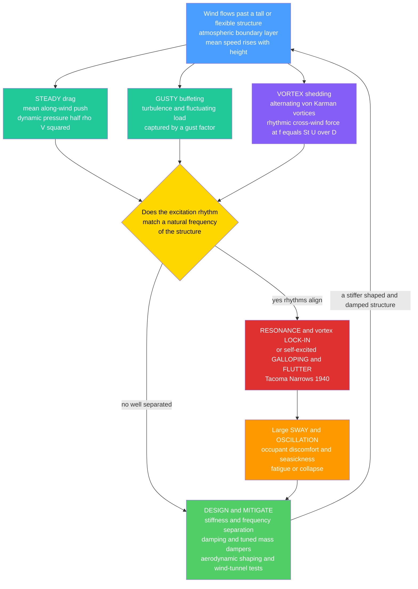

# 🌪️ Structural Dynamics and Wind Engineering

> [!abstract] TL;DR
> A **static** load just sits on a structure; **wind and earthquakes are dynamic** — they push, let go, and push again, and because a structure has **mass**, it has its own natural **frequencies** and **mode shapes** at which it likes to sway. When the *rhythm* of the loading matches a natural frequency, **resonance** amplifies the response far beyond what the raw force would suggest. **Structural dynamics** is the framework — the equation of motion $m\ddot{x}+c\dot{x}+kx=F(t)$, natural frequency $\omega_n=\sqrt{k/m}$, **damping** $\zeta$, modal analysis, and the **dynamic amplification** that peaks at $\approx 1/(2\zeta)$ near resonance — shared by both seismic and wind response. **Wind engineering** applies it to the air: the **atmospheric boundary layer** (wind rising with height), converting speed to pressure via $q=\tfrac{1}{2}\rho V^2$, the **mean drag plus gusty buffeting** (turbulence, captured by a **gust factor**), and three dynamic dangers — **vortex shedding** (alternating von Kármán vortices at the **Strouhal frequency** $f_s=St\,U/D$ that make chimneys and cables hum and **lock in** to resonance), **galloping** (self-excited across-wind instability of iced cables), and **flutter** (coupled aeroelastic instability). The infamous lesson is the **Tacoma Narrows Bridge** — "Galloping Gertie" — which in 1940 twisted itself apart in a *moderate* wind because its own twisting shed vortices that pushed it to twist **more**, a runaway feedback dance. For tall towers the governing case is often not gravity or earthquake but the **wind making the top sway** enough to make occupants seasick — mitigated by **stiffness, damping, tuned mass dampers, and aerodynamic shaping**. Structural dynamics and wind engineering sit at the crossroads of **structures, fluid dynamics, and vibration**.

---

## Intuition

**Analogy first.** Think about pushing a child on a swing. If you shove randomly, not much happens. But if you time each push to the swing's **natural rhythm** — push, let it come back, push again — the swing climbs higher and higher on tiny, perfectly-timed nudges. That is **resonance**: a small force applied *in step* with a system's natural frequency builds up enormous motion. A static load is like a heavy sack sitting on the swing — it just pulls it down and stops. Wind and earthquakes are the *pushing*: they are **dynamic**, and if their rhythm matches the structure's own sway, the response amplifies dramatically.

Now picture wind flowing past a tall chimney or a bridge deck. The air does not slide by smoothly; it peels off alternately from each side, spinning off a train of **vortices** — first one side, then the other — like a flag rippling. Each shed vortex gives the structure a little sideways shove, first left, then right, at a steady beat. If that beat happens to match the structure's natural sway frequency, you have a swing being pushed in perfect time — and the chimney **hums and vibrates**, sometimes violently. The most infamous case is the **Tacoma Narrows Bridge**, "Galloping Gertie," which in November 1940 twisted itself apart in a wind of only about 40 mph — *not* because the wind was strong, but because the bridge and the wind got into a deadly feedback dance: the deck's own twisting motion changed how the air flowed and shed vortices, which pushed it to twist **even more**. That runaway coupling between a structure's motion and the air's forces — **aeroelastic instability** — is the darkest lesson in the field, and every long-span bridge is now checked against it. The startling takeaway: for tall and flexible structures, it is frequently the **dynamics of the wind**, not the sheer strength of a static load, that governs whether the structure survives — and whether the people inside can stand to be there.

---

## How It Works

### Core Mechanics

1. **A structure has mass, so it moves in time.** Static analysis assumes loads sit still and the structure reaches one deflected shape. But under a **time-varying** load, mass gives the structure **inertia**: it accelerates, overshoots, and oscillates. The governing balance is the **equation of motion**, $m\ddot{x}+c\dot{x}+kx=F(t)$ — inertia ($m\ddot{x}$) plus damping ($c\dot{x}$) plus stiffness ($kx$) equals the applied force.

2. **Natural frequency and mode shapes.** Left alone (free vibration), the structure oscillates at its **natural frequency** $\omega_n=\sqrt{k/m}$ (in Hz, $f_n=\omega_n/2\pi$) — set by the ratio of **stiffness to mass**, not by the load. A real structure has *many* natural frequencies, each with its own deflected **mode shape** (first sway mode, second mode, torsional mode). Tall, flexible structures have **low** natural frequencies (long periods) — precisely the range where wind energy lives.

3. **Damping bleeds energy away.** The **damping ratio** $\zeta=c/(2\sqrt{km})$ measures how fast free vibration dies out. Structures are lightly damped — steel buildings $\zeta\approx 1\%$, concrete $\approx 2$–$5\%$ — which is *why* they are vulnerable to resonance: with little damping, energy accumulates over many cycles instead of dissipating.

4. **Forced response and dynamic amplification.** Under a harmonic force at frequency $f$, the steady-state response is the static deflection times a **dynamic amplification factor (DAF)**, $\text{DAF}=1/\sqrt{(1-r^2)^2+(2\zeta r)^2}$ where $r=f/f_n$. Far below resonance ($r\ll 1$) the response is quasi-**static** (DAF $\to 1$); at resonance ($r\approx 1$) it peaks at $\approx 1/(2\zeta)$ — for $\zeta=1\%$ that is a **fiftyfold** amplification; far above ($r\gg 1$) the mass cannot keep up and the response fades.

5. **Wind speed becomes pressure.** In the **atmospheric boundary layer**, mean wind speed rises with height (roughly a power or log law) as friction with the ground fades. Speed converts to **dynamic pressure** $q=\tfrac{1}{2}\rho V^2$; the load on a surface is $p=C_p\,q$ with a **pressure coefficient** $C_p$ from the body's shape, and the drag force is $F_D=\tfrac{1}{2}\rho V^2 C_D A$.

6. **Mean plus fluctuating (gust) loading.** Real wind is turbulent: a steady **mean** part plus rapid **gusts**. The **gust-factor** approach multiplies the mean response by a factor $G>1$ to capture the peak, combining a slowly-varying **background** component and a **resonant** component that grows when gust energy hits the structure's natural frequency. This is the **along-wind** (buffeting) response.

7. **Vortex shedding — the rhythmic cross-wind force.** As wind separates around a bluff body, it sheds alternating **von Kármán vortices** at the **Strouhal frequency** $f_s=St\,U/D$ ($St\approx 0.2$ for a cylinder). Each shedding cycle applies an **across-wind** force. When $f_s$ approaches the natural frequency $f_n$ — at the **critical wind speed** $U_{cr}=f_n D/St$ — the structure resonates, and worse, the shedding **locks in** to the structure's motion over a *band* of wind speeds (self-synchronization). Chimneys, stacks, cables, and lampposts vibrate this way.

8. **Galloping and flutter — self-excited instabilities.** **Galloping** is a single-degree instability of non-circular sections (iced power lines, some cables): the aerodynamic force *feeds* the motion, giving **negative aerodynamic damping** (Den Hartog criterion). **Flutter** is a *coupled* aeroelastic instability (bending + torsion) where the deck's motion and the airflow reinforce each other above a **critical flutter speed** — the Tacoma Narrows mechanism, now a mandatory check for long-span bridges.

9. **Design and mitigation.** Push the natural frequency **away** from the excitation (stiffness, mass), add **damping** (inherent plus supplemental dampers), install a **tuned mass damper** (a large tuned pendulum/mass that sways out of phase to cancel motion — Taipei 101, Citicorp), **shape** the body to disrupt vortices (tapering, corner rounding, helical strakes, openings), and **wind-tunnel test** scale models. Finally, verify **occupant comfort** — peak accelerations that make people ill often govern tall-building design more than strength does.

### Flow / Architecture



---

## Key Concepts

### Secondary Level

- **Static vs dynamic loads.** A static load (a parked truck, the weight of a floor) just sits there. A **dynamic** load (wind gusts, an earthquake) changes with time — it pushes, releases, and pushes again — and a structure with mass **responds by moving**.
- **Resonance is timing, not force.** Like pushing a swing in rhythm, a small force applied *in step* with a structure's natural sway builds up huge motion. That is the single most important idea in the field.
- **Tacoma Narrows — Galloping Gertie.** In 1940 a bridge tore itself apart in a moderate wind because its own twisting changed the airflow, which pushed it to twist even more — a runaway feedback loop, not brute wind force.
- **Wind makes things hum and sway.** Air peels off a chimney or cable in an alternating pattern of spinning vortices, shoving it side to side at a steady beat; if that beat matches the structure's sway, it vibrates.
- **Damping calms it down.** Damping is what makes a plucked string go quiet — energy leaks away each cycle. Structures have very little of it, so engineers **add** dampers, including a giant tuned weight (a **tuned mass damper**) that swings the opposite way to cancel the sway.
- **Comfort can matter more than strength.** A skyscraper may be perfectly strong yet sway enough at the top to make people **seasick** — so how much it *moves*, not whether it breaks, often decides the design.

### Undergraduate Level

- **Equation of motion (SDOF).** $m\ddot{x}+c\dot{x}+kx=F(t)$; **natural frequency** $\omega_n=\sqrt{k/m}$, $f_n=\omega_n/2\pi$, natural period $T=1/f_n$; **damping ratio** $\zeta=c/(2\sqrt{km})=c/c_{cr}$. Underdamped systems ($\zeta<1$) oscillate at the damped frequency $\omega_d=\omega_n\sqrt{1-\zeta^2}$.
- **Free vibration and log decrement.** Free response decays as $e^{-\zeta\omega_n t}$; the **logarithmic decrement** $\delta=2\pi\zeta/\sqrt{1-\zeta^2}\approx 2\pi\zeta$ links measured decay to $\zeta$. Typical: steel $\zeta\approx 1\%$, reinforced concrete $\approx 2$–$5\%$.
- **Forced harmonic response and DAF.** Steady-state amplitude equals static deflection times $\text{DAF}=1/\sqrt{(1-r^2)^2+(2\zeta r)^2}$, $r=f/f_n$; the peak $\approx 1/(2\zeta)$ occurs near $r=1$ — **resonance**. Phase lags by $90^\circ$ at resonance.
- **Wind pressure and drag.** Dynamic pressure $q=\tfrac{1}{2}\rho V^2$ ($\rho\approx 1.25\ \text{kg/m}^3$); surface pressure $p=C_p q$; drag force $F_D=\tfrac{1}{2}\rho V^2 C_D A$. Wind speed grows with height by a **power law** $V(z)=V_{ref}(z/z_{ref})^\alpha$ or a **log law** — the **atmospheric boundary layer**.
- **Gust factor.** Peak along-wind response $=$ mean response $\times\ G$; $G$ blends turbulence intensity, a **background** (quasi-static) part, and a **resonant** part that spikes when gust energy meets $f_n$.
- **Strouhal number and vortex shedding.** $St=f_s D/U\approx 0.2$ for a circular cylinder; shedding frequency $f_s=St\,U/D$; the **critical (lock-in) wind speed** where $f_s=f_n$ is $U_{cr}=f_n D/St$. Cross-wind vortex-induced vibration (VIV) peaks there.
- **Reduced velocity and Scruton number.** Non-dimensional wind speed $U_r=U/(f_n D)$; lock-in near $U_r\approx 1/St\approx 5$. The **Scruton number** $Sc=2m\,\delta/(\rho D^2)$ (mass-damping parameter) governs VIV amplitude — **high Sc** (heavy, well-damped) suppresses it, **low Sc** (light, lightly-damped) invites large vibration.
- **Modal idea.** A continuous structure is reduced to a set of SDOF **modes** (generalized mass, stiffness, damping per mode); wind excites mainly the **first sway mode** and, for bridges, torsional modes.

### Graduate Level

- **Multi-degree-of-freedom and modal decomposition.** $M\ddot{\mathbf{x}}+C\dot{\mathbf{x}}+K\mathbf{x}=\mathbf{F}(t)$; solve the eigenproblem $K\phi_i=\omega_i^2 M\phi_i$ for mode shapes $\phi_i$; with classical (**Rayleigh**) damping $C=\alpha M+\beta K$ the modes decouple into independent SDOF equations in generalized coordinates.
- **Spectral / random-vibration wind analysis.** Turbulence is a random process described by the **Davenport / Kaimal velocity spectrum**. The response spectrum is $S_x(f)=|H(f)|^2\,|\chi(f)|^2\,S_F(f)$ — the wind-force spectrum filtered by the **aerodynamic admittance** $\chi$ (how gusts correlate over the structure) and the **mechanical admittance** $|H(f)|^2$ (the DAF squared). The variance splits into **background** and **resonant** areas; peak factor $g$ gives the design peak. This is the **Alan Davenport gust-loading-factor** method behind modern codes.
- **Vortex-induced vibration and lock-in.** Near resonance the shedding synchronizes to the body's motion over a wind-speed band; modeled by **wake-oscillator** equations (Hartlen–Currie / van der Pol coupling) or by motion-dependent **aerodynamic damping**. Amplitude is controlled by the Scruton number; response can be self-limiting (unlike galloping/flutter).
- **Galloping — Den Hartog criterion.** A section is prone to galloping when $\dfrac{dC_L}{d\alpha}+C_D<0$ (negative slope of across-wind force with angle of attack), giving **negative aerodynamic damping**; onset when total damping crosses zero. Classic for D-shaped iced conductors and rectangular sections.
- **Flutter — coupled aeroelasticity.** Bending and torsion couple through motion-dependent aerodynamic forces expressed via **Scanlan flutter derivatives** $H_i^*, A_i^*$ (bridge decks) or **Theodorsen theory** (thin airfoils). Above the **critical flutter speed** $U_f$ the coupled system has negative net damping and diverges — the Tacoma Narrows torsional flutter. Related divergence and torsional-divergence checks apply to flexible decks.
- **Aerodynamic damping and self-excited forces.** Total damping $=$ structural $+$ aerodynamic; the *sign* of the aerodynamic part decides stability. Positive (buffeting, most bluff bodies) limits response; negative (galloping, flutter) makes it grow without bound.
- **Tuned mass damper (TMD) theory.** A secondary mass $m_2$ on a spring/dashpot tuned near $f_n$. **Den Hartog optimum** for mass ratio $\mu=m_2/m_1$: optimal frequency ratio $f_{opt}=1/(1+\mu)$ and optimal damper damping $\zeta_{opt}=\sqrt{3\mu/[8(1+\mu)]}$. It splits the single resonance peak into two lower peaks, dramatically cutting the response — used in Taipei 101 (a $\sim$660-tonne pendulum sphere) and Citicorp Center.
- **Wind-tunnel modeling and similarity.** Boundary-layer wind tunnels reproduce the mean profile, turbulence, and length scales; techniques include the **high-frequency force balance (HFFB)**, **pressure-tap** models, and **aeroelastic** models. Similarity requires matching **reduced frequency** (Strouhal), density and mass-damping ratios; **Reynolds number** mismatch is handled by roughening or by testing sharp-edged (Reynolds-insensitive) bodies.

---

## Python Demo

```python
# Structural dynamics and wind engineering.
#   (a) VORTEX-SHEDDING LOCK-IN  -- the Strouhal line f_s = St*U/D rises with
#       wind speed and CROSSES the structure's natural frequency f_n. Where they
#       meet is the CRITICAL (lock-in) wind speed U_cr = f_n*D/St; a band around
#       it is the resonance / lock-in zone where a chimney or cable vibrates hard.
#   (b) DYNAMIC AMPLIFICATION vs DAMPING  -- the steady-state response of a tall
#       building (a damped SDOF oscillator) to harmonic gust/vortex forcing. The
#       amplification (DAF, the "gust factor" of the resonant part) PEAKS at
#       resonance at ~1/(2*zeta); more DAMPING slashes that peak and limits sway.
import numpy as np
import matplotlib.pyplot as plt

# ----------------------------------------------------------------------
# Example structure: a tall steel chimney / slender tower
# ----------------------------------------------------------------------
D    = 6.0          # across-wind width / diameter, m
f_n  = 0.40         # first-mode natural frequency, Hz
St   = 0.20         # Strouhal number (circular cylinder, subcritical)
U_cr = f_n * D / St # critical lock-in wind speed  = f_n*D/St
print("(a) VORTEX SHEDDING / LOCK-IN")
print(f"    natural frequency f_n = {f_n:.2f} Hz,  D = {D:.1f} m,  St = {St:.2f}")
print(f"    critical (lock-in) wind speed U_cr = f_n*D/St = {U_cr:.1f} m/s")
print(f"    reduced velocity at lock-in U/(f_n*D) = {U_cr/(f_n*D):.1f}  (= 1/St)")

# ----------------------------------------------------------------------
# (a) Strouhal line vs wind speed, crossing the natural frequency
# ----------------------------------------------------------------------
U   = np.linspace(0.0, 30.0, 400)     # wind speed, m/s
f_s = St * U / D                      # vortex-shedding frequency, Hz
lock_band = 0.12                      # +/-12% lock-in band around U_cr

# ----------------------------------------------------------------------
# (b) Dynamic amplification factor for several damping ratios
# ----------------------------------------------------------------------
r     = np.linspace(0.0, 2.5, 600)    # frequency ratio  f_forcing / f_n
zetas = [0.005, 0.01, 0.02, 0.05]     # 0.5%, 1%, 2%, 5% damping
colors = ["firebrick", "darkorange", "seagreen", "royalblue"]

def DAF(r, z):                        # steady-state harmonic amplification
    return 1.0 / np.sqrt((1.0 - r**2)**2 + (2.0 * z * r)**2)

print("\n(b) DYNAMIC AMPLIFICATION AT RESONANCE  (peak ~ 1/(2*zeta))")
for z in zetas:
    print(f"    zeta = {z*100:4.1f}%  ->  peak DAF ~ {1.0/(2*z):5.1f}")

# ----------------------------------------------------------------------
# PLOTS
# ----------------------------------------------------------------------
fig, (axA, axB) = plt.subplots(1, 2, figsize=(14, 5.6))

# ---- (a) lock-in diagram ----
axA.plot(U, f_s, color="purple", lw=2.6,
         label="vortex-shedding freq  f_s = St*U/D")
axA.axhline(f_n, color="royalblue", lw=2.2, ls="--",
            label=f"natural frequency f_n = {f_n:.2f} Hz")
axA.axvspan(U_cr*(1-lock_band), U_cr*(1+lock_band),
            color="firebrick", alpha=0.18, label="lock-in / resonance band")
axA.axvline(U_cr, color="firebrick", lw=1.4, ls=":")
axA.scatter([U_cr], [f_n], color="gold", edgecolor="k", s=110, zorder=6)
axA.annotate(f"LOCK-IN\nU_cr = {U_cr:.0f} m/s",
             xy=(U_cr, f_n), xytext=(U_cr+3.5, f_n*0.55),
             fontsize=9, color="firebrick",
             arrowprops=dict(arrowstyle="->", color="firebrick"))
axA.text(2, 0.85, "shedding beat\nmatches sway\n=> big vibration",
         fontsize=8, color="purple")
axA.set_xlabel("Wind speed  U  (m/s)")
axA.set_ylabel("Frequency  (Hz)")
axA.set_title("(a) Vortex shedding crosses f_n: lock-in resonance")
axA.set_xlim(0, 30); axA.set_ylim(0, 1.0)
axA.legend(fontsize=8, loc="upper left"); axA.grid(alpha=0.3)

# ---- (b) dynamic amplification vs damping ----
for z, c in zip(zetas, colors):
    axB.plot(r, DAF(r, z), color=c, lw=2.2, label=f"zeta = {z*100:.1f}%")
axB.axvline(1.0, color="grey", lw=1.0, ls=":")
axB.text(1.02, 40, "resonance\nr = 1", fontsize=8, color="grey")
axB.annotate("less damping\n=> taller peak\n=> more sway",
             xy=(1.0, DAF(1.0, 0.005)), xytext=(1.25, 60),
             fontsize=8, color="firebrick",
             arrowprops=dict(arrowstyle="->", color="firebrick"))
axB.text(0.05, 3.0, "quasi-static\nr << 1", fontsize=8, color="black")
axB.text(2.05, 3.0, "inertia can't\nkeep up  r >> 1", fontsize=8, color="black")
axB.set_xlabel("Frequency ratio  r = f_forcing / f_n")
axB.set_ylabel("Dynamic amplification factor  (DAF)")
axB.set_title("(b) Resonant amplification and the role of damping")
axB.set_xlim(0, 2.5); axB.set_ylim(0, 105)
axB.legend(fontsize=9, loc="upper right", title="damping ratio")
axB.grid(alpha=0.3)

plt.tight_layout()
plt.savefig("structural_dynamics_wind.png", dpi=120)
plt.show()
```

**What it shows.** Panel (a) is the **lock-in diagram**: the vortex-shedding frequency $f_s=St\,U/D$ climbs as a straight line with wind speed, and where it **crosses** the horizontal natural-frequency line the shedding beat matches the structure's sway — the **critical wind speed** $U_{cr}=f_nD/St\approx 12$ m/s for this chimney. Around that crossing lies the shaded **lock-in band**, the range of wind speeds where the shedding self-synchronizes to the motion and the cross-wind vibration is largest; outside it the two rhythms are mismatched and the structure is quiet. Panel (b) is the **resonance curve** that governs how badly it shakes: the dynamic amplification factor for harmonic (gust or vortex) forcing spikes at $r=f/f_n=1$, and the peak height is essentially $1/(2\zeta)$ — a **200×** magnification at $\zeta=0.5\%$ collapsing to a mild **10×** at $\zeta=5\%$. That single family of curves is why the entire mitigation toolkit — inherent damping, supplemental dampers, and **tuned mass dampers** — is about *raising* $\zeta$ (or shifting $f_n$ off the excitation), and why light, flexible, lightly-damped structures are the ones that sway.

---

## Real-World Applications

> **Tacoma Narrows Bridge (1940) — flutter.** The founding disaster of the field. In a $\sim$40 mph wind, the slender, solid-plate-girder deck entered a **torsional flutter**: its own twisting motion generated aerodynamic forces that fed *more* twisting (negative aerodynamic damping via coupled vortex shedding), and the amplitude grew until the deck failed. Every long-span bridge deck is now **wind-tunnel tested** for flutter and vortex-induced vibration, and decks are shaped (streamlined box sections, edge fairings, open grating) to raise the critical flutter speed.

> **Taipei 101 — tuned mass damper.** The 508 m tower carries a $\sim$660-tonne steel **pendulum sphere** near the top, tuned to the building's first sway mode. When wind pushes the tower one way, the pendulum swings the other and its dampers bleed off energy — cutting peak accelerations to keep occupants comfortable (and, in typhoons, protecting the structure). It is the visible, public face of Den Hartog TMD theory.

> **Citicorp Center, New York — TMD and the LeMessurier retrofit.** One of the first buildings with a **tuned mass damper** (a 400-tonne block on oil bearings) to control wind sway. It is also famous for engineer William LeMessurier's discovery that quartering winds on the bolted (rather than welded) joints made the tower vulnerable — a landmark case in structural ethics and dynamic wind loading combined.

> **Chimneys, stacks, and steel cables — vortex-induced vibration.** Tall industrial stacks and slender masts vibrate cross-wind when $f_s$ nears $f_n$. The classic fix is **helical strakes** — spiral fins near the top that break the spanwise coherence of vortex shedding so no clean rhythmic force develops. Overhead **power-line conductors** gallop when ice changes their cross-section (Den Hartog instability), controlled with **Stockbridge dampers** and spacers; stay cables on cable-stayed bridges use dampers and surface treatments against rain-wind vibration.

> **Supertall towers — aerodynamic shaping.** The **Burj Khalifa** uses a tapering, spiraling **setback** geometry that "confuses the wind," disrupting organized vortex shedding so no single critical wind speed dominates. Modern supertalls combine **corner modifications** (chamfers, rounding), **tapering**, and through-building **openings** with dampers — because for these buildings the wind-driven **serviceability** (sway acceleration, occupant comfort) governs the design far more than strength or gravity.

---

## Common Pitfalls

- **Treating wind as a static pressure only.** Applying a single equivalent static wind load and stopping there misses **resonance, vortex shedding, and flutter** entirely. Flexible, low-frequency structures must be analyzed **dynamically**; the static answer can be off by an order of magnitude near resonance.
- **Checking only the along-wind direction.** Vortex shedding drives an **across-wind** (crosswind) response that is often *larger* than the along-wind drag for slender towers, stacks, and chimneys. Designing for drag alone and ignoring the cross-wind lock-in is a classic and dangerous omission.
- **Letting the natural frequency coincide with the excitation.** If $f_n$ lands on the shedding frequency at a common wind speed (or on floor/machinery/pedestrian rhythms), resonance is guaranteed. The design goal is **frequency separation** — move $f_n$ away, or ensure the critical wind speed is above the site's realistic winds.
- **Underestimating how low the damping is.** Modern light, high-strength structures have very small $\zeta$ (sometimes well under $1\%$), so the resonant peak $1/(2\zeta)$ is enormous. Assuming comfortable textbook damping when the real value is tiny badly under-predicts sway — measure or bound it conservatively, and add dampers.
- **Designing for strength but not comfort.** A tower can be perfectly safe yet sway enough at the top to induce **motion sickness**. Peak-acceleration **serviceability** limits (occupant comfort) frequently govern tall-building design; forgetting them yields a strong building nobody wants to occupy.
- **Skipping the flutter and galloping checks.** Long-span bridges, iced cables, and non-circular sections can go **unstable** (unbounded, not self-limiting) above a critical wind speed. Unlike VIV, these self-excited instabilities do not saturate — the Tacoma lesson. They require dedicated aeroelastic checks (Den Hartog criterion, flutter derivatives, wind-tunnel tests).
- **Detuned or unmaintained tuned mass dampers.** A TMD only works when tuned to the **as-built** natural frequency; construction changes, mass changes, or drift in the damper detune it and destroy its effectiveness. TMDs need commissioning and periodic re-tuning/maintenance.
- **Ignoring aeroelastic coupling — assuming loads are motion-independent.** Buffeting theory treats wind forces as external, but galloping and flutter arise precisely because the forces **depend on the structure's motion**. Assuming the load is fixed regardless of how the structure moves hides the very feedback that causes instability.
- **Wind-tunnel scaling errors.** Getting the mean profile right but mismatching **turbulence, mass-damping ratio, or reduced frequency (Strouhal)** — or ignoring **Reynolds-number** effects on rounded bodies — yields misleading model results. Similarity in the governing non-dimensional groups, not just geometric scaling, is essential.

---

## Related Concepts

- [[Mechanical_Vibrations]] *(Mechanical_Engineering)* — the mechanical-engineering home of the same SDOF/MDOF machinery: equation of motion, natural frequency, damping ratio, free/forced vibration, and the resonance/dynamic-amplification curve that this note applies to wind and seismic loading.
- [[Oscillations_and_SHM]] *(Physics)* — the physics core: the damped, driven harmonic oscillator whose steady-state amplitude peaks at resonance is *exactly* the mathematics of a swaying building responding to gusts and vortex forcing.
- [[Aeroelasticity_and_Flutter]] *(Aerospace_Engineering)* — the aerospace treatment of the **same flutter instability** that destroyed Tacoma Narrows: coupled bending-torsion, flutter derivatives/Theodorsen theory, and critical flutter speed, here transferred from wings to bridge decks and towers.
- [[Structural_Dynamics_and_Loads]] *(Aerospace_Engineering)* — the parallel structural-dynamics framework for airframes (modal analysis, gust response, dynamic loads); the shared modal/spectral methods used for both aircraft gusts and building wind buffeting.
- [[Vorticity_and_Circulation]] *(Fluid_Dynamics)* — the fluid-mechanics origin of the **von Kármán vortex street**: the alternating shed vortices whose Strouhal-frequency circulation produces the rhythmic cross-wind force that drives vortex-induced vibration and lock-in.
- [[Flow_Separation_and_Drag_Crisis]] *(Fluid_Dynamics)* — why bluff bodies shed vortices at all: boundary-layer **separation** behind a cylinder or deck creates the unsteady wake; the Reynolds-dependent separation behavior (drag crisis) sets $St$, $C_D$, and the character of the shedding.
- [[Balancing_and_Rotordynamics]] *(Mechanical_Engineering)* — the rotating-machinery analogue of vortex lock-in: **critical speeds** are resonances a shaft passes through, mitigated (like buildings) by frequency separation and damping — the same resonance logic in a different setting.

*Sibling notes in the Civil Engineering vault (referenced in prose, to be linked when present): **Earthquake Engineering and Seismic Design** (the seismic twin — dynamics of ground shaking sharing the identical equation of motion, modal analysis, and damping framework), **Bridge Engineering** (where flutter and vortex-induced vibration of long-span decks are a governing check), **Structural Stability and Buckling** (the static-instability counterpart to dynamic/aeroelastic instability, and the P-delta interaction under lateral sway), **Structural Loads and Load Paths** (where wind takes its place among the load cases and how lateral loads travel to the foundation), and **Sustainable and Smart Infrastructure** (active/semi-active dampers and structural health monitoring of wind-excited towers).*

---

## Review Questions

1. **(Secondary)** Explain, using the image of pushing a child on a swing, why the Tacoma Narrows Bridge tore apart in a *moderate* wind rather than needing a hurricane. In your answer, use the words **rhythm**, **resonance**, and **feedback**, and say why simply making the bridge out of stronger steel would not, by itself, have prevented the failure.
2. **(Undergraduate)** A steel chimney has diameter $D=4$ m, natural frequency $f_n=0.5$ Hz, and Strouhal number $St=0.2$. (a) Find the **critical wind speed** $U_{cr}$ at which vortex shedding resonates with the chimney. (b) If the damping ratio is $\zeta=0.008$, estimate the **dynamic amplification factor** at resonance and comment on the vibration risk. (c) Name two physically distinct ways to reduce the response — one that changes the **aerodynamics** and one that changes the **structural dynamics** — and explain the mechanism of each.
3. **(Graduate)** Contrast **vortex-induced vibration**, **galloping**, and **flutter** as across-wind phenomena. Which are self-limiting and which are potentially divergent, and why? Frame your answer in terms of the **sign and motion-dependence of aerodynamic damping** (Scruton number for VIV, the Den Hartog $dC_L/d\alpha+C_D<0$ criterion for galloping, and coupled flutter derivatives for flutter), and explain why a **tuned mass damper** helps against a resonant buffeting/VIV response but cannot, on its own, cure a flutter instability.

---

## Sources

- Chopra, A. K. — *Dynamics of Structures: Theory and Applications to Earthquake Engineering* (Pearson) — the standard text on structural dynamics: equation of motion, SDOF/MDOF, damping, modal analysis, and dynamic amplification.
- Simiu, E. & Scanlan, R. H. — *Wind Effects on Structures: Fundamentals and Applications to Design* (Wiley) — the definitive reference on the atmospheric boundary layer, gust loading, vortex shedding, galloping, and bridge flutter (flutter derivatives).
- Holmes, J. D. — *Wind Loading of Structures* (CRC Press / Taylor & Francis) — modern treatment of wind loads, the gust-factor and spectral methods, and dynamic response of buildings and towers.
- ASCE 7 — *Minimum Design Loads and Associated Criteria for Buildings and Other Structures* (American Society of Civil Engineers) — the code wind-load provisions: velocity pressures, gust-effect factors, and across-wind/vortex-shedding checks used in practice.
- Den Hartog, J. P. — *Mechanical Vibrations* (Dover) — classic source for the tuned-mass-damper optimum tuning and the galloping (Den Hartog) instability criterion.

---

#civil-engineering #structural-dynamics #wind-engineering #vortex-shedding #flutter
