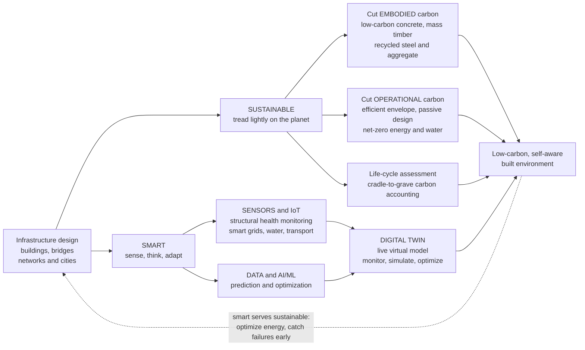

# 🏙️ Sustainable and Smart Infrastructure

> [!abstract] TL;DR
> For a century, civil engineering answered two questions — *will it stand?* and *does it work?* The twenty-first century adds two more: **what does it cost the PLANET, and can it THINK?** The first defines **sustainable infrastructure**: because the built environment drives a huge share of global energy use and carbon emissions (buildings and construction are near **40% of energy-related CO₂**, cement alone about **8%**), engineers now count not just dollars but **carbon** — the **embodied carbon** locked into materials (cement, steel, transport) plus the **operational carbon** burned over decades of heating, cooling and lighting — and use **life-cycle assessment (LCA)** to slash both, with **low-carbon concrete, mass timber, recycled steel, net-zero-energy design, and green stormwater**. The second defines **smart infrastructure**: embedding **sensors, connectivity, data and intelligence** so an asset monitors its own health (**structural health monitoring**), optimizes its own operation (adaptive traffic signals, self-balancing grids, leak-detecting water networks, learning buildings) and feeds a live **digital twin**. Sustainable infrastructure treads lightly on the earth; smart infrastructure senses and adapts — and increasingly the smart serves the sustainable, using data to cut energy and catch failures early. Together these twin frontiers redefine the discipline for a warming, connected world.

---

## Intuition

**Analogy:** Imagine two questions a bridge engineer of 1950 never had to ask. The first is asked by an accountant who bills in *carbon* instead of money: every bag of cement, every tonne of steel, every truck to site arrives with an invoice denominated in CO₂ — the **embodied carbon** — and then the finished building keeps running up a *monthly* carbon bill for sixty years as it burns energy to stay warm, cool and lit — the **operational carbon**. Sustainable engineering is what happens when you finally read both invoices and design to shrink the lifetime total, not just the sticker price. The shocking fact behind it is that this ledger is enormous: the making and running of buildings and infrastructure is one of the single biggest sources of humanity's greenhouse gases, so *how* civil engineers build is not a niche concern but a lever on the whole climate problem.

The second question comes from a different visitor — a doctor who wants the structure to have a *nervous system*. Wire it with sensors, give it connectivity and a data feed, and the bridge can report its own strains, the grid can rebalance itself, the traffic network can retime its own signals, and the building can learn when its rooms are empty and stop cooling them. All of it flows into a **digital twin** — a living virtual replica that monitors, simulates and optimizes the real thing. Sustainable infrastructure treads lightly on the earth; smart infrastructure senses and adapts. The deep move of the modern era is that these two frontiers **converge**: the sensors and intelligence of the smart building are exactly what let it hit its net-zero carbon target, and the low-carbon material is exactly what the digital twin was built to help you choose. This note is about the built environment learning to weigh its own footprint and feel its own pulse.

---

## How It Works

### Core Mechanics

1. **Count carbon, not just cost.** Every design decision now carries a carbon price tag. The tool that reads it is **life-cycle assessment (LCA)** — a cradle-to-grave accounting of environmental impact across raw-material extraction, manufacture, construction, decades of operation, and end-of-life demolition or reuse. The headline metric is **global-warming potential** in kgCO₂-equivalent.

2. **Split the footprint in two.** **Embodied carbon** is emitted *up front*, one-time, in making and delivering the materials and erecting the structure — dominated by **cement** (calcining limestone releases CO₂ chemically, before any fuel is burned) and **steel** (blast-furnace reduction). **Operational carbon** accrues *year after year* from heating, cooling, ventilation, lighting and water. Historically operational dwarfed embodied — so codes chased efficiency.

3. **The efficiency trap that spotlights materials.** As buildings become operationally efficient (better envelopes, heat pumps, on-site renewables, eventually net-zero), the operational bill collapses — and **embodied carbon comes to dominate** the lifetime total. You cannot efficiency-away a slab of concrete poured on day one. This is why the frontier has shifted to **low-carbon materials**: supplementary cementitious materials and **low-carbon concrete**, **mass timber** (which *stores* biogenic carbon), **recycled steel and aggregate**, and a **circular economy** of reuse and design-for-disassembly.

4. **Design the envelope and the systems.** Operational carbon is cut by **passive design** (orientation, shading, thermal mass, daylight, natural ventilation), a high-performance **envelope** (insulation, airtightness, glazing), efficient **HVAC/lighting**, and on-site renewables, driving toward **net-zero-energy buildings** — often verified by green-rating systems like **LEED** or **BREEAM**. **Water** is handled the same way: efficiency plus **low-impact development** — **permeable pavement**, **green roofs**, bioswales — that manage stormwater where it falls and cut runoff pollution.

5. **Give the asset a nervous system.** **Smart infrastructure** instruments the physical world: **structural health monitoring (SHM)** puts strain gauges, accelerometers and fiber-optic sensors on bridges and buildings to track condition and detect damage; **smart grids** and **smart water networks** self-monitor and localize leaks; **intelligent transportation systems (ITS)** run adaptive signals and talk to connected/autonomous vehicles; **smart buildings** tune HVAC and lighting to occupancy.

6. **Close the loop with data and a twin.** Sensor streams (the **IoT**) feed **AI/ML** models for prediction and optimization, and the whole is unified in a **digital twin** — a live, data-driven virtual model of an asset or city, kept in sync through its life via **BIM (Building Information Modeling)**, used to monitor, simulate what-ifs, and optimize operation. The convergence: **smart tech serving sustainability and resilience** — optimizing energy in real time and catching failures before they become disasters.

### Flow / Architecture



---

## Key Concepts

### Secondary Level

- **Buildings are a huge part of the climate problem.** Making and running buildings and infrastructure produces a large share of the world's greenhouse gases — so *how* we build matters enormously. Concrete and steel alone are among the biggest single sources of CO₂ on the planet.
- **Two kinds of carbon.** Some pollution happens **once, up front**, in making the materials — the **embodied carbon** of the concrete and steel. Some happens **every year for decades**, from heating, cooling and lighting the building — the **operational carbon**. Sustainable design shrinks *both*.
- **Greener materials.** Engineers now choose materials that cost the planet less: **low-carbon concrete**, **timber** (wood actually stores carbon that trees pulled from the air), and **recycled** steel and rubble — and they try to **reuse** buildings instead of demolishing them.
- **Smart buildings and cities.** Put **sensors** into a bridge, a road or a building and it can watch itself: a bridge can feel its own cracks, traffic lights can adjust to real traffic, and a building can stop cooling rooms nobody is in — saving energy automatically.
- **The digital twin.** Engineers build a **living computer model** of a real building or city, fed by its sensors, so they can watch it, test ideas on the copy, and run the real thing better and safer.
- **Treading lightly and thinking.** The future of civil engineering is infrastructure that harms the planet as little as possible **and** is smart enough to sense and adapt — helping build cleaner, safer, more livable cities.

### Undergraduate Level

- **Life-cycle assessment (LCA) and the two carbons.** Lifetime footprint $C_{total} = C_{embodied} + C_{operational}$, where operational carbon accumulates as $C_{op}(t)=O\cdot t$ over a service life $t$ (years) at annual intensity $O$ (kgCO₂e·m⁻²·yr⁻¹). Two designs *cross over* at the **carbon-payback** time $t^{\*}=\dfrac{E_2-E_1}{O_1-O_2}$: a greener design that costs *more* embodied carbon ($E_2>E_1$) but *less* operational ($O_2<O_1$) pays back its upfront penalty after $t^{\*}$ and wins thereafter.
- **Why embodied comes to dominate.** As $O\to 0$ (net-zero operation), $C_{total}\to E$, so the **embodied fraction** $E/C_{total}\to 1$. In an inefficient building embodied may be ~10% of lifetime carbon; in a highly efficient one it can exceed 40–50%, which is why material choice becomes decisive.
- **Embodied-carbon intensity of materials.** Reported as $kgCO_2e$ per kg or per structural function. **Cement** is the villain because $CaCO_3 \to CaO + CO_2$ releases CO₂ *chemically* (process emissions ~50–60% of cement's total), on top of kiln fuel. Levers: **supplementary cementitious materials** (fly ash, slag, calcined clay) replacing clinker; **mass timber** with negative biogenic carbon; **recycled steel** (electric-arc furnace) at a fraction of blast-furnace carbon.
- **Operational energy and the envelope.** Steady-state heat loss $Q = U\cdot A\cdot \Delta T$ scales with the envelope's **U-value** (thermal transmittance); passive design, insulation, airtightness and glazing cut $U$ and $A_{glazing}$, while heat pumps deliver heat at **coefficient of performance** $COP>1$. **Net-zero-energy** means on-site renewables offset annual demand; **LEED/BREEAM** certify the package.
- **Green stormwater and low-impact development (LID).** Conventional pavement makes runoff coefficient $C\to 1$ (all rain becomes runoff). **Permeable pavement, green roofs and bioswales** raise infiltration, lowering peak runoff $Q_p = C\,i\,A$ (rational method) and filtering pollutants — reconnecting the site to the natural water cycle.
- **Structural health monitoring (SHM).** Sensors (strain gauges, accelerometers, fiber-optic/FBG, GPS) sample a structure's response; a shift in **modal frequencies** or damping flags stiffness loss and damage. This turns time-based inspection into **condition-based, predictive maintenance** — the sensing backbone of infrastructure asset management.
- **Smart networks and the digital twin.** **Smart grids** balance variable renewables and demand in real time; **smart water networks** localize leaks by pressure/acoustic sensing; **ITS** runs adaptive signal control. A **digital twin** fuses a **BIM** model with live IoT data and physics/ML models to monitor, simulate scenarios, and optimize operation across the life cycle.

### Graduate Level

- **LCA methodology and system boundaries.** Rigorous LCA (ISO 14040/14044) defines a **functional unit** (e.g. 1 m² of floor for 60 years), **system boundary** (cradle-to-gate A1–A3, cradle-to-grave A1–C4, plus module D for reuse benefits per EN 15978), a life-cycle inventory, and impact characterization. Pitfalls include **allocation** (how to credit recycled content or biogenic carbon), **temporal accounting** (a tonne emitted today vs. sequestered over a rotation), and the difference between **attributional** and **consequential** LCA. The choice of boundary can flip which design "wins," so boundaries must be declared and consistent.
- **Biogenic carbon and mass timber accounting.** Timber stores atmospheric carbon during growth; whether that counts as a *credit* depends on sustainable forestry (regrowth), end-of-life (reuse and long product life vs. combustion/decay releasing it), and the **timing** of emissions vs. removals. Dynamic LCA and GWP$_{bio}$ formulations attempt to value the *decades of delay* between sequestration and eventual release — a live methodological frontier with real policy stakes.
- **Marginal decarbonization and grid coupling.** Operational carbon $O(t)=\sum_h P_{elec}(h)\cdot EF_{grid}(h,t)$ depends on the **grid emission factor**, which is itself falling over time as renewables penetrate. This makes electrification (heat pumps) a *moving target*: a building electrified today decarbonizes automatically as its grid cleans up, shifting the optimal embodied-vs-operational trade-off. Sophisticated LCA uses **time-varying, marginal** emission factors, not static averages.
- **SHM as an inverse problem.** Damage detection is model updating: given measured modal parameters (eigenfrequencies $\omega_i$, mode shapes $\phi_i$), infer changes in the stiffness matrix $\mathbf{K}$ from $(\mathbf{K}-\omega_i^2\mathbf{M})\phi_i=0$. It is **ill-posed** — noise, temperature effects and modeling error masquerade as damage — so practical SHM relies on statistical pattern recognition, Bayesian model updating, and data-driven/ML anomaly detection on long sensor records, framed explicitly as damage *detection → localization → quantification → prognosis*.
- **Digital twins across the maturity spectrum.** A twin ranges from a *descriptive* mirror (real-time visualization), through *predictive* (physics + ML forecasting remaining life or energy use), to *prescriptive/autonomous* (closed-loop control). The hard problems are **model fidelity vs. real-time tractability** (reduced-order/surrogate models), **data assimilation** (Kalman-family filters fusing noisy sensor streams with the model), **synchronization latency**, and **interoperability** (BIM/IFC, IoT, GIS at city scale).
- **Resilience, climate adaptation, and the SDGs.** Sustainability is inseparable from **resilience**: infrastructure must be designed against a *nonstationary* climate (shifting rainfall extremes, sea-level rise, heat) rather than historical return periods, tying directly to the physics of anthropogenic warming. This connects the field to the **UN Sustainable Development Goals** (notably SDG 11, sustainable cities), to **sustainable urbanism**, and to the systems view that a city is a coupled metabolic/energy/mobility system whose emergent behavior must be steered, not merely optimized part by part.
- **The convergence and its risks.** Smart tech serves sustainability (real-time energy optimization, early failure detection, longer service life = amortized embodied carbon) — but adds its own footprint (sensor/data-center energy, e-waste), **cyber-physical attack surface**, data-privacy exposure, and lifecycle complexity. The mature question is net-benefit: does the intelligence save more carbon and risk than it creates?

---

## Python Demo

```python
# ============================================================================
# SUSTAINABLE & SMART INFRASTRUCTURE -- carbon over a life, intelligence over a day
#
#   PANEL (a)  LIFE-CYCLE CARBON (LCA):  a building's CUMULATIVE carbon over a
#              60-year life -- the UPFRONT embodied carbon locked into materials
#              (concrete, steel, timber) PLUS the OPERATIONAL carbon burned every
#              year for heating, cooling and lighting. We compare a CONVENTIONAL
#              design against a LOW-CARBON + EFFICIENT one and find (i) the
#              CROSSOVER / carbon-payback where the greener design overtakes, and
#              (ii) that as operational carbon shrinks, EMBODIED carbon comes to
#              DOMINATE the lifetime total.
#
#   PANEL (b)  SMART OPTIMIZATION:  one day of building HVAC. A dumb FIXED-SCHEDULE
#              system conditions the building 24/7; a SMART occupancy- and
#              sensor-driven controller sets back when the building is empty and
#              pre-conditions just in time -- cutting the operational energy (and
#              therefore the operational carbon of panel a).
#
# Requires: numpy, matplotlib
import numpy as np
import matplotlib.pyplot as plt

# =====================================================================
# (a) LIFE-CYCLE CARBON: embodied (upfront) vs operational (per year)
# =====================================================================
years = np.arange(0, 61)                 # 60-year service life [yr]

# --- conventional design ---------------------------------------------
E_conv = 300.0     # embodied carbon, upfront        [kgCO2e / m2]
O_conv = 45.0      # operational carbon, per year     [kgCO2e / m2 / yr]

# --- low-carbon + efficient design -----------------------------------
# MORE embodied (extra insulation, triple glazing, PV, heat pump) but FAR less
# operational -- partly offset by low-carbon concrete & mass timber.
E_eff  = 420.0     # embodied carbon, upfront        [kgCO2e / m2]
O_eff  = 9.0       # operational carbon, per year     [kgCO2e / m2 / yr]

cum_conv = E_conv + O_conv * years       # cumulative footprint [kgCO2e / m2]
cum_eff  = E_eff  + O_eff  * years

# carbon payback: when does the greener design overtake the conventional one?
t_cross = (E_eff - E_conv) / (O_conv - O_eff)          # analytic crossover [yr]

tot_conv, tot_eff = cum_conv[-1], cum_eff[-1]
emb_share_conv = 100 * E_conv / tot_conv               # embodied % of 60-yr total
emb_share_eff  = 100 * E_eff  / tot_eff
saving = 100 * (tot_conv - tot_eff) / tot_conv

print("=== Life-cycle carbon over 60 years  [kgCO2e / m2] ===")
print(f"  conventional : embodied {E_conv:5.0f} + operational {O_conv*60:5.0f} "
      f"= {tot_conv:5.0f}   (embodied {emb_share_conv:4.1f}% of total)")
print(f"  low-carbon   : embodied {E_eff:5.0f} + operational {O_eff*60:5.0f} "
      f"= {tot_eff:5.0f}   (embodied {emb_share_eff:4.1f}% of total)")
print(f"  carbon payback of the greener design : {t_cross:.1f} years")
print(f"  lifetime footprint cut               : {saving:.0f}%")

# =====================================================================
# (b) SMART HVAC: fixed schedule vs occupancy-driven control over a day
# =====================================================================
hours = np.arange(24)
# outdoor temperature over the day [deg C] -- coolest ~05:00, warmest ~15:00
T_out = 26.0 + 7.0 * np.sin((hours - 9) / 24.0 * 2 * np.pi)
T_set = 22.0                                    # indoor setpoint [deg C]
thermal_load = np.abs(T_out - T_set)            # conditioning demand [arb.]

# office occupancy: people present 08:00-18:00
occupied = (hours >= 8) & (hours < 18)

# dumb baseline: hold the setpoint 24/7 at full load
E_fixed = thermal_load.copy()

# smart control: setback (wider deadband) when empty, pre-condition 1 h early
setback = 0.30                                  # unoccupied load fraction
E_smart = np.where(occupied, thermal_load, setback * thermal_load)
E_smart[7] = thermal_load[7]                    # pre-condition before arrival

daily_fixed, daily_smart = E_fixed.sum(), E_smart.sum()
hvac_saving = 100 * (daily_fixed - daily_smart) / daily_fixed
print("\n=== Smart HVAC over one day ===")
print(f"  fixed-schedule energy : {daily_fixed:5.1f}  (arb. units)")
print(f"  smart-control energy  : {daily_smart:5.1f}")
print(f"  operational energy cut: {hvac_saving:.0f}%")

# =====================================================================
# PLOTS
# =====================================================================
fig, (axA, axB) = plt.subplots(1, 2, figsize=(14, 5.6))
fig.suptitle("Sustainable & Smart Infrastructure: carbon over a life, intelligence over a day",
             fontsize=13, fontweight="bold")

# ---- (a) life-cycle carbon ------------------------------------------
axA.plot(years, cum_conv, color="#c0392b", lw=2.6, label="conventional design")
axA.plot(years, cum_eff,  color="#27ae60", lw=2.6, label="low-carbon + efficient")
axA.scatter([0, 0], [E_conv, E_eff], color=["#c0392b", "#27ae60"], zorder=5)
axA.annotate("embodied\n(upfront materials)", xy=(0, E_eff), xytext=(6, E_eff + 420),
             fontsize=8, color="#27ae60",
             arrowprops=dict(arrowstyle="->", color="#27ae60"))
yc = E_conv + O_conv * t_cross                  # carbon-payback point
axA.scatter([t_cross], [yc], color="k", zorder=6)
axA.annotate(f"carbon payback\n~{t_cross:.1f} yr", xy=(t_cross, yc),
             xytext=(t_cross + 9, yc - 280), fontsize=8,
             arrowprops=dict(arrowstyle="->", color="k"))
axA.fill_between(years, cum_eff, cum_conv, where=(cum_conv >= cum_eff),
                 color="#27ae60", alpha=0.12)
axA.text(60, tot_conv, f"  {saving:.0f}% less\n  over 60 yr", va="center",
         fontsize=9, color="#27ae60", fontweight="bold")
axA.set_xlabel("years in service")
axA.set_ylabel("cumulative carbon  [kgCO2e / m2]")
axA.set_title("(a) life-cycle carbon: embodied + operational\n"
              "greener design pays back, then embodied dominates")
axA.legend(loc="upper left", fontsize=8)
axA.grid(alpha=0.3)

# ---- (b) smart HVAC over a day --------------------------------------
axB.step(hours, E_fixed, where="mid", color="#c0392b", lw=2.2, label="fixed schedule (24/7)")
axB.step(hours, E_smart, where="mid", color="#2980b9", lw=2.2, label="smart occupancy control")
axB.fill_between(hours, E_smart, E_fixed, step="mid", color="#2980b9", alpha=0.15)
axB.axvspan(8, 18, color="gold", alpha=0.12)
axB.text(13, E_fixed.max() * 0.98, "occupied", ha="center", fontsize=8, color="#8a6d00")
axB.text(1.0, E_fixed.max() * 0.50, f"-{hvac_saving:.0f}% energy\n(operational carbon)",
         fontsize=9, color="#2980b9", fontweight="bold")
axB.set_xlabel("hour of day")
axB.set_ylabel("HVAC energy demand  [arb. units]")
axB.set_title("(b) smart optimization: sensor-driven HVAC\n"
              "setback when empty, pre-condition just in time")
axB.set_xticks(range(0, 24, 3))
axB.legend(loc="upper right", fontsize=8)
axB.grid(alpha=0.3)

plt.tight_layout(rect=[0, 0, 1, 0.92])
plt.show()
```

Running this prints the ledgers and draws the two panels that, together, capture what the twin frontiers *mean*. **Panel (a)** is the life-cycle carbon story: each curve starts on the y-axis at its **embodied carbon** (the one-time cost of the materials, poured before the doors open) and then climbs at a slope equal to its **operational carbon** per year. The low-carbon-and-efficient design starts *higher* (more insulation, glazing, PV and a heat pump cost embodied carbon up front) but climbs far more slowly, so the two curves **cross at the carbon-payback time** — after about 3.3 years the greener building has already repaid its extra embodied penalty, and by year 60 it has cut the lifetime footprint by roughly two-thirds. Crucially, in that efficient building embodied carbon has grown from ~10% of the conventional total to more than 40% of its own — the printed numbers show exactly why, once operation is nearly decarbonized, **materials become the battleground**. **Panel (b)** is the smart half: the dumb fixed-schedule HVAC (red) conditions the empty building all night and all weekend, while the sensor-driven controller (blue) sets back when the building is unoccupied and pre-conditions just before people arrive — shaving a large slice of daily energy, which is precisely the *operational carbon* that panel (a) is trying to drive to zero. The two panels are one argument: intelligence is a tool for sustainability.

---

## Real-World Applications

> **Example — a mass-timber tower with a digital twin.** Tall timber buildings such as Norway's *Mjøstårnet* and Milwaukee's *Ascent* substitute engineered wood (glulam, cross-laminated timber) for much of the concrete and steel, cutting **embodied carbon** and *storing* biogenic carbon in the structure itself. Pair that with an efficient envelope and heat pumps and the **operational carbon** falls too — so the lifetime LCA looks like panel (a)'s green curve. Increasingly these buildings are commissioned with a **BIM-based digital twin** fed by IoT sensors, letting operators tune energy use, verify the net-zero target in service, and monitor the novel timber structure's behavior over time.

- **Structural health monitoring on major bridges.** Long-span bridges (e.g. Hong Kong's Tsing Ma, the UK's Humber, and instrumented US spans post-collapse reforms) carry hundreds of strain gauges, accelerometers and GPS/fiber-optic sensors streaming to a monitoring center. Shifts in modal frequencies and strain patterns flag fatigue, scour or damage, turning calendar-based inspection into **condition-based, predictive maintenance** — the sensing side of infrastructure asset management.
- **Net-zero and green-certified buildings.** LEED- and BREEAM-rated projects, and Passive House towers, drive operational energy toward zero with passive design, superinsulated envelopes, heat pumps and on-site PV — the efficiency that makes embodied carbon the next target.
- **Smart water networks and leak detection.** Utilities deploy district-metered areas with pressure and acoustic sensors plus ML analytics to localize leaks in real time, cutting the enormous volumes of treated water (and its embodied energy) lost through aging mains.
- **Intelligent transportation systems.** Adaptive signal control (e.g. SCATS, SCOOT) and connected-vehicle corridors retime signals to live demand, cutting congestion, idling and the associated fuel burn and emissions — a smart-tech lever directly on transport carbon.
- **City-scale digital twins.** Programs like Singapore's *Virtual Singapore* and utility/grid twins integrate BIM, GIS and IoT into a live model of an entire city or network for planning, simulation, energy optimization and resilience analysis under climate stress.
- **Green stormwater infrastructure.** Permeable pavements, green roofs and bioswale networks (e.g. Philadelphia's *Green City, Clean Waters*) manage stormwater at source, cutting combined-sewer overflows and urban flooding while lowering the runoff burden on treatment plants.

---

## Common Pitfalls

- **Chasing operational carbon while ignoring embodied.** Decades of codes optimized energy-in-use, but in an efficient building the one-time embodied carbon can be the *majority* of the lifetime total. Designing a net-zero-operation tower out of high-clinker concrete and virgin steel can emit more over its life than a slightly-less-efficient timber one. You must optimize the *sum*, not one term.
- **"Green" claims without a defined LCA boundary.** Change the **functional unit**, the **system boundary** (cradle-to-gate vs. cradle-to-grave), or the **biogenic-carbon** accounting rule and you can make almost any material "win." An LCA with undeclared boundaries is marketing, not engineering — always state and hold the boundary constant when comparing.
- **Miscounting timber's carbon.** Treating stored biogenic carbon as a permanent credit while ignoring end-of-life release (combustion or decay), or ignoring whether the forest actually regrows, overstates timber's benefit. Sustainable sourcing, long product life and reuse are load-bearing assumptions, not free.
- **Using static grid emission factors.** Electrified buildings decarbonize automatically as the grid cleans up. Evaluating a heat pump with *today's* average grid factor understates its lifetime benefit; using a static factor at all misses the moving target. Use time-varying, marginal factors.
- **Smart-washing: sensors without a decision loop.** Bolting IoT sensors onto an asset with no analytics, no maintenance response and no control action adds cost, energy and cyber risk for nothing. Smart infrastructure earns its name only when the data closes a loop — a maintenance action, an optimized setpoint, an early warning.
- **Ignoring the footprint and attack surface of "smart."** Sensors, networks and data centers consume energy and create e-waste, and every connected controller is a cyber-physical vulnerability. A digital twin that is hacked or leaks occupant data is a liability. Net-benefit and security must be designed in, not assumed.
- **Efficiency without resilience.** Optimizing an asset for a stationary historical climate ignores that rainfall extremes, heat and sea level are shifting. A hyper-efficient building that floods or overheats under the new climate has failed. Sustainability and climate-adaptive **resilience** are one design problem.

---

## Related Concepts

Cross-vault connections (Glob-verified to exist):

- [[Sustainable_Materials_and_Circular_Economy]] — the materials-science engine behind low-carbon concrete, mass timber, recycled steel and the reuse/design-for-disassembly logic that drives down **embodied carbon**.
- [[Anthropogenic_Climate_Change]] — the warming driven by greenhouse gases that makes decarbonizing the built environment urgent, and whose nonstationary extremes force climate-adaptive, resilient design.
- [[Sustainable_and_Energy_Systems_Engineering]] — the mechanical-engineering counterpart: efficient HVAC, heat pumps, renewables and energy-systems thinking that slash **operational carbon**.
- [[Mechatronics_and_Automation]] — the sensor–actuator–controller foundations of smart buildings, structural health monitoring, and the closed control loops inside a digital twin.
- [[Sustainability_and_Planetary_Boundaries]] — the systems-level framing of why the built environment's resource and emission footprint must stay within finite planetary limits.
- [[Urban_and_Infrastructure_Systems]] — the complex-systems view of cities and networks as coupled, emergent systems, the natural home of smart-city digital twins and infrastructure resilience.

*Within the Civil Engineering vault:* this frontier note sits alongside **Infrastructure_Resilience_and_Asset_Management** (SHM and sensor data feed condition-based maintenance and life-cycle asset decisions), draws directly on **Concrete_Technology_and_Cement** (the single biggest embodied-carbon lever, and the low-carbon-concrete/SCM story) and **Timber_Masonry_and_Composite_Structures** (mass timber as structural carbon storage), extends **Environmental_Engineering_and_Pollution_Control** (the pollution-prevention, LCA and green-engineering trajectory), and leads into the capstone **The_Reach_and_Future_of_Civil_Engineering** as the discipline's defining twenty-first-century direction.

---

## Review Questions

**Secondary**
1. A building has "two kinds of carbon": one paid **once at the start** and one paid **every year for decades**. Name each kind, say what it comes from, and explain in your own words why an engineer who only worries about the yearly energy bill might still design a building that is bad for the climate.

**Undergraduate**
2. Two designs for the same building have embodied carbon $E_1=300$ and $E_2=420$ kgCO₂e·m⁻² and operational carbon $O_1=45$ and $O_2=9$ kgCO₂e·m⁻²·yr⁻¹. (a) Write the cumulative carbon of each as a function of years $t$ and find the **carbon-payback** time at which design 2 overtakes design 1. (b) Compute each design's total at 60 years and the **embodied fraction** $E/C_{total}$ — explain why the greener design's embodied share is so much larger, and what that implies about where future carbon cuts must come from. (c) For the smart-HVAC case, explain physically why setting back the system when a building is unoccupied and pre-conditioning shortly before arrival saves operational energy without sacrificing comfort.

**Graduate**
3. You are asked to certify that a new mass-timber office is "net-zero carbon over its life." (a) Define the **functional unit** and **system boundary** you would fix, and identify three methodological choices (biogenic-carbon accounting, end-of-life module, grid emission factor) that could each flip whether it beats a concrete alternative — and how you would defend each. (b) The building carries a **digital twin** fed by structural and energy sensors. Explain how SHM damage detection is an **ill-posed inverse problem**, why temperature and noise confound it, and how longer service life (enabled by good monitoring) changes the embodied-carbon-per-year math. (c) Argue whether the twin's own energy, e-waste and cyber-physical risk are justified by the carbon and resilience it delivers — i.e. make the *net-benefit* case for "smart serving sustainable."

---

## Sources

- Mihelcic, J. R. & Zimmerman, J. B. — *Environmental Engineering: Fundamentals, Sustainability, Design*, 2nd ed. (Wiley, 2014) — LCA, sustainable design, and green-engineering foundations.
- International Energy Agency & UNEP — *Global Status Report for Buildings and Construction* (annual, iea.org / globalabc.org) — the ~37–40% buildings-and-construction share of energy-related CO₂ and the embodied/operational split.
- American Society of Civil Engineers (ASCE) — *Sustainable Infrastructure* resources and the *Envision* rating system (asce.org; sustainableinfrastructure.org) — sustainability metrics and practice for civil infrastructure.
- Bordass, W. & Leaman, A. — post-occupancy evaluation and building-performance-in-use work (e.g. *Building Research & Information*) — the gap between designed and actual operational performance, motivating monitoring and smart controls.
- Boschert, S. & Rosen, R. — "Digital Twin: The Simulation Aspect," in *Mechatronic Futures* (Springer, 2016); and Farrar, C. R. & Worden, K. — *Structural Health Monitoring: A Machine Learning Perspective* (Wiley, 2013) — digital-twin and SHM fundamentals.

---

#civil-engineering #sustainability #smart-infrastructure #embodied-carbon #digital-twin
