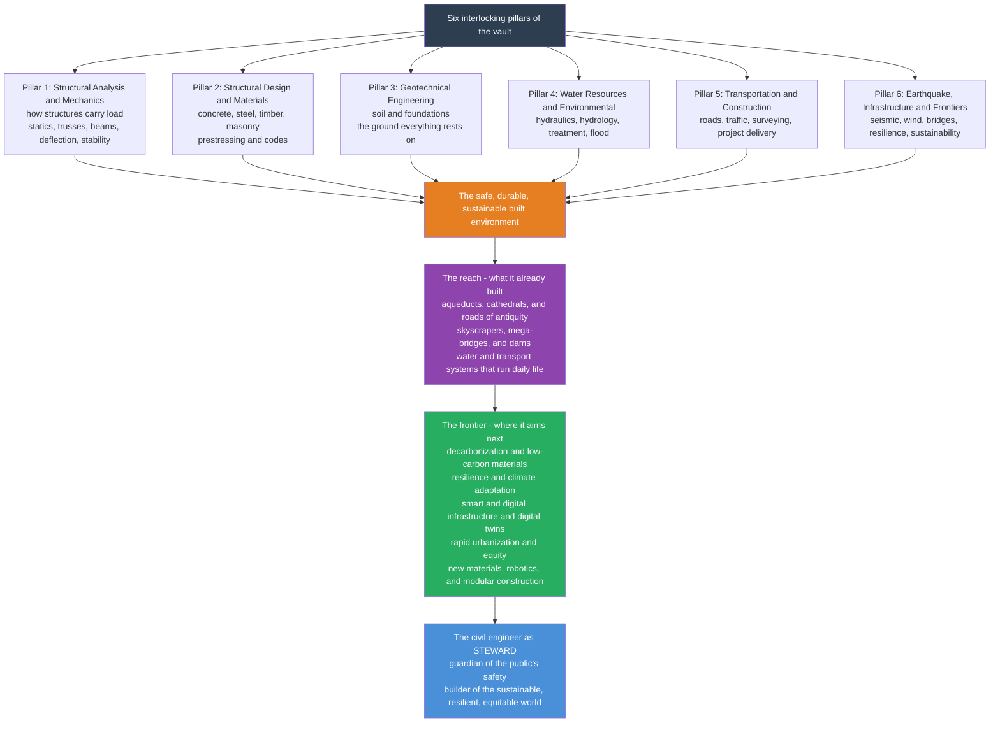

# 🏛️ The Reach and Future of Civil Engineering

> [!abstract] TL;DR
> **Civil engineering** is the oldest and most invisible of the engineering arts: its triumphs are the things we walk across, live inside, drink from, and drive on every day without a single thought, and we notice it only when it fails. From the Roman aqueducts and Gothic cathedrals to the Golden Gate Bridge and the water system that quietly keeps a megacity alive, it is the discipline that literally builds civilization's **stage**. This capstone pulls all the way back to show how the vault's six pillars interlock into one mission — **(1) Structural Analysis & Mechanics** (how structures carry load), **(2) Structural Design & Materials** (concrete, steel, timber, masonry, prestressing, codes), **(3) Geotechnical Engineering** (the ground everything rests on), **(4) Water Resources & Environmental** (hydraulics, hydrology, water, wastewater, flood, pollution), **(5) Transportation & Construction** (roads, traffic, surveying, project delivery), and **(6) Earthquake, Infrastructure & Frontiers** (seismic, wind, bridges, resilience, sustainability) — and how *every real project* (a single bridge) fires all six at once. The **enduring core** — *capacity must exceed demand with a margin*, and *every load must trace a complete path to the ground* — is permanent. The **frontier** is being redrawn in real time: the field is shifting from **building the world** to **sustaining and decarbonizing** it. Because the built environment drives roughly **40 percent of global carbon emissions**, civil engineering is now central to climate solutions — low-carbon materials and mass timber, **resilience** and climate adaptation for rising seas and fiercer storms, **smart/digital** infrastructure (sensors, structural health monitoring, BIM, **digital twins**, AI, smart cities), the **rapid urbanization** and equity of housing billions more city-dwellers, and new **materials and construction** (3D-printed concrete, robotics, prefab/modular). The honest message: the oldest engineering discipline is being urgently reinvented for the century of climate change, aging infrastructure, and the smart city — and the civil engineer remains the **steward** of the public's safety and the builder of the sustainable, resilient, equitable world civilization needs.

---

## Intuition

**Analogy — civil engineering is the discipline you only notice when it fails.** Stand anywhere in a city and try to name what a civil engineer touched. It is almost everything, and it is almost nothing you can *see* as a "device": the floor holding you up and the foundation under it, the road outside, the bridge across the river, the pipe delivering clean water to the tap and the sewer carrying the waste away, the dam upstream, the levee on the floodplain, the tunnel through the hill, the runway, the retaining wall on the slope. None of it announces itself. A phone begs for your attention; a bridge asks only to be forgotten. That is the strange signature of the field: its **success is invisible and its failure is catastrophic**. When a civil work is doing its job, you think about it exactly as much as you think about the ground — which is to say, never — right up until the moment it moves.

That invisibility is also its *reach across time*. Civil engineering built the ancient wonders — the [aqueducts](#) that watered Rome, the cathedrals that stood for a thousand years, the roads that outlived the empire that laid them — and it built the modern world of skyscrapers, mega-bridges, dams, and the water and transport systems that make dense civilization physically possible. This note is the culmination of the vault: it recalls each thread we have pulled — from the [[Structural_Loads_and_Load_Paths|load path]] traced through a [[Beams_Shear_and_Bending_Moment|beam]], through the [[Soil_Mechanics_Fundamentals|soil]] that everything rests on and the [[Hydraulics_and_Open_Channel_Flow|water]] that must be moved and cleaned, to the [[Transportation_Engineering_and_Traffic_Flow|networks]] that carry people — and casts that whole fabric forward. Because the same discipline that *built* the world is now being asked to *save* it: to decarbonize the built environment, harden it against a changing climate, wire it with sensors, and extend it fairly to the billions moving into cities. The oldest engineering art is being reinvented for the century of climate change and the smart city.

---

## How It Works

### Core Mechanics

Understand civil engineering as **six pillars converging into one product, then reaching toward a shifting frontier**. The pillars are the sub-disciplines this vault is organized around; the convergence is that *every real project needs all six at once*; and the frontier is what happens when that "build-it-safely-at-scale" capability is aimed at sustaining and decarbonizing a world that is largely already built.

1. **Pillar 1 — Structural Analysis & Mechanics: how the loads flow.** Before anything is designed you must know the **forces inside it**. Statics finds reactions and internal actions in [[Analysis_of_Trusses_and_Frames|trusses and frames]] and [[Beams_Shear_and_Bending_Moment|beams]], then tracks how those forces cause [[Deflection_and_Statically_Indeterminate_Structures|deflection]] and how slender members lose [[Structural_Stability_and_Buckling|stability by buckling]]. It is the grammar of the [[Structural_Loads_and_Load_Paths|load path]] — dead, live, and environmental load resolved into shear and moment.

2. **Pillar 2 — Structural Design & Materials: will it hold, and out of what?** Analysis gives the forces; design turns them into **real members of real material**. Engineers proportion beams, columns, and slabs in [[Reinforced_Concrete_Design|reinforced concrete]], [[Structural_Steel_Design|structural steel]], and [[Timber_Masonry_and_Composite_Structures|timber and masonry]], push concrete past cracking with [[Prestressed_Concrete|prestressing]], understand the material itself through [[Concrete_Technology_and_Cement|concrete technology and cement]], and check it all against [[Design_Codes_and_Structural_Safety|codes calibrated to a target reliability]].

3. **Pillar 3 — Geotechnical Engineering: what does it stand on?** Every structure ultimately rests on the one material the engineer *inherits* rather than manufactures. This pillar runs from [[Soil_Mechanics_Fundamentals|soil mechanics]] and [[Effective_Stress_and_Consolidation|Terzaghi's effective stress and consolidation settlement]] through the [[Shear_Strength_of_Soils|shear strength]] that governs failure, to [[Foundation_Engineering|foundations]], [[Retaining_Walls_and_Lateral_Earth_Pressure|retaining walls]], and [[Slope_Stability_and_Earthworks|slope stability]] — the ground everything rests on.

4. **Pillar 4 — Water Resources & Environmental: moving water, and cleaning it.** Civilization needs water delivered, waste carried away, and floods survived. This pillar spans [[Hydraulics_and_Open_Channel_Flow|hydraulics and open-channel flow]], [[Hydrology_and_the_Water_Cycle|hydrology and the water cycle]], [[Water_Supply_and_Distribution|water supply networks]], [[Wastewater_and_Water_Treatment|wastewater and water treatment]], [[Environmental_Engineering_and_Pollution_Control|environmental pollution control]], and [[Coastal_and_Flood_Engineering|coastal and flood defense]] — the invisible systems that turn a settlement into a sanitary city.

5. **Pillar 5 — Transportation & Construction: moving people, and building it.** Roads and railways move goods and people, [[Transportation_Engineering_and_Traffic_Flow|traffic-flow theory]] keeps them from gridlock, [[Pavement_and_Highway_Design|pavement design]] carries the wheels, and [[Construction_Materials_and_Quality|construction materials and quality control]] turn specifications into built reality — supported by surveying and geomatics, construction management, and project planning and scheduling that get it built on time and on budget.

6. **Pillar 6 — Earthquake, Infrastructure & Frontiers: surviving the extreme, and enduring.** Static loads are only half the story. Earthquake engineering and seismic design make structures *ductile* rather than merely strong; structural dynamics and wind engineering handle the shaking and the gust; bridge engineering integrates every pillar in one span; and the field's expanding edge — infrastructure resilience and asset management, and sustainable and smart infrastructure — is exactly where this capstone lives.

**The convergence.** No real project lives in a single pillar. A **highway bridge** is a *structural-analysis* problem (dead deck plus live trucks plus wind resolved into shear and moment), built from *prestressed concrete or weathering steel* (design and materials), landing on *pile foundations* driven through soil (geotechnics), with its deck set above the *hundred-year flood* and its piers protected from *scour* (water resources), on an alignment and grade fixed by *transportation* engineering, detailed for *ductility* in a seismic region (earthquake) — **all six at once**. The civil engineer's real skill is not any single pillar but the **integration** of all six into a safe, durable, public work.

**The frontier.** Point that "build-it-safely-at-scale" capability at a world that is mostly *already built* and it is redrawn from construction to **stewardship and transformation**: **decarbonization and sustainability** (the built environment's ~40 percent of emissions — low-carbon and recycled materials, mass timber, structural efficiency, the circular economy), **resilience and climate adaptation** (designing for rising seas, fiercer storms, and shocks, and protecting aging infrastructure), **smart/digital** infrastructure (sensors, structural health monitoring, BIM, **digital twins**, AI, smart cities), **rapid urbanization and equity** (housing and servicing billions more city-dwellers, especially in the developing world), and **new materials and construction** (3D-printed concrete, robotics and automation, prefab/modular), reaching toward grand projects — resilient coasts, high-speed rail, and construction in space and extreme environments.

### Flow / Architecture



---

## Key Concepts

### Secondary Level

- **The discipline you only notice when it fails.** Safe buildings, clean water, and working transport are civil engineering doing its job invisibly. Its successes disappear into daily life; its failures — a collapsed bridge, a breached dam, a flooded city — make headlines and cost lives. That asymmetry is why it is a licensed, ethics-first profession.
- **It built the ancient world and the modern one.** The same field that raised Roman aqueducts and Gothic cathedrals raised skyscrapers, mega-bridges, and the water systems that make a city of millions possible out of the plainest materials — concrete, steel, soil, and water.
- **Six connected specialties, one mission.** Structures, materials, the ground, water, transport, and the extreme all combine to make the *safe, durable, public* world. A single bridge needs every one of them.
- **The job is changing from building to sustaining.** The great task of this century is not just to build more, but to make what we build **low-carbon**, **resilient** to a changing climate, **smart** with sensors and data, and **fair** for a fast-urbanizing humanity.

### Undergraduate Level

- **The two invariants, one more time.** Across all six pillars, two ideas repeat: **capacity must exceed demand with a margin** (the factor of safety, honestly stated as a reliability index $\beta$ in modern **LRFD**, $\sum \gamma_i Q_i \le \phi R_n$), and **every load must trace a complete path to the ground** (roof to floor to beam to column to footing to soil). Master these and the whole discipline unfolds.
- **A beam in one figure.** A simply supported beam of span $L$ under uniform load $w$ has $V_{max} = wL/2$ and $M_{max} = wL^2/8$, extreme fiber stress $\sigma = Mc/I$, and midspan deflection $\delta = 5wL^4/(384EI)$ — *strength and serviceability from one analysis*, the essence of Pillar 1 and the first panel of the demo below.
- **The ground can undo the structure.** For an infinite slope, factor of safety $FS = [c' + (\gamma z\cos^2\beta - u)\tan\phi']/(\gamma z\sin\beta\cos\beta)$: raise the water table and the pore pressure $u$ climbs, effective stress $\sigma' = \sigma - u$ falls, and a stable slope slides. Water and soil are one problem — the second panel of the demo.
- **Traffic is a flow, not a collection of cars.** The Greenshields fundamental diagram $q = v_f\, k(1 - k/k_j)$ peaks at capacity $q_{max} = v_f k_j/4$ when density is half of jam density — congestion is the *right half* of a parabola, the third panel of the demo.
- **Embodied carbon is now a design variable.** The material you choose carries a carbon cost *before the structure is ever used*. Reinforced concrete, virgin steel, recycled steel, and mass timber differ by nearly an order of magnitude in embodied carbon per kilogram — the fourth panel, and the field's climate lever.

### Graduate Level

- **The project as a coupled system, not a stack of components.** Real design is not pillar-by-pillar but integrated: the same bridge couples structural dynamics, soil-structure interaction, hydraulics (scour), and constructability. A locally optimal member in an incompatible system is a failure waiting for its load case — which is why **load combinations** ($1.2D + 1.0E + L$, and the rest) exist and why the governing case is rarely any single load alone.
- **The enduring core versus the shifting frontier.** Statics, mechanics of materials, effective stress, hydraulics, and structural dynamics are permanent — as true in a century as now. What changes is the *frontier* the core is aimed at. Master the invariants and you can absorb whatever the century demands, because the discipline that designed for gravity and wind can design for a rising sea and a warming climate with the same conservation laws.
- **Reliability, made explicit.** Behind every safety factor is a probability. With demand $S$ and resistance $R$ as random variables, the margin $M = R - S$ has reliability index $\beta = \mu_M/\sigma_M$ and failure probability $P_f = \Phi(-\beta)$; codes target $\beta \approx 3$–$4$. The frontier extends this from a single member to a *system over its whole life* — infrastructure asset management and **resilience**, defined not as avoiding damage but as absorbing a shock and recovering function.
- **Decarbonization is a materials-and-efficiency problem the field owns.** The built environment drives roughly 40 percent of global CO$_2$; cement alone is ~8 percent. Cutting it is *civil engineering's* problem: lower-clinker and carbon-cured concrete, mass timber that stores biogenic carbon, structural optimization that uses less material, and a circular economy that reuses it — a familiar toolkit redeployed against the climate.
- **The digital layer: sensors, twins, and data.** Structural health monitoring instruments a bridge so it reports its own condition; a **digital twin** mirrors an asset in real time for predictive maintenance; BIM coordinates design and construction; and ML surrogates and smart-city data optimize operation. As tools automate the routine, the scarce, growing skill remains **judgment and integration** — framing the physics, owning the risk, and signing for the public's safety.
- **The steward's mandate.** Every frontier — decarbonization, resilience, urbanization, equity — is ultimately a *build-it-safely-and-sustainably-at-scale* problem, precisely the master skill of the civil engineer. The demand for that capability has never been greater.

---

## Python Demo

```python
# "Civil engineering in one figure" -- a four-panel synthesis dashboard that
# recalls the whole vault, roughly one pillar-group per panel, and casts it forward:
#
#   (a) STRUCTURES   -> shear and bending-moment diagram of a beam        (Pillars 1 & 2)
#   (b) GEOTECH+WATER-> infinite-slope factor of safety, dry vs saturated (Pillars 3 & 4)
#   (c) TRANSPORT    -> traffic fundamental diagram (Greenshields)        (Pillar 5)
#   (d) FUTURE       -> embodied carbon of structural materials           (Pillar 6 / frontier)
#
# Requires: numpy, matplotlib
import numpy as np
import matplotlib.pyplot as plt

# =====================================================================
# (a) STRUCTURES: simply supported beam, span L, uniform load w.
#     Reactions R = wL/2; shear V(x) = w(L/2 - x);
#     moment M(x) = (w x / 2)(L - x); M_max = wL^2/8 at midspan.
# =====================================================================
L, w = 8.0, 12.0                     # span [m], uniform load [kN/m]
xb = np.linspace(0, L, 400)
V = w * (L / 2 - xb)                  # shear force  [kN]
M = (w * xb / 2) * (L - xb)           # bending moment [kN.m]
Mmax, Vmax = w * L**2 / 8, w * L / 2

# =====================================================================
# (b) GEOTECH + WATER: infinite-slope factor of safety vs slope angle.
#     FS = [c' + (gamma*z*cos^2 b - u) tan(phi)] / (gamma*z*sin b*cos b)
#     Dry: u = 0.  Saturated seepage: u = gamma_w*z*cos^2 b (water at surface).
#     Raising the water table lifts pore pressure u and drops FS -> effective
#     stress sigma' = sigma - u is why a stable slope can slide after rain.
# =====================================================================
c, phi = 5.0, np.radians(32.0)       # cohesion [kPa], friction angle
z = 3.0                              # depth to failure plane [m]
g_m, g_sat, g_w = 18.0, 20.0, 9.81   # moist / saturated / water unit wt [kN/m3]
beta = np.radians(np.linspace(5, 44, 400))
cb, sb = np.cos(beta), np.sin(beta)
FS_dry = (c + g_m * z * cb**2 * np.tan(phi)) / (g_m * z * sb * cb)
u_sat = g_w * z * cb**2
FS_wet = (c + (g_sat * z * cb**2 - u_sat) * np.tan(phi)) / (g_sat * z * sb * cb)
b_deg = np.degrees(beta)

# =====================================================================
# (c) TRANSPORT: Greenshields fundamental diagram.
#     speed v = v_f (1 - k/k_j);  flow q = k v = v_f k (1 - k/k_j).
#     Capacity q_max = v_f k_j / 4 at k = k_j / 2 (the tipping point
#     between free flow and congestion).
# =====================================================================
v_f, k_j = 100.0, 120.0              # free-flow speed [km/h], jam density [veh/km]
k = np.linspace(0, k_j, 400)
q = v_f * k * (1 - k / k_j)          # flow [veh/h]
k_cap, q_max = k_j / 2, v_f * k_j / 4

# =====================================================================
# (d) FUTURE: embodied carbon intensity of structural materials
#     (illustrative kg CO2e per kg, ICE-database order of magnitude).
#     The built environment is ~40% of global CO2 -> material choice is a
#     climate lever: mass timber and recycled steel slash embodied carbon.
# =====================================================================
mats = ["RC\nconcrete", "Steel\n(virgin)", "Steel\n(recycled)", "Mass timber\n(glulam)"]
ec = [0.15, 2.0, 0.75, 0.45]         # kg CO2e per kg (illustrative)
cols = ["#7f8c8d", "#c0392b", "#e67e22", "#27ae60"]

# ------------------------------ console summary ------------------------------
print("=== Civil engineering in one figure ===")
print(f"(a) STRUCTURES  span {L:.0f} m, w {w:.0f} kN/m -> "
      f"Vmax {Vmax:.0f} kN, Mmax {Mmax:.0f} kN.m")
print("(b) GEOTECH+WATER  factor of safety at 20 deg slope:")
i20 = np.argmin(np.abs(b_deg - 20))
print(f"      dry FS {FS_dry[i20]:.2f}  ->  saturated FS {FS_wet[i20]:.2f}  "
      f"(pore pressure sinks it)")
print(f"(c) TRANSPORT   capacity q_max {q_max:.0f} veh/h at k {k_cap:.0f} veh/km")
print("(d) FUTURE      embodied carbon (kg CO2e/kg):")
for m, e in zip([s.replace(chr(10), ' ') for s in mats], ec):
    print(f"      {m:16s}: {e:.2f}")

# --------------------------------- plotting ---------------------------------
fig, ax = plt.subplots(2, 2, figsize=(14, 10))
fig.suptitle("Civil Engineering in One Figure: the Vault's Six Pillars, and the Frontier",
             fontsize=15, fontweight="bold")

# (a) shear and moment diagram (twin axes)
axa = ax[0, 0]
axa.plot(xb, V, color="#1f77b4", lw=2.4, label="shear V(x)  [kN]")
axa.axhline(0, color="k", lw=0.8)
axa.fill_between(xb, V, color="#1f77b4", alpha=0.10)
axa.set_ylabel("shear  V  [kN]", color="#1f77b4")
axa.tick_params(axis="y", labelcolor="#1f77b4")
axm = axa.twinx()
axm.plot(xb, M, color="#d62728", lw=2.4, label="moment M(x)  [kN.m]")
axm.fill_between(xb, M, color="#d62728", alpha=0.10)
axm.set_ylabel("moment  M  [kN.m]", color="#d62728")
axm.tick_params(axis="y", labelcolor="#d62728")
axm.annotate(f"M_max = wL^2/8 = {Mmax:.0f}", xy=(L/2, Mmax),
             xytext=(L/2, Mmax*0.55), ha="center", fontsize=8, color="#d62728",
             arrowprops=dict(arrowstyle="->", color="#d62728"))
axa.set_title("(a) STRUCTURES: shear & bending moment  ->  Pillars 1 & 2")
axa.set_xlabel("position along span  x  [m]"); axa.grid(alpha=0.3)

# (b) slope factor of safety, dry vs saturated
axb = ax[0, 1]
axb.plot(b_deg, FS_dry, color="#27ae60", lw=2.4, label="dry slope")
axb.plot(b_deg, FS_wet, color="#c0392b", lw=2.4, label="saturated (seepage)")
axb.fill_between(b_deg, FS_wet, FS_dry, color="#c0392b", alpha=0.10)
axb.axhline(1.0, ls="--", color="k", lw=1)
axb.text(6, 1.05, "FS = 1  (failure)", fontsize=8)
axb.text(30, 3.2, "pore pressure u\ndrops FS -> slide", fontsize=8, color="#c0392b")
axb.set_title("(b) GEOTECH + WATER: slope factor of safety  ->  Pillars 3 & 4")
axb.set_xlabel("slope angle  beta  [deg]"); axb.set_ylabel("factor of safety  FS")
axb.set_ylim(0, 5); axb.legend(fontsize=8); axb.grid(alpha=0.3)

# (c) traffic fundamental diagram
axc = ax[1, 0]
axc.plot(k, q, color="#8e44ad", lw=2.4)
axc.fill_between(k, q, color="#8e44ad", alpha=0.10)
axc.axvline(k_cap, ls=":", color="k", lw=1)
axc.plot([k_cap], [q_max], "o", color="#8e44ad")
axc.annotate(f"capacity {q_max:.0f} veh/h\nat k = {k_cap:.0f} veh/km",
             xy=(k_cap, q_max), xytext=(k_cap+8, q_max*0.7), fontsize=8,
             arrowprops=dict(arrowstyle="->", color="#8e44ad"))
axc.text(15, 400, "free flow", fontsize=8, color="#2ca02c")
axc.text(85, 400, "congested", fontsize=8, color="#c0392b")
axc.set_title("(c) TRANSPORT: traffic fundamental diagram  ->  Pillar 5")
axc.set_xlabel("density  k  [veh/km]"); axc.set_ylabel("flow  q  [veh/h]")
axc.grid(alpha=0.3)

# (d) embodied carbon of structural materials
axd = ax[1, 1]
bars = axd.bar(range(len(mats)), ec, color=cols, edgecolor="k", alpha=0.9)
axd.set_xticks(range(len(mats))); axd.set_xticklabels(mats, fontsize=8)
for b, e in zip(bars, ec):
    axd.text(b.get_x() + b.get_width()/2, e + 0.04, f"{e:.2f}",
             ha="center", fontsize=8, fontweight="bold")
axd.text(0.5, 0.90, "built environment ~ 40% of global CO2\nmaterial choice is a climate lever",
         transform=axd.transAxes, ha="center", va="top", fontsize=8.5,
         bbox=dict(boxstyle="round", fc="#eafaf1", ec="#27ae60"))
axd.set_title("(d) FUTURE: embodied carbon of materials  ->  frontier")
axd.set_ylabel("embodied carbon  [kg CO2e / kg]  (illustrative)")
axd.set_ylim(0, 2.4); axd.grid(alpha=0.3, axis="y")

plt.tight_layout(rect=[0, 0, 1, 0.95])
plt.show()
```

Each panel compresses a slice of the vault into one curve, and the four together *are* the discipline. **(a)** the shear and bending-moment diagram — $V_{max} = wL/2$, $M_{max} = wL^2/8$ — is Pillars 1 and 2 in a single view: analysis gives the internal actions, and design proportions [[Reinforced_Concrete_Design|concrete]] or [[Structural_Steel_Design|steel]] to carry them. **(b)** the [[Slope_Stability_and_Earthworks|slope]] factor of safety collapses from the green *dry* curve to the red *saturated* one as pore pressure $u$ climbs — the [[Effective_Stress_and_Consolidation|effective-stress principle]] $\sigma' = \sigma - u$ that fuses geotechnics (Pillar 3) with [[Hydrology_and_the_Water_Cycle|water]] (Pillar 4), and the reason slopes fail *after the rain*. **(c)** the [[Transportation_Engineering_and_Traffic_Flow|Greenshields fundamental diagram]] $q = v_f k(1 - k/k_j)$ peaks at capacity when density is half of jam density — congestion is Pillar 5 as the descending right half of a parabola. **(d)** the embodied-carbon bars recall the frontier — reinforced concrete, virgin steel, recycled steel, and mass timber span nearly an order of magnitude, so in a built environment responsible for ~40 percent of global CO$_2$, *material choice is a climate lever*. Four panels, six pillars, one figure: civil engineering, and its future, at a glance.

---

## Real-World Applications

> **Example — a single long-span bridge is the whole vault in one structure, and the field's future in miniature.** Its deck and girders are a *structural-analysis* problem (dead concrete plus live trucks plus wind and thermal load resolved into shear and moment along every span); the members are proportioned in *design* from prestressed concrete or weathering steel and checked to the bridge code with load-and-resistance factors; the towers and piers hand the whole load into *geotechnical* foundations — deep piles or caissons through soil sized so bearing and settlement stay within limits; *water-resources* engineering sets the deck elevation above the hundred-year flood and armors the piers against scour; *transportation* engineering fixes the alignment, grade, and traffic capacity; and in a seismic region *earthquake* engineering details the columns for ductility so they rock and yield instead of shattering. One structure, all six pillars, one non-negotiable requirement: carry every truck for a century and never fall. Now watch it point at the future — instrument it with **strain and vibration sensors** feeding a **digital twin** that predicts maintenance, cast its deck in **low-carbon concrete**, and design its height and scour protection for a **rising, stormier sea**. The discipline does not need a new toolkit for the century of climate change; it re-aims the one it already has.

- **Buildings and skyscrapers.** From a house to a supertall tower, gravity and lateral (wind and seismic) [[Structural_Loads_and_Load_Paths|load paths]] run from roof to floors to columns and shear walls to foundations — [[Analysis_of_Trusses_and_Frames|analysis]], [[Structural_Stability_and_Buckling|stability]], concrete/steel [[Design_Codes_and_Structural_Safety|design]], and [[Foundation_Engineering|geotechnics]] working as one, now with mass-timber towers cutting embodied carbon.
- **Water and public health.** The pipe networks, pumps, and plants that deliver clean water ([[Water_Supply_and_Distribution]]) and remove sewage ([[Wastewater_and_Water_Treatment]]) are the single greatest contributor to urban public health in history — invisible [[Hydraulics_and_Open_Channel_Flow|hydraulics]] and [[Environmental_Engineering_and_Pollution_Control|environmental engineering]].
- **Dams, levees, and flood defense.** Concrete and earth-fill dams, levees, and floodwalls resist enormous hydrostatic and seepage forces ([[Coastal_and_Flood_Engineering]], [[Retaining_Walls_and_Lateral_Earth_Pressure]]); their failure floods cities, so they are among the most safety-critical structures ever built — and among the most stressed by a changing climate.
- **Transportation networks.** Highways, railways, metros, and ports — the [[Pavement_and_Highway_Design|pavements]], [[Transportation_Engineering_and_Traffic_Flow|traffic capacity]], and construction logistics that let goods and people move at civilization's scale, extending toward high-speed rail and electrified, automated corridors.
- **Resilient and sustainable infrastructure.** Seismic retrofits, climate-adaptive coastal defenses, [[Concrete_Technology_and_Cement|low-carbon concrete]], and infrastructure asset management extend the field into the century ahead — and connect it to the [[Anthropogenic_Climate_Change|climate challenge]] it is now central to solving.
- **The digital and constructed frontier.** Structural health monitoring, BIM and digital twins, 3D-printed concrete, and robotic/modular construction are reshaping *how* the built environment is designed, built, and maintained — sharing the hardware and electronics frontier with the [[The_Reach_and_Future_of_Mechanical_Engineering|mechanical]] and neighboring engineering disciplines.

---

## Common Pitfalls

- **Thinking of civil engineering as one skill rather than a federation of six.** A brilliant structural analyst may know little about soil consolidation; a hydrologist may never detail a column. The six pillars are connected specialties, not a single monolithic ability — and treating them as one is how load paths get dropped *between* disciplines (the structure hands a load to a foundation nobody sized for it).
- **Breaking the load path.** The most fundamental civil error: a beam whose load has nowhere to go, a column that misses the foundation, a connection detailed for the wrong force. *Every* load must trace a continuous, checked path from application to the ground; many real collapses are load-path failures, not material failures.
- **Confusing strength with serviceability — and safety with resilience.** A beam can be perfectly *safe* yet unusable (deflecting or vibrating too much); likewise a structure can be *strong* yet not *resilient* (undamaged in the design event but unable to recover function after a bigger one). Strength, serviceability, and resilience are separate goals; passing one does not guarantee the others.
- **Treating the frontier as a different discipline.** Decarbonization, resilience, and smart infrastructure are sometimes imagined as new fields. They are not — they are the *same* mechanics, effective stress, hydraulics, and dynamics aimed at low-carbon materials, climate loads that are themselves changing, and sensor data. Dismissing the classical core as "old" leaves you unable to engineer the very future that depends on it.
- **Underestimating the ground and the water.** Soil is inherited, variable, and hidden, and water is what turns a stable slope into a landslide (the demo's panel b). Assuming competent, dry ground or skimping on site investigation has sunk more projects — literally, via settlement and slope failure — than any structural mistake. Terzaghi's warning stands: *the soil is the great uncertainty.*
- **Forgetting that failure is public and catastrophic.** Unlike a broken gadget, a civil failure kills people and shatters public trust, which is why civil engineering is a licensed, code-bound, ethics-first profession. As Petroski argued, engineering *advances* by studying its failures — and the engineer's signature is a legal promise the public may safely rely on the work.

---

## Related Concepts

**The hub this capstone closes**
- [[Civil_Engineering_Overview]] — the vault hub; the "large, permanent, public, load-bearing world," the two invariants, and the six-pillar map this capstone brings full circle.

**Pillar 1 — Structural Analysis & Mechanics (Section 1)**
- [[Structural_Loads_and_Load_Paths]] — dead, live, and environmental load, and the path every one must trace to the ground.
- [[Analysis_of_Trusses_and_Frames]] — statics resolving trusses and frames into member forces.
- [[Beams_Shear_and_Bending_Moment]] — the shear and moment diagram of the demo's panel (a).
- [[Deflection_and_Statically_Indeterminate_Structures]] — serviceability and the stiffness method behind modern software.
- [[Structural_Stability_and_Buckling]] — how slender members fail by instability, not strength.

**Pillar 2 — Structural Design & Materials (Section 2)**
- [[Reinforced_Concrete_Design]] — turning forces into reinforced-concrete members to code.
- [[Structural_Steel_Design]] — proportioning steel members and connections.
- [[Concrete_Technology_and_Cement]] — the material itself, and the target of low-carbon concrete.
- [[Timber_Masonry_and_Composite_Structures]] — timber, masonry, and the mass-timber decarbonization story.
- [[Prestressed_Concrete]] — pre-compressing concrete so it never cracks in service.
- [[Design_Codes_and_Structural_Safety]] — LRFD, load combinations, and the reliability index behind every safety factor.

**Pillar 3 — Geotechnical Engineering (Section 3)**
- [[Soil_Mechanics_Fundamentals]] — the inherited, variable, hidden material everything rests on.
- [[Effective_Stress_and_Consolidation]] — Terzaghi's $\sigma' = \sigma - u$ and time-dependent settlement; the physics of the demo's panel (b).
- [[Shear_Strength_of_Soils]] — the $c'$-$\phi'$ strength that decides whether the ground holds.
- [[Foundation_Engineering]] — footings, rafts, and piles handing load to the earth.
- [[Retaining_Walls_and_Lateral_Earth_Pressure]] — holding back soil and water pressure.
- [[Slope_Stability_and_Earthworks]] — the slope factor of safety of the demo's panel (b).

**Pillar 4 — Water Resources & Environmental (Section 4)**
- [[Hydraulics_and_Open_Channel_Flow]] — Manning flow, channels, and pipe networks.
- [[Hydrology_and_the_Water_Cycle]] — rainfall, runoff, and the floods infrastructure must survive.
- [[Water_Supply_and_Distribution]] — delivering clean water at civic scale.
- [[Wastewater_and_Water_Treatment]] — the sanitation that made dense cities possible.
- [[Environmental_Engineering_and_Pollution_Control]] — protecting air, water, and land.
- [[Coastal_and_Flood_Engineering]] — the front line of climate adaptation and rising seas.

**Pillar 5 — Transportation & Construction (Section 5)**
- [[Transportation_Engineering_and_Traffic_Flow]] — the fundamental diagram of the demo's panel (c).
- [[Pavement_and_Highway_Design]] — the layered structure that carries the wheels.
- [[Construction_Materials_and_Quality]] — turning specifications into verified, built reality.

**Sibling-discipline capstones and the climate challenge**
- [[The_Reach_and_Future_of_Mechanical_Engineering]] — the neighboring capstone; the hardware and machines of the built and energy worlds.
- [[The_Reach_and_Future_of_Chemical_Engineering]] — the sibling capstone; the low-carbon cement, materials, and water chemistry the frontier depends on.
- [[Anthropogenic_Climate_Change]] — the climate challenge that reframes civil engineering from building the world to sustaining and decarbonizing it.

*Forthcoming siblings in this vault (Pillar 6, and the rest of Section 5): Earthquake_Engineering_and_Seismic_Design, Structural_Dynamics_and_Wind_Engineering, Bridge_Engineering, Infrastructure_Resilience_and_Asset_Management, Sustainable_and_Smart_Infrastructure, Surveying_and_Geomatics, Construction_Engineering_and_Management, and Project_Planning_and_Scheduling — to be linked as they are written.*

---

## Review Questions

**Secondary**
1. Civil engineering is described as "the discipline you only notice when it fails." Pick three things you used today — say a bridge, a tap of clean water, and a road — and for each, explain in plain words which of the field's six areas (structures, materials, the ground, water, transport, or the extreme) had to work for it to serve you invisibly. Then give one reason the *future* of the field is more about **fixing and greening** what exists than about building brand-new things.

**Undergraduate**
2. The vault rests on two invariants: *capacity must exceed demand with a margin*, and *every load must trace a complete path to the ground.* Using the demo's first two panels, (a) write $M_{max}$ and $V_{max}$ for a simply supported beam under uniform load and explain why the moment governs the design of the concrete or steel section, and (b) explain, using effective stress $\sigma' = \sigma - u$, why the same soil slope that is stable when dry can slide after heavy rain. Why do these two panels each belong to a *different* pillar yet describe *one* project?

**Graduate**
3. It is sometimes claimed that decarbonization, resilience, and smart infrastructure require a "new" civil engineering, distinct from the discipline that built the fossil-fuel-era world. Argue *against* that claim: take three frontier problems — cutting embodied carbon in a building, adapting a coastal city to sea-level rise, and instrumenting a bridge with a digital twin — and show how each is a familiar pillar (materials, water/geotechnics, structural dynamics) *redeployed* rather than reinvented. Then defend a position on whether the civil engineer's **integrator and steward** role grows or shrinks in value as sensors, BIM, and ML automate the routine analysis and monitoring work.

---

## Sources

- R. C. Hibbeler — *Structural Analysis*, 10th ed. (Pearson, 2018)
- American Society of Civil Engineers — *2021 Report Card for America's Infrastructure* (infrastructurereportcard.org)
- American Society of Civil Engineers — *Future World Vision: Infrastructure Reimagined* (futureworldvision.org)
- National Academy of Engineering — *Grand Challenges for Engineering* (2008; engineeringchallenges.org), including "Restore and improve urban infrastructure"
- Henry Petroski — *To Engineer Is Human: The Role of Failure in Successful Design* (Vintage, 1992)

---

#civil-engineering #capstone #sustainability #resilience #future
