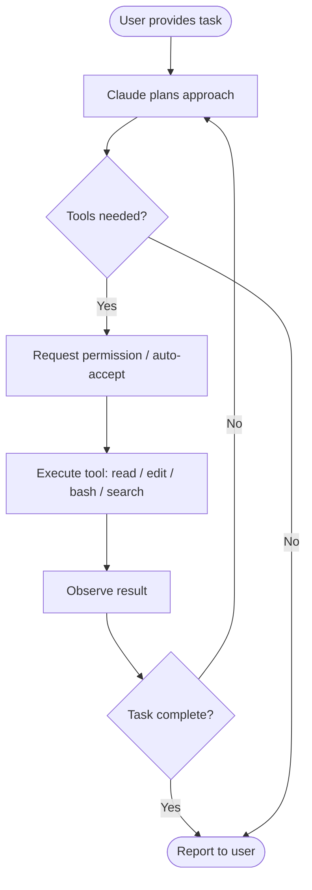

# Claude Code Overview

> [!tldr] TL;DR
> Claude Code is Anthropic's official agentic CLI. Unlike copilots that autocomplete one line at a time, Claude Code runs an **agentic loop** — it plans, reads files, runs shell commands, edits code, and iterates until the task is done. Install with `npm install -g @anthropic-ai/claude-code`.

---

## What Is Claude Code?

Claude Code is a command-line tool built by Anthropic that gives you a direct, agentic interface to Claude inside your terminal. It is not a code-completion plugin — it is a **full coding agent** capable of:

- Reading and editing multiple files across a project
- Running shell commands and interpreting their output
- Searching codebases with grep and glob patterns
- Committing changes to git
- Spawning sub-agents for parallel work
- Calling external tools via MCP servers

The key distinction: a **copilot** (GitHub Copilot, Cursor tab-complete) reacts to your cursor position and suggests the next few tokens. Claude Code receives a **goal** and pursues it autonomously, checking back with you at each decision point requiring permission.

---

## Agentic Loop Concept

The heart of Claude Code is the **agentic loop**: a cycle of planning, acting, and observing that repeats until the task is complete or Claude needs input.



Each iteration of the loop can involve:
1. **Read** — examining files to understand the codebase
2. **Edit / Write** — making changes
3. **Bash** — running tests, builds, or shell commands
4. **Grep / Glob** — searching for patterns
5. **Agent** — spinning up a sub-agent for isolated work

Claude narrates its plan before acting and asks for confirmation before any destructive or irreversible action (unless you enable auto-accept).

---

## How It Differs from Copilots

| Feature | Claude Code | GitHub Copilot | Cursor |
|---|---|---|---|
| Interaction mode | Conversational goals | Inline autocomplete | Chat + autocomplete |
| File edits | Multi-file, autonomous | Single location | Multi-file with chat |
| Shell commands | Yes (with permission) | No | Limited |
| Context window | Full project context | Local snippet | Project index |
| Agentic loop | Yes | No | Partial |
| Runs in terminal | Yes | No | No (IDE only) |
| Open source | No | No | No |
| Subscription | Max plan or API | GitHub Copilot plan | Cursor plan |

The fundamental shift: with Claude Code you describe **what you want**, not **where to type it**.

---

## Installation

### Prerequisites
- Node.js 18 or later
- npm (bundled with Node)
- An Anthropic account (Max subscription or API key)

### Install
```bash
npm install -g @anthropic-ai/claude-code
```

### Verify installation
```bash
claude --version
claude doctor   # checks setup, API key, model access
```

### Authenticate
```bash
# With Max subscription (opens browser OAuth):
claude

# With API key:
export ANTHROPIC_API_KEY=sk-ant-...
claude
```

---

## Subscription vs API Mode

Claude Code runs in one of two billing modes:

| Mode | How to activate | Cost model | Best for |
|---|---|---|---|
| **Max subscription** | Sign in via browser (claude.ai/code) | Flat monthly fee (includes Claude Code) | Heavy daily use |
| **API mode** | Set `ANTHROPIC_API_KEY` env var | Per-token input/output billing | Occasional use, CI, automation |

With the Max plan, Claude Code usage is bundled — no per-token charges. With the API, each session consumes tokens billed to your account. See [[Claude_Pricing]] for token costs and caching strategies.

---

## First Session Walkthrough

```bash
# Navigate to your project
cd my-project

# Start Claude Code
claude

# Inside the session — example prompts:
> Explain the architecture of this codebase
> Add input validation to the login endpoint
> Write tests for the UserService class
> Fix the failing test in test_auth.py
```

Claude will read relevant files, propose changes, and ask for your approval before writing anything.

---

## Key Concepts to Understand Early

**CLAUDE.md** — A markdown file in your project root (or `~/.claude/CLAUDE.md` globally) that Claude reads at the start of every session. Use it to document project conventions, common commands, and what Claude should never do. See [[CLAUDE_md_Guide]].

**Context window** — The total amount of text Claude can hold in memory at once. Claude Code manages this by summarising old turns (`/compact`). See [[Context_and_Memory]].

**Permission system** — Every tool call (edit a file, run a command) requires your approval by default. You can configure auto-accept for trusted tools. See [[Permission_Modes]].

**Skills / Sub-agents** — Reusable instruction sets and background worker agents. See [[Skills_Guide]] and [[Subagents_Guide]].

---

## Common Pitfalls

> [!warning] Pitfall 1 — Treating it like autocomplete
> Claude Code works best with **goal-oriented prompts**, not "complete this function" requests. Give it context about the whole task, not just the next line.

> [!warning] Pitfall 2 — Skipping CLAUDE.md
> Without project instructions, Claude will make reasonable guesses about conventions. A good `CLAUDE.md` eliminates repeated corrections.

> [!warning] Pitfall 3 — Ignoring the context window
> Long sessions accumulate history. Use `/compact` before starting a big new sub-task so Claude isn't confused by earlier unrelated work.

---

## Review Questions

> [!question] Q1 — What is the agentic loop?
> The plan → act → observe → repeat cycle Claude Code runs to complete tasks. Claude plans a step, calls a tool (read/edit/bash), observes the result, then decides the next step.

> [!question] Q2 — How does Claude Code differ from GitHub Copilot?
> Copilot autocompletes inline at cursor position. Claude Code accepts high-level goals, reads multiple files, runs shell commands, and iterates autonomously until the task is done.

> [!question] Q3 — What are the two billing modes?
> Max subscription (flat monthly fee bundled with Claude Code) and API mode (per-token billing via `ANTHROPIC_API_KEY`).

---

## See Also

- [[Vibe_Coding_Intro]] — the mindset shift for working with an agentic coder
- [[Ways_to_Use_Claude]] — CLI, Desktop, VS Code, JetBrains, Web, API
- [[Claude_Models]] — choosing between Haiku, Sonnet, and Opus
- [[CLAUDE_md_Guide]] — setting up persistent project instructions
- [[Claude_Pricing]] — understanding token costs and how to reduce them
- [[Permission_Modes]] — controlling what Claude can do without asking
