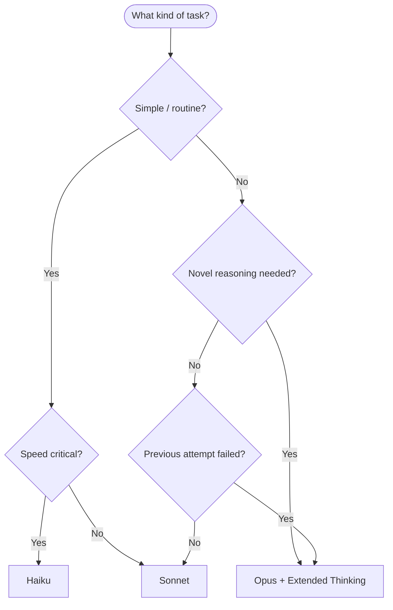

# Claude Models Guide

> [!tldr] TL;DR
> Three tiers: **Haiku** (fast, cheap, simple tasks), **Sonnet** (balanced default, most coding work), **Opus** (deep reasoning, complex architecture). Claude Code defaults to Sonnet. Switch with `/model` mid-session. Use extended thinking for hard algorithmic problems.

---

## The Claude Model Family

As of 2026, the current Claude 5 family has three tiers. Each tier has a primary use case based on the speed/cost/capability trade-off.

| Model | Speed | Cost | Capability | Best for |
|---|---|---|---|---|
| **Haiku** | Very fast | Cheapest | Good | Quick lookups, simple edits, research sweeps |
| **Sonnet** | Fast | Moderate | Very good | Most coding tasks — the daily driver |
| **Opus** | Moderate | Premium | Best | Architecture decisions, hard bugs, novel solutions |

Claude Code uses **Sonnet as the default** because it handles nearly all coding tasks well at a reasonable cost. Opus is reserved for tasks that genuinely require the extra reasoning depth.

---

## Model IDs (Claude 5 Family)

```
claude-haiku-4-5-20251001     # Haiku — fast & light
claude-sonnet-5               # Sonnet — default for Claude Code
claude-opus-5                 # Opus — max reasoning
```

These IDs are used in:
- API calls (model parameter)
- `.claude/settings.json` (model configuration)
- Sub-agent definitions (frontmatter in `.claude/agents/`)
- `/model` command in CLI

See [[Model_Configuration]] for how to set defaults.

---

## Haiku — When to Use

**Profile:** Fast, cheap, capable enough for well-defined tasks.

**Use Haiku for:**
- Researching a codebase (reading many files to answer a question)
- Simple one-file edits with clear instructions
- Generating boilerplate from a clear template
- Quick syntax fixes or renaming
- Running as a sub-agent for bulk/parallel search tasks

**Avoid Haiku for:**
- Novel problem-solving
- Multi-file refactors
- Debugging complex issues
- Any task where reasoning quality matters

**How to switch:** `/model claude-haiku-4-5-20251001`

---

## Sonnet — When to Use

**Profile:** The daily driver. Strong coding skills, fast enough to be practical, cost reasonable for all-day use.

**Use Sonnet for:**
- Most coding tasks: new features, bug fixes, refactors
- Writing and running tests
- Code review and explanation
- API design and documentation
- Debugging with error messages and logs
- Most sessions where you don't know which model to pick

**When to upgrade to Opus:**
- Sonnet tries the same approach twice and fails
- The task requires understanding of a subtle algorithmic trade-off
- Architecture-level decisions with long-range consequences

**How to switch:** `/model claude-sonnet-5` (or just the default)

---

## Opus — When to Use

**Profile:** The reasoning heavyweight. Slower output, premium cost, noticeably better at hard problems.

**Use Opus for:**
- Debugging a subtle concurrency bug with non-obvious root cause
- Designing a new system component with complex trade-offs
- Understanding a large unfamiliar codebase deeply
- Tasks where Sonnet has tried and failed multiple times
- Extended thinking mode (see below)

**Avoid Opus for:**
- Routine tasks (wastes budget)
- Tasks with clear step-by-step instructions (Sonnet handles these fine)

**How to switch:** `/model claude-opus-5`

---

## Thinking Modes

Claude supports **extended thinking** — a mode where the model reasons through a problem step-by-step before writing its answer. This is separate from which model you use, though it pairs best with Opus.

| Mode | What it does | Use case |
|---|---|---|
| Standard | Direct response | Routine tasks, fast iterations |
| Extended thinking | Reasons out loud before answering | Hard algorithm design, tricky bugs, novel architectures |

Extended thinking is enabled via the API (thinking parameter) or the Claude Code `/think` prefix:

```
> /think How should I structure the event sourcing system for this service?
```

Extended thinking increases latency and token cost but produces significantly better answers for hard reasoning tasks.

---

## Decision Diagram: Which Model?



---

## Fast Mode

Claude Code also exposes a **fast mode** toggle (`/fast`) that optimises for response speed at some quality cost. Fast mode is useful during exploration phases when you want quick answers and can afford to lose some reasoning depth. Disable it when you need careful, accurate changes.

---

## Cost Implications of Model Choice

Model choice directly affects API billing costs:

- **Haiku** is roughly 10-20x cheaper per token than Opus
- **Sonnet** sits in the middle
- Extended thinking adds extra tokens (the reasoning chain is billed)

With a **Max subscription**, model choice is less critical for cost — you pay a flat fee. But Opus still has higher latency, so Sonnet remains the practical default even on Max.

See [[Claude_Pricing]] for current token rates and [[Prompt_Caching]] for how to reduce costs on long sessions.

---

## Common Pitfalls

> [!warning] Pitfall 1 — Always using Opus "to be safe"
> Opus is slower and more expensive. Sonnet handles 90% of coding tasks with equal quality. Reserve Opus for tasks that genuinely need deep reasoning.

> [!warning] Pitfall 2 — Not switching when Sonnet is stuck
> If Sonnet has tried the same approach twice and failed, switch to Opus rather than asking Sonnet a third time. The model change often unlocks a different reasoning path.

> [!warning] Pitfall 3 — Ignoring extended thinking for hard problems
> For novel algorithm design or tricky architectural decisions, extended thinking can produce dramatically better answers than standard mode. Use it deliberately.

---

## Review Questions

> [!question] Q1 — What is the default model in Claude Code and why?
> Sonnet — it balances speed, cost, and capability well enough for the vast majority of coding tasks.

> [!question] Q2 — When should you switch from Sonnet to Opus?
> When the task requires deep novel reasoning (complex architecture, subtle bugs), or when Sonnet has failed at the task more than once.

> [!question] Q3 — What is extended thinking?
> A mode where Claude reasons through a problem step-by-step before writing its answer. It increases latency and cost but improves quality on hard reasoning tasks. Invoke with `/think`.

---

## See Also

- [[Claude_Pricing]] — token costs per model and how to reduce them
- [[Model_Configuration]] — setting default models in settings.json
- [[Subagents_Guide]] — assigning different models to different sub-agents
- [[Claude_Code_Overview]] — how models fit into the agentic loop
