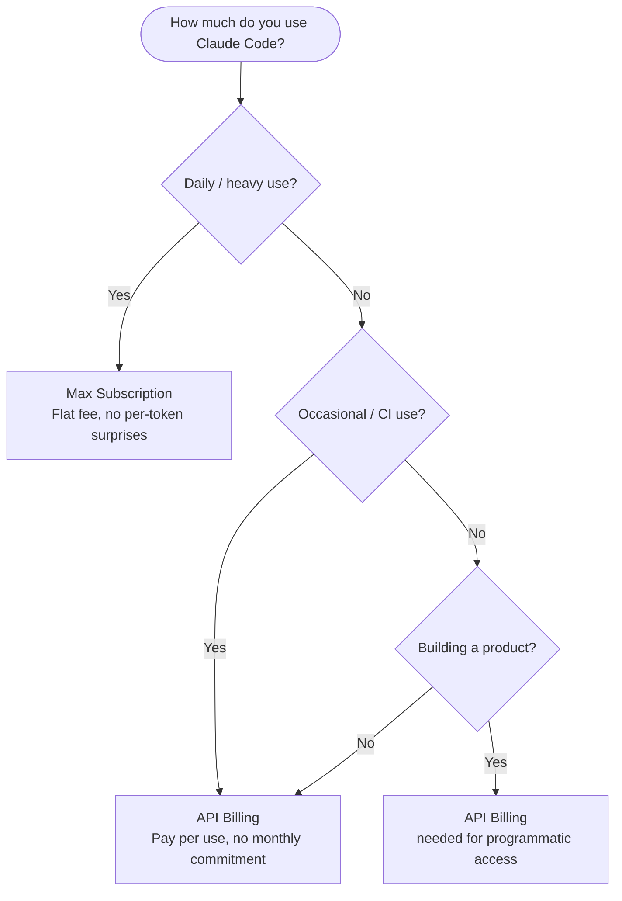

# Claude Code Pricing and Costs

> [!tldr] TL;DR
> Two modes: **Max subscription** (flat monthly fee, includes Claude Code) or **API billing** (per token). API costs add up fast without prompt caching — enable it to save up to 90% on repeated context. Check current usage with `/cost` or `/usage` mid-session.

---

## Two Billing Modes

### Max Subscription

The **Claude Max** plan is a monthly subscription from Anthropic that includes Claude Code at no extra per-token charge:

- Pay once per month — Claude Code sessions don't generate additional API invoices
- Covers all models (Haiku, Sonnet, Opus) within usage limits
- Usage limits apply (soft limits that reset monthly; heavy users may be throttled)
- Best for: engineers using Claude Code several hours per day

**How to activate:** Sign in at claude.ai, subscribe to Max, then run `claude` — it will open a browser OAuth flow.

### API Billing

When you set `ANTHROPIC_API_KEY`, Claude Code bills each session's tokens to your Anthropic API account:

- Charged per token: input tokens + output tokens + cache creation tokens
- Each model has different rates (see table below)
- No subscription required — pay as you go
- Best for: occasional users, CI/CD pipelines, developers already paying for the API

---

## Token Pricing (API Mode)

Exact prices change — always check **console.anthropic.com** for current rates. These figures are approximate ballparks for comparison:

| Model | Input (per 1M tokens) | Output (per 1M tokens) | Cache read (per 1M) |
|---|---|---|---|
| Haiku | ~$0.80 | ~$4 | ~$0.08 |
| Sonnet | ~$3 | ~$15 | ~$0.30 |
| Opus | ~$15 | ~$75 | ~$1.50 |

Key observations:
- Output tokens cost ~5x more than input tokens
- Cache reads cost ~10x less than input tokens
- Opus is ~20x more expensive per token than Haiku

A typical 1-hour Claude Code session with Sonnet (reading files, editing, running tests) might consume 200,000–500,000 input tokens and 20,000–50,000 output tokens. At Sonnet rates, that's roughly $1–$3 per hour — manageable but worth tracking.

---

## What Are Tokens?

Tokens are the unit of text the model processes. Roughly:
- 1 token ≈ 4 characters of English text
- 1,000 tokens ≈ 750 words
- A typical source file (200 lines, 6,000 chars) ≈ 1,500 tokens

**Input tokens** are everything sent to Claude: your prompts + all files Claude reads + conversation history.

**Output tokens** are Claude's responses + code it writes.

Long sessions accumulate large context windows. A 2-hour session on a medium codebase might send 1M+ input tokens if not managed. This is why `/compact` matters — see [[Session_Management]].

---

## Checking Costs

### In-session commands
```
/cost     # Shows token usage and estimated cost for the current session
/usage    # Detailed breakdown of input/output/cache tokens used
```

### API dashboard
- **console.anthropic.com** → Usage → Filter by date or API key
- Set up spend alerts on the dashboard to avoid surprises

---

## Prompt Caching

**Prompt caching** is the single biggest cost-saving feature for heavy Claude Code users on API billing.

When the same content appears at the start of multiple requests (e.g., your CLAUDE.md + a large file), Anthropic's infrastructure caches it. Subsequent requests that include that cached prefix pay **~10x less** for those tokens.

```
First request:     CLAUDE.md (3,000 tokens) → charged at full input rate
Second request:    CLAUDE.md (3,000 tokens) → charged at cache rate (0.10x)
                   New message (200 tokens) → charged at full input rate
```

**How to enable prompt caching in API mode:**

Add `cache_control: {type: "ephemeral"}` to long-lived content blocks. Claude Code does this automatically for CLAUDE.md and large files it reads repeatedly.

**Savings example:** A CLAUDE.md with 2,000 tokens, read at the start of every request (say, 100 requests in a day) with Sonnet:
- Without caching: 100 × 2,000 × $3/1M = $0.60/day
- With caching (90% cache hits): 10 full + 90 × $0.30/1M = near $0
- **Savings: ~90%** on that repeated content

See [[Prompt_Caching]] for the full implementation guide.

---

## Cost-Saving Strategies

| Strategy | How it saves money | How to do it |
|---|---|---|
| Use Haiku for simple tasks | 20x cheaper than Opus | `/model claude-haiku-4-5-20251001` for research/lookups |
| Enable prompt caching | Up to 90% off repeated context | Automatic with Claude Code; verify in API logs |
| Use `/compact` regularly | Reduces input tokens in long sessions | Run `/compact` every 30–60 min of heavy work |
| Avoid re-reading large files | Each read costs tokens | Let Claude use its context rather than re-reading |
| Keep CLAUDE.md focused | Shorter = cheaper on every request | Trim to only project-critical information |
| Use headless mode for bulk tasks | Run once, not interactively | `claude -p` with Haiku for file analysis loops |

---

## Max Subscription vs API — Decision Guide



---

## Common Pitfalls

> [!warning] Pitfall 1 — Long sessions without /compact on API billing
> Context accumulates fast. A 3-hour session without compacting can consume millions of input tokens. Run `/compact` every hour when on API billing.

> [!warning] Pitfall 2 — Not checking /cost before a big task
> Before kicking off a large multi-file refactor, run `/cost` to see where you are in the session. If you're already at a high token count, start a fresh session.

> [!warning] Pitfall 3 — Using Opus for everything on API billing
> Opus is 20x more expensive than Haiku. For routine code-reading tasks, switch to Haiku. Reserve Opus for tasks that genuinely need it.

---

## Review Questions

> [!question] Q1 — What is the main advantage of the Max subscription over API billing?
> Flat monthly fee — no per-token charges, so you can use Claude Code as much as you want without watching the bill.

> [!question] Q2 — How does prompt caching save money?
> Repeated content (like CLAUDE.md or large files) is cached server-side. Subsequent requests that include that cached prefix are charged at ~10x the normal rate — saving up to 90% on that content.

> [!question] Q3 — How do you check how much a session has cost?
> Use `/cost` or `/usage` inside the Claude Code session. For API-level totals, check console.anthropic.com.

---

## See Also

- [[Claude_Models]] — choosing the right model for cost/quality trade-off
- [[Context_and_Memory]] — understanding why context accumulates and how to manage it
- [[Session_Management]] — using /compact to reduce token usage in long sessions
- [[CLAUDE_md_Guide]] — keeping CLAUDE.md concise to reduce per-request costs
