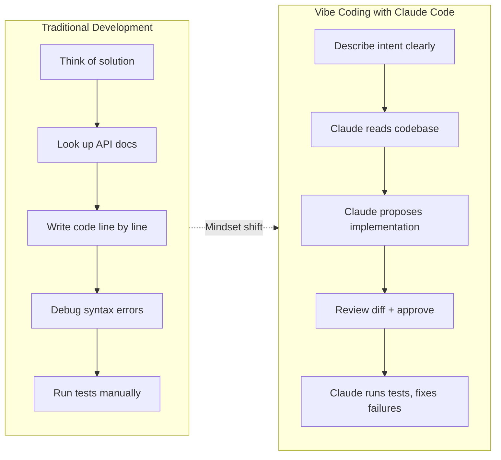

# Vibe Coding with Claude Code

> [!tldr] TL;DR
> Vibe coding means describing **intent** and letting Claude implement. The shift is from "write code" to "direct an agent". It works best for well-scoped tasks with clear acceptance criteria. Stay in the loop by reviewing diffs and running tests rather than watching every keystroke.

---

## What Is Vibe Coding?

"Vibe coding" is informal shorthand for an **AI-first development style** where you describe what you want — in plain language or rough pseudocode — and an AI agent handles the implementation details. The name suggests working at the level of vibes and intent rather than syntax and tokens.

Traditional coding: you type every character, choose every variable name, remember every API signature.

Vibe coding: you describe the desired behavior, the AI writes the first draft, you review and iterate.

Claude Code is purpose-built for vibe coding because it:
- Has a large enough context window to understand a whole codebase at once
- Can edit multiple files in a single turn
- Can run tests, read output, and fix failures autonomously
- Maintains conversation history so you can refine iteratively

---

## The Mindset Shift: Writing → Directing



The most important skill in vibe coding is **writing good intent descriptions**:
- What is the feature supposed to do?
- What are the edge cases?
- What existing patterns should it follow?
- What should it definitely NOT do?

---

## How Claude Code Enables Vibe Coding

| Capability | How it enables vibe coding |
|---|---|
| Long context window | Claude can read your whole codebase before acting |
| Multi-file edits | A single prompt can touch 10 files consistently |
| Bash execution | Claude runs your tests and iterates on failures |
| Conversation history | You can say "make it more defensive" after seeing the output |
| CLAUDE.md | Project conventions persist across sessions — no re-explaining |
| Sub-agents | Parallel work: one agent writes code, another writes tests |

---

## When Vibe Coding Works Best

**High signal, low risk tasks:**
- Adding a new API endpoint that follows existing patterns
- Writing unit tests for an existing function
- Refactoring a module to a new interface
- Migrating from one library version to another
- Writing boilerplate (DTOs, mappers, configs)
- Debugging a failing test with a clear error message

**Tasks where you should stay hands-on:**
- Core algorithm design (novel data structures, performance-critical paths)
- Security-sensitive logic (auth, encryption, input validation on boundaries)
- Database schema changes affecting production data
- Anything requiring business context Claude doesn't have

---

## Staying in the Loop

Vibe coding doesn't mean walking away. You remain the **architect and reviewer**:

1. **Read diffs before approving** — Claude shows you exactly what it wants to change. Read it. A one-second glance catches 80% of issues.

2. **Run tests yourself** — Don't just trust Claude's "tests pass" report. Run the test suite independently after a major change.

3. **Ask for explanations** — "Why did you choose this approach?" is a valid and useful prompt. Claude will explain its reasoning.

4. **Use /plan before big changes** — For multi-file refactors, ask Claude to write a plan first. Review the plan before execution.

5. **Commit incrementally** — Make small commits after each logical step. This gives you rollback points and a readable git history.

---

## Effective Vibe Coding Prompts

| Weak prompt | Strong prompt |
|---|---|
| "Add auth" | "Add JWT authentication to the Express API. Tokens should expire in 24h. Use the existing User model. Follow the same error-handling pattern as the existing middleware." |
| "Fix the bug" | "The test `test_login_rate_limit` fails with a 500 instead of 429. Find the rate limiter middleware and fix it without changing the test." |
| "Write tests" | "Write Jest unit tests for `src/services/PaymentService.ts`. Cover: success path, insufficient funds, network timeout. Mock the Stripe client." |
| "Refactor this" | "Refactor `UserController.ts` to use the repository pattern. Create a `UserRepository` interface and an in-memory implementation for tests." |

The pattern: **what + constraints + follow existing patterns**.

---

## The Feedback Loop in Practice

```
You: "Add pagination to the GET /products endpoint. Use cursor-based pagination.
      Follow the same pattern as GET /orders which already has pagination."

Claude: [reads ProductController, OrderController, understands the pattern]
        [proposes changes to ProductController, ProductService, and a DTO]

You: [review diff] "Looks good, but make the default page size 20 not 10."

Claude: [updates the default, runs existing tests]
        "Tests pass. Should I add tests for the pagination logic?"

You: "Yes."

Claude: [writes tests, runs them, they pass]
        "Done. 3 files changed, 47 lines added."
```

This back-and-forth is the vibe coding loop. Your job is to stay engaged at the **intent and review level**, not the syntax level.

---

## Common Pitfalls

> [!warning] Pitfall 1 — Accepting without reading
> It is tempting to just keep pressing "approve". Always read the diff. Claude is very good but not infallible — it may misunderstand a constraint or miss an edge case.

> [!warning] Pitfall 2 — Vague prompts for complex tasks
> "Improve performance" gives Claude nothing to work with. Specify what is slow, what the target is, and what constraints exist (can't change the DB schema, must keep the same API contract, etc.).

> [!warning] Pitfall 3 — Skipping tests
> Vibe coding can generate plausible-looking code that doesn't actually work correctly. Tests are your safety net. If Claude writes code without tests, ask it to write them.

---

## Review Questions

> [!question] Q1 — What is the core mindset shift in vibe coding?
> Moving from writing code yourself (line by line) to directing an agent at the intent level — describing what you want, reviewing what Claude proposes, and iterating.

> [!question] Q2 — What makes a strong vibe coding prompt?
> Specificity: what the feature should do, what constraints apply, what existing patterns to follow, and what should not change.

> [!question] Q3 — When should you not vibe code?
> Novel algorithm design, security-critical logic, production database migrations, and anything requiring business context that Claude doesn't have.

---

## See Also

- [[Claude_Code_Overview]] — the agentic loop that powers vibe coding
- [[Claude_Models]] — choosing the right model for complex vs simple tasks
- [[CLAUDE_md_Guide]] — encoding project conventions so Claude always follows them
- [[Session_Management]] — managing context so Claude stays focused across long sessions
- [[Subagents_Guide]] — running parallel agents for larger vibe coding workflows
