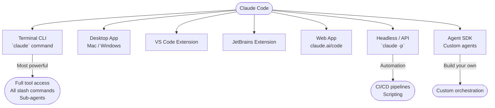

# Ways to Use Claude Code

> [!tldr] TL;DR
> Claude Code has seven interfaces: **CLI** (terminal), **Desktop App** (Mac/Windows), **VS Code extension**, **JetBrains extension**, **Web app** (claude.ai/code), **headless/API mode** (`-p` flag), and the **Agent SDK** for building custom agents. The CLI is the most powerful; IDE extensions add inline convenience.

---

## Overview of Interfaces



---

## 1. Terminal CLI

**The primary and most powerful interface.**

```bash
# Install
npm install -g @anthropic-ai/claude-code

# Start interactive session
claude

# One-shot query (non-interactive)
claude "What does the AuthService class do?"

# Resume last session
claude -c

# Start in a specific directory
claude --add-dir /path/to/project
```

**When to use:** Any time you want the full Claude Code experience — full tool access, sub-agents, all slash commands, MCP servers, hooks, and permission controls.

**Advantages:**
- Complete feature set — nothing is locked out
- Works on any OS with a terminal
- Scriptable and automatable
- Supports all slash commands (`/plan`, `/model`, `/compact`, `/memory`, etc.)

See [[Claude_CLI_Commands]] for the full command reference.

---

## 2. Desktop App

Available for **macOS** and **Windows**. The Desktop App wraps the CLI in a native window with:
- A clean chat interface
- File browser sidebar
- Integrated diff viewer for reviewing changes
- Keyboard shortcuts that don't conflict with the terminal
- Menu bar quick-access on macOS

**When to use:** If you prefer a GUI over a terminal or want to avoid switching between windows. The feature set matches the CLI.

**Download:** claude.ai/download

---

## 3. VS Code Extension

Install from the VS Code Marketplace: search "Claude Code".

**Features:**
- Chat panel in the sidebar (same as CLI but inside VS Code)
- Inline diff review — see changes directly in the editor before accepting
- `@file` references from the open workspace
- "Claude: Explain this code" right-click menu item
- Automatic workspace context (no need to manually specify files)

**When to use:** If you spend most of your time in VS Code and want to avoid context-switching. The extension shares your Max/API credentials.

**Tip:** You can run the CLI and the VS Code extension simultaneously — they share the same session history.

---

## 4. JetBrains Extension

Available for IntelliJ IDEA, PyCharm, WebStorm, GoLand, and other JetBrains IDEs via the JetBrains Marketplace.

**Features:** Similar to the VS Code extension — chat panel, inline diff review, workspace context, quick actions from the editor.

**When to use:** If your primary IDE is a JetBrains product.

---

## 5. Web App (claude.ai/code)

The browser-based interface at **claude.ai/code** provides:
- Full Claude Code chat in a browser window
- No installation required
- Works on any device including tablets
- File upload for providing code snippets
- Limited tool access compared to the CLI (no bash execution in the browser)

**When to use:** Quick questions, reviewing code on a machine without Claude Code installed, or when you only need conversational interaction without file edits.

**Limitation:** The web app cannot execute bash commands or edit files on your local machine. For full agentic work, use the CLI or Desktop App.

---

## 6. Headless / API Mode (`-p` flag)

Run Claude Code non-interactively for automation:

```bash
# One-shot query, output to stdout
claude -p "Summarise the changes in the last 3 git commits"

# Pipe output to another command
claude -p "List all TODO comments in the codebase" | grep CRITICAL

# Use in a shell script
SUMMARY=$(claude -p "What does src/auth/jwt.ts do?")
echo "Auth module: $SUMMARY"

# With a specific model
claude -p --model claude-haiku-4-5-20251001 "Find all console.log statements"
```

**When to use:**
- CI/CD pipelines (automated code review, changelog generation)
- Git hooks (pre-commit checks)
- Shell scripts that need AI reasoning
- Batch processing (analysing many files in a loop)

See [[Headless_Mode]] for advanced patterns including stdin piping and output formatting.

---

## 7. Agent SDK

The **Claude Agent SDK** lets you build custom agents that orchestrate Claude Code programmatically:

```python
import anthropic

client = anthropic.Anthropic()

# Build a custom agent loop
response = client.messages.create(
    model="claude-sonnet-5",
    max_tokens=8096,
    tools=[...],  # your tools
    messages=[{"role": "user", "content": "..."}]
)
```

**When to use:**
- Building a product or internal tool powered by Claude Code
- Custom orchestration logic the standard CLI doesn't support
- Multi-agent systems with specialised workers
- Integrating Claude into an existing application

See [[Subagents_Guide]] for the Claude Code sub-agent system built on top of the SDK.

---

## Comparison Table

| Interface | Install required | Full tool access | Bash execution | Best for |
|---|---|---|---|---|
| Terminal CLI | Yes (npm) | Yes | Yes | Daily development, full power |
| Desktop App | Yes (download) | Yes | Yes | GUI preference, diff review |
| VS Code Ext | Yes (marketplace) | Yes | Yes | VS Code users |
| JetBrains Ext | Yes (marketplace) | Yes | Yes | JetBrains users |
| Web App | No | Partial | No | Quick questions, mobile |
| Headless `-p` | Yes (npm) | Yes | Yes | Scripting, CI/CD |
| Agent SDK | Yes (pip/npm) | Custom | Custom | Building products |

---

## Common Pitfalls

> [!warning] Pitfall 1 — Using the web app for agentic work
> The web app is great for conversation but cannot edit files or run commands on your local machine. For real development work, use the CLI or an IDE extension.

> [!warning] Pitfall 2 — Forgetting headless mode for automation
> Many developers don't realise `claude -p "query"` works as a one-shot command in scripts. This unlocks powerful automation patterns in CI/CD and git hooks.

> [!warning] Pitfall 3 — Running CLI and IDE extension in parallel on the same files
> If both the CLI and the VS Code extension are writing to the same files simultaneously, you can get conflicts. Be intentional about which interface has "control" at any moment.

---

## Review Questions

> [!question] Q1 — Which interface has the most complete feature set?
> The Terminal CLI — it supports all tools, all slash commands, sub-agents, MCP servers, and hooks without any limitations.

> [!question] Q2 — How do you run Claude Code non-interactively in a script?
> Use `claude -p "your query"` — the `-p` flag runs a one-shot query and returns output to stdout, suitable for shell scripts and CI/CD pipelines.

> [!question] Q3 — What is the main limitation of the web app?
> It cannot execute bash commands or edit files on your local machine — it's conversational only.

---

## See Also

- [[Claude_Code_Overview]] — how the agentic loop works across all interfaces
- [[Permission_Modes]] — how permissions differ between interactive and headless modes
- [[Claude_CLI_Commands]] — full reference for all CLI commands and slash commands
- [[Headless_Mode]] — advanced patterns for scripting and CI/CD with `-p`
