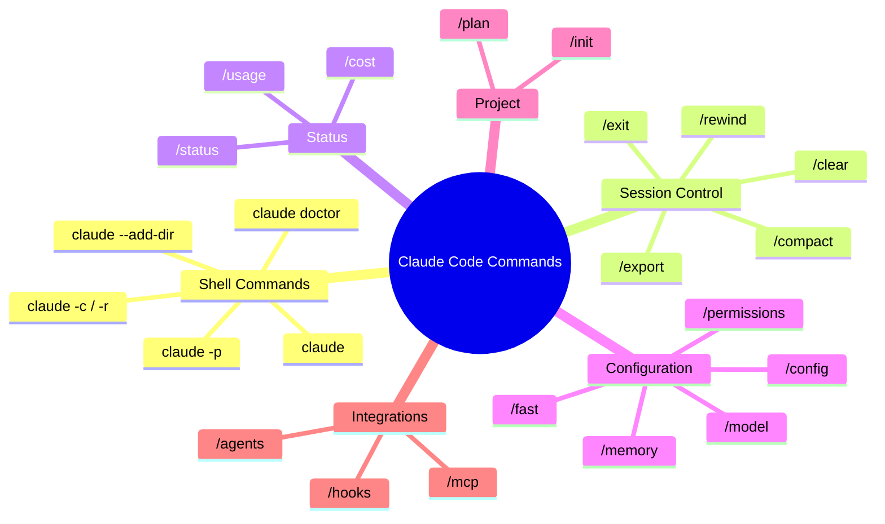

# Claude CLI Commands Reference

> [!tldr] TL;DR
> Claude Code has two command layers: **shell commands** (invoked from your terminal, like `claude -p`) and **slash commands** (typed inside a session, like `/model`). This note is the full cheatsheet for both.

---

## Shell Commands (Outside the Session)

These commands are run from your terminal before or after a session:

| Command | Description |
|---|---|
| `claude` | Start an interactive session in the current directory |
| `claude "query"` | Start a session with an initial prompt (still interactive) |
| `claude -p "query"` | One-shot headless query — prints output to stdout and exits |
| `claude -c` | Resume the most recent session |
| `claude -r` | Pick a past session to resume (interactive list) |
| `claude -r <session-id>` | Resume a specific session by ID |
| `claude --add-dir /path` | Add an extra directory to Claude's allowed file access |
| `claude --model <id>` | Start with a specific model |
| `claude --dangerouslySkipPermissions` | Skip all permission prompts (for CI/CD) |
| `claude doctor` | Diagnose setup: API key, Node version, model access |
| `claude --version` | Print installed version |
| `claude --help` | Show all available flags |

---

## Slash Commands (Inside a Session)

Slash commands are typed at the Claude Code prompt during an active session:

### Navigation and Session Control

| Command | Description |
|---|---|
| `/help` | Show all available slash commands |
| `/exit` or `/quit` | End the session and return to the terminal |
| `/clear` | Clear the conversation — start fresh with no history |
| `/rewind` | Undo the last turn (remove the last message + response) |
| `/compact` | Compress conversation history to reduce context size |
| `/export` | Export the current session to a markdown file |

### Status and Diagnostics

| Command | Description |
|---|---|
| `/status` | Show current session info: model, context size, working dir |
| `/usage` | Detailed token breakdown (input / output / cache) |
| `/cost` | Estimated cost of the current session |
| `/doctor` | Re-run the setup diagnostics |

### Configuration

| Command | Description |
|---|---|
| `/model <id>` | Switch to a different model mid-session |
| `/model` | Show available models and current selection |
| `/fast` | Toggle fast mode (speed vs quality trade-off) |
| `/config` | Open the configuration editor |
| `/permissions` | Show current permission settings for this session |
| `/memory` | Show the content of CLAUDE.md files in scope |

### Project and Planning

| Command | Description |
|---|---|
| `/init` | Generate a CLAUDE.md for the current project |
| `/plan` | Enter plan mode: Claude writes a plan before acting |

### Agents and Integrations

| Command | Description |
|---|---|
| `/agents` | List available sub-agent types |
| `/mcp` | Show connected MCP servers and their tools |
| `/hooks` | Show configured hooks |

---

## Command Map



---

## Commonly Used Combos

### Start a session with a specific model
```bash
claude --model claude-opus-5
```

### Headless summary in CI
```bash
claude -p "Summarise what changed in this PR" --model claude-haiku-4-5-20251001
```

### Resume yesterday's session and check costs
```bash
claude -c
# inside session:
/cost
```

### Compress context before a big task
```
/compact
Tell me about the current architecture before we start refactoring.
```

### Check what permissions are active
```
/permissions
```

### Initialise CLAUDE.md for a new project
```bash
cd my-new-project
claude
# inside session:
/init
```

---

## Input Prefixes (Not Slash Commands)

These are special characters you can prepend to a message to change how it's handled:

| Prefix | Effect |
|---|---|
| `!command` | Run a shell command directly (e.g., `!git status`) |
| `\` at end of line | Continue input on the next line (multi-line message) |
| `@filename` | Reference a file by path in your message |

---

## Common Pitfalls

> [!warning] Pitfall 1 — Confusing /clear and /compact
> `/clear` deletes the entire conversation history — you lose all context. `/compact` summarises it and keeps a compressed version. Use `/compact` unless you genuinely want to start fresh.

> [!warning] Pitfall 2 — Forgetting `claude -p` for scripting
> Many users run interactive sessions when they only need a one-shot answer. `claude -p` is much faster and cleaner for scripting and CI.

> [!warning] Pitfall 3 — Not using /plan for multi-file changes
> Jumping straight into a large refactor without a plan leads to inconsistent changes. Use `/plan` to get Claude to outline its approach first, then approve before execution.

---

## Review Questions

> [!question] Q1 — How do you resume the last Claude Code session?
> Run `claude -c` from the terminal, or use `claude -r` to pick from a list of past sessions.

> [!question] Q2 — What is the difference between /clear and /compact?
> `/compact` compresses the conversation history (keeps a summary, saves tokens). `/clear` deletes the entire history — you start completely fresh.

> [!question] Q3 — How do you run a non-interactive one-shot query?
> Use `claude -p "your query"` — it prints the output to stdout and exits immediately. Suitable for scripts and CI/CD pipelines.

---

## See Also

- [[Keyboard_Shortcuts]] — input shortcuts (Shift+Tab, Ctrl+C, Esc, prefixes)
- [[Session_Management]] — when to use /compact vs /clear vs a new session
- [[Permission_Modes]] — controlling what Claude can do without asking
- [[Context_and_Memory]] — how context accumulates and how to manage it
