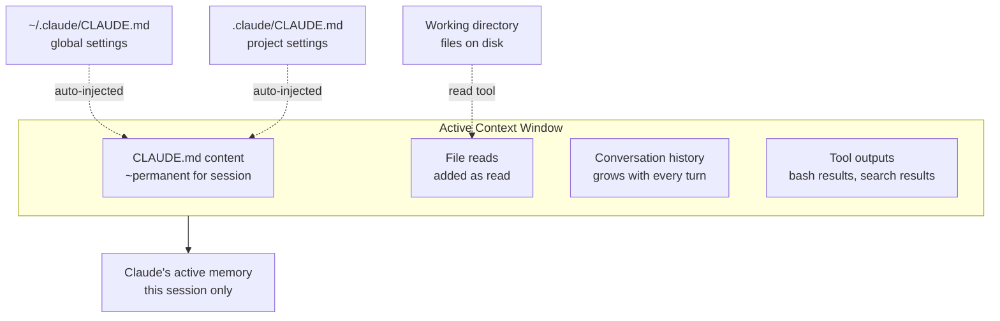

# Context and Memory in Claude Code

> [!tldr] TL;DR
> Claude's "memory" is its **context window** — everything it has read this session. CLAUDE.md is injected at session start as persistent project memory. Use `@file` to reference files, `--add-dir` to expand scope, and `/compact` to free up space. Context is ephemeral between sessions; CLAUDE.md persists.

---

## How Claude Code Uses Memory

Claude Code does not have long-term memory in the way humans do. Its "memory" is the **context window**: the full text of the current conversation, including all files it has read, all tool outputs, and all prior messages.

Everything in the context window is equally "in memory" — there's no difference between what you said 2 minutes ago and what you said 2 hours ago, except that older content is further from the end and may receive less attention in very long contexts.



---

## CLAUDE.md — Persistent Project Memory

The `CLAUDE.md` file (in your project root or `~/.claude/CLAUDE.md` globally) is automatically read at the start of every session and injected into the context window. This makes it the **only truly persistent memory** across sessions.

**What CLAUDE.md provides:**
- Project structure explanation
- Coding conventions and style rules
- Common commands (test, build, lint, deploy)
- What Claude should and should not do
- Pointers to key files

See [[CLAUDE_md_Guide]] for structure and best practices.

```
/memory   # Show current CLAUDE.md content in the session
/init     # Generate a CLAUDE.md for the current project
```

---

## @ File References

Reference a specific file in your prompt using `@`:

```
What is the purpose of @src/config/database.ts?

Compare the error handling in @src/middleware/auth.ts vs @src/middleware/rateLimit.ts

Refactor @src/services/PaymentService.ts to use the repository pattern shown in @src/services/UserService.ts
```

**How it works:**
1. Claude reads the file immediately when the message is processed
2. The file's full content is added to the context window
3. Claude treats the file content as part of your message

**Tab completion** works for `@` references — type `@src/` and press Tab to browse.

**Tip:** Use `@` sparingly for large files. Each file read adds to your context window. For a large codebase, let Claude discover files through its own search tools rather than pre-loading everything.

---

## --add-dir — Expanding File Scope

By default, Claude Code can only access files within the working directory where you launched it. To give Claude access to files in other locations:

```bash
# Grant access to a shared library in a sibling directory
claude --add-dir ../shared-lib

# Multiple directories
claude --add-dir ../common --add-dir ~/company-standards

# Absolute path
claude --add-dir /home/user/workspace/api-contracts
```

**Use cases:**
- Monorepos where you want Claude to reference code in sibling packages
- Shared configuration or schema files outside the project
- Reading documentation or API specs from another directory

> [!important]
> `--add-dir` expands what Claude can **access**, but it still needs permission to **read** each file (unless you've allowed `Read(**)` in your settings). See [[Permission_Modes]].

---

## /compact — Compressing Context

As a session grows, the context window fills up with:
- Verbatim conversation history
- Full file contents that were read
- Tool outputs (test results, git diffs, bash output)

When the context is large, Claude becomes slower (more tokens to process) and API costs increase. Use `/compact` to summarise the history:

```
/compact
/compact Keep focus on the authentication module we've been working on.
```

**What /compact does:**
1. Summarises the conversation history into a shorter form
2. Retains key decisions, current state, and context
3. Drops verbatim exchange details
4. Frees up context window space for new work

**When to compact:**
- After finishing a major sub-task before starting the next
- When the session has been running 30+ minutes
- When you get a context window warning
- Before starting a task that will need to read many large files

---

## Context Flow for a Typical Session

```
1. Session starts
   → CLAUDE.md injected (persistent project instructions)
   → Model loaded, context window empty except CLAUDE.md

2. First prompt submitted
   → Claude reads 3 files to understand the codebase
   → Context: CLAUDE.md + 3 files + your prompt + Claude's response

3. Second prompt: ask for a feature
   → Claude reads 2 more files
   → Claude edits 1 file
   → Context: everything above + 2 new files + edit + responses

4. /compact at turn 10
   → Context compressed to summary + current files
   → Claude continues with the summary in context

5. Session ends
   → Context discarded
   → CLAUDE.md on disk persists for next session
```

---

## Strategies for Large Codebases

| Strategy | How to implement | When to use |
|---|---|---|
| Use CLAUDE.md as a map | Document key directories and files in CLAUDE.md | Always |
| Let Claude search | Ask "find the authentication logic" instead of @-ing 10 files | When you don't know which file matters |
| Be specific with @ | Reference only the files directly relevant to the current task | When you know exactly what's needed |
| Compact after sub-tasks | Run /compact before starting a new feature or bug fix | Every 30–60 min or after major task |
| Use sub-agents for isolation | Spawn a sub-agent with a narrow scope | For isolated research tasks on large repos |
| --add-dir for context | Use --add-dir to include shared code but not everything | Monorepos |

---

## What Claude Remembers vs Forgets

| Information | Persists between sessions? | How to preserve it |
|---|---|---|
| What files were read | No | CLAUDE.md + re-reading at session start |
| What was decided | No | CLAUDE.md, commit messages, PR descriptions |
| Project conventions | Yes (via CLAUDE.md) | Keep CLAUDE.md updated |
| Code changes | Yes (on disk) | Files are written to disk |
| Conversation history | No | /export to save; -c/-r to resume |

---

## Common Pitfalls

> [!warning] Pitfall 1 — Treating context as long-term memory
> Claude forgets everything when a session ends. If a decision was important, write it into CLAUDE.md, a commit message, or documentation — not just in the conversation.

> [!warning] Pitfall 2 — Over-using @ references
> @-ing 10 large files at once fills the context window fast and leaves less space for Claude's reasoning and output. Be selective; let Claude search for what it needs.

> [!warning] Pitfall 3 — Forgetting /compact in long sessions
> A session that has been running for 2 hours without compacting may have a nearly-full context window. Claude becomes less accurate as it approaches the limit. Compact proactively.

---

## Review Questions

> [!question] Q1 — What is the only truly persistent memory in Claude Code?
> CLAUDE.md files (project root and ~/.claude/CLAUDE.md global) — they are auto-injected at the start of every session.

> [!question] Q2 — What does the @ prefix do in a message?
> Tells Claude to read the referenced file and include its full content as part of the current message context. Tab completion works for file paths after `@`.

> [!question] Q3 — Why does context window management matter for API billing?
> Every request to Claude sends the entire context window as input tokens. A 150k-token context window costs 150k input tokens per turn — at Sonnet rates, this adds up quickly in long sessions.

---

## See Also

- [[CLAUDE_md_Guide]] — what to put in CLAUDE.md and how to structure it
- [[Session_Management]] — /compact, /rewind, /clear and session resuming
- [[Claude_CLI_Commands]] — /memory, /compact, --add-dir reference
- [[Claude_Pricing]] — how context window size directly affects API costs
