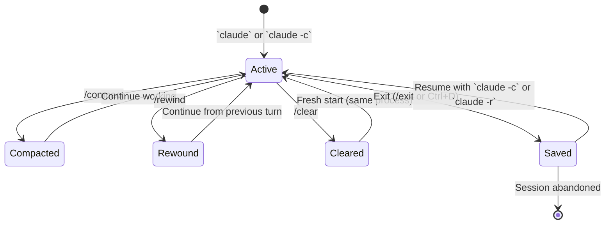

# Session Management in Claude Code

> [!tldr] TL;DR
> Sessions persist with a session ID. Resume with `claude -c` (last) or `claude -r` (pick). Use `/compact` to compress context mid-session and preserve memory. Use `/rewind` to undo the last turn. Start fresh with `/clear` or a new `claude` invocation. Context window limits are real — proactively manage them.

---

## What Is a Session?

A **session** is a conversation thread between you and Claude Code. It contains:
- All messages exchanged (user prompts and Claude responses)
- Records of every tool call (files read, edits made, bash commands run)
- The accumulated context window (history + file contents)

Sessions are stored locally with unique IDs. You can start a new session, resume an old one, or branch from a past session.

---

## Session Lifecycle



---

## Starting and Resuming Sessions

### Start a new session
```bash
claude                        # Interactive, current directory
claude "initial prompt"       # Interactive with first message pre-filled
claude --model claude-opus-5  # New session with specific model
```

### Resume sessions
```bash
claude -c                     # Resume most recent session
claude -r                     # Interactive list of past sessions to pick
claude -r <session-id>        # Resume a specific session by ID
```

Session IDs are displayed when a session ends, or you can find them with `claude -r`.

---

## /rewind — Undo the Last Turn

```
/rewind
```

Removes the **last user message and Claude's response** from the session history. Files edited in that turn are **not automatically restored** — `/rewind` only removes the message from Claude's memory, not the disk changes.

**Use /rewind when:**
- Claude misunderstood your prompt and you want to rephrase
- Claude's response went in the wrong direction and you want to try again
- You want to explore a different approach from the same point

> [!important]
> `/rewind` does not undo file changes on disk. If Claude edited files in the last turn, those edits remain. Use `git checkout` or `git stash` to revert disk changes.

---

## /compact — Compress Context

```
/compact
/compact Focus on the authentication refactor going forward.
```

`/compact` summarises the conversation history into a shorter form, preserving the key decisions and context while freeing up context window space. Optionally pass a focus hint to tell Claude what matters most in the summary.

**When to use /compact:**
- After completing a large sub-task before starting a new one
- When the session has been running for 30+ minutes
- When you get a warning that the context window is nearly full
- Before a big refactor that needs maximum context space

**What /compact keeps:**
- Summary of what was decided and done
- Files that are still relevant
- Current working state

**What /compact loses:**
- Verbatim conversation history
- Detailed reasoning from earlier turns

---

## /clear — Start Fresh

```
/clear
```

Deletes the **entire conversation history** from the current session. The session ID remains the same but the slate is blank. Use this when the prior context is completely irrelevant to your next task.

**Warning:** Unlike `/compact`, there is no recovery after `/clear`. If you need to refer back to earlier work, use `/export` first.

---

## Context Window Limits

Claude has a maximum context window — the total number of tokens (text units) it can hold in memory at once. As a session grows:

1. Early messages get "pushed out" or the model loses track of them
2. Performance degrades on very long contexts
3. API costs increase (more input tokens per request)

Context window sizes (approximate):
- **All current Claude models**: up to 200,000 tokens (~150,000 words)

This sounds large, but it fills up faster than expected in coding sessions:
- A CLAUDE.md: ~1,000–3,000 tokens
- Each source file read: ~500–3,000 tokens
- Conversation turns: ~200–2,000 tokens each
- Test output or build logs: can be thousands of tokens

A 2-hour active session reading many files can easily accumulate 50,000–150,000 tokens.

---

## Decision Table: What to Use When

| Situation | Action | Command |
|---|---|---|
| Claude misunderstood last message | Undo last turn | `/rewind` |
| Context is getting long, still need history | Summarise context | `/compact` |
| Old context is completely irrelevant | Delete all history | `/clear` |
| Want to continue yesterday's work | Resume session | `claude -c` |
| Need to try a different approach from earlier | Resume old session | `claude -r` |
| Context window nearly full warning | Compact now | `/compact` |
| Starting a completely new task | New session or /clear | `claude` or `/clear` |

---

## Export and Archiving

```
/export
/export session-2026-07-29-auth-refactor.md
```

Saves the current session as a markdown file. Useful for:
- Documenting what was done in a session
- Keeping a record before `/clear`
- Sharing a debugging session with a colleague

---

## Best Practices

**Commit frequently during sessions.** Claude Code can make many changes in a session. Small commits after logical milestones give you git-level rollback without needing `/rewind`.

**Use session names.** When resuming with `claude -r`, meaningful prompts at the start of each session help you identify which one to resume.

**Compact before big tasks.** If you've spent 30 minutes on one feature and are about to start a big refactor, `/compact` first so the refactor gets maximum clean context.

**One task per session.** Long sessions that span multiple unrelated features accumulate irrelevant context. Start a new session for each major task.

---

## Common Pitfalls

> [!warning] Pitfall 1 — Using /clear when you meant /compact
> `/clear` is irreversible and loses all history. Use `/compact` in 95% of cases — it preserves the important context while freeing space.

> [!warning] Pitfall 2 — Assuming /rewind undoes disk changes
> `/rewind` only removes the messages from Claude's memory. Files already written to disk stay written. Always check `git status` after a `/rewind`.

> [!warning] Pitfall 3 — Not resuming when you should
> Starting a new session when you should have resumed means re-explaining context. If you're continuing work from yesterday, use `claude -c` and check where you left off.

---

## Review Questions

> [!question] Q1 — How do you resume the most recent session?
> Run `claude -c` from the terminal. For a specific past session, use `claude -r` to get an interactive list, or `claude -r <session-id>` if you know the ID.

> [!question] Q2 — What is the difference between /rewind and /compact?
> `/rewind` removes the last turn (last message + response) from history. `/compact` summarises the entire history into a compressed form without removing it. `/rewind` is for undoing a bad prompt; `/compact` is for freeing up context space.

> [!question] Q3 — Does /rewind restore files that Claude edited?
> No. `/rewind` only changes Claude's memory (removes the last turn from conversation history). Files written to disk are unaffected. Use `git checkout` or `git stash` to revert disk changes.

---

## See Also

- [[Context_and_Memory]] — how context accumulates and what Claude holds in memory
- [[Claude_CLI_Commands]] — full reference for all CLI and slash commands
- [[Keyboard_Shortcuts]] — input shortcuts including Ctrl+C for interrupting responses
- [[Claude_Pricing]] — how session length affects API token costs
