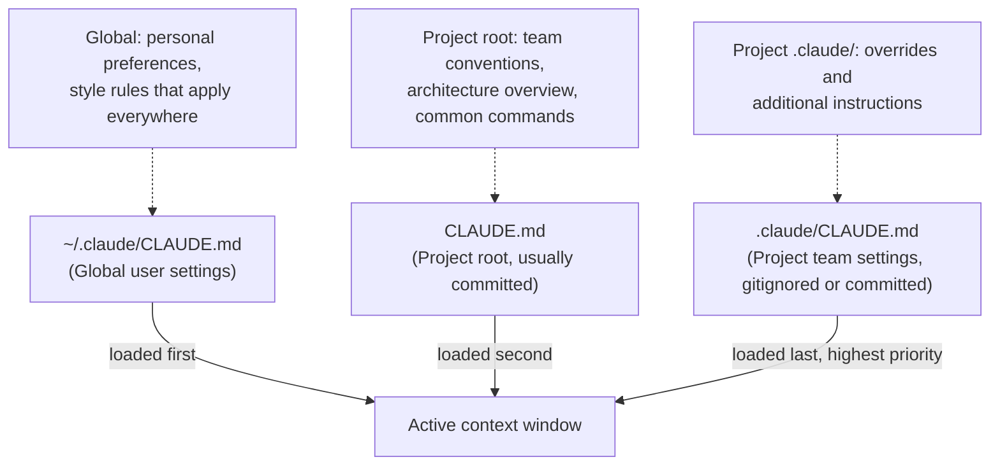

# CLAUDE.md Guide

> [!tldr] TL;DR
> CLAUDE.md is a markdown file auto-read at every session start — it is Claude's persistent memory for your project. Put project structure, conventions, common commands, and rules in it. Hierarchy: global `~/.claude/CLAUDE.md` → project `.claude/CLAUDE.md` → `CLAUDE.md` in root. Keep it focused and current.

---

## What Is CLAUDE.md?

`CLAUDE.md` is a plain markdown file that Claude Code automatically reads at the start of every session. Think of it as **standing instructions** for your project — the things you'd tell a new engineer on their first day that you don't want to repeat every time.

Without CLAUDE.md, every session starts from zero: Claude doesn't know your conventions, your build commands, your naming patterns, or your constraints. With CLAUDE.md, this project knowledge is always in context.

---

## CLAUDE.md Load Hierarchy



All three files are merged into the context window in order. Later files can add to or override earlier ones (Claude reads them as a combined document).

---

## What to Put in CLAUDE.md

### Project Overview
A brief description of what the project does and its architecture:

```markdown
## Project Overview
This is a Node.js REST API for the payments platform.
- Express 5 + TypeScript
- PostgreSQL via TypeORM
- Authentication: JWT (access + refresh tokens)
- Monorepo: /api, /shared, /migrations
```

### Common Commands
The commands Claude will need to run to test, build, and lint:

```markdown
## Common Commands
- `npm test` — runs Jest unit tests
- `npm run test:integration` — requires DATABASE_URL
- `npm run lint` — ESLint + Prettier check
- `npm run build` — TypeScript compile to dist/
- `npm run migrate` — run pending TypeORM migrations
```

### Coding Conventions
Rules that don't appear in the code itself but matter for new additions:

```markdown
## Coding Conventions
- Use `async/await`, never `.then()/.catch()` chains
- All errors must extend `AppError` from `src/errors/AppError.ts`
- Services are stateless — no instance variables
- Never use `any` type — use `unknown` and narrow it
- Validation happens in DTOs (class-validator), not in services
```

### Key Files and Structure
Help Claude navigate the codebase without reading every file:

```markdown
## Key Files
- `src/app.ts` — Express app configuration
- `src/container.ts` — Dependency injection setup (InversifyJS)
- `src/routes/` — Route definitions (no logic, only route registration)
- `src/controllers/` — Input/output handling
- `src/services/` — Business logic
- `src/repositories/` — Database access
- `src/dtos/` — Input/output type definitions + validation
```

### What Claude Should NOT Do
Explicit prohibitions are the most important part:

```markdown
## Do NOT
- Do NOT commit to main directly — always branch + PR
- Do NOT edit migration files that have already been run
- Do NOT use `console.log` — use the logger from `src/logger.ts`
- Do NOT add new npm packages without confirming with the user
- Do NOT run `npm run migrate` without explicitly being told to
- Do NOT expose environment variables in error messages
```

---

## Example CLAUDE.md Structure

```yaml
# [Project Name]

## Overview
[1-2 sentences on what this project is]

## Architecture
[Key technologies, patterns, major components]

## Common Commands
[test / build / lint / run]

## File Structure
[Where to find controllers, services, models, etc.]

## Conventions
[Style, error handling, naming, patterns to follow]

## Do NOT
[Explicit prohibitions]

## Team Notes
[Anything else new contributors need to know]
```

---

## Updating CLAUDE.md During a Session

You can ask Claude to update CLAUDE.md as new conventions emerge:

```
Add a note to CLAUDE.md that all new routes should use the `asyncHandler` wrapper
```

```
Update CLAUDE.md with the fact that we now use Zod for validation, not class-validator
```

Claude will propose the specific edit to CLAUDE.md for your approval. This keeps the file as a living document.

---

## Global CLAUDE.md (~/.claude/CLAUDE.md)

Your global CLAUDE.md applies to all projects and is the right place for:
- Personal preferences (e.g., "I prefer early returns over nested if-else")
- Style choices that apply everywhere (e.g., "use 2-space indentation in JavaScript")
- Tools you always have available (e.g., "ripgrep is available as `rg`")
- How you prefer Claude to communicate (e.g., "be concise — skip preamble")

---

## CLAUDE.md as Living Documentation

The best CLAUDE.md files are maintained alongside the code:
- Update it when you change the architecture
- Add to it when you correct Claude in a session
- Review it before onboarding a new tool or pattern
- Commit it to version control so the team shares the same Claude context

A CLAUDE.md that reflects the current state of the project is more valuable than any README.

---

## Generating CLAUDE.md with /init

Claude Code can generate an initial CLAUDE.md by analysing your project:

```
/init
```

This reads your project structure, `package.json` / `pom.xml` / `pyproject.toml`, existing documentation, and common files to produce a first draft. Review it carefully — the generated version is a starting point, not a finished product.

---

## Common Pitfalls

> [!warning] Pitfall 1 — Too much in CLAUDE.md
> CLAUDE.md is injected on every request. A 10,000-word CLAUDE.md wastes tokens every session and makes it harder for Claude to find the important parts. Keep it concise — aim for 200–500 lines covering only what's genuinely project-specific.

> [!warning] Pitfall 2 — Never updating it
> A CLAUDE.md that describes the architecture from 18 months ago actively misleads Claude. Budget 5 minutes every few weeks to review and update it.

> [!warning] Pitfall 3 — Missing the "Do NOT" section
> Positive instructions tell Claude what to do. The "Do NOT" section tells it what NOT to do — this is equally important. If you keep having to correct the same mistake, add a "Do NOT" entry.

---

## Review Questions

> [!question] Q1 — When is CLAUDE.md read?
> Automatically at the start of every Claude Code session. It is injected into the context window before any user message.

> [!question] Q2 — What is the difference between project CLAUDE.md and global CLAUDE.md?
> Project CLAUDE.md (in the project root or .claude/) contains project-specific conventions, commands, and rules. Global `~/.claude/CLAUDE.md` contains personal preferences that apply to all projects.

> [!question] Q3 — How do you keep CLAUDE.md current?
> Ask Claude to update it during sessions when new conventions are established: "Add a note to CLAUDE.md that...". Review and commit changes alongside code changes.

---

## See Also

- [[Context_and_Memory]] — how CLAUDE.md fits into the session context window
- [[Skills_Guide]] — creating reusable instruction sets beyond CLAUDE.md
- [[Session_Management]] — /memory command to view active CLAUDE.md content
- [[Permission_Modes]] — adding permission rules to CLAUDE.md or settings.json
