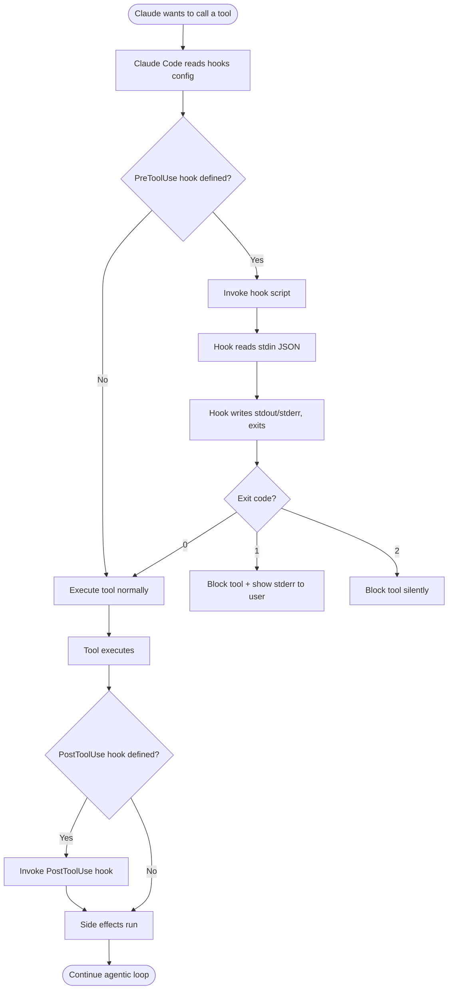

# Hook Configuration

> [!tldr] TL;DR
> Hooks are configured in `.claude/settings.json` under a `hooks` key. Each entry maps a lifecycle event to a script path. The script receives event JSON on stdin, writes user messages to stderr and Claude context to stdout, and signals allow/block via exit code (`0` = allow, `1` = block with message, `2` = block silently).

---

## Where Hooks Live

Hook **scripts** can live anywhere on your filesystem, but by convention they belong in:

```
your-project/
├── .claude/
│   ├── settings.json        ← hook config (event → script path)
│   ├── hooks/               ← hook scripts (by convention)
│   │   ├── pre_tool_use.sh
│   │   ├── post_tool_use.py
│   │   └── session_end.sh
│   └── CLAUDE.md
```

The `.claude/hooks/` directory is not scanned automatically — you must register each script in `settings.json`. Keeping scripts here is a convention, not a requirement.

**Scope**: Claude Code uses the `settings.json` in the **nearest `.claude/` ancestor directory** of the current working directory. Global hooks can be placed in `~/.claude/settings.json`.

---

## Hook Configuration Format

Hooks are declared in the `hooks` object in `.claude/settings.json`. Each key is a lifecycle event name, and its value is the command to execute:

### Minimal example (shell script per event)
```json
{
  "hooks": {
    "PreToolUse": ".claude/hooks/pre_tool_use.sh",
    "PostToolUse": ".claude/hooks/post_tool_use.sh",
    "SessionEnd": ".claude/hooks/session_end.sh"
  }
}
```

### Extended example (Python hooks, with interpreter)
```json
{
  "hooks": {
    "PreToolUse": "python3 .claude/hooks/pre_tool_use.py",
    "PostToolUse": "python3 .claude/hooks/post_tool_use.py",
    "UserPromptSubmit": ".claude/hooks/prompt_filter.sh",
    "SessionStart": ".claude/hooks/on_start.sh",
    "Stop": ".claude/hooks/on_stop.sh",
    "SessionEnd": ".claude/hooks/on_end.sh"
  }
}
```

### Full settings.json with hooks + other config
```json
{
  "model": "claude-sonnet-4-5",
  "permissions": {
    "allow": ["Bash(git *)", "Read"],
    "deny": []
  },
  "hooks": {
    "PreToolUse": "python3 .claude/hooks/security_check.py",
    "PostToolUse": ".claude/hooks/format_on_save.sh",
    "SessionEnd": ".claude/hooks/notify.sh"
  }
}
```

---

## Config Schema Reference

| Key | Type | Description |
|---|---|---|
| `hooks` | object | Top-level hooks config object |
| `hooks.PreToolUse` | string | Command to run before any tool call |
| `hooks.PostToolUse` | string | Command to run after any tool call |
| `hooks.UserPromptSubmit` | string | Command to run when user sends a message |
| `hooks.SessionStart` | string | Command to run when Claude Code starts |
| `hooks.Stop` | string | Command to run when Claude finishes responding |
| `hooks.SessionEnd` | string | Command to run when Claude Code exits |

The command string is passed to the shell as-is. It can include arguments, pipes, or env var substitution:
```json
{
  "hooks": {
    "PreToolUse": "AUDIT_DIR=/var/logs python3 .claude/hooks/audit.py"
  }
}
```

---

## Environment Variables Passed to Hooks

Claude Code injects these environment variables into every hook invocation:

| Variable | Value | Available in |
|---|---|---|
| `CLAUDE_EVENT` | Event name (`PreToolUse`, `PostToolUse`, etc.) | All hooks |
| `CLAUDE_TOOL_NAME` | Tool being called (`Bash`, `Edit`, `Write`, …) | PreToolUse, PostToolUse |
| `CLAUDE_SESSION_ID` | Unique session identifier | All hooks |
| `CLAUDE_WORKING_DIR` | Absolute path to cwd | All hooks |
| `CLAUDE_MODEL` | Model name in use | All hooks |

In addition to env vars, the **full event JSON** is passed on **stdin**. For PreToolUse and PostToolUse, `CLAUDE_TOOL_NAME` duplicates the `tool_name` field in the JSON — it is provided as a convenience for simple shell scripts that don't want to parse JSON.

```bash
#!/bin/bash
# Use env var for quick check
if [ "$CLAUDE_TOOL_NAME" = "Bash" ]; then
  # Parse full JSON from stdin for the command
  CMD=$(cat | python3 -c "import sys,json; print(json.load(sys.stdin)['tool_input']['command'])")
  echo "Running bash command: $CMD" >&2
fi
exit 0
```

---

## Exit Codes

| Exit code | Effect | Message routing |
|---|---|---|
| `0` | Allow action to proceed | — |
| `1` | Block action; show stderr to user | User sees hook's stderr |
| `2` | Block action silently | No message shown |
| `3+` | Treated as block (same as 1) | User sees hook's stderr |

For events that cannot block (`SessionStart`, `PostToolUse`, `Stop`, `SessionEnd`), exit codes are logged but otherwise ignored.

---

## Stdout vs Stderr

Understanding this split is critical to writing correct hooks:

```
Hook script
├── stdout → forwarded to CLAUDE as extra context
└── stderr → shown to the USER as a message
```

**Stdout use case** — inject information into Claude's reasoning:
```bash
# A PreToolUse hook that prints current git status to stdout
# Claude will see this context before deciding what to do
git status --short
exit 0
```

**Stderr use case** — explain a block to the user:
```bash
# A PreToolUse hook that blocks rm -rf and explains why
CMD=$(cat | python3 -c "import sys,json; d=json.load(sys.stdin); print(d['tool_input'].get('command',''))")
if echo "$CMD" | grep -qE 'rm\s+-rf'; then
  echo "BLOCKED: rm -rf is not allowed in this project. Use git clean -fd instead." >&2
  exit 1
fi
exit 0
```

---

## Hook Execution Flow



---

## Shell vs Python Hooks

Both work; pick based on your team's preference:

### Shell hooks — best for simple checks
```bash
#!/bin/bash
# .claude/hooks/pre_tool_use.sh
# Fast, no dependencies, ideal for pattern matching

TOOL=$(printenv CLAUDE_TOOL_NAME)

case "$TOOL" in
  Bash)
    CMD=$(python3 -c "import sys,json; print(json.load(sys.stdin).get('tool_input',{}).get('command',''))" 2>/dev/null)
    if echo "$CMD" | grep -qiE '(drop\s+table|truncate\s+table)'; then
      echo "Blocked destructive SQL command" >&2
      exit 1
    fi
    ;;
esac
exit 0
```

### Python hooks — best for complex logic
```python
#!/usr/bin/env python3
# .claude/hooks/pre_tool_use.py
import sys, json, os, re

event = json.load(sys.stdin)
tool  = event.get("tool_name", "")
inp   = event.get("tool_input", {})

if tool == "Bash":
    cmd = inp.get("command", "")
    DANGEROUS = [r"rm\s+-rf\s+/", r"curl\s+.*\|\s*bash", r"DROP\s+TABLE"]
    for pattern in DANGEROUS:
        if re.search(pattern, cmd, re.IGNORECASE):
            print(f"Blocked: dangerous pattern detected in command", file=sys.stderr)
            sys.exit(1)

sys.exit(0)
```

---

## Making Hook Scripts Executable

Shell scripts must be marked executable before Claude Code can run them:
```bash
chmod +x .claude/hooks/*.sh
```

Python scripts invoked via `python3 script.py` don't need the execute bit, but if using a shebang-style invocation they do:
```bash
chmod +x .claude/hooks/pre_tool_use.py
```

---

## Debugging Hooks

### Test a hook manually
```bash
# Pipe a fake event JSON to your hook and observe exit code + output
echo '{"event":"PreToolUse","tool_name":"Bash","tool_input":{"command":"rm -rf /tmp/test"},"session_id":"test","working_dir":"/home/user/project"}' \
  | python3 .claude/hooks/pre_tool_use.py
echo "Exit code: $?"
```

### Enable verbose hook logging
Add this to your hook script during development:
```bash
echo "[DEBUG] Hook received: $(cat -)" >&2  # ← wrong: consumes stdin before use
```

Instead, capture stdin first:
```bash
INPUT=$(cat)
echo "[DEBUG] Hook got event: $INPUT" >&2
echo "$INPUT" | python3 -c "import sys,json; d=json.loads(sys.stdin.read()); ..."
```

### Check which hooks are active
```bash
cat .claude/settings.json | python3 -m json.tool | grep -A 10 '"hooks"'
```

---

## Common Pitfalls

> [!warning] Pitfall 1 — Reading stdin twice
> Stdin is a one-time stream. If your script runs `cat` or `python3` once, stdin is consumed. A second `cat` gets nothing. Always capture stdin into a variable first: `INPUT=$(cat)`, then pipe `echo "$INPUT"` to subsequent commands.

> [!warning] Pitfall 2 — Forgetting to make shell scripts executable
> If `.claude/hooks/pre_tool_use.sh` is not executable (`chmod +x`), Claude Code will fail to invoke it, and you may get a confusing "permission denied" error. The hook silently fails to run, meaning your policy is not enforced.

> [!warning] Pitfall 3 — Using relative paths in hook commands
> The working directory when Claude Code invokes your hook is the project root, but if a hook script changes directory or calls another script with a relative path, those paths can break. Always use `$(dirname "$0")` or `$CLAUDE_WORKING_DIR` to construct absolute paths inside hook scripts.

---

## Review Questions

> [!question] Q1 — Where does Claude Code look for the hooks configuration?
> In the `hooks` key of `.claude/settings.json` in the nearest ancestor `.claude/` directory. Global hooks can be set in `~/.claude/settings.json`.

> [!question] Q2 — What is the difference between writing to stdout vs stderr in a hook, and when should you use each?
> Stdout is forwarded to Claude as additional reasoning context. Stderr is shown to the user as a human-readable message. Use stdout to give Claude information; use stderr to tell the user why something was blocked.

> [!question] Q3 — How would you debug a hook that doesn't seem to be running?
> Test it manually by piping a fake JSON event to it from the terminal and checking the exit code. Verify the script is executable (`chmod +x`). Check `settings.json` syntax with `python3 -m json.tool`. Confirm the `.claude/` directory is in or above your working directory.

---

## See Also

- [[Hooks_Overview]] — what hooks are, all 6 events, conceptual lifecycle
- [[Hook_Recipes]] — complete working scripts for common use cases
- [[Permission_Modes]] — how permissions and hooks work together
- [[CLAUDE_md_Guide]] — soft configuration that complements hard hook policies
