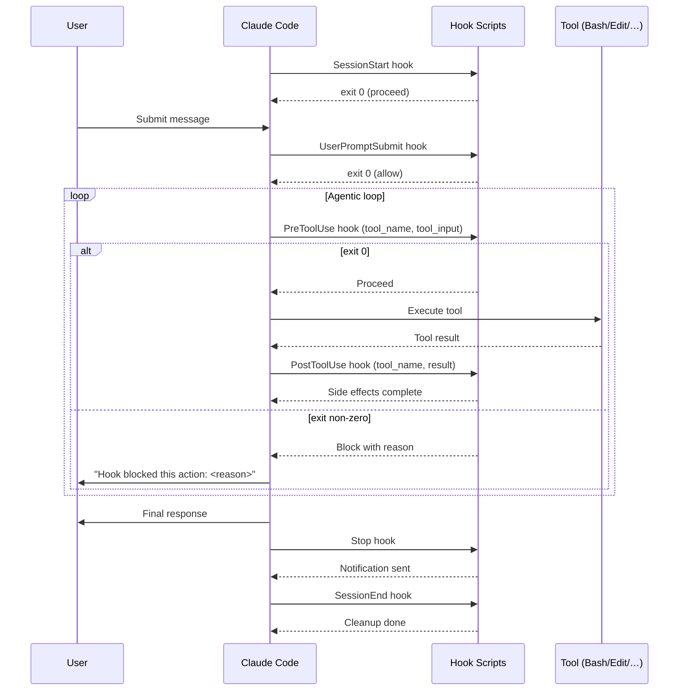

# Claude Code Hooks Overview

> [!tldr] TL;DR
> Hooks are shell commands or scripts that Claude Code runs automatically at specific **lifecycle events** — before/after tool calls, at session start/end, and when a prompt is submitted. Exit code `0` lets the action proceed; non-zero blocks it. Hooks give you policy enforcement, automated side-effects, and observability that regular Claude Code cannot provide.

---

## What Are Hooks?

Hooks are executable scripts (shell, Python, Node, or any binary) that Claude Code invokes at defined points in its operating lifecycle. They receive structured JSON describing the current event and can:

- **Inspect** what Claude is about to do
- **Block** it (by returning a non-zero exit code)
- **Augment** the action (run a formatter, log the event)
- **Notify** external systems or the user

Hooks run in the same shell environment as Claude Code itself, so they inherit your PATH, environment variables, and working directory.

The mental model: hooks are like **git hooks** but for AI tool calls. A `pre-commit` hook can block a bad commit; a `PreToolUse` hook can block a dangerous command.

---

## The 6 Hook Events

| Event | When it fires | Can block? | Primary use |
|---|---|---|---|
| `SessionStart` | Claude Code process starts | No | Setup, load context, log session open |
| `PreToolUse` | Just before Claude executes any tool | **Yes** | Security checks, dry-run checks, rate limiting |
| `PostToolUse` | Just after a tool completes | No | Auto-format, log results, trigger side effects |
| `UserPromptSubmit` | When the user sends a new message | **Yes** | Sanitize input, inject context, enforce topic restrictions |
| `Stop` | Claude finishes a response and pauses for input | No | Notifications, progress updates, context snapshots |
| `SessionEnd` | Claude Code process exits | No | Cleanup, analytics, final log flush |

`PreToolUse` is the most powerful hook: it runs before every tool call (Edit, Write, Bash, Read, Agent, Grep …) and can veto the call entirely.

---

## Lifecycle Sequence Diagram



---

## What Each Hook Receives

Every hook script receives a JSON payload via **stdin**. The schema varies by event, but always includes `event` (string) and `timestamp` (ISO 8601):

### PreToolUse / PostToolUse JSON
```json
{
  "event": "PreToolUse",
  "timestamp": "2026-07-29T14:30:00Z",
  "tool_name": "Bash",
  "tool_input": {
    "command": "rm -rf ./dist",
    "description": "Clean build output"
  },
  "session_id": "ses_abc123",
  "working_dir": "/home/user/project"
}
```

### UserPromptSubmit JSON
```json
{
  "event": "UserPromptSubmit",
  "timestamp": "2026-07-29T14:29:55Z",
  "prompt": "Delete all test files",
  "session_id": "ses_abc123"
}
```

### SessionStart / SessionEnd JSON
```json
{
  "event": "SessionStart",
  "timestamp": "2026-07-29T14:29:00Z",
  "session_id": "ses_abc123",
  "working_dir": "/home/user/project",
  "model": "claude-sonnet-4-5"
}
```

---

## Hook Outputs: Exit Codes and Stdout

Hooks communicate back to Claude Code through two channels:

### Exit Codes
| Exit code | Meaning |
|---|---|
| `0` | Allow the action to proceed |
| `1` | Block and show the hook's stderr message to the user |
| `2` | Block silently (no message shown) |

Any non-zero exit code on a `PreToolUse` hook prevents the tool from running. On events that cannot block (`PostToolUse`, `SessionEnd`, etc.) the exit code is informational only.

### Stdout
Text written to **stdout** by a hook is forwarded to Claude as additional context. This lets hooks inject information into Claude's reasoning — e.g., a hook that runs a lint check before a file write could print lint errors to stdout so Claude knows about them.

### Stderr
Text written to **stderr** is shown to the **user** (not Claude). Use stderr for user-facing messages explaining why an action was blocked.

---

## What Hooks Enable That Regular Claude Code Cannot

Without hooks, Claude Code is a reactive tool: it acts when you ask it to. Hooks turn it into a **policy-enforcing system**:

1. **Mandatory code formatting** — PostToolUse on Edit/Write runs `black`/`prettier` automatically. You don't have to remind Claude to format.

2. **Security guardrails** — PreToolUse on Bash can block any command matching a dangerous pattern (`rm -rf`, `DROP TABLE`, `curl ... | bash`). This works even if Claude misunderstands your intent.

3. **Audit logging** — PostToolUse logs every file change, command run, or agent spawn to a structured log file, independently of Claude's conversation history.

4. **External notifications** — Stop and SessionEnd hooks send desktop notifications, Slack messages, or webhook calls. You can step away from a long-running task and be pinged when it finishes.

5. **Context injection** — UserPromptSubmit hooks can automatically append context (current git branch, open issues, environment state) to every message without you having to type it.

6. **Resource enforcement** — PreToolUse hooks can rate-limit expensive operations (only allow N Bash calls per minute) or enforce cost budgets.

---

## Event × When-to-Use Table

| You want to… | Best hook event |
|---|---|
| Block dangerous shell commands | `PreToolUse` (Bash) |
| Auto-format code after editing | `PostToolUse` (Edit, Write) |
| Log all tool calls to audit file | `PostToolUse` (all) |
| Inject git context into every prompt | `UserPromptSubmit` |
| Send desktop notification when done | `Stop` |
| Run teardown/cleanup on exit | `SessionEnd` |
| Load project context on startup | `SessionStart` |
| Block writes to protected files | `PreToolUse` (Edit, Write) |
| Run tests after file changes | `PostToolUse` (Write) |

---

## Hooks vs CLAUDE.md Instructions

Both hooks and `CLAUDE.md` influence Claude's behavior, but they work at different levels:

| Dimension | CLAUDE.md | Hooks |
|---|---|---|
| Enforcement | Soft (Claude follows as a guideline) | Hard (OS-level block) |
| Scope | Shapes Claude's intent/reasoning | Intercepts tool execution |
| Bypass risk | Claude might ignore under pressure | Cannot be bypassed by Claude |
| Side effects | None | Can run arbitrary code |
| Good for | Conventions, style, project context | Policies, automation, observability |

For anything where you genuinely need a guarantee (not just a preference), use hooks.

---

## Common Pitfalls

> [!warning] Pitfall 1 — Hooks that time out
> Claude Code waits for hooks to complete before continuing. A hook that hangs (network call without timeout, waiting for user input) will freeze your entire session. Always set timeouts in hook scripts: `timeout 5 my_hook_script.sh` or use `curl --max-time 5`.

> [!warning] Pitfall 2 — Blocking every tool call inadvertently
> A PreToolUse hook that accidentally exits non-zero for all events will make Claude Code completely non-functional — every tool call will be blocked. Always test hooks with an explicit allow-list and a catch-all `exit 0` at the end.

> [!warning] Pitfall 3 — Writing to stdout when you meant stderr
> Messages written to stdout are forwarded to Claude, not the user. If you write a block reason to stdout instead of stderr, the user sees nothing and Claude receives confusing extra context. Always send user-facing messages to stderr.

---

## Review Questions

> [!question] Q1 — Which hook event can block a tool from executing, and how does it do so?
> `PreToolUse` fires before any tool call and blocks execution by exiting with a non-zero code. Exit code `1` blocks and shows the hook's stderr to the user; exit code `2` blocks silently.

> [!question] Q2 — What is the difference between what hooks send to stdout vs stderr?
> Stdout is forwarded to Claude as additional context (visible in Claude's reasoning). Stderr is shown to the user as a message. They serve opposite audiences.

> [!question] Q3 — Why are hooks more reliable than CLAUDE.md instructions for enforcing security policies?
> CLAUDE.md instructions are soft guidelines — Claude uses them to inform intent but can deviate. Hooks run at the OS level and intercept the actual tool execution; Claude cannot override them regardless of how it reasons.

---

## See Also

- [[Hook_Configuration]] — where hooks live, JSON config format, environment variables
- [[Hook_Recipes]] — 6 practical hook scripts you can use immediately
- [[CLAUDE_md_Guide]] — soft instructions that complement hard hook policies
- [[Permission_Modes]] — built-in permission controls that pair with hooks
- [[Headless_Mode]] — hooks are especially important in unattended CI runs
