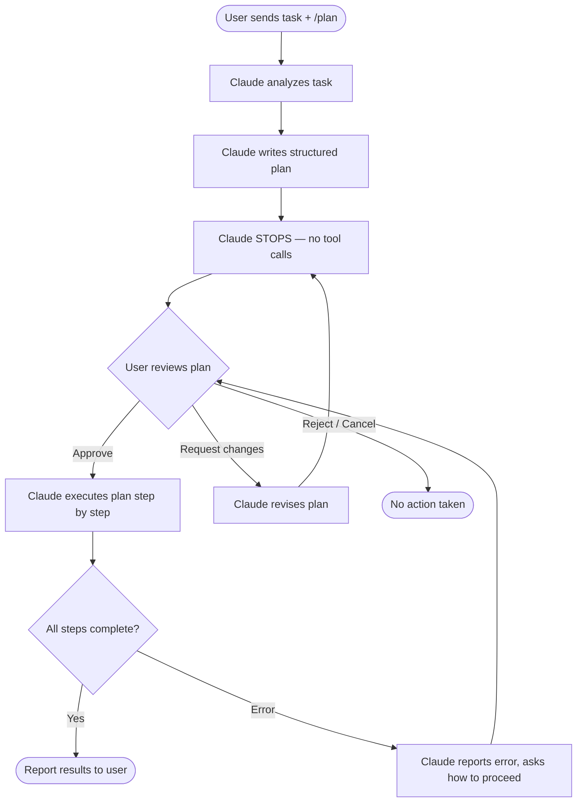

# Plan Mode in Claude Code

> [!tldr] TL;DR
> Plan mode (`/plan`) makes Claude **stop and wait for your approval** before taking any action. Claude produces a structured plan — what it intends to do, which files it will touch, which commands it will run — and waits. You review, refine, or reject. Only after you approve does it execute. Use it for irreversible operations, large refactors, and multi-file changes.

---

## What Is Plan Mode?

By default, Claude Code enters its agentic loop immediately after you send a message: it reads files, runs commands, and makes edits as it goes. This is fast but can be alarming when the task is large or risky.

**Plan mode** inserts a mandatory checkpoint:

1. Claude analyzes the task and produces a written plan
2. Claude **stops** — no tools are executed, no files are changed
3. You read the plan and decide: approve, modify, or reject
4. If approved, Claude executes exactly what it planned
5. If you request changes, Claude revises the plan and stops again

Think of it as the difference between a contractor who starts tearing down walls immediately versus one who shows you blueprints first.

---

## Entering Plan Mode

### Via slash command
```
/plan
```
Type `/plan` at the start of your message or as a standalone command. Claude will respond with its plan and then pause.

```
> /plan Refactor the authentication module to use JWT instead of session cookies
```

### Via the EnterPlanMode skill
If your project has the `plan` skill configured (`.claude/agents/plan.md`), you can invoke it:
```
/plan <task description>
```

### Natural language trigger
You can also ask Claude to plan without the slash command:
```
> Before you do anything, show me your plan for migrating the database schema
```

Claude will produce a plan and pause, though the slash command is more reliable for enforcing the pause.

---

## What a Plan Looks Like

Claude's plan output is a structured markdown response, typically including:

```markdown
## Plan: Refactor Auth Module to JWT

### Summary
Replace session-cookie authentication with JWT tokens in the Express backend.
This will touch 6 files and require a database migration.

### Files to Modify
- `src/middleware/auth.js` — replace session check with JWT verify
- `src/routes/login.js` — issue JWT on successful login
- `src/routes/logout.js` — invalidate JWT (client-side clear)
- `src/models/User.js` — add refresh token field
- `tests/auth.test.js` — update test fixtures
- `config/security.js` — add JWT_SECRET config key

### New Files
- `src/middleware/jwt.js` — JWT helper functions

### Commands to Run
1. `npm install jsonwebtoken`
2. `npx knex migrate:make add_refresh_token`
3. `npm test` (to verify after changes)

### Risks / Assumptions
- All existing sessions will be invalidated (users must log in again)
- JWT_SECRET must be set in .env before deployment
- No changes to frontend (assumes token stored in localStorage)

**Awaiting your approval. Reply 'proceed', request changes, or ask questions.**
```

---

## Reviewing and Approving a Plan

Once you see the plan, you have several options:

| Response | Effect |
|---|---|
| `proceed` / `go ahead` / `looks good` | Claude executes the plan |
| `change X to Y` | Claude revises the plan and presents updated version |
| `skip step 3` | Claude removes that step from the plan |
| `add tests for the new JWT module` | Claude adds the new step to the plan |
| `stop` / `cancel` | Plan is abandoned; Claude does nothing |
| A question | Claude answers without executing anything |

You can iterate on the plan as many times as needed. Claude will not take any action until you explicitly approve.

---

## Plan Mode Flow Diagram



---

## ExitPlanMode

After approving and Claude begins executing, Claude Code exits plan mode automatically. You can also explicitly exit:

```
/exit-plan-mode
```

Or simply start a new unrelated message — Claude Code treats a new message without `/plan` as free-run mode again.

---

## TodoWrite Integration

Plan mode works closely with [[TodoWrite]]. When you approve a plan:

1. Claude calls `TodoWrite` to break the plan into tracked todo items
2. Each step becomes a todo with `pending` status
3. As Claude completes each step, it updates the todo to `complete`
4. You can see real-time progress in the todo list

This gives you a checklist view of the plan's execution, not just a narrative.

```
☑ Install jsonwebtoken dependency
☑ Create src/middleware/jwt.js  
☑ Update src/middleware/auth.js
☐ Update src/routes/login.js   ← currently working
☐ Update src/routes/logout.js
☐ Run tests
```

---

## /agents Mode

`/agents` is a related but distinct mode: instead of one Claude instance executing a plan sequentially, it **spawns multiple specialized sub-agents** to work on parts of the plan in parallel.

```
/agents Refactor the auth module, update all affected tests, and update the API docs simultaneously
```

Claude will:
1. Break the task into parallel-safe subtasks
2. Spawn an agent for each (e.g., one for auth code, one for tests, one for docs)
3. Coordinate results and report when all agents complete

See [[Subagents_Guide]] for the full model of how sub-agents work and when to use them.

---

## Plan Mode vs Free-Run vs Manual

| Mode | How it works | Best for |
|---|---|---|
| **Free-run** (default) | Claude acts immediately, narrates as it goes | Routine tasks, quick fixes, exploration |
| **Plan mode** (`/plan`) | Claude plans first, waits for approval, then acts | Irreversible changes, large refactors, risky ops |
| **Manual step-by-step** | You send one micro-task at a time, review each result | Maximum control, learning mode, debugging |
| **/agents mode** | Claude spawns parallel sub-agents | Large independent subtasks that can run concurrently |

The tradeoff is speed vs. control. Free-run is fastest; manual is safest. Plan mode is the middle ground for production work.

---

## When to Use Plan Mode

**Use plan mode when:**
- The task touches more than 5 files
- The task includes irreversible operations (database migrations, deleting files, modifying config)
- You're working in a production codebase and want to verify scope before Claude starts
- You've had Claude misunderstand a task before (plan review catches misunderstandings before any damage)
- The task has side effects you want to enumerate (what gets installed, what migrations run)

**Skip plan mode when:**
- You're exploring or prototyping (fast iteration is more valuable)
- The task is small and easily reversible (edit one function, run one command)
- You're pairing with Claude in real-time and reviewing each step anyway

---

## Plan Mode vs Just Asking Claude to Explain Its Approach

A common alternative is: "Before you do anything, explain what you're going to do."

This is similar but **not equivalent** to `/plan`:

| Dimension | `/plan` | "Explain first" natural language |
|---|---|---|
| Enforced stop | Yes — no tools called | Not guaranteed — Claude may act while explaining |
| Structured format | Yes — plan template | Varies |
| Revision loop | Yes — built-in revise → re-plan | Manual — you have to ask again |
| TodoWrite integration | Yes | No |

For casual exploration, natural language is fine. For production changes, use `/plan`.

---

## Common Pitfalls

> [!warning] Pitfall 1 — Approving without reading
> The value of plan mode comes from actually reviewing the plan. "Proceed" without reading means you skipped the checkpoint. Pay attention to the "Files to Modify" and "Commands to Run" sections — those are where surprises hide.

> [!warning] Pitfall 2 — Plan drift during execution
> Claude usually follows the approved plan faithfully, but if it encounters an unexpected state (a file doesn't exist, a test fails mid-way), it may deviate. Watch the execution narration and interrupt if Claude starts doing something not in the plan.

> [!warning] Pitfall 3 — Using plan mode for tiny tasks
> Plan mode adds an extra round-trip for every task. Using it for "fix a typo in line 42" slows you down unnecessarily. Reserve it for tasks with meaningful blast radius.

---

## Review Questions

> [!question] Q1 — What happens between Claude writing a plan and executing it?
> Claude stops entirely — no tool calls are made, no files are changed. It waits for the user to reply with an approval, a revision request, or a cancellation. Only an explicit approval triggers execution.

> [!question] Q2 — How does plan mode integrate with TodoWrite?
> When the user approves a plan, Claude calls `TodoWrite` to convert each plan step into a tracked todo item. As steps complete, todos are marked complete. This provides real-time progress tracking during execution.

> [!question] Q3 — What is the difference between `/plan` and `/agents`?
> `/plan` makes a single Claude instance plan then execute sequentially, with a mandatory approval pause. `/agents` spawns multiple specialized sub-agents that work on independent subtasks in parallel — no single-instance sequential execution.

---

## See Also

- [[Subagents_Guide]] — spawning and coordinating sub-agents
- [[Scaling_Claude]] — when to use multiple agents for large tasks
- [[Session_Management]] — managing context across long sessions
- [[Advanced_Patterns]] — how plan mode fits into the Opusplan workflow
