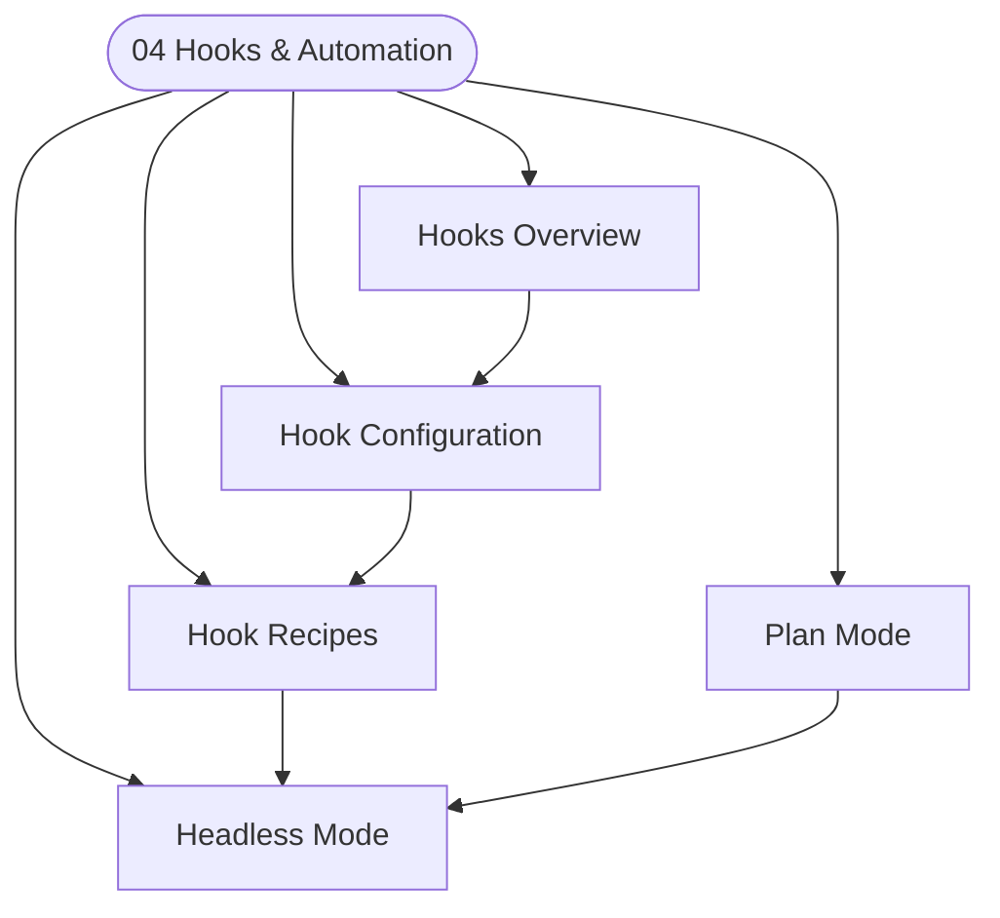

# Section 04 — Hooks and Automation

> This section covers Claude Code's lifecycle hook system and automation capabilities: how hooks intercept tool calls, how to configure them, practical recipes, plan mode for safe execution, and headless/CI mode for scripted workflows.

---

## Notes in This Section

| Note | What it covers | Difficulty |
|---|---|---|
| [[Hooks_Overview]] | What hooks are, the 6 lifecycle events, lifecycle sequence diagram, exit codes, stdout/stderr routing | Advanced |
| [[Hook_Configuration]] | Where hooks live, `settings.json` format, env vars passed to hooks, debugging hooks | Advanced |
| [[Hook_Recipes]] | 6 production-ready scripts: auto-commit, linter, security guard, audit log, notifications, git context injection | Advanced |
| [[Plan_Mode]] | `/plan` command flow, approval loop, TodoWrite integration, `/agents` mode, when to use | Intermediate |
| [[Headless_Mode]] | `claude -p` non-interactive mode, JSON output, GitHub Actions YAML, bash/Python integration, CI security | Advanced |

---

## Section Map

---

## Learning Path

**To understand hooks from scratch**: [[Hooks_Overview]] → [[Hook_Configuration]] → [[Hook_Recipes]]

**To set up safe automation**: [[Headless_Mode]] → [[Hook_Recipes]] (Recipe 3 — security guard)

**For large planned tasks**: [[Plan_Mode]] → [[Scaling_Claude]]

---

## See Also

- [[_MOC_Claude_Code_Master]] — master index for the full Claude Code vault
- [[_MOC_Best_Practices]] — section 05, advanced patterns and workflows
- [[Permission_Modes]] — hooks work alongside the permissions system
