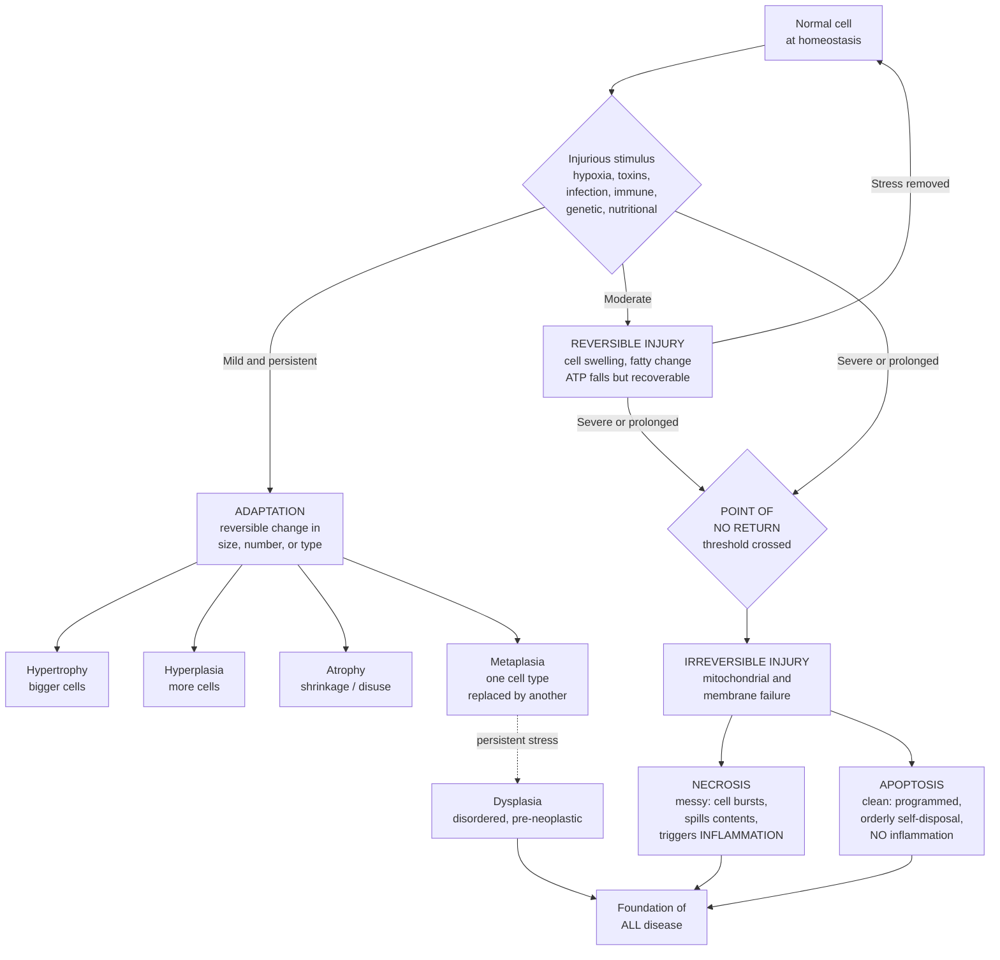

# 🔬 Cellular Injury and Adaptation

> [!abstract] TL;DR
> Every disease, ultimately, is a story told at the level of the cell: cells **adapt**, are **injured**, or **die**. When stress is mild and sustained, cells make **reversible adaptations** in size, number, or type — **hypertrophy** (bigger cells), **hyperplasia** (more cells), **atrophy** (shrinkage), and **metaplasia** (one differentiated type swapped for another). When stress exceeds what adaptation can absorb, the cell is **injured**. Early injury is **reversible** — the cell swells, accumulates fat, its ATP falls, but it recovers if the stress is removed. Past a **point of no return** — catastrophic **mitochondrial** and **membrane** failure — injury becomes **irreversible** and the cell dies. Death takes two fundamentally different forms: **necrosis**, an unregulated, messy rupture that spills cell contents and ignites **inflammation** (heart attack, gangrene, TB caseation); and **apoptosis**, a clean, energy-dependent, **programmed** self-disposal that packages the cell for silent clearance without inflammation (embryonic sculpting, immune selection, and — when it fails — cancer). The central mechanisms are shared and few: **ATP depletion**, **mitochondrial damage**, **reactive oxygen species**, **calcium influx**, and **membrane damage**. Master this **adapt → reversible injury → irreversible death** spectrum and the two death modes, and you hold the cell-level grammar of all of pathology.

---

## Intuition

**Analogy first — cells are workers under changing conditions.**

Picture a workforce inside a factory (the tissue), each worker a cell. Change their working conditions and watch how they respond.

**Push them a little, and they adapt.** Give a worker heavier loads day after day and they build muscle — they grow **bigger and stronger** (that is **hypertrophy**, exactly what a heart does when it pumps against high blood pressure). Give a department more orders and management **hires more workers** (**hyperplasia**). Shut a department down and its idle workers **waste away and are let go** — the department **shrinks** (**atrophy**, what happens to a limb in a cast). And in a hostile environment, a worker may **retrain into a tougher trade** better suited to the new conditions — a soft office clerk becomes a hard-hatted laborer (**metaplasia**, as when acid-battered esophagus turns into stomach-like lining in Barrett esophagus). Adaptation is the workforce staying **alive and functional** by reshaping itself.

**Push them too hard, though, and they get injured.** At first the injury is **reversible** — like an exhausted worker who sputters, swells up, drops their tools, but can still **recover with rest** once you ease off. Keep pushing past a breaking point, and the damage becomes **irreversible**: the worker collapses and will not get up no matter what you do. That threshold — the **point of no return** — is the single most important line in all of pathology, because everything before it is salvageable and everything after it is dead.

**And workers die in two very different ways.** **Necrosis** is a **violent, messy death** — a worker keels over, their body ruptures on the factory floor, spills a hazardous mess, and the alarm bells ring: cleanup crews rush in, the area is inflamed and chaotic (think of a **building collapsing** and making a dangerous mess that everyone has to respond to). **Apoptosis** is the opposite — a **clean, orderly, pre-planned** shutdown. The worker quietly **packs themselves into sealed boxes** and leaves them by the door for disposal, so calmly that the neighbors barely notice and no alarm sounds (a **controlled demolition**, done on purpose, no debris, no panic).

This whole spectrum — **adapt, reversibly injure, irreversibly die (messily or cleanly)** — is the cellular foundation of *all* disease. A heart attack is ischemic **necrosis**. Cancer is, in part, **failed apoptosis** plus adaptation gone wrong (dysplasia). Neurodegeneration is neurons lost to **apoptosis**. Learn the spectrum, and you have learned where every illness begins.

---

## How It Works

### Core mechanics

1. **Homeostasis and reserve.** A normal cell sits in a narrow steady state, buffering ordinary fluctuations. It has spare capacity — reserve — to absorb stress without changing.

2. **Adaptation (reversible, cell stays alive).** When a stress is persistent but sub-lethal, the cell resets its steady state:
   - **Hypertrophy** — increased cell *size* (more organelles and protein), in permanent tissues that cannot divide (cardiac and skeletal muscle). Driven by mechanical load or trophic/hormonal signals.
   - **Hyperplasia** — increased cell *number* via proliferation, in tissues capable of division (endometrium under estrogen, liver after resection, callus on skin).
   - **Atrophy** — decreased size *and* number from reduced workload, denervation, ischemia, loss of hormonal/nutritional support, or aging; mediated by **ubiquitin–proteasome** protein degradation and **autophagy**.
   - **Metaplasia** — replacement of one differentiated cell type by another better suited to the stress (ciliated respiratory epithelium → squamous in smokers; esophageal squamous → columnar in Barrett). It is **reprogramming of stem cells**, not transdifferentiation of mature cells.

3. **Reversible injury (cell alive but sick).** Stress outpaces adaptation. Two hallmark morphologies: **cellular (hydropic) swelling** — failing membrane ion pumps let sodium and water in — and **fatty change (steatosis)** — disrupted lipid handling. ATP falls, ribosomes detach, but organelles and membranes are intact; **remove the stress and the cell recovers.**

4. **The point of no return (irreversibility).** Two events, once severe, define the transition to death: (i) **inability to reverse mitochondrial dysfunction** (no oxidative phosphorylation → no ATP, plus opening of the **mitochondrial permeability transition pore**), and (ii) **profound membrane disturbance** (plasma and lysosomal membranes lose integrity).

5. **The shared final mechanisms of injury** (few causes, common pathways):
   - **ATP depletion** — fails the Na⁺/K⁺ pump (swelling), the Ca²⁺ pump, and protein synthesis; forces anaerobic glycolysis → lactic acidosis.
   - **Mitochondrial damage** — the energy plant fails *and* leaks **cytochrome c**, arming apoptosis.
   - **Reactive oxygen species (ROS) / oxidative stress** — free radicals attack lipids (peroxidation), proteins, and DNA; overwhelm glutathione, catalase, and superoxide dismutase defenses.
   - **Calcium influx** — cytosolic Ca²⁺ rises and activates destructive **phospholipases, proteases, endonucleases, and ATPases**.
   - **Membrane damage** — the endpoint that spills contents (necrosis) and lets lysosomal enzymes autodigest the cell.

6. **Cell death, two modes.**
   - **Necrosis** — *unregulated*, always pathologic. The swollen cell **ruptures**, spilling contents (leaking enzymes such as troponin and LDH are clinical markers) and triggering **inflammation**. Tissue patterns: **coagulative** (architecture preserved, e.g. myocardial infarct), **liquefactive** (dissolved to pus/soft mush, e.g. brain infarct, abscess), **caseous** (cheesy, TB granuloma), **fat** (enzymatic, acute pancreatitis), and **gangrenous** (limb ischemia, dry or wet).
   - **Apoptosis** — *regulated*, energy-**requiring**. The cell **shrinks**, chromatin condenses, DNA is cleaved into orderly fragments, and it blebs into membrane-bound **apoptotic bodies** that are phagocytosed **without inflammation**. Two triggering pathways converge on executioner **caspases**: the **intrinsic (mitochondrial)** pathway (Bcl-2 family balance → cytochrome c → **apoptosome** → caspase-9) and the **extrinsic (death-receptor)** pathway (Fas/TNF → caspase-8).
   - **Regulated necrosis and others** (briefly): **necroptosis** (RIPK1/RIPK3/MLKL — programmed *but* inflammatory), **pyroptosis** (inflammasome → gasdermin pores → IL-1β, in infection), **ferroptosis** (iron-dependent lipid peroxidation), and **autophagy** (self-eating for survival that can tip into death).

### Flow / architecture



---

## Key Concepts

### Secondary (plain-language core)

- **Cells are the unit of disease.** Illness starts when cells cannot cope.
- **Adaptation** = a living cell reshaping itself: grow bigger (**hypertrophy**), make more (**hyperplasia**), shrink (**atrophy**), or change type (**metaplasia**).
- **Injury** comes in two grades: **reversible** (sick but can recover if the stress stops) and **irreversible** (past the point of no return — the cell will die).
- **Two ways to die:** **necrosis** is a messy, accidental burst that causes **inflammation**; **apoptosis** is a tidy, planned self-cleanup that does **not**.
- The commonest cause of injury is **lack of oxygen** (hypoxia / ischemia) — for example, a blocked artery in a heart attack.

### Undergraduate (mechanisms and morphology)

- **Causes of injury:** hypoxia/ischemia (most common), physical, chemical/toxic, infectious, immunologic, genetic, and nutritional agents.
- **Convergent mechanisms:** ATP depletion, mitochondrial damage, ROS/oxidative stress, unregulated cytosolic **calcium**, and membrane damage.
- **Reversible morphology:** cellular (hydropic) **swelling** and **fatty change**. **Irreversible** morphology: severe membrane defects, lysosomal rupture, mitochondrial vacuolization, dense amorphous mitochondrial densities.
- **Necrosis patterns:** coagulative (heart), liquefactive (brain, abscess), caseous (TB), fat (pancreatitis), gangrenous (limb).
- **Apoptosis features:** cell shrinkage, chromatin condensation, internucleosomal DNA cleavage ("laddering"), membrane blebbing, apoptotic bodies, **no** inflammation.
- **Apoptosis pathways:** **intrinsic/mitochondrial** (Bcl-2 vs Bax/Bak balance → cytochrome c → apoptosome → caspase-9 → caspase-3) and **extrinsic/death-receptor** (Fas ligand, TNF → caspase-8 → caspase-3).
- **Dysplasia:** disordered growth and maturation — *not* an adaptation and *not* yet cancer, but the recognized **pre-neoplastic** step.
- **Intracellular accumulations:** lipid (steatosis), protein, glycogen, and pigments (lipofuscin — the "wear-and-tear" pigment; hemosiderin; melanin); plus **pathologic calcification** (dystrophic in dead tissue with normal calcium; metastatic in living tissue with high calcium).

### Graduate (integrative and molecular depth)

- **Ischemia–reperfusion injury:** restoring blood flow can paradoxically worsen damage via a **ROS burst**, calcium overload, complement/neutrophil-mediated inflammation, and opening of the **mitochondrial permeability transition pore (mPTP)** — the biochemical embodiment of the point of no return. Clinical corollary: *time is tissue*, but reperfusion is not free.
- **Bcl-2 family arbitration:** the intrinsic pathway is a rheostat set by pro-apoptotic effectors (**Bax/Bak**), BH3-only sensors (Bid, Bim, Puma, Noxa), and anti-apoptotic guardians (**Bcl-2, Bcl-xL, Mcl-1**). Mitochondrial outer-membrane permeabilization (**MOMP**) releases cytochrome c to assemble the **Apaf-1 apoptosome**.
- **Necrosis vs apoptosis is partly an energy question:** apoptosis is **ATP-dependent** (caspase cascade, active packaging); a cell with catastrophic ATP loss defaults to **necrosis**. A death signal can therefore switch modes with metabolic state.
- **Regulated necrosis expands the dichotomy:** **necroptosis** (RIPK1–RIPK3–MLKL, engaged when caspase-8 is blocked, e.g. by viruses) is *programmed yet inflammatory*; **pyroptosis** (canonical/non-canonical inflammasomes → caspase-1/11 → **gasdermin-D** pores → IL-1β/IL-18) is a host-defense death; **ferroptosis** (GPX4 failure, iron-driven lipid peroxidation) is emerging in neurodegeneration and ischemia.
- **Adaptation ↔ neoplasia continuum:** metaplasia → **dysplasia** → carcinoma in situ → invasion is the histologic ladder of carcinogenesis; failure of apoptosis (e.g. Bcl-2 overexpression in follicular lymphoma, p53 loss) is a hallmark enabling malignancy.
- **Cellular aging:** cumulative damage (DNA, protein, mitochondria), **telomere attrition**, reduced replicative capacity, and **senescence** (irreversible arrest with a pro-inflammatory secretome) intersect with — and are distinct from — apoptotic and necrotic death.

---

## Python Demo

```python
# Cellular Injury & Adaptation — four illustrative sketches (numpy + matplotlib).
# (a) reversible->irreversible threshold, (b) time-dependence of salvage,
# (c) necrosis vs apoptosis markers, (d) adaptive hypertrophy vs load.
# These are conceptual models, NOT calibrated clinical parameters.
import numpy as np
import matplotlib.pyplot as plt

fig, ax = plt.subplots(2, 2, figsize=(13, 9))

# -------------------------------------------------------------------
# (a) Reversible -> irreversible: the "point of no return"
#     Fraction of cells still salvageable vs duration of ischemia.
# -------------------------------------------------------------------
t = np.linspace(0, 60, 400)                 # minutes of ischemia
t_thresh = 25.0                             # threshold (point of no return)
recoverable = 100.0 / (1.0 + np.exp(0.35 * (t - t_thresh)))

ax[0, 0].plot(t, recoverable, color="crimson", lw=2.5)
ax[0, 0].axvline(t_thresh, color="black", ls="--", lw=1.5)
ax[0, 0].axvspan(0, t_thresh, color="mediumseagreen", alpha=0.18)
ax[0, 0].axvspan(t_thresh, 60, color="dimgray", alpha=0.18)
ax[0, 0].text(9, 55, "REVERSIBLE\nrecovers if\nstress removed",
              ha="center", fontsize=9, color="green")
ax[0, 0].text(44, 55, "IRREVERSIBLE\ncell death",
              ha="center", fontsize=9, color="black")
ax[0, 0].annotate("point of no return", xy=(t_thresh, 50),
                  xytext=(t_thresh + 5, 82),
                  arrowprops=dict(arrowstyle="->"), fontsize=9)
ax[0, 0].set_title("(a) Reversible-to-irreversible threshold")
ax[0, 0].set_xlabel("Duration of ischemia (minutes)")
ax[0, 0].set_ylabel("Salvageable cells (%)")
ax[0, 0].set_ylim(0, 105)

# -------------------------------------------------------------------
# (b) "Time is tissue": final infarct size grows with delay to reperfusion.
# -------------------------------------------------------------------
t_reperf = np.linspace(0, 6, 400)           # hours to reperfusion
infarct = 100.0 / (1.0 + np.exp(-1.4 * (t_reperf - 3.0)))

ax[0, 1].plot(t_reperf, infarct, color="darkorange", lw=2.5)
ax[0, 1].fill_between(t_reperf, infarct, color="darkorange", alpha=0.15)
ax[0, 1].axvline(1.5, color="green", ls=":", lw=1.5)
ax[0, 1].text(0.4, 68, "early\nreperfusion\nsalvages", color="green", fontsize=9)
ax[0, 1].text(4.5, 22, "late =\nmore dead\ntissue", color="firebrick", fontsize=9)
ax[0, 1].set_title("(b) Time is tissue: infarct vs delay")
ax[0, 1].set_xlabel("Time to reperfusion (hours)")
ax[0, 1].set_ylabel("Final infarct size (% of tissue at risk)")
ax[0, 1].set_ylim(0, 105)

# -------------------------------------------------------------------
# (c) Two ways to die: necrosis (messy, inflammatory) vs apoptosis (clean).
# -------------------------------------------------------------------
tt = np.linspace(0, 24, 400)                # hours after lethal hit
inflam_necrosis = 100.0 / (1.0 + np.exp(-0.6 * (tt - 6.0)))    # early, steep
dna_frag_apop  = 100.0 / (1.0 + np.exp(-0.5 * (tt - 12.0)))    # orderly, later
inflam_apop    = 8.0 + 2.0 * np.sin(tt / 3.0)                  # stays flat & low

ax[1, 0].plot(tt, inflam_necrosis, color="firebrick", lw=2.5,
              label="Necrosis: inflammation")
ax[1, 0].plot(tt, dna_frag_apop, color="royalblue", lw=2.5,
              label="Apoptosis: DNA fragmentation")
ax[1, 0].plot(tt, inflam_apop, color="royalblue", lw=1.6, ls="--",
              label="Apoptosis: inflammation (stays low)")
ax[1, 0].set_title("(c) Necrosis (messy) vs apoptosis (clean)")
ax[1, 0].set_xlabel("Time after lethal hit (hours)")
ax[1, 0].set_ylabel("Marker level (arb. units)")
ax[1, 0].set_ylim(0, 105)
ax[1, 0].legend(fontsize=8, loc="center right")

# -------------------------------------------------------------------
# (d) Adaptation: chronic load reshapes muscle mass.
#     disuse -> ATROPHY;  training -> HYPERTROPHY;  excess -> overload injury.
# -------------------------------------------------------------------
load = np.linspace(0, 12, 400)              # relative chronic mechanical load
maint = 3.0                                 # maintenance load
baseline = 100.0
hypertrophy = baseline - 35.0 + 55.0 / (1.0 + np.exp(-0.9 * (load - maint)))
overload_injury = 30.0 / (1.0 + np.exp(-2.0 * (load - 10.0)))
mass = hypertrophy - overload_injury

ax[1, 1].plot(load, mass, color="purple", lw=2.5)
ax[1, 1].axhline(baseline, color="gray", ls=":", lw=1.2)
ax[1, 1].axvline(maint, color="gray", ls="--", lw=1.0)
ax[1, 1].text(0.4, 70, "ATROPHY\ndisuse", color="slategray", fontsize=9)
ax[1, 1].text(5.0, 122, "HYPERTROPHY\nadaptive growth", color="purple", fontsize=9)
ax[1, 1].text(9.6, 96, "overload\ninjury", color="firebrick", fontsize=8, ha="center")
ax[1, 1].set_title("(d) Adaptation: muscle mass vs chronic load")
ax[1, 1].set_xlabel("Chronic mechanical load (relative)")
ax[1, 1].set_ylabel("Muscle mass (% of baseline)")

fig.suptitle("Cellular Injury & Adaptation: adapt -> reversible injury -> "
             "irreversible death (necrosis vs apoptosis)", fontsize=12)
fig.tight_layout(rect=[0, 0, 1, 0.96])
plt.savefig("cellular_injury_and_adaptation.png", dpi=130)
plt.show()
```

**What the plots show.** Panel **(a)** makes the reversible/irreversible spectrum concrete: a green *salvageable* zone, a dashed **threshold** (point of no return), and a gray zone of certain death — the biological reason clinicians race the clock. Panel **(b)** turns that into the clinical mantra *"time is tissue"*: the longer reperfusion is delayed, the larger the final infarct. Panel **(c)** contrasts the two death modes — **necrosis** drives an early, steep **inflammation** signal, while **apoptosis** proceeds by orderly DNA fragmentation with inflammation staying **flat and low**. Panel **(d)** shows adaptation as a dose–response: too little load causes **atrophy**, moderate load drives **hypertrophy**, and excessive load tips into **overload injury**.

---

## Real-World Applications

> **Example — Myocardial infarction (the archetype).** A coronary occlusion starves myocytes of oxygen. For roughly the first ~20–30 minutes the injury is **reversible**; beyond the threshold, cells cross into **irreversible** injury and die by **coagulative necrosis**, spilling **troponin** and **CK-MB** into the blood (the biomarkers a lab measures). This is precisely why **door-to-balloon time** and thrombolysis are emergencies — *time is tissue* — and why **ischemia–reperfusion injury** shapes the residual damage even after flow is restored.

- **Ischemic stroke** — brain undergoes **liquefactive** necrosis (unlike the heart), dissolving into a cystic cavity; the "penumbra" is salvageable tissue at the reversible edge of the threshold, the target of thrombectomy.
- **Tuberculosis** — the granuloma's cheesy **caseous** necrosis is a classic morphologic clue tying a death pattern to a specific pathogen and immune reaction.
- **Cancer therapeutics** — many tumors evade **apoptosis** (p53 loss, Bcl-2 overexpression). Drugs such as **BH3-mimetics** (e.g. venetoclax) *restore* the intrinsic apoptotic pathway; radiation and chemotherapy largely kill by driving DNA damage past the apoptotic threshold.
- **Neurodegeneration** — Alzheimer, Parkinson, and ALS feature progressive neuronal loss with prominent **apoptotic** (and ferroptotic) components; understanding the death mode guides neuroprotection research.
- **Cardiac hypertrophy in hypertension** — chronic pressure overload drives adaptive **hypertrophy** that is initially compensatory but, when maladaptive, progresses to **heart failure** — adaptation with a downside.
- **Barrett esophagus** — chronic acid reflux induces **metaplasia** (squamous → columnar) that is monitored endoscopically because it can advance through **dysplasia** to adenocarcinoma.
- **Disuse atrophy** — limb immobilization, bed rest, or microgravity (spaceflight) shrinks muscle and bone via the ubiquitin–proteasome and autophagy pathways, reversible with reloading.
- **Acetaminophen hepatotoxicity** — an overdose generates the reactive metabolite **NAPQI**, depletes hepatic **glutathione**, and unleashes **oxidative stress** and centrilobular necrosis — the rationale for **N-acetylcysteine** as an antidote.

---

## Common Pitfalls

- **Confusing necrosis and apoptosis mechanistically.** Apoptosis is **ATP-requiring**, regulated, and **non-inflammatory**; necrosis is **ATP-depleted**, unregulated, and **inflammatory**. A cell with catastrophic energy failure cannot complete apoptosis and defaults to necrosis — the mode can switch with metabolic state.
- **Assuming adaptation is always benign.** **Dysplasia** is disordered, pre-neoplastic growth — not a healthy adaptation — and pathologic **hypertrophy** can decompensate into heart failure. Adaptation buys time; it is not a guarantee of health.
- **Treating reperfusion as purely good.** Restoring blood flow can *add* injury via a ROS burst, calcium overload, and inflammation (**ischemia–reperfusion injury**). Salvage still wins overall, but the phenomenon is real and clinically managed.
- **Equating atrophy with cell death.** Atrophy is **shrinkage of living cells** (reduced size/number), fully reversible if the stimulus returns; it is an adaptation, not a form of death.
- **Blurring metaplasia and dysplasia.** Metaplasia is an **orderly** swap of one mature cell type for another (reversible reprogramming of stem cells); dysplasia is **disordered** growth on the road to cancer. They are not synonyms.
- **Reading cellular swelling as "the cell is dead."** Swelling (hydropic change) is the **earliest reversible** sign of injury — the cell is sick, not dead.
- **Forgetting that necrosis patterns are organ-specific.** The heart preserves architecture (**coagulative**) while the brain dissolves (**liquefactive**) — same lethal cause, different morphology, because tissue enzyme content differs.

---

## Related Concepts

Within this **Clinical Medicine** vault, `Cellular Injury and Adaptation` is the cell-level starting point that the rest of Foundations builds on. The sibling overview note `Clinical_Medicine_and_Pathophysiology_Overview` frames disease as the systemic expression of these cellular events, while `Etiology_and_Mechanisms_of_Disease` catalogs the causes (hypoxic, toxic, infectious, immune, genetic, nutritional) that push cells across the injury spectrum. The inflammation that necrosis ignites is developed in `Inflammation_and_Tissue_Repair`; the failure-of-apoptosis-plus-dysplasia thread runs directly into `Neoplasia_and_Cancer_Biology`; and the archetypal ischemic-necrosis story is expanded in `Cardiovascular_Pathophysiology`. (These siblings are referenced in prose because they live alongside this note in the same foundations section.)

Cross-vault links (verified to exist):

- [[The_Cell_Membrane_and_Transport]] — membrane pumps and integrity are the first casualty of ATP loss (swelling) and the endpoint whose rupture defines necrosis.
- [[Mitochondria_and_Chloroplasts]] — the mitochondrion is both the failed power plant *and* the source of cytochrome c that arms intrinsic apoptosis.
- [[Bioenergetics_and_ATP]] — ATP depletion is the central node linking every injury mechanism; apoptosis itself is ATP-dependent.
- [[Oxidative_Phosphorylation]] — where ATP is made and where reactive oxygen species (oxidative stress) originate when the chain is disrupted.
- [[Metabolism_and_Bioenergetics]] — the biochemical backdrop (energy currency, redox balance) against which injury and adaptation play out.
- [[Cancer_and_the_Cell_Cycle]] — cancer as failed apoptosis and unchecked proliferation, the dysplasia-to-neoplasia continuation of this note.
- [[Cellular_Senescence_and_Senolytics]] — senescence: a third fate (irreversible arrest, apoptosis-resistant) distinct from adaptation and death.
- [[Hallmarks_of_Aging]] — cellular aging integrates chronic injury, ROS, and impaired proteostasis into organism-level decline.

---

## Review Questions

**Secondary**
1. A person breaks a leg and wears a cast for eight weeks; the muscle underneath shrinks. Which cellular adaptation is this, and is it reversible? Explain in plain terms why the muscle shrank.
2. Describe, without jargon, the essential difference between how a cell dies in **necrosis** versus **apoptosis**, and which one causes inflammation.

**Undergraduate**
3. Trace the sequence of events from coronary artery blockage to irreversible myocyte death. Identify the reversible phase, the point of no return, and the two mitochondrial/membrane events that mark irreversibility.
4. A biopsy of a smoker's airway shows ciliated columnar epithelium replaced by stratified squamous epithelium. Name the adaptation, explain the stem-cell mechanism, and describe how continued stress could advance this toward malignancy.

**Graduate**
5. Given a cell receiving a strong pro-death signal, explain how its **metabolic (ATP) state** can determine whether it undergoes apoptosis, necroptosis, or necrosis. Reference the roles of caspase-8, RIPK3/MLKL, and the mitochondrial permeability transition pore.
6. Reperfusion after ischemia both salvages and injures tissue. Argue mechanistically why reperfusion can worsen cell death, naming at least three contributing pathways, and reconcile this with the clinical imperative to reperfuse as early as possible.

---

## Sources

- Kumar V, Abbas AK, Aster JC. *Robbins & Cotran Pathologic Basis of Disease*, 10th ed. — Chapter on "Cell Injury, Cell Death, and Adaptations." Elsevier.
- Kumar V, Abbas AK, Aster JC. *Robbins Basic Pathology*, 10th ed. — "Cellular Responses to Stress and Toxic Insults." Elsevier.
- Alberts B, et al. *Molecular Biology of the Cell*, 6th ed. — "Cell Death" (apoptosis, Bcl-2 family, caspases). Garland Science.
- Hall JE, Hall ME. *Guyton and Hall Textbook of Medical Physiology*, 14th ed. — cellular energetics and homeostasis. Elsevier.
- Galluzzi L, et al. "Molecular mechanisms of cell death: recommendations of the Nomenclature Committee on Cell Death 2018." *Cell Death & Differentiation* 25:486–541.

---

#clinical-medicine #pathophysiology #cell-injury #apoptosis #necrosis
