# 🩺 Clinical Medicine and Pathophysiology Overview

> [!abstract] TL;DR
> **Pathophysiology** is the study of the *functional and mechanistic changes* that disease produces in the body — the "why" that sits beneath every symptom. It is the bridge from descriptive biology and physiology to clinical medicine: where physiology asks *how a healthy body works*, pathophysiology asks *what happens when it breaks, and why*. Its organizing idea is that disease is a **disturbance of homeostasis** — a genetic, infectious, environmental, or degenerative insult pushes some regulated system out of its safe operating range, and the body's compensations either **fail** or themselves **become harmful**. Clinical medicine adds the reasoning layer: the physician works like a detective, running **backward** from clues (signs, symptoms, tests) to the hidden mechanism, because naming the mechanism is what tells you how to intervene. This note is the **hub and roadmap** for the whole Clinical Medicine vault, surveying its six sections — from general mechanisms of disease, through the organ systems, to how evidence, genomics, and AI are reshaping diagnosis and treatment.

---

## Intuition

**Analogy — the body as a superbly regulated building, and the doctor as its detective.** Picture a large building whose comfort depends on hundreds of control loops: thermostats holding the temperature, valves holding the water pressure, sensors holding the air quality, batteries kept charged. On a good day every loop hovers gently around its target and the building "feels fine." This balanced, self-correcting state is **homeostasis**, and in the body it is what we call **health**. Now imagine something goes wrong — a burst pipe, a failed sensor, a fire, decades of slow corrosion. Some variable is pushed out of its safe range, the building's automatic responses kick in, and either they restore order or they make things worse (a stuck valve floods the basement; sprinklers ruin the servers). The *chain of malfunction* — what broke, what it disturbed, and how the building's own responses compounded it — is the **pathophysiology**. The smoke, the alarms, the puddle in the lobby are the **signs and symptoms**.

Now add the detective. A doctor almost never sees the broken pipe directly. They see the puddle (a swollen ankle), smell the smoke (a fever), hear the alarm (chest pain) — and must reason *backward* from these clues to the hidden fault, because you cannot fix what you have not correctly identified. That backward reasoning from presentation to mechanism is the **clinical method**, and understanding the mechanism is what makes the fix *targeted* rather than lucky. This vault is the **clinical layer** sitting on top of everything you already know from biology: it takes anatomy, cell biology, physiology, and genetics and asks, system by system, *how they go wrong* — and how modern medicine finds and fixes the fault. The through-line is simple and profound: **illness is not random. It has mechanisms, and medicine is the science of finding and reversing them.**

---

## How It Works

### From health to disease and back — the arc of clinical reasoning

1. **Health is regulation.** A healthy body is a mesh of homeostatic loops holding temperature, glucose, blood pressure, pH, fluid volume, and calcium inside narrow safe ranges (see the physiology of this in the linked homeostasis notes below). "Feeling well" is what a fully regulated system feels like.
2. **A disturbance perturbs a system.** Disease begins with an **etiology** — a cause. The four great classes are **genetic** (a broken gene product), **infectious** (a pathogen and the immune response to it), **environmental / acquired** (toxins, trauma, diet, drugs), and **degenerative / age-related** (accumulated wear that erodes reserve). Most common diseases are **multifactorial** — a genetic susceptibility meeting an environmental trigger.
3. **Pathophysiology is the mechanism of malfunction.** The insult pushes a regulated variable out of range; the body's **compensations** engage. Sometimes they buy time (the heart enlarges to pump against high pressure). Crucially, compensation is often a **double-edged sword** — the same enlargement later stiffens and fails. Much of disease is the body's own response turned maladaptive.
4. **Signs and symptoms are the readable output.** A **symptom** is *reported* by the patient (pain, fatigue, nausea); a **sign** is *observed or measured* by the clinician (a fever, a murmur, a lab value). A recurring cluster that travels together is a **syndrome**.
5. **The clinician reasons backward.** Through **history**, **physical examination**, and **investigations** (labs, imaging), the physician builds a **differential diagnosis** — a ranked list of mechanisms that could produce this pattern — and tests to narrow it.
6. **Diagnosis names the mechanism; intervention targets it.** The best treatments act on the pathophysiology itself — replacing a missing hormone, killing a pathogen, unblocking an artery, dampening a runaway immune response — rather than merely muting symptoms.
7. **Restore or manage.** Acute disease may be **cured** (homeostasis restored); **chronic** disease is often **managed** — the loop kept inside a livable range for years.

### Levels of analysis — the same disease at six scales

Pathophysiology reads a disease at every level at once: **molecular** (a mutated channel protein) → **cellular** (injured or dying cells) → **tissue** (inflammation, fibrosis) → **organ** (a failing kidney) → **system** (cardiovascular collapse) → **whole-organism / clinical** (the patient in front of you). A good clinician can move fluently up and down this ladder — from the potassium channel to the palpitations.

### The mechanism-first mindset

```mermaid
flowchart LR
    HEALTH["Healthy body<br/>in homeostasis<br/>systems within safe range"]
    DIST["Disturbance / etiology<br/>genetic, infectious,<br/>environmental, degenerative"]
    PATHO["Pathophysiology<br/>the mechanism of malfunction<br/>compensations fail or turn harmful"]
    SS["Signs and symptoms<br/>signs observed and measured<br/>symptoms reported by patient"]
    REASON["Clinician reasons backward<br/>history, examination, tests<br/>differential diagnosis"]
    DX["Diagnosis<br/>name the mechanism"]
    RX["Intervention<br/>targets the mechanism"]
    OUT["Outcome<br/>restore homeostasis<br/>or manage chronically"]

    HEALTH -->|"insult pushes a system out of range"| DIST
    DIST --> PATHO
    PATHO -->|"malfunction produces clues"| SS
    SS -->|"clues to be decoded"| REASON
    REASON --> DX
    DX --> RX
    RX --> OUT
    OUT -.->|"if reversible, health restored and loop closes"| HEALTH
```



*Read left to right as the natural history of illness; read the clinician's arrow right to left — the whole art of diagnosis is running this chain backward, from the visible clue to the invisible mechanism.*

---

## Key Concepts

### Secondary (intuitive)

- **Pathophysiology** = the study of *what goes wrong inside the body* during disease, and *why* — the mechanism behind the symptoms.
- **Homeostasis** = the body keeping its insides steady and safe; **disease** is often that balance breaking down.
- **Symptom vs sign** = a symptom is what the *patient feels and reports* (a headache); a sign is what the *doctor sees or measures* (a rash, a high temperature).
- **Cause vs course** = **etiology** is *what caused* a disease; **pathogenesis** is *how it unfolds* step by step.
- **Diagnosis** = figuring out which disease mechanism explains the clues — like a detective solving a case.

### Undergraduate (formal)

- **Etiology and pathogenesis.** *Etiology* = the causative agent or factor; *pathogenesis* = the sequence of cellular and molecular events from that cause to the clinical picture. Categories of cause: genetic, infectious, immunologic, neoplastic, nutritional/metabolic, toxic/environmental, degenerative, iatrogenic (caused by treatment), and **idiopathic** (unknown).
- **Compensation and decompensation.** The body defends threatened variables (tachycardia in blood loss, ventricular hypertrophy in hypertension). **Decompensation** is the point where compensations are exhausted or become themselves pathological — the hinge of much chronic disease.
- **Acute vs chronic.** *Acute* = rapid onset, short course, often reversible; *chronic* = slow, sustained, frequently driven by low-grade inflammation and progressive tissue remodeling (fibrosis).
- **The clinical method.** History → examination → investigations → **differential diagnosis** → working diagnosis → management → review. Reasoning combines **pattern recognition** (fast, illness-script matching) with **hypothetico-deductive** testing (slow, ruling in/out).
- **Signs, symptoms, syndromes.** A **syndrome** is a reproducible constellation without a single defined cause; a **disease** implies a defined mechanism. The same symptom (dyspnea) can arise from many mechanisms across many systems — hence the differential.

### Graduate (mechanistic and systems)

- **Disease as a control-system failure.** Physiology *is* closed-loop negative feedback; pathophysiology is that loop degrading — **loss of a sensor or effector** (β-cell death opens the glucose loop in type 1 diabetes), **low controller gain** (insulin resistance blunts correction), **excess gain plus delay** (oscillatory instability), or a **pathologically reset set point** (fever, sustained hypertension) the body now defends *against* correction. Kotas and Medzhitov reframe many chronic diseases as maladaptive stable states — homeostasis "settling" on the wrong equilibrium.
- **Reserve, robustness, and frailty.** Health carries **homeostatic reserve** — margin between coping and failing. Aging and chronic disease erode reserve until small perturbations trigger disproportionate, cascading failure. **Frailty** is quantifiable reserve depletion; the loss-of-complexity theory ties it to reduced physiological variability.
- **Final common pathways.** Many distinct etiologies converge on a small set of stereotyped tissue responses — **cell injury and death** (apoptosis vs necrosis), **inflammation**, **fibrosis / repair**, **ischemia**, and **neoplastic transformation**. Learning these general mechanisms once lets you decode countless specific diseases.
- **Multifactorial risk and the genome–environment interface.** Common disease is polygenic susceptibility integrated over a lifetime of exposures (the "exposome"). Risk is probabilistic, not deterministic — which is why prevention, screening, and **evidence-based** thresholds, not single causes, dominate modern practice.
- **Nosology and its limits.** Disease categories are useful abstractions, not natural kinds; molecular medicine increasingly **splits** old clinical labels (e.g., "breast cancer" into distinct molecular subtypes) and **lumps** others by shared pathway — the frontier of **precision medicine**.

---

## Python Demo

```python
# Two views of the clinical/pathophysiology landscape:
#   (a) HOMEOSTASIS AS THE ESSENCE OF HEALTH: a regulated variable (blood glucose)
#       held near a SET POINT by negative feedback. Healthy = strong feedback -> the
#       variable stays inside the safe band. Disease = weak feedback + failing
#       clearance -> the variable DRIFTS OUT of range. Disease = loss of regulation.
#   (b) THE DISEASE-BURDEN MAP: leading causes of death worldwide by category,
#       the terrain this vault's organ-system sections are built to explain.
import numpy as np
import matplotlib.pyplot as plt

rng = np.random.default_rng(7)

# ---------- (a) Homeostasis: a set-point defended by negative feedback ----------
n          = 400
t          = np.arange(n)
set_point  = 90.0            # blood-glucose set point, mg/dL
lo, hi     = 70.0, 140.0     # safe operating range
dist       = rng.normal(0.0, 6.0, size=n)   # random disturbances: meals, activity, stress

def regulate(gain, bias=0.0):
    """gain = strength of negative feedback; bias = failing clearance (upward drift)."""
    x = np.empty(n); x[0] = set_point
    for i in range(n - 1):
        # response OPPOSES deviation from set point (negative feedback) + disturbance
        x[i + 1] = x[i] - gain * (x[i] - set_point) + dist[i] + bias
    return x

healthy = regulate(gain=0.30, bias=0.0)     # strong feedback -> tight control
disease = regulate(gain=0.03, bias=0.5)     # weak feedback + failing clearance -> drift

# ---------- (b) Global disease-burden map (approximate WHO-style figures) ----------
causes = ["Cardiovascular", "Cancers", "Respiratory\n(chronic)",
          "Infectious &\nneonatal", "Neurological\n& dementia", "Metabolic,\ndiabetes & renal"]
deaths = [17.9, 10.0, 4.0, 6.5, 2.5, 3.3]   # millions of deaths per year, approximate
order  = np.argsort(deaths)
causes = [causes[i] for i in order]
deaths = [deaths[i] for i in order]

fig, (ax1, ax2) = plt.subplots(1, 2, figsize=(14, 5.5))

# --- panel (a) ---
ax1.axhspan(lo, hi, color="#2ecc71", alpha=0.12, label="Safe range (70-140)")
ax1.axhline(set_point, color="grey", ls="--", lw=1, label="Set point (90 mg/dL)")
ax1.plot(t, healthy, color="#27AE60", lw=1.8, label="Healthy: strong feedback -> regulated")
ax1.plot(t, disease, color="#C0392B", lw=1.8, label="Disease: weak feedback -> drifts out")
ax1.set_xlabel("Time")
ax1.set_ylabel("Blood glucose (mg/dL)")
ax1.set_title("(a) Health is regulation; disease is its failure")
ax1.set_ylim(40, 220)
ax1.legend(loc="upper left", fontsize=8)
ax1.grid(alpha=0.3)

# --- panel (b) ---
colors = ["#8E44AD", "#16A085", "#F39C12", "#E67E22", "#2980B9", "#C0392B"]
ax2.barh(causes, deaths, color=colors)
for i, v in enumerate(deaths):
    ax2.text(v + 0.15, i, f"{v:.1f}M", va="center", fontsize=9)
ax2.set_xlabel("Deaths per year worldwide (millions, approximate)")
ax2.set_title("(b) The disease-burden map this vault explains")
ax2.set_xlim(0, 20)
ax2.grid(axis="x", alpha=0.3)

plt.tight_layout()
plt.show()

print(f"Healthy glucose  -> mean {healthy.mean():5.1f}, in-range {np.mean((healthy>=lo)&(healthy<=hi))*100:4.1f}% of time")
print(f"Diseased glucose -> mean {disease.mean():5.1f}, in-range {np.mean((disease>=lo)&(disease<=hi))*100:4.1f}% of time")
```

**What you see.** *Panel (a)* is the whole thesis of the vault in one picture: the green curve, with strong negative feedback, is pulled back to its set point after every random disturbance and spends nearly all its time inside the safe band — that steadiness *is* health. The red curve, given the *same* disturbances but a **degraded loop** (weak feedback plus failing clearance), swings wildly and **drifts out of the safe range** — the mechanical picture of disease as *loss of regulation*, not some new physics. *Panel (b)* is the terrain: the categories that dominate global mortality — cardiovascular, cancer, respiratory, infectious, neurological, metabolic/renal — are exactly the organ-system sections this vault is organized around. Every bar is a family of broken loops waiting to be mechanistically decoded.

---

## Real-World Applications

- **The diagnostic workup.** Every clinical encounter — history, examination, labs, imaging, differential diagnosis — is applied pathophysiology: reasoning from a pattern of clues back to the mechanism that generated them.
- **Mechanism-targeted therapy.** The most powerful treatments hit the pathophysiology directly: thrombolysis dissolves the clot in a heart attack, insulin replaces the missing hormone in type 1 diabetes, antibiotics kill the pathogen, immunosuppressants dampen autoimmune attack, and targeted oncology drugs block a specific driver mutation.
- **Vital signs and lab panels as loop readouts.** Blood pressure, temperature, oxygen saturation, and metabolic panels are direct measurements of how well the body's homeostatic loops are holding — the daily numeric language of the ward.
- **Screening and prevention.** Public-health screening (blood pressure, cholesterol, glucose, cancer screening) catches loops drifting *before* symptoms appear, exploiting the fact that reserve hides early disease until provoked.
- **Precision and genomic medicine.** Molecular subtyping splits broad diagnoses into mechanistically distinct diseases with distinct treatments — the frontier where genetics reshapes the very categories of illness.
- **Clinical AI and decision support.** Machine-learning systems for imaging, risk prediction, and differential-diagnosis support are, at heart, automating parts of the backward-reasoning chain from clue to mechanism.

---

## Common Pitfalls

- **Treating the number, not the mechanism.** Forcing a lab value or vital sign back to "normal" without addressing the underlying loop invites rebound and side effects. Ask *why* the variable moved before you push it back.
- **Confusing a compensation with the disease.** Fever, tachycardia, and inflammation are often *the body's response*, not the enemy. Blindly suppressing an adaptive response (crushing a moderate fever, over-correcting a compensatory tachycardia) can harm.
- **Mistaking correlation for etiology.** A finding that *travels with* a disease is not necessarily its *cause*. Etiology, risk factor, and epiphenomenon are three different things — a distinction evidence-based medicine exists to enforce.
- **Anchoring on the first diagnosis.** Latching onto an early hypothesis and ignoring later contradicting clues is the classic cognitive trap; the discipline of a *differential* diagnosis is the antidote.
- **Forgetting reserve.** A young or fit body compensates so well that serious loop degradation stays invisible until stress (surgery, infection, dehydration) unmasks it. Resting normality does not equal health.
- **Reifying disease labels.** Diagnostic categories are useful maps, not the territory. The same label can hide several mechanisms; the same mechanism can wear several labels. Molecular medicine is steadily redrawing the boundaries.
- **Reading this as medical advice.** This vault teaches *mechanisms of disease* at textbook level; it is not guidance for any individual's care, which always depends on a clinician and the specifics of a real patient.

---

## Related Concepts

**Within this vault (Section 01 – Foundations, and beyond).** This overview is the entry point; the section notes that flesh out each idea are planned companions. *Cellular Injury and Adaptation* details how cells respond to stress and die (apoptosis vs necrosis) — the molecular floor of all disease. *Inflammation and Tissue Repair* covers the body's stereotyped response to injury and how it turns from healing to harm (fibrosis). *Etiology and Mechanisms of Disease* systematizes the categories of cause and the logic of pathogenesis. *Neoplasia and Cancer Biology* treats the special case of regulation lost at the level of the cell cycle. The organ-system sections then apply these foundations: *Cardiovascular Pathophysiology* and its siblings work loop by loop through each system. Finally, *Diagnostic Reasoning and Clinical Decision Making* formalizes the backward-reasoning method sketched here, and *The Reach and Future of Clinical Medicine* looks at evidence, genomics, and AI. These are prose references to sibling notes within the Clinical Medicine vault.

**Across the vault (Glob-verified links).**

- [[Biology/09_Human_Physiology_and_Anatomy/Homeostasis_and_the_Nervous_System|Homeostasis and the Nervous System]] — the physiology this vault presupposes: negative feedback, the reflex arc, and the loops that disease breaks.
- [[Health_Nutrition_and_Longevity/01_Foundations_of_Health/Homeostasis_and_Human_Physiology|Homeostasis and Human Physiology]] — the applied-health view of regulation, allostasis, and reserve; the mirror image of "disease as regulatory failure."
- [[Biology/06_Cell_Division_and_Reproduction/Cancer_and_the_Cell_Cycle|Cancer and the Cell Cycle]] — the cell-cycle basis of neoplasia, foundational to this vault's cancer material.
- [[Biology/05_Genetics_and_Heredity/Human_Genetics_and_Genetic_Disorders|Human Genetics and Genetic Disorders]] — the genetic class of etiology at introductory depth.
- [[Genetics/05_Human_and_Medical_Genetics/Mendelian_Genetic_Disorders|Mendelian Genetic Disorders]] — single-gene disease mechanisms, the cleanest examples of genotype-to-phenotype pathophysiology.
- [[Genetics/05_Human_and_Medical_Genetics/Pharmacogenomics_and_Personalized_Medicine|Pharmacogenomics and Personalized Medicine]] — how genomics is turning "one drug for all" into mechanism-matched, precision therapy.
- [[Neuroscience/06_Clinical_and_Applied_Neuroscience/Neurodegenerative_Diseases|Neurodegenerative Diseases]] — the degenerative etiology worked out in detail for the nervous system.
- [[Health_Nutrition_and_Longevity/06_Public_Health_and_Prevention/Public_Health_and_Epidemiology|Public Health and Epidemiology]] — the population-level counterpart: measuring disease burden and testing what actually works.
- [[Biology/11_Microbiology_and_Immunology/The_Adaptive_Immune_System|The Adaptive Immune System]] — the immune machinery behind infectious and autoimmune disease mechanisms.

---

## Review Questions

**Secondary.** In your own words, what is the difference between a *symptom* and a *sign*, and why does a doctor need both? Using the idea of the body as a building full of thermostats, explain what it means to say "disease is homeostasis breaking down."

**Undergraduate.** Distinguish *etiology* from *pathogenesis* and give an example of each for a disease of your choice. Then explain why a physician's *differential diagnosis* is safer than committing to a single diagnosis early — what cognitive error does the differential guard against, and how does the mechanism-first mindset help rank the possibilities?

**Graduate.** Frame a chronic disease (e.g., type 2 diabetes or heart failure) as a *control-system failure*. Identify what plays the role of set point, sensor, controller gain, and effector, and explain whether the pathology is best described as loss of a component, low loop gain, a pathologically reset set point, or depleted reserve. How does this framing change what "successful treatment" should aim at — a normal number, or a repaired loop — and where might the two diverge?

---

## Sources

- Kumar, V., Abbas, A. K., & Aster, J. C. *Robbins & Cotran Pathologic Basis of Disease* (10th ed.). Elsevier — the standard reference on general and systemic pathophysiology.
- Hall, J. E., & Hall, M. E. *Guyton and Hall Textbook of Medical Physiology* (14th ed.). Elsevier — the physiological substrate that pathophysiology builds on.
- Loscalzo, J., Fauci, A., Kasper, D., et al. (eds.). *Harrison's Principles of Internal Medicine* (21st ed.). McGraw-Hill — clinical medicine and the diagnostic method.
- Feather, A., Randall, D., & Waterhouse, M. (eds.). *Kumar and Clark's Clinical Medicine* (10th ed.). Elsevier — integrated clinical presentation-to-mechanism reasoning.
- Kotas, M. E., & Medzhitov, R. (2015). "Homeostasis, Inflammation, and Disease Susceptibility." *Cell*, 160(5), 816–827 — disease as failed homeostasis.

---

#clinical-medicine #pathophysiology #disease-mechanisms #homeostasis #diagnosis
