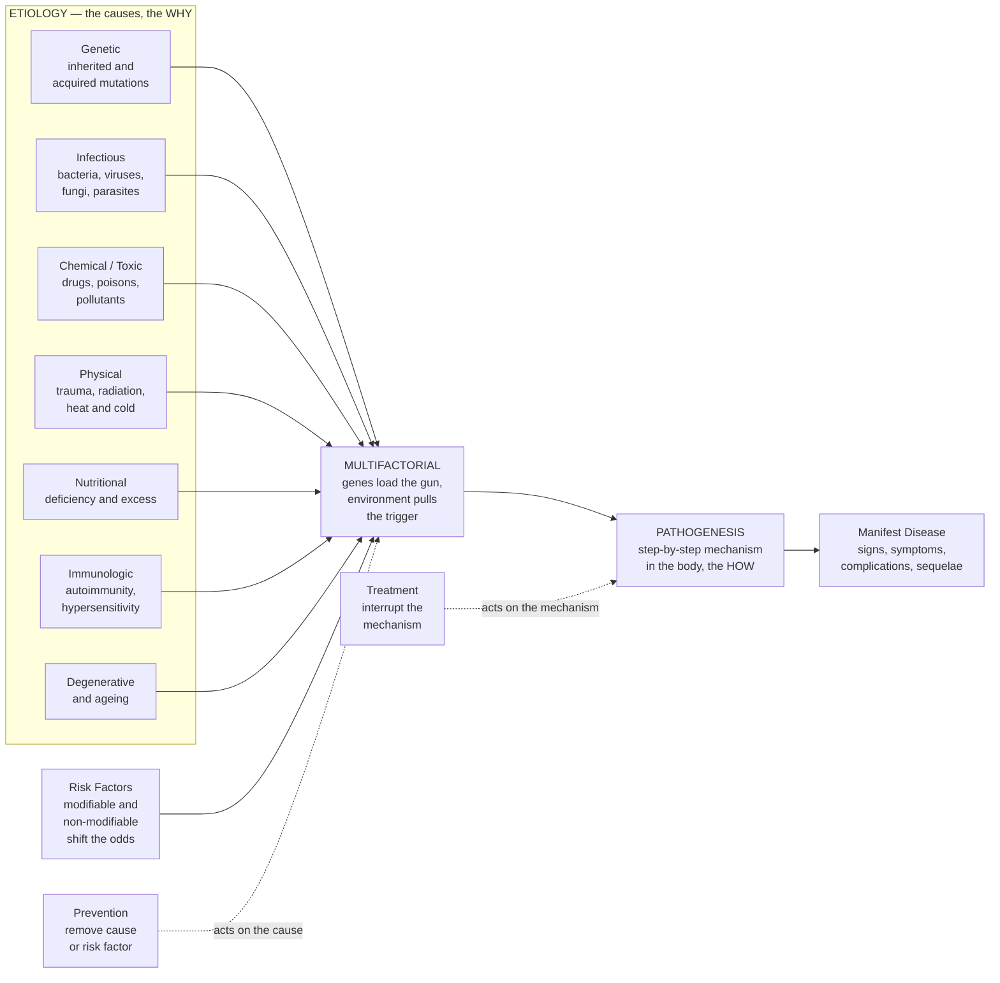

# 🔬 Etiology and Mechanisms of Disease

> [!abstract] TL;DR
> Every disease has two halves to its story: **etiology** — *why* it happened (the cause: a gene, a microbe, a toxin, a lifetime of a certain diet) — and **pathogenesis** — *how* that cause unfolds step by step inside the body to produce illness. Most common chronic diseases are **multifactorial**: no single culprit but many small pushes that add up, where genes load the gun and environment pulls the trigger. This is why we speak of **risk factors** that tilt the odds rather than deterministic causes, and why naming a disease's cause and tracing its mechanism is the organizing logic of all of medicine — it tells us exactly how to **prevent** it (remove the cause or risk factor) and how to **treat** it (interrupt the mechanism). *Educational pathophysiology, not individual clinical advice.*

---

## Intuition

**Analogy:** A disease is a crime, and understanding it means answering two detective questions. First, **who did it?** — that is the *etiology*, naming the culprit: a virus, a faulty gene, a poison, years of a certain diet. Second, **how did they do it?** — that is the *pathogenesis*, tracing exactly what the culprit does, blow by blow, to make you sick. Naming the killer without reconstructing the method leaves the case half-solved; you cannot stop what you cannot trace.

Here is the twist that trips up beginners: for most common diseases, there is **no single culprit**. Heart attacks, type 2 diabetes, and most cancers are the work of a *gang*, not a lone assassin. Your genes **load the gun** — they set a predisposition — and your environment and lifestyle **pull the trigger** over years. That is why two people with the same genes can meet different fates, and why the honest language of medicine is not "X causes Y" but **risk factors**: things that tilt the odds. Grasping this shifts the whole logic of health from cure to probability, and from a single fix to many small levers.

---

## How It Works

### Core Mechanics

The path from cause to illness runs through a fixed sequence, and every category of medicine slots into it somewhere.

1. **Etiology — the categories of cause.** Pathology classifies *why* disease occurs into a small set of buckets. **Genetic** (inherited germline mutations and acquired somatic mutations). **Infectious** (bacteria, viruses, fungi, parasites, prions). **Chemical and toxic** (drugs, poisons, pollutants, alcohol). **Physical** (trauma, radiation, extremes of heat and cold, pressure). **Nutritional** (both deficiency and excess). **Immunologic** (autoimmunity and hypersensitivity, where defense turns on the self). **Degenerative and ageing** (accumulated wear and time). A ninth, uncomfortable, category is **iatrogenic** — disease caused by medical care itself (a drug side-effect, a surgical complication). A cause may be **necessary** (the disease cannot occur without it, e.g. *Mycobacterium tuberculosis* for TB), **sufficient** (it alone can produce the disease), both, or neither.

2. **Risk factors — probabilistic, not deterministic.** Most causes only *raise the probability* of disease. Risk factors split into **non-modifiable** (age, sex, genotype, family history) and **modifiable** (smoking, diet, blood pressure, activity). A risk factor is not a diagnosis — it shifts the odds. This is why epidemiology speaks in **relative risk** and **odds ratios** rather than certainties.

3. **Multifactorial causation — the causal web.** In the common chronic diseases, several partial causes converge. **Gene–environment interaction** means the *same* exposure produces *different* risk depending on genotype (and vice versa). "Genes load the gun, environment pulls the trigger" captures the idea: a genetic predisposition sits latent until environmental and lifestyle factors accumulate past a threshold. Rothman's model pictures each real-world case as a **sufficient cause** assembled from several **component causes** — a "causal pie" that only triggers disease when enough slices are present.

4. **Pathogenesis — the mechanism.** Once the cause acts, pathogenesis is the *chain of molecular and cellular events* leading to the manifest disease: the mechanism by which a mutation, microbe, or toxin injures cells, provokes inflammation, disrupts a pathway, and finally shows up as signs and symptoms. Etiology answers **why**; pathogenesis answers **how**. The same etiology can drive different mechanisms, and different etiologies can converge on the same mechanism (e.g. many causes converging on chronic inflammation).

5. **Natural history and prevention.** A disease then unfolds over time — a **latent/subclinical** phase before it becomes **clinical**, an **acute** or **chronic** course, with **complications**, **sequelae**, and a **prognosis**. Understanding etiology and mechanism directly yields the three levels of prevention: **primary** (remove the cause or risk factor before disease begins), **secondary** (early detection and screening in the subclinical phase), and **tertiary** (limit damage and disability once disease is established).

### Flow / Architecture



---

## Key Concepts

### Secondary Level

- **Etiology = the cause; pathogenesis = the mechanism.** *Why* did it happen, and *how* does it make you sick? Two different questions.
- **The main kinds of causes:** genes, germs (infection), poisons and chemicals, physical harm (injury, radiation), bad nutrition (too little or too much), the immune system attacking the body, and simple wear-and-tear ageing.
- **Most common diseases have many causes, not one.** Heart disease and diabetes come from genes *and* lifestyle together — "genes load the gun, the environment pulls the trigger."
- **Risk factor:** something that makes a disease *more likely* but does not guarantee it — like smoking for lung disease. Some risk factors you can change (diet, smoking); some you cannot (age, family history).
- **Why it matters:** if you know the cause, you can *prevent* it; if you know the mechanism, you can *treat* it.

### Undergraduate Level

- **Necessary vs sufficient causes.** A *necessary* cause must be present for the disease (the TB bacillus for tuberculosis); a *sufficient* cause can produce it alone. Most chronic-disease factors are neither strictly necessary nor sufficient — they are *contributory*.
- **Multifactorial inheritance and gene–environment interaction.** Complex traits arise from many genes of small effect (**polygenic** risk) plus environment. The hallmark of interaction is that the effect of an exposure *depends on genotype* — the same cigarette does more harm to some genomes than others (see [[Complex_Trait_Genetics_and_GWAS]]).
- **Risk quantified:** **relative risk (RR)** and **odds ratios (OR)** measure how much a factor multiplies disease probability; **attributable risk** measures how much disease in a population is due to a factor. These are the currency of [[Public_Health_and_Epidemiology]].
- **Categories of etiology in depth:** genetic causation traces back to mutation and DNA repair failure ([[DNA_Repair_and_Mutation]]); chemical/toxic causation is the domain of toxicology and dose–response ([[Environmental_Health_and_Toxicology]]); infectious causation obeys Koch's postulates and host–pathogen dynamics.
- **Natural history of disease:** the timeline of **latency → subclinical → clinical → complications/sequelae → outcome**, distinguishing **acute** (short, often self-limiting or fatal) from **chronic** (long, progressive) courses, and defining **morbidity** (illness burden), **mortality** (death rate), and **prognosis**.

### Graduate Level

- **Rothman's causal pie (sufficient-component cause model).** Each occurrence of disease is one "sufficient cause" — a complete pie assembled from **component causes**; disease begins only when the last slice completes a pie. Removing *any* single component prevents that pie's cases, which is why an intervention can work without addressing "the" cause, and why the same disease has multiple valid prevention targets. A **necessary** cause is a slice present in *every* pie.
- **From association to causation.** Because causation is probabilistic and confounded, epidemiology uses the **Bradford Hill viewpoints** (strength, consistency, temporality, biological gradient/dose–response, plausibility, experiment, specificity, coherence, analogy) to argue causality from observational data. Temporality is the one non-negotiable; the rest are weighted judgments, not a checklist. See Rothman and Gordis in Sources.
- **The web of causation vs the single-agent model.** The germ-theory era favored one-microbe-one-disease; chronic-disease epidemiology replaced it with a **causal web** of interacting upstream and proximate determinants, connecting individual pathogenesis to population-level [[Determinants_of_Health]].
- **Somatic evolution and multi-hit pathogenesis.** Cancer exemplifies mechanism-as-process: a *sequence* of somatic mutations (the multi-hit hypothesis) accumulating in a clone under selection — etiology (carcinogen, inherited predisposition) and pathogenesis (stepwise genomic change) become inseparable.
- **Prevention logic derived from mechanism.** Where you can intervene depends on *where in the causal chain you understand the mechanism*: primordial/primary prevention acts on causes and risk factors, secondary on the subclinical phase (screening's value depends on detectable-preclinical-phase length and lead time), tertiary on established mechanism to limit sequelae. Rational drug design is literally "find the mechanistic step, block it."

---

## Python Demo

```python
# Etiology and risk of disease, visualized three ways:
#   (1) Multifactorial accumulation: how disease probability rises as
#       independent risk factors stack up (a logistic combination) -- no
#       single factor is deterministic, but together they compound.
#   (2) Gene-environment interaction: the SAME environmental exposure
#       yields DIFFERENT risk depending on genotype (an interaction term).
#   (3) Relative risk of several risk factors for a disease (bar chart),
#       the causal-web made quantitative.
# Educational illustration with stylized coefficients -- not clinical data.
import numpy as np
import matplotlib.pyplot as plt

rng = np.random.default_rng(0)

# ---- 1. Multifactorial accumulation (logistic combination) -------------
# logit(risk) = b0 + beta * (number of risk factors present)
b0, beta = -4.0, 0.9
n_factors = np.arange(0, 7)                       # 0..6 factors present
logit = b0 + beta * n_factors
risk = 1.0 / (1.0 + np.exp(-logit))              # sigmoid -> probability

# ---- 2. Gene-environment interaction -----------------------------------
# logit = b0 + bE*E + bG*G + bGE*(G*E). The interaction term bGE makes the
# high-risk genotype (G=1) far more sensitive to the same exposure E.
E = np.linspace(0, 10, 200)                       # environmental exposure
b0g, bE, bG, bGE = -5.0, 0.25, 0.4, 0.35
def ge_risk(G):
    z = b0g + bE * E + bG * G + bGE * (G * E)
    return 1.0 / (1.0 + np.exp(-z))
risk_low  = ge_risk(0)                             # protective genotype
risk_high = ge_risk(1)                             # susceptible genotype

# ---- 3. Relative risk of risk factors (illustrative) -------------------
factors = ["Smoking", "Hypertension", "High LDL", "Diabetes",
           "Obesity", "Inactivity", "Family Hx"]
rel_risk = np.array([2.9, 2.5, 2.1, 2.0, 1.7, 1.6, 1.9])   # RR vs baseline 1

# ---- Plot --------------------------------------------------------------
fig, ax = plt.subplots(1, 3, figsize=(16, 4.6))

ax[0].plot(n_factors, risk, "o-", color="#dc2626", lw=2.5, markersize=9)
ax[0].set_title("Multifactorial Risk Accumulates")
ax[0].set_xlabel("Number of risk factors present")
ax[0].set_ylabel("Probability of disease")
ax[0].set_ylim(0, 1)
ax[0].grid(alpha=0.3)
ax[0].annotate("no single factor\nis deterministic;\nthey compound",
               xy=(4, risk[4]), xytext=(0.3, 0.72),
               arrowprops=dict(arrowstyle="->", color="#dc2626"))

ax[1].plot(E, risk_low,  color="#0369a1", lw=2.5, label="Low-risk genotype")
ax[1].plot(E, risk_high, color="#7c3aed", lw=2.5, label="High-risk genotype")
ax[1].axvline(6, color="gray", ls="--", lw=1)
ax[1].set_title("Gene-Environment Interaction")
ax[1].set_xlabel("Environmental / lifestyle exposure")
ax[1].set_ylabel("Probability of disease")
ax[1].set_ylim(0, 1)
ax[1].legend(loc="upper left")
ax[1].annotate("same exposure,\ndifferent risk",
               xy=(6, risk_high[120]), xytext=(1.5, 0.6),
               arrowprops=dict(arrowstyle="->", color="#7c3aed"))

order = np.argsort(rel_risk)[::-1]
ax[2].barh(np.array(factors)[order], rel_risk[order], color="#059669")
ax[2].axvline(1.0, color="black", lw=1)           # RR = 1 -> no excess risk
ax[2].set_title("Relative Risk by Factor (the causal web)")
ax[2].set_xlabel("Relative risk vs baseline (RR = 1)")
ax[2].invert_yaxis()
for i, v in enumerate(rel_risk[order]):
    ax[2].text(v + 0.03, i, f"{v:.1f}", va="center", fontweight="bold")

plt.tight_layout()
plt.savefig("etiology_and_risk.png", dpi=120)
print("Risk with 0 factors:", round(risk[0], 3),
      "| with 6 factors:", round(risk[-1], 3))
print("At exposure=6, low-risk genotype:", round(risk_low[120], 3),
      "| high-risk genotype:", round(risk_high[120], 3))
```

**What it shows.** Panel 1 makes the multifactorial idea concrete: with zero risk factors the probability is near the population floor, but each added factor pushes the logistic curve upward until risk is high — *no single push is deterministic, yet they compound*. Panel 2 is the essence of gene–environment interaction: the two genotypes start close, but the same rising exposure drives the susceptible genome's risk up far faster (the interaction term) — genes load the gun, environment pulls the trigger. Panel 3 turns the causal web into numbers: several factors each multiply baseline risk (relative risk above 1), and it is their *combination*, not any one bar, that produces most real disease.

---

## Real-World Applications

- **Cardiovascular risk scoring (Framingham, QRISK, ASCVD).** These clinical calculators are the causal-web made operational: they combine age, sex, blood pressure, lipids, smoking, and diabetes into a single 10-year risk estimate — a direct, everyday use of multifactorial, probabilistic causation to guide who gets a statin or blood-pressure treatment.
- **Smoking and lung cancer (the birth of chronic-disease epidemiology).** Doll and Hill's cohort of British doctors established a strong, dose-dependent, temporally consistent association that, via the Bradford Hill viewpoints, moved a *risk factor* to an accepted *cause* — the template for how modifiable etiologies are proven and then targeted by prevention (tobacco control).
- **Koch's postulates and infectious etiology.** Establishing that a specific microbe *causes* a specific disease (isolate, culture, reproduce, re-isolate) is the classic necessary-cause framework, still the logic behind identifying new pathogens and designing antimicrobials that interrupt the mechanism.
- **Precision medicine and pharmacogenomics.** Genotyping to predict drug response (e.g. warfarin dosing, or thiopurine metabolism) is gene–environment interaction turned therapeutic — matching the "trigger" (drug exposure) to the individual "loaded gun" (genotype), which links etiologic thinking to [[Complex_Trait_Genetics_and_GWAS]].
- **Public-health prevention programs.** Salt reduction, vaccination, screening (mammography, colonoscopy), and lead removal each target a *different slice of the causal pie* at a *different level of prevention*, showing how mechanism and etiology dictate the intervention point — the core of [[Public_Health_and_Epidemiology]] and [[Determinants_of_Health]].

---

## Common Pitfalls

- **Confusing correlation with causation.** An association is a starting point, not a verdict. Confounding (a third factor driving both), reverse causation (illness changing the "exposure"), and bias can all manufacture a correlation. Temporality and dose–response help, but only controlled experiment or the full weight of the Bradford Hill viewpoints justify a causal claim.
- **Treating risk factors as destiny.** A high-risk genotype or a bad number is a *shifted probability*, not a sentence. "It's genetic, so nothing can be done" ignores that the environmental trigger — the modifiable half — is often exactly where prevention works. Conversely, "I have no risk factors" is false reassurance: probabilistic causation means disease still occurs at low baseline rates.
- **Collapsing etiology into pathogenesis (or vice versa).** Naming the cause ("it's a virus") is not the same as explaining the mechanism ("the virus does X to cells, triggering Y"). Effective treatment usually targets the *mechanism*, so stopping at the cause leaves you without a therapeutic handle.
- **The single-cause fallacy for chronic disease.** Hunting for "the cause" of type 2 diabetes or Alzheimer's misreads their nature: they are multifactorial. The right question is "which component causes are present, and which are removable?" — not "what is the one culprit?"
- **Misreading relative risk without base rates.** A relative risk of 2 is alarming for a common disease and trivial for a rare one. Doubling a tiny baseline is still tiny in *absolute* terms. Always ask "double of what?" — relative risk without the base rate (or absolute risk) can wildly mislead patients and policy.
- **Ignoring gene–environment interaction in study design and advice.** Averaging over the whole population can hide that an exposure is harmful to a susceptible subgroup and neutral to others — an interaction invisible in the marginal effect but central to who actually gets sick.

---

## Related Concepts

This note opens the **Foundations of Disease and Pathophysiology** section and sets up its siblings. The section's *Clinical Medicine and Pathophysiology Overview* frames the whole field of how disease is studied; *Cellular Injury and Adaptation* zooms into the first common downstream step of nearly every pathogenesis — how cells respond to and are damaged by injurious stimuli; *Genetic and Congenital Disease* deepens the genetic-etiology bucket introduced here; *Neoplasia and Cancer Biology* is the paradigm case of multi-hit, somatic-evolution pathogenesis; and *Infectious Disease and Host-Pathogen Interaction* develops the infectious-etiology bucket and the necessary-cause logic of Koch's postulates. (These siblings are referenced in prose; they live alongside this note in the same section.)

Verified cross-vault links:

- [[DNA_Repair_and_Mutation]] — the molecular origin of the **genetic** etiology bucket: how mutations arise and why failed repair converts them into disease-causing lesions.
- [[Complex_Trait_Genetics_and_GWAS]] — the genetics of **multifactorial** disease: polygenic risk and gene–environment interaction, the formal machinery behind "genes load the gun."
- [[Determinants_of_Health]] — the population-scale "causes of the causes," extending the causal web upstream from individual risk factors to social and economic conditions.
- [[Public_Health_and_Epidemiology]] — the discipline that measures causation and risk (relative risk, Bradford Hill, levels of prevention) at the population level.
- [[Environmental_Health_and_Toxicology]] — the **chemical/toxic** and **physical** etiology buckets: dose–response, exposure, and how environmental agents injure the body.

---

## Review Questions

1. **Conceptual (Secondary/Undergraduate).** Distinguish *etiology* from *pathogenesis* using a single example (choose infection, cancer, or a nutritional disease). Then explain what "genes load the gun, environment pulls the trigger" means in terms of necessary vs sufficient causes.
2. **Scenario (Undergraduate).** A patient has three modifiable risk factors and a family history of coronary disease but has never had symptoms. Using the multifactorial and risk-factor framework, explain why he may or may not develop disease, which factors you would target for *primary* prevention, and why relative risk alone is insufficient to advise him without the base rate.
3. **Trade-off / evaluative (Graduate).** Rothman's sufficient-component-cause model implies a disease can have several valid prevention targets. Using the causal-pie idea, argue why removing a single *component* cause can prevent cases even when it is not "the" cause — and contrast this with the single-agent germ-theory model. When is each model the more useful lens?

---

## Sources

- Kumar, V., Abbas, A. K., & Aster, J. C. *Robbins & Cotran Pathologic Basis of Disease* (10th ed.). Elsevier — Chapter on cellular responses and the etiology/pathogenesis framework.
- Feather, A., Randall, D., & Waterhouse, M. (eds.). *Kumar & Clark's Clinical Medicine* (10th ed.). Elsevier — foundations of disease and clinical reasoning.
- Celentano, D. D., & Szklo, M. *Gordis Epidemiology* (6th ed.). Elsevier — risk factors, measures of association, and causal inference.
- Rothman, K. J. *Epidemiology: An Introduction* (2nd ed.). Oxford University Press — the sufficient-component (causal pie) model and causal concepts.
- Hill, A. B. (1965). "The Environment and Disease: Association or Causation?" *Proceedings of the Royal Society of Medicine*, 58(5), 295–300 — the Bradford Hill viewpoints.

---

#clinical-medicine #pathophysiology #etiology #risk-factors #pathogenesis
