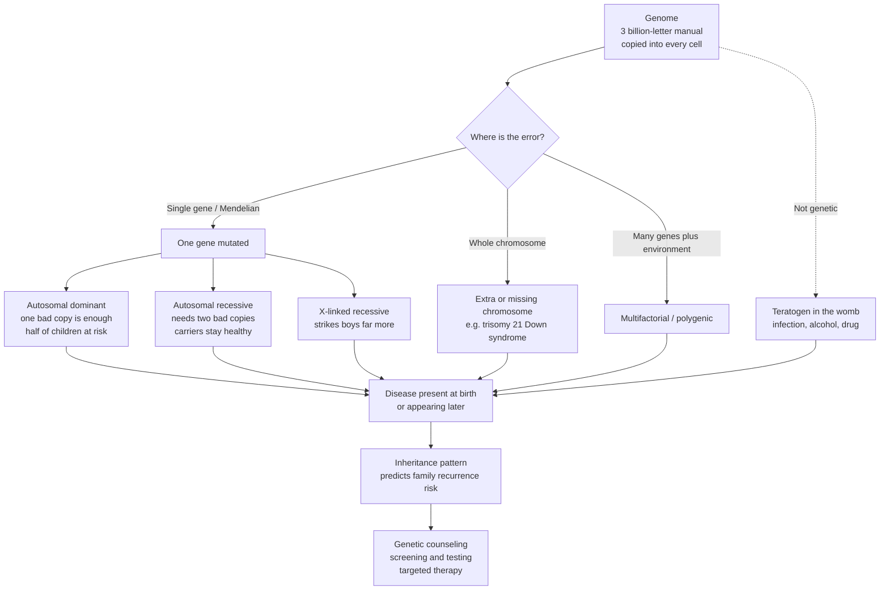

# 🧬 Genetic and Congenital Disease

> [!abstract] TL;DR
> Genetic disease arises from "typos" in the genome — a single wrong base (single-gene / Mendelian), a whole missing or duplicated chromosome (chromosomal), or the combined effect of many genes plus environment (multifactorial); congenital disease means present at birth, which may be genetic OR caused by a teratogen in the womb, so genetic, congenital, and familial are three overlapping but distinct ideas. Recognising the inheritance pattern lets clinicians predict family recurrence risk, explain why disease "runs in families," offer counseling and screening, and increasingly target the exact molecular error — the bridge from basic genetics to bedside medicine.

---

## Intuition

**Analogy FIRST:** Your genome is a 3-billion-letter instruction manual, and a full copy is stamped into almost every cell of your body. A **genetic disease is what happens when there is a typo in that manual.** Sometimes the typo is a single wrong letter; sometimes an entire chapter is missing or duplicated. The consequences depend on *where* the error is and *how it is inherited*.

Some typos act like a **dominant command**: one bad copy of the page is enough to cause trouble, and because you pass on one of your two copies at random, each child has a 50/50 chance of inheriting it. Other typos are **recessive and hidden**: you need *two* bad copies — one from each parent — before anything goes wrong, so perfectly healthy "carriers" can unknowingly hold a silent error that only surfaces when two carriers have a child together. Errors on the **X chromosome** explain why some diseases strike boys far more than girls: boys have only one X, so there is no backup copy to mask the mistake.

And here is the twist that trips up even doctors: **congenital** means "present at birth," and *not all congenital problems are genetic*. Some come from the environment inside the womb — a viral infection, alcohol, a drug — that damages a developing baby whose genome is perfectly fine. Understanding these inheritance patterns is powerful precisely because it turns a family tree into a prediction: it tells you the recurrence risk, explains the "it runs in the family" observation, guides counseling and testing, and increasingly points at the molecular target for therapy.

---

## How It Works

### Core mechanics

1. **Start with the manual.** Every cell holds ~3 billion base pairs across 23 chromosome pairs (22 autosomal pairs + 1 sex-chromosome pair). One member of each pair comes from each parent.
2. **Classify the error.** Disease-causing variation falls into four broad classes:
   - **Single-gene / Mendelian** — one gene is mutated. Subtypes by inheritance: *autosomal dominant* (one mutant allele suffices, ~50% transmission from an affected heterozygote), *autosomal recessive* (two mutant alleles needed; heterozygotes are unaffected carriers), and *X-linked* (recessive forms mainly affect males; dominant forms are rarer).
   - **Chromosomal** — whole chromosomes gained/lost (*aneuploidy*, e.g. trisomy 21) or rearranged (*deletions, duplications, translocations*). Usually from **meiotic nondisjunction**, whose aneuploidy risk climbs steeply with maternal age.
   - **Multifactorial / polygenic** — many small-effect variants plus environment (most common diseases and quantitative traits).
   - **Mitochondrial & imprinting/epigenetic** — mitochondrial DNA is inherited only from the mother; imprinted regions are expressed from only one parent's copy, so the *parent of origin* matters.
3. **Add the non-genetic congenital route.** A normal genome can still yield disease at birth if a **teratogen** disrupts development: infections (rubella, Zika, cytomegalovirus), alcohol (fetal alcohol syndrome), certain drugs (thalidomide, isotretinoin, valproate), or maternal disease (uncontrolled diabetes). Timing matters — organogenesis in weeks 3-8 is the window of greatest structural vulnerability.
4. **Translate to timing and family risk.** The lesion produces disease **at birth or later** (Huntington disease is genetic but appears in mid-adulthood; fetal alcohol syndrome is congenital but not genetic). The **inheritance pattern predicts recurrence risk**, which drives genetic counseling, carrier/prenatal/newborn screening, diagnostic testing (karyotype → microarray → targeted molecular → exome/genome sequencing), and, increasingly, gene-targeted therapy.

### Flow



---

## Key Concepts

### Secondary (explain to a bright teenager)
- **Gene and allele.** A gene is one instruction; you carry two copies (alleles), one from each parent.
- **Dominant vs recessive.** A *dominant* disease shows up with just one faulty copy; a *recessive* disease needs both copies faulty. A **carrier** has one faulty and one working copy and is usually healthy but can pass the fault on.
- **Sex-linked.** Because boys have one X and one Y, an X-chromosome fault has no backup in boys — so diseases like hemophilia and Duchenne muscular dystrophy hit boys much more often.
- **Chromosome number.** Having a whole extra chromosome 21 causes Down syndrome (trisomy 21). Too many or too few chromosomes usually causes major problems.
- **Genetic vs congenital.** *Congenital* just means "born with it." Being born with a problem does not always mean it was inherited — alcohol or an infection during pregnancy can cause birth defects in a baby with normal genes.

### Undergraduate (needs some biology)
- **The Mendelian modes.** *Autosomal dominant* (Aa × aa → 50% affected; vertical transmission, both sexes): Huntington disease, Marfan syndrome, familial hypercholesterolemia, neurofibromatosis. *Autosomal recessive* (Aa × Aa → 25% affected, 50% carriers, 25% unaffected; often "horizontal," consanguinity raises risk): cystic fibrosis, sickle cell disease, phenylketonuria, Tay-Sachs. *X-linked recessive* (carrier mother → half of sons affected, half of daughters carriers; no male-to-male transmission): hemophilia A/B, Duchenne muscular dystrophy, G6PD deficiency.
- **Modifiers of Mendelian expectation.** *Penetrance* — the fraction of genotype-carriers who show the phenotype (reduced penetrance makes a dominant trait appear to "skip" a generation). *Expressivity* — how severely it shows among the affected. *Pleiotropy* — one gene, many organ effects (Marfan hits eye, aorta, and skeleton). *Anticipation* — earlier/worse onset each generation, classically from expanding triplet repeats. *New (de novo) mutation* — an affected child with no family history (common in dominant lethal or reduced-fitness disorders).
- **Chromosomal disorders.** *Aneuploidy* from meiotic **nondisjunction**: trisomy 21 (Down), 18 (Edwards), 13 (Patau); sex-chromosome aneuploidies Turner (45,X) and Klinefelter (47,XXY). Autosomal trisomy risk rises sharply with **maternal age**. *Structural*: deletions (22q11.2 DiGeorge, 5p cri-du-chat), duplications, and translocations (a balanced carrier parent can produce unbalanced offspring — e.g. Robertsonian translocation Down syndrome with high recurrence risk).
- **Multifactorial / polygenic.** Most common diseases (type 2 diabetes, hypertension, coronary disease, cleft lip/palate, neural tube defects) reflect *many genes + environment*, modeled with a **liability-threshold** concept; recurrence risk is intermediate and empiric, not Mendelian.
- **Hardy-Weinberg for carriers.** For a recessive disease with population incidence q², carrier frequency ≈ 2q. Even a rare disease has surprisingly many silent carriers — this is why *population carrier screening* works.

### Graduate (system-level / molecular)
- **Molecular basis of dominance.** Recessive disease usually reflects **loss of function** (both copies needed to fall below a threshold). Dominant disease arises via **haploinsufficiency** (50% product is not enough — e.g. many transcription-factor syndromes), **dominant-negative** effects (the mutant product poisons the wildtype, e.g. osteogenesis imperfecta collagen), or **gain of function / toxic gain** (Huntington polyglutamine aggregation).
- **Non-Mendelian mechanisms.** *Mitochondrial inheritance* — maternal transmission, **heteroplasmy** and a threshold effect explain variable severity (MELAS, Leber optic neuropathy). *Genomic imprinting* — parent-of-origin expression; deletion of the same 15q11-q13 region gives **Prader-Willi** (paternal loss) or **Angelman** (maternal loss). *Uniparental disomy* and *mosaicism* (including germline mosaicism, which explains recurrence despite unaffected parents).
- **Trinucleotide-repeat expansion.** Unstable CAG/CGG/CTG repeats explain anticipation and parent-of-origin bias (Huntington, fragile X, myotonic dystrophy).
- **Recurrence-risk calculation.** Combine Mendelian priors with **Bayesian** conditioning on unaffected offspring, carrier test results, and penetrance to produce individualized risk — the quantitative core of genetic counseling.
- **Clinical genetics workflow & variant interpretation.** Tiered testing: **karyotype** (whole-chromosome, balanced rearrangements) → **FISH** (targeted microdeletion) → **chromosomal microarray** (copy-number, first-line for unexplained intellectual disability/congenital anomalies) → **targeted molecular / gene panels** → **exome/genome sequencing** for the diagnostic odyssey. Variants are classified by **ACMG** criteria (pathogenic → benign). **NIPT** uses cell-free fetal DNA in maternal plasma to screen for common trisomies.
- **Teratology principles.** Dose-dependence, a defined critical window (organogenesis), genetic susceptibility of the conceptus, and a *threshold* — the framework that separates true teratogenic risk from background malformation rate.

---

## Python Demo

```python
# Genetic & congenital disease: (a) offspring inheritance probabilities across the three
# classic Mendelian patterns, (b) Hardy-Weinberg carrier frequency vs disease incidence,
# and (c) illustrative maternal-age effect on trisomy-21 risk.
import numpy as np
import matplotlib.pyplot as plt

# -------------------------------------------------------------------------
# (a) Inheritance probabilities from a single cross, by phenotype category
#     AD  : affected(Aa) x unaffected(aa)  -> 1/2 affected, 1/2 unaffected
#     AR  : carrier(Aa)  x carrier(Aa)     -> 1/4 affected, 1/2 carrier, 1/4 unaffected
#     XLR : carrier mother x normal father -> 1/4 affected sons, 1/4 carrier daughters,
#                                             1/2 unaffected (rest of sons + daughters)
patterns  = ["Autosomal\ndominant", "Autosomal\nrecessive", "X-linked\nrecessive"]
affected  = np.array([0.50, 0.25, 0.25])
carrier   = np.array([0.00, 0.50, 0.25])
unaffected= np.array([0.50, 0.25, 0.50])

# -------------------------------------------------------------------------
# (b) Hardy-Weinberg: disease incidence q^2 -> allele freq q -> carrier freq 2q(1-q)
incidence = np.logspace(-5, -2, 200)      # 1 in 100000 ... 1 in 100
q         = np.sqrt(incidence)            # recessive allele frequency
carrier_f = 2 * q * (1 - q)               # heterozygous carrier frequency

# Cystic fibrosis reference point: incidence ~ 1/2500 in some populations
cf_inc = 1/2500
cf_q   = np.sqrt(cf_inc)
cf_car = 2 * cf_q * (1 - cf_q)            # ~0.039  -> about 1 in 25

# -------------------------------------------------------------------------
# (c) Maternal-age effect on trisomy-21 risk (illustrative exponential fit,
#     anchored ~1/1600 at age 20 and ~1/30 at age 45)
age   = np.linspace(20, 49, 200)
a, b  = -10.56, 0.1588
t21   = np.exp(a + b * age)               # probability at term (approximate)

# -------------------------------------------------------------------------
fig, ax = plt.subplots(1, 3, figsize=(16, 4.6))

# Panel (a): stacked bars summing to 1.0
x = np.arange(len(patterns))
ax[0].bar(x, affected,  label="Affected",   color="#c0392b")
ax[0].bar(x, carrier,   bottom=affected,           label="Carrier", color="#f39c12")
ax[0].bar(x, unaffected,bottom=affected+carrier,   label="Unaffected", color="#27ae60")
for i in range(len(patterns)):
    if affected[i]  > 0: ax[0].text(i, affected[i]/2, f"{affected[i]:.0%}", ha="center", color="white", fontsize=9)
    if carrier[i]   > 0: ax[0].text(i, affected[i]+carrier[i]/2, f"{carrier[i]:.0%}", ha="center", color="white", fontsize=9)
ax[0].set_xticks(x); ax[0].set_xticklabels(patterns)
ax[0].set_ylabel("Offspring probability")
ax[0].set_title("(a) Inheritance patterns:\noffspring outcome per cross")
ax[0].legend(loc="upper right", fontsize=8)

# Panel (b): carriers are common even for rare disease
ax[1].plot(incidence, carrier_f, color="#2980b9", lw=2)
ax[1].scatter([cf_inc], [cf_car], color="#c0392b", zorder=5)
ax[1].annotate("Cystic fibrosis\n~1/2500 born affected\n~1/25 are carriers",
               xy=(cf_inc, cf_car), xytext=(3e-5, 0.05),
               arrowprops=dict(arrowstyle="->"), fontsize=8)
ax[1].set_xscale("log")
ax[1].set_xlabel("Disease incidence (affected births)")
ax[1].set_ylabel("Carrier frequency (~2q)")
ax[1].set_title("(b) Hardy-Weinberg:\nhidden carriers vastly outnumber affected")
ax[1].grid(True, which="both", alpha=0.3)

# Panel (c): maternal age and aneuploidy risk
ax[2].plot(age, t21 * 1000, color="#8e44ad", lw=2)
ax[2].set_xlabel("Maternal age (years)")
ax[2].set_ylabel("Trisomy-21 risk per 1000 births")
ax[2].set_title("(c) Chromosomal risk:\nnondisjunction rises with maternal age")
ax[2].grid(True, alpha=0.3)
for A in (25, 35, 45):
    r = np.exp(a + b*A)
    ax[2].annotate(f"age {A}: ~1 in {round(1/r)}", xy=(A, r*1000),
                   xytext=(A-4, r*1000+3), fontsize=8,
                   arrowprops=dict(arrowstyle="->"))

plt.tight_layout()
plt.savefig("genetic_congenital_disease.png", dpi=120)
plt.show()

# Console sanity check
print(f"AR cross: affected={affected[1]:.0%}, carriers={carrier[1]:.0%}")
print(f"CF: q={cf_q:.3f}, carrier freq={cf_car:.3f} (about 1 in {round(1/cf_car)})")
print(f"Trisomy-21 illustrative risk at 45: about 1 in {round(1/np.exp(a+b*45))}")
```

**What it shows:** panel (a) makes the 50% / 25% / carrier arithmetic visual across the three Mendelian modes; panel (b) is the counterintuitive public-health punchline — for a disease affecting 1 in 2500, roughly **1 in 25 people is a silent carrier**, which is why expanded carrier screening finds so many at-risk couples; panel (c) reproduces the steep **maternal-age effect** that motivates aneuploidy screening. (The trisomy curve is an illustrative fit for teaching, not a clinical risk table.)

---

## Real-World Applications

> **Newborn screening (the heel-prick / Guthrie card).** Every developed health system screens neonates for a panel of treatable Mendelian disorders — **phenylketonuria, congenital hypothyroidism, cystic fibrosis, sickle cell disease, MCAD deficiency**. This is inheritance genetics operationalized at population scale: catch the recessive disorder *before* symptoms so a dietary or medical intervention prevents irreversible damage (untreated PKU causes intellectual disability; a simple low-phenylalanine diet prevents it).

- **Carrier screening.** Preconception/prenatal panels (historically Tay-Sachs in Ashkenazi Jewish populations, now expanded pan-ethnic panels) use Hardy-Weinberg logic: identify two carriers *before* they have an affected child, enabling informed reproductive choices.
- **Prenatal diagnosis.** **NIPT** (cell-free fetal DNA) screens for trisomy 21/18/13 from a maternal blood draw; **chorionic villus sampling** and **amniocentesis** with karyotype/microarray provide diagnostic confirmation. The maternal-age curve in the demo is exactly what sets screening thresholds.
- **Solving the diagnostic odyssey.** **Exome/genome sequencing** now ends years-long searches for children with unexplained developmental disorders, often revealing a de novo dominant variant absent in both parents.
- **Gene-targeted therapy.** The molecular understanding is now therapeutic: **onasemnogene abeparvovec (Zolgensma)** replaces SMN1 in spinal muscular atrophy, **voretigene (Luxturna)** treats RPE65 retinal dystrophy, and **exagamglogene (Casgevy)**, a CRISPR therapy, treats sickle cell disease — turning single-gene diagnoses into single-gene cures.
- **Cancer predisposition.** Germline pathogenic variants (BRCA1/2, Lynch/mismatch-repair genes) are dominant cancer-risk syndromes where cascade family testing and risk-reducing screening/surgery save lives.

---

## Common Pitfalls

- **Conflating "congenital" with "genetic."** They are distinct. **Fetal alcohol syndrome** is congenital but *not* genetic (normal genome, teratogen); **Huntington disease** is genetic but *not* congenital (onset in adulthood). Congenital, genetic, and familial are three overlapping circles — never assume one implies another.
- **Assuming "runs in the family" equals genetic.** Families share *environment and diet*, not just genes. Conversely, a **de novo mutation** produces a genetic disease with *no* family history at all — absence of family history does not exclude a genetic cause.
- **Being fooled by reduced penetrance / variable expressivity.** An autosomal dominant condition can appear to "skip" a generation because an obligate carrier never manifested — misread as sporadic. Always consider penetrance before excluding dominant inheritance.
- **Applying Mendelian rules to non-Mendelian disease.** Mitochondrial disorders (maternal-only transmission, heteroplasmy) and imprinting disorders (parent-of-origin) violate simple Punnett-square expectations; the same 15q deletion gives Prader-Willi or Angelman depending on which parent contributed it.
- **Forgetting carriers vastly outnumber affected individuals.** People intuit that a "1 in 2500" disease is rare in carriers too — but ~1 in 25 carry it. Underestimating carrier frequency undersells the value of screening.
- **Mixing up the age effects.** *Maternal* age drives **aneuploidy** (nondisjunction); *paternal* age drives new **autosomal dominant point mutations** (e.g. achondroplasia). Attributing the wrong parent's age is a classic exam trap.
- **Ignoring translocation Down syndrome.** Most trisomy 21 is sporadic nondisjunction with low recurrence, but a **Robertsonian translocation** carrier parent has a *substantially* higher recurrence risk — which is why karyotyping the child (and parents) changes counseling.

---

## Related Concepts

- [[Mendelian_Genetic_Disorders]] — the Genetics-vault basic-science companion detailing single-gene disease mechanisms; this clinical note translates those modes into recurrence risk and management.
- [[Mendelian_Inheritance_Patterns]] — Mendel's laws and the Punnett-square arithmetic behind the 50% / 25% / carrier probabilities computed in the demo.
- [[Extensions_to_Mendelian_Genetics]] — penetrance, expressivity, pleiotropy, and other modifiers that make real pedigrees deviate from textbook ratios.
- [[Chromosomal_Theory_of_Inheritance]] — the chromosome/meiosis foundation underlying nondisjunction and the maternal-age aneuploidy effect.
- [[Population_Genetics_and_Hardy_Weinberg]] — the equilibrium relation used here to derive carrier frequency from disease incidence.
- [[Genomic_Imprinting_and_X_Inactivation]] — parent-of-origin and X-dosage mechanisms behind Prader-Willi/Angelman and X-linked disease.
- [[Genetic_Counseling_and_Prenatal_Testing]] — the clinical workflow (pedigree, recurrence risk, carrier/prenatal screening) this note feeds into.
- [[Cancer_Genetics_and_Oncogenes]] — germline cancer-predisposition syndromes as an inherited-disease special case.
- [[Pharmacogenomics_and_Personalized_Medicine]] — how the same genomic tools power precision medicine.
- [[Gene_Therapy_and_CRISPR]] — the molecular-repair endpoint of understanding a single-gene defect.
- [[DNA_Repair_and_Mutation]] — how the "typos" arise and are (imperfectly) corrected.
- [[Human_Genetics_and_Genetic_Disorders]] — the Biology-vault overview of human inheritance and disorders.
- [[Mendelian_Genetics]] — the Biology-vault primer on dominant/recessive alleles and Punnett squares.
- [[Non_Mendelian_Inheritance]] — mitochondrial, polygenic, and imprinting patterns that break simple rules.
- [[Chromosomal_Basis_of_Inheritance]] — meiosis, linkage, and sex determination underpinning chromosomal disorders.
- [[Mutations_and_DNA_Repair]] — the Biology-vault mechanism of variant origin.
- [[Genes_Environment_and_Epigenetics_in_Health]] — the gene-plus-environment framing central to multifactorial disease.
- [[Environmental_Health_and_Toxicology]] — dose/timing/threshold principles that also govern teratogens.
- [[Public_Health_and_Epidemiology]] — the population-screening logic (sensitivity, specificity, prevalence) behind newborn and carrier programs.

Within this vault, this note is the genetic-etiology chapter that sits alongside the broader **Etiology and Mechanisms of Disease** and **Clinical Medicine and Pathophysiology Overview** notes, connects to **Neoplasia and Cancer Biology** through hereditary cancer syndromes, hands off to **Precision Medicine and Genomics in the Clinic** for gene-targeted therapy, and supplies the pattern-recognition that **Diagnostic Reasoning and Clinical Decision Making** uses to weigh a family history.

---

## Review Questions

**Secondary**
1. A disease needs *two* faulty gene copies to appear, and the parents are both healthy. What are the parents called, and what is the chance their next child is affected?
2. Explain in one sentence why "born with a condition" does not always mean the condition was inherited from a parent. Give one example of a congenital-but-not-genetic cause.

**Undergraduate**
3. A woman is a carrier of an X-linked recessive disorder (hemophilia) and her partner is unaffected. Draw the cross and state the probability that (i) a son is affected, (ii) a daughter is a carrier, (iii) any given child is affected.
4. Using Hardy-Weinberg, a recessive disease affects 1 in 10,000 births. Estimate the carrier frequency and explain why it is so much larger than the disease incidence.

**Graduate**
5. A child has an autosomal dominant disorder but neither parent is affected and molecular testing shows the variant is absent in both parents' blood. Give two distinct mechanisms that could explain this, and state how each affects the recurrence risk for the parents' future children.
6. Contrast the recurrence risk and counseling implications of trisomy-21 caused by (i) maternal meiotic nondisjunction versus (ii) an inherited Robertsonian translocation, and explain why karyotyping the proband is essential before quoting a recurrence figure.

---

## Sources

- Nussbaum RL, McInnes RR, Willard HF. *Thompson & Thompson Genetics and Genomics in Medicine.* 9th ed. Elsevier — standard clinical-genetics text (inheritance patterns, recurrence risk, cytogenetics).
- Kumar V, Abbas AK, Aster JC. *Robbins & Cotran Pathologic Basis of Disease*, "Genetic Disorders" chapter — pathophysiology of single-gene, chromosomal, and multifactorial disease.
- Jorde LB, Carey JC, Bamshad MJ. *Medical Genetics.* Elsevier — clinical genetics with worked recurrence-risk and Hardy-Weinberg problems.
- [OMIM — Online Mendelian Inheritance in Man](https://www.omim.org/) — authoritative catalog of human genes and genetic disorders.
- [MedlinePlus Genetics (NIH/NLM)](https://medlineplus.gov/genetics/) — reference on inheritance patterns, chromosomal conditions, and genetic testing.

---

#clinical-medicine #genetic-disease #inheritance #congenital #medical-genetics
