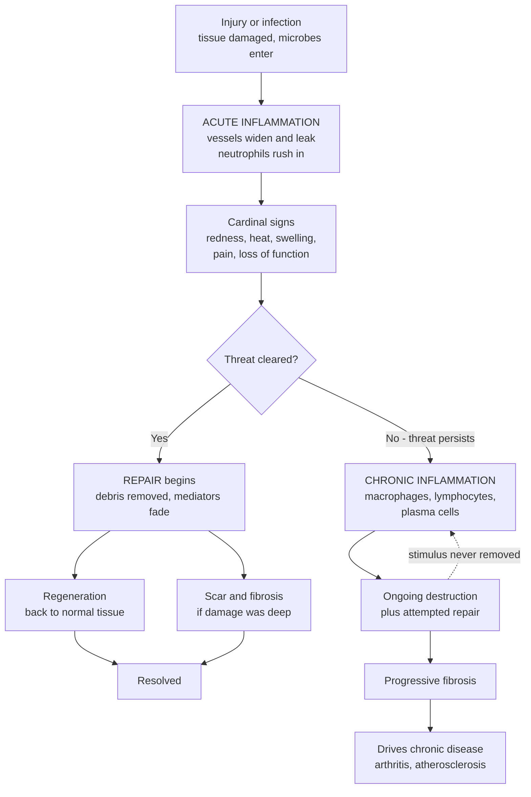

# 🔥 Inflammation and Tissue Repair

> [!abstract] TL;DR
> **Inflammation** is the body's protective response to injury or infection — a rapid, stereotyped mobilization of blood vessels and immune cells to the site of trouble. **Acute inflammation** (minutes to days) produces the five cardinal signs — **redness, heat, swelling, pain, and loss of function** — through **vascular changes** (vasodilation and increased permeability) and **cellular events** (neutrophil recruitment and phagocytosis), orchestrated by chemical **mediators** (histamine, prostaglandins, cytokines, complement). When the threat is cleared, **repair** follows: tissue either **regenerates** back to normal or is patched with a **scar (fibrosis)**. When the threat persists — chronic infection, foreign material, or **autoimmunity** — inflammation becomes **chronic**, dominated by macrophages and lymphocytes, and the never-ending "rescue effort" itself damages tissue and drives **fibrosis**. Inflammation is thus a double-edged sword: essential for survival and healing, yet a root mechanism of disease from arthritis to atherosclerosis when misdirected or unending.

## Intuition

**Analogy — the emergency response team.** Cut your finger or catch an infection, and within minutes the area turns red, hot, swollen, and painful. Those signs aren't the problem — they're the *response*. Blood vessels widen and leak to flood the area with defensive cells and fluid, exactly like fire trucks, police, and ambulances converging on an emergency: sirens, congestion, and disruption are the visible cost of help arriving fast.

This **acute** response is fast, protective, and self-limiting. It neutralizes the threat and then stands down, letting **repair** begin — the tissue heals, ideally back to normal, or with a scar if the damage ran deep. But when the threat is never cleared — a persistent infection, a splinter that stays lodged, or an immune system attacking the body itself — the emergency response never leaves. Now the ongoing rescue effort *itself* becomes the source of damage, driving scarring (**fibrosis**) and much of chronic disease. Same machinery, opposite outcome: the difference between healing and harm is often just *how long the sirens keep running*.

---

## How It Works

### Core Mechanics

Acute inflammation unfolds as a tightly ordered sequence:

1. **Recognition.** Sentinel cells (tissue macrophages, mast cells, dendritic cells) detect microbes via pattern-recognition receptors, or sense molecules released by dead/damaged cells (damage signals). This trips the alarm.
2. **Vascular response.** A brief vasoconstriction is followed by **vasodilation** — arterioles widen, blood flow surges (→ *redness/rubor* and *heat/calor*). Endothelial junctions loosen, raising **vascular permeability**, so protein-rich fluid leaks into tissue as **exudate** (→ *swelling/tumor* and *edema*). The slowed, concentrated blood (stasis) lets leukocytes settle against the vessel wall.
3. **Cellular recruitment.** Leukocytes — first and foremost **neutrophils** — undergo **margination** (moving to the vessel edge), **rolling** (loose selectin binding), **firm adhesion** (integrin binding), and **transmigration** (squeezing between endothelial cells, diapedesis). **Chemotaxis** then guides them up chemical gradients to the exact focus of injury.
4. **Elimination.** Neutrophils and macrophages perform **phagocytosis** — recognizing (often opsonin-tagged) targets, engulfing them, and killing them inside phagolysosomes with reactive oxygen species and enzymes. Pain (*dolor*) from mediators and pressure, plus splinting of the part, causes *loss of function*.
5. **Resolution or progression.** Once the stimulus is gone, mediators decay, neutrophils die by apoptosis and are cleared, and specialized pro-resolving mediators actively switch the tissue back toward healing. If the stimulus persists, the process tips into **chronic inflammation** and repair-by-scarring.

**Chemical mediators** run the show: **histamine** (early vasodilation/permeability), **prostaglandins** and **leukotrienes** (from arachidonic acid; pain, vasodilation, chemotaxis — the target of NSAIDs), **cytokines** such as **TNF** and **IL-1** (activate endothelium, drive fever and the systemic response), the **complement** cascade (opsonization, chemotaxis, membrane attack), and **bradykinin** (pain, permeability).

### Flow / Architecture



---

## Key Concepts

### Secondary (foundational)

- **What inflammation is.** The body's built-in emergency response to damage or germs. Its job is to isolate the threat, destroy it, and start healing.
- **The five cardinal signs.** *Redness, heat, swelling, pain,* and *loss of function.* These come from more blood arriving (red, hot) and fluid leaking into the tissue (swollen), plus chemicals that trigger nerves (pain).
- **Acute vs chronic.** **Acute** is fast and short — days — and usually good: it clears the problem and quits. **Chronic** is slow and lasting — months to years — and often harmful: the response keeps going and starts damaging the body.
- **Healing.** After acute inflammation, tissue either grows back the same (**regeneration**) or is repaired with a **scar** when the injury is deep.

### Undergraduate (mechanistic)

- **Vascular events.** Transient vasoconstriction → sustained **vasodilation** (↑ blood flow) → ↑ **vascular permeability** → protein-rich **exudate** into tissue (edema), distinguished from low-protein **transudate**. Stasis positions leukocytes for exit.
- **Cellular events — the leukocyte cascade.** *Margination → rolling (selectins) → firm adhesion (integrins) → transmigration/diapedesis → chemotaxis → phagocytosis.* **Neutrophils** dominate the first 24 h (short-lived, form pus); **macrophages** take over by 24–48 h.
- **Phagocytosis.** Recognition (aided by **opsonins** like C3b and antibody) → engulfment → killing by the respiratory burst (ROS) and lysosomal enzymes.
- **Mediators (grouped).** *Vasoactive amines* (histamine, serotonin); *arachidonic acid metabolites* (**prostaglandins**, **leukotrienes** — COX/LOX pathways, NSAID targets); *cytokines/chemokines* (**TNF**, **IL-1**, IL-6, IL-8); *plasma-derived* (**complement**, **bradykinin/kinins**, coagulation factors).
- **Outcomes of acute inflammation.** (1) **Complete resolution** — best case, tissue restored; (2) **abscess** formation — walled-off pus; (3) **healing by scarring/fibrosis**; (4) **progression to chronic inflammation**.
- **Regeneration vs repair.** Depends on the tissue's regenerative capacity:
  - **Labile cells** (skin epidermis, gut lining, bone marrow) — divide continuously; heal by regeneration.
  - **Stable cells** (liver, kidney tubules, fibroblasts) — normally quiescent but can re-enter the cycle after injury.
  - **Permanent cells** (neurons, cardiac and skeletal muscle) — cannot meaningfully divide; injury heals by **scar** (why a heart attack leaves a fibrous scar, not new myocardium).
- **Repair by connective tissue (scarring).** **Granulation tissue** forms (new capillaries via **angiogenesis** + fibroblasts + loose collagen) → **collagen deposition** → **remodeling** (type III collagen replaced by stronger type I; wound gains tensile strength over weeks to months).
- **Wound healing modes.** **Primary intention** (clean, apposed edges — e.g., a sutured surgical cut; minimal scar) vs **secondary intention** (large tissue gap — fills with abundant granulation tissue, wound contraction by myofibroblasts, bigger scar).
- **Systemic effects.** **Fever** (IL-1, IL-6, TNF, prostaglandin E2 reset the hypothalamic set-point), **leukocytosis** (raised white-cell count; left shift), and **acute-phase proteins** — notably **CRP** (C-reactive protein) and fibrinogen — released by the liver and used clinically to gauge inflammation.

### Graduate (advanced and clinical)

- **Resolution is active, not passive.** Termination of acute inflammation is programmed: a **lipid-mediator class switch** from pro-inflammatory prostaglandins/leukotrienes to **specialized pro-resolving mediators (SPMs)** — **lipoxins, resolvins, protectins, maresins** — that stop neutrophil recruitment and promote efferocytosis (macrophage clearance of apoptotic neutrophils). Failed resolution is now viewed as a driver of chronicity.
- **Chronic inflammation — cellular signature.** Dominated by **macrophages** (with M1 pro-inflammatory vs M2 pro-repair polarization), **lymphocytes** (T and B), and **plasma cells**, with simultaneous tissue destruction and healing. Causes: persistent infection (e.g., *M. tuberculosis*), prolonged exposure to irritants (silica, lipids), and **autoimmunity**.
- **Granulomatous inflammation.** A distinctive pattern: aggregates of activated **epithelioid macrophages**, often with multinucleate **giant cells**, walling off agents the immune system cannot eliminate. Seen in **tuberculosis** (caseating granulomas), **sarcoidosis** (non-caseating), leprosy, and foreign-body reactions.
- **Fibrosis — the pathological engine.** Persistent injury drives sustained **TGF-β** signaling → fibroblast-to-**myofibroblast** transition → excessive, disorganized extracellular-matrix (collagen) deposition that outpaces degradation (MMP/TIMP imbalance) → progressive scarring and organ dysfunction. The common endpoint of chronic disease in liver (cirrhosis), lung (pulmonary fibrosis), kidney, and heart.
- **Inflammation as a disease mechanism.** **Atherosclerosis** is a chronic inflammatory response to lipid in the arterial wall; **rheumatoid arthritis** is autoimmune synovial inflammation; low-grade chronic inflammation ("**inflammaging**") links to metabolic syndrome, neurodegeneration, and cancer (the "seventh hallmark" — an enabling tumor microenvironment).
- **Healing complications.** *Deficient* — chronic non-healing ulcers, wound dehiscence (often with ischemia, diabetes, infection, malnutrition); *excessive* — **hypertrophic scar** and **keloid** (exuberant collagen), **contracture** (scar shortening restricting movement, classic after burns), and fibrous adhesions.
- **Therapeutic leverage.** NSAIDs (COX inhibition → ↓ prostaglandins), corticosteroids (broad mediator suppression), and targeted **biologics** — anti-TNF, anti-IL-1, anti-IL-6 — that neutralize specific cytokines in autoimmune and autoinflammatory disease; emerging pro-resolution and anti-fibrotic agents.

---

## Python Demo

```python
# Inflammation dynamics: (1) acute resolution vs chronic persistence and its
# cumulative tissue damage, and (2) tissue-integrity healing (regeneration vs
# scar/fibrosis) plus the vascular changes behind the cardinal signs.
import numpy as np
import matplotlib.pyplot as plt

# ---------- (1) Inflammatory activity over time ----------
t = np.linspace(0, 30, 900)          # days after the insult
dt = t[1] - t[0]
tau_rise, tau_resolve = 0.8, 4.0

# ACUTE: sharp rise then active resolution back to baseline (stimulus cleared)
acute = np.exp(-t / tau_resolve) - np.exp(-t / tau_rise)
acute = acute / acute.max()          # normalize peak to 1.0

# CHRONIC: stimulus persists -> rises to a plateau and fluctuates, never resolves
onset = 1 - np.exp(-t / tau_rise)
chronic = 0.6 * onset + 0.06 * np.sin(2 * np.pi * t / 4.0) * onset

# Cumulative tissue damage = time-integral of activity above a damage threshold
thr = 0.15
dmg_acute = np.cumsum(np.clip(acute - thr, 0, None)) * dt
dmg_chronic = np.cumsum(np.clip(chronic - thr, 0, None)) * dt

# ---------- (2) Healing: tissue integrity recovery ----------
integrity0, post_injury = 100.0, 40.0        # % function: healthy vs just after injury
regen = 100.0 - (100.0 - post_injury) * np.exp(-t / 5.0)          # full regeneration
scar_final = 75.0                                                  # residual deficit
scar = scar_final - (scar_final - post_injury) * np.exp(-t / 5.0)  # fibrosis plateau

# ---------- (3) Vascular changes driving the cardinal signs ----------
blood_flow = 1.0 + 2.0 * acute                       # vasodilation -> redness, heat
perm_shape = np.exp(-t / tau_resolve) - np.exp(-t / (tau_rise * 2.0))
perm = 1.0 + 3.5 * perm_shape / perm_shape.max()     # permeability -> swelling (lags)

# ---------- Plot ----------
fig, ax = plt.subplots(2, 2, figsize=(12, 8))

ax[0, 0].plot(t, acute, color="#dc2626", lw=2, label="Acute (resolves)")
ax[0, 0].plot(t, chronic, color="#7c3aed", lw=2, label="Chronic (persists)")
ax[0, 0].axhline(thr, ls=":", color="gray", label="damage threshold")
ax[0, 0].set(title="Inflammatory activity over time",
             xlabel="days", ylabel="activity / immune-cell load")
ax[0, 0].legend(); ax[0, 0].grid(alpha=0.3)

ax[0, 1].plot(t, dmg_acute, color="#dc2626", lw=2, label="Acute (saturates)")
ax[0, 1].plot(t, dmg_chronic, color="#7c3aed", lw=2, label="Chronic (accumulates)")
ax[0, 1].set(title="Cumulative tissue damage",
             xlabel="days", ylabel="integrated damage")
ax[0, 1].legend(); ax[0, 1].grid(alpha=0.3)

ax[1, 0].plot(t, regen, color="#059669", lw=2, label="Regeneration -> normal")
ax[1, 0].plot(t, scar, color="#d97706", lw=2, label="Scar / fibrosis")
ax[1, 0].fill_between(t, scar, regen, color="#d97706", alpha=0.15,
                      label="residual fibrotic deficit")
ax[1, 0].axhline(100, ls=":", color="gray")
ax[1, 0].set(title="Tissue integrity: healing outcomes",
             xlabel="days", ylabel="% function", ylim=(30, 105))
ax[1, 0].legend(); ax[1, 0].grid(alpha=0.3)

ax[1, 1].plot(t, blood_flow, color="#dc2626", lw=2, label="Blood flow (redness, heat)")
ax[1, 1].plot(t, perm, color="#2563eb", lw=2, label="Permeability (swelling, edema)")
ax[1, 1].axhline(1.0, ls=":", color="gray", label="baseline")
ax[1, 1].set(title="Vascular changes -> cardinal signs",
             xlabel="days", ylabel="fold over baseline")
ax[1, 1].legend(); ax[1, 1].grid(alpha=0.3)

fig.suptitle("Inflammation and Tissue Repair: dynamics of response, damage, and healing",
             fontsize=13)
fig.tight_layout()
plt.show()
```

**What the plots show.** Top-left: acute inflammation spikes and returns to baseline once the threat is cleared, while chronic inflammation climbs to a persistent, fluctuating plateau. Top-right: because damage accrues only while activity exceeds a threshold, acute damage *saturates* (bounded) whereas chronic damage *keeps accumulating* — the cumulative cost of a response that never stops. Bottom-left: after the same initial injury, regeneration restores full function while scar/fibrosis plateaus below normal (the shaded residual deficit). Bottom-right: vasodilation raises blood flow (redness/heat) and increased permeability drives edema (swelling), with permeability lagging — the vascular basis of the cardinal signs.

---

## Real-World Applications

> **Example — CRP as a clinical inflammation gauge.** C-reactive protein is an **acute-phase protein** made by the liver in response to IL-6. A sutured surgical wound heals by *primary intention* with a transient CRP rise that falls as inflammation resolves; a *failure to fall* (or a second rise) flags a complication such as an abscess or wound infection — a direct, everyday use of the acute-phase response to read where a patient sits on the resolve-vs-persist curve modeled above. High-sensitivity CRP is likewise used to stratify cardiovascular risk, reflecting atherosclerosis as chronic vascular inflammation.

- **Anti-inflammatory therapeutics.** NSAIDs (aspirin, ibuprofen) block cyclooxygenase to cut prostaglandin-driven pain and swelling; corticosteroids broadly damp mediators; **biologics** (anti-TNF such as infliximab/adalimumab; anti-IL-6 tocilizumab; anti-IL-1 anakinra) transformed rheumatoid arthritis, inflammatory bowel disease, and autoinflammatory syndromes.
- **Chronic disease as inflammation.** Atherosclerotic plaques, rheumatoid joints, hepatic cirrhosis, and idiopathic pulmonary fibrosis are all end-organ expressions of chronic inflammation and fibrosis — targets for anti-fibrotic drugs (pirfenidone, nintedanib in lung fibrosis).
- **Sepsis and cytokine storm.** A systemic, dysregulated inflammatory response (a TNF/IL-1/IL-6-driven cascade) causes vasodilation, capillary leak, and organ failure — acute inflammation turned catastrophic; the same physiology underlies severe COVID-19 cytokine storms treated with dexamethasone and IL-6 blockade.
- **Wound care and regenerative medicine.** Managing chronic wounds (diabetic and pressure ulcers) means restarting stalled healing; scar/keloid management, burn contracture prevention, and efforts to nudge repair toward regeneration draw directly on the granulation-tissue-to-remodeling sequence.

---

## Common Pitfalls

- **"Inflammation is bad and should always be suppressed."** Acute inflammation is *essential* — it clears infection and is the first step of healing. Blanket suppression (e.g., chronic steroids) raises infection risk and impairs wound repair. Only *chronic* or *misdirected* inflammation is the enemy.
- **"The cardinal signs are the disease."** Redness, heat, swelling, and pain are the *response*, not the pathogen. Reading them as the problem to eliminate misses that they are the machinery delivering the cure.
- **"Pus and swelling mean the treatment failed."** Pus is largely spent neutrophils — evidence of an active fight; exudate is purposeful delivery of plasma proteins and cells.
- **"Regeneration and repair are the same thing."** *Regeneration* restores original tissue and needs labile/stable cells; *repair* substitutes a fibrous scar when regenerative capacity is exhausted (permanent cells) or damage is severe. Confusing them obscures why a heart attack leaves a permanent scar while skin heals seamlessly.
- **"More healing is better."** Excessive repair is pathological — **keloids**, **hypertrophic scars**, **contractures**, and organ **fibrosis** all arise from unrestrained collagen deposition. Healing is about *balance*, not maximum.
- **"Chronic inflammation is just a longer version of acute."** It is a qualitatively different process — different cells (macrophages/lymphocytes vs neutrophils), simultaneous destruction *and* repair, and fibrosis rather than clean resolution.
- **"Resolution just happens when the stimulus is gone."** Resolution is an *active, programmed* switch (pro-resolving lipid mediators, efferocytosis). Failed resolution is itself a cause of chronicity.

---

## Related Concepts

This note anchors Section 01 of the Clinical Medicine vault. Its immediate **siblings** — *Cellular Injury and Adaptation* (the reversible/irreversible cell damage that triggers inflammation), the *Clinical Medicine and Pathophysiology Overview*, *Etiology and Mechanisms of Disease* (the causes that initiate the response), *Immune Dysfunction and Autoimmunity* (a major driver of chronic inflammation), and *Infectious Disease and Host-Pathogen Interaction* (the most common inflammatory trigger) — extend these ideas across the foundations of disease.

- [[The_Innate_Immune_System]] — Provides the sentinel cells, phagocytes, complement, and pattern recognition that *initiate and execute* acute inflammation.
- [[The_Adaptive_Immune_System]] — Its T cells, B cells, and plasma cells define the cellular signature of *chronic* inflammation and autoimmunity.
- [[Aging_and_Regeneration]] — Regeneration vs scarring, stem-cell reserve, and "inflammaging" directly parallel the repair outcomes here.
- [[Cellular_Senescence_and_Senolytics]] — Senescent cells secrete the inflammatory SASP that fuels chronic low-grade inflammation.
- [[Hallmarks_of_Aging]] — Chronic inflammation ("altered intercellular communication") is one of the core hallmarks of aging.
- [[Cancer_and_the_Cell_Cycle]] — Chronic inflammation is an enabling feature of the tumor microenvironment.
- [[The_Circulatory_and_Respiratory_Systems]] — The vascular bed whose vasodilation and permeability changes produce the cardinal signs.
- [[Stem_Cells_and_Differentiation]] — Labile/stable-cell regeneration depends on tissue stem-cell potency and niches.

---

## Review Questions

**Secondary.** List the five cardinal signs of acute inflammation and, for each, explain in one sentence which underlying change (blood flow, fluid leakage, or chemical mediators) produces it. Why is acute inflammation usually *helpful* even though it feels bad?

**Undergraduate.** Trace the leukocyte recruitment cascade from *margination* to *phagocytosis*, naming the adhesion molecules involved at the rolling and firm-adhesion steps. Then contrast healing by **regeneration** versus **repair (scarring)**, and use the labile/stable/permanent cell classification to explain why a deep skin cut and a myocardial infarction heal so differently.

**Graduate.** A patient with a persistent intracellular infection develops **granulomatous inflammation** and progressive organ **fibrosis**. Explain (a) why the process failed to resolve and became chronic, referencing the role of failed active resolution and macrophage/lymphocyte persistence, and (b) the TGF-β / myofibroblast mechanism converting chronic inflammation into fibrosis. Given this, why might an anti-cytokine biologic help while blanket immunosuppression carries serious risk?

---

## Sources

- Kumar, V., Abbas, A.K. & Aster, J.C. (2021). *Robbins & Cotran Pathologic Basis of Disease*, 10th ed. — chapters on Inflammation and Repair. Elsevier.
- Kumar, V., Abbas, A.K. & Aster, J.C. (2022). *Robbins Basic Pathology*, 11th ed. Elsevier.
- Abbas, A.K., Lichtman, A.H. & Pillai, S. (2021). *Cellular and Molecular Immunology*, 10th ed. Elsevier.
- Medzhitov, R. (2008). "Origin and physiological roles of inflammation." *Nature*, 454, 428–435.
- Serhan, C.N. (2014). "Pro-resolving lipid mediators are leads for resolution physiology." *Nature*, 510, 92–101.

---

#clinical-medicine #pathophysiology #inflammation #tissue-repair #fibrosis
