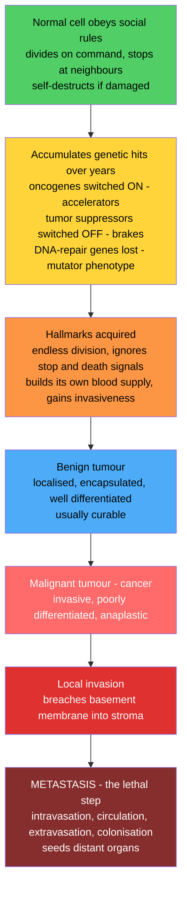

# 🎗️ Neoplasia and Cancer Biology

> [!abstract] TL;DR
> Neoplasia is autonomous, unregulated new growth of cells; cancer is its malignant form. A cell becomes malignant by accumulating multiple genetic hits over years — switching accelerators **ON** (oncogenes), brakes **OFF** (tumor suppressors), and disabling DNA repair — until it acquires the shared **hallmarks of cancer** (endless division, evasion of death, angiogenesis, invasion). The step that makes cancer lethal is **metastasis**: escape from the primary site to colonize distant organs. Understanding this pathway explains why cancer risk rises with age and exposure, and it underlies all of diagnosis, staging, and the targeted and immune therapies transforming oncology.
>
> *Educational pathophysiology at textbook level — not individual clinical advice.*

---

## Intuition

**Analogy first:** Cancer is your own cells gone rogue. Normally, every cell lives under strict social rules: it divides only when told to, stops when it touches its neighbours, does its assigned job, and quietly commits suicide (apoptosis) if it becomes damaged. Cancer is what happens when one cell accumulates enough genetic damage to break **all** those rules at once — it divides relentlessly, ignores every stop signal, refuses to die, tricks the body into building it a private blood supply, and eventually breaks free to invade and colonize distant organs.

It is like a once law-abiding citizen turning into an unstoppable, self-serving outlaw: it seizes resources, recruits accomplices, evades the police (the immune system), and spreads to new territory. Crucially, this transformation is **multi-step** — it takes several genetic "hits" over years, flipping accelerators on and cutting brakes one at a time. That is precisely why cancer risk climbs with age and with cumulative exposure to mutation-causing agents. The genius of modern oncology is realizing that although there are hundreds of cancers, they share a small set of "hallmark" tricks — and each hallmark is a target you can attack.

---

## How It Works

### Core Mechanics

Cancer is fundamentally a **genetic disease of somatic cells**: a stepwise, Darwinian process of mutation and selection playing out inside a single tissue over years to decades.

1. **A normal cell obeys the rules.** It responds to growth and stop signals, repairs its DNA, and undergoes apoptosis if it is too damaged to fix.
2. **Genetic hits accumulate.** Mutations activate **oncogenes** (gain-of-function accelerators — one hit is enough, they act dominantly), inactivate **tumor suppressor genes** (loss-of-function brakes — usually both copies must be lost, Knudson's two-hit rule), and disable **DNA-repair genes** (creating a "mutator phenotype" that speeds up all further hits).
3. **Hallmarks are acquired.** The evolving clone gains the capabilities catalogued by Hanahan and Weinberg: sustained proliferation, evasion of growth suppressors, resistance to apoptosis, replicative immortality (telomerase), angiogenesis, and invasion/metastasis — plus enabling and emerging traits like genome instability, tumor-promoting inflammation, reprogrammed metabolism, and immune evasion.
4. **A tumor forms and progresses.** Tissue passes through **dysplasia → carcinoma in situ → invasive cancer**. A **benign** tumor stays localized, encapsulated, and well differentiated; a **malignant** one is invasive, poorly differentiated (anaplastic), and capable of spreading.
5. **Metastasis — the lethal step.** Malignant cells complete the metastatic cascade (local invasion, intravasation, survival in circulation, extravasation, colonization) to seed distant organs. Disseminated disease, not the primary mass, causes roughly nine of every ten cancer deaths.

### Flow / Architecture



---

## Key Concepts

### Secondary Level

**Neoplasia means "new growth."** A neoplasm is an abnormal mass of cells that grows autonomously — it keeps proliferating even after the stimulus that started it is gone, because its growth is now hard-wired into its genes rather than controlled by the body's signals.

**Benign vs malignant — the single most important pathology distinction:**

| Feature | Benign tumor | Malignant tumor (cancer) |
|---|---|---|
| Growth | Slow, expansile | Rapid, infiltrative |
| Border | Encapsulated, well demarcated | Irregular, invades surrounding tissue |
| Differentiation | Well differentiated (looks like tissue of origin) | Poorly differentiated / anaplastic |
| Metastasis | Never | Yes — defining property |
| Typical outcome | Usually curable by excision | Can be fatal, especially once spread |

**Nomenclature — the suffix tells you the tissue of origin:**

- **-oma** generally denotes a benign tumor (e.g. adenoma, lipoma) — with important exceptions.
- **Carcinoma** = malignant tumor of **epithelial** origin (skin, gut, lung, breast, prostate) — the most common human cancers.
- **Sarcoma** = malignant tumor of **mesenchymal / connective** tissue (bone, muscle, fat, cartilage).
- **Leukemia** and **lymphoma** = malignancies of **hematologic / lymphoid** cells; the misleading "-oma" here denotes malignancy by convention.

**The progression pathway.** Cancers rarely appear fully formed. Epithelial tissue typically passes through recognizable pre-malignant stages: **normal → dysplasia** (disordered growth, still confined) **→ carcinoma in situ** (fully malignant cells that have not yet broken through the basement membrane) **→ invasive carcinoma** (cells cross the basement membrane and can now metastasize). This is why screening that catches dysplasia or carcinoma in situ — the Pap smear for cervical cancer, colonoscopy for colonic polyps — is so effective: it intercepts the disease before the invasive, lethal step.

### Undergraduate Level

**Carcinogenesis is the accumulation of driver mutations in three gene classes.**

| Gene class | Normal role | Effect of mutation | Genetics | Examples |
|---|---|---|---|---|
| **Proto-oncogene → oncogene** | Promote growth (receptors, signal GTPases, transcription factors) | Gain-of-function: accelerator stuck ON | Dominant — one hit suffices | *RAS*, *MYC*, *HER2*, *EGFR* |
| **Tumor suppressor gene** | Restrain growth, arrest cycle, trigger apoptosis, repair DNA | Loss-of-function: brakes cut | Recessive — both alleles must be lost | *TP53*, *RB1*, *APC*, *BRCA1/2* |
| **DNA-repair / caretaker gene** | Maintain genome integrity | Loss raises the mutation rate itself | Recessive (mutator phenotype) | *MLH1*, *MSH2*, *BRCA1/2* |

**TP53 — "the guardian of the genome."** Mutated in roughly half of all human cancers, the most commonly altered gene in cancer. On DNA damage, p53 arrests the cycle at the G1/S checkpoint (via the CDK inhibitor p21), induces repair, and — if damage is irreparable — triggers apoptosis. Lose p53 and damaged cells sail past checkpoints, accumulate further mutations, and refuse to die.

**RB — the master G1/S brake.** The retinoblastoma protein holds cells in G1 by sequestering the E2F transcription factor. Growth signals drive cyclin D–CDK4/6 to phosphorylate RB, releasing E2F for S-phase entry. Lose *RB1* and the brake is permanently off.

**The multi-hit model and clonal evolution.** A single mutation almost never suffices; typically 5–10 driver mutations must accumulate in one cell lineage. Each new driver gives its clone a slight fitness edge, so faster-growing subclones outcompete their neighbours — Darwinian selection operating inside a tissue. **Knudson's two-hit hypothesis** (from studying retinoblastoma) explains inherited cancer syndromes: a person born with one defective tumor suppressor allele in every cell (e.g. germline *RB1*, *TP53* in Li-Fraumeni, *BRCA1/2*) needs one fewer hit, so cancer strikes earlier and often bilaterally.

**Carcinogens** are agents that cause the mutations that drive this process:

- **Chemical** — tobacco smoke (benzo[a]pyrene), aflatoxin, aromatic amines.
- **Radiation** — UV light (pyrimidine dimers → skin cancer), ionizing radiation (double-strand breaks).
- **Viral / oncogenic infections** — **HPV** (cervical, oropharyngeal), **EBV** (Burkitt lymphoma, nasopharyngeal carcinoma), **HBV/HCV** (hepatocellular carcinoma), *H. pylori* (gastric). Vaccination against HPV and HBV is therefore genuine cancer prevention.

**The Hallmarks of Cancer (Hanahan & Weinberg).** A unifying framework: the diverse capabilities a cell must acquire to become fully malignant.

- **Core hallmarks (2000):** sustaining proliferative signalling; evading growth suppressors; resisting apoptosis; enabling replicative immortality (telomerase reactivation); inducing angiogenesis; activating invasion and metastasis.
- **Enabling characteristics (2011):** genome instability and mutation; tumor-promoting inflammation.
- **Emerging hallmarks (2011):** deregulated cellular energetics (the **Warburg effect** — aerobic glycolysis, exploited clinically by FDG-PET scans); avoiding immune destruction.

**The metastatic cascade** — why cancer kills. A malignant cell must complete every step, and each is inefficient (which is why metastasis, though lethal, is biologically difficult):

1. **Local invasion** — loss of adhesion, epithelial–mesenchymal transition (EMT), secretion of matrix metalloproteinases to breach the basement membrane.
2. **Intravasation** — entry into blood or lymphatic vessels.
3. **Survival in circulation** — resisting anoikis and immune attack as a circulating tumor cell.
4. **Extravasation** — exit into a distant tissue.
5. **Colonization** — surviving and proliferating in the foreign "soil" of a distant organ (Paget's seed-and-soil hypothesis).

**Grading and staging.** **Grade** describes how abnormal the cells look (differentiation) — a microscopic, biological measure. **Stage** describes how far the cancer has spread — the dominant prognostic factor — usually via the **TNM** system: **T** (size/extent of primary tumor), **N** (regional lymph **N**ode involvement), **M** (distant **M**etastasis). M1 disease (metastatic) generally denotes the worst prognosis, underscoring that spread, not local growth, defines lethality.

### Graduate Level

**The tumor microenvironment (TME).** A tumor is an ecosystem, not a pure clone of cancer cells. It contains cancer-associated fibroblasts (remodel matrix, secrete growth factors), tumor-associated macrophages (often adopt an immunosuppressive M2-like phenotype), regulatory T cells, and a vasculature that is leaky and disorganized. The TME shapes drug delivery, immune access, metastatic tropism, and therapeutic resistance — targeting it (anti-angiogenics, TME reprogramming) is a major frontier.

**Angiogenesis and the diffusion limit.** A solid tumor cannot grow beyond ~1–2 mm by diffusion alone; beyond that its core becomes hypoxic. Hypoxia stabilizes **HIF-1α**, which drives secretion of **VEGF**, recruiting new vessels — the "angiogenic switch." This underlies Gompertzian growth kinetics (see the Python demo) and is the rationale for anti-angiogenic drugs such as bevacizumab.

**Replicative immortality.** Normal somatic cells shorten their telomeres each division (the Hayflick limit) and eventually senesce. ~90% of cancers reactivate **telomerase** (often via *TERT* promoter mutations); the remainder use the recombination-based ALT pathway. This links directly to the biology of ageing — see the note on the [[Hallmarks_of_Aging]] and [[Cellular_Senescence_and_Senolytics]], where senescence is a double-edged sword that both suppresses and, via the senescence-associated secretory phenotype, promotes tumors.

**Immune evasion and immunotherapy.** Tumors escape immune destruction by downregulating MHC-I, recruiting immunosuppressive cells, and — critically — exploiting immune checkpoints. Tumor cells upregulate **PD-L1**, which engages **PD-1** on cytotoxic T cells to deliver an "off" signal, driving T-cell exhaustion. **Checkpoint inhibitors** (anti-PD-1 pembrolizumab/nivolumab, anti-CTLA-4 ipilimumab) release this brake. Response correlates with tumor mutational burden and **microsatellite-instability-high (MSI-H)** status, because more mutations generate more neoantigens — the basis of the first tissue-agnostic drug approval.

**Genomic instability — MSI vs CIN.** Two broad, largely mutually exclusive routes to the mutations that fuel evolution: **microsatellite instability (MSI)** from mismatch-repair loss (near-diploid, hypermutated, immunogenic) and **chromosomal instability (CIN)** from mitotic/spindle-checkpoint defects (aneuploid, structurally rearranged, often drug-resistant). This connects the molecular repair machinery — see [[Mutations_and_DNA_Repair]] and [[DNA_Repair_and_Mutation]] — directly to clinical behaviour and drug sensitivity (e.g. PARP-inhibitor synthetic lethality in *BRCA*-deficient tumors).

**Clinical basis for diagnosis and therapy.** Definitive diagnosis requires **tissue** — a **biopsy** examined histologically, increasingly supplemented by immunohistochemistry (e.g. hormone receptors, HER2), molecular profiling of driver mutations, and **liquid biopsy** (circulating tumor DNA). Serum **tumor markers** (PSA, CA-125, AFP, CEA) aid monitoring but are rarely diagnostic alone. Therapy spans four pillars: **surgery** and **radiation** (local control), **cytotoxic chemotherapy** (targets rapid division, hence its side effects on marrow, gut, and hair), **targeted therapy** (imatinib for BCR-ABL, trastuzumab for HER2, EGFR/BRAF inhibitors), and **immunotherapy** (checkpoint inhibitors, CAR-T).

---

## Python Demo

```python
# Two views of cancer biology:
#   (a) MULTI-HIT model  -> why incidence rises steeply with age
#       (Armitage-Doll multistage model: incidence ~ age^(k-1) for k required hits)
#   (b) TUMOR GROWTH     -> exponential early, then Gompertzian slowing as the
#       tumor outgrows its blood supply (motivating angiogenesis)
import numpy as np
import matplotlib.pyplot as plt

# ---------------------------------------------------------------------------
# (a) Multi-hit carcinogenesis: cancer incidence vs age
# Armitage-Doll: if a cell needs k independent "hits" (driver mutations),
# the age-specific incidence rate scales as I(t) ~ (mu * t)^(k-1).
# More required hits -> a steeper, later-rising incidence curve.
# ---------------------------------------------------------------------------
age = np.linspace(20, 85, 400)          # years
mu = 1.0e-2                              # lumped per-year hit rate (illustrative)

fig, axes = plt.subplots(1, 2, figsize=(13, 5))

for k in (2, 4, 6, 7):
    incidence = (mu * age) ** (k - 1)   # relative age-specific incidence
    incidence = incidence / incidence[-1]  # normalise to 1.0 at oldest age
    axes[0].plot(age, incidence, linewidth=2, label=f"{k} hits required")

axes[0].set_xlabel("Age (years)")
axes[0].set_ylabel("Relative cancer incidence (normalised)")
axes[0].set_title("Multi-Hit Model: Incidence Rises Steeply With Age\n"
                  "more required driver mutations -> steeper power law")
axes[0].legend()
axes[0].grid(alpha=0.3)

# ---------------------------------------------------------------------------
# (b) Tumor growth kinetics: exponential vs Gompertzian
# Exponential:  V(t) = V0 * exp(r t)                     -- unbounded
# Gompertz:     V(t) = K * exp( ln(V0/K) * exp(-b t) )   -- saturates at K
# The Gompertz plateau reflects hypoxia/nutrient limits once the tumor
# outgrows diffusion, which is exactly what drives the angiogenic switch.
# ---------------------------------------------------------------------------
t = np.linspace(0, 120, 400)            # days
V0 = 1.0e6                              # starting cell number
r = 0.06                               # exponential growth rate (per day)
K = 1.0e11                             # Gompertz carrying capacity (cells)
b = 0.045                              # Gompertz deceleration constant

V_exp = V0 * np.exp(r * t)
V_gomp = K * np.exp(np.log(V0 / K) * np.exp(-b * t))

axes[1].semilogy(t, V_exp, linewidth=2, label="Exponential (no limit)")
axes[1].semilogy(t, V_gomp, linewidth=2, label="Gompertzian (blood-supply limited)")
axes[1].axhline(K, color="gray", linestyle="--", linewidth=1,
                label="Carrying capacity K")
axes[1].set_xlabel("Time (days)")
axes[1].set_ylabel("Tumor size in cells (log scale)")
axes[1].set_title("Tumor Growth Kinetics\n"
                  "Gompertzian slowing motivates angiogenesis")
axes[1].legend()
axes[1].grid(alpha=0.3, which="both")

plt.tight_layout()
plt.show()

# ---------------------------------------------------------------------------
# Quick numeric takeaways
# ---------------------------------------------------------------------------
ratio_65_45 = ((mu * 65) ** 6) / ((mu * 45) ** 6)   # 7-hit model, 20-year gap
print(f"7-hit model: incidence at 65 vs 45 is ~{ratio_65_45:.1f}x higher")
print(f"Gompertz size at t=120 d: {V_gomp[-1]:.2e} cells "
      f"({100 * V_gomp[-1] / K:.1f} percent of capacity)")
```

The left panel shows why cancer is largely an age- and exposure-related disease: if malignancy requires several independent hits, incidence follows a steep power law in age — and the more hits required, the steeper and later the curve. The right panel contrasts naive exponential growth with realistic **Gompertzian** kinetics: early growth is near-exponential, but as the tumor outgrows what diffusion can supply, growth decelerates toward a plateau — the hypoxic pressure that triggers the angiogenic switch and, clinically, the rationale for anti-angiogenic drugs.

---

## Real-World Applications

> **Cervical cancer screening and HPV — interrupting the progression pathway.** Persistent infection with high-risk **HPV** (types 16/18) drives cervical epithelium through dysplasia (CIN 1–3) and carcinoma in situ before invasion. The Pap smear and HPV DNA testing detect these pre-invasive stages, and the HPV vaccine prevents the initiating infection outright — one of the clearest demonstrations that neoplasia is a preventable, multi-step process rather than a sudden event.

> **CML and imatinib — the targeted-therapy paradigm.** Chronic myeloid leukemia is driven in >95% of cases by the Philadelphia chromosome t(9;22), fusing *BCR* to *ABL1* into a constitutively active tyrosine kinase (an oncogene). Imatinib, designed to block that specific kinase, converted a fatal disease into a manageable chronic condition — proof that understanding the exact hallmark lesion enables precise, less-toxic therapy.

> **HER2-positive breast cancer and trastuzumab.** Amplification of the *HER2* proto-oncogene, found in ~15–20% of breast cancers, drives sustained proliferative signalling. The anti-HER2 antibody trastuzumab exploits this dependence — a direct clinical application of oncogene addiction, and the reason a single histologic "breast cancer" is now subtyped molecularly (HER2, hormone-receptor, BRCA status) before treatment.

> **MSI-high tumors and tissue-agnostic immunotherapy.** Lynch-syndrome and other mismatch-repair-deficient tumors accumulate thousands of mutations, generating abundant neoantigens. In 2017 the FDA approved pembrolizumab for **any** MSI-H solid tumor regardless of organ of origin — the first tissue-agnostic approval, driven entirely by a shared molecular hallmark (genome instability + immunogenicity) rather than anatomy.

> **FDG-PET and the Warburg effect.** Because many tumors preferentially perform glycolysis even with oxygen present, they avidly take up glucose. Radiolabeled glucose analog (FDG) concentrates in these metabolically hungry lesions, letting PET scans locate primary tumors and metastases — a direct clinical exploitation of the reprogrammed-metabolism hallmark.

---

## Common Pitfalls

- **"Cancer is one disease."** It is hundreds of diseases sharing the theme of dysregulated, autonomous growth. The specific driver mutations, behaviour, and treatment differ enormously across — and even within — tumor types.
- **"One mutation causes cancer."** Except in rare inherited syndromes, malignancy requires an *accumulation* of several driver mutations — which is exactly why incidence rises so steeply with age. Attributing a cancer to a single event misreads the biology.
- **"The primary tumor is what kills you."** Usually **metastasis** does. A localized primary is often curable by surgery or radiation; disseminated disease is the lethal problem. Never conflate tumor *size* with tumor *stage*.
- **"Benign means harmless."** Benign tumors do not metastasize, but a benign meningioma compressing the brainstem or a benign adenoma secreting excess hormone can still be dangerous by location or function. "Benign" refers to biological behaviour, not clinical triviality.
- **"Oncogenes and tumor suppressors are just opposites."** They differ mechanistically: oncogenes are **gain-of-function and dominant** (one hit), tumor suppressors are **loss-of-function and usually recessive** (two hits, per Knudson). This asymmetry is why suppressor loss dominates inherited cancer syndromes.
- **"Grade and stage are the same thing."** Grade describes how abnormal cells *look* (differentiation); stage describes how far the cancer has *spread* (TNM). Stage is usually the stronger prognostic driver — a low-grade cancer that has metastasized is still advanced disease.
- **"Chemotherapy only kills cancer cells."** Classic cytotoxic chemotherapy targets *all* rapidly dividing cells; its side effects on bone marrow, gut lining, and hair follicles are a direct, predictable consequence of that lack of selectivity — the very reason targeted and immune therapies were developed.

---

## Related Concepts

This note is the clinical/pathology view of neoplasia and complements several sibling notes in *01 Foundations of Disease and Pathophysiology*. It follows directly from **Cellular Injury and Adaptation** — cancer is the extreme endpoint of failed adaptation and lost apoptosis, where a damaged cell that should die instead proliferates. It is one branch of the broader **Etiology and Mechanisms of Disease** (cancer as disease-by-broken-regulation), overlaps **Genetic and Congenital Disease** through inherited cancer-predisposition syndromes (Li-Fraumeni, hereditary breast/ovarian, familial adenomatous polyposis), connects to **Immune Dysfunction and Autoimmunity** through immune surveillance and the immune-evasion hallmark, and feeds forward into **Precision Medicine and Genomics in the Clinic**, which operationalizes tumor sequencing, targeted agents, and liquid biopsy.

Cross-vault links (Glob-verified):

- [[Cancer_and_the_Cell_Cycle]] (Biology/06) — the cell-biology view: how oncogene/tumor-suppressor mutations dysregulate the division machinery this note treats clinically.
- [[Cancer_Genetics_and_Oncogenes]] (Genetics/05) — deep dive on somatic evolution, oncogene activation mechanisms, mutational signatures, and the molecular genetics behind carcinogenesis.
- [[Mutations_and_DNA_Repair]] (Biology/04) — how mutations arise and are repaired; repair failure is the mutator phenotype that accelerates carcinogenesis.
- [[DNA_Repair_and_Mutation]] (Genetics/01) — mismatch/homologous-recombination repair, MSI vs CIN, and synthetic-lethality therapeutics (PARP inhibitors).
- [[The_Cell_Cycle_and_Mitosis]] (Biology/06) — the normal checkpoints, cyclins/CDKs, RB, and p53 controls whose failure defines neoplasia.
- [[Gene_Regulation]] (Biology/04) — epigenetic silencing of tumor suppressors and reprogramming of gene expression in cancer.
- [[Hallmarks_of_Aging]] (Health/05) — genomic instability, telomere attrition, and cellular senescence are shared mechanisms linking cancer and ageing, explaining the age–incidence relationship.
- [[Cellular_Senescence_and_Senolytics]] (Health/05) — senescence as a double-edged tumor-suppressive yet tumor-promoting force via the senescence-associated secretory phenotype.

---

## Review Questions

1. **(Secondary)** A patient has two tumors: one is well-differentiated, encapsulated, and slow-growing; the other is poorly differentiated, invades surrounding tissue, and has spread to a lymph node. (a) Which is benign and which is malignant, and what single property most decisively distinguishes them? (b) If the malignant tumor is of epithelial origin, what is it called? (c) Why does the pre-invasive stage of a cancer (carcinoma in situ) make screening programs so effective?

2. **(Undergraduate)** Explain why cancer incidence rises steeply with age, using the multi-hit model. (a) How does the Armitage-Doll relationship (incidence ~ age^(k-1)) connect the number of required driver mutations to the shape of the age–incidence curve? (b) Contrast an oncogene mutation with a tumor-suppressor mutation in terms of gain vs loss of function, dominance, and number of alleles that must be hit. (c) Why do people with a germline *TP53* mutation (Li-Fraumeni syndrome) develop cancer earlier than the general population?

3. **(Graduate)** A metastatic colorectal cancer is sequenced and found to be mismatch-repair-deficient (MSI-high) with a high tumor mutational burden. (a) Which class of cancer gene is disabled, and how does its loss generate the MSI phenotype? (b) Explain mechanistically why this tumor is an excellent candidate for anti-PD-1 checkpoint immunotherapy, referencing neoantigens and the immune-evasion hallmark. (c) A different colorectal tumor is instead chromosomally unstable (CIN) and MSI-stable; why would you expect it to respond less well to checkpoint blockade, and what does this teach about matching therapy to the specific hallmark lesion?

---

## Sources

- Hanahan, D. & Weinberg, R. A. (2011). "Hallmarks of Cancer: The Next Generation." *Cell*, 144(5), 646–674. https://pubmed.ncbi.nlm.nih.gov/21376230/
- Kumar, V., Abbas, A. K., & Aster, J. C. *Robbins & Cotran Pathologic Basis of Disease* (10th ed.), Chapter 7: Neoplasia. Elsevier.
- Weinberg, R. A. (2013). *The Biology of Cancer* (2nd ed.). Garland Science.
- Vogelstein, B. & Kinzler, K. W. (2004). "Cancer genes and the pathways they control." *Nature Medicine*, 10(8), 789–799. https://www.nature.com/articles/nm1087
- Hanahan, D. (2022). "Hallmarks of Cancer: New Dimensions." *Cancer Discovery*, 12(1), 31–46. https://aacrjournals.org/cancerdiscovery/article/12/1/31/675608

---

#clinical-medicine #cancer #neoplasia #oncogenes #metastasis
