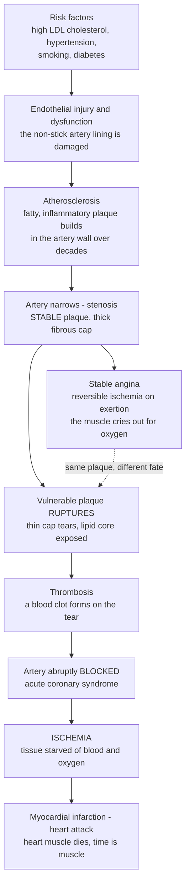

# 🫀 Cardiovascular Pathophysiology

> [!abstract] TL;DR
> The cardiovascular system is a **pump** (the heart) driving blood through **plumbing** (the vessels) to deliver oxygen and fuel to every cell. Most cardiovascular disease comes down to that plumbing slowly clogging. **Atherosclerosis** — a chronic *inflammatory* disease of the artery wall — deposits fatty, inflammatory **plaques** inside arteries over decades, narrowing and stiffening them. While blood still trickles through, you feel fine; but when demand rises (climbing stairs) the narrowed pipe cannot deliver enough oxygen and the muscle cries out — **angina**. The catastrophe comes when a **vulnerable plaque ruptures**: the body treats the tear as a wound and forms a **clot** (thrombus) that can abruptly block the artery entirely. Block a coronary artery and the starved heart muscle dies — a **myocardial infarction (heart attack)**; block a cerebral artery and you get a **stroke**. This single story — *plaques build silently, then rupture to trigger a clot that starves tissue of blood (ischemia)* — sits beneath the world's **leading cause of death** and explains angina, heart attacks, and why we worry so much about cholesterol, blood pressure, and smoking. As the opener for the Cardiovascular and Respiratory section, this note lays the groundwork for heart failure, arrhythmias, hypertension, and shock.

---

## Intuition

**Analogy — the heart is a pump and the vessels are the plumbing of a house.** Picture a building kept alive by a central pump pushing water through a network of pipes to every faucet. As long as every pipe is clear and the pump is strong, water arrives at full pressure wherever it is needed. Now imagine that over *decades*, rust and greasy gunk quietly accumulate on the inside walls of certain pipes. Nothing seems wrong at first — the pipe is a little narrower, but at rest enough water still gets through, so no faucet runs dry. The clogging is **silent**.

The trouble shows up only when **demand rises**. Open several faucets at once (climb a flight of stairs, and the heart muscle suddenly needs far more oxygen) and the narrowed pipe simply cannot supply the surge; the far faucets sputter. In the heart this sputtering is felt as **angina** — a pressure or ache in the chest, the muscle *crying out for oxygen*. Rest, demand falls, and the ache fades. That reversible, effort-triggered shortfall is **stable angina**: the plumbing is narrowed but intact.

The real catastrophe is different in kind. One of those greasy deposits has a thin, fragile shell, and one day it **cracks open**. The body, seeing what looks like a wound, does exactly what it evolved to do at a cut — it forms a **clot** to seal it. But here the clot forms *inside* the pipe, and within minutes it can plug the artery **completely**. Downstream, everything the pipe fed is abruptly cut off from blood — **ischemia**. Block a heart artery and a patch of heart muscle begins to die: a **heart attack**. Block a brain artery and neurons die: a **stroke**. Everything that follows in this note — cholesterol, blood pressure, smoking, chest pain, "time is muscle," the urgency of reopening the artery — is a footnote to this one mechanical story of *pipes clogging silently, then rupturing to trigger a clot that starves living tissue*.

---

## How It Works

### The system: a quick physiology recap

The heart is a **muscular double pump**. Its output is captured in one equation: **cardiac output = heart rate × stroke volume** — how many times per minute it beats, times how much blood it ejects per beat. Stroke volume depends on three levers: **preload** (how full the ventricle is before it contracts — the stretch on the muscle), **afterload** (the pressure it must push against to open the aortic valve), and **contractility** (the intrinsic vigor of the squeeze). Blood leaves the left ventricle under pressure, and the *difference* between that arterial pressure and the pressure downstream — the **perfusion pressure** — is what actually drives flow into each organ.

Crucially, **the heart must feed itself**. The **coronary arteries** branch off the aorta at its very root and lie on the heart's surface, diving in to supply the myocardium. Coronary flow has a peculiar constraint: the heart squeezes its own supply vessels shut during **systole** (contraction), so the left ventricle is perfused mainly during **diastole** (relaxation). This is why anything that shortens diastole or drops diastolic pressure (a racing heart, very low blood pressure) is doubly dangerous for a heart whose arteries are already narrowed.

### Atherosclerosis: the central process

Atherosclerosis is best understood not as passive "clogging" but as a **chronic inflammatory disease of the arterial wall** — a decades-long, stereotyped sequence:

1. **Endothelial injury and dysfunction.** The endothelium is the single-cell-thick, non-stick lining of every vessel. Chronic insults — the mechanical battering of **hypertension**, chemicals in **cigarette smoke**, the metabolic stress of **diabetes**, and turbulent **shear stress** at branch points — injure it. Injured endothelium becomes leaky and "sticky," expressing adhesion molecules.
2. **Lipid entry and oxidation.** **LDL cholesterol** particles slip through the damaged lining into the wall and become **oxidized** — chemically modified into a danger signal the immune system recognizes.
3. **Inflammatory recruitment and foam cells.** Monocytes stick to the activated endothelium, migrate into the wall, mature into **macrophages**, and gorge on oxidized LDL. Stuffed with lipid droplets, they become **foam cells** — the microscopic hallmark of the disease.
4. **Fatty streak.** Accumulated foam cells form the earliest visible lesion, the **fatty streak** — present in the arteries of many people by early adulthood, and still fully reversible.
5. **Fibrous plaque.** Smooth-muscle cells migrate in and lay down collagen, building a **fibrous cap** over a growing, soft **lipid (necrotic) core** of dead foam cells and cholesterol. This mature **atheromatous plaque** progressively **narrows the lumen** — the stenosis.

Two plaque *fates* now diverge, and the distinction is everything:

- **Stable plaque:** a small lipid core under a **thick, tough fibrous cap**. It narrows the artery and can cause **demand ischemia** — *stable angina* on exertion — but it is mechanically robust.
- **Vulnerable plaque:** a large soft lipid core under a **thin, inflamed cap** riddled with macrophages secreting enzymes that digest the cap. It may cause little narrowing — and therefore no symptoms — yet it is a time bomb.

### Ischemic heart disease: the supply–demand imbalance

**Ischemia** is any mismatch where oxygen **supply** falls short of myocardial **demand**. It arrives in two ways:

- **Chronic, stable narrowing → stable angina.** A fixed stenosis limits *maximal* flow. At rest, supply suffices; on exertion, demand outstrips the artery's capacity and the muscle becomes ischemic, producing **reversible** chest pain that resolves with rest.
- **Acute plaque rupture → acute coronary syndromes (ACS).** When a vulnerable cap tears, the lipid core — intensely thrombogenic — is exposed to flowing blood. Platelets adhere and the **coagulation cascade** fires, building a **thrombus** on the plaque (the link to *hemostasis and thrombosis*). Depending on how completely and how long the clot occludes the vessel, the result is:
  - **Unstable angina** — a non-occlusive or transient clot; ischemic pain now at rest, but no muscle death yet.
  - **NSTEMI** (non-ST-elevation MI) — usually a partially occluding thrombus causing **subendocardial** necrosis; troponin rises.
  - **STEMI** (ST-elevation MI) — a **fully occluding** thrombus; the classic transmural heart attack.

**Myocardial infarction** is **irreversible ischemic necrosis** of heart muscle (the link to *cellular injury and cell death*). Deprived of oxygen, cardiomyocytes exhaust their ATP within minutes and shift to anaemic anaerobic metabolism; if flow is not restored, they die by **coagulative necrosis**. Injury spreads as a **wavefront** from the inner (subendocardial) layer outward — hence **"time is muscle."** The therapeutic imperative is **reperfusion**: reopen the artery fast (primary **PCI**/stent, or **thrombolysis**) to salvage muscle still on the edge of death.

The **consequences** of ischemic damage cascade forward into the rest of this section: dying or scarred muscle is electrically unstable and can trigger lethal **arrhythmias**; loss of contracting muscle and subsequent **ventricular remodeling** (the healthy muscle dilates and thins to compensate) drive **heart failure**; and massive pump failure can precipitate **cardiogenic shock**.

### The whole arc, from risk factor to dead muscle



*Read the top path as the slow, silent, decades-long build; the branch to the right is the acute catastrophe. The same plaque that merely narrows can, on any given day, rupture — which is why an artery only "70 percent blocked" can still kill without warning.*

---

## Key Concepts

### Secondary (intuitive)

- **The heart is a pump; vessels are pipes.** Disease is mostly the pipes slowly clogging.
- **Atherosclerosis** = fatty, gunky **plaque** building up inside artery walls over many years, like grime narrowing a pipe.
- **Angina** = chest pain when a narrowed heart artery cannot deliver enough oxygen during effort — the muscle "complaining." It eases with rest.
- **Heart attack (myocardial infarction)** = a plaque suddenly **cracks**, a **clot** forms and **blocks** the artery, and the starved heart muscle **dies**.
- **Ischemia** = tissue starved of blood. Same idea in the brain is a **stroke**.
- **Why we nag about cholesterol, blood pressure, and smoking** = each one speeds up the clogging.

### Undergraduate (formal)

- **Cardiac output = heart rate × stroke volume**, with stroke volume set by **preload, afterload, contractility**. **Perfusion** depends on the pressure gradient across an organ; the **left ventricle is perfused in diastole**.
- **Atherogenesis** (the response-to-injury model): endothelial dysfunction → LDL infiltration and oxidation → monocyte recruitment → **foam cells** → **fatty streak** → fibrous plaque with a **lipid core and fibrous cap** → progressive **stenosis**.
- **Stable vs vulnerable plaque:** stability is governed by **cap thickness and inflammation**, not merely by degree of narrowing. Most fatal MIs arise from **non-critical** (often under 50 percent) but vulnerable plaques that rupture.
- **The ischemic supply–demand equation:** supply = coronary flow × oxygen content; demand rises with **heart rate, contractility, and wall stress** (preload × afterload). Angina is a demand-side unmasking of a supply-side limit.
- **The spectrum of coronary disease:** stable angina → **acute coronary syndromes** (unstable angina, NSTEMI, STEMI), separated by whether a thrombus forms and whether necrosis (troponin release) occurs.
- **Infarct evolution:** irreversible injury begins after roughly 20–40 minutes of total occlusion and spreads as a **subendocardial-to-epicardial wavefront** — the physiological basis of urgent **reperfusion**.

### Graduate (mechanistic and systems)

- **Atherosclerosis as chronic maladaptive inflammation.** Beyond lipids, the disease is driven by innate and adaptive immunity — the **NLRP3 inflammasome** and **IL-1β** axis validated clinically by the **CANTOS** trial, where anti-inflammatory therapy cut cardiovascular events *independently of lipid lowering*. This reframes atherosclerosis as an immunometabolic disorder, not a plumbing accident.
- **Hemodynamics of stenosis (why disease is silent then sudden).** Flow through the stenotic segment obeys Poiseuille-like physics, **conductance scaling with the fourth power of radius**, in series with a distal bed that **autoregulates** by vasodilation. **Resting flow** is defended until a *critical* stenosis, whereas **maximal (hyperemic) flow** — and thus **coronary flow reserve (CFR)** — declines from mild stenosis onward. When CFR falls to 1, even rest is ischemic. This is quantified clinically as **fractional flow reserve (FFR)**.
- **Ischemia–reperfusion injury.** Restoring flow is not free: reoxygenation triggers a **burst of reactive oxygen species**, **calcium overload**, and opening of the **mitochondrial permeability transition pore**, killing cells that survived the ischemia itself. The frontier of infarct therapy is limiting *reperfusion* injury, not just ischemia.
- **The vulnerable-plaque paradox and its clinical consequence.** Because rupture-prone plaques are often non-obstructive, **angiographic stenosis poorly predicts future MI**, and **stenting a stable narrowing does not prevent infarction** (the ORBITA and ISCHEMIA trials). This shifts prevention from mechanical fixes toward **systemic risk-factor control** — aggressive LDL lowering, blood-pressure control, smoking cessation, antithrombotic therapy.
- **Post-infarct remodeling as a control problem.** Loss of contractile mass triggers neurohormonal compensation (**RAAS, sympathetic activation**) that raises preload and afterload to defend output — but chronically dilates and stiffens the ventricle, the *compensation-turns-harmful* motif that becomes **heart failure**. Modern therapy blocks these very compensations.
- **One process, many territories.** The *same* atherosclerotic mechanism produces **coronary** disease, **cerebrovascular** disease (stroke), **peripheral arterial** disease (claudication), and contributes to **aneurysm** (wall weakening and dilation) and **dissection** (a tear splitting the wall) — making atherosclerosis a *systemic* disease with local presentations.

---

## Python Demo

```python
# Cardiovascular pathophysiology in two pictures:
#   (a) STENOSIS, FLOW RESERVE, AND SUPPLY-DEMAND: why a clogging artery is
#       SILENT for years then SUDDENLY symptomatic. Flow through the narrowed
#       segment scales with the 4th power of the residual radius (Poiseuille),
#       in series with a distal bed that vasodilates to defend RESTING flow.
#       -> Resting flow is preserved until a CRITICAL stenosis, but MAXIMAL
#          (exercise) flow falls from mild stenosis on -> angina appears on
#          exertion long before rest is threatened.
#   (b) "TIME IS MUSCLE": once a coronary artery is fully blocked, the fraction
#       of heart muscle still SALVAGEABLE by reperfusion collapses with time
#       (the necrosis wavefront) -> the clinical urgency of reopening the artery.
import numpy as np
import matplotlib.pyplot as plt

# ---------- (a) Stenosis -> flow reserve & supply-demand ----------
s = np.linspace(0.0, 0.95, 400)          # fractional DIAMETER stenosis (0 = normal, 1 = closed)
r = 1.0 - s                               # residual radius fraction

dP        = 1.0                           # perfusion pressure (normalized)
R_bed_min = 0.25                          # fully dilated distal bed -> healthy CFR ~ 4
R_bed_rest= 1.0                           # resting distal bed resistance (dominant)
k         = 0.008                         # stenosis geometry factor
R_sten    = k * (1.0 / r**4 - 1.0)        # stenosis resistance ~ 1/radius^4 (Poiseuille)

Q_max  = dP / (R_sten + R_bed_min)        # maximal (hyperemic / exercise) flow capacity
Q_rest = np.minimum(1.0, Q_max)           # resting flow: autoregulated to 1 until capacity fails
CFR    = Q_max / Q_rest                    # coronary flow reserve

demand_exercise = 2.5                      # moderate exertion needs ~2.5x resting flow
demand_rest     = 1.0
pct = s * 100.0

# thresholds (interpolate the stenosis where capacity crosses each demand)
s_exertional = np.interp(-demand_exercise, -Q_max, pct)   # onset of EXERTIONAL angina
s_rest       = np.interp(-demand_rest,     -Q_max, pct)   # ischemia even at REST

# ---------- (b) "Time is muscle": salvageable myocardium vs time to reperfusion ----------
t = np.linspace(0, 12, 400)               # hours from total coronary occlusion
t_half, hill = 2.0, 1.6                   # necrosis-wavefront midpoint & steepness
necrosis  = t**hill / (t**hill + t_half**hill)
salvage   = 100.0 * (1.0 - necrosis)      # % of at-risk muscle still salvageable
t_pci     = 1.5                            # target reperfusion time (door-to-balloon ~90 min)
salvage_pci = np.interp(t_pci, t, salvage)

fig, (ax1, ax2) = plt.subplots(1, 2, figsize=(14, 5.5))

# --- panel (a) ---
ax1.plot(pct, Q_max,  color="#C0392B", lw=2.2, label="Maximal flow capacity (exertion)")
ax1.plot(pct, Q_rest, color="#27AE60", lw=2.2, label="Resting flow (autoregulated)")
ax1.axhline(demand_exercise, color="#E67E22", ls="--", lw=1.3, label="Exercise demand (~2.5x)")
ax1.axhline(demand_rest,     color="#7F8C8D", ls=":",  lw=1.3, label="Resting demand (1x)")
ax1.axvspan(s_exertional, s_rest, color="#F39C12", alpha=0.15)
ax1.axvspan(s_rest, 95,          color="#C0392B", alpha=0.12)
ax1.text((s_exertional+s_rest)/2, 3.4, "stable\nangina", ha="center", fontsize=8, color="#B9770E")
ax1.text((s_rest+95)/2, 3.4, "rest\nischemia", ha="center", fontsize=8, color="#922B21")
ax1.axvline(s_exertional, color="#E67E22", lw=0.8, alpha=0.6)
ax1.axvline(s_rest,       color="#C0392B", lw=0.8, alpha=0.6)
ax1.set_xlabel("Percent diameter stenosis")
ax1.set_ylabel("Coronary flow (multiples of resting)")
ax1.set_title("(a) Silent, then sudden: flow reserve vs stenosis")
ax1.set_ylim(0, 4.2); ax1.set_xlim(0, 95)
ax1.legend(loc="upper right", fontsize=7.5); ax1.grid(alpha=0.3)

# --- panel (b) ---
ax2.plot(t, salvage, color="#2980B9", lw=2.4)
ax2.fill_between(t, 0, salvage, where=(t <= 3.0), color="#2ECC71", alpha=0.18, label="golden window")
ax2.axvline(t_pci, color="#C0392B", ls="--", lw=1.4)
ax2.plot(t_pci, salvage_pci, "o", color="#C0392B")
ax2.annotate(f"reperfuse at {t_pci} h\n-> {salvage_pci:.0f}% salvageable",
             xy=(t_pci, salvage_pci), xytext=(4.2, 74), fontsize=9,
             arrowprops=dict(arrowstyle="->", color="#C0392B"))
ax2.set_xlabel("Hours from complete coronary occlusion")
ax2.set_ylabel("Salvageable myocardium (% of area at risk)")
ax2.set_title('(b) "Time is muscle": salvage vs delay to reperfusion')
ax2.set_ylim(0, 100); ax2.set_xlim(0, 12)
ax2.legend(loc="upper right", fontsize=8); ax2.grid(alpha=0.3)

plt.tight_layout()
plt.show()

print(f"Exertional angina appears near {s_exertional:4.0f}% stenosis "
      f"(resting flow still fully preserved -> disease is SILENT at rest).")
print(f"Ischemia at rest appears near   {s_rest:4.0f}% stenosis "
      f"(coronary flow reserve exhausted).")
print(f"Reperfusion at {t_pci} h salvages ~{salvage_pci:.0f}% of muscle; "
      f"by 6 h only ~{np.interp(6, t, salvage):.0f}% remains salvageable.")
```

**What you see.** *Panel (a)* is the mechanical reason cardiovascular disease is so treacherous. Thanks to the **fourth-power** dependence of flow on radius and a distal bed that dilates to protect resting supply, the **green resting-flow curve stays flat** — perfectly normal — until a *critical* narrowing, so a patient with a 50–60 percent blockage feels completely fine at rest. But the **red maximal-flow curve falls from mild stenosis onward**: once it dips below the exercise demand line, the same person gets **angina climbing stairs** while still symptom-free sitting down. Push the stenosis further and even resting demand can't be met — ischemia at rest, the ominous territory of acute coronary syndromes. *Panel (b)* is the counterpart urgency once a plaque ruptures and blocks the artery: the fraction of heart muscle still **salvageable by reopening the vessel collapses within hours** as the necrosis wavefront advances. Reperfuse early (the "golden window") and most muscle survives; delay past six hours and there is little left to save — the quantitative meaning of **"time is muscle."**

---

## Real-World Applications

- **Chest-pain triage and the ECG–troponin workup.** Emergency assessment of chest pain is applied ischemic pathophysiology: the **ECG** reads the electrical signature of ischemic muscle (ST elevation = full-thickness injury of a fully blocked artery), while **troponin** — a protein released only when cardiomyocytes die — separates unstable angina (no necrosis) from NSTEMI/STEMI (necrosis).
- **Reperfusion therapy.** **Primary PCI** (balloon angioplasty and stenting) and **thrombolysis** exist to reopen an occluded coronary artery *before the wavefront finishes*, directly exploiting the salvage curve above. Systems of care are engineered around **door-to-balloon time**.
- **Statins and aggressive LDL lowering.** Because atherogenesis is driven by LDL infiltration, lowering LDL with **statins**, ezetimibe, and **PCSK9 inhibitors** slows plaque growth and — importantly — **stabilizes** vulnerable plaques, cutting rupture risk beyond the effect on stenosis size.
- **Antithrombotic therapy.** **Aspirin** and **P2Y12 inhibitors** (e.g., clopidogrel, ticagrelor) blunt the platelet response so that a small plaque rupture is less likely to build an occlusive clot — the pharmacological interruption of the rupture-to-thrombosis step.
- **Risk scoring and prevention.** Tools such as the **ASCVD** and **Framingham** risk scores integrate LDL, blood pressure, smoking, diabetes, age, and sex to estimate 10-year cardiovascular risk and target statin/blood-pressure therapy at those most likely to benefit.
- **Physiology-guided intervention.** **Fractional flow reserve (FFR)** measures whether a given stenosis actually limits flow, so cardiologists stent lesions that are *functionally* significant rather than merely *anatomically* narrow — a direct clinical use of the flow-reserve concept in panel (a).

---

## Common Pitfalls

- **"The disease is silent, so the artery must be fine."** The flat resting-flow curve means a dangerously narrowed — or a non-narrowing but *vulnerable* — artery can produce **no symptoms at rest**. Absence of chest pain is not absence of disease; this is why screening and risk factors, not symptoms, drive prevention.
- **Equating degree of stenosis with risk of heart attack.** Most fatal infarctions arise from **non-critical** plaques (often under 50 percent) that rupture, not from the tightest narrowing. Stenosis severity predicts *angina*; plaque *vulnerability* predicts *MI*. Conflating them leads to over-valuing stents for stable disease.
- **Assuming a stent prevents future heart attacks.** In **stable** coronary disease, stenting relieves angina but (per ORBITA/ISCHEMIA) does **not** reduce infarction or death versus optimal medical therapy — because it treats one narrowing while the systemic, rupture-prone disease continues elsewhere.
- **Treating cholesterol as merely a "clog."** LDL is not passive sludge; atherosclerosis is an **active inflammatory** process. This is why anti-inflammatory pathways matter and why plaque *stabilization*, not just luminal widening, is a therapeutic goal.
- **Forgetting that reperfusion itself injures.** Reopening the artery causes **ischemia–reperfusion injury** (oxidative burst, calcium overload). Restoring flow is essential but not costless, and "no-reflow" can occur even after the epicardial artery is opened.
- **Reading this as medical advice.** This note describes disease *mechanisms* at textbook level. It is not guidance for any individual's chest pain, cholesterol, or treatment, which require a clinician and the specifics of a real patient — and acute chest pain is an emergency.

---

## Related Concepts

**Within this section (Cardiovascular and Respiratory Disease).** This opener frames the notes that follow, all of which are downstream consequences of the machinery described here. *Heart Failure and Arrhythmias* picks up where infarction and remodeling leave off — how a damaged or overloaded pump progressively fails, and how scarred, ischemic muscle becomes electrically unstable. *Hypertension and Vascular Disease* zooms in on the leading *driver* of endothelial injury and on the wider vascular consequences of the same atherosclerotic process — aneurysm, dissection, and peripheral and cerebrovascular disease. *Shock and Circulatory Collapse* covers the acute failure of perfusion itself, including the **cardiogenic shock** that a massive infarct can precipitate. Reaching back into the foundations, *Cellular Injury and Adaptation* supplies the cell-death biology (reversible ischemia versus irreversible necrosis) that defines an infarct, and *Hemostasis, Thrombosis, and Bleeding Disorders* supplies the clotting machinery that turns a plaque rupture into an occlusion. These are prose references to sibling notes in the Clinical Medicine vault.

**Across the vault (Glob-verified links).**

- [[Clinical_Medicine/01_Foundations_of_Disease_and_Pathophysiology/Clinical_Medicine_and_Pathophysiology_Overview|Clinical Medicine and Pathophysiology Overview]] — the parent hub; frames disease as failed homeostasis and compensation turned harmful, exactly the pattern seen in atherosclerosis and post-infarct remodeling.
- [[Biology/09_Human_Physiology_and_Anatomy/The_Circulatory_and_Respiratory_Systems|The Circulatory and Respiratory Systems]] — the healthy physiology this note breaks: heart as pump, arteries/capillaries/veins, and the oxygen delivery that ischemia interrupts.
- [[Biology/11_Microbiology_and_Immunology/The_Innate_Immune_System|The Innate Immune System]] — the macrophages and inflammatory signaling that make atherosclerosis an immune disease, not passive clogging.
- [[Biology/01_Chemistry_of_Life/Carbohydrates_and_Lipids|Carbohydrates and Lipids]] — the chemistry of cholesterol and lipoproteins (LDL) that infiltrate and oxidize within the arterial wall.
- [[Health_Nutrition_and_Longevity/01_Foundations_of_Health/Biomarkers_and_Measuring_Health|Biomarkers and Measuring Health]] — how cholesterol, blood pressure, and other risk markers are measured and interpreted for prevention.
- [[Health_Nutrition_and_Longevity/02_Nutrition_Science/Macronutrients_Protein_Carbs_and_Fats|Macronutrients: Protein, Carbs, and Fats]] — dietary fats and their relationship to blood lipids, one lever on modifiable risk.
- [[Health_Nutrition_and_Longevity/03_Exercise_and_Physical_Activity/Cardiovascular_Fitness_and_Aerobic_Training|Cardiovascular Fitness and Aerobic Training]] — the prevention-side mirror image: how exercise lowers the modifiable risk factors that drive atherogenesis.
- [[Fluid_Dynamics/03_Viscous_Flow_and_Boundary_Layers/Laminar_Flow_and_Exact_Solutions|Laminar Flow and Exact Solutions]] — the Poiseuille physics (flow scaling with the fourth power of radius) that underlies the stenosis flow-reserve curve in panel (a).

---

## Review Questions

**Secondary.** Using the "pump and plumbing" picture, explain why someone with a narrowed heart artery can feel completely fine sitting on the couch but get chest pain climbing stairs. What is different about *effort* that unmasks the problem? Then describe, in plain terms, what turns that stable situation into a heart attack.

**Undergraduate.** Distinguish **stable angina** from a **myocardial infarction** in terms of the underlying plaque behaviour, the presence or absence of a thrombus, and whether the muscle injury is reversible. Why does the phrase "time is muscle" follow directly from the way an infarct evolves after a coronary artery is completely occluded, and how does that dictate treatment?

**Graduate.** A patient has a coronary lesion that is only 40 percent stenosed on angiography, yet suffers a fatal heart attack; another has an 80 percent stable stenosis and has never had an infarct. Explain this paradox using the concepts of **plaque vulnerability**, **coronary flow reserve**, and **thrombosis**. What does it imply about the relative value of *stenting a stable narrowing* versus *systemic risk-factor and antithrombotic therapy* for preventing infarction, and which trials inform that conclusion?

---

## Sources

- Kumar, V., Abbas, A. K., & Aster, J. C. *Robbins & Cotran Pathologic Basis of Disease* (10th ed.). Elsevier — chapters on Blood Vessels (atherosclerosis) and the Heart (ischemic heart disease and infarct evolution).
- Loscalzo, J., Fauci, A., Kasper, D., et al. (eds.). *Harrison's Principles of Internal Medicine* (21st ed.). McGraw-Hill — Cardiovascular section: coronary artery disease, stable angina, and acute coronary syndromes.
- Libby, P. (2021). "The changing landscape of atherosclerosis." *Nature*, 592, 524–533 — atherosclerosis as an inflammatory, immunometabolic disease.
- Lilly, L. S. (ed.). *Pathophysiology of Heart Disease* (7th ed.). Wolters Kluwer — student-level integration of coronary hemodynamics, ischemia, and infarction.
- Reimer, K. A., & Jennings, R. B. (1979). "The 'wavefront phenomenon' of myocardial ischemic cell death." *Laboratory Investigation*, 40(6), 633–644 — the experimental basis of "time is muscle."

---

#clinical-medicine #cardiovascular #atherosclerosis #ischemia #heart-attack
