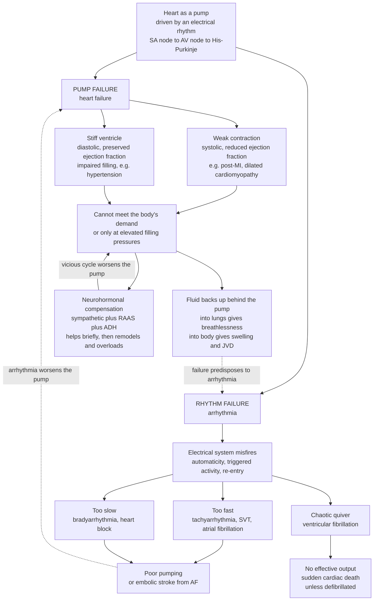

# 🫀 Heart Failure and Arrhythmias

> [!abstract] TL;DR
> A heart is a **pump wired to an electrical clock**, and it can fail in exactly two ways. **Heart failure** is *pump* failure: the muscle grows too **weak** (systolic, reduced ejection fraction — e.g. after a heart attack) or too **stiff** (diastolic, preserved ejection fraction — e.g. from long-standing hypertension) to move enough blood without raising its own filling pressures. When it can't keep up, fluid **backs up behind it** — flooding the lungs (breathlessness) and pooling in the body (leg swelling, raised neck veins). Cruelly, the body's rescue reflexes — **sympathetic** drive, the **renin–angiotensin–aldosterone** axis, and **ADH** — help for days but then remodel and overload the heart, driving a self-worsening **vicious cycle** that modern therapy exists to interrupt. **Arrhythmias** are *rhythm* failure: the conduction system (**SA node → AV node → His–Purkinje**) misfires through abnormal **automaticity**, **triggered activity**, or **re-entry**, making the heart go too fast (SVT, **atrial fibrillation** — common, raises embolic-stroke risk), too slow (**heart block**), or quiver chaotically (**ventricular fibrillation** → sudden cardiac death in minutes unless a **defibrillator** resets it). Pump and rhythm feed each other: a failing pump stretches and scars tissue that then misfires, and a bad rhythm starves the pump. Master these two failure modes and you understand most of cardiology.

---

## Intuition

**Analogy — an aging water pump running on a faulty timer.** Picture the pump in a building's basement whose whole job is to keep water circulating to every floor on demand. Two completely different things can break. First, the **pump itself** can weaken — worn impellers that can't push hard (a *weak, dilated* heart), or a seized casing that barely fills between strokes (a *stiff* heart). Either way it moves less water per beat, and to squeeze out even a modest flow it has to run at dangerously high back-pressure. That back-pressure is felt *upstream*: water floods back into the pipes behind the pump. In the body those "pipes behind the pump" are the **lungs** (so patients drown in their own fluid and gasp for breath, worse lying flat) and the **veins of the body** (so ankles swell and neck veins bulge). This is **heart failure** — a failure of *power*.

Now the second failure. The pump is switched on and off by a **timer** — a natural pacemaker that sends an orderly electrical pulse sweeping across the muscle so it squeezes in perfect sequence, top chambers then bottom. Let that wiring go haywire and the pump can **race** until it can't fill, **crawl** until organs starve, or **quiver** so fast that no coordinated stroke happens at all. That last case — **ventricular fibrillation** — is a pump vibrating uselessly instead of pumping; the building floods and everything downstream dies within minutes unless someone slams the electrical reset button (a **defibrillator**). This is an **arrhythmia** — a failure of *rhythm*. The cruel twist, and the reason cardiology is one subject and not two, is that a worn pump strains and scars the very tissue the timer runs on, and a broken timer starves the pump — so *power* and *rhythm* failures relentlessly cause each other.

---

## How It Works

### Core mechanics — the pump

1. **The Frank–Starling law is the pump's built-in autoregulation.** Within limits, the more the ventricle fills (higher **preload**, stretching the muscle fibers), the more forcefully it contracts and the larger the **stroke volume**. A healthy heart rides high on this curve and ejects roughly 55–70% of the blood it holds each beat — the **ejection fraction (EF)**.
2. **Systolic failure depresses the curve (HFrEF).** When contractile muscle is lost or poisoned — after a myocardial infarction, in dilated cardiomyopathy — the whole Frank–Starling curve sags **downward and rightward**. The ventricle now needs *much higher* filling pressures to generate even a *reduced* stroke volume. EF falls (often below 40%). Those high filling pressures are exactly what causes upstream congestion.
3. **Diastolic failure impairs filling (HFpEF).** A thick, stiff ventricle — from chronic hypertension or hypertrophy — contracts fine (EF is *preserved*, normal), but it can't relax and fill. To pack enough blood in during diastole it demands high filling pressures, so congestion appears despite a "normal" EF. Half of all heart-failure patients are this type, and it is the harder half to treat.
4. **Left, right, or both.** **Left-sided** failure backs fluid into the pulmonary circuit → **dyspnea**, **orthopnea** (breathless lying flat), and paroxysmal nocturnal dyspnea. **Right-sided** failure backs fluid into the systemic veins → **peripheral edema**, **jugular venous distension (JVD)**, and liver congestion. The commonest cause of right-heart failure is left-heart failure, so the two usually arrive together (**biventricular**).
5. **Neurohormonal compensation is the trap.** Falling output is read by the body as *blood loss*. It responds with **sympathetic** activation (faster, harder beats; vasoconstriction) and the **renin–angiotensin–aldosterone system (RAAS)** plus **ADH** (salt and water retention to refill the tank). For a few days this raises output and pressure. But sustained, it **overloads** the failing heart with volume, drives pathological **remodeling** (dilation and fibrosis), and increases the wall stress the weak muscle must overcome — lowering output further, which triggers *more* neurohormonal drive. That self-amplifying loop is the **vicious cycle** of heart failure, and every foundational modern drug (ACE inhibitors, ARBs, beta-blockers, aldosterone antagonists, ARNIs, SGLT2 inhibitors) works by **cutting the loop**, not by whipping the pump harder.

### Core mechanics — the rhythm

6. **Normal sinus rhythm is an orchestrated wave.** The **sinoatrial (SA) node** is the dominant pacemaker; its impulse sweeps the atria (the **P wave** on the ECG), pauses at the **AV node** (giving atria time to top up the ventricles), then races down the **His–Purkinje** network to trigger a synchronized ventricular contraction (the **QRS complex**), followed by repolarization (the **T wave**).
7. **Three mechanisms make it go wrong.** **Abnormal automaticity** (a site fires on its own or the SA node misbehaves), **triggered activity** (afterdepolarizations riding on the last beat), and above all **re-entry** — a self-sustaining circular wavefront that loops around scar or a conduction block, restarting itself forever. Re-entry underlies most dangerous tachyarrhythmias.
8. **The rhythm spectrum.** **Bradyarrhythmias** (SA node failure, **AV / heart block**) are too slow — organs and brain underperfuse. **Tachyarrhythmias** are too fast: **SVT**, and especially **atrial fibrillation (AF)** — the atria fibrillate at 400+/min, the ventricles respond irregularly, output drops, and stagnant atrial blood clots and embolizes → **stroke** (the reason AF patients are anticoagulated). The lethal end of the spectrum is **ventricular tachycardia** degenerating into **ventricular fibrillation (VF)** — chaotic, non-pumping quiver → **sudden cardiac death** within minutes unless **defibrillation** resets the whole muscle to silence so the SA node can restart.
9. **Pump and rhythm are coupled.** A dilated, scarred, electrolyte-deranged failing heart is an ideal re-entry substrate — many heart-failure deaths are sudden and arrhythmic, which is why sick hearts often get **implantable defibrillators**. Conversely, a sustained bad rhythm (rapid AF, incessant tachycardia) exhausts the pump into a **tachycardia-induced cardiomyopathy**. Power and rhythm are one clinical problem.

### The two failure modes



*Read the two branches as the two great failure modes; read the dotted arrows as the coupling that makes them one disease — a failing pump breeds bad rhythms, and a bad rhythm wrecks the pump.*

---

## Key Concepts

### Secondary (intuitive)

- **Heart failure** = the heart is too weak or too stiff to pump enough blood, so fluid **backs up** — into the lungs (you can't breathe) and the legs (they swell).
- **Ejection fraction** = the fraction of blood the heart squeezes out each beat. A **low** EF means a *weak* pump; a *stiff* heart can have a **normal** EF and still fail because it can't fill.
- **Arrhythmia** = the heart's electrical rhythm goes wrong — too fast, too slow, or chaotic.
- **Atrial fibrillation** = the top chambers quiver instead of beating; the pulse becomes irregular and clots can form and cause a **stroke**.
- **Ventricular fibrillation** = the main pumping chambers quiver uselessly; without a **defibrillator** shock, death follows in minutes.

### Undergraduate (formal)

- **Frank–Starling mechanism.** Stroke volume rises with end-diastolic volume (preload) up to a plateau. Heart failure **depresses and right-shifts** this ventricular function curve, so higher filling pressures buy less output.
- **HFrEF vs HFpEF.** *Reduced* EF (systolic, contractile failure, e.g. ischemic or dilated cardiomyopathy) vs *preserved* EF (diastolic, impaired relaxation/filling, e.g. hypertensive/hypertrophic). Both raise filling pressures and cause congestion; treatments differ.
- **Left vs right vs biventricular.** Left → pulmonary congestion (dyspnea, orthopnea, PND, crackles). Right → systemic congestion (peripheral edema, JVD, hepatomegaly, ascites). Left failure is the leading cause of right failure.
- **Neurohormonal activation.** Sympathetic nervous system, RAAS, and ADH/vasopressin raise heart rate, contractility, afterload, and blood volume. Adaptive acutely, maladaptive chronically — driving remodeling and progression. Counter-regulated by natriuretic peptides (BNP, used as a diagnostic biomarker).
- **Conduction system and the ECG.** SA node (P wave) → AV node (PR interval delay) → His–Purkinje (QRS) → repolarization (T wave). Arrhythmia mechanisms: **enhanced/abnormal automaticity**, **triggered activity** (early and delayed afterdepolarizations), and **re-entry**.
- **Arrhythmia classes.** *Bradyarrhythmias*: sinus node dysfunction, AV block (first/second/third degree). *Supraventricular tachyarrhythmias*: AVNRT, AVRT, atrial flutter, **AF**. *Ventricular*: VT, **VF**. AF's chief hazard is **thromboembolic stroke**; VF's is **sudden cardiac death**.

### Graduate (mechanistic and systems)

- **Failure as a control-system pathology.** The circulation is a pressure/volume feedback loop with baroreceptor and volume sensors driving neurohormonal effectors. Heart failure is a loop that has **settled on the wrong equilibrium**: the controller (RAAS/sympathetic) defends perfusion pressure by expanding volume, but the plant (the ventricle) is the very thing being overloaded — a positive-feedback runaway superimposed on a broken negative-feedback loop. Modern therapy is *loop surgery*: neurohormonal blockade lowers controller gain rather than flogging the plant.
- **Remodeling and wall stress.** By Laplace's law, wall tension rises with chamber radius and falls with wall thickness. A dilating ventricle raises wall stress → more oxygen demand and afterload on already-failing muscle → eccentric remodeling → further dilation. Pressure overload instead drives concentric hypertrophy (the HFpEF substrate). The geometry *is* the disease trajectory.
- **Re-entry requirements.** Sustained re-entry needs a **unidirectional block**, a **conduction path** long enough that the wavefront returns after the tissue has recovered excitability, and a **wavelength** (conduction velocity × refractory period) short enough to fit the circuit. Fibrosis and gap-junction remodeling in the failing heart shorten wavelength and create the anatomic loops — linking pump remodeling directly to arrhythmic death.
- **Fibrillation as spatiotemporal chaos.** VF and AF are multiple, continuously fragmenting **spiral (rotor) waves** — self-organized turbulence in excitable media. Defibrillation works by depolarizing a critical mass of tissue simultaneously, extinguishing all wavefronts so a single pacemaker can reclaim command.
- **Channelopathies and sudden death in structurally normal hearts.** Inherited mutations in cardiac ion channels (Long-QT, Brugada, CPVT) prolong or destabilize repolarization, spawning triggered activity and polymorphic VT — arrhythmic sudden death without any pump disease, the electrical mirror image of heart failure.
- **The sudden-cardiac-death overlap.** A large share of heart-failure mortality is arrhythmic, not pump-progressive, which is why EF (a pump metric) is used to select patients for an **ICD** (a rhythm device) — a clean illustration that in cardiology, pump risk and rhythm risk are two readings of one failing organ.

---

## Python Demo

```python
# Heart failure and arrhythmia, in two pictures:
#   (a) FRANK-STARLING / PUMP FUNCTION: stroke volume vs ventricular filling
#       pressure for a NORMAL heart, a FAILING heart (depressed, right-shifted
#       curve), and a NEUROHORMONALLY COMPENSATED failing heart. Shows how a
#       failing pump needs HIGH filling pressures (-> pulmonary congestion) to
#       deliver LESS output, and reduced vs preserved ejection fraction.
#   (b) ECG-LIKE RHYTHM: normal sinus rhythm (regular, with P waves) vs
#       atrial fibrillation (irregularly irregular R-R, no P waves, chaotic
#       fibrillatory baseline).
import numpy as np
import matplotlib.pyplot as plt

rng = np.random.default_rng(42)

# ---------- (a) Frank-Starling ventricular function curves ----------
# x-axis: left-ventricular end-diastolic (filling) pressure, mmHg (a preload proxy)
# y-axis: stroke volume, mL. Each curve rises with filling, then plateaus.
lvedp = np.linspace(2, 30, 400)

def starling(p, sv_max, k):
    """Saturating Frank-Starling relation: more filling -> more output, up to a ceiling."""
    return sv_max * (1.0 - np.exp(-p / k))

sv_normal  = starling(lvedp, sv_max=90.0, k=6.0)    # healthy: high ceiling, fills easily
sv_failing = starling(lvedp, sv_max=45.0, k=12.0)   # HFrEF: depressed + shifted right
sv_compens = starling(lvedp, sv_max=58.0, k=10.0)   # after neurohormonal boost: partial

congestion = 18.0   # mmHg: above this, pulmonary congestion -> breathlessness
demand_sv  = 70.0   # mL: resting stroke volume the body needs

# Ejection fraction = stroke volume / end-diastolic volume (the failing heart dilates)
edv_normal, edv_failing = 120.0, 180.0
sv_norm_at_demand = demand_sv
sv_fail_at_cong   = starling(congestion, 45.0, 12.0)   # what a failing heart musters at high filling
ef_normal  = 100 * sv_norm_at_demand / edv_normal
ef_failing = 100 * sv_fail_at_cong  / edv_failing

# Filling pressure a NORMAL heart needs to meet demand (below congestion threshold)
p_norm = -6.0 * np.log(1.0 - demand_sv / 90.0)

# ---------- (b) ECG-like rhythm: sinus vs atrial fibrillation ----------
fs, dur = 500, 5.0                     # 500 Hz, 5 seconds
t = np.arange(0, dur, 1 / fs)

def beat(tvec, r_time, p_amp=0.15):
    """PQRST complex as a sum of Gaussians centered on an R peak at r_time."""
    def g(offset, amp, width):
        return amp * np.exp(-((tvec - (r_time + offset)) ** 2) / (2 * width ** 2))
    ecg  = g(-0.20, p_amp, 0.025)   # P wave (atrial depol.) -> set p_amp=0 to remove
    ecg += g(-0.025, -0.10, 0.010)  # Q
    ecg += g( 0.000,  1.00, 0.010)  # R
    ecg += g( 0.025, -0.25, 0.010)  # S
    ecg += g( 0.160,  0.30, 0.040)  # T wave (repolarization)
    return ecg

# Normal sinus rhythm: regular ~75 bpm -> R-R = 0.80 s, clear P waves
rr = 0.80
r_sinus = np.arange(0.45, dur, rr)
ecg_sinus = sum(beat(t, rt, p_amp=0.15) for rt in r_sinus)

# Atrial fibrillation: irregularly irregular R-R, NO P wave, fibrillatory baseline
r_af = [0.45]
while r_af[-1] < dur - 0.4:
    r_af.append(r_af[-1] + rng.uniform(0.42, 1.05))   # irregularly irregular
ecg_af = sum(beat(t, rt, p_amp=0.0) for rt in r_af)   # no organized P wave
ecg_af += 0.05 * np.sin(2 * np.pi * 7 * t) * rng.uniform(0.5, 1.5, size=t.size)  # f-waves
ecg_af += rng.normal(0, 0.01, size=t.size)

# ---------- plot ----------
fig, (ax1, ax2) = plt.subplots(1, 2, figsize=(14, 5.5))

# panel (a)
ax1.axvspan(congestion, 30, color="#E74C3C", alpha=0.10, label="Congestion zone (>18 mmHg)")
ax1.axhline(demand_sv, color="grey", ls="--", lw=1, label="Resting demand (70 mL)")
ax1.plot(lvedp, sv_normal,  color="#27AE60", lw=2.2, label=f"Normal (EF ~{ef_normal:.0f}%)")
ax1.plot(lvedp, sv_compens, color="#E67E22", lw=2.0, ls="--",
         label="Failing + neurohormonal boost")
ax1.plot(lvedp, sv_failing, color="#C0392B", lw=2.2, label=f"Failing / HFrEF (EF ~{ef_failing:.0f}%)")
ax1.plot(p_norm, demand_sv, "o", color="#27AE60", ms=9)
ax1.plot(congestion, sv_fail_at_cong, "o", color="#C0392B", ms=9)
ax1.annotate("normal: meets demand\nat LOW filling pressure",
             (p_norm, demand_sv), (p_norm + 1.5, demand_sv + 8), fontsize=8,
             arrowprops=dict(arrowstyle="->", color="#27AE60"))
ax1.annotate("failing: HIGH filling pressure,\nLESS output -> congestion",
             (congestion, sv_fail_at_cong), (11, 12), fontsize=8,
             arrowprops=dict(arrowstyle="->", color="#C0392B"))
ax1.set_xlabel("LV filling pressure / preload (mmHg)")
ax1.set_ylabel("Stroke volume (mL)")
ax1.set_title("(a) Frank-Starling: the depressed failing pump")
ax1.set_xlim(2, 30); ax1.set_ylim(0, 100)
ax1.legend(loc="lower right", fontsize=8); ax1.grid(alpha=0.3)

# panel (b): two rhythm strips, offset vertically
ax2.plot(t, ecg_sinus + 2.2, color="#27AE60", lw=1.0)
ax2.plot(t, ecg_af, color="#C0392B", lw=1.0)
ax2.text(0.05, 3.4, "Normal sinus rhythm: regular R-R, clear P waves", fontsize=9, color="#1E8449")
ax2.text(0.05, 1.05, "Atrial fibrillation: irregular R-R, no P waves, wavy baseline",
         fontsize=9, color="#922B21")
ax2.set_xlabel("Time (s)")
ax2.set_title("(b) Rhythm: sinus vs atrial fibrillation")
ax2.set_yticks([]); ax2.set_xlim(0, dur); ax2.grid(axis="x", alpha=0.3)

plt.tight_layout(); plt.show()

# ---------- numeric readout ----------
rr_sinus = np.diff(r_sinus)
rr_afib  = np.diff(r_af)
print(f"Normal EF ~ {ef_normal:.0f}%   |   Failing EF ~ {ef_failing:.0f}%")
print(f"Normal heart reaches 70 mL at ~{p_norm:.1f} mmHg (below the 18 mmHg congestion line)")
print(f"Failing heart at 18 mmHg musters only ~{sv_fail_at_cong:.0f} mL (congested AND under-perfusing)")
print(f"R-R variability  sinus: std {np.std(rr_sinus)*1000:5.1f} ms  |  AF: std {np.std(rr_afib)*1000:5.1f} ms")
```

**What you see.** *Panel (a)* is the pump story in one graph. The green **normal** curve is steep and high: it delivers the 70 mL the body needs at a *low* filling pressure (~9 mmHg), comfortably left of the red congestion zone, at a healthy ~58% ejection fraction. The red **failing** curve is **depressed and shifted right** — even driven to a dangerous 18 mmHg filling pressure (where the lungs flood) it musters only ~35 mL at a dismal ~19% EF: *more congestion, less output*. The orange dashed curve shows what neurohormonal compensation buys — a partial upward nudge, at the cost of the very high pressures and volume overload that feed the vicious cycle. *Panel (b)* is the rhythm story: the green strip is orderly sinus rhythm with evenly spaced beats each preceded by a P wave, while the red strip is **atrial fibrillation** — beats spaced irregularly (the printed R-R variability is many times larger), P waves gone, replaced by a chaotic fibrillatory baseline. One organ, two ways to fail.

---

## Real-World Applications

- **Diagnosing and staging heart failure.** Echocardiography measures **EF** to split HFrEF from HFpEF; the blood biomarker **BNP/NT-proBNP** (a natriuretic peptide the stretched heart releases) confirms congestion and gauges severity. The Frank–Starling logic explains why relieving preload with diuretics eases breathlessness.
- **Neurohormonal-blockade therapy.** The four pillars of HFrEF treatment — **ACE inhibitors/ARBs or ARNIs**, **beta-blockers**, **mineralocorticoid-receptor antagonists**, and **SGLT2 inhibitors** — all work by *interrupting the vicious cycle* rather than stimulating contraction; they are proven to reduce remodeling and mortality, whereas older pure inotropes largely did not.
- **The 12-lead ECG.** Daily frontline tool that maps the conduction sequence (P–QRS–T) and pinpoints arrhythmias, blocks, ischemia, and hypertrophy — the readout the demo caricatures.
- **Atrial fibrillation management.** Rate vs rhythm control, plus **anticoagulation** (guided by stroke-risk scores such as CHA2DS2-VASc) to prevent the embolic strokes that stagnant fibrillating atria cause; **catheter ablation** destroys the re-entrant triggers, often around the pulmonary veins.
- **Defibrillators and pacemakers.** External **AEDs** and **implantable cardioverter-defibrillators (ICDs)** terminate VF/VT; **pacemakers** rescue symptomatic bradycardia and heart block; **cardiac resynchronization therapy** re-coordinates a dyssynchronous failing ventricle — the exact pump–rhythm coupling in device form.
- **Wearables and screening.** Consumer smartwatch ECG/PPG algorithms now flag irregular rhythms suggestive of AF at population scale, pushing arrhythmia detection out of the clinic.

---

## Common Pitfalls

- **Equating heart failure with low EF.** Roughly half of failure is **HFpEF** with a *normal* EF. A normal ejection fraction does not exclude heart failure — a stiff ventricle fails by not filling, and much HFrEF-era drug evidence does not transfer to it.
- **Flogging the failing pump.** Intuition says a weak pump needs a stimulant; decades of trials show sustained pure **inotropes** and unchecked sympathetic drive *worsen* long-term survival. The winning strategy is neurohormonal *blockade* — counterintuitive unless you see the vicious cycle.
- **Confusing a compensation with the disease.** The tachycardia, vasoconstriction, and fluid retention of heart failure are the body's rescue reflexes turned harmful. Reading them as the enemy (or as unrelated problems) misses that they *are* the progression mechanism.
- **Underestimating "just" atrial fibrillation.** AF often feels benign to the patient, yet its stagnant atria throw clots — untreated, it multiplies stroke risk several-fold. The rhythm can be tolerable while the embolic hazard is not.
- **Treating the ventricular rate of AF as if it were sinus tachycardia.** In fibrillation there are no atria to "kick," and drugs or maneuvers appropriate for organized tachycardias can be wrong or dangerous.
- **Forgetting the pump–rhythm coupling.** Managing a failing pump while ignoring its arrhythmic sudden-death risk (or vice versa) treats half the organ. EF-based ICD selection exists precisely because pump disease *is* rhythm risk.
- **Reading this as medical advice.** This is textbook-level pathophysiology of *why* hearts fail and misfire, not guidance for any individual's diagnosis or treatment, which always depends on a clinician and a real patient.

---

## Related Concepts

**Within this vault (Section 02 — Cardiovascular and Respiratory Disease, siblings referenced in prose).** This note builds directly on *Cardiovascular Pathophysiology*, which lays out cardiac output, preload/afterload, and the pressure–volume loop that Frank–Starling formalizes here. It is the downstream consequence of *Hypertension and Vascular Disease* (chronic pressure overload is the leading cause of both HFpEF and the ischemia behind HFrEF) and of ischemic injury covered under *Cellular Injury and Adaptation* (infarcted myocytes are the lost contractile mass of systolic failure, and the scar is the re-entry substrate of arrhythmia). When the failing pump can no longer maintain perfusion it tips into *Shock and Circulatory Collapse* (cardiogenic shock is heart failure's acute extreme). And the salt-and-water retention that drives congestion runs through the kidney, tying this note to *Renal Pathophysiology and Kidney Disease* — the RAAS axis and the "cardiorenal" interplay. These are prose references to sibling notes in the Clinical Medicine vault.

**Across the vault (Glob-verified links).**

- [[Clinical_Medicine/01_Foundations_of_Disease_and_Pathophysiology/Clinical_Medicine_and_Pathophysiology_Overview|Clinical Medicine and Pathophysiology Overview]] — the hub note; heart failure is its canonical example of a *control-system failure* where compensation turns harmful.
- [[Biology/09_Human_Physiology_and_Anatomy/The_Circulatory_and_Respiratory_Systems|The Circulatory and Respiratory Systems]] — the normal cardiac anatomy, double circulation, and pulmonary loop this note shows breaking down.
- [[Biology/09_Human_Physiology_and_Anatomy/The_Endocrine_System_and_Hormones|The Endocrine System and Hormones]] — the hormonal machinery (RAAS, aldosterone, ADH, catecholamines) behind neurohormonal compensation and its therapeutic targets.
- [[Biology/09_Human_Physiology_and_Anatomy/Homeostasis_and_the_Nervous_System|Homeostasis and the Nervous System]] — the autonomic/baroreceptor negative-feedback loops whose maladaptive activation drives the vicious cycle.
- [[Health_Nutrition_and_Longevity/03_Exercise_and_Physical_Activity/Cardiovascular_Fitness_and_Aerobic_Training|Cardiovascular Fitness and Aerobic Training]] — the healthy-heart counterpart: how training raises stroke volume and cardiac reserve, the margin heart failure erodes.

---

## Review Questions

**Secondary.** Using the "aging water pump" picture, explain the difference between a heart that fails because it is too **weak** and one that fails because it is too **stiff**, and why *both* make fluid back up into the lungs and legs. Then explain in plain terms why ventricular fibrillation is an emergency but atrial fibrillation, though serious, is usually not immediately fatal.

**Undergraduate.** Sketch the Frank–Starling curve for a normal heart and for a heart with reduced ejection fraction. Show on your sketch why the failing heart ends up at a *high* filling pressure with a *low* stroke volume, and connect that operating point to two specific symptoms. Separately, list the three general mechanisms of arrhythmia and give an example arrhythmia that each can produce.

**Graduate.** Heart failure is often described as a maladaptive control loop rather than a simple pump weakness. Identify what plays the role of sensor, controller, and effector, explain how neurohormonal activation converts a *negative*-feedback system into a self-worsening one, and use this to justify why the mortality-reducing drugs *block* that loop instead of stimulating contraction. Then explain the mechanistic bridge between the *pump* pathology (dilation, fibrosis, Laplace-law wall stress) and the *rhythm* pathology (re-entry, wavelength, sudden cardiac death) that makes ejection fraction — a pump metric — a criterion for implanting a defibrillator.

---

## Sources

- Lilly, L. S. (ed.). *Pathophysiology of Heart Disease* (7th ed.). Wolters Kluwer — the standard bridging text on heart failure and arrhythmia mechanisms.
- Loscalzo, J., Fauci, A., Kasper, D., et al. (eds.). *Harrison's Principles of Internal Medicine* (21st ed.). McGraw-Hill — Heart Failure and the Cardiac Arrhythmias chapters.
- Hall, J. E., & Hall, M. E. *Guyton and Hall Textbook of Medical Physiology* (14th ed.). Elsevier — cardiac muscle, the Frank–Starling mechanism, and cardiac rhythmicity/conduction.
- Libby, P., Bonow, R. O., Mann, D. L., et al. (eds.). *Braunwald's Heart Disease: A Textbook of Cardiovascular Medicine* (12th ed.). Elsevier — comprehensive reference on heart failure, remodeling, and arrhythmias.
- Kumar, V., Abbas, A. K., & Aster, J. C. *Robbins & Cotran Pathologic Basis of Disease* (10th ed.). Elsevier — the pathology of myocardial injury, hypertrophy, and cardiac remodeling.

---

#clinical-medicine #heart-failure #arrhythmia #atrial-fibrillation #cardiac
