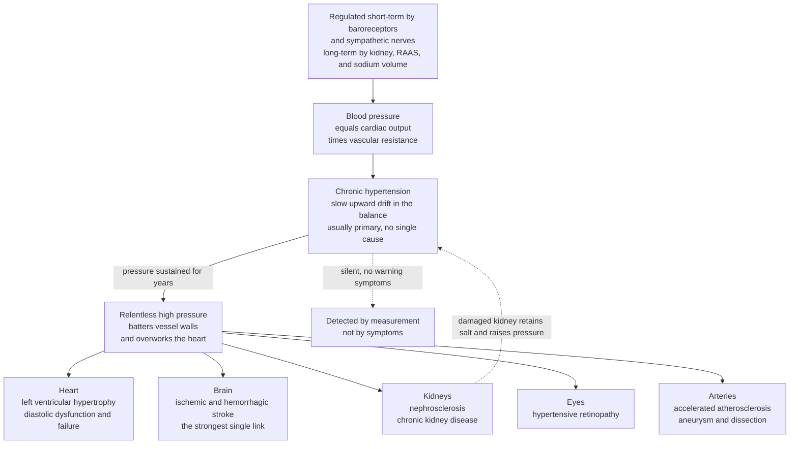

# 🩸 Hypertension and Vascular Disease

> [!abstract] TL;DR
> **Blood pressure** is the force blood exerts against artery walls, and to a first approximation it equals **cardiac output × systemic vascular resistance** — how hard the heart pumps times how tight the vessels are. **Hypertension** is a chronic upward drift in that balance: arterial pressure stays too high for years, usually with **no identifiable single cause** (*primary / essential*, ~90–95%) and, crucially, **no symptoms** — which is why it is called the **silent killer** and is found by *measurement, not by how you feel*. The danger is mechanical and relentless: sustained pressure batters vessels and forces the heart to work against greater load, producing **target-organ damage** — **left ventricular hypertrophy → heart failure**, **stroke** (the strongest single link), **nephrosclerosis → chronic kidney disease** (which then raises pressure further, a vicious cycle), **retinopathy**, and **accelerated atherosclerosis, aneurysm, and dissection**. Risk rises **continuously and log-linearly** with pressure — there is *no clean threshold* — which is exactly why lowering it prevents an enormous downstream burden of cardiovascular disease. Hypertension sits at the center of **vascular disease** broadly: aneurysms and aortic dissection, peripheral arterial disease, venous disease and thrombosis, and vasculitis.

---

## Intuition

**Analogy — running your household plumbing at too high a pressure for decades.** Every home needs water pressure: without it, nothing reaches the taps. Blood pressure is the same necessity — it is the driving force that pushes blood through tens of thousands of kilometers of vessels to feed every organ. A little pressure is life; the wrong amount is disease. Now imagine the water utility quietly turns the mains pressure up and *leaves it there for thirty years*. At first nothing seems wrong — the taps still run, the house "feels fine." But behind the walls the excess pressure is working around the clock: pipe joints strain and weaken, the pump labors harder against the back-pressure and its motor overheats and thickens, and the most delicate high-flow fixtures — the ones fed by fine, fast-flowing lines — start to fail. One day a joint bursts, a pipe finally clogs, or the pump gives out. The tragedy is that *you felt fine the whole time the damage was accumulating*.

That is hypertension exactly. The pump is the **heart**; the pipes are the **arteries**; the delicate high-flow fixtures are the **brain, kidneys, and eyes**. Chronically elevated pressure is **symptomless** for years while it silently thickens and tires the heart (toward **heart failure**), stiffens and clogs arteries faster (**atherosclerosis**), and pounds the fine vessels of brain, kidney, and retina (toward **stroke, kidney failure, and vision loss**). And because blood pressure comes down to just two things — **how hard the heart pumps (cardiac output)** and **how tight the vessels are (resistance)** — hypertension is best understood as a slow, usually causeless upward drift in that product. You cannot feel the pressure; you can only *measure* it. That single fact — silent damage, detectable only by a cuff — is why controlling blood pressure is one of the highest-yield interventions in all of medicine.

---

## How It Works

### Core Mechanics

**1. What sets the pressure — the master equation.** Averaged over the cardiac cycle, mean arterial pressure obeys a hydraulic analogue of Ohm's law:

$$\text{MAP} \approx \text{CO} \times \text{SVR}$$

where **cardiac output (CO)** = heart rate × stroke volume (the flow the pump delivers) and **systemic vascular resistance (SVR)** is set mainly by the tone of small **arterioles** (the body's adjustable "flow valves"). Anything that raises *either* factor raises pressure. In a single heartbeat, pressure swings between a **systolic** peak (ventricle ejecting) and a **diastolic** trough (ventricle relaxing); their difference is the **pulse pressure**, which widens when large arteries stiffen.

**2. Short-term control — the baroreceptor reflex (seconds to minutes).** Stretch sensors (**baroreceptors**) in the carotid sinus and aortic arch continuously report pressure to the brainstem. A drop triggers **sympathetic** outflow — faster heart, stronger contraction, arteriolar constriction, venoconstriction — while a rise does the opposite via the parasympathetic (vagal) brake. This is the fast negative-feedback loop that keeps you from fainting when you stand.

**3. Long-term control — the kidney, volume, and the RAAS (hours to days).** Over the long run the **kidney** is the dominant controller, because it sets **blood volume** through sodium and water handling ("pressure natriuresis": higher pressure normally makes the kidney excrete more salt and water, lowering volume and pressure). The **renin–angiotensin–aldosterone system (RAAS)** is the key hormonal axis: low renal perfusion releases **renin → angiotensin I → (ACE) → angiotensin II**, a potent vasoconstrictor that also stimulates **aldosterone** (renal sodium/water retention) and thirst. RAAS raises *both* resistance and volume — which is why it is the prime pharmacological target.

**4. How hypertension arises.** In **primary (essential) hypertension** — the ~90–95% majority — no single cause is found; it is **multifactorial**, emerging from genetic susceptibility plus salt intake, obesity, aging arteries, insulin resistance, and sympathetic and RAAS overactivity, which together nudge the CO × SVR balance and the kidney's pressure-natriuresis set point slowly upward. In **secondary hypertension** (~5–10%) there *is* an identifiable, often curable cause: **renal** (renal artery stenosis, chronic kidney disease), **endocrine** (primary **aldosteronism**, **pheochromocytoma**, Cushing's, thyroid disease), **drugs** (NSAIDs, oral contraceptives, decongestants, stimulants), obstructive sleep apnea, or aortic coarctation.

**5. Why it damages organs.** Sustained high pressure injures the body two ways: it **overloads the heart** (which must eject against higher afterload) and it **mechanically batters vessel walls** (endothelial injury, wall thickening, and accelerated atherosclerosis). The organs that suffer first are the **heart, brain, kidneys, eyes, and large arteries** — the *target organs*. Because the damage is silent and cumulative, hypertension is diagnosed by **measurement**, and its risk rises **continuously** with pressure (no clean cutoff), which is the entire rationale for screening and treating.

### Flow / Architecture



*Read top to bottom as the natural history: a regulated pressure drifts upward, the excess relentlessly damages the target organs, and — the insidious part — the whole cascade is invisible until measured. The dashed feedback arrow captures the renal vicious cycle: pressure damages the kidney, and the injured kidney drives pressure higher still.*

---

## Key Concepts

### Secondary (intuitive)

- **Blood pressure** = the push of blood against your artery walls. You need some, but too much for too long is dangerous. Written as two numbers: **systolic** (the higher, heart squeezing) over **diastolic** (the lower, heart resting), e.g. 120/80 mmHg.
- **Hypertension** = blood pressure that stays too high over months and years. It usually causes **no symptoms** — the reason it is called the **silent killer** and is found only by *measuring* with a cuff.
- **Two dials set the pressure.** How hard the heart pumps (**output**) and how tight the vessels are (**resistance**). Hypertension is these drifting up together.
- **Why it matters.** The constant extra pressure slowly damages the **heart, brain, kidneys, and eyes** and clogs arteries faster — leading to **heart failure, strokes, kidney failure, and vision loss**, often with no warning until something breaks.
- **Mostly no single cause.** In most people there is no one thing to blame — it builds from genes, salt, weight, and age together. Lowering it (less salt, weight loss, exercise, medicines) sharply cuts the danger.

### Undergraduate (formal)

- **Determinants of arterial pressure.** $\text{MAP} \approx \text{CO} \times \text{SVR}$, with $\text{CO} = \text{HR} \times \text{SV}$ and SVR dominated by **arteriolar tone**. MAP $\approx$ diastolic + one-third pulse pressure. **Pulse pressure** (systolic − diastolic) widens with large-artery stiffening.
- **Blood-pressure control loops.** *Short-term:* the **baroreceptor reflex** (carotid/aortic stretch → brainstem → autonomic adjustment) buffers beat-to-beat and postural changes. *Long-term:* the **kidney** dominates via **pressure natriuresis** and volume, tuned by the **RAAS** (renin → angiotensin II → aldosterone), ADH/vasopressin, and natriuretic peptides.
- **Classification.** Normal, elevated, and hypertension stages are defined by measured thresholds (e.g., stage 1 and stage 2), but these are pragmatic lines drawn on a **continuous** risk curve, not biological cliffs. Diagnosis needs repeated, properly measured readings (and often ambulatory/home monitoring to exclude "white-coat" effect).
- **Primary vs secondary.** **Primary/essential (~90–95%)** — multifactorial, no single cause. **Secondary (~5–10%)** — a discrete cause: **renovascular** (renal artery stenosis), **renal parenchymal** disease, **endocrine** (primary aldosteronism — the commonest curable cause; pheochromocytoma; Cushing's; thyroid), **drugs**, **OSA**, coarctation. Screen for secondary causes when hypertension is early-onset, severe, resistant, or has suggestive features.
- **Target-organ damage.** *Cardiac:* **left ventricular hypertrophy (LVH)** → diastolic dysfunction → **heart failure**; increased myocardial oxygen demand → ischemia. *Cerebrovascular:* **ischemic and hemorrhagic stroke**, lacunar infarcts, vascular cognitive impairment. *Renal:* **hypertensive nephrosclerosis** → chronic kidney disease. *Retinal:* **hypertensive retinopathy**. *Vascular:* **accelerated atherosclerosis**, aortic **aneurysm** and **dissection**, peripheral arterial disease.
- **The vascular-disease spectrum.** **Aneurysms** (e.g., abdominal aortic — wall weakening under pressure), aortic **dissection**, **peripheral arterial disease** (atherosclerotic limb ischemia → **claudication**), **venous disease** (varicose veins, chronic venous insufficiency, **DVT** → pulmonary embolism), **vasculitis** (vessel-wall inflammation), and **functional** disorders (Raynaud phenomenon).

### Graduate (advanced and clinical)

- **Mosaic and set-point theories.** Essential hypertension is a **mosaic** of interacting derangements — a resetting of the renal pressure-natriuresis curve (Guyton), sympathetic overactivity, RAAS dysregulation, endothelial dysfunction with reduced nitric-oxide bioavailability, vascular remodeling, arterial stiffening, and salt-sensitivity. No single lesion is necessary; the system settles at a defended, higher operating pressure.
- **Vascular remodeling and stiffening.** Chronic pressure drives **eutrophic/hypertrophic remodeling** of resistance arterioles (raising SVR) and, in large elastic arteries, **elastin fragmentation, collagen deposition, and calcification** (raising stiffness). Stiff arteries cause **isolated systolic hypertension** and **widened pulse pressure** — the dominant hemodynamic phenotype of aging — and faster return of reflected pressure waves that further load the ventricle.
- **The continuous risk relationship.** Prospective meta-analyses (Lewington/Prospective Studies Collaboration) show cardiovascular mortality roughly **doubles for each ~20/10 mmHg** rise across a wide range (from ~115/75 mmHg upward), **log-linearly and without a threshold**. This is why "normal" is a convention and why absolute-risk-guided treatment, not a magic cutoff, governs modern practice; SPRINT and similar trials show benefit from intensive lowering in high-risk patients.
- **Malignant / accelerated hypertension and hypertensive emergency.** Very high pressure can overwhelm autoregulation, producing **fibrinoid necrosis** of arterioles, hypertensive encephalopathy, retinal hemorrhages/papilledema, acute kidney injury, and acute heart failure — a true emergency requiring controlled, *not precipitous*, pressure reduction to avoid organ hypoperfusion.
- **Aneurysm and dissection mechanics.** By **Laplace's law**, wall tension rises with radius and pressure, so hypertension both promotes and accelerates **abdominal aortic aneurysm** growth and rupture; in **aortic dissection**, pressure-driven shear tears the intima and propagates a false lumen through a weakened media (worsened by conditions such as Marfan syndrome). Blood-pressure control is central to prevention.
- **Atherosclerosis as inflammatory vascular disease.** Hypertension injures endothelium and synergizes with dyslipidemia, smoking, and diabetes to accelerate the chronic **inflammatory** atherosclerotic process — the shared substrate of coronary, cerebrovascular, and peripheral arterial disease. Hypertension is thus both a disease *and* a multiplier of every other vascular risk factor.
- **Venous and functional vascular disease.** Distinct from the arterial high-pressure story: **venous insufficiency** (failed valves, ambulatory venous hypertension → varicosities, edema, ulceration), **venous thromboembolism** (Virchow's triad: stasis, endothelial injury, hypercoagulability → DVT/PE), and **vasospastic/functional** disorders (Raynaud) round out the vascular-disease field this note anchors.

---

## Python Demo

```python
# Hypertension and vascular disease, four quantitative views:
#   (a) BP DETERMINANTS  : mean arterial pressure MAP = cardiac output x systemic
#       vascular resistance -> raising EITHER dial pushes pressure up.
#   (b) BP-RISK CURVE    : cardiovascular / stroke risk rises log-linearly with
#       blood pressure, doubling every ~20 mmHg, with NO clean threshold
#       (the entire rationale for measuring and treating).
#   (c) TARGET-ORGAN DMG : prevalence of complications (stroke, heart failure,
#       kidney disease) climbing across blood-pressure categories.
#   (d) ARTERIAL STIFFENING : with age, arteries stiffen -> systolic keeps rising,
#       diastolic falls after midlife -> PULSE PRESSURE widens.
import numpy as np
import matplotlib.pyplot as plt

# ---------- (a) MAP = CO x SVR ----------
co = np.linspace(3.0, 8.0, 200)                 # cardiac output, L/min
svr_levels = [15.0, 18.0, 22.0, 26.0]           # systemic vascular resistance, mmHg*min/L
# MAP (mmHg) ~ CO x SVR (ignoring small central venous pressure for illustration)

# ---------- (b) Continuous BP-risk relationship ----------
sbp = np.linspace(100, 190, 300)                # systolic BP, mmHg
# relative risk doubles per ~20 mmHg (stroke a touch steeper than IHD)
rr_stroke = 2.0 ** ((sbp - 115) / 18.0)
rr_ihd    = 2.0 ** ((sbp - 115) / 21.0)

# ---------- (c) Target-organ complication prevalence by BP category ----------
cats = ["Normal", "Elevated", "Stage 1", "Stage 2"]
stroke_p = [2, 4, 8, 16]        # illustrative prevalence (%) of each complication
hf_p     = [2, 5, 10, 20]
ckd_p    = [3, 6, 11, 19]
x = np.arange(len(cats)); w = 0.26

# ---------- (d) Arterial stiffening widens pulse pressure with age ----------
age = np.linspace(20, 80, 200)
sbp_age = 100 + 0.7 * (age - 20)                          # systolic rises throughout life
dbp_age = 70 + 0.35 * (age - 20) - 0.006 * (age - 20)**2  # diastolic rises then falls
pulse_pressure = sbp_age - dbp_age                        # widens after midlife

# ---------- Plot ----------
fig, ax = plt.subplots(2, 2, figsize=(13, 9))

# (a)
for svr in svr_levels:
    ax[0, 0].plot(co, co * svr, lw=2, label=f"SVR = {svr:.0f}")
ax[0, 0].axhspan(70, 100, color="#2ecc71", alpha=0.12, label="Normal MAP band")
ax[0, 0].axhline(107, ls="--", color="#c0392b", lw=1, label="Hypertensive MAP")
ax[0, 0].set(title="(a) MAP = cardiac output x vascular resistance",
             xlabel="Cardiac output (L/min)", ylabel="Mean arterial pressure (mmHg)",
             ylim=(40, 210))
ax[0, 0].legend(fontsize=8); ax[0, 0].grid(alpha=0.3)

# (b)
ax[0, 1].plot(sbp, rr_stroke, color="#8e44ad", lw=2.2, label="Stroke risk")
ax[0, 1].plot(sbp, rr_ihd, color="#c0392b", lw=2.2, label="Coronary/IHD risk")
ax[0, 1].axvline(115, ls=":", color="gray", label="reference 115 mmHg")
ax[0, 1].axvline(140, ls="--", color="#e67e22", label="a 'threshold' (arbitrary)")
ax[0, 1].set(title="(b) Risk rises log-linearly, no clean threshold",
             xlabel="Systolic blood pressure (mmHg)",
             ylabel="Relative risk (vs 115 mmHg)")
ax[0, 1].set_yscale("log")
ax[0, 1].legend(fontsize=8); ax[0, 1].grid(alpha=0.3, which="both")

# (c)
ax[1, 0].bar(x - w, stroke_p, w, label="Stroke", color="#8e44ad")
ax[1, 0].bar(x,     hf_p,     w, label="Heart failure", color="#c0392b")
ax[1, 0].bar(x + w, ckd_p,    w, label="Kidney disease", color="#2980b9")
ax[1, 0].set(title="(c) Target-organ damage climbs with BP category",
             ylabel="Complication prevalence (%)")
ax[1, 0].set_xticks(x); ax[1, 0].set_xticklabels(cats)
ax[1, 0].legend(fontsize=8); ax[1, 0].grid(axis="y", alpha=0.3)

# (d)
ax[1, 1].plot(age, sbp_age, color="#c0392b", lw=2, label="Systolic")
ax[1, 1].plot(age, dbp_age, color="#2980b9", lw=2, label="Diastolic")
ax[1, 1].fill_between(age, dbp_age, sbp_age, color="#f39c12", alpha=0.18,
                      label="Pulse pressure (widens)")
ax[1, 1].set(title="(d) Arteries stiffen with age -> pulse pressure widens",
             xlabel="Age (years)", ylabel="Blood pressure (mmHg)", ylim=(50, 170))
ax[1, 1].legend(fontsize=8); ax[1, 1].grid(alpha=0.3)

fig.suptitle("Hypertension and Vascular Disease: determinants, risk, and organ damage",
             fontsize=14)
fig.tight_layout()
plt.show()

# Numeric sanity checks
map_ref = 5.0 * 18.0
print(f"Reference MAP  : CO 5.0 L/min x SVR 18 -> {map_ref:.0f} mmHg (normal)")
print(f"Vasoconstricted: CO 5.0 L/min x SVR 26 -> {5.0*26.0:.0f} mmHg (hypertensive)")
print(f"Relative stroke risk at 155 vs 115 mmHg: {2.0**((155-115)/18.0):.1f}x")
print(f"Pulse pressure at age 30: {pulse_pressure[np.argmin(abs(age-30))]:.0f} mmHg; "
      f"at age 75: {pulse_pressure[np.argmin(abs(age-75))]:.0f} mmHg")
```

**What you see.** *Panel (a)* is the master equation made visual: MAP is the product of cardiac output and resistance, so pressure climbs whether the heart pumps harder (move right) *or* the arterioles tighten (jump to a higher SVR line) — most primary hypertension is the upper lines, driven by raised resistance. *Panel (b)* is the reason hypertension is treated at all: on a log axis the risk of stroke and coronary disease is a **straight, rising line** — roughly doubling every 20 mmHg with **no kink or safe cutoff**, so any "threshold" (the orange line) is a pragmatic convention, not a biological boundary. *Panel (c)* shows the payoff of that risk in real disease: the prevalence of stroke, heart failure, and kidney disease all climb steeply across blood-pressure categories — target-organ damage tracking pressure. *Panel (d)* captures the aging vascular phenotype: as large arteries stiffen, systolic pressure keeps rising while diastolic falls after midlife, so the **pulse pressure widens** — the signature of the stiff-artery, isolated-systolic hypertension that dominates older populations.

---

## Real-World Applications

> **Example — the blood-pressure cuff as population medicine.** The sphygmomanometer is arguably the highest-yield instrument in preventive medicine precisely *because* hypertension is silent. Universal screening — a two-minute cuff reading — detects a symptomless condition that, untreated, is a leading contributor to stroke, heart failure, and kidney failure worldwide. It embodies the panel-(b) logic: because risk is continuous, catching and lowering pressure *before* symptoms appear prevents events that would otherwise arrive as catastrophes.

- **Antihypertensive pharmacology maps onto the physiology.** Each drug class targets a limb of MAP = CO × SVR or its controllers: **ACE inhibitors / ARBs** block the RAAS (and protect the kidney); **thiazide diuretics** reduce sodium/volume; **calcium-channel blockers** relax arteriolar tone (lower SVR); **beta-blockers** cut cardiac output and renin. Combination therapy hits several nodes at once.
- **Lifestyle as first-line treatment.** Sodium restriction, the **DASH** dietary pattern, weight loss, aerobic exercise, and reduced alcohol lower pressure by shifting the same dials — directly the "salt/volume" and "resistance/output" levers of the model.
- **Ambulatory and home monitoring.** Because a single clinic reading is noisy (white-coat and masked hypertension), 24-hour ambulatory monitoring characterizes the true pressure burden and nocturnal "dipping," refining who needs treatment.
- **Screening for secondary and end-organ disease.** Aldosterone/renin ratios (primary aldosteronism), renal imaging (renovascular disease), ECG/echo for LVH, urine albumin and eGFR for nephrosclerosis, and fundoscopy for retinopathy translate the target-organ framework into a concrete workup.
- **Vascular-disease programs.** Abdominal aortic aneurysm **screening** (ultrasound in older men), ankle-brachial index for **peripheral arterial disease**, DVT prophylaxis in hospitalized patients, and blood-pressure control after aortic dissection all operationalize the broader vascular-disease spectrum.

---

## Common Pitfalls

- **"No symptoms means no problem."** The defining danger of hypertension is that it feels like *nothing* while damaging vessels for years. Waiting for symptoms means waiting for the stroke or the heart failure. It is a **measured**, not a felt, diagnosis.
- **"There must be a cause to find and fix."** In 90–95% of cases there is no single cause (primary/essential). Hunting endlessly for a secondary cause in a typical patient wastes effort; targeted screening is reserved for early-onset, severe, resistant, or clue-bearing presentations.
- **"There is a safe threshold below which pressure doesn't matter."** Risk is **continuous and log-linear** down to about 115/75 mmHg. Diagnostic cutoffs are pragmatic administrative lines, not points where harm switches on — a source of endless confusion when guidelines shift a number.
- **"Only the systolic (or only the diastolic) number matters."** Both matter, and *which* dominates changes with age: diastolic and pulse-pressure predict risk in the young and middle-aged, while **systolic** and **pulse pressure** dominate in older, stiff-arteried patients. Reading one number in isolation misleads.
- **"Drop a hypertensive emergency's pressure fast to normal."** In malignant/emergency hypertension, autoregulation has reset upward; slashing pressure too quickly causes **organ hypoperfusion** (cerebral, renal, coronary). Controlled, graded reduction is the rule.
- **"Hypertension is a heart problem."** It is a *whole-vasculature* problem whose loudest consequence is **stroke** (its strongest single association), plus kidney disease, retinopathy, aneurysm, and dissection — not just cardiac disease.
- **"All vascular disease is high-pressure arterial disease."** Venous disease (insufficiency, DVT/PE) and functional disease (Raynaud) obey different mechanics (stasis, valve failure, vasospasm) — lumping them with arterial hypertension obscures their causes and treatments.
- **"This is medical advice."** This note teaches the *pathophysiology* of blood-pressure regulation and vascular disease at textbook level; it is **not** guidance for any individual's diagnosis or treatment, which always requires a clinician and the specifics of a real patient.

---

## Related Concepts

This note anchors **Section 02 – Cardiovascular and Respiratory Disease** of the Clinical Medicine vault. Its immediate **siblings** develop the systems it points to: *Cardiovascular Pathophysiology* lays the groundwork of cardiac and vascular function that hypertension deranges; *Heart Failure and Arrhythmias* picks up where left-ventricular hypertrophy and pressure overload lead; *Renal Pathophysiology and Kidney Disease* details the nephrosclerosis-and-vicious-cycle limb, since the kidney is both a cause and a casualty of high pressure; *Neurological Pathophysiology* carries the stroke story — hypertension's strongest single association — into mechanism; and *Hemostasis, Thrombosis and Bleeding Disorders* underlies the thrombotic side of vascular disease (DVT, pulmonary embolism, and arterial thrombosis on ruptured atherosclerotic plaques). These are prose references to sibling notes within this vault.

**Across the vault (Glob-verified links).**

- [[Biology/09_Human_Physiology_and_Anatomy/The_Circulatory_and_Respiratory_Systems|The Circulatory and Respiratory Systems]] — the baseline physiology of heart, arteries, and blood flow that hypertension pushes out of range.
- [[Biology/09_Human_Physiology_and_Anatomy/The_Digestive_and_Excretory_Systems|The Digestive and Excretory Systems]] — the kidney's role in sodium, water, and volume handling, the long-term controller of blood pressure and the organ nephrosclerosis destroys.
- [[Biology/09_Human_Physiology_and_Anatomy/The_Endocrine_System_and_Hormones|The Endocrine System and Hormones]] — the RAAS (renin, angiotensin, aldosterone) and catecholamines behind both normal control and endocrine secondary hypertension.
- [[Health_Nutrition_and_Longevity/02_Nutrition_Science/Micronutrients_Vitamins_and_Minerals|Micronutrients: Vitamins and Minerals]] — the sodium-potassium balance and DASH pattern that form the dietary basis of blood-pressure control.
- [[Health_Nutrition_and_Longevity/03_Exercise_and_Physical_Activity/Cardiovascular_Fitness_and_Aerobic_Training|Cardiovascular Fitness and Aerobic Training]] — cardiac output as heart rate times stroke volume, and exercise as a first-line pressure-lowering intervention.
- [[Fluid_Dynamics/06_Computation_and_Applications/Microfluidics_and_Biological_Flows|Microfluidics and Biological Flows]] — the hemodynamics beneath MAP = CO × SVR: Poiseuille resistance in arterioles and the elastic-artery Windkessel behind pulse pressure.
- [[Clinical_Medicine/01_Foundations_of_Disease_and_Pathophysiology/Inflammation_and_Tissue_Repair|Inflammation and Tissue Repair]] — atherosclerosis as chronic vascular inflammation, the process hypertension accelerates.
- [[Clinical_Medicine/01_Foundations_of_Disease_and_Pathophysiology/Clinical_Medicine_and_Pathophysiology_Overview|Clinical Medicine and Pathophysiology Overview]] — the vault hub; hypertension is a textbook case of "disease as a control-system failure" and of silent risk detected by measurement.

---

## Review Questions

**Secondary.** Blood pressure is written as two numbers (for example 120/80). Explain what the top and bottom numbers mean, and why doctors call high blood pressure the "silent killer." Give two organs that high blood pressure quietly damages over the years, and explain why the condition is found by measuring rather than by how a person feels.

**Undergraduate.** Starting from MAP ≈ cardiac output × systemic vascular resistance, explain two distinct physiological routes to hypertension and name the drug class that opposes each. Then distinguish **primary** from **secondary** hypertension (with two example secondary causes) and list four organs targeted by chronic high pressure, giving the specific lesion in each (heart, brain, kidney, eye).

**Graduate.** The blood-pressure–risk relationship is continuous and log-linear with no clear threshold. (a) Explain what this means for how we should think about diagnostic cutoffs and treatment decisions, and why "normal blood pressure" is partly a convention. (b) Describe the renal vicious cycle by which hypertension and kidney disease reinforce each other, referencing pressure natriuresis and the RAAS. (c) Using Laplace's law and the concept of arterial stiffening, explain why the elderly develop isolated systolic hypertension with widened pulse pressure, and why this raises the risk of aneurysm and dissection.

---

## Sources

- Loscalzo, J., Fauci, A., Kasper, D., et al. (eds.). *Harrison's Principles of Internal Medicine* (21st ed.). McGraw-Hill — "Hypertensive Vascular Disease" and the vascular-disease chapters.
- Kumar, V., Abbas, A. K., & Aster, J. C. *Robbins & Cotran Pathologic Basis of Disease* (10th ed.). Elsevier — "Blood Vessels" (hypertensive vascular disease, atherosclerosis, aneurysms, vasculitis).
- Hall, J. E., & Hall, M. E. *Guyton and Hall Textbook of Medical Physiology* (14th ed.). Elsevier — arterial pressure regulation, pressure natriuresis, and the RAAS.
- Kaplan, N. M., Victor, R. G., & Flynn, J. T. *Kaplan's Clinical Hypertension* (12th ed.). Wolters Kluwer — clinical hypertension, secondary causes, and management.
- Lewington, S., et al. (Prospective Studies Collaboration) (2002). "Age-specific relevance of usual blood pressure to vascular mortality." *The Lancet*, 360(9349), 1903–1913 — the continuous, log-linear BP–risk relationship.

---

#clinical-medicine #hypertension #vascular-disease #stroke-risk #blood-pressure
