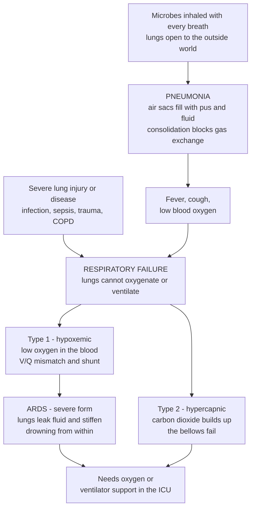

# 🫁 Pulmonary Infections and Respiratory Failure

> [!abstract] TL;DR
> The lungs are the body's largest interface with the outside world — every breath draws in air laden with microbes — so they are a frequent battlefield for infection. **Pneumonia** is infection of the lung's air sacs (alveoli): they fill with inflammatory **pus and fluid (consolidation)** instead of air, so the very surface where oxygen should cross into the blood is flooded and blocked. That is why pneumonia brings fever, cough, and — dangerously — falling blood oxygen. When any lung problem becomes severe enough that the respiratory system can no longer do its job — get enough **oxygen in** or enough **carbon dioxide out** — the patient reaches **respiratory failure**, the final common endpoint of severe lung disease. It comes in two flavors: failure to **oxygenate** (**Type 1**, low PaO₂) and failure to **ventilate** (**Type 2**, high PaCO₂). The most feared severe form, **ARDS (Acute Respiratory Distress Syndrome)**, is diffuse alveolar injury — from sepsis, pneumonia, trauma, or aspiration — that makes the lungs leak protein-rich fluid everywhere and stiffen, "drowning from within" with hypoxemia refractory to oxygen. Pulmonary infections (pneumonia, tuberculosis, influenza, COVID-19) are among the leading infectious causes of death worldwide, and respiratory failure is why intensive care, oxygen therapy, and ventilators exist.

---

## Intuition

**Analogy — the lungs as a rain-soaked sponge trying to breathe.** Imagine millions of tiny wine-glass-shaped air sacs, their walls one cell thin, wrapped in an equally thin film of capillaries. This is the gas-exchange surface — spread flat it would cover a tennis court — and its whole trick is that oxygen has only a paper-thin barrier to cross from air into blood. Now flood those air sacs with fluid and pus, as happens in **pneumonia**, and you are trying to breathe through sponges full of water: air can no longer reach the barrier, oxygen can no longer cross, and blood leaves the lungs still "blue." Because the lungs open directly onto the outside world, they are constantly exposed to inhaled microbes, which is exactly why they are such a common site of infection.

Push this far enough — or hit the lung with an overwhelming insult like **sepsis** — and you reach **respiratory failure**, the point at which the lungs simply cannot keep the blood oxygenated or clear its carbon dioxide. There are two ways to fail: the **oxygen side** breaks (blood oxygen falls dangerously low, **Type 1**), or the **bellows** break (the person cannot move enough air, so carbon dioxide backs up, **Type 2**). The most catastrophic version, **ARDS**, is when injury makes the whole lung leak and stiffen at once — the lung essentially drowning in its own fluid, so wet and stiff that even pure oxygen barely helps. Respiratory failure is the moment lung disease becomes *immediately* life-threatening — and it is the reason ventilators and intensive care units were invented.

---

## How It Works

### Core mechanics

**1. Why the lung gets infected.** The airways are a downhill highway from a non-sterile outside world to a sterile deep lung. Host defenses keep it clean: the **mucociliary escalator** sweeps trapped particles up and out, the **cough reflex** expels bulk material, **alveolar macrophages** patrol and phagocytose intruders, and secreted antibody plus antimicrobial peptides finish the job. Infection takes hold when the microbial dose or virulence overwhelms these defenses, or when defenses fail — a blunted cough and gag (letting oral/gastric contents be **aspirated**), a paralyzed mucociliary escalator (smoking, viral injury, a **ventilator** tube bypassing the upper airway), or a weakened immune system.

**2. Pneumonia — flooding the gas-exchange surface.** When a pathogen reaches the **parenchyma**, the alveoli fill with an **inflammatory exudate** — neutrophils, fluid, fibrin, and debris. This solidification of normally air-filled lung is **consolidation** (the white patch on a chest x-ray). Consolidated alveoli are perfused but not ventilated: blood flows past sacs that hold no air, so it passes through without picking up oxygen — a **shunt / ventilation-perfusion (V/Q) mismatch**. The result is **hypoxemia**, plus the systemic signature of infection: fever, cough (productive of purulent sputum), tachypnea, and pleuritic pain.

**3. Respiratory failure — the two ways the system breaks.** The respiratory system has two jobs; failure of either defines a type:
- **Type 1 — hypoxemic (oxygenation failure):** low **PaO₂** with normal or low PaCO₂. The *gas-exchange surface* fails — **V/Q mismatch**, **shunt**, or **diffusion impairment**. Causes: pneumonia, pulmonary edema, ARDS, embolism.
- **Type 2 — hypercapnic (ventilation failure):** high **PaCO₂** (with consequent hypoxemia). The *bellows/pump* fails — the lungs cannot move enough air to blow off CO₂. Causes: severe COPD, neuromuscular weakness, chest-wall disease, and drug-induced hypoventilation (opioids depressing the respiratory drive).

**4. ARDS — the lungs drowning from within.** A severe insult (sepsis, severe pneumonia, aspiration, trauma, pancreatitis) triggers **diffuse alveolar damage**: the alveolar-capillary barrier becomes leaky, so **protein-rich fluid** pours into the air spaces (a *non-cardiogenic* pulmonary edema — the heart is fine). Surfactant is inactivated and alveoli collapse, so the lungs become **stiff (low compliance)**. The hallmark is **refractory hypoxemia** — because so much lung is flooded and shunted, adding oxygen barely raises PaO₂. ARDS is graded by the **P/F ratio** (PaO₂ ÷ FiO₂): mild 200–300, moderate 100–200, severe below 100 (Berlin definition, on PEEP ≥ 5).

**5. Assessment.** The two axes are read from an **arterial blood gas**: PaO₂ (and the **P/F ratio**) for oxygenation, PaCO₂ for ventilation, pH for whether it is acute. **Pulse oximetry (SpO₂)** gives a continuous, non-invasive read of saturation — with the crucial caveat that it plateaus at the top of the dissociation curve.

### Flow / architecture



---

## Key Concepts

### Secondary (foundational)

- **What pneumonia is.** An infection of the tiny air sacs deep in the lung. They fill with fluid and pus, so air cannot get in and oxygen cannot get into the blood — like trying to breathe with wet sponges. This causes fever, cough, and shortness of breath.
- **Why the lungs get infected so often.** Every breath brings the outside world — dust, droplets, germs — deep inside the body. The lungs have cleaning systems (a coughing reflex, a slimy "escalator," patrolling immune cells), but germs can overwhelm them.
- **Respiratory failure.** When the lungs get so damaged or overwhelmed that they can no longer put enough **oxygen into** the blood or get enough **carbon dioxide out**. This is life-threatening — it is why hospitals have oxygen masks, ventilators, and intensive care.
- **Two ways to fail.** Either the **oxygen** falls too low (Type 1), or the person **cannot breathe enough** so carbon dioxide builds up (Type 2).
- **ARDS.** The most severe form: a big injury (like a bad infection or sepsis) makes the whole lung leak fluid and go stiff, so it is like the lung is drowning from the inside.

### Undergraduate (mechanistic)

- **Classifying pneumonia.** By **setting** — *community-acquired* (CAP) vs *hospital-acquired* (HAP) and *ventilator-associated* (VAP), which differ in likely organisms and resistance; by **clinical/microbial type** — *typical* (e.g., *Streptococcus pneumoniae*, lobar, high fever, productive cough) vs *atypical* (*Mycoplasma*, *Legionella*, *Chlamydophila*, viruses — more insidious, "walking pneumonia"); and by **anatomic pattern** — *lobar* (a whole lobe consolidated) vs *bronchopneumonia* (patchy, centered on airways) vs *interstitial* (viral, thickened septa).
- **The pathogen spectrum.** *Bacterial* (pneumococcus, *Haemophilus*, *Staph aureus*, Gram-negatives); *viral* (influenza, RSV, SARS-CoV-2 / COVID-19); *fungal* (*Pneumocystis jirovecii*, *Aspergillus* — hallmarks of immunocompromise); and *mycobacterial* — **tuberculosis**.
- **Tuberculosis.** *Mycobacterium tuberculosis* provokes **granulomatous inflammation** — walled-off collections of macrophages that contain but do not fully clear the organism. **Latent TB** = contained, asymptomatic, non-infectious; **active TB** = breakdown of the granuloma with cavitation, cough, and transmission. Reactivation follows immunosuppression (HIV, anti-TNF drugs).
- **The other airway/pleural infections.** *Bronchitis* (large-airway inflammation), *bronchiolitis* (small-airway, classically RSV in infants), *empyema* (pus in the pleural space), and *lung abscess* (a localized cavity of pus, often post-aspiration).
- **Mechanisms of Type 1 hypoxemia.** *V/Q mismatch* (the commonest — regions ventilated and perfused out of proportion); *shunt* (blood bypasses ventilated lung entirely — the extreme of V/Q mismatch, and the one that does **not** correct with supplemental oxygen); *diffusion impairment* (a thickened barrier). *Alveolar hypoventilation* and *low inspired PO₂* (altitude) round out the classic five.
- **Mechanisms of Type 2 hypercapnia.** Ventilation failure = the **pump** cannot maintain minute ventilation: reduced drive (opioids, brain injury), neuromuscular weakness (Guillain-Barré, myasthenia, motor-neuron disease), chest-wall/pleural restriction, or overwhelming airway obstruction (severe asthma/COPD where the work of breathing exceeds capacity — the muscles tire).
- **Acute vs chronic failure.** *Acute* respiratory failure develops over minutes-hours, before renal compensation, so blood gas shows **acute acidosis** (respiratory acidosis with low pH in Type 2). *Chronic* failure (e.g., end-stage COPD) is compensated — the kidney retains bicarbonate, so pH is near-normal despite a high PaCO₂.
- **The oxygen-hemoglobin dissociation curve.** The relationship between PaO₂ and hemoglobin saturation (SaO₂) is **sigmoidal**: flat and forgiving above ~60 mmHg (~90% saturation), then a **steep cliff** below it, where small further drops in PaO₂ cause large drops in saturation. This is why 60 mmHg is a clinical threshold and why pulse oximetry looks "fine" until it suddenly is not.

### Graduate (advanced and clinical)

- **ARDS pathology — the three phases.** *Exudative* (days 1–7): endothelial and type I alveolar epithelial injury, **hyaline membranes** (protein-rich exudate lining alveoli), interstitial and alveolar edema. *Proliferative* (days 7–21): type II pneumocyte hyperplasia, early organization, fibroblast influx. *Fibrotic* (>3 weeks in some): collagen deposition, honeycombing — the driver of long-term impairment. The common histological substrate is **diffuse alveolar damage (DAD)**.
- **Why ARDS hypoxemia is refractory.** Extensive **intrapulmonary shunt** (flooded, atelectatic alveoli that are perfused but unventilated) means mixed venous blood bypasses gas exchange. Because shunted blood never contacts alveolar gas, raising FiO₂ toward 1.0 adds little — the defining feature separating shunt from ordinary V/Q mismatch (which *does* respond to oxygen).
- **Lung-protective ventilation.** The stiff, small "baby lung" of ARDS is easily injured by the ventilator itself — **ventilator-induced lung injury (VILI)** from *volutrauma* (overdistension), *barotrauma* (high pressure), and *atelectrauma* (repeated open/close shear). The ARDSNet strategy — **low tidal volume (~6 mL/kg predicted body weight)**, plateau pressure < 30 cmH₂O, adequate **PEEP** to keep alveoli open, and permissive hypercapnia — reduced mortality by minimizing this iatrogenic injury. **Prone positioning** and, in severe cases, **ECMO** are rescue strategies.
- **Sepsis as the hinge to shock and multi-organ failure.** Pneumonia is the leading cause of sepsis; the same dysregulated host response that leaks fluid into alveoli (ARDS) leaks it out of capillaries everywhere, producing distributive **shock**. Hypoxemia from failing lungs then starves every organ of oxygen, closing a vicious loop between respiratory failure, circulatory collapse, and systemic infection.
- **Reading the blood gas as a two-axis diagnosis.** PaO₂ / P/F answers "*is oxygenation failing, and how badly?*"; PaCO₂ answers "*is ventilation failing?*"; the **A–a gradient** localizes hypoxemia (widened in V/Q mismatch, shunt, diffusion problems; normal in pure hypoventilation and altitude); pH and bicarbonate answer "*acute or chronic?*". These four numbers place any patient on the respiratory-failure map.
- **Hypoxemia vs hypoxia vs tissue O₂ delivery.** *Hypoxemia* is low PaO₂ in blood; *hypoxia* is inadequate O₂ at the tissues. Delivery = cardiac output × (Hb × SaO₂ × 1.34 + dissolved O₂). Anemia, low output, or shifted dissociation curves can cause tissue hypoxia at a *normal* PaO₂ — and conversely, high PaO₂ does not guarantee adequate delivery. The distinction governs whether the fix is oxygen, transfusion, or hemodynamic support.

---

## Python Demo

```python
# Pulmonary infections & respiratory failure -- four linked views:
#   (a) OXYGEN-HEMOGLOBIN DISSOCIATION CURVE: why falling arterial O2
#       (pneumonia consolidation / shunt) drops saturation off a cliff.
#   (b) P/F RATIO: PaO2 / FiO2 classifying respiratory-failure / ARDS severity.
#   (c) INFECTION TIME COURSE: pathogen load vs immune response, treated vs not.
#   (d) RESPIRATORY-FAILURE MAP: oxygenation (PaO2) vs ventilation (PaCO2),
#       placing Type 1, Type 2, and ARDS relative to normal.
import numpy as np
import matplotlib.pyplot as plt

# ---------- (a) Oxygen-hemoglobin dissociation curve (Hill approximation) ----------
PaO2 = np.linspace(0, 120, 600)             # arterial O2 tension, mmHg
n, P50 = 2.7, 26.6                          # Hill coefficient, P50 (mmHg)
SaO2 = 100 * PaO2**n / (P50**n + PaO2**n)   # % hemoglobin saturation
landmarks = {"Normal\n100 mmHg": 100, "Mild hypoxemia\n60 mmHg": 60, "Severe\n40 mmHg": 40}

# ---------- (b) P/F ratio: severity classification (Berlin definition) ----------
patients = ["Healthy\n95/0.21", "Mild injury\n80/0.40",
            "Moderate ARDS\n90/0.60", "Severe ARDS\n70/0.90"]
pao2 = np.array([95, 80, 90, 70])
fio2 = np.array([0.21, 0.40, 0.60, 0.90])
pf   = pao2 / fio2                           # P/F ratio (mmHg)

# ---------- (c) Infection time course: pathogen vs immune response ----------
days = np.linspace(0, 20, 800)
dt = days[1] - days[0]
def simulate(treat_day=None):
    P = np.empty_like(days); I = np.empty_like(days)
    P[0], I[0] = 1.0, 0.1                    # initial pathogen load, immune activity
    r, K, k, a, b, I0 = 1.4, 1000.0, 1.2, 0.9, 0.35, 0.1
    for t in range(len(days) - 1):
        drug = 1.6 if (treat_day is not None and days[t] >= treat_day) else 0.0
        dP = r * P[t] * (1 - P[t] / K) - k * I[t] * P[t] - drug * P[t]
        dI = a * np.log1p(P[t]) - b * (I[t] - I0)
        P[t + 1] = max(P[t] + dP * dt, 0.0)
        I[t + 1] = max(I[t] + dI * dt, 0.0)
    return P, I
P_un, I_un = simulate(treat_day=None)        # untreated
P_tx, _    = simulate(treat_day=4.0)         # antibiotic started day 4
imm_scaled = I_un / I_un.max() * P_un.max()  # scale immune curve for a shared axis

# ---------- (d) Respiratory-failure map: oxygenation vs ventilation ----------
states = {"Normal": (95, 40, "#27AE60"),
          "Type 1\n(hypoxemic)": (48, 34, "#2980B9"),
          "Type 2\n(hypercapnic)": (54, 66, "#8E44AD"),
          "ARDS\n(severe type 1)": (44, 42, "#C0392B")}

fig, ax = plt.subplots(2, 2, figsize=(13, 9))

# (a)
ax[0, 0].plot(PaO2, SaO2, color="#C0392B", lw=2.2)
ax[0, 0].axvspan(0, 60, color="#e74c3c", alpha=0.10, label="steep danger zone")
for label, x in landmarks.items():
    y = 100 * x**n / (P50**n + x**n)
    ax[0, 0].plot(x, y, "o", color="#2c3e50")
    ax[0, 0].annotate(label, (x, y), textcoords="offset points",
                      xytext=(-8, -30), fontsize=8, ha="center")
ax[0, 0].set(title="(a) Oxygen-hemoglobin dissociation curve",
             xlabel="PaO2 (mmHg)", ylabel="SaO2 (% saturation)", ylim=(0, 105))
ax[0, 0].legend(fontsize=8); ax[0, 0].grid(alpha=0.3)

# (b)
ax[0, 1].bar(patients, pf, color=["#27AE60", "#F39C12", "#E67E22", "#C0392B"])
for thr, name in [(300, "mild"), (200, "moderate"), (100, "severe")]:
    ax[0, 1].axhline(thr, ls="--", color="gray", lw=1)
    ax[0, 1].text(3.45, thr + 6, f"P/F {thr}", fontsize=8, ha="right", color="gray")
ax[0, 1].set(title="(b) P/F ratio classifies ARDS severity",
             ylabel="PaO2 / FiO2 (mmHg)")
ax[0, 1].tick_params(axis="x", labelsize=8); ax[0, 1].grid(axis="y", alpha=0.3)

# (c)
ax[1, 0].plot(days, P_un, color="#C0392B", lw=2, label="Pathogen -- untreated")
ax[1, 0].plot(days, P_tx, color="#C0392B", lw=2, ls="--", label="Pathogen -- treated")
ax[1, 0].plot(days, imm_scaled, color="#2980B9", lw=2, label="Immune response (scaled)")
ax[1, 0].axvline(4.0, color="gray", ls=":", lw=1)
ax[1, 0].text(4.2, 0.92, "treatment start", transform=ax[1, 0].get_xaxis_transform(),
              fontsize=8, color="gray")
ax[1, 0].set(title="(c) Infection time course",
             xlabel="days", ylabel="pathogen load / scaled immune activity")
ax[1, 0].legend(fontsize=8); ax[1, 0].grid(alpha=0.3)

# (d)
ax[1, 1].axvline(60, color="#2980B9", ls="--", lw=1)   # hypoxemia threshold
ax[1, 1].axhline(45, color="#8E44AD", ls="--", lw=1)   # hypercapnia threshold
ax[1, 1].text(61, 22, "PaO2 < 60 : hypoxemia", fontsize=8, color="#2980B9")
ax[1, 1].text(22, 46.5, "PaCO2 > 45 : hypercapnia", fontsize=8, color="#8E44AD")
for name, (x, y, c) in states.items():
    ax[1, 1].scatter(x, y, s=130, color=c, zorder=5, edgecolor="black")
    ax[1, 1].annotate(name, (x, y), textcoords="offset points", xytext=(7, 7), fontsize=8)
ax[1, 1].set(title="(d) Respiratory-failure map",
             xlabel="PaO2 (mmHg) -- oxygenation",
             ylabel="PaCO2 (mmHg) -- ventilation", xlim=(20, 110), ylim=(20, 80))
ax[1, 1].grid(alpha=0.3)

fig.suptitle("Pulmonary Infections and Respiratory Failure", fontsize=14)
fig.tight_layout()
plt.show()
```

**What the plots show.** *(a)* The dissociation curve is flat and forgiving above ~60 mmHg but plunges steeply below it — so a patient can lose a lot of PaO₂ with little change in saturation until they hit the cliff, after which they desaturate fast. This is why 60 mmHg / 90% is the danger threshold and why oximetry can lull you before it plummets. *(b)* Dividing PaO₂ by the inspired oxygen fraction (FiO₂) removes the "how much oxygen were they on?" confound: the healthy lung on room air scores ~450, while a severe-ARDS patient needing 90% oxygen just to reach a PaO₂ of 70 scores ~78 — the Berlin severity ladder. *(c)* The untreated infection lets pathogen load climb to a high peak before the immune response finally controls it, whereas starting treatment on day 4 collapses the pathogen curve quickly — the rationale for early antimicrobials. *(d)* The two-axis map is the whole diagnosis: the vertical line (PaO₂ 60) and horizontal line (PaCO₂ 45) carve out **Type 1** (left, low O₂, normal/low CO₂), **Type 2** (top, high CO₂), and place **ARDS** as extreme Type 1, all relative to the healthy corner.

---

## Real-World Applications

> **Example — the ICU ventilator and ARDSNet lung-protective ventilation.** The mechanical ventilator exists precisely because respiratory failure is otherwise fatal, and ARDS is its defining challenge. The landmark **ARDSNet trial (2000)** showed that ventilating stiff ARDS lungs with **low tidal volumes (~6 mL/kg predicted body weight)** and limited plateau pressure cut mortality versus traditional larger breaths — because the injured "baby lung" is so small and fragile that ordinary tidal volumes over-stretch it (volutrauma) and worsen the injury. The **P/F ratio** modeled above is the exact number used at the bedside to grade severity (Berlin definition) and to decide when to escalate to **prone positioning** or **ECMO**. This is applied pathophysiology: the shunt physiology dictates the therapy.

- **Pneumococcal and influenza vaccination.** Because *Streptococcus pneumoniae* and influenza drive so much severe pneumonia, PCV/PPSV pneumococcal and annual influenza vaccines are among the highest-impact preventive measures for the elderly and immunocompromised.
- **Antibiotics and antivirals, targeted by classification.** Empiric therapy for pneumonia is chosen from the community- vs hospital-acquired and typical vs atypical framework (e.g., a beta-lactam plus a macrolide for CAP), then narrowed by culture. Delay in the first dose measurably worsens sepsis outcomes.
- **Tuberculosis control.** Latent-vs-active distinction underlies public-health strategy: screening and treating latent TB prevents reactivation, while multi-drug **DOTS** regimens treat active disease and curb transmission — central to the global infectious-disease burden.
- **Pulse oximetry as ubiquitous monitoring.** The dissociation curve is why the little fingertip SpO₂ probe is on every hospital bed and became a household device during COVID-19 — and why clinicians treat a reading drifting toward 90% as an alarm, not a comfort.
- **COVID-19 and the ARDS surge.** SARS-CoV-2 pneumonia caused ARDS at population scale, driving the demand for ventilators, prone positioning, high-flow oxygen, and steroids (dexamethasone) and hard-wiring "respiratory failure" into public awareness.

---

## Common Pitfalls

- **Confusing hypoxemia with hypoxia.** *Hypoxemia* is low oxygen in arterial blood; *hypoxia* is inadequate oxygen at the tissues. Anemia or low cardiac output can starve tissues at a normal PaO₂, and correcting the blood gas number does not guarantee adequate oxygen *delivery* — which depends on hemoglobin and flow, not PaO₂ alone.
- **Assuming all hypoxemia responds to oxygen.** **Shunt** physiology (the essence of ARDS) is *refractory* to supplemental oxygen, because blood bypassing flooded alveoli never meets the extra O₂. Cranking up FiO₂ without opening collapsed lung (PEEP, recruitment) chases a number that will not move.
- **Being fooled by pulse oximetry's plateau.** Because the dissociation curve is flat up top, SpO₂ can read a reassuring 96–97% while PaO₂ is already falling — and then drop precipitously once past the cliff below 90%. Oximetry also misreads with poor perfusion, carbon-monoxide poisoning, and (as re-recognized recently) skin pigmentation.
- **Missing Type 2 failure behind "adequate saturation."** A drowsy patient on opioids can have a normal SpO₂ on supplemental oxygen while their PaCO₂ climbs dangerously — ventilation failure is invisible to the oximeter and requires a blood gas (or capnography) to catch.
- **Equating ARDS with cardiogenic pulmonary edema.** Both flood the alveoli, but ARDS is *permeability* edema (leaky barrier, normal heart) while cardiogenic edema is *pressure* edema (a failing heart backing fluid up). The distinction changes everything: diuretics and afterload reduction help the heart; ARDS needs lung-protective ventilation and treatment of the underlying insult.
- **Reading "consolidation" as automatically bacterial.** Radiographic patterns overlap heavily — viral, atypical, and aspiration pneumonias, and even non-infectious infiltrates, can mimic classic lobar bacterial consolidation. Pattern narrows, but does not settle, the microbial cause.
- **Forgetting the sepsis loop.** Severe pneumonia is a leading *cause* of sepsis and ARDS; treating the lung in isolation while the systemic inflammatory response drives shock and multi-organ failure misses that respiratory failure is often one face of a whole-body emergency.

---

## Related Concepts

**Within this vault (Section 02 – Cardiovascular and Respiratory Disease, and Section 01 foundations).** This note sits downstream of several siblings and should be read alongside them (prose references within the Clinical Medicine vault). *Respiratory Pathophysiology* supplies the normal-vs-broken mechanics of ventilation, V/Q matching, and gas exchange that pneumonia and respiratory failure disrupt. *Infectious Disease and Host-Pathogen Interaction* is the general framework — virulence, host defense, and immune response — of which pulmonary infection is the commonest organ-specific case. *Sepsis and Systemic Infection* and *Shock and Circulatory Collapse* are the systemic endpoints that severe pneumonia and ARDS feed into: the same dysregulated response that floods the alveoli leaks capillaries body-wide, tipping respiratory failure into circulatory failure. *Inflammation and Tissue Repair* explains the exudate, consolidation, granuloma (tuberculosis), and later fibrosis (ARDS proliferative phase) at the tissue level, and *Cellular Injury and Adaptation* the alveolar-cell death beneath diffuse alveolar damage.

**Across the vault (Glob-verified links).**

- [[Biology/09_Human_Physiology_and_Anatomy/The_Circulatory_and_Respiratory_Systems|The Circulatory and Respiratory Systems]] — the normal alveolar-capillary gas-exchange machinery that pneumonia floods and respiratory failure ultimately defeats.
- [[Biology/11_Microbiology_and_Immunology/Bacteria_and_Archaea|Bacteria and Archaea]] — the bacterial pathogens behind typical pneumonia (*Streptococcus pneumoniae*) and tuberculosis (*Mycobacterium tuberculosis*).
- [[Biology/11_Microbiology_and_Immunology/Viruses|Viruses]] — influenza and SARS-CoV-2 as major causes of viral pneumonia and the ARDS that can follow.
- [[Biology/11_Microbiology_and_Immunology/The_Innate_Immune_System|The Innate Immune System]] — alveolar macrophages, neutrophils, and the mucociliary/complement first line that infection must overwhelm.
- [[Biology/11_Microbiology_and_Immunology/The_Adaptive_Immune_System|The Adaptive Immune System]] — T-cell-driven granuloma formation in tuberculosis and the antibody response underlying recovery and vaccination.
- [[Biology/11_Microbiology_and_Immunology/Vaccines_and_Antibiotics|Vaccines and Antibiotics]] — the pneumococcal/influenza vaccines and antimicrobial therapy that prevent and treat pulmonary infection.
- [[Health_Nutrition_and_Longevity/06_Public_Health_and_Prevention/Infectious_Disease_Vaccines_and_Immunity|Infectious Disease, Vaccines and Immunity]] — the population-level view of respiratory infection, immunity, and outbreak control.
- [[Health_Nutrition_and_Longevity/06_Public_Health_and_Prevention/Global_Health_and_Health_Systems|Global Health and Health Systems]] — why pneumonia, tuberculosis, and influenza remain leading global infectious killers and how health systems respond.

---

## Review Questions

**Secondary.** Explain, using the "wet sponge" idea, why pneumonia makes it hard for oxygen to get into the blood even though the person is still breathing. Then describe the two different ways the lungs can "fail" in respiratory failure, and say why ARDS is described as the lungs "drowning from within."

**Undergraduate.** A patient has pneumonia with a PaO₂ of 55 mmHg and a normal PaCO₂. (a) Classify the respiratory failure (Type 1 or 2) and name the gas-exchange mechanism most responsible. (b) Using the oxygen-hemoglobin dissociation curve, explain why this PaO₂ is dangerous and why their pulse oximeter reading might have looked "almost normal" shortly before. (c) Contrast this with a patient whose primary problem is opioid-induced hypoventilation — what would the blood gas show, and why?

**Graduate.** A septic patient develops bilateral infiltrates, a P/F ratio of 90 on FiO₂ 0.9 with PEEP 8, and hypoxemia that barely improves when FiO₂ is raised to 1.0. (a) Give the diagnosis and severity grade, and explain the shunt physiology behind the refractory hypoxemia. (b) Justify why low-tidal-volume ("lung-protective") ventilation reduces mortality here, invoking the concept of ventilator-induced lung injury and the "baby lung." (c) Explain how this pulmonary picture connects to circulatory shock and multi-organ failure — why respiratory failure and systemic infection form a vicious loop.

---

## Sources

- West, J. B., & Luks, A. M. *West's Pulmonary Pathophysiology: The Essentials* (10th ed.). Wolters Kluwer — gas exchange, V/Q mismatch, shunt, and the mechanisms of hypoxemia and respiratory failure.
- Loscalzo, J., Fauci, A., Kasper, D., et al. (eds.). *Harrison's Principles of Internal Medicine* (21st ed.). McGraw-Hill — chapters on Pneumonia, Tuberculosis, Respiratory Failure, and ARDS.
- Kumar, V., Abbas, A. K., & Aster, J. C. *Robbins & Cotran Pathologic Basis of Disease* (10th ed.). Elsevier — pulmonary infections, consolidation patterns, granulomatous inflammation, and diffuse alveolar damage.
- ARDS Definition Task Force; Ranieri, V. M., et al. (2012). "Acute Respiratory Distress Syndrome: The Berlin Definition." *JAMA*, 307(23), 2526–2533 — the P/F-ratio severity grading used above.
- The Acute Respiratory Distress Syndrome Network (2000). "Ventilation with lower tidal volumes for acute lung injury and ARDS." *New England Journal of Medicine*, 342(18), 1301–1308 — the lung-protective ventilation evidence.

---

#clinical-medicine #pneumonia #respiratory-failure #ARDS #hypoxemia
