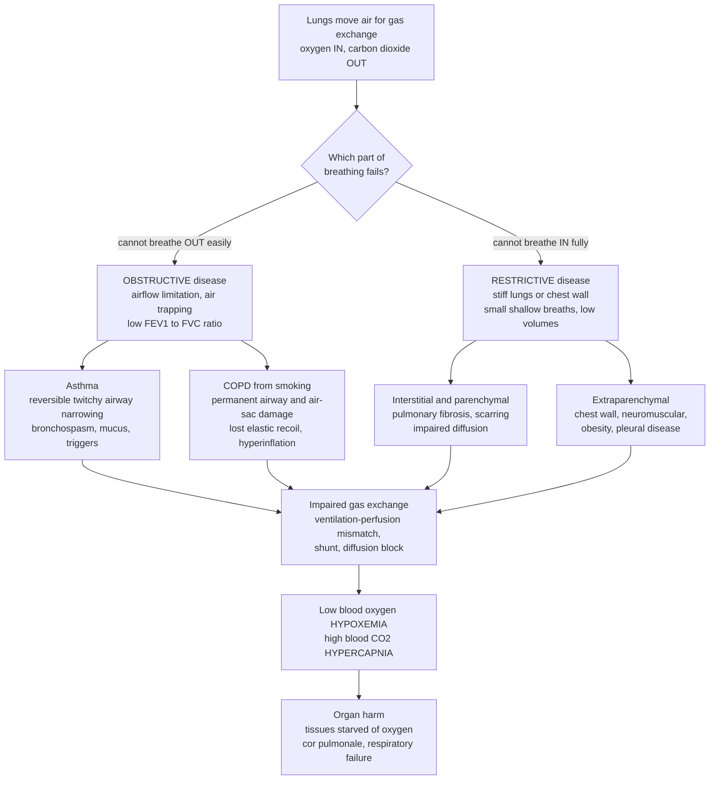

# 🫁 Respiratory Pathophysiology

> [!abstract] TL;DR
> The lungs do one vital job — move **oxygen IN** and **carbon dioxide OUT** — and lung disease breaks this in two broad ways. **Obstructive disease** (asthma, COPD) is a problem getting air **OUT**: airways narrow or clog, air gets trapped, and **spirometry** shows a reduced **FEV1/FVC ratio** with a scooped expiratory curve. **Restrictive disease** (pulmonary fibrosis, chest-wall or neuromuscular disorders) is the opposite — a problem getting air **IN**: stiff lungs or chest can't expand, so volumes shrink while the **ratio is preserved**. Either pattern ultimately wrecks **gas exchange** across the alveolar–capillary membrane, producing **hypoxemia** (low blood O₂) and, when ventilation fails, **hypercapnia** (CO₂ retention) — starving every organ. The single question "can't breathe **OUT**" versus "can't breathe **IN**," answered by a simple breathing test, organizes almost all of pulmonary medicine.

## Intuition

**Analogy — a bellows with two ways to fail.** Picture your lungs as a fireplace bellows whose whole purpose is to push air through a nozzle. There are exactly two ways a bellows can stop working. **First**, the nozzle gets pinched or clogged — you can pull the handles apart easily, but squeezing the air back **out** through the narrowed opening is a struggle, and some air stays trapped inside each time. That is **obstructive** lung disease: breathing **out** is the hard part. In **asthma** the nozzle is *twitchy* — it clamps shut when triggered but relaxes again (reversible); in **COPD**, decades of smoke have left the nozzle permanently inflamed and clogged **and** stretched the leather so it no longer springs back. **Second**, the leather itself goes stiff, or someone sits on the bellows — now you can't pull the handles apart to draw air **in**, so every breath is small and shallow. That is **restrictive** disease: breathing **in** is the hard part.

Either failure has the same deadly endpoint. A bellows that can't move enough air can't feed the fire — and lungs that can't move enough air can't load oxygen onto the blood or blow off CO₂, so the tissues suffocate. Almost all of respiratory medicine reduces to asking *which* failure you are looking at, and *how* it strangles gas exchange.

---

## How It Works

### Core Mechanics

Respiration has three linked jobs, and disease attacks each one:

1. **Ventilation — moving air in and out.** The diaphragm and chest wall enlarge the thorax; air flows down the trachea and branching **airways** to ~300 million **alveoli**. Two mechanical properties govern this: **compliance** (how easily the lung stretches — stiff = low compliance) and **airway resistance** (how hard air must be pushed through the tubes). Restrictive disease attacks compliance; obstructive disease attacks resistance and, critically, **expiratory flow**.

2. **Gas exchange — loading O₂, dumping CO₂.** Across the thin **alveolar–capillary membrane**, oxygen diffuses into blood (binding hemoglobin) and CO₂ diffuses out. Efficiency depends on **ventilation–perfusion (V/Q) matching**: each alveolus's airflow (V) should match its blood flow (Q). Mismatch is the commonest reason blood leaves the lung under-oxygenated.

3. **The two great patterns.** Spirometry — a forced blow into a tube — separates them:
   - **Obstructive** — airflow **limitation**, worst on exhalation. **FEV1** (volume forced out in the first second) falls more than **FVC** (total forced volume), so the **FEV1/FVC ratio drops below ~0.70**. Air trapped behind narrowed airways **raises residual volume** (hyperinflation).
   - **Restrictive** — reduced lung **expansion**. All volumes (TLC, FVC) shrink together, so **FEV1/FVC stays normal or high**. The defining measure is a **reduced Total Lung Capacity**.

4. **Obstructive diseases.** **Asthma** = reversible **bronchial hyperresponsiveness** — type-2 inflammation (eosinophils, IgE), bronchospasm, mucus, and airway edema triggered by allergens, cold, or exercise; between attacks the airways can be near-normal. **COPD** = largely **smoking-caused and irreversible**, combining **chronic bronchitis** (airway inflammation, mucus gland hypertrophy) with **emphysema** (protease-driven destruction of alveolar walls, loss of **elastic recoil**, so airways collapse on exhalation and trap air). Related obstructive disorders include **bronchiectasis** and **cystic fibrosis**.

5. **Restrictive diseases.** **Parenchymal / interstitial** disease scars the lung tissue itself — **pulmonary fibrosis**, **pneumoconioses** (asbestos, silica, coal), **sarcoidosis** — making it stiff and impairing **diffusion** (low DLCO). **Extraparenchymal** disease spares the lung but restricts the pump: **chest-wall** deformity, **neuromuscular** weakness, severe **obesity**, or **pleural** effusion.

6. **Gas-exchange consequences.** **Hypoxemia** (low arterial O₂) arises by four mechanisms: **V/Q mismatch** (commonest, corrects with O₂), **shunt** (blood bypasses ventilated alveoli, does *not* fully correct with O₂), **diffusion impairment** (thickened membrane, e.g. fibrosis), and **hypoventilation** (not enough air moved at all). **Hypercapnia** (CO₂ retention) reflects **alveolar hypoventilation** — the failing pump can't clear the CO₂ the body produces. Chronic hypoxia constricts pulmonary arteries (**hypoxic pulmonary vasoconstriction**), driving **pulmonary hypertension** and right-heart strain (**cor pulmonale**), the bridge to cardiovascular disease and, ultimately, respiratory failure.

### Flow / Architecture



---

## Key Concepts

**Secondary (plain-language core).**
- The lungs' one job is to get **oxygen in and carbon dioxide out**; breathing has an **in** phase and an **out** phase.
- **Obstructive** disease = trouble breathing **out** (air trapped) — **asthma** (comes and goes, reversible) and **COPD** (permanent, mostly from smoking).
- **Restrictive** disease = trouble breathing **in** (lungs or chest too stiff to expand) — e.g. lung **scarring / fibrosis**.
- Doctors tell them apart with **spirometry**, a hard blow into a tube.
- When too little air moves, oxygen doesn't reach the blood (**hypoxemia**) and CO₂ builds up (**hypercapnia**) — dangerous for every organ.

**Undergraduate (the diagnostic framework).**
- **Spirometry metrics:** **FVC** (forced vital capacity), **FEV1** (forced expiratory volume in 1 s), and the ratio **FEV1/FVC**. **Obstructive: FEV1/FVC < 0.70** (fixed cutoff, GOLD) or below the lower limit of normal. **Restrictive: ratio preserved, reduced TLC** (needs full lung-volume testing, not spirometry alone).
- **Lung mechanics:** **compliance** (ΔV/ΔP — low in fibrosis, high in emphysema from lost recoil) and **airway resistance** (∝ 1/radius⁴ in laminar flow — see Poiseuille below).
- **Air trapping / hyperinflation:** obstruction raises **residual volume (RV)** and RV/TLC — the flat diaphragm and barrel chest of COPD.
- **Asthma pathophysiology:** **type-2 (Th2/eosinophilic) inflammation**, IgE, mast-cell mediators → **bronchial hyperresponsiveness**, bronchospasm, mucus — **reversible** (bronchodilator response ≥ 12% and 200 mL).
- **COPD pathophysiology:** **chronic bronchitis** (mucus, small-airway inflammation) + **emphysema** (alveolar wall destruction, **protease–antiprotease imbalance**, e.g. neutrophil elastase; α1-antitrypsin deficiency is the inherited form).
- **Four causes of hypoxemia:** V/Q mismatch, shunt, diffusion limitation, hypoventilation — plus low inspired O₂ (altitude).

**Graduate (mechanistic depth).**
- **A–a gradient** distinguishes hypoxemia mechanisms: a **normal** A–a gradient points to **hypoventilation** or low FIO₂; a **widened** gradient points to V/Q mismatch, shunt, or diffusion limitation. **Shunt** is identified by **failure to correct with 100% O₂**, unlike V/Q mismatch which corrects.
- **Alveolar gas equation:** `PAO2 = FIO2·(Patm − PH2O) − PACO2/R`, with the **alveolar ventilation equation** `PACO2 = k·VCO2/VA` — together they show why hypoventilation raises CO₂ *and* lowers O₂ (modeled in the demo).
- **Flow limitation & the equal-pressure point:** during forced exhalation, dynamic airway compression fixes maximal expiratory flow independent of effort; loss of elastic recoil (emphysema) moves the equal-pressure point toward collapsible airways → the **scooped** flow–volume curve.
- **Dynamic hyperinflation & auto-PEEP:** in COPD, incomplete exhalation stacks breaths, raising end-expiratory volume and intrinsic PEEP — a major cause of exertional dyspnea and ventilator difficulty.
- **DLCO** (diffusing capacity): **reduced** in emphysema (lost surface area) and fibrosis (thick membrane); **preserved/normal** in asthma and chest-wall restriction — a key discriminator.
- **Respiratory failure classification:** **Type 1** (hypoxemic, PaO₂ low, PaCO₂ normal/low — V/Q or shunt disease) vs **Type 2** (hypercapnic, PaCO₂ high — pump failure/hypoventilation). Chronic hypoxia → **hypoxic pulmonary vasoconstriction** → **pulmonary hypertension** and **cor pulmonale**.

---

## Python Demo

```python
# Respiratory pathophysiology, four views:
#   (a) FLOW-VOLUME expiratory curves: normal vs OBSTRUCTIVE (scooped, air-trapped)
#       vs RESTRICTIVE (small volume, preserved shape) -- the classic discriminator.
#   (b) FEV1/FVC ratio computed from those curves, against the 0.70 obstructive cutoff.
#   (c) AIRWAY RESISTANCE vs radius (Hagen-Poiseuille): R ~ 1/r^4 -- why a small
#       narrowing hugely raises resistance, explaining wheeze and asthma attacks.
#   (d) GAS EXCHANGE: alveolar O2 and CO2 vs alveolar ventilation -- how
#       hypoventilation produces both hypoxemia and hypercapnia.
import numpy as np
import matplotlib.pyplot as plt

# ----------------------------------------------------------------------
# (a) Synthetic forced-expiratory flow-volume curves.
# Flow (L/s) as a function of exhaled volume v (L), starting at TLC (v=0).
# Descending limb F = PEF * (1 - v/FVC)^p ; larger p = more "scooped" (obstructive).
def flow_volume(FVC, PEF, p, n=2000):
    v = np.linspace(0.0, FVC, n)
    F = PEF * np.clip(1.0 - v / FVC, 0.0, None) ** p
    return v, F

patterns = {
    # label:        (FVC,  PEF,  p,    color)
    "Normal":       (4.8,  9.0,  1.1,  "tab:green"),
    "Obstructive":  (3.2,  5.5,  3.0,  "tab:red"),    # low PEF, scooped, reduced FVC (air trapping)
    "Restrictive":  (2.6,  7.5,  1.0,  "tab:blue"),   # small volume, preserved/high flow shape
}

def fev1_from_curve(v, F):
    # Convert flow-vs-volume to a time axis: dt = dv / F, then read volume at t = 1 s.
    dv = np.diff(v)
    Favg = (F[:-1] + F[1:]) / 2.0
    Favg = np.clip(Favg, 1e-6, None)
    t = np.concatenate([[0.0], np.cumsum(dv / Favg)])
    return np.interp(1.0, t, v)      # exhaled volume at 1 second = FEV1

fig, ax = plt.subplots(2, 2, figsize=(13, 9))

ratios = {}
for label, (FVC, PEF, p, color) in patterns.items():
    v, F = flow_volume(FVC, PEF, p)
    ax[0, 0].plot(v, F, color=color, lw=2.2, label=label)
    fev1 = fev1_from_curve(v, F)
    ratios[label] = (fev1 / FVC, color)

ax[0, 0].set_title("(a) Forced expiratory flow-volume curves")
ax[0, 0].set_xlabel("Exhaled volume from TLC (L)")
ax[0, 0].set_ylabel("Expiratory flow (L/s)")
ax[0, 0].legend()
ax[0, 0].grid(alpha=0.3)
ax[0, 0].annotate("scooped / concave\n= airflow limitation",
                  xy=(2.1, 0.9), xytext=(2.4, 4.2),
                  arrowprops=dict(arrowstyle="->", color="tab:red"), color="tab:red")

# ----------------------------------------------------------------------
# (b) FEV1/FVC ratio bar chart vs the 0.70 obstructive threshold.
labels = list(ratios.keys())
vals = [ratios[k][0] for k in labels]
cols = [ratios[k][1] for k in labels]
ax[0, 1].bar(labels, vals, color=cols, alpha=0.85)
ax[0, 1].axhline(0.70, color="k", ls="--", lw=1.5, label="0.70 obstructive cutoff")
for i, val in enumerate(vals):
    ax[0, 1].text(i, val + 0.02, f"{val:.2f}", ha="center", fontweight="bold")
ax[0, 1].set_ylim(0, 1.0)
ax[0, 1].set_ylabel("FEV1 / FVC")
ax[0, 1].set_title("(b) FEV1/FVC: only obstructive falls below 0.70")
ax[0, 1].legend()
ax[0, 1].grid(alpha=0.3, axis="y")

# ----------------------------------------------------------------------
# (c) Airway resistance vs radius: Hagen-Poiseuille R = 8*mu*L/(pi*r^4) ~ 1/r^4.
r_frac = np.linspace(0.4, 1.2, 300)          # airway radius as fraction of baseline
R_norm = (1.0 / r_frac) ** 4                 # resistance relative to baseline
ax[1, 0].plot(r_frac, R_norm, color="tab:purple", lw=2.2, label="resistance ~ 1/r^4")
ax[1, 0].plot(r_frac, (1.0 / r_frac) ** 2, color="gray", ls=":", lw=1.8,
              label="1/r^2 (for contrast)")
ax[1, 0].axvline(0.5, color="k", ls="--", lw=1)
ax[1, 0].scatter([0.5], [(1/0.5) ** 4], color="tab:red", zorder=5)
ax[1, 0].annotate("halve the radius\n= 16x resistance",
                  xy=(0.5, 16), xytext=(0.62, 22),
                  arrowprops=dict(arrowstyle="->", color="tab:red"), color="tab:red")
ax[1, 0].set_title("(c) Poiseuille: small narrowing, huge resistance")
ax[1, 0].set_xlabel("Airway radius (fraction of baseline)")
ax[1, 0].set_ylabel("Relative airway resistance")
ax[1, 0].legend()
ax[1, 0].grid(alpha=0.3)

# ----------------------------------------------------------------------
# (d) Gas exchange vs alveolar ventilation (VA, L/min).
# Alveolar ventilation eqn:  PACO2 = 0.863 * VCO2 / VA   (VCO2 mL/min, PACO2 mmHg)
# Alveolar gas eqn:          PAO2  = FIO2*(Patm - PH2O) - PACO2 / R
VA = np.linspace(1.5, 8.0, 300)
VCO2 = 200.0                                  # mL/min CO2 production
PACO2 = 0.863 * VCO2 / VA
FIO2, Patm, PH2O, RQ = 0.21, 760.0, 47.0, 0.8
PIO2 = FIO2 * (Patm - PH2O)
PAO2 = PIO2 - PACO2 / RQ
ax[1, 1].plot(VA, PAO2, color="tab:red", lw=2.2, label="alveolar O2 (PAO2)")
ax[1, 1].plot(VA, PACO2, color="tab:blue", lw=2.2, label="alveolar CO2 (PACO2)")
ax[1, 1].axvspan(1.5, 3.0, color="orange", alpha=0.15, label="hypoventilation zone")
ax[1, 1].set_title("(d) Hypoventilation -> low O2 AND high CO2")
ax[1, 1].set_xlabel("Alveolar ventilation VA (L/min)")
ax[1, 1].set_ylabel("Partial pressure (mmHg)")
ax[1, 1].legend()
ax[1, 1].grid(alpha=0.3)

plt.tight_layout()
plt.show()

# Console summary
print("FEV1/FVC ratios (obstructive < 0.70):")
for k in labels:
    print(f"  {k:12s}: {ratios[k][0]:.2f}")
print(f"\nAt VA = 2 L/min: PACO2 = {0.863*VCO2/2:.0f} mmHg (hypercapnia), "
      f"PAO2 = {PIO2 - (0.863*VCO2/2)/RQ:.0f} mmHg (hypoxemia)")
```

**What the plots show.** Panel (a) reproduces the textbook signature: the **obstructive** curve is *scooped out* (concave — flow collapses at low lung volumes as airways narrow) and ends early (air trapping), while the **restrictive** curve is a shrunken but normally-shaped loop. Panel (b) turns this into the diagnostic number — only obstructive drops the **FEV1/FVC below 0.70**; restrictive keeps it high. Panel (c) is the **Poiseuille r⁴ law**: halving an airway's radius multiplies its resistance **sixteen-fold**, which is why modest bronchospasm causes dramatic wheeze and why bronchodilators are so effective. Panel (d) shows the shared endpoint — as alveolar ventilation falls, **CO₂ climbs and O₂ falls together**, the definition of hypoventilatory respiratory failure.

---

## Real-World Applications

- **COPD staging and management (GOLD).** Post-bronchodilator **FEV1/FVC < 0.70** confirms fixed airflow limitation; FEV1 % predicted grades severity. This single spirometric criterion drives inhaler choice, pulmonary rehab, and long-term oxygen therapy decisions for a disease that is a top-three global cause of death.
- **Asthma diagnosis and control (GINA).** Demonstrating **reversible** obstruction (FEV1 rising ≥ 12% and 200 mL after a bronchodilator) or airway hyperresponsiveness confirms asthma; the type-2 inflammatory mechanism underpins inhaled corticosteroids and modern **biologics** (anti-IgE, anti-IL-5) targeting eosinophilic disease.
- **Interstitial lung disease surveillance.** In pulmonary fibrosis, serial **FVC and DLCO** track progression and antifibrotic response; a restrictive pattern with low DLCO and a widened A–a gradient is the fingerprint of impaired diffusion.
- **Pre-operative and critical-care risk.** Spirometry, blood gases, and the obstructive-vs-restrictive framework predict who will fail to wean from a ventilator; **auto-PEEP** and **dynamic hyperinflation** guide ventilator settings in obstructive patients.
- **Occupational and environmental medicine.** Pneumoconioses (silica, asbestos, coal) and smoking- or pollution-driven COPD connect pathophysiology directly to preventable exposures and public-health policy.

---

## Common Pitfalls

- **Calling low volumes "restriction" from spirometry alone.** Severe air trapping in obstruction reduces FVC and can *mimic* restriction on spirometry. True restriction requires a **reduced Total Lung Capacity** on full lung-volume testing — spirometry alone cannot confirm it.
- **Treating all hypoxemia the same.** V/Q mismatch corrects with supplemental O₂; **shunt does not**. Missing a shunt (e.g. pneumonia, ARDS) leads to escalating, futile O₂ flow instead of addressing the collapsed/filled alveoli.
- **Forgetting that hypoventilation lowers O₂ too.** Clinicians fixate on CO₂ in type-2 failure, but the alveolar gas equation shows rising PACO₂ *directly displaces* alveolar O₂ — hypoxemia and hypercapnia travel together in pump failure.
- **Over-oxygenating chronic CO₂ retainers.** In some advanced COPD patients, excessive O₂ worsens V/Q matching (releasing hypoxic vasoconstriction) and blunts drive, raising CO₂ — titrate to a target saturation rather than maximal flow.
- **Assuming asthma is "just bronchospasm."** Chronic type-2 inflammation and **airway remodeling** can make long-standing asthma partly *fixed* and less reversible, blurring the asthma–COPD boundary (ACO).
- **Ignoring the r⁴ effect on drug delivery.** Because resistance scales with radius⁴, even small edema or mucus in already-narrowed airways can precipitate a severe attack — and small radius gains from bronchodilators yield outsized relief.

---

## Related Concepts

- [[The_Circulatory_and_Respiratory_Systems]] — the underlying physiology this note builds on: alveolar gas exchange by diffusion, hemoglobin O₂ carriage, CO₂ transport as bicarbonate, and the tight coupling of lungs to the heart that fails in cor pulmonale.
- [[Oxidative_Phosphorylation]] — why hypoxemia is lethal at the cellular level: oxygen is the final electron acceptor in the mitochondrial electron transport chain, so failing gas exchange starves ATP production in every tissue.
- [[Laminar_Flow_and_Exact_Solutions]] — the Hagen-Poiseuille law (Q ∝ r⁴) from fluid mechanics that quantifies airway resistance and explains why small-airway narrowing so dramatically limits flow.
- [[Environmental_Health_and_Toxicology]] — tobacco smoke and PM2.5 air pollution as the dominant environmental drivers of COPD and asthma exacerbations, linking pathophysiology to prevention.

Within Clinical Medicine this note connects in prose to several siblings: it is the pathophysiological groundwork for **Pulmonary Infections and Respiratory Failure** (how these patterns tip into type 1 and type 2 failure), bridges to **Cardiovascular Pathophysiology** via hypoxic pulmonary vasoconstriction and cor pulmonale, draws on **Inflammation and Tissue Repair** for the airway inflammation and fibrosis mechanisms, informs **Shock and Circulatory Collapse** through impaired oxygen delivery, and touches **Immune Dysfunction and Autoimmunity** through the type-2 immune basis of asthma and sarcoid-related restriction.

---

## Review Questions

1. **(Secondary)** In plain terms, what is the difference between a lung disease where "you can't breathe out" and one where "you can't breathe in"? Give one example of each and name the simple test that tells them apart.
2. **(Undergraduate)** A patient has FEV1/FVC = 0.55 with an elevated residual volume that improves after a bronchodilator. Classify the pattern, state whether it is obstructive or restrictive, and explain the pathophysiology — including why the residual volume is raised.
3. **(Undergraduate)** List the four mechanisms of hypoxemia. For each, state whether supplemental oxygen corrects it, and match one respiratory disease to each mechanism.
4. **(Graduate)** Using the alveolar gas equation and the A–a gradient, explain how you would distinguish hypoxemia due to hypoventilation from hypoxemia due to a right-to-left shunt, and predict how each responds to 100% inspired oxygen.
5. **(Graduate)** Explain, using the concepts of elastic recoil, the equal-pressure point, and dynamic airway compression, why emphysema produces a scooped expiratory flow-volume curve and dynamic hyperinflation. How does this differ mechanically from pulmonary fibrosis?

---

## Sources

- West, J.B. & Luks, A.M. — *West's Respiratory Physiology: The Essentials*, 11th ed., Wolters Kluwer (ventilation, gas exchange, V/Q, mechanics).
- West, J.B. — *Pulmonary Pathophysiology: The Essentials*, 9th ed., Wolters Kluwer (obstructive vs restrictive patterns, hypoxemia mechanisms).
- Kumar, Abbas & Aster — *Robbins & Cotran Pathologic Basis of Disease*, 10th ed., Elsevier (The Lung: asthma, COPD/emphysema, interstitial disease).
- Loscalzo, Fauci, Kasper et al. — *Harrison's Principles of Internal Medicine*, 21st ed., McGraw-Hill (Disorders of the Respiratory System).
- [Global Initiative for Chronic Obstructive Lung Disease (GOLD) — Report](https://goldcopd.org/) and [Global Initiative for Asthma (GINA) — Report](https://ginasthma.org/) (COPD and asthma diagnosis and management guidelines).

---

#clinical-medicine #respiratory #COPD #asthma #gas-exchange
