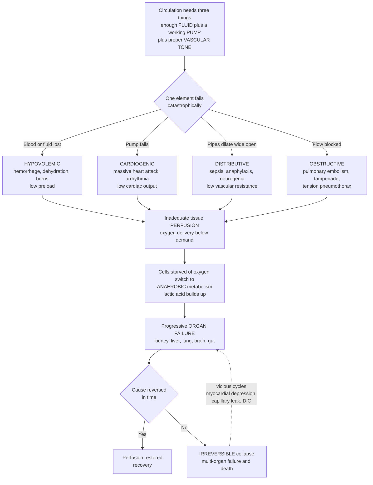

# 🩸 Shock and Circulatory Collapse

> [!abstract] TL;DR
> **Shock** is the body-wide failure of the circulation to deliver enough **blood — and therefore oxygen — to the tissues**, so cells everywhere begin to suffocate. It is a state, not a single disease: a **final common pathway** by which hemorrhage, heart attack, sepsis, anaphylaxis, and embolism all become rapidly fatal. Think of the circulation as needing three things — enough **fluid** (blood volume), a working **pump** (the heart), and **pipes that are not too loose** (vascular tone). Lose fluid and you get **hypovolemic** shock; the pump fails and you get **cardiogenic** shock; the pipes dilate wide open and you get **distributive** shock (sepsis, anaphylaxis, neurogenic); flow is mechanically blocked and you get **obstructive** shock (massive pulmonary embolism, cardiac tamponade, tension pneumothorax). Whatever the trigger, the deadly common ending is the same: **inadequate tissue perfusion → cellular hypoxia → anaerobic metabolism dumping lactic acid → progressive organ failure → irreversible collapse and death** unless the cause is reversed fast. The trajectory runs through three stages — **compensated** (reflexes hold blood pressure nearly normal), **progressive/decompensated** (compensation fails and BP crashes past a tipping point), and **irreversible** (cell death and multi-organ failure). This is why shock can look deceptively stable and then collapse abruptly, why **lactate** signals tissue hypoxia, and why identifying *which* of the three failures is happening is what guides life-saving treatment.

---

## Intuition

**Analogy first — the circulation as a citywide water-delivery system.** Imagine every cell in your body is a household that needs water (oxygen) piped to it every second to stay alive. The delivery network needs exactly three things to work: **enough water in the system** (blood volume), a **working pump station** to push it (the heart), and **pipes that hold pressure** rather than gaping open (vascular tone). On a good day, pressure is steady and every household gets its supply — that is a healthy, well-perfused body.

**Shock is a catastrophic failure of that delivery system**, and it can fail in three fundamentally different ways. **Drain the reservoir** — a burst main leaks the water out (bleeding), or a heat wave evaporates it (dehydration, burns) — and there is simply not enough water to pressurize the pipes: that is **hypovolemic** shock. **Break the pump station** — the motor seizes (a massive heart attack, a lethal arrhythmia) — and even a full reservoir cannot reach the houses: that is **cardiogenic** shock. **Blow every valve open at once** — the pipes suddenly dilate so wide that pressure collapses even though the reservoir is full and the pump runs fine (overwhelming infection, a severe allergic reaction, a spinal injury): that is **distributive** shock. (A fourth mode: **jam an obstruction into the main line** — a clot, or fluid squeezing the pump from outside — and flow is blocked: **obstructive** shock.)

**Here is the crucial part: no matter which failure starts it, the ending is identical.** Households stop getting water, cells start to suffocate, and — starved of oxygen — they switch to a desperate **emergency mode (anaerobic metabolism)** that keeps them alive for minutes but **dumps acid into the bloodstream**. Neighborhoods (organs) begin to go dark one by one — kidneys, liver, lungs, brain, gut. And the system fights back: reflexes make the pump race and the surviving pipes clamp down, so for a while the **pressure gauge at headquarters still reads nearly normal** even as outer districts are already failing. Then compensation is exhausted, pressure **crashes past a tipping point**, and unless someone finds and fixes the original fault fast, the collapse feeds on itself and becomes **irreversible**. Shock is the final highway by which many diseases kill — and reading *which* of the three failures is unfolding is what tells the rescuer where to aim.

---

## How It Works

### Core mechanics

1. **Perfusion is the whole point.** Cells need a continuous supply of oxygen matched to their metabolic demand. **Shock is defined as inadequate tissue perfusion** — oxygen delivery falling below cellular need — *regardless of the blood pressure number*. Hypotension is a common sign, but a patient can be in shock with a "normal" blood pressure (perfusion is already failing) and, briefly, can have low pressure without organ-level shock.

2. **The determinants of perfusion.** Blood pressure is the product of **cardiac output** and **systemic vascular resistance** (MAP ≈ CO × SVR). Cardiac output in turn depends on **preload** (venous return / filling volume), **pump function** (contractility and heart rate), and **afterload**. This three-part structure — *fluid, pump, tone* — is exactly what the shock classification breaks along.

3. **The four mechanisms (each disables a different determinant).**
   - **Hypovolemic** — loss of intravascular volume (hemorrhage, vomiting/diarrhea, burns, third-spacing) collapses **preload** → low cardiac output.
   - **Cardiogenic** — pump failure (massive myocardial infarction, malignant arrhythmia, end-stage heart failure, acute valve rupture) gives **low output despite adequate volume**.
   - **Distributive** — pathological **vasodilation and maldistribution** of flow (**septic**, **anaphylactic**, **neurogenic**) collapses **vascular tone** → low resistance, so pressure falls even with a normal or high cardiac output.
   - **Obstructive** — a mechanical block to flow (**massive pulmonary embolism**, **cardiac tamponade**, **tension pneumothorax**) prevents filling or ejection despite a normal pump and volume.

4. **Distinct hemodynamic fingerprints.** Because each type disables a different determinant, they read differently on monitoring: hypovolemic (low preload, low CO, **high** SVR from reflex vasoconstriction, cool skin), cardiogenic (**high** preload/filling pressures, low CO, high SVR, cool skin), distributive (low/normal preload, **high or normal** CO, **low** SVR, classically *warm* skin early), obstructive (high filling pressures, low CO, high SVR). Reading this fingerprint is what tells the clinician which failure is present.

5. **Compensation — why shock hides.** Falling pressure is sensed by **baroreceptors** (carotid sinus, aortic arch), triggering the **sympathetic nervous system**: tachycardia, increased contractility, and arteriolar/venous **vasoconstriction** that shunts blood from skin, gut, and kidney toward heart and brain. The **renin–angiotensin–aldosterone system (RAAS)** and **ADH/vasopressin** conserve salt and water and add vasoconstriction. These reflexes can hold blood pressure near normal despite substantial volume loss — the **compensated** stage — which is precisely why an early shock patient can look stable.

6. **Decompensation — the tipping point.** When loss exceeds what reflexes can offset, the system crosses a threshold: pressure falls, coronary and cerebral perfusion drop, the heart itself becomes ischemic and weakens, acidosis blunts the response to catecholamines, and vasoconstriction fails. The fall is **nonlinear** — stable, stable, then a sudden crash — because the compensating loops give way abruptly. This is the **progressive/decompensated** stage.

7. **The vicious cycles (positive feedback).** Decompensation is self-amplifying: hypoperfusion → **myocardial depression** → less output → worse hypoperfusion; hypoxia and inflammation → **capillary leak** → less circulating volume → worse hypoperfusion; stasis and endothelial injury → **disseminated intravascular coagulation (DIC)** → microvascular clots + bleeding → worse perfusion. Once enough of these loops engage, the state becomes **irreversible** — cells die and organs fail even after the trigger is fixed and pressure is restored.

8. **The cellular endpoint.** Perfusion failure means oxygen delivery below demand → mitochondria cannot make ATP by oxidative phosphorylation → cells switch to **anaerobic glycolysis**, generating **lactic acid** (rising blood **lactate** is the biochemical alarm of tissue hypoxia). Ion pumps fail, cells swell, and — past the point of no return — die. Aggregated across organs this is **multi-organ dysfunction**: acute kidney injury, ischemic hepatitis, ARDS, encephalopathy, gut ischemia.

### Flow / architecture



---

## Key Concepts

### Secondary (plain-language core)

- **Shock = the circulation failing to deliver enough oxygen to the body's cells.** It is an emergency in which tissues everywhere start to suffocate at once.
- **Three things the circulation needs:** enough **fluid** (blood), a working **pump** (heart), and **pipes with tone** (blood vessels). Shock happens when one fails badly.
- **The main types:** **hypovolemic** (too little blood — bleeding, dehydration), **cardiogenic** (the heart can't pump — heart attack), **distributive** (blood vessels dilate too wide — severe infection or allergy), and **obstructive** (something blocks blood flow).
- **Why it is sneaky:** the body's reflexes (racing heart, clamping vessels) can keep blood pressure looking almost normal for a while — the **compensated** stage — and then it can **crash suddenly**.
- **The warning chemical:** when cells run out of oxygen they make **lactic acid**, so a rising **lactate** level is a red flag that tissues are starving.
- **The fix depends on the cause:** replace lost blood, support or restart the pump, or fight the infection and tighten the vessels — the type dictates the treatment.

### Undergraduate (mechanisms and classification)

- **Definition.** Shock is a syndrome of **inadequate tissue perfusion** leading to cellular hypoxia, anaerobic metabolism (**lactic acidosis**), and progressive organ dysfunction. It is defined physiologically, not by a blood-pressure cutoff.
- **Hemodynamic determinants.** MAP ≈ **CO × SVR**; CO = **HR × stroke volume**; stroke volume depends on **preload, contractility, afterload**. The four shock classes map onto failure of preload, pump, tone, or a mechanical obstruction.
- **Hemodynamic profiles** (classic teaching):
  - *Hypovolemic:* ↓preload (↓CVP), ↓CO, ↑SVR, cool/clamped.
  - *Cardiogenic:* ↑preload (↑CVP/PCWP), ↓CO, ↑SVR, cool.
  - *Distributive:* ↓/normal preload, ↑/normal CO, **↓SVR**, warm early ("warm shock").
  - *Obstructive:* ↑filling pressures, ↓CO, ↑SVR (with cause-specific signs: distended neck veins, muffled heart sounds, tracheal deviation).
- **Stages.** **Compensated** (reflexes maintain BP: tachycardia, vasoconstriction, RAAS/ADH), **progressive/decompensated** (compensation exhausted; hypotension, worsening acidosis and hypoxia), **irreversible** (cell death, refractory hypotension, multi-organ failure despite treatment).
- **Septic shock** is the prototypical distributive shock: a dysregulated host response to infection produces **vasodilation**, **capillary leak** (hypovolemia), and **myocardial depression** simultaneously — a mixed picture. The **Sepsis-3** definition marks septic shock by the need for vasopressors to keep MAP ≥ 65 mmHg **plus** lactate > 2 mmol/L despite adequate fluids.
- **Consequences.** Lactic acidosis; **acute kidney injury** (prerenal → acute tubular necrosis); **ischemic hepatitis**; **ARDS**; encephalopathy; gut mucosal ischemia (a source of bacterial translocation); and **DIC**.
- **Management principle.** Restore perfusion (oxygen, fluids, blood, vasopressors/inotropes as appropriate) **and treat the cause** — stop the bleeding, revascularize the heart, drain the tamponade, give antibiotics and source control. *The type dictates the therapy*: fluids help hypovolemic and distributive shock but can drown cardiogenic shock.

### Graduate (integrative and quantitative depth)

- **Oxygen delivery and the critical DO₂.** **DO₂ = CO × CaO₂**, where arterial oxygen content CaO₂ ≈ (1.34 × Hb × SaO₂) + (0.003 × PaO₂). Normally oxygen **consumption (VO₂)** is *delivery-independent* — cells extract more as delivery falls. Below a **critical DO₂ (DO₂crit)**, extraction is maxed out and VO₂ becomes **supply-dependent**: further falls in delivery force anaerobic metabolism and lactate rises. This inflection is the quantitative heart of shock. **ScvO₂/SvO₂** (central/mixed venous oxygen saturation) indexes the extraction reserve.
- **Lactate is more than a hypoxia marker.** Elevated lactate reflects anaerobic glycolysis but also **stress-driven aerobic glycolysis** (catecholamine-stimulated Na⁺/K⁺-ATPase, β2 effects) and impaired hepatic clearance. **Lactate clearance/trajectory** over hours predicts outcome better than a single value — a resuscitation target in sepsis.
- **Decompensation as a bifurcation.** The compensated→decompensated transition behaves like a **tipping point** in a system of coupled feedback loops. Negative-feedback baroreflex control dominates until reinforcing (positive-feedback) loops — myocardial ischemia, acidosis-blunted vasoreactivity, capillary leak, microvascular thrombosis — gain enough loop strength to overwhelm it, producing a rapid, hysteretic collapse that resists reversal (why late shock is *irreversible* even after the trigger is removed).
- **Microcirculatory and mitochondrial shock.** Even after macro-hemodynamics (MAP, CO) are restored, **microcirculatory dysfunction** (heterogeneous capillary flow, glycocalyx shedding, leukocyte plugging) and **cytopathic hypoxia** (mitochondrial inability to use delivered oxygen, notably in sepsis) can perpetuate tissue hypoxia — the rationale for looking beyond blood pressure to perfusion markers.
- **Septic vasoplegia mechanisms.** Excess **inducible nitric oxide synthase (iNOS)** → NO → cGMP-mediated smooth-muscle relaxation; ATP-sensitive K⁺ channel opening; **relative vasopressin deficiency**; and adrenergic receptor downregulation together produce catecholamine-refractory vasodilation — the pharmacologic basis for vasopressin and, in refractory cases, methylene blue or angiotensin II.
- **Ischemia–reperfusion and DIC as amplifiers.** Restoring flow triggers a **reactive-oxygen-species burst**, complement and neutrophil activation, and endothelial injury; consumptive **coagulopathy (DIC)** simultaneously clots the microvasculature and depletes clotting factors, causing paradoxical bleeding — mechanisms that convert a salvageable state into multi-organ failure.
- **Frailty, reserve, and the deceptive plateau.** The width of the compensated plateau is set by physiologic **reserve**; the young and fit hold pressure until a very late, steep crash (dangerous false reassurance), whereas the elderly or β-blocked decompensate early and without tachycardia. Trending — not a single snapshot — is essential.

---

## Python Demo

```python
# Shock and Circulatory Collapse — four conceptual views (numpy + matplotlib).
# (a) COMPENSATION -> DECOMPENSATION: how mean arterial pressure (MAP) and heart
#     rate behave as blood volume is lost -- BP is held near-normal, then crashes.
# (b) PERFUSION vs volume loss: tissue perfusion fails EARLIER than BP reveals.
# (c) OXYGEN DELIVERY / LACTATE: consumption is supply-independent until a critical
#     delivery threshold, below which lactate rises (the anaerobic alarm).
# (d) SHOCK-TYPE HEMODYNAMIC PROFILES: preload, cardiac output, and vascular
#     resistance differ by mechanism -- the fingerprint that guides treatment.
# NOTE: illustrative models, NOT calibrated clinical values or medical advice.
import numpy as np
import matplotlib.pyplot as plt

fig, ax = plt.subplots(2, 2, figsize=(13.5, 9.5))

# -------------------------------------------------------------------
# (a) Compensated plateau then abrupt decompensation.
# -------------------------------------------------------------------
vol = np.linspace(0, 50, 500)                 # % blood volume lost
# MAP: baroreflex holds it near baseline, then a steep sigmoid crash (~33% loss).
MAP = 50.0 + 40.0 / (1.0 + np.exp(0.45 * (vol - 33.0)))     # 90 -> ~50 mmHg
# Heart rate climbs to defend cardiac output as volume falls.
HR  = 70.0 + 75.0 / (1.0 + np.exp(-0.18 * (vol - 22.0)))    # 70 -> ~145 bpm
tip = 33.0

ax[0, 0].plot(vol, MAP, color="crimson", lw=2.6, label="Mean arterial pressure (mmHg)")
ax[0, 0].plot(vol, HR,  color="royalblue", lw=2.2, ls="--", label="Heart rate (bpm)")
ax[0, 0].axvspan(0, tip, color="mediumseagreen", alpha=0.14)
ax[0, 0].axvspan(tip, 50, color="dimgray", alpha=0.16)
ax[0, 0].axvline(tip, color="black", ls=":", lw=1.4)
ax[0, 0].text(11, 33, "COMPENSATED\nreflexes hold BP", ha="center", fontsize=9, color="green")
ax[0, 0].text(42, 33, "DECOMPENSATED\nBP crashes", ha="center", fontsize=9, color="black")
ax[0, 0].annotate("tipping point", xy=(tip, 70), xytext=(tip - 20, 96),
                  arrowprops=dict(arrowstyle="->"), fontsize=9)
ax[0, 0].set_title("(a) Compensation then abrupt decompensation")
ax[0, 0].set_xlabel("Blood volume lost (%)")
ax[0, 0].set_ylabel("MAP (mmHg)  /  HR (bpm)")
ax[0, 0].set_ylim(0, 160)
ax[0, 0].legend(fontsize=8, loc="center left")

# -------------------------------------------------------------------
# (b) Tissue perfusion fails before the pressure gauge shows it.
# -------------------------------------------------------------------
perfusion = 100.0 / (1.0 + np.exp(0.16 * (vol - 25.0)))     # midpoint ~25% (earlier)
MAP_pct   = 100.0 * (MAP - 50.0) / 40.0                     # MAP as % of baseline

ax[0, 1].plot(vol, MAP_pct,   color="crimson", lw=2.4, label="Blood pressure (% baseline)")
ax[0, 1].plot(vol, perfusion, color="darkorange", lw=2.6, label="Tissue perfusion (% baseline)")
ax[0, 1].fill_between(vol, perfusion, MAP_pct, where=(MAP_pct > perfusion),
                      color="orange", alpha=0.15)
ax[0, 1].text(30, 78, "BP still 'looks ok'\nwhile perfusion\nalready failing",
              fontsize=8.5, color="firebrick")
ax[0, 1].set_title("(b) Perfusion collapses before BP does")
ax[0, 1].set_xlabel("Blood volume lost (%)")
ax[0, 1].set_ylabel("Percent of baseline")
ax[0, 1].set_ylim(0, 105)
ax[0, 1].legend(fontsize=8, loc="lower left")

# -------------------------------------------------------------------
# (c) Oxygen delivery vs consumption, and the rise of lactate.
# -------------------------------------------------------------------
DO2 = np.linspace(100, 1200, 500)             # oxygen delivery (mL/min), left = low
DO2crit = 400.0                               # critical delivery threshold
VO2_max = 250.0                               # normal oxygen consumption
VO2 = np.where(DO2 >= DO2crit, VO2_max, VO2_max * DO2 / DO2crit)   # supply-dependent below crit
lactate = 1.0 + 8.0 / (1.0 + np.exp(0.02 * (DO2 - DO2crit)))       # 1 -> ~9 mmol/L

axc = ax[1, 0]
l1, = axc.plot(DO2, VO2, color="teal", lw=2.6, label="Oxygen consumption VO2")
axc.axvline(DO2crit, color="black", ls=":", lw=1.4)
axc.axvspan(100, DO2crit, color="lightcoral", alpha=0.15)
axc.text(230, 120, "ANAEROBIC\nsupply-dependent", ha="center", fontsize=8.5, color="firebrick")
axc.text(820, 120, "AEROBIC\nsupply-independent", ha="center", fontsize=8.5, color="teal")
axc.annotate("critical DO2", xy=(DO2crit, 250), xytext=(DO2crit + 90, 300),
             arrowprops=dict(arrowstyle="->"), fontsize=9)
axc.set_title("(c) Oxygen delivery, consumption, and lactate")
axc.set_xlabel("Oxygen delivery DO2 (mL/min)")
axc.set_ylabel("VO2 (mL/min)", color="teal")
axc.set_ylim(0, 320)
axr = axc.twinx()
l2, = axr.plot(DO2, lactate, color="darkviolet", lw=2.4, ls="--", label="Lactate")
axr.set_ylabel("Lactate (mmol/L)", color="darkviolet")
axr.set_ylim(0, 10)
axc.legend(handles=[l1, l2], fontsize=8, loc="center right")

# -------------------------------------------------------------------
# (d) Hemodynamic fingerprints of the four shock types.
#     Values normalized to normal = 1.0 (qualitative teaching profile).
# -------------------------------------------------------------------
types   = ["Hypovolemic", "Cardiogenic", "Distributive", "Obstructive"]
preload = [0.35, 1.80, 0.55, 1.80]            # CVP / filling pressure
co      = [0.50, 0.40, 1.55, 0.45]            # cardiac output
svr     = [1.75, 1.70, 0.40, 1.60]            # systemic vascular resistance
x = np.arange(len(types)); w = 0.26

axd = ax[1, 1]
axd.bar(x - w, preload, w, label="Preload (CVP)", color="steelblue")
axd.bar(x,     co,      w, label="Cardiac output", color="seagreen")
axd.bar(x + w, svr,     w, label="Vascular resistance", color="indianred")
axd.axhline(1.0, color="gray", ls="--", lw=1.0)
axd.text(3.05, 1.03, "normal", fontsize=7.5, color="gray", ha="right")
axd.set_title("(d) Hemodynamic fingerprints by shock type")
axd.set_ylabel("Relative to normal (= 1.0)")
axd.set_xticks(x)
axd.set_xticklabels(types, fontsize=8.5)
axd.set_ylim(0, 2.1)
axd.legend(fontsize=8, loc="upper center", ncol=1)

fig.suptitle("Shock: compensation -> decompensation, oxygen-lactate coupling, "
             "and the hemodynamic fingerprints that guide treatment", fontsize=12)
fig.tight_layout(rect=[0, 0, 1, 0.96])
plt.savefig("shock_and_circulatory_collapse.png", dpi=130)
plt.show()
```

**What the plots show.** Panel **(a)** is the deadly signature of shock: as blood volume is lost, the **heart rate climbs** and **mean arterial pressure stays nearly flat** through the green *compensated* zone — the patient looks stable — then plunges through a **tipping point** into the gray *decompensated* zone, a nonlinear crash that explains why shock "suddenly" collapses. Panel **(b)** drives home the trap: **tissue perfusion (orange) falls earlier** than the blood-pressure gauge (red) reveals, because vasoconstriction sacrifices peripheral flow to defend central pressure — so a "normal" BP can hide advancing shock. Panel **(c)** is the cellular mechanism: oxygen **consumption is supply-independent** while delivery is adequate, but below the **critical DO₂** it becomes supply-dependent and **lactate rises** — the biochemical alarm of anaerobic metabolism. Panel **(d)** is the diagnostic payoff: each shock type has a distinct **fingerprint** of preload, cardiac output, and vascular resistance — *distributive* shock uniquely shows **low resistance with preserved output**, *cardiogenic* shows **high filling pressure with low output** — the pattern that tells the clinician whether to give fluids, drive the pump, or squeeze the vessels.

---

## Real-World Applications

> **Example — Septic shock in the ICU (distributive shock as the modern archetype).** A patient with pneumonia develops a dysregulated immune response: inflammatory mediators trigger **iNOS-driven vasodilation** (low SVR), **capillary leak** (functional hypovolemia), and **myocardial depression** — all three failures at once. Blood pressure falls; lactate rises above 2 mmol/L; urine output drops as kidneys hypoperfuse. Management follows the mechanism directly: **early antibiotics and source control** (treat the cause), **fluid resuscitation** to refill the leaking vasculature, **norepinephrine** to restore vascular tone (with **vasopressin** added for catecholamine-refractory vasoplegia), and **lactate clearance** as a resuscitation target. The **Sepsis-3** criteria formalize this picture — vasopressor-dependent hypotension plus lactate > 2 mmol/L defines septic shock.

- **Trauma / hemorrhagic shock (hypovolemic).** Massive bleeding drops preload; the "lethal triad" of hypothermia, acidosis, and coagulopathy accelerates collapse. Care targets the cause — **hemorrhage control, blood-product transfusion, and permissive hypotension** — not crystalloid alone; **tranexamic acid** counters fibrinolysis.
- **Massive myocardial infarction (cardiogenic).** A large infarct destroys enough pump muscle that cardiac output collapses despite full ventricles. Treatment is **emergent revascularization** and inotropic/mechanical circulatory support (IABP, Impella, ECMO) — and critically, fluids that help hypovolemic shock can be lethal here.
- **Anaphylaxis (distributive).** Mast-cell mediator release causes explosive vasodilation and capillary leak; **intramuscular epinephrine** is life-saving precisely because it reverses the vascular-tone failure (α1 vasoconstriction) and bronchospasm at once.
- **Massive pulmonary embolism / tension pneumothorax / tamponade (obstructive).** Flow is mechanically blocked; the fix is **mechanical** — thrombolysis or embolectomy, needle/finger decompression, pericardiocentesis — and again, generic "fluids and pressors" only buy minutes.
- **Vital signs, lactate, and ScvO₂ as bedside instruments.** Trending lactate, central venous oxygen saturation, capillary refill, and urine output are the daily readouts of whether perfusion is being restored — applied oxygen-delivery physiology at the bedside.

---

## Common Pitfalls

- **Equating shock with low blood pressure.** Shock is a **perfusion** failure; a compensated patient can hold a near-normal BP while organs are already starving (Panel b), and normal pressure is dangerously reassuring in the young. Read perfusion (lactate, capillary refill, mentation, urine output), not just the cuff.
- **Trusting the compensated plateau.** The flat BP of early shock is a **loaded spring**, not stability — decompensation is nonlinear and abrupt (Panel a). The fit and the young crash *latest and hardest*; do not wait for hypotension to act.
- **Giving fluids to every shock.** Fluids rescue hypovolemic and distributive shock but can **drown a failing pump** in cardiogenic shock and barely touch obstructive shock. The **type dictates the therapy** — misclassifying the mechanism can be fatal.
- **Missing obstructive shock.** Tamponade, tension pneumothorax, and massive PE do not respond to fluids or pressors — they need a **mechanical fix**. Distended neck veins with hypotension should trigger the obstructive search immediately.
- **Being fooled by "warm shock."** Early septic (distributive) shock has warm, flushed skin and a bounding pulse from vasodilation and high output — the opposite of the cold, clamped picture of hypovolemic/cardiogenic shock. Warm skin does **not** mean the patient is well.
- **Chasing blood pressure while ignoring the microcirculation.** Restoring MAP and cardiac output does not guarantee tissue perfusion — **microcirculatory dysfunction and cytopathic (mitochondrial) hypoxia** can persist, which is why lactate can stay high despite a "corrected" pressure.
- **Forgetting the beta-blocked or elderly patient.** Reflex tachycardia — a key early sign — may be **absent** in patients on beta-blockers or with autonomic failure, hiding shock until late decompensation.
- **Reading this as clinical guidance.** This note is **educational pathophysiology** at textbook level, not advice for managing any individual patient, which always depends on a clinician and the real specifics of the case.

---

## Related Concepts

**Within this vault (Section 02 – Cardiovascular and Respiratory Disease).** Shock is the point where the organ systems of this section fail together, so it references its siblings in prose. *Cardiovascular_Pathophysiology* supplies the pressure–flow determinants (MAP ≈ CO × SVR, preload/afterload) that the shock classification is built on. *Heart_Failure_and_Arrhythmias* is the direct route into **cardiogenic** shock — the failing or arrhythmic pump pushed past compensation. *Sepsis_and_Systemic_Infection* is the mechanistic companion to **distributive/septic** shock, developing the dysregulated host response, vasoplegia, and the Sepsis-3 framework only summarized here. *Pulmonary_Infections_and_Respiratory_Failure* connects shock's respiratory arm — hypoxemia lowering oxygen delivery, and **ARDS** as a downstream consequence of shock and sepsis. And *Hemostasis_Thrombosis_and_Bleeding_Disorders* underlies both **hemorrhagic** hypovolemic shock and **DIC**, the coagulation catastrophe of late shock. (These are prose references because they are siblings in the same section of the Clinical Medicine vault.)

**Across the vault (Glob-verified links).**

- [[Clinical_Medicine/01_Foundations_of_Disease_and_Pathophysiology/Cellular_Injury_and_Adaptation|Cellular Injury and Adaptation]] — the cellular endpoint of shock: hypoxia → ATP depletion → the reversible-to-irreversible threshold that mirrors the compensated-to-irreversible trajectory of shock itself.
- [[Clinical_Medicine/01_Foundations_of_Disease_and_Pathophysiology/Inflammation_and_Tissue_Repair|Inflammation and Tissue Repair]] — the inflammatory cascade (SIRS, cytokines, capillary leak) that drives septic/distributive shock and its multi-organ damage.
- [[Clinical_Medicine/01_Foundations_of_Disease_and_Pathophysiology/Clinical_Medicine_and_Pathophysiology_Overview|Clinical Medicine and Pathophysiology Overview]] — frames shock as the exemplary "compensation that fails or turns harmful," the vault's central theme of disease as broken homeostasis.
- [[Biology/09_Human_Physiology_and_Anatomy/The_Circulatory_and_Respiratory_Systems|The Circulatory and Respiratory Systems]] — the baseline anatomy and physiology of the heart, vessels, and gas exchange that shock disrupts.
- [[Biology/09_Human_Physiology_and_Anatomy/Homeostasis_and_the_Nervous_System|Homeostasis and the Nervous System]] — the baroreceptor reflex and sympathetic response that produce the compensated stage of shock.
- [[Biology/03_Metabolism_and_Bioenergetics/Glycolysis|Glycolysis]] — the anaerobic pathway cells fall back on when oxygen delivery fails, producing the **lactate** that flags tissue hypoxia.
- [[Biology/03_Metabolism_and_Bioenergetics/Oxidative_Phosphorylation|Oxidative Phosphorylation]] — the oxygen-dependent ATP production that shock starves, forcing the switch to anaerobic metabolism.
- [[Biology/11_Microbiology_and_Immunology/The_Innate_Immune_System|The Innate Immune System]] — the pathogen-sensing and inflammatory machinery whose dysregulation produces septic shock.
- [[Chemistry/01_General_and_Foundational_Chemistry/Acids_Bases_and_pH|Acids, Bases and pH]] — the acid-base chemistry behind **lactic acidosis**, the metabolic hallmark of tissue hypoxia in shock.
- [[Health_Nutrition_and_Longevity/04_Sleep_Stress_and_Mental_Wellbeing/Stress_and_the_Stress_Response|Stress and the Stress Response]] — the sympathetic/catecholamine surge that, as an acute physiologic stress response, drives the compensated phase of shock.
- [[Systems_Thinking_and_Complexity/04_Dynamics_and_Modeling/Bifurcations_and_Tipping_Points|Bifurcations and Tipping Points]] — the general theory of why a stable-looking system crosses a threshold and collapses abruptly, the abstract form of decompensation.
- [[Systems_Thinking_and_Complexity/01_Foundations_of_Systems_Thinking/Feedback_Loops_and_Causality|Feedback Loops and Causality]] — negative feedback (baroreflex) versus the reinforcing positive-feedback vicious cycles (myocardial depression, capillary leak, DIC) that make late shock irreversible.

---

## Review Questions

**Secondary**
1. Using the "water-delivery system" analogy, explain the difference between hypovolemic, cardiogenic, and distributive shock — what has failed in each? Why does a rising **lactate** level warn that tissues are in trouble?
2. A bleeding patient has a nearly normal blood pressure but a fast heart rate and cold, pale skin. In plain terms, why can the blood pressure still look "okay" even though the person is seriously ill, and why might it crash suddenly soon after?

**Undergraduate**
3. Sketch the compensated → decompensated → irreversible trajectory of hemorrhagic shock. Name the reflex mechanisms that defend blood pressure in the compensated stage, and explain physiologically why the transition to decompensation is abrupt rather than gradual.
4. Give the expected hemodynamic profile (preload, cardiac output, systemic vascular resistance) for each of the four shock types, and explain why "give IV fluids" is correct for one type but potentially fatal for another.

**Graduate**
5. Define the **critical oxygen delivery (DO₂crit)** and explain, using the DO₂–VO₂ relationship, why lactate rises only below it. Then argue why lactate can remain elevated in septic shock even after mean arterial pressure and cardiac output are restored — invoke microcirculatory dysfunction and cytopathic hypoxia.
6. Model the compensated-to-decompensated transition as a bifurcation in a system of coupled feedback loops. Identify the dominant negative-feedback loop and at least three reinforcing positive-feedback loops, and explain mechanistically why crossing the tipping point makes shock resistant to reversal even after the initiating cause is corrected.

---

## Sources

- Loscalzo, J., Fauci, A., Kasper, D., et al. (eds.). *Harrison's Principles of Internal Medicine* (21st ed.). McGraw-Hill — chapters on "Approach to the Patient with Shock," septic, cardiogenic, and hypovolemic shock.
- Hall, J. E., & Hall, M. E. *Guyton and Hall Textbook of Medical Physiology* (14th ed.). Elsevier — "Circulatory Shock and Its Treatment" (stages, compensation, irreversibility).
- Kumar, V., Abbas, A. K., & Aster, J. C. *Robbins & Cotran Pathologic Basis of Disease* (10th ed.). Elsevier — "Hemodynamic Disorders, Thromboembolic Disease, and Shock."
- Singer, M., Deutschman, C. S., Seymour, C. W., et al. (2016). "The Third International Consensus Definitions for Sepsis and Septic Shock (Sepsis-3)." *JAMA*, 315(8), 801–810.
- Vincent, J.-L., & De Backer, D. (2013). "Circulatory Shock." *New England Journal of Medicine*, 369(18), 1726–1734.

---

#clinical-medicine #shock #circulatory-collapse #sepsis #perfusion
