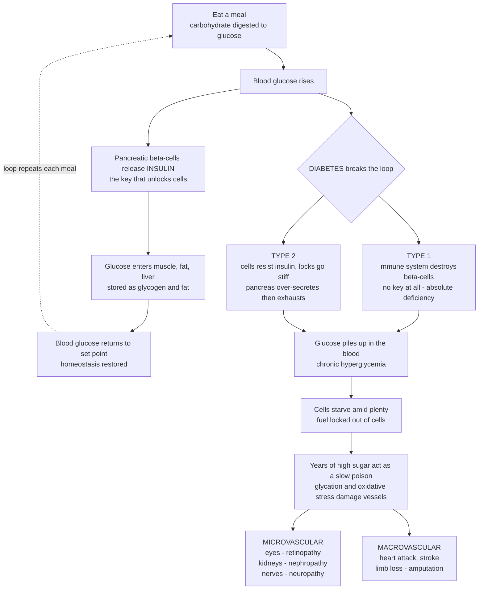

# 🩸 Diabetes Mellitus and Glucose Regulation

> [!abstract] TL;DR
> Every cell in your body runs on **glucose**, and **insulin** is the hormonal *key* that unlocks cells to let glucose in. After a meal, pancreatic **β-cells** release insulin, glucose flows into muscle, fat, and liver, and blood sugar falls back to a tightly regulated set point. **Diabetes mellitus** is the failure of this loop, and it fails in two fundamentally different ways. In **type 1**, the immune system destroys the β-cells, so there is *no key at all* — an absolute insulin deficiency that is fatal without injected insulin. In **type 2** (far more common, tied to obesity and the metabolic syndrome), the keys still exist but the *locks have gone stiff* — cells become **insulin-resistant**, the pancreas over-secretes to compensate, and eventually the exhausted β-cells can no longer keep up. Either way the outcome converges: glucose cannot enter cells and piles up in the blood, so the cells "starve amid plenty." That chronic excess sugar acts as a slow poison on blood vessels everywhere, which is why diabetes ultimately attacks the **eyes, kidneys, nerves, heart, and limbs** — making it one of the world's great epidemics and the integrative paradigm of metabolic disease. *This note is educational pathophysiology at textbook level, not individual medical advice.*

---

## Intuition

**Analogy — glucose is the fuel, insulin is the key, and diabetes is a lock-and-key failure.** Picture every cell in your body as a house that runs entirely on a single fuel delivered through the bloodstream: **glucose** (blood sugar). The fuel is floating right outside the door, but the door is locked. **Insulin** is the key. After you eat, your pancreas senses the rising sugar and hands out keys by the thousand; doors swing open all over the body, glucose pours in, the cells are fed, and the blood sugar level drops smoothly back to normal. This elegant thermostat runs quietly after every meal of your life.

**Diabetes is what happens when the key-and-lock system breaks — and it breaks in two completely different ways.** In **type 1 diabetes**, the body's own immune system mistakenly firebombs the key factory: the insulin-making β-cells are destroyed, so there is *no key at all*. Sufferers must inject insulin to survive. In **type 2 diabetes** — vastly more common and linked to obesity — the keys are still there, but the *locks have rusted stiff*: cells stop responding to insulin (they become **resistant**), so the pancreas frantically pumps out more and more keys to force the doors open, until one day the overworked factory simply can't keep up. Either way, the result is identical and cruelly ironic: glucose can't get into the cells and instead **piles up in the blood**, so the cells are effectively *starving while surrounded by fuel*. And that excess sugar, sitting in the vessels year after year, behaves like a slow corrosive — silently caramelizing and damaging blood vessels throughout the body. That is why, decades later, diabetes comes for the eyes, the kidneys, the nerves, the heart, and the feet. Understanding this one loop — and its two failure modes — unlocks one of the largest chronic-disease epidemics on Earth.

---

## How It Works

### Core mechanics — the glucose thermostat and its two failure modes

1. **The regulated variable.** Blood glucose is held in a narrow band (fasting roughly 70–100 mg/dL). Too low starves the brain (which runs almost exclusively on glucose); too high poisons vessels. The body defends this band with opposing hormones.
2. **Insulin lowers glucose.** Released by pancreatic **β-cells** when glucose rises, insulin is the "storage / fed-state" hormone. It drives glucose **uptake** into muscle and fat (via GLUT4 transporters), tells the **liver** to store glucose as glycogen and stop making new glucose, and promotes fat storage (lipogenesis) while suppressing fat breakdown.
3. **Glucagon raises glucose.** Released by **α-cells** when glucose falls, glucagon is the "mobilization / fasting-state" hormone: it drives the liver to break down glycogen (glycogenolysis) and manufacture new glucose (gluconeogenesis). Insulin and glucagon are a **push–pull pair** holding the set point.
4. **Fed vs fasting states.** After a meal, insulin dominates: glucose is stored. Between meals and overnight, glucagon dominates: the liver releases glucose to feed the brain. Health is the smooth alternation between these states.
5. **Type 1 failure — no key.** Autoimmune destruction of β-cells causes **absolute insulin deficiency**. Without insulin, glucose can't enter cells *and* the liver's glucose output is unrestrained, so glucose soars. The body, sensing "starvation," burns fat into **ketones** — leading toward diabetic ketoacidosis.
6. **Type 2 failure — stiff locks.** Chronic caloric excess and obesity make cells **insulin-resistant**. β-cells compensate by secreting ever more insulin (hyperinsulinemia holds glucose normal for years). Eventually the β-cells **exhaust and fail** relative to demand — a *relative* insulin deficiency — and glucose climbs. Type 2 is typically **progressive**.
7. **The convergence — starvation amid plenty.** In both types the endpoint is the same: reduced cellular uptake plus unrestrained hepatic glucose output produces sustained **hyperglycemia**. Cells lack fuel while the blood is awash in it.
8. **The slow poison.** Sustained high glucose chemically modifies proteins (**glycation**, forming advanced glycation end-products) and floods cells with metabolic byproducts and oxidative stress, silently damaging the walls of blood vessels everywhere — the root of every chronic complication.

### From the loop to the epidemic



*Read the top loop as healthy glucose homeostasis; the branch is the two failure modes; the bottom cascade is why a disease of blood sugar becomes a disease of the eyes, kidneys, nerves, heart, and limbs.*

---

## Key Concepts

### Secondary (intuitive)

- **Glucose** = the sugar in your blood that fuels every cell. **Insulin** = the hormone "key" that lets glucose into cells and lowers blood sugar.
- **Diabetes** = a disease where blood sugar stays too high because the insulin system has broken.
- **Type 1** = the body destroys its own insulin-making cells (no key) — usually starts young, always needs insulin injections.
- **Type 2** = cells stop responding to insulin (stiff locks), usually linked to weight and lifestyle, and is by far the most common form.
- **Why it's dangerous** = high sugar for years silently wrecks blood vessels, damaging eyes, kidneys, nerves, heart, and feet.

### Undergraduate (formal)

- **Glucose homeostasis.** Insulin (β-cells) lowers glucose by promoting uptake and storage and suppressing hepatic output; glucagon (α-cells) raises it by glycogenolysis and gluconeogenesis. The two hormones defend a set point across fed and fasting states.
- **Definition.** Diabetes mellitus is a group of metabolic disorders defined by chronic **hyperglycemia** resulting from defects in insulin **secretion**, insulin **action**, or both.
- **Classification.**
  - **Type 1** — immune-mediated β-cell destruction → *absolute* insulin deficiency; often young onset; islet autoantibodies; ketosis-prone; insulin-dependent for survival.
  - **Type 2** — **insulin resistance** plus a *relative* secretory defect / progressive β-cell failure; associated with obesity and the **metabolic syndrome**; the large majority of cases (~90%+); often initially managed without insulin.
  - **Gestational** — glucose intolerance first recognized in pregnancy.
  - **Secondary / monogenic** — e.g., **MODY** (maturity-onset diabetes of the young, single-gene β-cell defects), pancreatic disease, drug/steroid-induced, endocrinopathies.
- **Diagnostic thresholds** (any one, confirmed): **fasting plasma glucose ≥ 126 mg/dL**; **2-hour OGTT glucose ≥ 200 mg/dL**; **HbA1c ≥ 6.5%**; or **random glucose ≥ 200 mg/dL** with classic symptoms. *Prediabetes*: FPG 100–125, HbA1c 5.7–6.4%.
- **HbA1c** = glycated hemoglobin, reflecting **average** glucose over the prior ~2–3 months — the workhorse of long-term control.
- **Acute complications.** **Diabetic ketoacidosis (DKA)** — chiefly type 1: insulin lack → lipolysis → ketogenesis → high-anion-gap metabolic acidosis. **Hyperosmolar hyperglycemic state (HHS)** — chiefly type 2: extreme hyperglycemia and dehydration *without* significant ketosis (residual insulin suppresses ketogenesis). **Hypoglycemia** — usually a *treatment* complication (too much insulin/sulfonylurea).
- **Chronic complications** (the true burden). **Microvascular**: retinopathy (leading cause of adult blindness), nephropathy (leading cause of end-stage renal disease), neuropathy. **Macrovascular**: accelerated atherosclerosis → myocardial infarction, stroke, peripheral arterial disease and amputation.

### Graduate (mechanistic and systems)

- **Insulin signal transduction.** Insulin binds its receptor tyrosine kinase → IRS proteins → **PI3K/Akt** → **GLUT4** translocation to the membrane (glucose uptake), glycogen synthase activation, and suppression of FoxO-driven gluconeogenesis. **Insulin resistance** is a defect *along this cascade* (often lipid-driven, via diacylglycerol/PKCθ and inflammatory serine-kinase phosphorylation of IRS-1), not a lack of hormone.
- **The β-cell compensation (Starling) curve.** Insulin secretion rises to offset resistance, holding glucose near-normal — until secretory capacity peaks and then declines (glucotoxicity, lipotoxicity, islet amyloid, ER stress). Overt type 2 diabetes appears at the *descending limb*: glucose climbs precisely as compensating insulin falls. This is why type 2 is progressive and why the fasting insulin can be *high early and low late*.
- **The incretin axis.** Gut-derived **GLP-1** and GIP amplify glucose-stimulated insulin secretion (the "incretin effect"), suppress glucagon, and slow gastric emptying — the pharmacological target of GLP-1 receptor agonists and DPP-4 inhibitors.
- **DKA mechanism.** Absolute insulin deficiency plus counter-regulatory surge (glucagon, catecholamines, cortisol) → unrestrained lipolysis → hepatic β-oxidation → **ketone bodies** (β-hydroxybutyrate, acetoacetate) → metabolic acidosis, osmotic diuresis, and total-body potassium depletion.
- **Unifying mechanism of hyperglycemic damage (Brownlee).** Excess intracellular glucose in cells that *cannot* limit their own uptake (endothelium, retina, glomerulus, neurons) overdrives the electron transport chain, generating **mitochondrial superoxide** that activates four pathways in parallel — **polyol**, **hexosamine**, **PKC**, and **AGE** formation — the common root of both micro- and macrovascular injury. Advanced glycation end-products crosslink matrix proteins and engage RAGE receptors, driving inflammation and stiffening vessels.
- **Metabolic syndrome and ectopic fat.** Central adiposity, dyslipidemia (high triglycerides, low HDL), hypertension, and hyperglycemia cluster because ectopic lipid in liver and muscle drives resistance; the syndrome is a cardiovascular-risk multiplier, situating diabetes within a broader **cardiometabolic** continuum.

---

## Python Demo

```python
# Diabetes and glucose regulation — two views:
#   (a) GLUCOSE-INSULIN DYNAMICS: post-meal / oral-glucose-tolerance-test curves for
#       NORMAL vs TYPE 1 vs TYPE 2, against the diagnostic thresholds. Normal rises then
#       returns to baseline; type 1 (no insulin) stays very high; type 2 (resistance)
#       is delayed, exaggerated, and sustained.
#   (b) HbA1c vs COMPLICATION RISK: how worse average glucose (higher HbA1c) drives a
#       steeply rising risk of microvascular complications — the reason "control" matters.
import numpy as np
import matplotlib.pyplot as plt

# ---------- (a) Glucose response by type over a 3-hour tolerance test ----------
t = np.linspace(0, 180, 361)                 # minutes after the glucose load
gamma = lambda tp: (t / tp) * np.exp(1 - t / tp)   # unit-height surge peaking at t = tp

# fasting baseline + insulin-shaped excursion (+ a sustained term where clearance fails)
normal = 90  + 55 * gamma(40)                                   # sharp rise, full return
type2  = 120 + 120 * gamma(75) + 55  * (1 - np.exp(-t / 60))    # delayed, high, sustained
type1  = 130 + 90  * gamma(60) + 140 * (1 - np.exp(-t / 50))    # no clearance -> stays high

# ---------- (b) HbA1c -> average glucose and relative microvascular risk ----------
a1c   = np.linspace(5.0, 12.0, 200)          # HbA1c percent
eAG   = 28.7 * a1c - 46.7                     # estimated average glucose (mg/dL), ADAG eqn
rel_risk = np.exp(0.35 * (a1c - 6.0))         # relative microvascular risk, normalized at 6%

fig, (ax1, ax2) = plt.subplots(1, 2, figsize=(14, 5.5))

# --- panel (a): glucose tolerance curves by type ---
ax1.axhspan(70, 140, color="#2ecc71", alpha=0.12, label="Normal range")
ax1.axhline(200, color="#C0392B", ls="--", lw=1.2, label="Diabetes 2-hr threshold (200)")
ax1.axhline(140, color="#E67E22", ls=":",  lw=1.2, label="Upper normal 2-hr (140)")
ax1.plot(t, normal, color="#27AE60", lw=2.2, label="Normal: rises then returns")
ax1.plot(t, type2,  color="#E67E22", lw=2.2, label="Type 2: delayed, high, sustained")
ax1.plot(t, type1,  color="#C0392B", lw=2.2, label="Type 1: no insulin, stays high")
ax1.axvline(120, color="grey", lw=1, alpha=0.6)
ax1.text(122, 60, "2-hr\ndiagnostic\npoint", fontsize=8, color="grey")
ax1.set_xlabel("Minutes after glucose load")
ax1.set_ylabel("Blood glucose (mg/dL)")
ax1.set_title("(a) Glucose-insulin dynamics by diabetes type")
ax1.set_ylim(50, 340)
ax1.legend(loc="upper right", fontsize=8)
ax1.grid(alpha=0.3)

# --- panel (b): HbA1c vs complication risk ---
ax2.plot(a1c, rel_risk, color="#8E44AD", lw=2.4)
ax2.axvline(6.5, color="#C0392B", ls="--", lw=1.2, label="Diabetes dx (HbA1c 6.5%)")
ax2.axvline(7.0, color="#16A085", ls=":",  lw=1.4, label="Common target (7.0%)")
ax2.fill_between(a1c, 1, rel_risk, where=(a1c >= 7.0), color="#8E44AD", alpha=0.10)
ax2.set_xlabel("HbA1c (% — reflects ~3-month average glucose)")
ax2.set_ylabel("Relative microvascular complication risk")
ax2.set_title("(b) Worse average glucose -> steeply rising complication risk")
ax2.legend(loc="upper left", fontsize=8)
ax2.grid(alpha=0.3)
# secondary annotation: map a couple of HbA1c values to average glucose
for x in (6.0, 8.0, 10.0):
    y = np.exp(0.35 * (x - 6.0))
    ax2.annotate(f"~{28.7*x-46.7:.0f} mg/dL avg", xy=(x, y),
                 xytext=(x + 0.1, y + 0.4), fontsize=8, color="#555")

plt.tight_layout()
plt.show()

# --- quick numeric readout of the 2-hour diagnostic point ---
i2 = np.argmin(np.abs(t - 120))
print(f"2-hour glucose  ->  normal {normal[i2]:5.0f} | type2 {type2[i2]:5.0f} | type1 {type1[i2]:5.0f} mg/dL")
print(f"HbA1c 6% ~ {28.7*6-46.7:.0f} mg/dL avg; HbA1c 9% ~ {28.7*9-46.7:.0f} mg/dL avg "
      f"(risk x{np.exp(0.35*(9-6)):.1f} vs 6%)")
```

**What you see.** *Panel (a)* is the disease in one picture. The **green** normal curve rises modestly after the load and is escorted back into the safe band by a brisk insulin response — the 2-hour value sits comfortably under 140. The **red** type-1 curve, with *no key at all*, has nothing to bring glucose down: it climbs and stays dangerously high. The **orange** type-2 curve shows the signature of **resistance** — a delayed, exaggerated peak that lingers well above the 200 mg/dL diabetes threshold at two hours because the stiff locks blunt and slow the response. *Panel (b)* shows *why control is the whole game*: microvascular complication risk climbs **steeply** with rising HbA1c (average glucose), so the same disease is mild or catastrophic depending on how far and how long glucose runs high — the quantitative case for keeping the loop as close to its set point as safely possible.

---

## Real-World Applications

- **HbA1c and continuous glucose monitoring (CGM).** A single HbA1c blood test summarizes months of average glucose; wearable CGMs (Dexcom, FreeStyle Libre) stream interstitial glucose every few minutes, exposing the post-meal excursions this note models and enabling "time-in-range" as a modern control metric.
- **Insulin replacement and the artificial pancreas.** Type 1 survival depends on exogenous insulin; **closed-loop / hybrid artificial-pancreas** systems couple a CGM to an insulin pump with a control algorithm — a literal engineered replacement for the broken feedback loop, and a showcase of control theory in medicine.
- **Incretin- and kidney-based therapeutics.** **GLP-1 receptor agonists** (semaglutide/Ozempic, tirzepatide) exploit the incretin axis to lower glucose and body weight; **SGLT2 inhibitors** dump glucose in the urine and, remarkably, protect the heart and kidneys — reshaping how type 2 diabetes and its cardiorenal complications are managed.
- **Complication screening — including AI.** Annual **retinal screening** catches diabetic retinopathy before vision loss; the FDA-cleared **IDx-DR** autonomously grades retinal photos with AI. Urine albumin and eGFR track nephropathy; monofilament foot exams guard against neuropathic ulcers and amputation.
- **Public-health burden.** Diabetes is among the fastest-growing chronic diseases worldwide and a leading cause of blindness, kidney failure, non-traumatic amputation, and cardiovascular death — driving dialysis demand, disability, and healthcare spending at population scale, and anchoring prevention campaigns targeting obesity and the metabolic syndrome.

---

## Common Pitfalls

- **Conflating type 1 and type 2.** They share a name and an endpoint (hyperglycemia) but have opposite mechanisms — *no insulin* vs *resistance to insulin*. Age is not diagnostic: adults get type 1 (including slow-onset **LADA**), and children increasingly get type 2. Misclassification leads to the wrong treatment.
- **Treating type 2 as "the mild kind."** Type 2 is progressive and, by sheer numbers, causes the *majority* of diabetes complications. "Borderline" or "a touch of sugar" understates a disease that silently damages vessels for years.
- **"Eating sugar causes diabetes."** Sugar intake is a risk contributor via obesity, but type 1 is autoimmune and type 2 is driven by the whole energy-balance and adiposity picture, plus genetics. The mechanism is insulin *deficiency or resistance*, not dietary sugar per se.
- **Forgetting the silent years.** Hyperglycemia is usually **asymptomatic** until complications appear — homeostatic reserve hides the disease. Normal-feeling patients can already have retinopathy or nephropathy; this is the entire rationale for screening.
- **Confusing DKA and HHS.** DKA (type 1, ketoacidosis from *absolute* insulin lack) and HHS (type 2, extreme hyperglycemia and dehydration *without* ketosis because residual insulin still suppresses ketogenesis) are different emergencies with different chemistry.
- **Chasing the number, ignoring the loop.** Over-aggressive glucose lowering causes dangerous **hypoglycemia**; trials like ACCORD showed that forcing HbA1c too low too fast can *increase* harm. The goal is a repaired, safely regulated loop — individualized targets — not a single "perfect" number.
- **Reading this as medical advice.** This note teaches disease *mechanisms* at textbook level. Diagnosis, targets, and treatment for any real person depend on a clinician and that individual's full clinical picture.

---

## Related Concepts

**Within this vault (Section 03 — Metabolic, Endocrine and Renal; prose references to sibling notes).** Diabetes is the great connector of this section, so it should be read alongside its neighbors. *Endocrine Pathophysiology* provides the wider hormonal control framework — feedback axes, hyper- and hypo-secretion — of which the insulin–glucagon loop is the metabolic centerpiece. *Nutritional and Metabolic Disorders* situates diabetes within energy balance, obesity, and the metabolic syndrome that seeds type 2. *Renal Pathophysiology and Kidney Disease* picks up **diabetic nephropathy**, the leading cause of end-stage renal disease and the microvascular complication that most directly threatens the kidney. *Cardiovascular Pathophysiology* covers the **macrovascular** endpoint — accelerated atherosclerosis, myocardial infarction, and stroke — that kills most people with diabetes. And *Neurological Pathophysiology* connects to **diabetic neuropathy** and stroke risk. These are planned sibling notes in this section and are referenced here in prose rather than linked. This note also builds directly on the vault's foundational hub, [[Clinical_Medicine/01_Foundations_of_Disease_and_Pathophysiology/Clinical_Medicine_and_Pathophysiology_Overview|Clinical Medicine and Pathophysiology Overview]], as a worked example of "disease as a control-system failure."

**Across the vault (Glob-verified links).**

- [[Biology/09_Human_Physiology_and_Anatomy/The_Endocrine_System_and_Hormones|The Endocrine System and Hormones]] — the general endocrine machinery (glands, hormones, negative feedback) that produces insulin and glucagon; the physiological substrate this disease disrupts.
- [[Chemistry/06_Biochemistry/Metabolism_and_Bioenergetics|Metabolism and Bioenergetics]] — the biochemistry of how glucose is actually burned for ATP, the fuel that diabetic cells are locked out of.
- [[Biology/03_Metabolism_and_Bioenergetics/Glycolysis|Glycolysis]] — the first pathway of glucose breakdown; understanding it clarifies what "glucose uptake" delivers to the cell.
- [[Biology/09_Human_Physiology_and_Anatomy/The_Digestive_and_Excretory_Systems|The Digestive and Excretory Systems]] — where dietary carbohydrate becomes blood glucose (digestion) and where diabetic nephropathy strikes (the kidney/nephron).
- [[Health_Nutrition_and_Longevity/01_Foundations_of_Health/Metabolism_and_Energy_Balance|Metabolism and Energy Balance]] — the energy-balance and adiposity picture underlying insulin resistance and type 2 diabetes.
- [[Health_Nutrition_and_Longevity/02_Nutrition_Science/Macronutrients_Protein_Carbs_and_Fats|Macronutrients: Protein, Carbohydrates, and Fats]] — dietary carbohydrate quality, glycemic load, and their effect on the post-meal glucose excursions modeled above.
- [[Health_Nutrition_and_Longevity/05_Aging_and_Longevity/Nutrient_Sensing_Fasting_and_Caloric_Restriction|Nutrient Sensing, Fasting, and Caloric Restriction]] — insulin as a master nutrient-sensing signal, and how fasting and caloric restriction reshape insulin sensitivity.

---

## Review Questions

**Secondary.** Using the "key and lock" analogy, explain the difference between type 1 and type 2 diabetes. Why does a person with either type end up with *high* blood sugar even though their cells are effectively "starving"?

**Undergraduate.** A patient has a fasting plasma glucose of 150 mg/dL and an HbA1c of 8.2%. State whether this meets the diagnostic criteria for diabetes and explain what the HbA1c tells you that a single glucose reading does not. Then contrast the underlying defect in type 1 (secretion) versus type 2 (action), and explain why type 1 is prone to ketoacidosis while type 2 more often presents with a hyperosmolar state.

**Graduate.** Frame type 2 diabetes as the failure of a compensated control system. Using the β-cell compensation (Starling) curve, explain why fasting insulin can be *high* early in the disease yet *low* once overt diabetes appears, and why the disease is progressive. Then, invoking Brownlee's unifying hypothesis, explain how a single upstream event — mitochondrial superoxide overproduction in cells that cannot limit glucose entry — links chronic hyperglycemia to four distinct downstream pathways and to *both* microvascular and macrovascular complications. What does this imply about whether glucose control alone can fully prevent complications?

---

## Sources

- Loscalzo, J., Fauci, A., Kasper, D., et al. (eds.). *Harrison's Principles of Internal Medicine* (21st ed.), "Diabetes Mellitus: Diagnosis, Classification, and Pathophysiology." McGraw-Hill.
- Hall, J. E., & Hall, M. E. *Guyton and Hall Textbook of Medical Physiology* (14th ed.), "Insulin, Glucagon, and Diabetes Mellitus." Elsevier.
- American Diabetes Association. *Standards of Care in Diabetes* — "Classification and Diagnosis of Diabetes." *Diabetes Care* (current annual supplement).
- Kumar, V., Abbas, A. K., & Aster, J. C. *Robbins & Cotran Pathologic Basis of Disease* (10th ed.), "The Endocrine Pancreas / Diabetes Mellitus." Elsevier.
- Brownlee, M. (2005). "The Pathobiology of Diabetic Complications: A Unifying Mechanism." *Diabetes*, 54(6), 1615–1625 (Banting Lecture).

---

#clinical-medicine #diabetes #insulin #glucose #metabolic-disease
