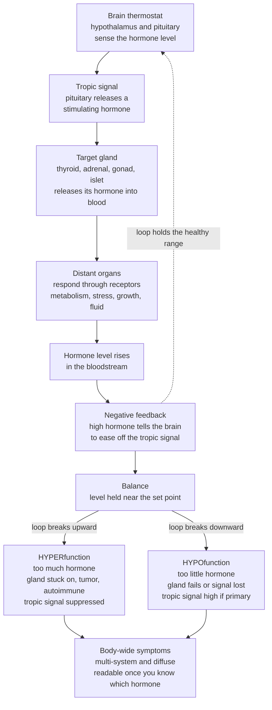

# 🧭 Endocrine Pathophysiology

> [!abstract] TL;DR
> **Endocrine pathophysiology** is the study of how the body's slow, long-range **hormonal signaling** breaks down. The endocrine system is a wireless chemical messaging network: glands broadcast **hormones** into the blood that reach distant organs and tell them what to do — grow, burn fuel, retain water, brace for stress. Each major hormone is held near a **set point** by a **hypothalamic–pituitary–target-gland axis** governed by **negative feedback**, exactly like a thermostat: the brain senses the level, drives the gland up when it is low, and eases off once it recovers. Disease appears when this loop fails, and it fails in two mirror-image ways — **hyperfunction** (too much hormone; a gland stuck "on") or **hypofunction** (too little; a gland that fails or a brain signal that never arrives). One more distinction localizes the fault: **primary** disease sits in the target gland itself, **secondary/tertiary** disease sits in the pituitary or hypothalamus that commands it — and you tell them apart by reading the **paired hormone levels** (the gland hormone *and* its tropic hormone) through the lens of feedback. Add **hormone resistance** (a working hormone the tissues ignore) and **ectopic** production (a tumor secreting hormone off-script), and you have the whole grammar. Because hormones act body-wide, these imbalances cause sprawling, multi-system symptoms that look baffling until you organize them by one simple question: *which hormone, too much or too little, and is the defect in the gland or in its brain control?* This is the **section opener** that makes every specific endocrine disease — diabetes, thyroid, adrenal, pituitary — readable.

---

## Intuition

**Analogy — the body as a house full of thermostats, and hormones as the memos that keep it comfortable.** Picture a large house whose comfort depends on a chemical **messaging network**. Certain rooms — the **glands** — don't send private notes to one neighbor; they drop **memos (hormones)** into the building's shared mail (the **bloodstream**) that reach *every* room at once. Only the rooms expecting a given memo — the ones with the matching **inbox (receptor)** — act on it, so a broadcast signal still produces targeted effects: one memo says "burn fuel faster," another says "retain water," another says "prepare for a stressful day."

Now add the **thermostat**. For each important memo there is a controller in the brain — the **hypothalamus and pituitary** — that senses the current level of a hormone in the blood. If **thyroid hormone** runs low, the thermostat sends a *stimulating* memo down to the thyroid: "make more." As the level climbs back into the comfortable range, the rising hormone itself signals the thermostat to **stop pushing**. This self-correcting arrangement — sense, correct, and back off once you've corrected — is **negative feedback**, and it is what holds every hormone gently near its **set point**.

Endocrine **disease** is what happens when this messaging breaks, and — like a broken thermostat — it breaks in two mirror-image ways. Either a gland gets stuck **"on"** and floods the house with a memo nobody can silence (**hyperfunction — too much**), or a gland **fails**, or the brain's stimulating memo never arrives, and a needed message goes silent (**hypofunction — too little**). Because these memos act house-wide, a single broken loop scatters symptoms across many rooms at once — weight, heart rate, mood, skin, bones, fluid, fertility — which is exactly why endocrine disorders are famous for being hard to spot yet, once decoded, almost elegant. **Master the feedback-loop logic — which hormone, too high or too low, gland or brain — and endocrine disease becomes readable.**

---

## How It Works

### Core mechanics — the axis, and the two ways it fails

1. **Hormones are blood-borne chemical messengers.** A gland secretes a hormone into the blood; only cells bearing its **receptor** respond. Chemistry sets the tempo: **peptide** hormones (insulin, TSH, ADH) bind surface receptors and act fast via second messengers; **steroid** hormones (cortisol, aldosterone, sex steroids) cross the membrane and change gene transcription — slower but longer-lasting; **amine** hormones (thyroid hormone, adrenaline) split the difference.
2. **Glands are organized into axes.** The **hypothalamus** senses the body's state and releases *releasing hormones* to the **pituitary** — the "master gland" — which sends **tropic hormones** (TSH, ACTH, LH/FSH, GH) to command the downstream **target glands**: thyroid, adrenal cortex, gonads, plus the pancreatic islets and parathyroids that self-regulate on their own sensed variables.
3. **Negative feedback holds the set point.** When the target-gland hormone rises in the blood, it *feeds back* to inhibit the hypothalamus and pituitary, throttling the tropic drive. The loop settles wherever the hormone equals the set point — a self-limiting cascade that keeps levels in a healthy band despite constant disturbances.
4. **Hyperfunction — too much hormone.** The gland is stuck "on": **hyperplasia**, a hormone-secreting **adenoma/tumor**, **autoimmune stimulation** (an antibody mimicking the tropic signal, as in Graves' disease), or **exogenous** hormone taken in. The excess hormone drives its target tissues too hard and, by feedback, **suppresses** the tropic hormone.
5. **Hypofunction — too little hormone.** The gland cannot deliver: **destruction** (autoimmune, surgical removal, infarction/hemorrhage), an **enzyme/biosynthetic defect**, or a **lost tropic signal** from a damaged pituitary/hypothalamus. The missing hormone silences its targets and, if the fault is in the gland, feedback releases the brake so the tropic hormone **rises**.
6. **Primary vs secondary — read the paired hormones.** *Primary* disease is in the target gland itself; *secondary* (pituitary) and *tertiary* (hypothalamic) disease is in the controller. The tell is the **combination** of the gland hormone and its tropic hormone: **primary hypofunction** = low hormone + **high** tropic (brain shouting at a deaf gland); **secondary hypofunction** = low hormone + **low** tropic (silent brain); **primary hyperfunction** = high hormone + **suppressed** tropic (gland ignoring the silenced brain). Feedback logic converts two numbers into a location.
7. **Two more failure modes.** **Hormone resistance** — the hormone and its level are fine, but a **receptor or post-receptor defect** makes tissues ignore it (the paradigm is insulin resistance in type 2 diabetes), so the body compensates with *more* hormone. **Ectopic/paraneoplastic** production — a non-endocrine tumor secretes a hormone off-script (small-cell lung cancer making ACTH or ADH), outside all normal feedback.

### The feedback loop, and the two mirror-image ways it breaks



*Read the solid arrows clockwise as the healthy axis holding its set point; the dotted arrow is the negative feedback that closes the loop. Disease snaps the loop in one of two directions — too much or too little — and because the escaping hormone acts everywhere, the output is always the same: diffuse, multi-system symptoms that only resolve into sense once you name the hormone and its direction.*

---

## Key Concepts

### Secondary (intuitive)

- **Hormone** = a chemical memo a gland drops into the blood; only rooms with the matching inbox (receptor) act on it.
- **Gland** = a room that sends memos — the pituitary (the boss), thyroid, adrenals, pancreas, gonads, parathyroids.
- **Negative feedback** = the thermostat rule: push the level up when it's low, ease off once it recovers — this keeps hormones in a healthy range.
- **Too much vs too little** = the two ways endocrine disease happens — a gland stuck "on" (**hyperfunction**) or a gland that fails (**hypofunction**).
- **Why symptoms are everywhere** = because hormones travel to the whole body, one broken hormone upsets many things at once — weight, heart rate, mood, energy, fluid.

### Undergraduate (formal)

- **The hypothalamic–pituitary–target-gland axis.** Hypothalamus → *releasing hormone* → anterior pituitary → *tropic hormone* (TSH, ACTH, LH/FSH, GH) → target gland → *effector hormone* (T4, cortisol, sex steroids, IGF-1). The posterior pituitary instead stores hypothalamic ADH and oxytocin. Parathyroid and pancreatic islets run **local** feedback on calcium and glucose rather than a pituitary axis.
- **Hormone classes and receptors.** Peptide/protein (surface receptor, second messenger, rapid), steroid (intracellular receptor, transcriptional, slow), amine (mixed). Specificity is the **receptor**, not the messenger — the lock, not the delivery route.
- **General mechanisms of disease.** *Hyperfunction*: hyperplasia, adenoma/carcinoma, autoimmune stimulation, exogenous intake, ectopic secretion. *Hypofunction*: autoimmune or infiltrative destruction, surgical/ischemic loss, congenital enzyme defect, or loss of the tropic signal. *Resistance*: receptor/post-receptor defect. Each maps to a signature in the paired hormones.
- **Primary vs secondary/tertiary and the diagnostic pair.** The single most useful move in endocrinology: measure the effector hormone **and** its tropic hormone together. High tropic + low effector → *primary* gland failure; low tropic + low effector → *secondary* (pituitary) failure; suppressed tropic + high effector → *primary* autonomous excess; high tropic + high effector → resistance or a tropic-secreting tumor.
- **Provocative testing.** When a single reading is ambiguous, **stimulate** the axis to expose hypofunction (ACTH stimulation for adrenal reserve; TRH for TSH) or **suppress** it to expose autonomous hyperfunction (dexamethasone suppression for Cushing's; oral glucose for acromegaly). A healthy axis obeys the push; a diseased one does not.

### Graduate (mechanistic and systems)

- **Endocrine disease as control-theory failure.** Physiology is closed-loop **integral negative feedback**; pathophysiology is that loop degrading. *Broken effector* (gland destruction opens the loop → effector floors, integral controller rails its tropic output high). *Broken sensor/controller* (pituitary loss → tropic output cannot rise → effector floors with a paradoxically *low* tropic). *Broken plant with an open input* (autonomous adenoma injects hormone downstream of control → controller drives tropic to zero yet cannot lower the effector). *Low loop gain* (resistance → the loop compensates to a new, higher operating hormone level to force the same effect). Naming the failed component **is** the diagnosis.
- **Autoimmunity as a bidirectional switch.** The same organ-specific autoimmunity can push either way depending on what the antibody does: a **blocking/destroying** response ablates the gland (Hashimoto hypothyroidism, type 1 diabetes, Addison's), while a **stimulating** antibody that mimics the tropic hormone locks the gland "on" outside feedback (Graves' via TSH-receptor antibody). Both are lymphocyte-mediated; the sign of the effect flips the phenotype.
- **Set-point resetting and allostasis.** Some endocrine pathology is not a broken component but a **relocated set point** the body now defends — the cortisol axis in chronic stress, or the adaptive suppression of the thyroid axis in **non-thyroidal illness (sick-euthyroid)**, where treating the "abnormal" number is a trap. Distinguishing a defended adaptation from true disease is a recurring graduate-level judgment.
- **Pulsatility, rhythm, and why timing is data.** Many axes secrete in **pulses** and **circadian rhythms** (cortisol peaks at waking, GH and LH pulse) so a single random draw can mislead; diagnosis exploits rhythm (midnight salivary cortisol), integration (24-hour urinary free cortisol, HbA1c as a glucose time-average), or dynamic testing rather than one static value.
- **Ectopic and paraneoplastic endocrinopathy.** Tumors of non-endocrine tissue can dedifferentiate and secrete peptide hormones — ACTH, ADH (SIADH), PTHrP, insulin-like factors — entirely outside feedback, producing hormone excess with a *suppressed* native axis and often heralding the underlying malignancy before it is otherwise found. This is where endocrine and neoplastic pathophysiology meet.

---

## Python Demo

```python
# Endocrine feedback and its failure modes.
#   (a) NEGATIVE-FEEDBACK REGULATION vs DISEASE: model one hypothalamic-pituitary-
#       gland axis. S = tropic (stimulating) hormone from the pituitary; H = the gland
#       hormone. The pituitary raises S when H is below the set point (integral negative
#       feedback); the gland makes H in proportion to its responsiveness to S. We run
#       four scenarios and watch how the SAME loop lands the gland hormone -- and, crucially,
#       what the PAIRED (S, H) values reveal about WHERE the lesion sits:
#           Normal            -> S mid,   H at set point
#           Primary hypo      -> S HIGH,  H low   (gland deaf; brain shouts)
#           Secondary hypo    -> S low,   H low   (pituitary silent)
#           Primary hyper     -> S low,   H HIGH  (autonomous gland ignores silenced brain)
#   (b) DOSE-RESPONSE / RECEPTOR SATURATION: a normal target tissue vs a RESISTANT one
#       (right-shifted curve) -- the paradigm of insulin resistance, where the hormone
#       works but tissues need far more of it for the same effect.
import numpy as np
import matplotlib.pyplot as plt

# ---------- (a) One axis, four fates ----------
n       = 140
H_set   = 100.0            # gland-hormone set point (arbitrary units, e.g. thyroid hormone)
lo, hi  = 80.0, 120.0      # healthy range

def simulate(capacity=1.0, autonomous=0.0, S_cap=60.0, ks=0.06, kg=0.30, H0=100.0, S0=20.0):
    """Coupled pituitary-gland negative feedback.
       capacity   : gland responsiveness to S  (1 healthy; low = primary gland failure)
       autonomous : hormone secreted regardless of S (a tumor 'stuck on')
       S_cap      : ceiling on tropic hormone   (low = secondary / pituitary failure)."""
    S = np.empty(n); H = np.empty(n)
    S[0], H[0] = S0, H0
    for i in range(n - 1):
        # pituitary raises S when H sits below the set point -> integral negative feedback
        S[i + 1] = np.clip(S[i] + ks * (H_set - H[i]), 0.0, S_cap)
        # gland output tracks (responsiveness * tropic drive) plus any autonomous secretion
        drive    = capacity * S[i] * 5.0 + autonomous
        H[i + 1] = np.clip(H[i] + kg * (drive - H[i]), 0.0, 400.0)
    return S, H

scenarios = {
    "Normal":            dict(capacity=1.00, autonomous=0.0,   S_cap=60.0),
    "Primary hypo":      dict(capacity=0.18, autonomous=0.0,   S_cap=60.0),  # deaf gland
    "Secondary hypo":    dict(capacity=1.00, autonomous=0.0,   S_cap=8.0),   # silent pituitary
    "Primary hyper":     dict(capacity=1.00, autonomous=175.0, S_cap=60.0),  # autonomous tumor
}
colors = {"Normal": "#27AE60", "Primary hypo": "#C0392B",
          "Secondary hypo": "#E67E22", "Primary hyper": "#8E44AD"}

results = {name: simulate(**p) for name, p in scenarios.items()}

# ---------- (b) Dose-response: normal vs resistant tissue ----------
conc = np.logspace(-1, 2.7, 250)                       # hormone concentration (log scale)
def hill(c, EC50, n_h=1.4, Emax=1.0):
    return Emax * c**n_h / (EC50**n_h + c**n_h)
normal_resp    = hill(conc, EC50=3.0)
resistant_resp = hill(conc, EC50=30.0)                 # 10x right shift: same hormone, blunt tissue

fig, (ax1, ax2) = plt.subplots(1, 2, figsize=(14, 5.6))

# --- panel (a): the four fates of the gland hormone ---
t = np.arange(n)
ax1.axhspan(lo, hi, color="#2ecc71", alpha=0.12, label="Healthy range (80-120)")
ax1.axhline(H_set, color="grey", ls="--", lw=1, label="Set point (100)")
for name, (S, H) in results.items():
    ax1.plot(t, H, color=colors[name], lw=2.0, label=name)
ax1.set_xlabel("Time")
ax1.set_ylabel("Gland hormone  H")
ax1.set_title("(a) One feedback loop, four fates")
ax1.set_ylim(0, 220)
ax1.legend(loc="upper right", fontsize=8)
ax1.grid(alpha=0.3)

# --- panel (b): receptor saturation and resistance ---
ax2.semilogx(conc, normal_resp,    color="#2980B9", lw=2.2, label="Normal tissue")
ax2.semilogx(conc, resistant_resp, color="#C0392B", lw=2.2, ls="--", label="Resistant tissue")
ax2.axhline(0.5, color="grey", ls=":", lw=1)
ax2.scatter([3.0, 30.0], [0.5, 0.5], color=["#2980B9", "#C0392B"], zorder=5)
ax2.annotate("10x more hormone\nfor the same effect",
             xy=(30, 0.5), xytext=(3.5, 0.20), fontsize=8,
             arrowprops=dict(arrowstyle="->", color="black"))
ax2.set_xlabel("Hormone concentration  (log scale)")
ax2.set_ylabel("Fraction of maximal effect")
ax2.set_title("(b) Receptor saturation and hormone resistance")
ax2.set_ylim(0, 1.05)
ax2.legend(loc="lower right", fontsize=8)
ax2.grid(alpha=0.3, which="both")

plt.tight_layout()
plt.show()

# ---------- the diagnostic payoff: read the PAIR, localize the lesion ----------
print(f"{'Scenario':<16}{'tropic S':>10}{'gland H':>10}   interpretation")
print("-" * 66)
for name, (S, H) in results.items():
    s_end, h_end = S[-1], H[-1]
    s_lab = "HIGH" if s_end > 45 else ("low" if s_end < 15 else "mid")
    h_lab = "HIGH" if h_end > hi else ("low" if h_end < lo else "normal")
    print(f"{name:<16}{s_end:>10.1f}{h_end:>10.1f}   S {s_lab:<5} + H {h_lab}")
```

**What you see.** *Panel (a)* is the entire diagnostic logic in one frame: the **same feedback loop** produces four completely different fates. The green *Normal* curve is pulled to its set point and held in the healthy band — that steadiness is health. *Primary hypo* (red) floors because the gland is deaf to stimulation; behind the scenes the pituitary rails its tropic hormone **high** trying to compensate. *Secondary hypo* (orange) also floors, but for the opposite reason — the pituitary is silent, so its tropic hormone is **low**. *Primary hyper* (purple) overshoots on autonomous secretion while the pituitary shuts its tropic output down to **zero**, yet the gland ignores it. The console table makes the payoff explicit: the *effector alone* cannot tell primary from secondary hypofunction — both are low — but the **paired (S, H)** reading localizes the lesion instantly. *Panel (b)* shows the fifth mechanism, **resistance**: the receptor dose-response curve is simply shifted right, so a normal hormone level lands on the flat, under-responsive part of the curve and the body must run ten times the concentration to get the same job done — the mechanical picture of insulin resistance and of why "normal hormone, abnormal effect" is still endocrine disease.

---

## Real-World Applications

- **The paired-hormone panel.** Ordering an effector hormone with its tropic partner — free T4 **with** TSH, cortisol **with** ACTH, testosterone **with** LH/FSH — is the routine first move that converts two numbers into "gland or brain, too much or too little." It is applied feedback logic on every lab slip.
- **Dynamic stimulation and suppression tests.** The short **ACTH (Synacthen) stimulation** test unmasks adrenal insufficiency; the **dexamethasone suppression** test and **oral glucose tolerance** test expose autonomous cortisol and GH excess (Cushing's, acromegaly). Each provokes the axis to reveal whether it still obeys feedback.
- **Time-averaged and rhythm-aware measurement.** **HbA1c** reads months of average glucose past the noise of any single draw; **midnight salivary cortisol** and **24-hour urinary free cortisol** exploit the circadian rhythm and pulsatility that a random level would hide.
- **Replacement and blockade therapy.** Hypofunction is treated by **replacing** the missing hormone to restore the set point (levothyroxine, hydrocortisone, insulin); hyperfunction by **removing or blocking** the source (thyroidectomy, antithyroid drugs, adenoma resection, receptor antagonists) — mechanism-matched to the direction of the fault.
- **Localizing imaging after the biochemistry.** Once the hormone pattern says *where* the loop is broken, **pituitary MRI**, **thyroid ultrasound**, **adrenal CT**, or functional/nuclear scans find the anatomical culprit — biochemistry first, imaging second, because imaging alone finds incidental lumps that may be silent.
- **Reading paraneoplastic syndromes.** Unexplained hormone excess with a suppressed native axis — SIADH, ectopic ACTH, PTHrP-driven hypercalcemia — can be the **first clue to an occult cancer**, tying endocrine screening into oncology.

---

## Common Pitfalls

- **Measuring the effector without its tropic partner.** A "low-normal" thyroid hormone or cortisol is uninterpretable alone. Only the **pair** distinguishes primary from secondary disease; ordering one and not the other throws away the localization the feedback loop hands you for free.
- **Trusting a single random level for a pulsatile hormone.** GH, LH, testosterone, and cortisol swing across the day; one snapshot can look "abnormal" in a healthy person or "normal" in a sick one. Use rhythm-aware, integrated, or provocative testing instead.
- **Treating the number in non-thyroidal illness.** In acute illness the thyroid axis is *adaptively* down-shifted (sick-euthyroid). Chasing those numbers with hormone replacement treats a defended set point as if it were disease — a classic harm.
- **Forgetting exogenous and iatrogenic causes.** The commonest cause of Cushingoid excess is **prescribed steroids**, and abruptly stopping them can precipitate an adrenal crisis because chronic exogenous hormone has *suppressed* the native axis into atrophy. Always ask what the patient is already taking.
- **Assuming "hormone level normal" rules out endocrine disease.** In **resistance**, the hormone and its level can be normal or high while the tissue effect is deficient. The disease lives in the receptor, not the assay.
- **Anchoring on one gland when the axis is multi-gland.** Pituitary lesions cause *combined* deficits, and autoimmune endocrinopathies cluster (autoimmune polyglandular syndromes). One abnormal axis should prompt a look at the neighbors.
- **Reading this as clinical advice.** This note teaches *mechanisms* of endocrine disease at textbook level. It is not guidance for any individual's diagnosis or treatment, which always depends on a clinician and the specifics of a real patient.

---

## Related Concepts

**Within this vault (Section 03 — Metabolic, Endocrine and Renal).** This opener installs the framework — *hyperfunction vs hypofunction*, *primary vs secondary*, *resistance*, and the *feedback logic of paired hormones* — that the rest of the section applies to specific organs. *Diabetes Mellitus and Glucose Regulation* is the paradigm case, blending pancreatic **hypofunction** (type 1 β-cell loss) with **resistance** (type 2). *Thyroid, Adrenal and Pituitary Disorders* walks each hypothalamic–pituitary axis through its hyper/hypo and primary/secondary variants — Graves' and Hashimoto's, Cushing's and Addison's, pituitary adenomas and hypopituitarism. *Renal Pathophysiology and Kidney Disease* connects here because the kidney is both an endocrine organ (renin, erythropoietin, vitamin-D activation) and the target of hormones governing fluid, sodium, and calcium. *Nutritional and Metabolic Disorders* completes the metabolic picture of energy balance and micronutrient-dependent endocrine function. All four are prose references to sibling notes in this section. The section builds on the vault hub, [[Clinical_Medicine/01_Foundations_of_Disease_and_Pathophysiology/Clinical_Medicine_and_Pathophysiology_Overview|Clinical Medicine and Pathophysiology Overview]], and on two Section-01 foundations it specializes: [[Clinical_Medicine/01_Foundations_of_Disease_and_Pathophysiology/Cellular_Injury_and_Adaptation|Cellular Injury and Adaptation]] (how autoimmune, ischemic, and surgical **destruction** disables a gland) and [[Clinical_Medicine/01_Foundations_of_Disease_and_Pathophysiology/Neoplasia_and_Cancer_Biology|Neoplasia and Cancer Biology]] (the adenomas and ectopic secretors behind much hyperfunction).

**Across the vault (Glob-verified links).**

- [[Biology/09_Human_Physiology_and_Anatomy/The_Endocrine_System_and_Hormones|The Endocrine System and Hormones]] — the healthy physiology this note breaks: glands, hormone classes, receptors, and the hypothalamus–pituitary axis.
- [[Biology/09_Human_Physiology_and_Anatomy/Homeostasis_and_the_Nervous_System|Homeostasis and the Nervous System]] — negative feedback and set-point control, the substrate whose failure defines endocrine disease.
- [[Health_Nutrition_and_Longevity/04_Sleep_Stress_and_Mental_Wellbeing/Stress_and_the_Stress_Response|Stress and the Stress Response]] — the HPA (cortisol) axis in action, and the allostatic set-point shifts that blur the line between adaptation and disease.
- [[Health_Nutrition_and_Longevity/01_Foundations_of_Health/Metabolism_and_Energy_Balance|Metabolism and Energy Balance]] — the metabolic processes that insulin, thyroid hormone, and cortisol govern, and that endocrine disease derails.
- [[Systems_Thinking_and_Complexity/01_Foundations_of_Systems_Thinking/Feedback_Loops_and_Causality|Feedback Loops and Causality]] — the general control-theory language of set points, negative feedback, gain, and loop failure applied here to hormones.
- [[Genetics/05_Human_and_Medical_Genetics/Mendelian_Genetic_Disorders|Mendelian Genetic Disorders]] — single-gene enzyme and receptor defects that cause congenital endocrinopathy (e.g., congenital adrenal hyperplasia, receptor-defect resistance syndromes).

---

## Review Questions

**Secondary.** Using the thermostat analogy, explain the difference between an endocrine gland being "stuck on" and a gland that has "failed." Why does a single broken hormone tend to cause symptoms all over the body rather than in just one place?

**Undergraduate.** A patient has a **low** blood level of a gland hormone. Explain why measuring that hormone *alone* cannot tell you whether the problem is in the gland or in the pituitary, and describe exactly what the *tropic* (stimulating) hormone would show in **primary** versus **secondary** hypofunction. Then explain how a **stimulation** test and a **suppression** test each interrogate the loop, and which you would use to investigate suspected hormone *excess*.

**Graduate.** Frame endocrine disease as a **control-system failure**. For each of (i) autonomous adenoma, (ii) primary gland destruction, (iii) pituitary failure, and (iv) hormone resistance, identify which loop element is broken (sensor, controller, effector/plant, or loop gain) and predict the resulting steady-state pattern of the effector hormone *and* its tropic hormone. Why can a "relocated set point" (as in non-thyroidal illness syndrome) mimic disease, and how should that change what successful treatment aims at — a normal number, or a repaired loop?

---

## Sources

- Hall, J. E., & Hall, M. E. *Guyton and Hall Textbook of Medical Physiology* (14th ed.). Elsevier — endocrine physiology, hormone classes, and the hypothalamic–pituitary axes with their feedback control.
- Loscalzo, J., Fauci, A., Kasper, D., et al. (eds.). *Harrison's Principles of Internal Medicine* (21st ed.). McGraw-Hill — clinical endocrinology, the primary/secondary framework, and dynamic testing.
- Melmed, S., et al. (eds.). *Williams Textbook of Endocrinology* (14th ed.). Elsevier — the definitive reference on mechanisms of endocrine hyper- and hypofunction.
- Molina, P. E. *Endocrine Physiology* (5th ed.). McGraw-Hill / Lange — concise axis-by-axis treatment of feedback regulation and its disorders.
- Kumar, V., Abbas, A. K., & Aster, J. C. *Robbins & Cotran Pathologic Basis of Disease* (10th ed.). Elsevier — the pathology of the endocrine glands: hyperplasia, adenoma, autoimmune destruction, and ectopic secretion.

---

#clinical-medicine #endocrine #hormones #feedback #pathophysiology
