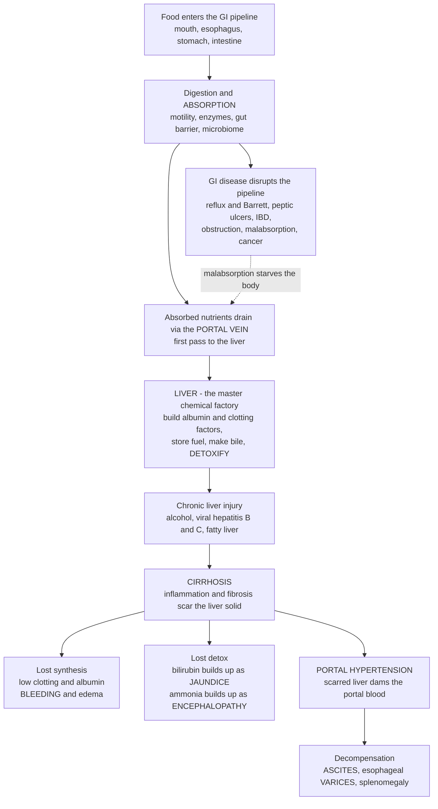

# 🫁 Liver and Gastrointestinal Disease

> [!abstract] TL;DR
> The digestive tract is the body's **food-processing pipeline** and the **liver** is its master **chemical factory and detox plant**. The gut is a long muscular tube that breaks food down, **absorbs** nutrients across its lining, and defends a barrier against a vast microbial population — and disease anywhere along it disrupts one of those jobs: acid refluxing up the esophagus (**GERD**, and its precancerous change **Barrett**), the mucosa eaten through by acid (**peptic ulcer**, mostly from *H. pylori* and NSAIDs), the wall inflamed by a misdirected immune attack (**inflammatory bowel disease**), a lining that can no longer absorb (**celiac disease, malabsorption**), or the stepwise accumulation of mutations that turns a benign polyp into **colorectal cancer**. But the liver is where the drama concentrates, because it does *so many* essential jobs at once: it processes everything absorbed from the gut through the **portal vein**, builds critical proteins (**albumin** and the **clotting factors**), stores fuel as glycogen, makes **bile** to digest fats, and **detoxifies** drugs and metabolic waste like **ammonia** and **bilirubin**. When chronic injury — decades of **alcohol**, **viral hepatitis** (B and C), or **fatty liver** (NAFLD/NASH) — scars it into **cirrhosis**, every one of those jobs fails at once, producing a logical, tell-tale constellation: it stops making clotting proteins so patients **bleed** (coagulopathy); bile pigment backs up and turns skin and eyes **yellow** (**jaundice**); toxins it normally clears build up and poison the brain (**hepatic encephalopathy**); and the scarred organ **dams** the blood trying to flow through it (**portal hypertension**), so fluid weeps into the belly (**ascites**) and veins swell into fragile, life-threatening **varices**. Understand the two roles — *the gut absorbs, the liver processes* — and the diseases of digestion and the liver's spectacular failures all make sense.

---

## Intuition

**Analogy — the gut is a food-processing pipeline and the liver is the factory it feeds.** Picture an industrial plant. Raw material arrives on a long **conveyor belt** (the gastrointestinal tract): it is crushed, mixed with reagents, and its useful components are picked off the belt at dedicated stations and carried inward. If the belt jams, leaks, gets a hole burned in it, or the pick-off stations stop working, the plant is starved of raw material — this is the whole family of **GI disease**. Acid splashing backward corrodes the start of the belt (**reflux**); a corrosive patch burns clean through it (an **ulcer**); a section seizes up or narrows so nothing moves past (**obstruction**); the pick-off stations lose their grip so material rolls past uncollected (**malabsorption**); or, worst of all, a station's machinery mutates and starts building a tumour (**cancer**).

Everything the belt successfully collects is piped straight to the **central factory** — the liver — which is the real powerhouse of the plant. This one building does an absurd number of jobs. It is the **fabrication shop** (it manufactures the plant's most important products — the structural protein **albumin** that holds fluid in the pipes, and the entire kit of **clotting factors** that seal any leak). It is the **warehouse** (it stores fuel and releases it on demand). It is the **reagent works** (it makes **bile**, the detergent that lets fats be digested). And it is the **hazardous-waste treatment unit** (it neutralizes toxins, spent drugs, the pigment **bilirubin** from worn-out red cells, and the nerve poison **ammonia** from protein breakdown).

Now here is the key intuition: because the factory quietly does so many different jobs, its failure is not one symptom but a whole **syndrome**, and each sign points back at a specific abandoned job. The liver has *enormous reserve* — you can lose most of it and feel fine — so the failure is **silent for years, then catastrophic all at once**. When decades of alcohol, a smouldering **viral hepatitis**, or **fatty liver** finally scar it solid (**cirrhosis**), the fabrication shop shuts and the plant springs leaks nobody can seal (**bleeding**); the waste-treatment unit shuts and the toxins it used to clear pigment the whole plant **yellow** (**jaundice**) and fog the control room (**hepatic encephalopathy**); and — uniquely — the scarred building physically **blocks the main supply pipe** running through it, so pressure backs up the line (**portal hypertension**), fluid weeps out into the yard (**ascites**), and upstream pipes balloon into fragile, high-pressure **varices** that can rupture and flood the floor. *The gut collects; the liver processes.* Hold those two roles in mind and every disease below falls into place.

---

## How It Works

### The gut's four jobs — and how disease breaks each one

The gastrointestinal tract is a ~9-metre tube with a repeating four-layer wall (mucosa, submucosa, muscle, serosa) and four core jobs. Disease is best organized by **which job fails**:

1. **Motility** — coordinated smooth-muscle waves (peristalsis) move contents at the right pace. Too fast is diarrhea; too slow or blocked is **obstruction** or ileus; a leaky valve at the top lets stomach acid wash up into the esophagus (**GERD**), whose chronic irritation can drive the lining to change type (**Barrett esophagus**, a precancerous metaplasia).
2. **Digestion** — the stomach's acid and the pancreas's and small intestine's enzymes chemically dismantle food. The stomach protects itself from its own acid with a mucus-bicarbonate layer; break that defence and acid digests the wall itself — a **peptic ulcer**. The two dominant causes are the bacterium ***Helicobacter pylori*** (which colonizes the stomach and inflames it) and **NSAIDs** (which strip the protective prostaglandins).
3. **Absorption** — the small intestine's enormous villous surface picks nutrients off the lumen. Destroy that surface and nutrients pass through uncollected: **malabsorption**. The archetype is **celiac disease**, where an immune reaction to dietary gluten flattens the villi.
4. **Barrier and immunity** — a single cell layer separates a hostile lumen (trillions of microbes) from the body. A **dysregulated immune response** to that microbiome drives **inflammatory bowel disease (IBD)** — *Crohn disease* (patchy, full-thickness inflammation anywhere from mouth to anus) and *ulcerative colitis* (continuous, mucosal inflammation of the colon). **Irritable bowel syndrome (IBS)** is a functional disorder of the gut-brain axis with symptoms but no structural damage — a different category entirely.

Layered on top are **GI cancers**, above all **colorectal cancer**, which follows the classic **adenoma-carcinoma sequence**: a benign polyp accumulates mutations (APC, then KRAS, then TP53) stepwise over years into invasive cancer — the reason screening colonoscopy, which removes polyps before they transform, saves lives. **GI bleeding** is a common emergency, split into **upper** (ulcers, varices) and **lower** (diverticula, cancer, IBD) by whether the source is above or below a landmark in the small bowel. And the **pancreas**, though technically a gland, belongs to this pipeline: in **pancreatitis** its powerful digestive enzymes activate *inside* the gland and it begins to digest itself (autodigestion).

### The liver's many jobs — the master factory

Everything absorbed by the gut (except most fat) drains first into the **portal vein** and is delivered to the liver *before* it reaches the rest of the body — the **first-pass** principle. The liver then performs, in parallel:

- **Metabolism and fuel storage** — buffers blood glucose (stores glycogen after meals, releases it or makes new glucose when fasting), handles fat and protein metabolism.
- **Synthesis** — manufactures **albumin** (which holds oncotic pressure and keeps fluid inside vessels) and nearly all the **clotting factors** (which is why liver failure causes bleeding).
- **Bile production** — makes bile, whose bile salts **emulsify dietary fat** so it can be absorbed, and which is also the disposal route for cholesterol and bilirubin.
- **Detoxification** — chemically modifies drugs, hormones, and toxins for excretion; conjugates **bilirubin** (the breakdown pigment of old red cells) for disposal in bile; and clears **ammonia** (a neurotoxin from protein/amino-acid breakdown) by converting it to urea.

Because these jobs are distributed across the whole organ, the liver has a huge **functional reserve** — which is exactly why its diseases hide until very late.

### Liver injury → cirrhosis → the syndromes of failure

Chronic liver injury has a small number of dominant causes: **viral hepatitis** (hepatitis A is acute and self-limited; **B and C** can become chronic and drive cirrhosis and cancer), **alcohol**, **fatty liver** (**NAFLD/NASH** — the fast-rising disease of the metabolic syndrome, driven by obesity and insulin resistance), and **drug/toxin** or **autoimmune** hepatitis. Whatever the trigger, **repeated hepatocyte injury plus inflammation activates hepatic stellate cells to lay down scar collagen** — fibrosis. Enough fibrosis, sustained over years, distorts the whole architecture into nodules of regenerating liver strangled by bands of scar: **cirrhosis**, the common end-stage.

Cirrhosis is where the analogy pays off, because its clinical picture is simply **every liver job failing at once**, plus one mechanical consequence unique to this organ:

- **Lost synthesis → coagulopathy and edema.** No clotting factors made → the patient **bleeds** and the **INR** rises. No albumin made → oncotic pressure falls → **edema** and, with portal hypertension, **ascites**.
- **Lost detox → jaundice and encephalopathy.** Bilirubin is no longer cleared → it accumulates and stains skin and sclerae **yellow** (**jaundice**). Ammonia is no longer converted to urea → it rises and poisons the brain (**hepatic encephalopathy** — confusion, asterixis, coma).
- **Portal hypertension — the mechanical failure.** This is the twist unique to the liver. The scarred, nodular organ physically **obstructs the portal blood trying to flow through it**, so pressure backs up in the entire portal system. That high pressure has three infamous consequences: fluid is forced out of the congested vessels into the peritoneal cavity (**ascites**); blood reroutes through collateral veins that balloon into thin-walled **esophageal varices** (which can rupture and cause massive, often fatal upper-GI bleeding); and the spleen engorges (**splenomegaly**). Advanced disease adds **hepatorenal** and **hepatopulmonary** syndromes (the failing liver drags down the kidneys and lungs), and cirrhotic livers are the soil for **hepatocellular carcinoma (HCC)** — for which the definitive treatment is **liver transplant**.

**Jaundice** deserves its own logic, because it localizes the problem: **pre-hepatic** (too much bilirubin made, e.g., massive red-cell breakdown/hemolysis), **intra-hepatic** (the liver cells themselves fail to process it, e.g., hepatitis, cirrhosis), or **post-hepatic/obstructive** (the drainage pipe is blocked — a **gallstone** in the bile duct or a pancreatic-head tumour). **Liver function tests** read out these processes: **AST/ALT** rise with hepatocyte injury (hepatitis), **ALP/bilirubin** rise with bile-duct obstruction (cholestasis), and **albumin/INR** report true *synthetic* function. The **gallbladder** itself, which merely stores and concentrates bile, is a common trouble spot: **gallstones** can block flow and cause pain, or inflame the gallbladder (**cholecystitis**).

### The pipeline and the factory, from food to failure



*Read the left branch as the gut pipeline and its disorders; the right branch as the liver factory and the cascade of failures once it is scarred. Notice that the three headline syndromes of cirrhosis map exactly onto three abandoned jobs — synthesis, detox, and the mechanical job of letting blood through.*

---

## Key Concepts

### Secondary (intuitive)

- **The gut is a food pipeline; the liver is the factory it feeds.** The gut breaks food down and **absorbs** it; the liver **processes** everything absorbed.
- **GI disease = a break somewhere in the pipeline:** acid burning the lining (**ulcer**), acid splashing up (**reflux**), the immune system attacking the wall (**IBD**), the lining failing to absorb (**malabsorption**), a blockage, or **cancer**.
- **The liver does many jobs:** builds blood proteins, stores fuel, makes **bile** to digest fat, and **cleans out toxins**.
- **Cirrhosis = the liver scarred solid** after decades of alcohol, viral hepatitis, or fatty liver.
- **Liver failure shows up in tell-tale ways because each job stops:** patients **bleed** (no clotting proteins), turn **yellow** (bilirubin builds up = **jaundice**), get **confused** (ammonia poisons the brain), and fill their belly with **fluid** because blood cannot get through the scarred liver.

### Undergraduate (formal)

- **The four gut functions** — motility, digestion, **absorption**, and barrier/immunity — organize GI disease by *which function fails*: GERD/obstruction (motility), peptic ulcer/gastritis (digestion vs mucosal defence), celiac/malabsorption (absorption), IBD (barrier and immune tolerance to the microbiome).
- **Peptic ulcer disease** is a breach of the mucosal defence by ***H. pylori*** or **NSAIDs**; **IBD** (Crohn vs ulcerative colitis) is immune-mediated chronic inflammation; **colorectal cancer** follows the **adenoma-carcinoma sequence** (APC → KRAS → TP53), the rationale for screening.
- **First-pass and portal circulation:** gut venous blood drains to the liver *before* the systemic circulation, so the liver both metabolizes absorbed substances first and is the organ whose obstruction (cirrhosis) backs pressure up into the gut.
- **Hepatic functions map to clinical labs:** hepatocyte injury raises **AST/ALT**; cholestasis raises **ALP and bilirubin**; true **synthetic function** is read by **albumin** and **INR/PT** (not by the transaminases).
- **Cirrhosis** is the common end-stage of chronic injury (viral hepatitis B/C, alcohol, NAFLD/NASH), defined by diffuse **fibrosis + regenerative nodules**; its complications are **decompensation** (jaundice, coagulopathy, ascites, encephalopathy, variceal bleeding).
- **Jaundice localizes by mechanism:** pre-hepatic (hemolysis, unconjugated bilirubin), intra-hepatic (hepatocellular, mixed), post-hepatic (obstructive, conjugated — stones or tumour). Unconjugated vs conjugated bilirubin distinguishes them.
- **Portal hypertension** is the mechanistic hub of decompensation: elevated portal pressure → **ascites, varices, splenomegaly**, via increased resistance (fibrosis) *and* increased inflow (splanchnic vasodilation).

### Graduate (mechanistic and systems)

- **Fibrogenesis as a wound-healing program gone chronic.** Persistent injury activates **hepatic stellate cells**, which transdifferentiate into collagen-secreting myofibroblasts under **TGF-β**; the balance of matrix deposition vs degradation (MMPs/TIMPs) sets whether fibrosis progresses or, if the injury is removed, **regresses** — the biological basis for why treating hepatitis C or stopping alcohol can partially reverse early fibrosis (linking to the general biology of inflammation and tissue repair).
- **Portal hypertension is not purely mechanical.** Sinusoidal resistance rises from architectural distortion *and* from a dynamic component — reduced intrahepatic nitric oxide and stellate-cell contraction — while systemic/splanchnic **vasodilation** (NO-driven) paradoxically *increases* portal inflow. The result is a hyperdynamic circulation with effective arterial underfilling, activating **RAAS and ADH**, which drives sodium/water retention and, ultimately, **hepatorenal syndrome** — a functional renal failure of a structurally normal kidney.
- **Hepatic encephalopathy** is more than ammonia: gut-derived ammonia bypasses the detoxifying liver via portosystemic shunts, crosses into astrocytes, is fixed as **glutamine**, and causes osmotic astrocyte swelling and low-grade cerebral edema; systemic inflammation and manganese deposition modulate it — the rationale for therapies (**lactulose**, **rifaximin**) that target the **gut** (reducing ammonia production/absorption) to treat a **brain** syndrome.
- **NAFLD/NASH as a metabolic, not toxic, hepatitis.** Insulin resistance and lipotoxicity ("multiple-hit" model) drive hepatic steatosis → steatohepatitis → fibrosis, making the liver a *target organ of the metabolic syndrome* and now the fastest-growing indication for transplant and a major HCC source even without cirrhosis.
- **Hepatocellular carcinoma from chronic inflammation.** Sustained injury-regeneration cycles, viral integration (HBV) and genomic instability turn cirrhosis into a premalignant field; surveillance and the logic of transplant (curing cancer *and* the diseased organ) follow directly.
- **Acute liver failure vs chronic decompensation.** Massive acute necrosis (e.g., paracetamol/acetaminophen toxicity — the classic dose-dependent, glutathione-depleting hepatotoxin) produces encephalopathy and coagulopathy in a *previously normal* liver over days, a distinct emergency from the slow decompensation of cirrhosis — the same functional failures on very different timescales.

---

## Python Demo

```python
# Liver and GI disease in two pictures:
#   (a) LIVER FUNCTIONAL RESERVE -> why cirrhosis is SILENT for years then a
#       CASCADE all at once. As functional hepatocyte mass is lost, SYNTHETIC
#       jobs (albumin, clotting) fade slowly at first thanks to huge reserve,
#       while substances the liver CLEARS (bilirubin -> jaundice, ammonia ->
#       encephalopathy) rise ~ 1/remaining-clearance and blow up only late.
#       -> the constellation of cirrhosis appears together, after ~60-80% loss.
#   (b) TWO FATES OF VIRAL HEPATITIS -> the SAME infection either resolves /
#       is treated (fibrosis stays low and regresses) or smoulders as chronic
#       active hepatitis, driving fibrosis stage 0 -> 4 (CIRRHOSIS) over decades.
import numpy as np
import matplotlib.pyplot as plt

def hill(x, xh, n):
    return x**n / (x**n + xh**n)

# ---------- (a) Liver functional reserve ----------
loss = np.linspace(0, 95, 400)              # percent of functional hepatocyte mass LOST
f    = 1.0 - loss / 100.0                    # remaining functional fraction (1 -> ~0.05)

# Synthetic functions fall, but the liver's huge reserve delays it (sigmoid).
# Clotting factors have SHORTER half-lives -> they fail slightly EARLIER than albumin.
albumin_pct  = 100.0 * hill(f, 0.30, 3.0)    # albumin, percent of normal
clotting_pct = 100.0 * hill(f, 0.38, 3.0)    # clotting activity, percent of normal

# Substances the liver clears rise ~ 1/clearance (clearance ~ functional mass).
clearance = np.maximum(f, 0.05)
bili_fold = 1.0 / clearance                   # bilirubin, fold above normal
amm_fold  = (1.0 / clearance) ** 1.3          # ammonia, steeper (portosystemic shunting adds)

jaundice_fold = 2.5 / 0.6                      # visible jaundice ~2.5 mg/dL vs ~0.6 normal
enceph_fold   = 100.0 / 30.0                   # encephalopathy-risk ammonia vs ~30 normal
loss_jaundice = np.interp(jaundice_fold, bili_fold, loss)
loss_enceph   = np.interp(enceph_fold,   amm_fold,  loss)

# ---------- (b) Two fates of viral hepatitis ----------
yr = np.linspace(0, 35, 400)                   # years since infection
fib_chronic = 4.0 * (1.0 - np.exp(-yr / 12.0))              # -> cirrhosis (stage 4) over decades
fib_cured   = 1.2 * (1.0 - np.exp(-yr / 3.0)) * np.exp(-yr / 10.0)  # cleared/treated -> regresses
cirr_year   = np.interp(3.5, fib_chronic, yr)              # when chronic nears stage 4

fig, (ax1, ax2) = plt.subplots(1, 2, figsize=(14, 5.6))

# --- panel (a): synthetic loss (left axis) vs toxin accumulation (right axis) ---
ax1.plot(loss, albumin_pct,  color="#27AE60", lw=2.3, label="Albumin (synthesis)")
ax1.plot(loss, clotting_pct, color="#16A085", lw=2.0, ls="--", label="Clotting activity")
ax1.set_xlabel("Functional liver mass LOST  (%)")
ax1.set_ylabel("Synthetic function (% of normal)", color="#1E8449")
ax1.set_ylim(0, 110); ax1.set_xlim(0, 95)
ax1.tick_params(axis="y", labelcolor="#1E8449")

axr = ax1.twinx()
axr.plot(loss, bili_fold, color="#E1B12C", lw=2.4, label="Bilirubin -> jaundice")
axr.plot(loss, amm_fold,  color="#8E44AD", lw=2.2, ls="--", label="Ammonia -> encephalopathy")
axr.set_ylabel("Accumulating toxins (fold above normal)", color="#6C3483")
axr.set_ylim(0, 20)
axr.tick_params(axis="y", labelcolor="#6C3483")

ax1.axvspan(loss_jaundice, 95, color="#F1C40F", alpha=0.10)
ax1.axvline(loss_jaundice, color="#E1B12C", lw=0.9)
ax1.axvline(loss_enceph,   color="#8E44AD", lw=0.9, ls=":")
ax1.text(loss_jaundice + 1, 22, "jaundice\nappears", fontsize=8, color="#B9770E")
ax1.text(loss_enceph + 1, 6, "encephalopathy\nrisk", fontsize=8, color="#6C3483")
ax1.set_title("(a) Liver reserve: silent for years, then a failure cascade")
h1, l1 = ax1.get_legend_handles_labels()
h2, l2 = axr.get_legend_handles_labels()
ax1.legend(h1 + h2, l1 + l2, loc="center left", fontsize=7.5)
ax1.grid(alpha=0.25)

# --- panel (b): two fates of hepatitis ---
ax2.plot(yr, fib_chronic, color="#C0392B", lw=2.4, label="Chronic active hepatitis")
ax2.plot(yr, fib_cured,   color="#2980B9", lw=2.4, label="Virus cleared / treated")
ax2.axhline(4, color="#7F8C8D", ls=":", lw=1.2)
ax2.text(0.6, 4.05, "stage 4 = CIRRHOSIS", fontsize=8, color="#566573")
ax2.axvline(cirr_year, color="#C0392B", ls="--", lw=1.1)
ax2.annotate(f"cirrhosis ~{cirr_year:.0f} yr",
             xy=(cirr_year, 3.5), xytext=(cirr_year - 13, 2.3), fontsize=9,
             arrowprops=dict(arrowstyle="->", color="#C0392B"))
ax2.set_xlabel("Years since infection")
ax2.set_ylabel("Liver fibrosis stage (0 = none, 4 = cirrhosis)")
ax2.set_title("(b) Two fates of viral hepatitis")
ax2.set_ylim(0, 4.4); ax2.set_xlim(0, 35)
ax2.legend(loc="center right", fontsize=8); ax2.grid(alpha=0.25)

plt.tight_layout(); plt.show()

print(f"Jaundice becomes visible after ~{loss_jaundice:.0f}% of functional liver mass is lost.")
print(f"Encephalopathy risk emerges after ~{loss_enceph:.0f}% loss (ammonia clearance fails).")
print(f"Untreated chronic hepatitis reaches cirrhosis in ~{cirr_year:.0f} years; "
      f"clearing/treating the virus averts it.")
```

**What you see.** *Panel (a)* is the quantitative meaning of "silent, then catastrophic." Because the liver has **enormous reserve**, the green and teal **synthetic curves stay near normal** while the first chunk of liver mass is lost — a patient with substantial hepatitis or early cirrhosis feels and tests almost fine. But the same reserve makes the collapse abrupt: the **yellow bilirubin and purple ammonia curves rise as roughly one-over-remaining-clearance**, so they stay flat and then shoot up only after most of the organ is gone — which is why **jaundice** and **encephalopathy** tend to appear *late and together*, after ~60-80% functional loss, as the whole constellation of decompensation. Note the clotting curve fails a step **earlier** than albumin (clotting factors have shorter half-lives), which is why a rising **INR** is an early warning of failing synthesis. *Panel (b)* is the fork in the road for **viral hepatitis**: the *same* infection either gets **cleared or treated** (blue — fibrosis barely rises and then regresses) or **smoulders as chronic active hepatitis** (red — fibrosis climbs stage by stage to **cirrhosis** over roughly two to three decades). It is the visual argument for why finding and treating hepatitis B and C early prevents the entire cascade in panel (a).

---

## Real-World Applications

- **Endoscopy and *H. pylori* eradication.** Upper endoscopy directly visualizes ulcers, varices, and Barrett esophagus; **testing for and eradicating *H. pylori*** (triple/quadruple antibiotic therapy) cures most peptic ulcers and cut gastric-cancer risk — a Nobel-winning reframing of ulcers from "stress and acid" to **infection**.
- **Colorectal cancer screening.** **Colonoscopy** (and stool-based tests) exploit the slow adenoma-carcinoma sequence: removing polyps before they transform prevents cancer, one of the clearest wins in cancer prevention.
- **Direct-acting antivirals for hepatitis C.** Oral **DAAs** now *cure* over 95% of hepatitis C in weeks, halting or even reversing early fibrosis — the real-world version of steering a patient from the red curve to the blue curve in panel (b). **Hepatitis B vaccination** prevents the infection (and its liver cancer) outright.
- **Liver function test interpretation.** The AST/ALT vs ALP/bilirubin vs albumin/INR pattern lets clinicians classify jaundice and liver injury as **hepatocellular, cholestatic, or synthetic-failure** at the bench — a daily application of mapping labs to the liver's distinct jobs.
- **Managing decompensated cirrhosis.** **Lactulose and rifaximin** treat encephalopathy by targeting gut ammonia; **beta-blockers and band ligation** prevent variceal bleeding; **paracentesis and diuretics** manage ascites; **TIPS** shunts decompress portal pressure; **MELD score** (built from bilirubin, INR, creatinine) prioritizes patients for **liver transplant**, the definitive cure for end-stage disease and HCC.
- **Acetaminophen (paracetamol) overdose.** The commonest cause of acute liver failure in the West, treated with **N-acetylcysteine**, which replenishes the glutathione the toxic metabolite depletes — a direct clinical use of hepatic detoxification biochemistry.

---

## Common Pitfalls

- **Assuming normal transaminases mean a healthy liver.** AST/ALT report *injury*, not *function*; a burnt-out cirrhotic liver can have near-normal transaminases while **albumin and INR** — the true synthetic markers — are deranged. Judge liver *function* by synthesis and clearance, not by the enzymes.
- **Expecting liver disease to be symptomatic early.** The organ's vast reserve (panel a) means cirrhosis is often **silent until decompensation**, so screening at-risk patients (chronic hepatitis, heavy alcohol use, metabolic syndrome) matters more than waiting for symptoms.
- **Treating "ulcers" as purely stress or acid.** Most peptic ulcers are caused by ***H. pylori*** or **NSAIDs**; missing the infection or the drug means the ulcer recurs despite acid suppression.
- **Conflating unconjugated and conjugated jaundice.** They point to opposite problems — **pre-hepatic/hemolytic or hepatocellular** (unconjugated-dominant) versus **obstructive** (conjugated, e.g., a stone or tumour blocking the bile duct). The wrong bucket sends the workup in the wrong direction.
- **Forgetting portal hypertension is the hub of decompensation.** Ascites, varices, and splenomegaly are not independent problems but shared downstream effects of the scarred liver damming portal flow; treating each in isolation misses the unifying mechanism (and the option of decompressing pressure).
- **Underestimating NAFLD/NASH.** "Just a fatty liver" is now a leading driver of cirrhosis, transplant, and liver cancer — a manifestation of the **metabolic syndrome**, not a benign incidental finding.
- **Reading this as medical advice.** This note describes disease *mechanisms* at textbook level. It is not guidance for any individual's symptoms, labs, alcohol use, or treatment, which require a clinician and the specifics of a real patient. Vomiting blood, black stools, confusion in a patient with liver disease, or worsening jaundice are emergencies.

---

## Related Concepts

**Within this section (Metabolic, Endocrine, and Renal Disease).** The liver sits at the crossroads of this section's other topics, and these prose references (siblings in the Clinical Medicine vault) are worth reading alongside it. *Nutritional and Metabolic Disorders* is the mirror image of gut failure — malabsorption, deficiency, and overnutrition — and of the fatty-liver end of the metabolic spectrum. *Diabetes Mellitus and Glucose Regulation* connects tightly through **NAFLD/NASH**, since insulin resistance is the engine of both, and through the liver's central role in glucose homeostasis. *Infectious Disease and Host-Pathogen Interaction* underlies **viral hepatitis** and ***H. pylori***, the infectious drivers of the two most consequential diseases here. *Immune Dysfunction and Autoimmunity* is the mechanism behind **inflammatory bowel disease**, **celiac disease**, and autoimmune hepatitis — misdirected immunity against gut or liver. And *Hemostasis, Thrombosis, and Bleeding Disorders* is the counterpart to the liver's synthetic role: because the liver makes the clotting factors, its failure produces the **coagulopathy** and bleeding that define decompensation.

**Across the vault (Glob-verified links).**

- [[Clinical_Medicine/01_Foundations_of_Disease_and_Pathophysiology/Clinical_Medicine_and_Pathophysiology_Overview|Clinical Medicine and Pathophysiology Overview]] — the parent hub; frames disease as failed homeostasis and lost reserve, exactly the pattern behind silent cirrhosis and its sudden decompensation.
- [[Clinical_Medicine/01_Foundations_of_Disease_and_Pathophysiology/Inflammation_and_Tissue_Repair|Inflammation and Tissue Repair]] — the wound-healing biology (fibrosis, stellate-cell activation, scar vs regeneration) that turns chronic hepatitis into cirrhosis.
- [[Clinical_Medicine/01_Foundations_of_Disease_and_Pathophysiology/Cellular_Injury_and_Adaptation|Cellular Injury and Adaptation]] — the hepatocyte injury and necrosis (e.g., in acute liver failure and hepatitis) that underlie all liver disease.
- [[Clinical_Medicine/01_Foundations_of_Disease_and_Pathophysiology/Neoplasia_and_Cancer_Biology|Neoplasia and Cancer Biology]] — the adenoma-carcinoma sequence of colorectal cancer and the cirrhosis-to-HCC field effect are worked examples of stepwise carcinogenesis.
- [[Biology/09_Human_Physiology_and_Anatomy/The_Digestive_and_Excretory_Systems|The Digestive and Excretory Systems]] — the healthy digestion, absorption, and hepatic physiology this note breaks.
- [[Biology/03_Metabolism_and_Bioenergetics/Bioenergetics_and_ATP|Bioenergetics and ATP]] — the fuel metabolism and glycogen storage the liver manages and that fail in liver disease.
- [[Biology/01_Chemistry_of_Life/Carbohydrates_and_Lipids|Carbohydrates and Lipids]] — the chemistry of the fats that bile emulsifies and that accumulate in fatty liver.
- [[Biology/11_Microbiology_and_Immunology/Viruses|Viruses]] — the hepatitis viruses (A, B, C) that inflame the liver and drive chronic disease.
- [[Biology/11_Microbiology_and_Immunology/The_Adaptive_Immune_System|The Adaptive Immune System]] — the misdirected immunity behind inflammatory bowel disease, celiac disease, and autoimmune hepatitis.
- [[Health_Nutrition_and_Longevity/02_Nutrition_Science/The_Gut_Microbiome_and_Nutrition|The Gut Microbiome and Nutrition]] — the microbial ecosystem whose disruption participates in IBD and whose ammonia production drives hepatic encephalopathy.
- [[Health_Nutrition_and_Longevity/02_Nutrition_Science/Macronutrients_Protein_Carbs_and_Fats|Macronutrients: Protein, Carbs, and Fats]] — the dietary substrates the gut absorbs and the liver processes, and the fat/sugar excess behind NAFLD.
- [[Chemistry/06_Biochemistry/Metabolism_and_Bioenergetics|Metabolism and Bioenergetics]] — the biochemical pathways (glycolysis, gluconeogenesis, the urea cycle that clears ammonia) that the liver runs and that fail in cirrhosis.

---

## Review Questions

**Secondary.** Using the "food pipeline and factory" picture, explain why a person with slowly worsening liver disease can feel completely well for years and then, over a short time, turn yellow, start bleeding easily, become confused, and develop a swollen belly all at once. What single fact about the liver explains why the failure is silent and then sudden?

**Undergraduate.** A patient has cirrhosis. Predict what happens to their **albumin**, **INR/clotting**, **bilirubin**, and **ammonia**, and connect each change to the specific liver *job* that has failed. Separately, explain how **portal hypertension** produces **ascites**, **esophageal varices**, and **splenomegaly** — and why varices are the most feared of the three.

**Graduate.** Two patients acquire hepatitis C. One is cured with direct-acting antivirals within a year; the other goes untreated for 25 years and develops decompensated cirrhosis with encephalopathy and variceal bleeding. Using **fibrogenesis** (stellate-cell activation, TGF-β, matrix turnover), the **hyperdynamic portal-hypertensive circulation**, and the **gut-derived-ammonia** model of encephalopathy, explain the divergent outcomes. Why does lactulose/rifaximin — a *gut* therapy — treat a *brain* syndrome, and why can early antiviral cure partially *reverse* fibrosis while late cirrhosis usually needs transplant?

---

## Sources

- Kumar, V., Abbas, A. K., & Aster, J. C. *Robbins & Cotran Pathologic Basis of Disease* (10th ed.). Elsevier — chapters on the Gastrointestinal Tract and the Liver and Gallbladder.
- Loscalzo, J., Fauci, A., Kasper, D., et al. (eds.). *Harrison's Principles of Internal Medicine* (21st ed.). McGraw-Hill — Gastroenterology and Hepatology sections (peptic ulcer, IBD, cirrhosis, portal hypertension, hepatic encephalopathy).
- Boron, W. F., & Boulpaep, E. L. *Medical Physiology* (3rd ed.). Elsevier — The Gastrointestinal System (motility, secretion, digestion, absorption) and hepatobiliary physiology.
- Dooley, J. S., Lok, A. S. F., Garcia-Tsao, G., & Pinzani, M. (eds.). *Sherlock's Diseases of the Liver and Biliary System* (13th ed.). Wiley-Blackwell — hepatitis, cirrhosis, portal hypertension, and liver failure.
- Tsochatzis, E. A., Bosch, J., & Burroughs, A. K. (2014). "Liver cirrhosis." *The Lancet*, 383(9930), 1749-1761 — mechanisms and complications of cirrhosis and portal hypertension.

---

#clinical-medicine #liver-disease #cirrhosis #gastrointestinal #jaundice
