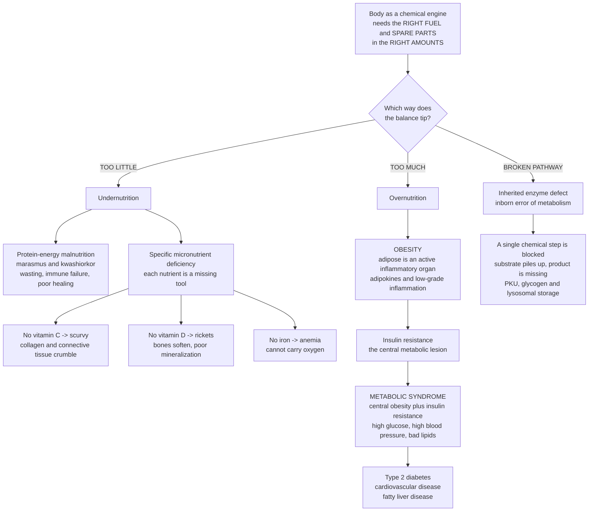

# 🍎 Nutritional and Metabolic Disorders

> [!abstract] TL;DR
> The body is a **chemical engine** that needs the right **fuel** and the right **spare parts**, in the right **amounts** — and disease strikes from *both* ends of the supply. **Too little:** outright starvation (**protein-energy malnutrition**) shuts the engine down, and missing a *specific* micronutrient causes a precise, dramatic failure — no vitamin C and connective tissue crumbles (**scurvy**), no vitamin D and bones soften (**rickets**), no iron and you cannot carry oxygen (**anemia**). Each vitamin or mineral is a particular tool the assembly line cannot run without. **Too much:** in much of the modern world the problem has flipped — chronic **over-nutrition** and inactivity cause **obesity**, which is not just excess storage but a *metabolically active, inflammatory* state that clusters with high blood sugar, high blood pressure, and bad cholesterol into **metabolic syndrome** — the shared soil from which type 2 diabetes, cardiovascular disease, and fatty liver grow. Beneath it all sit the body's **metabolic pathways**, which can also fail from birth — inherited enzyme defects (**inborn errors of metabolism**) that jam one chemical step. Right fuel, right parts, right amounts: nutritional and metabolic disease is what happens when that balance tips either way — and it sits at the crossroads of the world's biggest health challenges from *both* directions.

---

## Intuition

**Analogy — the body is a chemical engine that needs the right fuel and the right spare parts, in the right amounts.** Picture a factory whose engine runs on fuel and whose assembly line depends on a rack of specialized tools. Two very different kinds of failure can shut it down, and they sit at *opposite ends* of the supply.

At the **too-little** end, the failure can be *global* or *specific*. Cut off fuel entirely and the whole engine winds down — this is **starvation and protein-energy malnutrition**: the factory burns its own furniture to keep the lights on, muscle wastes, healing stalls, and the security guards (the immune system) go home. But even with plenty of fuel, remove one *specific* tool from the rack and one *specific* station on the line jams while everything else runs. Take away vitamin C and the crew that stitches connective tissue together loses its needle — the building's own walls begin to crumble (**scurvy**). Take away vitamin D and the masons cannot lay down bone mineral, so the frame stays soft and bends (**rickets**). Take away iron and the delivery trucks lose their cargo hooks, so oxygen never reaches the far rooms (**anemia**). Each deficiency is a missing tool, and each produces its own precise, almost signature lesion.

At the **too-much** end — the dominant problem of the modern world — the trouble is *chronic oversupply*. Fuel keeps arriving faster than it is burned, and the warehouse (**adipose tissue**) swells. Crucially, that warehouse is not an inert store: overstuffed, it becomes a noisy, *inflamed, hormone-secreting* organ that changes how the whole factory behaves. This is **obesity as a metabolically active state**, and it rarely comes alone — it drags along high blood sugar, high blood pressure, and a bad lipid profile, a cluster we call **metabolic syndrome**, the fertile soil in which diabetes, heart disease, and fatty liver take root. And finally, some engines are *built* with a jammed station: an **inherited enzyme defect** blocks one chemical step from birth, so a substrate piles up upstream while its product goes missing downstream. Right fuel, right parts, right amounts — tip the balance either way, or break a step at the factory, and disease follows.

---

## How It Works

### The unifying idea: nutrition is about the *right amount*

Almost every nutrient obeys a **dose-response curve shaped like an upside-down U** (equivalently, a **J- or U-shaped harm curve**): too *little* causes deficiency disease, an intermediate range is optimal, and too *much* causes **toxicity**. This is why "more is better" is the wrong mental model for nutrition. Water-soluble vitamins are mostly forgiving of excess (they are excreted), but **fat-soluble vitamins A and D**, and minerals like **iron**, accumulate and become toxic — hypervitaminosis A causes liver injury and raised intracranial pressure; vitamin D excess causes hypercalcemia; iron overload damages liver, heart, and pancreas. Deficiency and excess are the *two failure modes at the ends of the same curve*.

### Too little, part 1 — protein-energy malnutrition (PEM)

When total **energy and protein** intake chronically falls short, the body enters **starvation physiology**: it burns glycogen (hours), then shifts to **lipolysis and ketosis** and **gluconeogenesis** (breaking down muscle protein to make glucose) over days to weeks, dropping metabolic rate to conserve fuel. Clinically PEM presents along a spectrum:

- **Marasmus** — a *balanced* deficit of energy *and* protein: severe **wasting** of fat and muscle, a "skin-and-bones" child, but preserved (if low) serum proteins and *no edema*. The body is adapting as well as it can to pure starvation.
- **Kwashiorkor** — a relative **protein** deficit (often with adequate or high carbohydrate): **edema** (from low oncotic pressure as the liver stops making albumin), a **fatty liver**, skin and hair changes, and a paradoxically bloated belly. The adaptation has partly failed.

The **consequences** of undernutrition ripple everywhere: **immune failure** (infections become the actual cause of death), **impaired wound healing** and surgical risk, muscle wasting (including respiratory and cardiac muscle), and in children, **stunted growth and cognitive development**. Refeeding must be cautious — aggressive calories after prolonged starvation cause **refeeding syndrome** (a dangerous drop in phosphate, potassium, and magnesium as metabolism restarts).

### Too little, part 2 — specific micronutrient deficiencies

Here the pattern flips from *global shutdown* to *specific lesion*: remove one vitamin or mineral and one biochemical job fails while the rest of metabolism continues. The classics:

| Missing nutrient | Deficiency disease | The specific lesion (why) |
|---|---|---|
| **Vitamin C** (ascorbate) | **Scurvy** | Cofactor for collagen hydroxylation → weak collagen: bleeding gums, poor healing, perifollicular hemorrhage |
| **Vitamin D** | **Rickets** (children) / **osteomalacia** (adults) | Impaired calcium/phosphate handling → poor bone mineralization, soft/bowed bones |
| **Vitamin A** | **Night blindness → xerophthalmia** | Retinal (rhodopsin) and epithelial maintenance fail → blindness, dry cornea, infection |
| **Thiamine (B1)** | **Beriberi**; **Wernicke-Korsakoff** | Cofactor for pyruvate/α-KG dehydrogenase → heart failure ("wet"), neuropathy ("dry"), confusion/ataxia/amnesia |
| **Niacin (B3)** | **Pellagra** | NAD precursor shortage → the "3 D's": dermatitis, diarrhea, dementia |
| **B12 / folate** | **Megaloblastic anemia** | Blocked DNA synthesis → large immature red cells; B12 also causes subacute combined neurodegeneration |
| **Iron** | **Iron-deficiency anemia** | No hemoglobin synthesis → microcytic, hypochromic red cells, fatigue, low oxygen delivery |
| **Iodine** | **Goiter / hypothyroidism** | No thyroid hormone synthesis → thyroid enlargement, cretinism in the newborn |

The teaching point: **a single missing tool produces a reproducible, almost diagnostic pattern** — the reason a physician can look at bleeding gums and corkscrew hairs and think "vitamin C."

### Too much — obesity and metabolic syndrome

**Obesity** is chronic positive **energy balance** — intake exceeding expenditure over time — stored as adipose. But the modern understanding is that **adipose tissue is an active endocrine and immune organ**, not a passive fuel tank. Overstuffed adipocytes:

1. Shift their **adipokine** output — less protective **adiponectin**, more **leptin** (with resistance) and pro-inflammatory signals.
2. Recruit **macrophages** into fat, producing a state of **chronic low-grade inflammation** (TNF-α, IL-6).
3. Spill **free fatty acids** and inflammatory signals that drive **insulin resistance** in liver and muscle — the central lesion linking obesity to everything downstream.

That insulin resistance plus visceral adiposity is the engine of **metabolic syndrome** — a *cluster* defined (harmonized consensus, Alberti et al. 2009) as **3 of 5** of: central obesity (waist), elevated fasting **glucose**, elevated **blood pressure**, high **triglycerides**, and low **HDL**. Metabolic syndrome is not a single disease but a *shared soil*: it multiplies the risk of **type 2 diabetes**, **atherosclerotic cardiovascular disease**, and **non-alcoholic fatty liver disease (NAFLD/MASLD)**. Its lipid arm, **dyslipidemia** (high LDL/triglycerides, low HDL), feeds directly into **atherosclerosis**.

### Broken pathways — disorders of metabolism

Some metabolic disease is not about *how much* you eat but about a *specific chemical step*:

- **Gout** — disordered **purine/uric acid** metabolism: excess urate crystallizes as monosodium urate in joints, triggering acute crystal arthritis (the exquisitely painful big-toe attack). Diet, alcohol, and renal handling all modulate it.
- **Inborn errors of metabolism (IEM)** — *inherited* enzyme defects that block one step: substrate accumulates upstream (toxic) and product is missing downstream. **Phenylketonuria** (can't convert phenylalanine → toxic buildup → intellectual disability, prevented by diet), **glycogen storage diseases**, and **lysosomal storage diseases** (Tay-Sachs, Gaucher) are archetypes. These are the link between nutrition/metabolism and *genetic* disease.

### The whole map



---

## Key Concepts

### Secondary (intuitive)

- **The body is an engine needing fuel and parts in the right amount.** Both too little and too much cause disease.
- **Starvation (protein-energy malnutrition)** shuts the whole engine down: wasting, weak immunity, poor healing.
- **Each vitamin/mineral is a specific tool.** Lose one and you get one specific failure: **vitamin C → scurvy** (gums bleed, wounds won't heal), **vitamin D → rickets** (soft, bendy bones), **iron → anemia** (too tired, can't carry oxygen), **iodine → goiter**.
- **Obesity** is storing far more fuel than you burn — but the fat itself becomes an *active, inflamed* organ, not just a tank.
- **Metabolic syndrome** is a "cluster" — big waist + high sugar + high blood pressure + bad cholesterol together — that grows into diabetes, heart disease, and fatty liver.
- **More is not better.** Even good nutrients (vitamin A, vitamin D, iron) become *poison* in excess.

### Undergraduate (formal)

- **The U-shaped dose-response.** Function/health peaks over an adequate range and falls at both **deficiency** and **toxicity**; fat-soluble vitamins (A, D) and iron accumulate and are the classic toxicity risks.
- **PEM spectrum.** **Marasmus** = balanced energy+protein deficit → severe wasting, *no* edema. **Kwashiorkor** = relative protein deficit → **edema** (hypoalbuminemia, low oncotic pressure), fatty liver, skin/hair change. Starvation physiology: glycogenolysis → lipolysis/ketosis → gluconeogenesis, with a fall in metabolic rate; **refeeding syndrome** (hypophosphatemia) on rapid recovery.
- **Signature micronutrient lesions.** Map each deficiency to its biochemistry: ascorbate → collagen hydroxylation (scurvy); vitamin D → Ca/PO₄ and bone mineralization (rickets/osteomalacia); thiamine → oxidative decarboxylation (beriberi, Wernicke); niacin → NAD (pellagra's 3 D's); B12/folate → thymidylate/DNA synthesis (megaloblastic anemia); iron → hemoglobin (microcytic anemia); iodine → thyroid hormone (goiter).
- **Energy balance and adipose biology.** Weight change ≈ (intake − expenditure) / energy density (~7700 kcal per kg). Adipose secretes **adipokines** (leptin, adiponectin) and, when hypertrophied and inflamed, drives **insulin resistance** via free fatty acids and cytokines (TNF-α, IL-6).
- **Metabolic syndrome (3 of 5).** Central obesity, fasting hyperglycemia, hypertension, high triglycerides, low HDL — a risk *cluster*, not a diagnosis of one organ, predicting type 2 diabetes, ASCVD, and NAFLD.
- **Dyslipidemia and metabolic disorders.** LDL/triglyceride excess and low HDL → atherosclerosis; **gout** = urate overproduction/underexcretion → crystal arthritis; **inborn errors** = single blocked enzyme step (PKU, glycogen/lysosomal storage).

### Graduate (mechanistic and systems)

- **Adipose as an immunometabolic organ.** Obesity is a state of **metabolically triggered inflammation ("metaflammation")**: adipocyte hypertrophy → hypoxia and stress → recruitment of **M1 macrophages** forming crown-like structures, cytokine release, and ectopic **lipid spillover** (visceral > subcutaneous). This links to insulin resistance through serine phosphorylation of IRS-1, hepatic diacylglycerol/PKCε, and inflammasome (NLRP3/IL-1β) activation — reframing type 2 diabetes as partly an *inflammatory* disease.
- **The settling-point critique of energy balance.** A naive static model ("500 kcal/day surplus = 1 lb/week forever") is wrong because **energy expenditure rises with body mass** and **adaptive thermogenesis falls** during deficit. Weight approaches a new **equilibrium (settling point)** where expenditure again matches intake; this is the *dynamic* energy-balance model quantified below, and it explains weight-loss plateaus and the difficulty of maintenance.
- **Metabolic syndrome as a shared node.** The cluster is mechanistically unified by **insulin resistance + visceral adiposity**: the same lesion produces hepatic de novo lipogenesis (→ NAFLD and hypertriglyceridemia), reduced HDL, endothelial dysfunction and RAAS/sympathetic activation (→ hypertension), and β-cell failure (→ diabetes). It is the crossroads tying nutrition to **cardiovascular, hepatic, endocrine, and renal** pathophysiology.
- **Deficiency in the modern world is rarely "no food."** Micronutrient deficiencies persist through *dietary pattern, malabsorption, drugs, and physiology*: B12 from pernicious anemia/metformin/vegan diets, thiamine from alcohol-use disorder (Wernicke), folate in pregnancy, vitamin D from limited sun and malabsorption, iron from bleeding. Bariatric surgery deliberately creates iatrogenic malabsorption requiring lifelong supplementation.
- **Inborn errors as experiments of nature.** A single-gene enzyme block dissects a pathway: PKU (phenylalanine hydroxylase) shows toxic **substrate accumulation** correctable by *dietary restriction*; lysosomal storage shows failure of **catabolic clearance** treatable by *enzyme replacement*; galactosemia and glycogen storage show that **when** and **what** you feed can be therapeutic — the tightest possible link between nutrition, metabolism, and genetics.
- **The double burden.** Populations increasingly carry **undernutrition and overnutrition simultaneously** (stunting alongside obesity, "hidden hunger" of micronutrient deficiency within calorie surplus) — a systems-level reminder that "nutrition transition" is not a simple march from scarcity to plenty.

---

## Python Demo

```python
# Nutritional & metabolic disorders in three pictures:
#   (a) THE U-CURVE OF NUTRITION: for a nutrient, health/function peaks over an
#       ADEQUATE range and falls at BOTH deficiency and toxicity -> "more is not
#       better." Deficiency and excess are the two ends of the same curve.
#   (b) DYNAMIC ENERGY BALANCE: chronic surplus drives weight gain, but weight
#       approaches a NEW SETTLING POINT (expenditure rises with mass) rather than
#       climbing forever -> the correct model of obesity and weight plateaus.
#   (c) METABOLIC SYNDROME: cardiometabolic risk COMPOUNDS as risk factors cluster;
#       the 3-of-5 threshold is where the "shared soil" of diabetes/CVD/NAFLD ignites.
import numpy as np
import matplotlib.pyplot as plt

# ---------- (a) The U-curve / inverted-U of nutrition ----------
intake = np.linspace(0, 100, 500)          # relative nutrient intake (arbitrary units)
adeq_lo, adeq_hi = 20.0, 70.0              # edges of the adequate range
rise = 1.0 / (1.0 + np.exp(-(intake - adeq_lo) / 4.0))   # deficiency limb rises
fall = 1.0 / (1.0 + np.exp( (intake - adeq_hi) / 4.0))   # toxicity limb falls
health = rise * fall                        # inverted-U: high only in the middle
harm = 1.0 - health                         # U-shaped harm curve

# ---------- (b) Dynamic energy balance -> settling point ----------
DAYS = 365 * 3
k_tdee = 35.0                               # expenditure ~ 35 kcal/kg/day (scales with mass)
E_DENS = 7700.0                             # ~7700 kcal per kg body-weight change
W0 = 70.0                                   # start weight (kg)
maint = k_tdee * W0                          # maintenance intake for 70 kg = 2450 kcal/day
scenarios = {"+500 kcal/day surplus": maint + 500,
             "maintenance":           maint,
             "-500 kcal/day deficit": maint - 500}
colors = {"+500 kcal/day surplus": "#C0392B",
          "maintenance": "#7F8C8D",
          "-500 kcal/day deficit": "#27AE60"}
traj = {}
for label, intake_kcal in scenarios.items():
    W = np.empty(DAYS); W[0] = W0
    for t in range(1, DAYS):
        dW = (intake_kcal - k_tdee * W[t-1]) / E_DENS     # (in - out)/energy density
        W[t] = W[t-1] + dW
    traj[label] = W
years = np.arange(DAYS) / 365.0
naive_gain = W0 + (500.0 / E_DENS) * np.arange(DAYS)      # WRONG static model: linear forever

# ---------- (c) Metabolic syndrome: compounding risk vs clustered factors ----------
n_factors = np.arange(0, 6)                 # 0..5 of: waist, glucose, BP, triglycerides, HDL
per_factor_HR = 1.55                        # illustrative relative risk multiplier per component
rel_risk = per_factor_HR ** n_factors       # multiplicative compounding

fig, ax = plt.subplots(1, 3, figsize=(16.5, 5.0))

# --- panel (a) ---
ax[0].plot(intake, health, color="#2980B9", lw=2.4, label="Health / function")
ax[0].plot(intake, harm,   color="#C0392B", lw=1.8, ls="--", label="Harm (1 - function)")
ax[0].axvspan(0, adeq_lo,   color="#E67E22", alpha=0.15)
ax[0].axvspan(adeq_hi, 100, color="#8E44AD", alpha=0.15)
ax[0].axvspan(adeq_lo, adeq_hi, color="#27AE60", alpha=0.10)
ax[0].text(adeq_lo/2, 0.5, "DEFICIENCY\nscurvy, rickets,\nanemia", ha="center", fontsize=8, color="#B9770E")
ax[0].text((adeq_lo+adeq_hi)/2, 1.03, "adequate", ha="center", fontsize=8.5, color="#1E8449")
ax[0].text((adeq_hi+100)/2, 0.5, "TOXICITY\nvit A / D,\niron overload", ha="center", fontsize=8, color="#6C3483")
ax[0].set_xlabel("Nutrient intake (relative)")
ax[0].set_ylabel("Health / function (0-1)")
ax[0].set_title("(a) Nutrition is a U-curve:\nboth too little AND too much harm")
ax[0].set_ylim(0, 1.12); ax[0].legend(loc="lower center", fontsize=8)
ax[0].grid(alpha=0.3)

# --- panel (b) ---
for label, W in traj.items():
    ax[1].plot(years, W, color=colors[label], lw=2.2, label=label)
    ax[1].axhline(scenarios[label] / k_tdee, color=colors[label], ls=":", lw=1.0, alpha=0.7)
ax[1].plot(years, naive_gain, color="#C0392B", lw=1.2, ls="--", alpha=0.7,
           label="naive static model (WRONG)")
ax[1].set_xlabel("Years")
ax[1].set_ylabel("Body weight (kg)")
ax[1].set_title("(b) Energy balance -> SETTLING POINT,\nnot weight gain forever")
ax[1].set_ylim(45, 105); ax[1].legend(loc="upper left", fontsize=7.5)
ax[1].grid(alpha=0.3)

# --- panel (c) ---
bar_colors = ["#95A5A6"] * 3 + ["#C0392B"] * 3
ax[2].bar(n_factors, rel_risk, color=bar_colors)
ax[2].axvline(2.5, color="#2C3E50", ls="--", lw=1.4)
ax[2].text(2.55, rel_risk.max()*0.85, "metabolic syndrome\n(3 of 5 components)",
           fontsize=8.5, color="#2C3E50")
for n, r in zip(n_factors, rel_risk):
    ax[2].text(n, r + 0.15, f"{r:.1f}x", ha="center", fontsize=8)
ax[2].set_xlabel("Number of clustered risk factors")
ax[2].set_ylabel("Relative cardiometabolic risk")
ax[2].set_title("(c) Metabolic syndrome:\nrisk COMPOUNDS as factors cluster")
ax[2].grid(axis="y", alpha=0.3)

plt.tight_layout()
plt.show()

# ---------- console summary ----------
print(f"(a) Adequate window: intake {adeq_lo:.0f}-{adeq_hi:.0f}; "
      f"health drops toward 0 at BOTH ends (deficiency & toxicity).")
Wsurplus = traj["+500 kcal/day surplus"]
print(f"(b) +500 kcal/day surplus: weight {W0:.0f} -> {Wsurplus[-1]:.1f} kg over 3 yr, "
      f"settling near {scenarios['+500 kcal/day surplus']/k_tdee:.1f} kg "
      f"(naive linear model wrongly predicts {naive_gain[-1]:.0f} kg).")
print(f"(c) With 3 clustered factors, relative risk ~ {per_factor_HR**3:.1f}x baseline; "
      f"with 5, ~ {per_factor_HR**5:.1f}x -> the compounding 'shared soil'.")
```

**What you see.** *Panel (a)* is the single most important idea in clinical nutrition: the **inverted-U of health** (and its mirror, the U-shaped harm curve). Function is high *only* across an adequate window and collapses at *both* ends — the **deficiency** zone on the left (scurvy, rickets, anemia) and the **toxicity** zone on the right (hypervitaminosis A and D, iron overload). "More is better" is simply false. *Panel (b)* corrects the most common misconception about obesity: a chronic 500 kcal/day surplus does *not* add weight forever. Because **expenditure rises as body mass rises**, weight climbs and then **plateaus at a new settling point** — here about 84 kg — while the naive static model wrongly predicts limitless linear gain. This is why weight loss plateaus and why maintenance is hard: the body re-equilibrates. *Panel (c)* shows why **metabolic syndrome** is dangerous as a *cluster*: cardiometabolic risk **compounds multiplicatively** as components pile up, so crossing the **3-of-5** threshold marks the "shared soil" from which diabetes, cardiovascular disease, and fatty liver grow. (All curves are illustrative teaching models, not clinical risk tables.)

---

## Real-World Applications

- **Food fortification — deficiency disease erased at population scale.** **Iodizing salt** abolished endemic goiter and cretinism; **fortifying flour with folic acid** cut neural-tube defects; **vitamin D in milk** made rickets rare. These are among public health's cheapest, highest-impact interventions — nutritional pathophysiology turned into policy.
- **Newborn and metabolic screening.** The heel-prick screens for treatable **inborn errors of metabolism** — most famously **PKU**, where simply restricting dietary phenylalanine *before symptoms* prevents irreversible intellectual disability. It is the clearest case where "the treatment is the diet."
- **Wernicke encephalopathy prevention.** Giving **thiamine before glucose** to malnourished or alcohol-dependent patients is standard practice — infusing glucose first can precipitate acute Wernicke's by consuming the last thiamine. A direct clinical use of a single-cofactor deficiency.
- **Metabolic-syndrome risk stratification.** The harmonized **3-of-5** criteria (waist, glucose, blood pressure, triglycerides, HDL) are used to flag patients for aggressive lifestyle and pharmacologic prevention of diabetes and cardiovascular disease long before overt disease appears.
- **Obesity as a treatable chronic disease.** The reframing of adipose as an inflammatory endocrine organ underlies modern therapy — from **bariatric surgery** (which improves diabetes almost immediately, before weight loss) to **GLP-1 receptor agonists** (semaglutide, tirzepatide) that target the appetite/energy-balance axis, producing weight loss that reverses much of metabolic syndrome.
- **Refeeding and nutritional support.** ICU and eating-disorder care apply starvation physiology directly: cautious calorie escalation with **phosphate, potassium, and magnesium** repletion to prevent **refeeding syndrome**.

---

## Common Pitfalls

- **"More is better" for vitamins and minerals.** The U-curve says otherwise. Megadosing **fat-soluble vitamins (A, D)** or **iron** causes real toxicity (liver injury, hypercalcemia, iron overload). Supplementation corrects *deficiency*; it does not add health above the adequate range.
- **Believing a calorie surplus adds weight linearly forever.** As panel (b) shows, expenditure rises with mass and the body reaches a **settling point**. This is why "you'll gain a pound a week indefinitely" is wrong, and why weight-loss plateaus are physiology, not failure of willpower.
- **Treating obesity as pure gluttony/inactivity ("just eat less").** Obesity is a chronic disease with a **metabolically active, inflammatory** fat organ and powerful homeostatic defense of body weight (leptin resistance, adaptive thermogenesis). Framing it as a moral failing ignores its biology and its response to surgery and GLP-1 drugs.
- **Conflating BMI with metabolic health.** BMI misses body composition and fat *distribution*. **Visceral (central) adiposity** drives metabolic syndrome; a "normal-weight" person can be metabolically unhealthy (TOFI — thin outside, fat inside), and a high-BMI athlete may be metabolically healthy.
- **Missing deficiency in the well-fed.** In wealthy settings deficiency hides behind *malabsorption, drugs, and alcohol*, not famine: B12 (metformin, pernicious anemia, vegan diets), thiamine (alcohol → Wernicke), vitamin D (indoor life), and iatrogenic deficiency after **bariatric surgery**. Calorie surplus does not exclude "hidden hunger."
- **Giving glucose before thiamine in the malnourished.** A carbohydrate load can precipitate **Wernicke encephalopathy** by consuming residual thiamine — thiamine goes first.
- **Reading this as medical advice.** This note describes disease *mechanisms* at textbook level. It is not guidance for any individual's diet, weight, deficiency, or metabolic condition, which require a clinician and the specifics of a real person.

---

## Related Concepts

**Within this section (Metabolic, Endocrine, and Renal Disease).** This note is the *nutritional and metabolic* opener that feeds the rest of the section. It hands off most directly to **Diabetes Mellitus and Glucose Regulation** — type 2 diabetes is the natural downstream of the insulin resistance and metabolic syndrome described here — and to **Endocrine Pathophysiology**, which supplies the hormonal control (thyroid in iodine deficiency, the leptin/adiponectin and insulin axes, adrenal and pituitary regulation of metabolism) that these nutritional disorders perturb. It connects to **Liver and Gastrointestinal Disease** through **non-alcoholic fatty liver disease (NAFLD/MASLD)** — the hepatic manifestation of metabolic syndrome — and through the malabsorption that causes many micronutrient deficiencies. Its dyslipidemia arm is the fuel for atherosclerosis covered in **Cardiovascular Pathophysiology**, and the **inborn errors of metabolism** discussed here are the metabolic wing of **Genetic and Congenital Disease**. These are prose references to sibling notes in the Clinical Medicine vault.

**Across the vault (Glob-verified links).**

- [[Clinical_Medicine/01_Foundations_of_Disease_and_Pathophysiology/Clinical_Medicine_and_Pathophysiology_Overview|Clinical Medicine and Pathophysiology Overview]] — the parent hub framing disease as failed homeostasis; nutritional and metabolic disorders are homeostasis tipping too far in either direction.
- [[Clinical_Medicine/01_Foundations_of_Disease_and_Pathophysiology/Genetic_and_Congenital_Disease|Genetic and Congenital Disease]] — inborn errors of metabolism (PKU, glycogen and lysosomal storage) are single-gene enzyme defects; this is their pathophysiology home.
- [[Clinical_Medicine/02_Cardiovascular_and_Respiratory_Disease/Cardiovascular_Pathophysiology|Cardiovascular Pathophysiology]] — the dyslipidemia and metabolic syndrome here are the upstream drivers of the atherosclerosis that note describes.
- [[Health_Nutrition_and_Longevity/02_Nutrition_Science/Micronutrients_Vitamins_and_Minerals|Micronutrients: Vitamins and Minerals]] — the prevention-side companion detailing each vitamin/mineral whose *absence* produces the deficiency diseases catalogued here.
- [[Health_Nutrition_and_Longevity/02_Nutrition_Science/Macronutrients_Protein_Carbs_and_Fats|Macronutrients: Protein, Carbs, and Fats]] — the protein and energy whose shortfall causes PEM and whose chronic surplus causes obesity.
- [[Health_Nutrition_and_Longevity/01_Foundations_of_Health/Metabolism_and_Energy_Balance|Metabolism and Energy Balance]] — the intake-minus-expenditure framework and settling-point model behind the obesity panel of the demo.
- [[Health_Nutrition_and_Longevity/02_Nutrition_Science/Nutrition_Science_Overview|Nutrition Science Overview]] — the healthy-nutrition frame of which these disorders are the pathological failures.
- [[Biology/09_Human_Physiology_and_Anatomy/The_Endocrine_System_and_Hormones|The Endocrine System and Hormones]] — insulin, leptin, adiponectin, and thyroid hormone: the signaling that metabolic disease disrupts.
- [[Biology/01_Chemistry_of_Life/Carbohydrates_and_Lipids|Carbohydrates and Lipids]] — the biochemistry of the fuels and blood lipids central to obesity, dyslipidemia, and fatty liver.
- [[Chemistry/06_Biochemistry/Metabolism_and_Bioenergetics|Metabolism and Bioenergetics]] — the metabolic pathways whose specific steps inborn errors jam and whose cofactors are the missing vitamins.
- [[Chemistry/06_Biochemistry/Enzyme_Kinetics_and_Catalysis|Enzyme Kinetics and Catalysis]] — vitamins act as enzyme cofactors and inborn errors are enzyme defects; this is the catalytic machinery behind both.

---

## Review Questions

**Secondary.** Using the "engine that needs the right fuel and the right tools" picture, explain the difference between *starving* (protein-energy malnutrition) and lacking *one specific* nutrient like vitamin C. Then, in plain terms, why is it not true that taking more and more of a vitamin is always better for you?

**Undergraduate.** Distinguish **marasmus** from **kwashiorkor** in terms of what is deficient and why one causes edema and the other does not. Separately, list the **five components** of metabolic syndrome and explain why it is described as the "shared soil" for type 2 diabetes, cardiovascular disease, and fatty liver rather than as a disease of a single organ.

**Graduate.** A patient eats a chronic surplus of 500 kcal/day but their weight climbs for two years and then plateaus rather than rising indefinitely. Explain this using the **dynamic energy-balance / settling-point** model, and contrast it with the naive static prediction. Then explain *mechanistically* how enlarged, inflamed adipose tissue produces **insulin resistance**, and why this single lesion ties obesity to diabetes, hypertension, dyslipidemia, and NAFLD simultaneously.

---

## Sources

- Kumar, V., Abbas, A. K., & Aster, J. C. *Robbins & Cotran Pathologic Basis of Disease* (10th ed.). Elsevier — "Environmental and Nutritional Diseases" chapter (protein-energy malnutrition, vitamin and mineral deficiencies, obesity).
- Loscalzo, J., Fauci, A., Kasper, D., et al. (eds.). *Harrison's Principles of Internal Medicine* (21st ed.). McGraw-Hill — sections on Nutrition, Obesity, the Metabolic Syndrome, and inborn errors of metabolism.
- Ross, A. C., Caballero, B., Cousins, R. J., et al. (eds.). *Modern Nutrition in Health and Disease* (11th ed., Shils). Wolters Kluwer — comprehensive reference on nutrient requirements, deficiency, and toxicity.
- Alberti, K. G. M. M., Eckel, R. H., Grundy, S. M., et al. (2009). "Harmonizing the Metabolic Syndrome: A Joint Interim Statement." *Circulation*, 120(16), 1640–1645 — the consensus 3-of-5 definition of metabolic syndrome.
- Hall, K. D., et al. (2011). "Quantification of the effect of energy imbalance on bodyweight." *The Lancet*, 378(9793), 826–837 — the dynamic energy-balance / settling-point model behind the obesity simulation.

---

#clinical-medicine #nutrition #obesity #metabolic-syndrome #vitamin-deficiency
