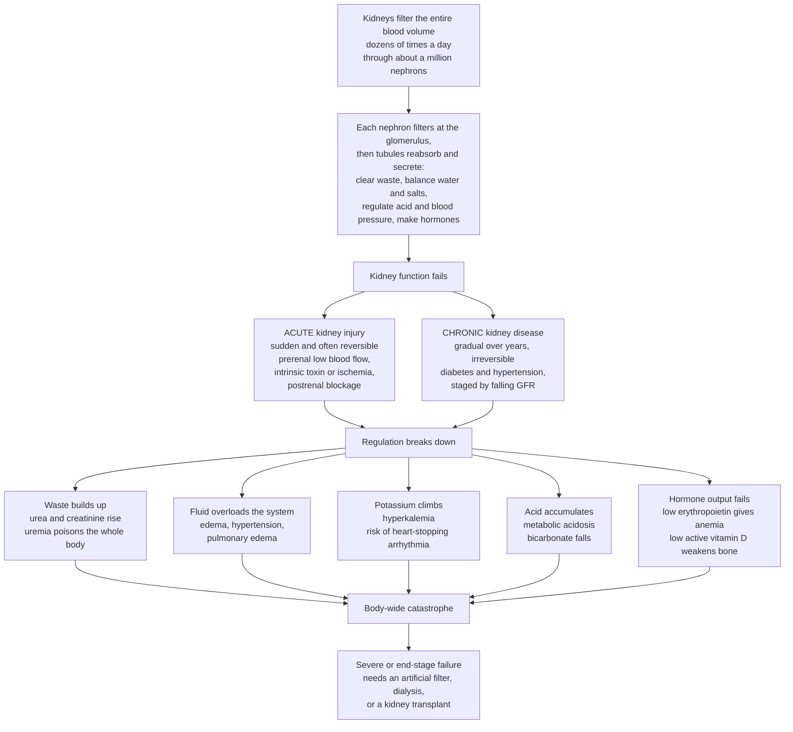

# 🫘 Renal Pathophysiology and Kidney Disease

> [!abstract] TL;DR
> The kidneys are the body's **water-treatment and quality-control plant**, filtering the entire blood volume dozens of times a day through **a million nephrons**. Each nephron **filters** blood at the **glomerulus** (the rate of this filtering, the **GFR**, is the master number of kidney function), then the **tubules** carefully **reabsorb** what the body needs and **secrete** extra waste. In doing so the kidney does far more than "make urine": it clears **metabolic waste** (urea, creatinine), balances **water and electrolytes** (sodium, potassium, calcium, phosphate), regulates **acid–base** (reclaiming bicarbonate, excreting acid), controls **blood pressure** (via the renin–angiotensin–aldosterone system and volume), and even makes **hormones** — **erythropoietin** for red cells and **activated vitamin D** for bone. Failure comes in two patterns. **Acute kidney injury (AKI)** is a rapid, often *reversible* crash from **prerenal** low blood flow (shock, dehydration, heart failure), **intrinsic** damage (acute tubular necrosis from ischemia or toxins; glomerular or interstitial disease), or **postrenal** obstruction. **Chronic kidney disease (CKD)** is a slow, *irreversible* loss of nephrons over years — most often from **diabetes** and **hypertension** — staged by falling GFR. Because the kidney touches every system, its failure is a **body-wide catastrophe**: waste accumulates to toxic **uremia**, fluid overloads the circulation (edema, pulmonary edema, worsening hypertension), **potassium climbs to heart-stopping levels**, **metabolic acidosis** sets in, bones weaken (mineral-bone disease), and **anemia** appears. When filtration fails completely — **end-stage renal disease** — the only options are an artificial filter (**dialysis**) or a **transplant**. The kidney is the quiet regulator whose failure reveals just how much it was silently doing.

---

## Intuition

**Analogy — a city's water-treatment and quality-control plant.** Imagine a great treatment plant that the entire city's water must pass through, not once but dozens of times a day. Its job is not simply "make sewage." Sitting quietly at the edge of town, it does five things at once. It **strains out the poisons** — the toxic byproducts every household and factory dumps into the supply. It **holds the water level exactly right** — releasing just enough to prevent flooding, retaining just enough to prevent drought. It **keeps the water's chemistry in a razor-thin band** — the right saltiness, the right acidity, because pipes and turbines downstream corrode or seize if the balance drifts even slightly. It **regulates the pressure** in the whole grid. And, remarkably, it even **sends out chemical signals** that tell other parts of the city to build more of what they need. All of this happens inside a bank of **a million tiny identical filter units** — the **nephrons** — each one straining, reclaiming, and fine-tuning in parallel.

Now let the plant fail. It can fail **suddenly** — a power cut starves the pumps (blood flow crashes in shock), a chemical spill poisons the filters (a toxin or drug), or a valve jams shut downstream (an obstruction). Or it can fail **slowly**, filters silting up one by one over decades until too few remain (the grinding damage of high blood sugar or high pressure). Either way the consequences ripple through the *whole city* at once: **poison builds up** in the water until everyone is sick (uremia), the reservoirs **overflow and flood** the streets (fluid overload — swelling, breathlessness), one particularly dangerous chemical **rises to a level that stops the machinery cold** (potassium — which literally stops the heart), the water turns **acidic**, and the plant's outgoing signals go silent so the city stops building red blood cells and stops maintaining its bones. This is why kidney failure is never a local problem. The kidney is the silent master regulator of the body's internal ocean, and when the filters fail completely, the only choices are to bolt on an **artificial filter (dialysis)** or install a whole new plant (**transplant**).

---

## How It Works

### Core mechanics — the normal kidney (renal physiology recap)

1. **The nephron is the functional unit, and there are about a million per kidney.** Each nephron has two parts: a **glomerulus** (a tuft of leaky capillaries that filters plasma) feeding into a long **tubule** (which processes that filtrate). The kidneys receive roughly a fifth of the entire cardiac output — an enormous blood supply for organs their size — precisely because their job is to *continuously clean the whole circulation*.
2. **Filtration sets the pace, and its rate is the GFR.** Blood pressure drives fluid out of the glomerular capillaries across a three-layer filter into the tubule, producing about 180 litres of **filtrate** a day. The **glomerular filtration rate (GFR)** — normally around 100–120 mL/min — is the single most important measure of kidney function: it is *how fast the kidneys are cleaning the blood*. Nearly everything clinical hangs off this one number.
3. **Reabsorption reclaims almost everything.** Of those 180 litres filtered, about 99% is **reabsorbed** back into the blood along the tubule — the water, glucose, amino acids, and most of the salt. Only ~1.5 litres leaves as urine. The nephron filters indiscriminately, then *selectively takes back* what the body wants; this "filter-everything-then-reclaim" design is what makes precise regulation possible.
4. **Secretion fine-tunes the output.** The tubule also actively **secretes** additional substances (excess potassium, hydrogen ions, certain drugs and toxins) *into* the forming urine, giving a second lever beyond filtration.
5. **From these three steps flow all the kidney's jobs.** **Waste excretion** — urea (from protein breakdown) and creatinine (from muscle) are cleared. **Water and electrolyte balance** — sodium (and thus volume), potassium, calcium, and phosphate are held in tight ranges. **Acid–base regulation** — the kidney reclaims filtered **bicarbonate** and excretes the body's daily acid load as titratable acid and ammonium, defending blood pH. **Blood-pressure control** — by adjusting sodium and water (volume) and by releasing **renin**, the trigger of the **renin–angiotensin–aldosterone system (RAAS)**. **Endocrine functions** — the kidney makes **erythropoietin (EPO)**, which tells the marrow to build red blood cells, and it performs the final activation step of **vitamin D**, essential for calcium absorption and bone. A single organ is simultaneously a filter, a plumber, a chemist, a pressure regulator, and an endocrine gland.

### Core mechanics — acute kidney injury (AKI), the sudden crash

6. **AKI is a rapid, often reversible loss of function**, classified by *where* the problem sits relative to the nephron. **Prerenal** AKI is a supply problem — the kidney is starved of blood flow (**hypovolemia**, hemorrhage, **shock**, severe **heart failure**); the nephrons are structurally intact and recover fast if perfusion is restored. **Intrinsic (renal)** AKI is damage to the nephron itself — most commonly **acute tubular necrosis (ATN)**, in which prolonged ischemia or a toxin (aminoglycosides, contrast dye, myoglobin) kills tubular cells; it also includes glomerular disease and acute interstitial nephritis. **Postrenal** AKI is a drainage problem — an **obstruction** (stone, enlarged prostate, tumour, blocked catheter) backs urine up and raises pressure until filtration stalls; relieving the blockage can reverse it. The clinical art is recognizing which of the three it is, because prerenal and postrenal causes are frequently *fixable*.

### Core mechanics — chronic kidney disease (CKD), the slow attrition

7. **CKD is progressive, irreversible nephron loss**, staged **G1 to G5** by GFR (G1 ≥ 90, G2 60–89, G3a 45–59, G3b 30–44, G4 15–29, G5 < 15 mL/min, and albuminuria is graded alongside). The two leading causes are **diabetes** (high glucose damages the glomerular microvasculature) and **hypertension** (chronic pressure batters the vessels); glomerulonephritis and polycystic kidney disease follow. Crucially, surviving nephrons overwork to compensate (**hyperfiltration**), which slowly damages *them* too — a self-perpetuating decline that RAAS-blocking drugs are designed to slow.
8. **The consequences of failure map onto the lost jobs.** As GFR falls, waste accumulates into **uremia** (nausea, itch, encephalopathy, pericarditis). Sodium and water retention cause **fluid overload** (edema, hypertension, pulmonary edema). Failing potassium excretion causes **hyperkalemia** — the most acutely lethal complication, risking cardiac **arrhythmia**. Failing acid excretion causes **metabolic acidosis** (bicarbonate falls). Phosphate retention plus loss of vitamin D activation drives **mineral-bone disease** (low calcium, secondary hyperparathyroidism, renal osteodystrophy, vascular calcification). And loss of erythropoietin causes **anemia**. When these overwhelm all remaining function — **end-stage renal disease (ESRD)** — the patient needs **dialysis** or **transplant** to live.
9. **Glomerular disease splits into two great syndromes.** **Nephritic** syndrome is an *inflammatory* leak — blood in the urine (hematuria), modest protein, hypertension, and a falling GFR. **Nephrotic** syndrome is a *permeability* leak — massive **proteinuria** (over 3.5 g/day), low blood albumin, marked **edema**, and high cholesterol. Tubular/interstitial diseases, kidney **stones**, and **infection** (pyelonephritis) round out the structural pathology.

### The kidney as regulator and what its failure unleashes



*Read the top as the one organ doing five jobs at once; read the fork as the two failure patterns, acute and chronic; and read the fan of consequences as why a single failing organ becomes a whole-body emergency.*

---

## Key Concepts

### Secondary (intuitive)

- **Nephron** = one of the kidney's million tiny filters. Each one strains the blood, then reclaims the good stuff and dumps the waste.
- **GFR (glomerular filtration rate)** = the score of how well the kidneys are cleaning the blood. **High is healthy; low means failing.**
- **Two ways kidneys fail.** *Suddenly* (**acute kidney injury** — from a crash in blood flow, a poison, or a blockage; often reversible) or *slowly over years* (**chronic kidney disease** — usually from diabetes or high blood pressure; not reversible).
- **What happens when they fail.** Waste builds up and poisons you (**uremia** — nausea, confusion), fluid builds up (**swelling and breathlessness**), **potassium rises to dangerous heart-stopping levels**, the blood turns **acidic**, you become **anemic**, and your **bones weaken**.
- **End-stage kidney failure** = the filters are gone, so you need a **machine to filter your blood (dialysis)** or a new kidney (**transplant**).

### Undergraduate (formal)

- **The three-step nephron.** *Glomerular filtration* (~180 L/day of filtrate; GFR ~120 mL/min) → *tubular reabsorption* (~99% reclaimed: water, Na, glucose, HCO3) → *tubular secretion* (K, H, drugs added to urine). Urine is the small remainder.
- **The kidney's job list.** Waste excretion (urea, creatinine), water/electrolyte balance (Na → volume; K; Ca; phosphate), acid–base (reabsorb bicarbonate, excrete H as titratable acid + ammonium), blood-pressure control (volume + renin/RAAS), and endocrine output (EPO → red cells; 1-alpha-hydroxylation → active vitamin D → bone; renin).
- **AKI, three categories.** *Prerenal* — hypoperfusion (hypovolemia, shock, heart failure, renal-artery problems); nephrons intact, urine concentrated, low fractional excretion of sodium. *Intrinsic* — acute tubular necrosis (ischemic/toxic), glomerulonephritis, or acute interstitial nephritis; urine dilute, muddy-brown casts in ATN. *Postrenal* — obstruction (stone, prostate, tumour); reversible if relieved early.
- **CKD staging and causes.** GFR categories G1–G5 plus albuminuria grade; top causes diabetes and hypertension, then glomerulonephritis, polycystic kidney disease. Complications: uremia, volume overload, **hyperkalemia**, metabolic acidosis, CKD–mineral-and-bone disorder, and anemia of CKD.
- **Creatinine is an inverse, insensitive marker of GFR.** Because serum creatinine ≈ production ÷ clearance, it rises only *after* substantial GFR is already lost — a person can lose nearly half their kidney function while creatinine still reads "normal" (the demo makes this concrete).
- **Nephritic vs nephrotic.** *Nephritic* = inflammation → hematuria, red-cell casts, hypertension, mild proteinuria, falling GFR. *Nephrotic* = barrier failure → proteinuria > 3.5 g/day, hypoalbuminemia, edema, hyperlipidemia, hypercoagulability.
- **Kidney-centered fluid/electrolyte/acid–base disorders.** *Volume/sodium*: dehydration vs overload; hypo/hypernatremia are chiefly *water* balance problems. *Potassium*: hyperkalemia (arrhythmia risk, worsened by acidosis and RAAS blockade) vs hypokalemia. *Acid–base*: metabolic acidosis/alkalosis, with the lungs providing rapid **respiratory compensation** while the kidney provides slower, definitive correction.

### Graduate (mechanistic and systems)

- **GFR is set by Starling forces and defended by autoregulation.** Net filtration pressure across the glomerular capillary (hydrostatic minus oncotic) times the filtration coefficient Kf sets single-nephron GFR. **Autoregulation** — a myogenic reflex plus **tubuloglomerular feedback** sensed by the macula densa — holds GFR nearly constant across a wide blood-pressure range by tuning afferent and efferent arteriolar tone. This explains a classic bedside fact: **ACE inhibitors dilate the efferent arteriole and therefore drop GFR** (renoprotective long-term by lowering intraglomerular pressure, but a hazard in bilateral renal-artery stenosis or prerenal states).
- **The Brenner hyperfiltration hypothesis unifies CKD progression.** When nephrons are lost, survivors compensate by hyperfiltering; the resulting glomerular hypertension and proteinuria drive tubulointerstitial fibrosis and *further* nephron loss — a final common pathway independent of the initial insult. Reducing intraglomerular pressure (RAAS blockade, SGLT2 inhibition restoring tubuloglomerular feedback) slows the slope of GFR decline.
- **Renal acid–base handling.** The proximal tubule reclaims filtered bicarbonate; the distal nephron regenerates the bicarbonate consumed buffering daily fixed acid, excreting protons as titratable acid and, chiefly, **ammonium**. Failure produces the high-anion-gap metabolic acidosis of uremia; localized transport defects produce the **renal tubular acidoses**.
- **Potassium handling and why hyperkalemia comes late but kills.** K is secreted distally under **aldosterone** and depends on distal sodium delivery and tubular flow; the kidney has huge reserve, so hyperkalemia emerges only at low GFR — then is amplified by metabolic acidosis (transcellular K shift out of cells), tissue breakdown, and RAAS blockade. Rising extracellular K depolarizes cardiac myocytes toward inexcitability → peaked T waves → sine-wave → arrest.
- **CKD–mineral-and-bone disorder (CKD-MBD) is an endocrine cascade.** Falling GFR retains phosphate → **FGF23** and **PTH** rise → reduced calcitriol (active vitamin D) → hypocalcemia → **secondary hyperparathyroidism** → renal osteodystrophy and accelerated vascular calcification. It is a textbook example of a hormonal control loop failing when its regulating organ fails.
- **The kidney as the body's integrator, and its cross-organ syndromes.** Because it co-regulates volume, electrolytes, acid–base, pressure, and hematopoiesis, kidney disease couples tightly to other organs: **cardiorenal syndrome** (heart and kidney failing in lockstep through congestion and neurohormonal drive), **hepatorenal syndrome** (functional renal failure of advanced liver disease), and the intimate loops with diabetes, hypertension, and shock. The kidney is medicine's great integrator of homeostasis — which is exactly why its failure is never confined.

---

## Python Demo

```python
# Kidney disease in three pictures, from a single master variable: GFR.
#   (a) GFR DECLINE THROUGH THE CKD STAGES: model glomerular filtration rate
#       falling over years in chronic kidney disease, with and without therapy
#       that flattens the slope (blood-pressure / RAAS control). Shaded bands
#       are the KDIGO GFR stages G1..G5 toward kidney failure.
#   (b) WHY CREATININE LOOKS NORMAL UNTIL LATE: serum creatinine (and urea/BUN)
#       vs GFR. Because Cr ~ production / clearance, it is INVERSELY and
#       NON-LINEARLY related to GFR -- it barely moves until much function is
#       already gone (the "creatinine-blind range").
#   (c) THE FAILING KIDNEY DISTURBS THE INTERNAL CHEMISTRY: as GFR drops, serum
#       potassium RISES (hyperkalemia -> arrhythmia risk) and bicarbonate FALLS
#       (metabolic acidosis).
import numpy as np
import matplotlib.pyplot as plt

# ---------- (a) GFR decline over time through the CKD stages ----------
years = np.linspace(0, 25, 400)
gfr_untreated = np.clip(100 - 4.0 * years, 2, None)   # ~4 mL/min lost per year, untreated
gfr_treated   = np.clip(100 - 1.6 * years, 2, None)   # slope flattened by BP / RAAS control

# KDIGO GFR stage thresholds (mL/min/1.73m^2): G1>=90, G2 60-89, G3a 45-59,
# G3b 30-44, G4 15-29, G5 <15
edges  = [120, 90, 60, 45, 30, 15, 0]
labels = ["G1 normal", "G2 mild", "G3a", "G3b", "G4 severe", "G5 failure"]
band_colors = ["#DFF5E1", "#EAF6D8", "#FBF3CE", "#FBE3C4", "#F6CBBF", "#EBB6C4"]

# ---------- (b) waste markers rise as GFR falls (inverse, non-linear) ----------
gfr = np.linspace(5, 120, 400)
creatinine = 100.0 / gfr                     # mg/dL-scale: Cr ~ production / clearance
bun        = 15.0 * (100.0 / gfr) / 6.7      # urea (BUN) tracks the same inverse curve

# ---------- (c) electrolyte & acid-base disturbance as GFR falls ----------
potassium   = 4.0 + 3.2 / (1 + np.exp((gfr - 14) / 5.0))    # hyperkalemia only at low GFR
bicarbonate = 15.0 + 9.0 / (1 + np.exp(-(gfr - 20) / 6.0))  # metabolic acidosis at low GFR

fig, (ax1, ax2, ax3) = plt.subplots(1, 3, figsize=(17, 5.4))

# ----- panel (a): GFR falling through the stages over time -----
for top, bot, c, lab in zip(edges[:-1], edges[1:], band_colors, labels):
    ax1.axhspan(bot, top, color=c, alpha=0.9, zorder=0)
    ax1.text(24.4, (top + bot) / 2, lab, va="center", ha="right", fontsize=7.5, color="#555")
ax1.plot(years, gfr_untreated, color="#C0392B", lw=2.4, label="Untreated (~4 mL/min/yr)")
ax1.plot(years, gfr_treated,   color="#1E8449", lw=2.4, ls="--", label="BP / RAAS control (~1.6/yr)")
ax1.axhline(15, color="#7B241C", lw=1, ls=":")
ax1.text(0.4, 16.5, "dialysis / transplant zone (GFR < 15)", fontsize=7.5, color="#7B241C")
ax1.set_xlabel("Time (years)")
ax1.set_ylabel("GFR (mL/min/1.73m$^2$)")
ax1.set_title("(a) GFR decline through the CKD stages")
ax1.set_xlim(0, 25); ax1.set_ylim(0, 120)
ax1.legend(loc="upper right", fontsize=8)

# ----- panel (b): creatinine / urea vs GFR (inverse, insensitive early) -----
ax2.axvspan(60, 120, color="#DFF5E1", alpha=0.7, zorder=0)     # "reassuring" GFR
ax2.axhspan(0, 1.3, color="#D6EAF8", alpha=0.5, zorder=0)      # normal creatinine band
ax2.plot(gfr, creatinine, color="#8E44AD", lw=2.6, label="Serum creatinine")
ax2.plot(gfr, bun,        color="#D35400", lw=1.8, ls="--", label="Urea / BUN (scaled)")
ax2.axhline(1.3, color="#2E86C1", lw=1, ls=":")
ax2.axvline(60,  color="#7B241C", lw=1, ls=":")
ax2.annotate("~40% of function lost,\ncreatinine still 'normal'",
             xy=(70, 100/70), xytext=(74, 5.5), fontsize=8, color="#7B241C",
             arrowprops=dict(arrowstyle="->", color="#7B241C"))
ax2.text(8, 1.55, "normal creatinine band", fontsize=7.5, color="#2E86C1")
ax2.set_xlabel("GFR (mL/min)  <- worsening")
ax2.set_ylabel("Serum concentration (mg/dL scale)")
ax2.set_title("(b) Why creatinine looks normal until late")
ax2.set_xlim(120, 5); ax2.set_ylim(0, 12)     # inverted x: right = worse
ax2.legend(loc="upper left", fontsize=8)

# ----- panel (c): potassium & bicarbonate vs GFR (two axes) -----
axK = ax3
axB = ax3.twinx()
lK, = axK.plot(gfr, potassium, color="#C0392B", lw=2.6, label="Serum potassium")
lB, = axB.plot(gfr, bicarbonate, color="#2471A3", lw=2.6, ls="--", label="Bicarbonate")
axK.axhspan(5.5, 8.0, color="#F5B7B1", alpha=0.35, zorder=0)   # hyperkalemia danger
axK.text(115, 5.9, "hyperkalemia", fontsize=7.5, color="#922B21")
axB.axhspan(10, 22, color="#AED6F1", alpha=0.20, zorder=0)     # acidosis (low bicarb)
axK.set_xlabel("GFR (mL/min)  <- worsening")
axK.set_ylabel("Serum potassium (mmol/L)", color="#C0392B")
axB.set_ylabel("Bicarbonate (mmol/L)", color="#2471A3")
axK.tick_params(axis="y", colors="#C0392B")
axB.tick_params(axis="y", colors="#2471A3")
axK.set_title("(c) Electrolyte & acid-base failure as GFR drops")
axK.set_xlim(120, 5); axK.set_ylim(3.5, 7.5); axB.set_ylim(12, 28)
axK.legend(handles=[lK, lB], loc="upper left", fontsize=8)

plt.tight_layout(); plt.show()

# ---------- numeric readout ----------
def cr(g): return 100.0 / g
print(f"GFR 100 -> creatinine {cr(100):.2f}  (healthy baseline)")
print(f"GFR  60 -> creatinine {cr(60):.2f}  (40% of function GONE, still near-normal)")
print(f"GFR  30 -> creatinine {cr(30):.2f}  (severe CKD)")
print(f"GFR  10 -> creatinine {cr(10):.2f}  (kidney failure)")
print(f"Untreated hits GFR 15 (ESRD) at year {years[np.argmax(gfr_untreated <= 15)]:.1f}; "
      f"treated slope is still above 15 at year 25 ({gfr_treated[-1]:.0f}).")
```

**What you see.** *Panel (a)* is the CKD story: the red trajectory slides down through the coloured KDIGO stages G1 → G5 at about 4 mL/min a year, crossing into the dialysis/transplant zone (GFR < 15) in its second decade; the green dashed line shows what blood-pressure and RAAS control buy — a flatter slope that keeps the patient out of failure across the whole window. *Panel (b)* is the demo's punchline and the single most important idea for reading kidney tests: because creatinine is the *inverse* of GFR, it hugs the normal band while the first ~40% of kidney function silently disappears, then rockets upward only once GFR is already low — the "creatinine-blind range" that makes eGFR, not raw creatinine, the right lens. *Panel (c)* shows the internal chemistry failing in step: as GFR falls toward the right, **potassium climbs** into the hyperkalemia danger band (the arrhythmia threat) while **bicarbonate falls** into metabolic acidosis. One master number, GFR, and the whole body-wide cascade follows from it.

---

## Real-World Applications

- **Staging and monitoring with eGFR + albuminuria.** Routine labs estimate GFR from serum creatinine (CKD-EPI equations) and grade urine albumin, together placing a patient on the KDIGO map that guides everything from drug dosing to nephrology referral — the practical use of panel (a) and (b).
- **Working up AKI at the bedside.** The prerenal/intrinsic/postrenal framework drives the workup: check volume and perfusion, review nephrotoxins, and image for obstruction. A bladder scan or renal ultrasound rules out the eminently reversible postrenal cause; urine microscopy (muddy-brown casts) and the fractional excretion of sodium separate prerenal from acute tubular necrosis.
- **Slowing CKD progression.** Blood-pressure control, **ACE inhibitors / ARBs**, and **SGLT2 inhibitors** all lower intraglomerular pressure and proteinuria — attacking the Brenner hyperfiltration loop — while tight glycemic control protects the diabetic glomerulus. This is the mechanism behind the flattened green curve in the demo.
- **Treating the consequences of failure.** Diuretics for volume overload; dietary potassium restriction and potassium binders (plus emergency calcium/insulin-glucose) for hyperkalemia; oral bicarbonate for acidosis; phosphate binders, active vitamin D, and calcimimetics for CKD-MBD; and **erythropoiesis-stimulating agents** with iron for the anemia of CKD — each therapy replacing one lost renal job.
- **Renal replacement therapy — the artificial nephron.** **Hemodialysis** and **peritoneal dialysis** substitute for filtration and fluid/electrolyte control when GFR collapses; **kidney transplantation** restores all functions, including the endocrine ones dialysis cannot. These are the endpoints of the flowchart.
- **Drug safety by kidney function.** Countless drugs are renally cleared or nephrotoxic (NSAIDs, aminoglycosides, iodinated contrast), so dosing and avoidance are keyed to GFR — one of the most common everyday uses of renal pathophysiology across all of medicine.

---

## Common Pitfalls

- **Trusting a "normal" creatinine.** As panel (b) shows, creatinine's inverse, non-linear tie to GFR means nearly half of kidney function can vanish before it leaves the reference range — worst of all in the elderly and low-muscle-mass patients who make little creatinine. Always read the **estimated GFR**, not the raw number, and interpret it in context.
- **Equating urine output with kidney function.** A dehydrated person with *healthy* kidneys makes little concentrated urine (appropriate prerenal response); conversely, **nonoliguric AKI** exists where damaged kidneys still make urine. Volume of urine and quality of filtration are different questions.
- **Missing the reversible causes.** Prerenal hypoperfusion and postrenal **obstruction** are often fixable, yet easy to overlook. A blocked catheter, an enlarged prostate, or bilateral stones can masquerade as "kidney failure" — always exclude obstruction and restore perfusion before assuming irreversible damage.
- **Treating the potassium number instead of the heart.** Hyperkalemia's danger is cardiac, so the ECG and cardiac membrane stabilization guide urgency — and clinicians must remember that acidosis, tissue breakdown, and RAAS-blocking drugs all *push potassium up*, sometimes faster than the lab reflects.
- **Giving nephrotoxins or full-dose renally-cleared drugs to a failing kidney.** NSAIDs, contrast, and standard drug doses that are safe with normal GFR can tip a vulnerable kidney into AKI or cause toxic accumulation. Dosing must track GFR.
- **Believing dialysis is a cure.** Dialysis replaces *filtration and fluid/electrolyte* clearance only — it does **not** restore the kidney's endocrine roles (erythropoietin, vitamin D activation) or clear every uremic toxin, which is why dialysis patients still need EPO, vitamin D analogues, and phosphate management, and why transplant is the superior fix.
- **Thinking of the kidney in isolation.** Cardiorenal and hepatorenal syndromes, diabetes, hypertension, and shock are all entangled with renal function. The kidney is an integrator; treating it as a standalone organ misses the whole point of this note.
- **Reading this as medical advice.** This is textbook-level pathophysiology of *why* kidneys fail and what that unleashes — not guidance for any individual's diagnosis or treatment, which always depends on a clinician and a real patient.

---

## Related Concepts

**Within this vault (Clinical Medicine siblings, referenced in prose).** This note is the renal anchor of the *Metabolic, Endocrine and Renal* section and connects tightly to its neighbours. It shares the RAAS and hormonal machinery of *Endocrine Pathophysiology*, and it is the downstream victim of *Diabetes Mellitus and Glucose Regulation* (diabetic nephropathy is the single leading cause of chronic kidney disease worldwide) and of *Hypertension and Vascular Disease* (chronic pressure is the second leading cause, and the failing kidney in turn *worsens* hypertension through volume and renin — a two-way loop). It couples bidirectionally with *Heart Failure and Arrhythmias* through the **cardiorenal** interplay, where congestion and neurohormonal drive push heart and kidney down together, and where renal hyperkalemia threatens the very arrhythmias that note describes. And its most acute prerenal trigger is *Shock and Circulatory Collapse* — a crash in perfusion that starves the nephrons into acute tubular necrosis. These are prose references to sibling notes in the Clinical Medicine vault.

**Across the vault (Glob-verified links).**

- [[Clinical_Medicine/01_Foundations_of_Disease_and_Pathophysiology/Clinical_Medicine_and_Pathophysiology_Overview|Clinical Medicine and Pathophysiology Overview]] — the hub note; kidney failure is its clearest case of a *homeostatic control organ* whose failure cascades body-wide.
- [[Clinical_Medicine/01_Foundations_of_Disease_and_Pathophysiology/Cellular_Injury_and_Adaptation|Cellular Injury and Adaptation]] — acute tubular necrosis is ischemic and toxic *cell injury* applied to the nephron; the general mechanisms of reversible vs irreversible injury live here.
- [[Biology/09_Human_Physiology_and_Anatomy/The_Digestive_and_Excretory_Systems|The Digestive and Excretory Systems]] — the baseline anatomy and physiology of the nephron, filtration–reabsorption–secretion, and osmoregulation that this note shows breaking down.
- [[Biology/09_Human_Physiology_and_Anatomy/The_Endocrine_System_and_Hormones|The Endocrine System and Hormones]] — the RAAS, aldosterone, ADH, erythropoietin, and vitamin-D axes the kidney runs, and whose failure produces the endocrine complications of CKD.
- [[Chemistry/01_General_and_Foundational_Chemistry/Acids_Bases_and_pH|Acids, Bases and pH]] — the bicarbonate buffer system and pH the kidney defends; renal acid–base handling and metabolic acidosis are this chemistry applied to blood.

---

## Review Questions

**Secondary.** Using the "water-treatment plant" picture, list the five jobs the kidney does beyond simply making urine, and explain why a plant that fails suddenly (acute kidney injury) can often be fixed, while one whose filters silt up slowly over years (chronic kidney disease) usually cannot. Then explain in plain terms why kidney failure makes a person swollen, breathless, and at risk of a heart that suddenly stops.

**Undergraduate.** Serum creatinine is described as an *inverse and insensitive* marker of GFR. Sketch or describe the creatinine-versus-GFR curve and explain why a patient can lose nearly half their kidney function while creatinine still reads normal — and why clinicians therefore report eGFR. Separately, classify acute kidney injury into its three categories, give one concrete cause of each, and state which are most likely to be reversible and why.

**Graduate.** Chronic kidney disease is often described as a self-perpetuating decline regardless of the initial insult. Explain the Brenner hyperfiltration hypothesis — what happens to surviving nephrons, and how glomerular hypertension and proteinuria drive further loss — and use it to justify why ACE inhibitors and SGLT2 inhibitors slow progression *despite* an ACE inhibitor initially lowering GFR. Then trace the mechanistic chain by which a falling GFR produces (a) hyperkalemia with cardiac risk and (b) CKD–mineral-and-bone disorder, and explain why dialysis corrects the first cascade far better than the second.

---

## Sources

- Hall, J. E., & Hall, M. E. *Guyton and Hall Textbook of Medical Physiology* (14th ed.). Elsevier — the Renal system unit: the nephron, GFR, tubular reabsorption/secretion, and body-fluid and acid–base regulation.
- Loscalzo, J., Fauci, A., Kasper, D., et al. (eds.). *Harrison's Principles of Internal Medicine* (21st ed.). McGraw-Hill — the Acute Kidney Injury and Chronic Kidney Disease chapters.
- Kumar, V., Abbas, A. K., & Aster, J. C. *Robbins & Cotran Pathologic Basis of Disease* (10th ed.). Elsevier — The Kidney: glomerular, tubulointerstitial, and vascular disease.
- Rennke, H. G., & Denker, B. M. *Renal Pathophysiology: The Essentials* (5th ed.). Wolters Kluwer — a focused pathophysiology text on fluid, electrolyte, acid–base, and the syndromes of renal failure.

---

#clinical-medicine #kidney-disease #renal #GFR #electrolytes
