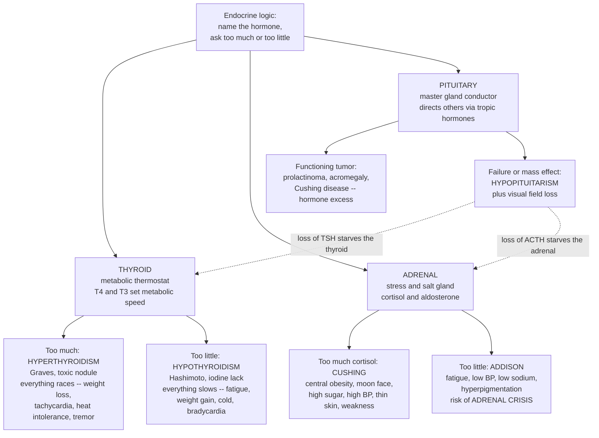

# 🦋 Thyroid, Adrenal, and Pituitary Disorders

> [!abstract] TL;DR
> The thyroid, adrenal, and pituitary glands are three of the body's master regulators, and their diseases all obey the same two-question logic introduced by endocrine pathophysiology: **name the hormone, then ask "too much or too little?"** The **thyroid** is the body's **metabolic thermostat** — its hormone (T4/T3) sets the speed of the whole metabolism, so *hyper*thyroidism makes everything race (weight loss, racing heart, heat intolerance, tremor) while *hypo*thyroidism makes everything slow (fatigue, weight gain, cold intolerance, sluggish thought). The **adrenal** glands handle **stress and salt/water balance**, chiefly through **cortisol** and **aldosterone**, so cortisol *excess* (Cushing) inflicts the ravages of chronic stress while cortisol *deficiency* (Addison) leaves the body unable to withstand stress at all — risking fatal collapse. The **pituitary** is the **master conductor** in the brain: when it grows a tumor or fails, the effects *cascade downstream* to every gland it commands. One further axis completes the framework — **primary** (the target gland itself is broken) versus **secondary** (the pituitary controller driving it is broken) — and reading a hormone *paired with its controlling tropic hormone* localizes the lesion. Common, body-wide, and highly treatable once recognized, these disorders are the endocrine hyper/hypo framework in living clinical action.

---

## Intuition

**Analogy — a tour of three control rooms, each with the same dial.** Imagine touring the plant that runs the body and stopping at three critical control rooms. Above the door of each is the same simple sign: *name the signal this room sends, then check whether the dial is turned too high or too low.* That single habit decodes almost everything you will see.

The first room is the **thyroid**, and its dial is a **thermostat** wired to the whole factory's tempo. Turn it up (hyperthyroidism) and every machine on the floor redlines — the furnace roars, belts whir too fast, the whole plant overheats and burns through fuel: a pounding heart, weight melting off, intolerance to heat, trembling hands, a racing anxious mind. Turn it down (hypothyroidism) and the factory idles too low — machines grind slowly, heat leaks away, output sags: crushing fatigue, weight creeping on, always feeling cold, a heartbeat gone sluggish, thought wading through mud.

The second room is the **adrenal**, perched atop the kidneys, and its master dial is **cortisol — the stress hormone** — with a second dial (aldosterone) for salt and water. Crank cortisol too high for too long (Cushing) and you get a body worn down by relentless stress: fat piling on the trunk and face, blood sugar climbing, skin gone thin and bruised, muscles wasting. Let it fall too low (Addison) and the plant loses its emergency generator entirely — it cannot rise to any crisis, blood pressure sinks, salt drains away, and a mere infection can trigger total collapse.

The third room is the **pituitary**, a pea-sized office deep in the brain that is the **conductor** — it sends tropic-hormone memos that tell the other glands how loud to play. It follows the same too-much/too-little logic (a hormone-secreting tumor blares one instrument; failure silences the orchestra), but with a twist: because it *directs the others*, its faults **cascade downstream**. If the conductor collapses, the thyroid and adrenal go quiet not because they are broken but because no one is telling them to play. Three rooms, one dial, one repeating lesson — and once you name the hormone and ask *too much or too little*, the sprawling, confusing symptoms snap into place.

---

## How It Works

### Core mechanics — hormone, feedback, and the primary/secondary distinction

Every one of these glands sits inside a **negative-feedback loop** run by the pituitary (and above it, the hypothalamus). The pituitary secretes a **tropic hormone** that tells the target gland to work; the target gland's hormone then circulates back to the pituitary and **turns the tropic signal down** once levels are high enough. This loop is the key to the whole subject:

1. **The thyroid axis.** The hypothalamus releases **TRH**, prompting the pituitary to release **TSH**, which drives the thyroid to make **T4 and T3** — the hormones that set basal metabolic rate. Rising T4/T3 feeds back to *suppress* TSH. So in a healthy person TSH and thyroid hormone move in **opposite directions** around a set point.
2. **The adrenal (cortisol) axis — the HPA axis.** The hypothalamus releases **CRH**, the pituitary releases **ACTH**, and the adrenal *cortex* makes **cortisol**, which feeds back to suppress CRH and ACTH. Cortisol also follows a strong **diurnal rhythm** (high on waking, low at night). A separate loop — the **renin-angiotensin-aldosterone system (RAAS)** — controls the cortex's **aldosterone** (sodium/potassium/blood pressure), and the adrenal *medulla* independently makes **catecholamines** (adrenaline).
3. **The pituitary as controller.** Because the pituitary commands the thyroid, adrenal cortex, gonads, and more, it is the **master gland**. Its own disorders therefore split into *hormone-secreting tumors* (a note played too loud) and *failure or mass effect* (the orchestra silenced).

**The localizing trick — read the pair.** Measuring a target hormone *alongside its controlling tropic hormone* tells you *where* the lesion is:

- **Primary disorder** = the **target gland** is the problem. Feedback is intact, so the tropic hormone swings the *opposite* way. Primary hypothyroidism: **low T4, HIGH TSH** (pituitary shouting at a deaf gland). Primary hyperthyroidism: **high T4, LOW TSH** (pituitary silenced by the flood).
- **Secondary disorder** = the **pituitary controller** is the problem. Now the tropic hormone and target hormone move the *same* way. Secondary hypothyroidism: **low T4 AND low TSH** (the boss stopped ordering). A TSH-secreting adenoma: **high T4 AND high TSH** (the boss won't stop ordering).

That single "on the feedback curve vs off it" reading is the spine of endocrine diagnosis.

### Flow / architecture



*Read top-down as the framework in action: one dial (too much or too little) applied to three glands. Note the dashed arrows — the pituitary's failure **cascades downstream**, silencing glands that are themselves perfectly healthy.*

---

## Key Concepts

### Secondary (intuitive)

- **The thyroid is a thermostat.** It sets how fast your body runs. Too much hormone and you overheat and burn out; too little and you slow down and feel cold and tired.
- **The adrenal glands are your stress-and-salt glands.** Cortisol helps you handle stress and keeps blood sugar up; too much wears the body down, too little leaves you unable to cope with any emergency.
- **The pituitary is the boss gland.** It sits in the brain and sends orders to the other glands. If the boss fails, the workers go quiet even though nothing is wrong with them.
- **The master question.** For any of them, first *name the hormone*, then ask *is there too much or too little?* — and the confusing list of symptoms suddenly makes sense.
- **Autoimmune themes.** The commonest thyroid diseases (Graves for "too much," Hashimoto for "too little") and the commonest Addison disease happen when the immune system mistakenly attacks the gland.

### Undergraduate (formal)

- **Hyperthyroidism (thyroid hormone excess).** Causes: **Graves disease** (autoantibodies that *stimulate* the TSH receptor — the classic cause, with **exophthalmos** and a diffuse goiter), toxic multinodular goiter, and toxic adenoma. Features are hypermetabolic: weight loss despite good appetite, **tachycardia/palpitations** and atrial fibrillation, heat intolerance and sweating, fine tremor, anxiety, warm moist skin, hyperreflexia. Labs: **low TSH, high free T4** (primary).
- **Hypothyroidism (thyroid hormone deficiency).** Causes: **Hashimoto (autoimmune) thyroiditis** (the commonest cause in iodine-replete regions), **iodine deficiency** (the leading cause worldwide), post-ablation/post-surgical, and drugs. Features are hypometabolic: fatigue, weight gain, cold intolerance, **bradycardia**, constipation, dry skin, slowed cognition, and in severe cases non-pitting **myxedema**. Congenital deficiency causes **cretinism** (irreversible neurodevelopmental impairment — hence newborn screening). Labs: **high TSH, low free T4** (primary).
- **Goiter and nodules.** *Goiter* = thyroid enlargement (from iodine deficiency, Graves, Hashimoto, or nodular disease). Nodules are common and usually benign; the concern is **thyroid cancer** (papillary being the most common and generally indolent). Evaluation pairs **TSH + free T4** with ultrasound and, when indicated, fine-needle aspiration.
- **Cushing syndrome (cortisol excess).** *Exogenous* (chronic glucocorticoid therapy — the most common cause overall) or *endogenous*: **Cushing disease** (a pituitary **ACTH**-secreting adenoma — the commonest endogenous cause), adrenal tumor, or ectopic ACTH. Features: **central obesity**, **moon face**, dorsocervical fat pad, purple abdominal **striae**, hyperglycemia, hypertension, **thin bruisable skin**, proximal muscle **weakness**, osteoporosis, mood change.
- **Adrenal insufficiency (cortisol +/- aldosterone deficiency).** **Addison disease** = *primary* adrenal failure (autoimmune destruction is commonest; also TB, hemorrhage). Cortisol *and* aldosterone fall: fatigue, weight loss, **hypotension**, salt craving, **hyponatremia** and hyperkalemia, and — uniquely in the primary form — **hyperpigmentation** (because high ACTH shares a precursor with melanocyte-stimulating hormone). **Adrenal crisis** is an acute, life-threatening collapse (shock, hypoglycemia) precipitated by stress in an insufficient patient.
- **Other adrenal disorders.** **Primary hyperaldosteronism (Conn syndrome)** — aldosterone excess causing hypertension with hypokalemia; a treatable cause of secondary hypertension. **Pheochromocytoma** — a catecholamine-secreting medullary tumor causing episodic hypertension, headache, palpitations, and sweating.
- **Pituitary disorders.** **Adenomas** are the core: *functioning* tumors oversecrete one hormone — **prolactinoma** (most common; galactorrhea, infertility), **acromegaly/gigantism** (growth hormone excess), or **Cushing disease** (ACTH). *Non-functioning* adenomas cause **mass effect** — classically **bitemporal visual field loss** from compression of the optic chiasm — and **hypopituitarism**. **Hypopituitarism** = deficiency of one or many tropic hormones, producing *secondary* failure of the downstream glands. The **posterior pituitary** stores **ADH**: too little causes **diabetes insipidus** (dilute polyuria), too much causes **SIADH** (water retention, hyponatremia).

### Graduate (mechanistic and systems)

- **Feedback topology localizes the lesion.** The paired-hormone reading is a direct probe of the control loop. In a *primary* disorder the effector gland is broken but the controller (pituitary) responds correctly, so the operating point stays **on the negative-feedback curve** — TSH and T4 anti-correlated. In a *secondary* disorder the controller itself is deranged, so the point falls **off the curve** — the pathognomonic "inappropriately normal or same-direction" tropic hormone. This is why an "inappropriately normal" TSH beside a clearly abnormal free T4 is a red flag for central (pituitary/hypothalamic) disease.
- **Receptor-level pathophysiology.** Graves disease is a **type II hypersensitivity** in which agonist autoantibodies (TSI/TRAb) *mimic* TSH and continuously stimulate the receptor, escaping feedback entirely — a striking case of the immune system hijacking a signaling loop. Contrast Hashimoto, where cytotoxic and antibody-mediated destruction (anti-TPO) *removes* the effector. Same organ, opposite direction, both autoimmune.
- **The HPA axis and glucocorticoid biology.** Cortisol is a permissive stress hormone acting through the glucocorticoid receptor to raise glucose (gluconeogenesis), restrain immunity, and maintain vascular tone. Chronic excess explains Cushing's phenotype mechanistically: catabolism (thin skin, myopathy, osteoporosis), insulin antagonism (hyperglycemia), and mineralocorticoid spillover (hypertension). The **dexamethasone suppression test** and diurnal salivary cortisol probe whether the feedback loop can still be switched off — a functional, not merely static, assay.
- **Diurnal rhythm as a diagnostic signal.** Healthy cortisol peaks near waking and troughs near midnight. **Loss of the nocturnal nadir** — an elevated late-night cortisol — is an early and sensitive sign of Cushing, illustrating that *the shape of a rhythm*, not just an average level, encodes endocrine health.
- **Why symptoms are nonspecific and diseases are missed.** Because thyroid and cortisol act on essentially every tissue, their disorders present as diffuse, multisystem complaints (fatigue, weight change, mood change) that mimic far commoner conditions. This makes them the archetypal "great masqueraders" — the reason a low threshold to check **TSH** and, when indicated, cortisol dynamics is a core clinical habit.
- **Reserve and the crisis concept.** Endocrine glands carry large functional reserve, so deficiency stays hidden until a stressor (infection, surgery, trauma) demands the surge the failing gland cannot deliver — the mechanism of **adrenal crisis** and **myxedema coma**. Health "looks normal" until the loop is stress-tested, a recurring theme in pathophysiology's idea of depleted reserve.

---

## Python Demo

```python
# Two windows onto thyroid/adrenal/pituitary disease, both driven by feedback logic:
#   (a) THYROID FEEDBACK & STATES: a healthy pituitary sets TSH as a DECREASING
#       function of free-T4 (negative feedback). PRIMARY disorders keep the gland's
#       operating point ON that curve (TSH and T4 anti-correlated); SECONDARY /
#       pituitary disorders fall OFF the curve (TSH and T4 move the SAME way). Where
#       a patient's paired [free-T4, TSH] point lands localizes the lesion.
#   (b) CORTISOL RHYTHM: the diurnal cortisol curve -- NORMAL (peak on waking, trough
#       at night), CUSHING (elevated + FLATTENED, the lost nocturnal nadir), and
#       ADDISON (low + flat). The SHAPE of the rhythm, not just the level, carries
#       the diagnosis.
import numpy as np
import matplotlib.pyplot as plt

# ---------------- (a) Thyroid feedback curve and disease states ----------------
fT4 = np.linspace(0.2, 4.2, 300)                 # free T4 (arbitrary clinical units)
# Healthy pituitary TSH response: high TSH when T4 is low, suppressed when T4 is high
tsh_curve = 12.0 * np.exp(-1.35 * (fT4 - 1.2))   # negative-feedback set-point locus
normal_t4 = (0.8, 1.8)                            # normal free-T4 band
normal_tsh = (0.4, 4.0)                           # normal TSH band

# Representative patient states: (free_T4, TSH, label, colour, on/off feedback curve)
states = [
    (1.2,  2.0, "Normal",                        "#2c3e50"),
    (3.4,  0.05, "Primary HYPERthyroid\n(Graves): high T4, low TSH", "#C0392B"),
    (0.45, 9.0, "Primary HYPOthyroid\n(Hashimoto): low T4, high TSH", "#2980B9"),
    (0.45, 0.15,"Secondary HYPOthyroid\n(pituitary fails): both LOW", "#8E44AD"),
    (3.2,  8.0, "Secondary HYPERthyroid\n(TSH-oma): both HIGH",        "#E67E22"),
]

fig, (ax1, ax2) = plt.subplots(1, 2, figsize=(15, 6))

ax1.plot(fT4, tsh_curve, color="#27AE60", lw=2.2,
         label="Healthy feedback curve\n(primary disorders lie ON it)")
ax1.axvspan(*normal_t4, color="#2ecc71", alpha=0.10)
ax1.axhspan(*normal_tsh, color="#2ecc71", alpha=0.10)
ax1.text(1.3, 4.3, "normal box", color="#27AE60", fontsize=8)

for t4, tsh, label, col in states:
    ax1.scatter([t4], [tsh], s=90, color=col, zorder=5, edgecolor="white")
    ax1.annotate(label, (t4, tsh), textcoords="offset points",
                 xytext=(8, 6), fontsize=7.5, color=col)

ax1.set_yscale("log")
ax1.set_xlabel("Free T4  (low  <-------->  high)")
ax1.set_ylabel("TSH  (log scale)")
ax1.set_title("(a) Read the PAIR: on-curve = primary, off-curve = pituitary")
ax1.legend(loc="upper right", fontsize=8)
ax1.grid(alpha=0.3, which="both")

# ---------------- (b) Diurnal cortisol rhythm across states ----------------
hours = np.linspace(0, 24, 300)
# Normal rhythm: peak ~8am (waking), trough ~midnight
normal   = 8.0 + 9.0 * np.exp(-0.5 * ((hours - 8.0) / 3.2) ** 2)
cushing  = 20.0 + 3.0 * np.exp(-0.5 * ((hours - 8.0) / 6.0) ** 2)  # high + flattened
addison  = 2.2 + 0.6 * np.exp(-0.5 * ((hours - 8.0) / 3.2) ** 2)   # low + flat

ax2.plot(hours, normal,  color="#27AE60", lw=2.2, label="Normal: peak on waking, low at night")
ax2.plot(hours, cushing, color="#C0392B", lw=2.2, label="Cushing: elevated + FLATTENED (lost nadir)")
ax2.plot(hours, addison, color="#2980B9", lw=2.2, label="Addison: low and flat")
ax2.axvspan(0, 6, color="grey", alpha=0.08)
ax2.axvspan(22, 24, color="grey", alpha=0.08)
ax2.text(1.0, 22, "night", color="grey", fontsize=8)
ax2.set_xlabel("Hour of day")
ax2.set_ylabel("Plasma cortisol (arbitrary units)")
ax2.set_title("(b) Cortisol rhythm: the SHAPE encodes the diagnosis")
ax2.set_xlim(0, 24)
ax2.set_xticks(range(0, 25, 4))
ax2.legend(loc="upper right", fontsize=8)
ax2.grid(alpha=0.3)

plt.tight_layout()
plt.show()

# --- Print the localizing logic that panel (a) encodes ---
def localize(fT4_val, tsh_val):
    lo_t4, hi_t4 = normal_t4
    lo_tsh, hi_tsh = normal_tsh
    hyper = fT4_val > hi_t4
    hypo  = fT4_val < lo_t4
    if not (hyper or hypo):
        return "Euthyroid (normal T4)"
    # In PRIMARY disease TSH moves OPPOSITE to T4; SAME direction implies pituitary
    if hyper and tsh_val < lo_tsh:  return "Primary HYPERthyroidism (low TSH)"
    if hypo  and tsh_val > hi_tsh:  return "Primary HYPOthyroidism (high TSH)"
    if hypo  and tsh_val < lo_tsh:  return "Secondary/central HYPOthyroidism (pituitary)"
    if hyper and tsh_val > hi_tsh:  return "Secondary HYPERthyroidism (TSH-secreting adenoma)"
    return "Inappropriate TSH -- suspect central disease"

for t4, tsh, label, _ in states:
    print(f"free-T4={t4:4.2f}, TSH={tsh:5.2f}  ->  {localize(t4, tsh)}")
```

**What you see.** *Panel (a)* turns the whole diagnostic method into geometry. The green curve is where a **healthy pituitary** parks the thyroid: high TSH when T4 is low, suppressed TSH when T4 is high. **Primary** disorders (Graves in red, Hashimoto in blue) sit *on* this curve — the gland is broken but the controller is responding correctly, so TSH and T4 point in opposite directions. **Secondary/pituitary** disorders (purple, orange) fall *off* the curve because the controller itself is deranged, and TSH and T4 move the *same* way. The `localize()` function prints exactly that rule. *Panel (b)* shows that a hormone level is not just a number but a **rhythm**: the healthy green curve peaks on waking and bottoms out at night, Cushing's red curve is both elevated and **flattened** (the earliest, most sensitive sign is that lost midnight trough), and Addison's blue curve is uniformly low. Shape, not just height, is the signal.

---

## Real-World Applications

- **The thyroid panel as a front-line screen.** A single **TSH** (reflexed to free T4) is one of the most ordered blood tests in medicine, precisely because thyroid disease is common, body-wide, and easily missed — and because the paired reading instantly separates hyper- from hypo- and primary from central.
- **Newborn screening for congenital hypothyroidism.** Because untreated congenital deficiency causes irreversible **cretinism**, virtually every developed health system screens neonatal TSH/T4 — a landmark of preventive medicine that converts a devastating disability into a treated non-event.
- **Iodine fortification.** Iodizing salt is one of public health's great successes, eliminating endemic goiter and iodine-deficiency hypothyroidism across whole populations — nutrition acting directly on an endocrine axis.
- **Dynamic endocrine testing.** Clinicians probe the *loop*, not just the level: the **dexamethasone suppression test** and late-night salivary cortisol confirm Cushing; the **ACTH (Synacthen) stimulation test** confirms Addison; a water-deprivation test separates diabetes insipidus from primary polydipsia.
- **Steroid-sickness awareness and stress dosing.** Patients on long-term glucocorticoids develop iatrogenic Cushing *and* a suppressed HPA axis, so they need **stress-dose steroids** during illness or surgery to prevent adrenal crisis — a direct clinical application of feedback and reserve.
- **Pituitary surgery and imaging.** MRI of the sella and trans-sphenoidal surgery treat adenomas; documenting **bitemporal hemianopia** at the bedside can be the first clue that a pituitary mass is compressing the optic chiasm.
- **Highly treatable once named.** Levothyroxine replaces thyroid hormone, antithyroid drugs/radioiodine/surgery curb excess, hydrocortisone/fludrocortisone replace adrenal hormones, and dopamine agonists shrink prolactinomas — a field where correct diagnosis reliably converts to effective treatment.

---

## Common Pitfalls

- **Forgetting to read the tropic hormone.** Interpreting a free T4 or a cortisol *alone* discards the information that localizes the lesion. The **pair** (T4 with TSH, cortisol with ACTH) is what distinguishes a broken gland from a broken controller.
- **The "inappropriately normal" trap.** A mid-range TSH looks reassuring, but beside a clearly abnormal free T4 it is a red flag for **central (pituitary/hypothalamic) disease** — the controller is failing to respond. Normal is only reassuring if it is *appropriate*.
- **Averaging away a rhythm.** A single random cortisol can be normal in Cushing because the disease first shows up as a **lost nocturnal trough**. Timing matters: late-night sampling and suppression testing, not one daytime draw, make the diagnosis.
- **Mistaking a compensation for the disease.** Hyperpigmentation in Addison, or a sky-high TSH in primary hypothyroidism, is the pituitary *doing its job* — a marker of where the fault lies, not the fault itself.
- **Missing adrenal crisis.** Because deficiency hides behind reserve, the first presentation can be a life-threatening crisis unmasked by an infection or surgery. Any hypotensive, hyponatremic, unexpectedly-not-recovering patient on (or recently off) steroids warrants the thought.
- **Over-treating subclinical disease.** A mildly abnormal TSH with normal free T4 is often best monitored, not immediately treated; pushing numbers to "perfect" can cause iatrogenic hyper- or hypothyroid symptoms.
- **Attributing everything to the thyroid.** Because thyroid symptoms are nonspecific (fatigue, weight change, mood), a normal TSH should redirect the search rather than prompt endless retesting — the mirror-image error of missing it.

---

## Related Concepts

**Within this vault (Section 03 and the foundations — prose references to sibling notes).** This note is one stop on a larger tour. **Endocrine Pathophysiology** is the section opener that establishes the two-question framework this note applies — *name the hormone, ask too much or too little,* plus the primary/secondary axis — and should be read first. **Diabetes Mellitus and Glucose Regulation** is the sibling that works the same logic on insulin, and it intersects here repeatedly: cortisol excess in Cushing causes hyperglycemia, while adrenal crisis and hypopituitarism can cause hypoglycemia. **Renal Pathophysiology and Kidney Disease** shares the aldosterone/RAAS and sodium-water machinery: primary hyperaldosteronism, Addison's salt wasting, and ADH disorders (diabetes insipidus, SIADH) all live at the endocrine-renal border. **Hypertension and Vascular Disease** is the downstream consequence of several disorders here — Cushing, Conn syndrome, and pheochromocytoma are the classic *endocrine (secondary) causes* of high blood pressure. And **Immune Dysfunction and Autoimmunity** explains the mechanism behind the commonest thyroid and adrenal diseases: Graves, Hashimoto, and autoimmune Addison are all failures of self-tolerance targeting an endocrine gland. All five are prose references to companion notes in the Clinical Medicine vault.

**Across the vault (Glob-verified links).**

- [[Biology/09_Human_Physiology_and_Anatomy/The_Endocrine_System_and_Hormones|The Endocrine System and Hormones]] — the biological substrate this note presupposes: hormone classes, receptors, and the negative-feedback loops that these diseases break.
- [[Clinical_Medicine/01_Foundations_of_Disease_and_Pathophysiology/Clinical_Medicine_and_Pathophysiology_Overview|Clinical Medicine and Pathophysiology Overview]] — the vault's hub, framing disease as regulation lost and reserve depleted — exactly the lens used here.
- [[Health_Nutrition_and_Longevity/04_Sleep_Stress_and_Mental_Wellbeing/Stress_and_the_Stress_Response|Stress and the Stress Response]] — the healthy HPA axis and cortisol biology whose *dysregulation* produces Cushing and Addison.
- [[Health_Nutrition_and_Longevity/04_Sleep_Stress_and_Mental_Wellbeing/Sleep_Science_and_Circadian_Rhythms|Sleep Science and Circadian Rhythms]] — the diurnal clock that shapes the cortisol rhythm whose flattening is an early sign of Cushing.
- [[Health_Nutrition_and_Longevity/01_Foundations_of_Health/Metabolism_and_Energy_Balance|Metabolism and Energy Balance]] — the basal-metabolic-rate machinery that thyroid hormone tunes up in hyperthyroidism and down in hypothyroidism.
- [[Health_Nutrition_and_Longevity/02_Nutrition_Science/Micronutrients_Vitamins_and_Minerals|Micronutrients Vitamins and Minerals]] — iodine as the raw material for thyroid hormone and the nutritional root of the world's commonest hypothyroidism and goiter.
- [[Neuroscience/03_Systems_Neuroscience/Autonomic_Nervous_System|Autonomic Nervous System]] — the sympathetic system and adrenal-medullary catecholamines behind pheochromocytoma and much of the hyperthyroid phenotype.
- [[Neuroscience/02_Neuroanatomy_and_Brain_Structure/Limbic_System_and_Diencephalon|Limbic System and Diencephalon]] — the hypothalamus that sits atop every axis here, releasing TRH and CRH to command the pituitary conductor.
- [[Biology/11_Microbiology_and_Immunology/The_Adaptive_Immune_System|The Adaptive Immune System]] — the self-tolerance machinery whose failure drives Graves, Hashimoto, and autoimmune Addison disease.

---

## Review Questions

**Secondary.** Using the thermostat analogy, explain the difference between an overactive and an underactive thyroid, and give two symptoms you would expect from each. Why does it make sense that the pituitary is called the "master gland," and what happens to the thyroid if the pituitary stops sending its signal?

**Undergraduate.** A patient has a **low free T4**. In one case the **TSH is very high**; in another the **TSH is low**. Explain what each pattern tells you about *where* the problem is (the thyroid gland itself vs the pituitary), and name a likely cause for each. Then contrast the clinical pictures of **Cushing syndrome** and **Addison disease**, and explain why Addison — but not Cushing disease — causes hyperpigmentation.

**Graduate.** Frame the thyroid axis as a negative-feedback control loop and explain why *primary* disorders keep the operating point "on the feedback curve" while *secondary* disorders fall "off" it — and how this justifies always measuring TSH alongside free T4. Then explain the concept of **endocrine reserve**: why can a patient with adrenal insufficiency appear well at rest yet collapse into adrenal crisis during an infection, and what does this imply about how endocrine deficiency should be tested and managed around physiological stress?

---

## Sources

- Loscalzo, J., Fauci, A., Kasper, D., et al. (eds.). *Harrison's Principles of Internal Medicine* (21st ed.). McGraw-Hill — chapters on thyroid, adrenal cortex, and anterior/posterior pituitary disorders.
- Melmed, S., Auchus, R. J., Goldfine, A. B., Koenig, R. J., & Rosen, C. J. (eds.). *Williams Textbook of Endocrinology* (14th ed.). Elsevier — the definitive reference on endocrine axes, feedback, and gland disease.
- Hall, J. E., & Hall, M. E. *Guyton and Hall Textbook of Medical Physiology* (14th ed.). Elsevier — the physiology of thyroid hormone, cortisol, the HPA axis, and pituitary control.
- Kumar, V., Abbas, A. K., & Aster, J. C. *Robbins & Cotran Pathologic Basis of Disease* (10th ed.). Elsevier — the pathology of the endocrine system, including Graves, Hashimoto, Cushing, Addison, and pituitary adenomas.
- Bornstein, S. R., et al. (2016). "Diagnosis and Treatment of Primary Adrenal Insufficiency: An Endocrine Society Clinical Practice Guideline." *Journal of Clinical Endocrinology & Metabolism*, 101(2), 364–389 — modern guidance on adrenal insufficiency and crisis.

---

#clinical-medicine #thyroid #adrenal #pituitary #endocrine-disorders
