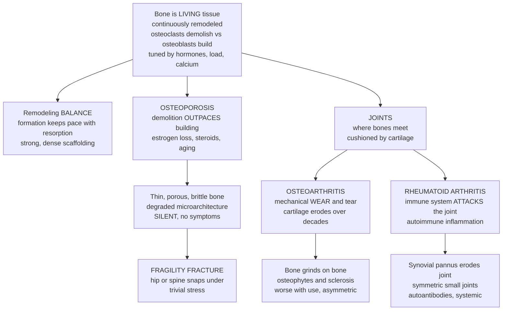

# 🦴 Musculoskeletal and Bone Disease

> [!abstract] TL;DR
> **Musculoskeletal disease** is the study of how the body's living scaffolding — its **bones**, and the **joints** where they meet — fails. The first key idea overturns the intuition that bone is inert like a steel girder: bone is **living tissue**, continuously torn down by **osteoclasts** and rebuilt by **osteoblasts** in a lifelong cycle called **remodeling**, tuned by hormones (PTH, vitamin D, calcitonin, **estrogen**), mechanical load, and calcium balance. **Osteoporosis** is what happens when the demolition crew outpaces the construction crew: bone is resorbed faster than it is laid down, so the scaffolding grows thin, porous, and brittle — **silently**, until it snaps under trivial stress in a **fragility fracture** of hip or spine (hip fracture is a leading cause of disability and death in the elderly, and post-menopausal women are most at risk as estrogen's protection fades). The second key idea is that **joints fail in two opposite ways** that produce the *same* symptom — a painful joint — but demand *entirely different* treatment. **Osteoarthritis** is mechanical **wear-and-tear**: the cartilage cushion erodes over decades of use until bone grinds on bone. **Rheumatoid arthritis** is the mirror image — an **autoimmune** attack in which the immune system inflames and destroys the joint from within. Add defective mineralization (**osteomalacia/rickets** from vitamin-D deficiency), crystal disease (**gout**), muscle disorders (**myopathies, dystrophies**), and **fractures and bone infection**, and you have the whole terrain. Because these disorders are the world's **leading cause of disability and chronic pain**, the master skill is diagnostic: *worn-out or attacked; too little bone or badly mineralized bone; mechanical or inflammatory* — the answer routes the entire treatment.

---

## Intuition

**Analogy — your skeleton is living scaffolding maintained by a permanent repair crew, and your joints are the hinges where the scaffolding meets.** Picture a great building whose steel frame is *not* inert. A crew works on it around the clock: a **demolition team** that chips out old, fatigued metal, and a **construction team** that rivets in fresh beams right behind them. As long as the two crews stay balanced, the frame is not merely maintained — it is *renewed*, molecule by molecule, so that today's skeleton is literally rebuilt from yesterday's. This is **bone remodeling**: osteoclasts demolish, osteoblasts rebuild, and hormones and daily mechanical strain act as the site foreman directing where to reinforce and where to thin out.

Now imagine the foreman's instructions drift. If the **demolition team outworks the construction team** — as happens when estrogen's restraining hand is withdrawn at menopause, or when steroid drugs suppress the builders — the frame is dismantled faster than it is rebuilt. Beams thin, cross-braces disappear, and the once-solid lattice becomes a fragile honeycomb. Nothing hurts; the building looks fine from the street. Then one ordinary day it takes an ordinary load — a small stumble, a cough — and a beam simply **snaps**. That silent hollowing followed by a sudden break is **osteoporosis** and its **fragility fracture**.

The **joints** are the hinges where two beams meet, and a smooth pad of **cartilage** keeps them from grinding. These hinges fail two utterly different ways. In the first, decades of use simply **wear the pad away** until raw metal scrapes on raw metal — creaking, stiffening, roughening with age. That is **osteoarthritis**, mechanical wear-and-tear. In the second, the building's own **security system malfunctions and attacks its own hinges**, swarming them with inflammation that swells and erodes the joint from the inside. That is **rheumatoid arthritis**, an autoimmune disease. Same complaint from the tenant — "this hinge hurts" — but one hinge is *worn out* and the other is *under attack*, and telling them apart is the classic clinical skill of this whole domain. **Living scaffolding that is constantly rebuilt, and joints that either wear out or get attacked: that is the core of musculoskeletal disease.**

---

## How It Works

### Core mechanics — remodeling, its collapse, and the two faces of arthritis

1. **Bone is dynamic living tissue.** A **basic multicellular unit** couples two cell teams: **osteoclasts** (bone-marrow-derived, multinucleated) dissolve mineral and digest matrix, while **osteoblasts** deposit new **osteoid** (collagen) that then **mineralizes** with calcium-phosphate (hydroxyapatite). **Osteocytes** — retired osteoblasts entombed in the matrix — act as the mechanical sensors that tell the crew where load is high and repair is needed. The whole skeleton turns over roughly every decade.
2. **Remodeling is hormonally and mechanically governed.** **Parathyroid hormone (PTH)** raises blood calcium by driving resorption; **vitamin D** enables gut absorption of calcium and phosphate needed to mineralize new bone; **calcitonin** restrains osteoclasts; **estrogen** brakes resorption (its loss is the engine of post-menopausal bone loss). **Mechanical load** stimulates formation ("use it or lose it"), which is why immobilization and weightlessness thin bone. This ties bone directly to the **endocrine** and **renal** systems that manage calcium and vitamin D.
3. **Peak bone mass then lifelong decline set the risk.** Bone mass climbs through childhood to a **peak in the third decade**, plateaus, then declines. Two levers determine whether a person crosses the fracture threshold: **how high the peak** (set by genetics, nutrition, and exercise in youth) and **how fast the loss** (accelerated by menopause, steroids, inactivity, and age). Osteoporosis is a **quantitative** disease of *too little* otherwise-normal bone plus degraded **microarchitecture**.
4. **Osteoporosis — resorption outpaces formation.** *Primary*: **post-menopausal** (estrogen withdrawal unleashes osteoclasts) and **senile** (age-related decline in osteoblast function, calcium/vitamin-D deficiency, secondary hyperparathyroidism). *Secondary*: **glucocorticoid** therapy (the commonest secondary cause), hyperthyroidism, hyperparathyroidism, hypogonadism, immobilization. The result is silent bone loss diagnosed by **bone-density scanning (DXA, the T-score)** — often only *after* a **fragility fracture** of vertebra, hip, or wrist.
5. **Other metabolic bone disease.** **Osteomalacia** (adults) and **rickets** (growing children) are diseases of **defective mineralization** — enough matrix but not enough mineral, chiefly from **vitamin-D deficiency** — producing soft, bendable bone (a *qualitative* defect, contrasting with osteoporosis's *quantitative* loss). **Paget disease** is disordered, frenzied remodeling producing thick but structurally chaotic bone. **Renal osteodystrophy** is the skeletal wreckage of chronic kidney disease disturbing phosphate, vitamin-D activation, and PTH.
6. **Osteoarthritis — mechanical joint failure.** The most common arthritis: progressive **cartilage breakdown** under mechanical stress in **weight-bearing** and heavily used joints (knee, hip, spine, base of thumb). Cartilage fibrillates and thins, the exposed bone hardens (**sclerosis**) and throws up bony spurs (**osteophytes**). It is **degenerative**, age-related, **asymmetric**, with pain that **worsens with use** and brief morning stiffness. Inflammation is present but secondary — this is a joint *worn out*.
7. **Rheumatoid arthritis — autoimmune joint failure.** A chronic **systemic autoimmune** disease in which immune cells invade the **synovium**, forming an inflamed, invasive tissue called **pannus** that erodes cartilage and bone. It targets **small joints symmetrically** (hands, wrists, feet), causes **prolonged morning stiffness** that eases with use, and carries **autoantibodies** (rheumatoid factor, anti-CCP) and systemic features. This is a joint *under attack* — linking to autoimmunity, and treated by **immunosuppression**, not lubrication.
8. **Crystal, muscle, and structural disease.** **Gout** deposits **monosodium urate crystals** in joints (a metabolic disorder of urate handling), igniting acute inflammatory attacks. **Myopathies** and **muscular dystrophies** (the latter genetic, e.g., dystrophin defects) weaken the muscle that moves the skeleton; **myositis** is inflammatory. **Tendinopathy** and **sprains** injure the connective tissue anchoring the system. **Fractures** heal through the tissue-repair cascade (hematoma → soft callus → hard callus → remodeling), and **osteomyelitis** is bone infection.

### From living bone to the two arthritides — one map



*The trunk is the single idea that reorganizes everything: bone is alive and always being remodeled. Slide the balance toward resorption and you get the silent thinning of osteoporosis that ends in a fragility fracture. Follow the branch to the joints and the tree forks into the two arthritides that look alike but are opposites — cartilage **worn out** in osteoarthritis versus a joint **attacked** in rheumatoid arthritis.*

---

## Key Concepts

### Secondary (intuitive)

- **Bone is alive.** A demolition crew (**osteoclasts**) and a building crew (**osteoblasts**) constantly tear down and rebuild your skeleton — this is **remodeling**.
- **Osteoporosis = losing bone faster than you make it.** The scaffolding turns thin and brittle **silently**, until it **breaks under trivial stress** (a **fragility fracture** of the hip or spine). Most common after **menopause**, when protective estrogen falls.
- **Calcium and vitamin D build bone.** Too little vitamin D leaves bone soft and poorly mineralized (**rickets** in children, **osteomalacia** in adults).
- **Osteoarthritis = worn-out joint.** Decades of use grind away the **cartilage** cushion until **bone rubs on bone** — the common "arthritis" of aging, worst in knees, hips, and hands.
- **Rheumatoid arthritis = attacked joint.** The **immune system mistakenly attacks the joints**, inflaming and destroying them — an **autoimmune** disease, not simple wear.
- **Same symptom, opposite causes.** A painful joint can be *worn out* or *under attack*; telling them apart decides the treatment.

### Undergraduate (formal)

- **The remodeling unit and its regulation.** Coupled osteoclast resorption and osteoblast formation in a basic multicellular unit; the **RANKL–RANK–OPG** axis is the master switch (RANKL drives osteoclasts; osteoprotegerin, OPG, blocks them). **PTH**, **1,25-dihydroxyvitamin D**, **calcitonin**, **estrogen**, and mechanical strain sensed by **osteocytes** set the balance and maintain calcium–phosphate homeostasis with gut and kidney.
- **Osteoporosis: quantitative bone loss.** Defined by low bone mass and microarchitectural deterioration; diagnosed by **DXA T-score** (≤ −2.5 = osteoporosis; −1 to −2.5 = osteopenia) or by a fragility fracture. Determinants are **peak bone mass** and **rate of loss**; primary (post-menopausal, senile) vs secondary (glucocorticoids, endocrine, immobilization). Bone chemistry (calcium, phosphate, ALP) is characteristically **normal** — contrast with osteomalacia.
- **Osteomalacia vs osteoporosis.** Osteomalacia is a **qualitative** mineralization defect (excess unmineralized osteoid) from vitamin-D deficiency or phosphate disorders, with **low calcium/phosphate, high PTH and ALP**; osteoporosis is a **quantitative** loss of normally mineralized bone with normal chemistry. The distinction changes treatment (vitamin D vs anti-resorptives).
- **Osteoarthritis pathology.** Chondrocyte-driven imbalance of cartilage matrix synthesis and degradation (matrix metalloproteinases), fibrillation and loss of articular cartilage, subchondral **sclerosis**, **osteophytes**, and joint-space narrowing. Clinically: mechanical pain worse with activity, **short** morning stiffness (< 30 min), Heberden/Bouchard nodes, asymmetric large weight-bearing joints.
- **Rheumatoid arthritis pathology.** CD4 T-cell– and B-cell–driven synovitis; hyperplastic, angiogenic **pannus** rich in TNF-α, IL-1, IL-6 erodes cartilage and marginal bone; **RF** and **anti-CCP** autoantibodies; **symmetric small-joint** disease with **prolonged** morning stiffness (> 1 h) that improves with use, plus systemic and extra-articular features.
- **The inflammatory-vs-mechanical distinction.** Timing (morning stiffness duration), pattern (symmetric small joints vs asymmetric weight-bearing), systemic signs, and labs (ESR/CRP, autoantibodies, synovial-fluid analysis) separate **inflammatory** arthritis (RA, gout, spondyloarthritis) from **mechanical/degenerative** OA — the single most useful clinical sorting step.

### Graduate (mechanistic and systems)

- **Estrogen, RANKL, and the menopausal cliff.** Estrogen restrains osteoclastogenesis partly by suppressing RANKL and pro-resorptive cytokines (IL-1, IL-6, TNF) and promoting osteoclast apoptosis. Its abrupt withdrawal at menopause **uncouples** the remodeling unit toward resorption, producing an accelerated phase of loss superimposed on slow age-related decline — the mechanistic basis for treating with anti-resorptives (bisphosphonates, denosumab, an anti-RANKL antibody) versus anabolic agents (teriparatide, romosozumab) that push formation.
- **Coupling and the drug-target logic.** Because resorption and formation are physically and biochemically **coupled**, potent anti-resorptives also blunt formation, capping their gains and producing rare paradoxes (atypical femoral fractures, osteonecrosis of the jaw with prolonged suppression). Anabolics exploit intermittent PTH signaling and Wnt/sclerostin biology to *uncouple* toward formation — a systems view of why sequencing and drug holidays matter.
- **RA as a break in immune tolerance.** A gene–environment interaction (HLA-DR **shared epitope**, smoking, mucosal/microbiome triggers) drives **citrullination** of self-proteins and anti-CCP autoantibodies years before symptoms; the synovium becomes a self-sustaining inflammatory organ. Cytokine-targeted biologics (**anti-TNF, anti-IL-6R, anti-CD20, JAK inhibitors**) validate the specific pathways — a direct clinical readout of autoimmune mechanism, and the reason RA and OA diverge completely in management.
- **OA as whole-joint mechanobiology, not passive wear.** Modern models reframe OA as active, aberrant repair: mechanical overload and injury shift chondrocytes to a catabolic, hypertrophic, senescent phenotype (SASP, matrix metalloproteinases, ADAMTS aggrecanases), with subchondral bone and low-grade synovial inflammation participating. This explains why "wear-and-tear" oversimplifies and why disease-modifying OA drugs remain elusive.
- **Calcium homeostasis as a systems constraint on the skeleton.** The skeleton is the body's calcium reservoir; when serum calcium falls, PTH mobilizes bone before the skeleton's own integrity — chronic secondary hyperparathyroidism (vitamin-D deficiency, chronic kidney disease) sacrifices bone to defend plasma calcium, linking **renal**, **endocrine**, and **nutritional** physiology to fracture risk (renal osteodystrophy, senile osteoporosis).
- **Fracture as an epidemiological endpoint.** Bone mineral density is a continuous risk factor: fracture risk rises roughly **exponentially** as BMD falls (about a doubling per standard-deviation decrease) and is **multiplied by age** and prior fracture, motivating absolute-risk tools (e.g., FRAX) over any single threshold — the quantitative logic modeled in the demo below.

---

## Python Demo

```python
# Musculoskeletal and bone disease -- two quantitative pictures.
#   (a) BONE MASS OVER LIFE: bone is living tissue whose mass is the running balance of
#       FORMATION (osteoblasts) minus RESORPTION (osteoclasts). Mass climbs to a PEAK in
#       young adulthood, plateaus, then declines -- with an ACCELERATED drop after menopause
#       when estrogen's brake is released. We compare two people to show why BOTH the peak
#       and the RATE OF LOSS decide who crosses the osteoporosis fracture threshold.
#   (b) FRACTURE RISK: fracture is not a threshold but a continuous risk that rises roughly
#       EXPONENTIALLY as bone density falls (about a doubling per standard-deviation drop in
#       the DXA T-score) and is MULTIPLIED by age. We plot 10-year major-fracture probability
#       vs T-score for three ages, marking the T = -2.5 osteoporosis line.
import numpy as np
import matplotlib.pyplot as plt

# ---------- (a) Bone mineral density across the lifespan ----------
ages = np.linspace(10, 90, 400)

def bmd_curve(ages, peak=1.05, meno=50.0, accel_rate=0.020, senile_rate=0.006,
              plateau_loss=0.0018, base=0.55):
    """Bone mineral density (g/cm^2) over life.
       Rising phase (to age 30) -> peak -> slow plateau loss -> post-menopausal
       accelerated loss for ~10 yr -> slower senile loss thereafter."""
    b = np.empty_like(ages)
    for i, a in enumerate(ages):
        if a <= 30:
            frac = 1.0 / (1.0 + np.exp(-(a - 16.0) / 4.0))   # logistic rise to peak
            b[i] = base + (peak - base) * frac
        elif a <= meno:
            b[i] = peak - plateau_loss * (a - 30.0)
        elif a <= meno + 10.0:
            b_meno = peak - plateau_loss * (meno - 30.0)
            b[i] = b_meno - accel_rate * (a - meno)          # menopausal cliff
        else:
            b_meno = peak - plateau_loss * (meno - 30.0)
            b_accel = b_meno - accel_rate * 10.0
            b[i] = b_accel - senile_rate * (a - (meno + 10.0))
    return b

# Person A: high peak, gentle loss (protected -- good peak mass, no estrogen cliff)
bmd_A = bmd_curve(ages, peak=1.15, accel_rate=0.006, senile_rate=0.006, plateau_loss=0.0015)
# Person B: lower peak, steep post-menopausal + senile loss (post-menopausal, at risk)
bmd_B = bmd_curve(ages, peak=0.92, accel_rate=0.022, senile_rate=0.008, plateau_loss=0.0022)

# DXA thresholds: T = (BMD - young_adult_mean) / SD ; osteoporosis at T = -2.5
ya_mean, ya_sd = 1.05, 0.12
op_thresh  = ya_mean - 2.5 * ya_sd   # osteoporosis  (T = -2.5)
opn_thresh = ya_mean - 1.0 * ya_sd   # osteopenia    (T = -1.0)

def crossing_age(ages, bmd, level):
    below = np.where(bmd < level)[0]
    return ages[below[0]] if below.size else None

cross_A = crossing_age(ages, bmd_A, op_thresh)
cross_B = crossing_age(ages, bmd_B, op_thresh)

# ---------- (b) Fracture risk vs bone density and age ----------
T = np.linspace(1.0, -4.0, 300)                 # DXA T-score (high -> low bone density)
rel_risk = 2.0 ** (-T)                          # ~ doubles per 1 SD drop in BMD
base_hazard = {"Age 50": 0.020, "Age 65": 0.055, "Age 80": 0.130}   # 10-yr hazard at T=0
risk = {age: 1.0 - np.exp(-h * rel_risk) for age, h in base_hazard.items()}

fig, (ax1, ax2) = plt.subplots(1, 2, figsize=(14, 5.8))

# --- panel (a): bone mass over life ---
ax1.axhspan(0, op_thresh,          color="#C0392B", alpha=0.10)
ax1.axhspan(op_thresh, opn_thresh, color="#E67E22", alpha=0.10)
ax1.axhline(op_thresh,  color="#C0392B", ls="--", lw=1.2, label="Osteoporosis threshold (T = -2.5)")
ax1.axhline(opn_thresh, color="#E67E22", ls=":",  lw=1.2, label="Osteopenia threshold (T = -1.0)")
ax1.plot(ages, bmd_A, color="#2980B9", lw=2.3, label="High peak, gentle loss")
ax1.plot(ages, bmd_B, color="#8E44AD", lw=2.3, label="Low peak, menopausal loss")
ax1.axvline(50, color="grey", ls="-.", lw=1)
ax1.text(50.5, 0.30, "menopause", rotation=90, fontsize=8, color="grey", va="bottom")
ax1.annotate("PEAK bone mass\n(~age 30)", xy=(30, 1.13), xytext=(34, 1.28),
             fontsize=8, arrowprops=dict(arrowstyle="->", color="#2980B9"))
if cross_B is not None:
    ax1.scatter([cross_B], [op_thresh], color="#8E44AD", zorder=6)
    ax1.annotate(f"crosses into\nosteoporosis\n~age {cross_B:.0f}",
                 xy=(cross_B, op_thresh), xytext=(cross_B - 26, 0.55),
                 fontsize=8, color="#8E44AD",
                 arrowprops=dict(arrowstyle="->", color="#8E44AD"))
ax1.set_xlabel("Age (years)")
ax1.set_ylabel("Bone mineral density  (g/cm^2)")
ax1.set_title("(a) Bone mass over life: peak and rate of loss")
ax1.set_ylim(0.25, 1.45)
ax1.legend(loc="upper right", fontsize=8)
ax1.grid(alpha=0.3)

# --- panel (b): fracture risk climbs as bone density falls ---
colors = {"Age 50": "#27AE60", "Age 65": "#E67E22", "Age 80": "#C0392B"}
for age, r in risk.items():
    ax2.plot(T, 100 * r, color=colors[age], lw=2.3, label=age)
ax2.axvline(-2.5, color="black", ls="--", lw=1.2)
ax2.text(-2.55, 60, "osteoporosis (T = -2.5)", rotation=90, fontsize=8, va="center", ha="right")
ax2.set_xlabel("DXA T-score   (high  ->  low bone density)")
ax2.set_ylabel("10-year major fracture probability  [percent]")
ax2.set_title("(b) Fracture risk rises with lower density and age")
ax2.set_xlim(1.0, -4.0)          # reversed: bone density decreasing to the right
ax2.set_ylim(0, 75)
ax2.legend(loc="upper left", fontsize=9, title="Baseline age")
ax2.grid(alpha=0.3)

plt.tight_layout()
plt.show()

# ---------- the payoff: peak + rate of loss decide fracture destiny ----------
print("Osteoporosis (T = -2.5) crossing age:")
print(f"  High peak, gentle loss   : {'never in range' if cross_A is None else f'~age {cross_A:.0f}'}")
print(f"  Low peak, menopausal loss : {'never in range' if cross_B is None else f'~age {cross_B:.0f}'}")
print("\n10-year fracture risk at T = -2.5:")
for age, r in risk.items():
    idx = np.argmin(np.abs(T - (-2.5)))
    print(f"  {age}: {100 * r[idx]:5.1f} %")
```

**What you see.** *Panel (a)* makes the two levers of osteoporosis visible. Both people rise to a **peak bone mass** near age 30 and decline afterward, but their fates diverge for two reasons the plot separates cleanly: the blue person **banked a higher peak** and loses bone gently, so they stay safely above the fracture threshold for life; the purple person started with a **lower peak** *and* falls off the **post-menopausal cliff** at 50, so their curve plunges through the osteopenia band and crosses into **osteoporosis** decades earlier. This is why building peak bone mass in youth and blunting the rate of loss (estrogen, exercise, calcium/vitamin D, anti-resorptives) are the two handles on the disease. *Panel (b)* shows why osteoporosis is dangerous only through **fracture**: risk is not a switch but a curve that climbs roughly **exponentially** as bone density falls, and each higher age curve is shifted dramatically upward — an 80-year-old at the same T-score faces far greater risk than a 50-year-old, which is why real risk tools combine **density and age** rather than reading a single number.

---

## Real-World Applications

- **DXA bone-density screening.** Because osteoporosis is silent, the **T-score** from a dual-energy X-ray absorptiometry scan is the routine tool for detecting low bone mass *before* a fracture, especially in post-menopausal women and older adults — turning an invisible disease into a measurable one.
- **Absolute fracture-risk tools.** Calculators such as **FRAX** combine bone density with age, prior fracture, glucocorticoid use, and other factors to estimate 10-year fracture probability — the applied version of the density-times-age logic in the demo, used to decide who benefits from treatment.
- **Anti-resorptive and anabolic therapy.** **Bisphosphonates** and **denosumab** (anti-RANKL) slow the demolition crew; **teriparatide** and **romosozumab** boost the builders — mechanism-matched to the remodeling imbalance, with adequate **calcium and vitamin D** as the substrate for mineralization.
- **Sorting inflammatory from mechanical arthritis.** The first bedside move — morning-stiffness duration, joint pattern (symmetric small joints vs asymmetric weight-bearing), and inflammatory markers/autoantibodies — routes a patient toward **osteoarthritis management** (load reduction, exercise, analgesia, joint replacement) or **rheumatoid immunosuppression** (methotrexate, biologics), two entirely different roads from the same complaint.
- **Treat-to-target in rheumatoid arthritis.** Early, aggressive **disease-modifying** therapy guided to a target of low disease activity — validated by TNF, IL-6, CD20, and JAK-directed biologics — prevents the irreversible joint erosion of untreated pannus, a triumph of understanding RA as autoimmune rather than degenerative.
- **Vitamin-D and calcium public health.** Fortification and supplementation prevent **rickets** and **osteomalacia** and support bone in the elderly — a nutrition intervention aimed squarely at the mineralization step of remodeling.
- **Fracture liaison and fall prevention.** Because a first **fragility fracture** sharply predicts the next, systematic post-fracture assessment plus strength/balance training and hip protection target the deadly hip-fracture endpoint that drives elderly disability and mortality.

---

## Common Pitfalls

- **Believing bone is inert.** The single biggest misconception; bone is metabolically active tissue in constant turnover. Miss this and osteoporosis, drug action, healing, and hormonal control all become unintelligible.
- **Waiting for symptoms in osteoporosis.** It is **silent** until a fracture. Treating it as a disease that will announce itself guarantees diagnosis only after the hip is broken; screening exists precisely because there are no early symptoms.
- **Confusing osteoporosis with osteomalacia.** Both give weak bone, but osteoporosis is **too little normally mineralized bone** (normal chemistry) while osteomalacia is **defective mineralization** (low calcium/phosphate, high PTH/ALP, usually vitamin-D deficient). They demand different treatment — anti-resorptives vs vitamin D.
- **Assuming a painful joint in an older adult is "just arthritis" (osteoarthritis).** Missing **inflammatory** arthritis — rheumatoid, gout, septic joint — delays disease-modifying or urgent treatment. Prolonged morning stiffness, symmetric small joints, systemic signs, warmth, and inflammatory markers flag a joint that is *attacked*, not worn.
- **Treating rheumatoid arthritis as if it were wear-and-tear.** Rest and analgesia alone let pannus silently erode joints. RA requires early **immunosuppression**; the "attacked vs worn-out" distinction is not academic — it changes the drug class entirely.
- **Ignoring secondary and iatrogenic bone loss.** **Glucocorticoids** are the commonest secondary cause of osteoporosis; hyperthyroidism, hyperparathyroidism, hypogonadism, and immobility also thin bone. Anchoring only on age and menopause misses reversible drivers.
- **Forgetting the calcium-homeostasis link.** The body will cannibalize the skeleton to defend blood calcium; untreated vitamin-D deficiency or kidney disease drives secondary hyperparathyroidism and bone loss, tying skeletal health to renal, endocrine, and nutritional status.
- **Reading this as clinical advice.** This note explains *mechanisms* of musculoskeletal disease at textbook level. It is educational pathophysiology, not guidance for any individual's diagnosis, screening, or treatment, which always require a clinician and a specific patient.

---

## Related Concepts

**Within this vault (Section 04 — Neurological and Musculoskeletal, and sibling sections).** This note is the musculoskeletal pillar of the section. It sits beside *Neurological Pathophysiology* (the nervous scaffolding that commands the muscles this note's bones move, so that stroke, neuropathy, and dystrophy converge on the same limb) and *Pain Pathophysiology and Management* (the pain that osteoporotic fractures, osteoarthritis, gout, and rheumatoid synovitis all generate, and the nociceptive-vs-inflammatory distinction that mirrors mechanical-vs-autoimmune joint disease). It leans on *Immune Dysfunction and Autoimmunity* for the mechanism of **rheumatoid arthritis** — a joint destroyed because tolerance broke — and on *Endocrine Pathophysiology* and *Nutritional and Metabolic Disorders* for the hormonal (PTH, vitamin D, estrogen, thyroid) and dietary (calcium, vitamin D) control of bone remodeling and mineralization. All five are prose references to sibling notes. It also builds on Section-01 foundations it specializes: [[Clinical_Medicine/01_Foundations_of_Disease_and_Pathophysiology/Inflammation_and_Tissue_Repair|Inflammation and Tissue Repair]] (the fracture-healing cascade and the synovial inflammation of arthritis), [[Clinical_Medicine/01_Foundations_of_Disease_and_Pathophysiology/Cellular_Injury_and_Adaptation|Cellular Injury and Adaptation]] (the chondrocyte and osteoblast/osteoclast responses behind joint and bone failure), and [[Clinical_Medicine/01_Foundations_of_Disease_and_Pathophysiology/Genetic_and_Congenital_Disease|Genetic and Congenital Disease]] (the inherited myopathies and dystrophies), anchored to the hub, [[Clinical_Medicine/01_Foundations_of_Disease_and_Pathophysiology/Clinical_Medicine_and_Pathophysiology_Overview|Clinical Medicine and Pathophysiology Overview]].

**Across the vault (Glob-verified links).**

- [[Biology/09_Human_Physiology_and_Anatomy/The_Musculoskeletal_System|The Musculoskeletal System]] — the healthy anatomy and physiology of bone, cartilage, joints, and muscle that this note shows breaking down.
- [[Biology/09_Human_Physiology_and_Anatomy/The_Endocrine_System_and_Hormones|The Endocrine System and Hormones]] — PTH, calcitonin, vitamin D, estrogen, and thyroid hormone that govern remodeling and calcium balance.
- [[Biology/11_Microbiology_and_Immunology/The_Adaptive_Immune_System|The Adaptive Immune System]] — the T-cell, B-cell, and autoantibody machinery that, misdirected, drives rheumatoid arthritis.
- [[Biology/05_Genetics_and_Heredity/Human_Genetics_and_Genetic_Disorders|Human Genetics and Genetic Disorders]] — the inherited basis of muscular dystrophy and other single-gene musculoskeletal disease.
- [[Biology/12_Developmental_Biology/Aging_and_Regeneration|Aging and Regeneration]] — the aging biology behind senile bone loss, osteoarthritis, and impaired repair.
- [[Health_Nutrition_and_Longevity/02_Nutrition_Science/Micronutrients_Vitamins_and_Minerals|Micronutrients Vitamins and Minerals]] — calcium and vitamin D as the raw materials of mineralization and the front line against osteoporosis, rickets, and osteomalacia.
- [[Health_Nutrition_and_Longevity/03_Exercise_and_Physical_Activity/Strength_Resistance_Training_and_Muscle|Strength Resistance Training and Muscle]] — mechanical load as the stimulus that builds peak bone mass and preserves it, and the muscle that protects joints.
- [[Health_Nutrition_and_Longevity/03_Exercise_and_Physical_Activity/Recovery_Mobility_and_Injury_Prevention|Recovery Mobility and Injury Prevention]] — tendon, ligament, and joint injury and the fall-prevention that guards against fragility fractures.
- [[Health_Nutrition_and_Longevity/05_Aging_and_Longevity/Hallmarks_of_Aging|Hallmarks of Aging]] — cellular senescence and stem-cell decline that underlie age-related bone loss and osteoarthritis.
- [[Biophysics/04_Physics_of_Biological_Systems/Biomechanics_of_Movement|Biomechanics of Movement]] — the mechanical stress, loading, and material behavior that make bone adapt and joints wear.

---

## Review Questions

**Secondary.** Using the "living scaffolding with a repair crew" analogy, explain what osteoporosis is and why it can be present for years without any symptoms until a bone suddenly breaks. Then explain the difference between a joint that is "worn out" (osteoarthritis) and a joint that is "under attack" (rheumatoid arthritis), and why a doctor needs to tell them apart even though both cause a painful joint.

**Undergraduate.** Bone mass depends on the balance between osteoblast formation and osteoclast resorption. (a) Name the hormones that regulate this balance and explain specifically why bone loss accelerates after menopause. (b) Contrast **osteoporosis** and **osteomalacia** in terms of whether the defect is *quantitative* (too little bone) or *qualitative* (poor mineralization), and what the calcium, phosphate, and alkaline phosphatase would typically show. (c) List the clinical features (stiffness timing, joint pattern, labs) you would use to distinguish osteoarthritis from rheumatoid arthritis.

**Graduate.** (a) Explain how estrogen withdrawal shifts the RANKL–RANK–OPG axis to accelerate resorption, and why the physical **coupling** of resorption and formation both limits anti-resorptive drugs and motivates anabolic agents. (b) Frame osteoarthritis not as passive wear but as aberrant chondrocyte mechanobiology, and rheumatoid arthritis as a break in immune tolerance driven by citrullination and the HLA shared epitope — and explain why these opposite mechanisms lead to completely different pharmacology. (c) Given that fracture risk rises roughly exponentially with falling bone density and is multiplied by age, argue why an absolute-risk model outperforms any single DXA threshold for deciding whom to treat.

---

## Sources

- Kumar, V., Abbas, A. K., & Aster, J. C. *Robbins & Cotran Pathologic Basis of Disease* (10th ed.). Elsevier — Bones, Joints, and Soft Tissue Tumors: remodeling, osteoporosis, osteomalacia, Paget disease, osteoarthritis, and rheumatoid arthritis pathology.
- Loscalzo, J., Fauci, A., Kasper, D., et al. (eds.). *Harrison's Principles of Internal Medicine* (21st ed.). McGraw-Hill — Osteoporosis, metabolic bone disease, osteoarthritis, and rheumatoid arthritis: diagnosis, DXA, and therapy.
- Firestein, G. S., et al. (eds.). *Kelley and Firestein's Textbook of Rheumatology* (11th ed.). Elsevier — mechanisms of rheumatoid synovitis, pannus, autoimmunity, crystal arthritis, and the inflammatory-vs-degenerative distinction.
- NIH Consensus Development Panel. *Osteoporosis Prevention, Diagnosis, and Therapy* (JAMA, 2001) — the consensus framework for peak bone mass, bone loss, and fracture risk.
- Favus, M. J. (ed.). *Primer on the Metabolic Bone Diseases and Disorders of Mineral Metabolism* (ASBMR). Wiley — remodeling biology, calcium/vitamin-D/PTH regulation, and metabolic bone disease.

---

#clinical-medicine #osteoporosis #arthritis #bone-disease #musculoskeletal
