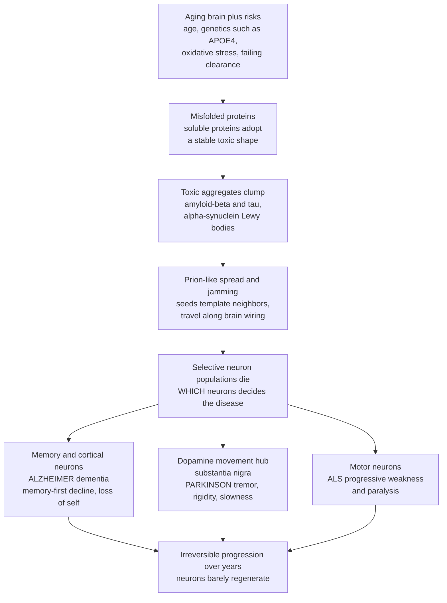

# 🧠 Neurodegenerative and Cognitive Disorders

> [!abstract] TL;DR
> Neurodegenerative diseases are the slow, selective, **irreversible dying-off of specific neuron populations** — and the whole confusing field snaps into focus through just **two questions**. First: *which* neurons are dying? That single fact predicts the clinical picture — kill the **memory and thinking neurons** of the hippocampus and cortex and you get **Alzheimer disease and dementia** (memory-first, then the erosion of the self); kill the tiny **dopamine-producing movement hub** in the substantia nigra and you get **Parkinson disease** (tremor, rigidity, slowness); kill **motor neurons** and you get **ALS** (paralysis). Second: *why* are they dying? Here the diseases share a villain — **misfolded proteins** (amyloid-beta and tau in Alzheimer, alpha-synuclein in Parkinson, and others) that clump into toxic aggregates and **spread through the brain in a prion-like way**, jamming the cellular machinery. These are the **proteinopathies**. Because neurons barely regenerate and the process unfolds over years to decades behind a long **silent preclinical phase**, the losses accumulate relentlessly and are, so far, largely untreatable at their root. As the **age of the population climbs**, these become the most feared and fastest-growing illnesses of aging societies. This note is the **clinical view** of neurodegeneration; it complements the molecular deep-dive in the Neuroscience vault.

---

## Intuition

**Analogy — a great city whose neighborhoods go dark, one by one, over years.** Picture the brain as a sprawling city lit up at night, each district humming with its own specialized work: one neighborhood keeps the memories, one runs the movements, one carries the messages out to the muscles. In a healthy city every district stays lit for a lifetime. In neurodegeneration, a **slow blackout** begins — not everywhere at once, but district by district, as the buildings themselves crumble and cannot be rebuilt. Which neighborhood goes dark *first* determines what the person loses first, and therefore *which disease you are watching*.

If the blackout begins in the **memory and thinking district**, the earliest and cruelest loss is memory — new experiences stop being recorded, then old ones fade, and eventually the person's very sense of self dims. This is **Alzheimer disease**, the leading cause of **dementia**. If instead the blackout begins in a small but critical **movement-control substation** — the cluster of dopamine-producing cells deep in the midbrain — the streets fill with faulty signals: a hand trembles at rest, muscles stiffen, movements slow to a crawl. This is **Parkinson disease**. Same city, same kind of failure, utterly different symptoms — purely because a *different neighborhood* went dark.

And here is the strange, unifying twist: across these very different diseases, the **cause of the blackout is often the same kind of sabotage** — a **misfolded protein**. A protein that normally folds into a useful shape instead collapses into a sticky, wrong shape, clumps together into toxic tangles, and — worst of all — **converts its healthy neighbors into the same corrupted form**, spreading building to building along the city's own wiring like a jamming corruption that seizes the machinery. Amyloid and tau do this in Alzheimer; alpha-synuclein does it in Parkinson. Because of this shared mechanism, the diseases are collectively called **proteinopathies**. To understand any neurodegenerative disease, then, you hold two lenses at once: *which* population of neurons is dying (this tells you the symptoms) and the *shared machinery* of protein misfolding, aggregation, and spread that is doing the killing (this is the frontier of treatment).

---

## How It Works

### The shared machinery of neurodegeneration

Strip away the disease-specific detail and every major neurodegenerative disease runs the same core program. It is *selective* (specific neuron populations, not the whole brain), *progressive* (it worsens over years), and *irreversible* (mature neurons essentially do not divide to replace losses):

1. **A protein misfolds.** A normally soluble, useful protein adopts an abnormal, stable, "sticky" conformation — driven by mutations, aging-related failure of clearance, oxidative stress, or chance. Each disease has its signature protein: **amyloid-beta** and **tau** in Alzheimer, **alpha-synuclein** in Parkinson and Lewy body disease, **TDP-43** in ALS, mutant **huntingtin** in Huntington.
2. **Misfolded seeds aggregate.** The abnormal protein clumps into **oligomers**, then fibrils, then large visible deposits (amyloid **plaques**, neurofibrillary **tangles**, **Lewy bodies**). The small soluble oligomers are often the most toxic species; the big inclusions are the pathologist's fingerprint of the disease.
3. **Proteostasis and quality control fail.** The cell's protein-folding chaperones, the **ubiquitin-proteasome system**, and **autophagy** are meant to catch and clear misfolded protein. In neurodegeneration this housekeeping is overwhelmed or itself impaired, so garbage accumulates.
4. **Cellular stress compounds.** Aggregates and failing clearance drive **mitochondrial dysfunction** (energy crisis), **oxidative stress**, disrupted **axonal transport**, synaptic failure, and chronic **neuroinflammation** as microglia react. Together these push neurons toward death (the cell-injury and cell-death biology of a foundational sibling note, *Cellular Injury and Adaptation*).
5. **Prion-like spread.** Crucially, a misfolded seed can **template healthy copies** of the same protein into the misfolded shape, and aggregates pass from cell to cell along **synaptically connected pathways**. This explains why pathology follows **stereotyped anatomical staging** rather than appearing randomly — and why symptoms march in a predictable order. ("Prion-like" refers to the *templating mechanism only*; you cannot catch Alzheimer from a patient.)
6. **Selective vulnerability sets the clinical picture.** Different neuron populations differ in their susceptibility, so each protein preferentially destroys a particular circuit — **the single most useful organizing idea in the whole field.** Where the neurons die predicts *what the patient loses*.

### The two lenses, made concrete

**Lens 1 — which neurons die → the symptoms.** Memory and cortical association neurons (hippocampus, entorhinal and association cortex) → **amnestic dementia** (Alzheimer). Dopaminergic neurons of the **substantia nigra** projecting to the striatum → the **parkinsonian motor syndrome**. **Motor neurons** (cortex, brainstem, spinal cord) → progressive **weakness and paralysis** (ALS). Striatal medium spiny neurons → **chorea** (Huntington). Small vessels and their downstream territory → **vascular** cognitive impairment.

**Lens 2 — the shared machinery → the mechanism and the therapeutic target.** Proteinopathy, failed proteostasis, mitochondrial and oxidative stress, neuroinflammation, and prion-like spread — the common denominators that make these diseases a *family*, and that define where disease-modifying therapy must intervene.

### Age: the dominant risk factor

Above all else, neurodegeneration is a disease of **aging**. Protein-clearance systems decline, mitochondria accumulate damage, and the brain's repair reserve shrinks with age (the reason this note links tightly to the *Hallmarks of Aging*). Dementia prevalence roughly **doubles every ~5 years** after age 65 — which is why an aging world faces a neurodegenerative epidemic.

### The pathway, from aging brain to symptoms



*Read the top row as the shared machinery every proteinopathy runs; the fan-out at "die" is selective vulnerability — the same kind of failure, striking different neighborhoods, producing different diseases. The bottom row is the tragedy common to all: because neurons do not regenerate, the losses only accumulate.*

---

## Key Concepts

### Secondary (intuitive)

- **Neurodegeneration** = brain and spinal-cord neurons **slowly and permanently dying**. Because neurons barely regrow, the damage builds up and does not reverse.
- **The one big idea:** *which neurons die tells you the symptoms.* Memory neurons dying → memory disease. Movement-control neurons dying → movement disease.
- **Dementia** = an **acquired, progressive, global decline in thinking** — memory, language, judgment — severe enough to disrupt daily life. It is a *syndrome* (a picture), not one disease; many diseases can cause it.
- **Alzheimer disease** = the **most common cause of dementia**. Memory fails first (the memory center is destroyed first), then language, reasoning, and eventually the person's sense of self.
- **Parkinson disease** = death of a small **dopamine-making movement hub**, causing a **resting tremor**, **stiffness (rigidity)**, and **slowness (bradykinesia)**.
- **The shared villain — misfolded proteins.** In many of these diseases, proteins fold into the wrong shape, clump into toxic tangles, and spread through the brain, jamming the machinery. That is why they are called **proteinopathies**.
- **Not the same as normal aging.** Everyone slows a little and forgets a name now and then; dementia is a *disease process* that steadily strips away function.

### Undergraduate (formal)

- **Selective vulnerability + prion-like spread.** Each proteinopathy targets a specific neuron population and spreads trans-synaptically along connected pathways, producing **stereotyped staging** (e.g., Braak stages in Alzheimer tau and in Parkinson alpha-synuclein). This is why memory fails long before movement in Alzheimer, and why loss of smell can precede tremor by years in Parkinson.
- **Dementia vs delirium vs normal aging — the essential triage.**
  - **Dementia:** *chronic*, *progressive*, *irreversible*, **normal level of consciousness** — a slow erosion over months to years.
  - **Delirium:** *acute*, *fluctuating*, often **reversible**, with **clouded/altered consciousness and inattention** — usually triggered by infection, drugs, or metabolic upset. Delirium is a medical emergency and a common mimic/complicator of dementia.
  - **Normal aging:** mild slowing and occasional word-finding lapses with **preserved independence** and preserved memory of important events.
- **Alzheimer disease — the leading dementia (~60-70% of cases).** Two pathological hallmarks: extracellular **amyloid-beta plaques** and intraneuronal **tau neurofibrillary tangles**, with **hippocampal and cortical atrophy**. Clinical course is **memory-first** (episodic memory encoding fails as the hippocampus degenerates), then language, visuospatial, and executive decline. **Genetics:** **APOE4** is the strongest common risk allele for late-onset disease (one copy raises risk, two copies far more); rare familial forms (APP, PSEN1/2) cause early onset.
- **The other major dementias (crucial to distinguish).**
  - **Vascular dementia:** stepwise cognitive decline from **strokes and small-vessel disease** — the direct link to cardiovascular disease and its risk factors (hypertension, diabetes, atherosclerosis).
  - **Dementia with Lewy bodies:** alpha-synuclein pathology producing **fluctuating cognition, vivid visual hallucinations, parkinsonism, REM sleep behavior disorder,** and dangerous **antipsychotic sensitivity**.
  - **Frontotemporal dementia:** frontal/temporal degeneration presenting with **behavioral/personality change or language decline**, often in *younger* patients (50s-60s), with relative memory sparing early.
- **Parkinson disease and movement disorders.** Loss of **dopaminergic neurons in the substantia nigra pars compacta**, with **alpha-synuclein Lewy bodies**, depletes striatal dopamine and produces the cardinal signs: **resting tremor, rigidity, bradykinesia, and postural instability**. The dopamine deficit is the rationale for **dopamine-replacement therapy** with **levodopa (L-DOPA)** plus carbidopa. **Huntington disease** is an autosomal-dominant **CAG trinucleotide repeat expansion** in *HTT* causing **chorea**, psychiatric change, and dementia (the genetic-disease connection). Other movement disorders include **essential tremor** (an action tremor, distinct from Parkinson's resting tremor) and **dystonia**.
- **Motor neuron disease and a key mimic.** **Amyotrophic lateral sclerosis (ALS)** degenerates **upper and lower motor neurons**, causing progressive weakness, wasting, and eventually respiratory failure (TDP-43 is the usual pathological protein). Distinguish sharply from **multiple sclerosis (MS)**, which is **not** neurodegenerative in the proteinopathy sense but a **demyelinating autoimmune disease** — the immune system attacks CNS **myelin**, producing relapsing-remitting neurological deficits disseminated in space and time. **Prion diseases** (e.g., **Creutzfeldt-Jakob disease**) are the literal proteinopathy: an infectious misfolded prion protein causing rapidly progressive dementia.
- **The clinical arc.** A long **preclinical (silent) phase** — proteins accumulate for 10-20 years before symptoms — then **mild cognitive impairment / prodromal disease**, then overt disease. This silent window is exactly where **biomarkers and imaging** (amyloid/tau PET, CSF and plasma markers, MRI atrophy) aim to detect disease early enough to intervene.

### Graduate (mechanistic and systems)

- **"Which neurons die" as a research-grade organizing principle.** Selective vulnerability is not incidental — it emerges from cell-intrinsic factors (long unmyelinated axons and high energy demand of nigral dopamine neurons; the metabolic and connectivity hub status of entorhinal/hippocampal neurons; the extraordinary axonal length of motor neurons) intersecting with each protein's biology. The clinical syndrome is the *readout* of this vulnerability map, and network-neuroscience models predict individual staging trajectories from a patient's connectome.
- **The amyloid cascade, revised.** Excess **amyloid-beta 42** oligomerizes → synaptic toxicity and seeding → downstream **tau** hyperphosphorylation, tangle formation, and trans-neuronal tau spread → neuronal loss → dementia. The modern correction: amyloid is **necessary but not sufficient** — ~30% of cognitively normal elders are amyloid-positive, and **tau burden (Braak stage) tracks cognition far better than amyloid load**. This reframes "biological Alzheimer" via the **A/T/N** biomarker framework (Amyloid / Tau / Neurodegeneration), decoupling *pathology* from *syndrome*.
- **Neuroinflammation as a driver, not a bystander.** GWAS implicate **microglial** genes (**TREM2**, CR1, CLU, BIN1) as top Alzheimer risk loci after APOE, establishing innate immunity as mechanistically central. Disease-associated microglia, complement-mediated aberrant synaptic pruning, and cytokine-driven synaptotoxicity connect proteinopathy to circuit failure — and open immune therapeutic targets.
- **Proteostasis and organelle quality control.** Neurodegeneration is fundamentally a failure of protein homeostasis: chaperone capacity, ubiquitin-proteasome throughput, and **autophagy/mitophagy** all decline with age and are further impaired by aggregates. In autosomal-recessive Parkinson, **PINK1/Parkin** mutations directly break mitochondrial quality control — the cleanest genetic evidence that failed mitophagy kills dopaminergic neurons. This ties neurodegeneration to the broader **hallmarks of aging** (loss of proteostasis, mitochondrial dysfunction, cellular senescence).
- **Symptomatic versus disease-modifying therapy — the field's central divide.** Nearly all established drugs are **symptomatic**: **cholinesterase inhibitors** and memantine modestly ease Alzheimer symptoms without altering course; **L-DOPA** brilliantly relieves parkinsonian motor signs but does not slow nigral loss (and as neurons vanish, benefit narrows into motor fluctuations and dyskinesias); **deep brain stimulation** of the STN/GPi modulates pathological basal-ganglia oscillations. Only recently have **disease-modifying** agents arrived — **anti-amyloid antibodies (lecanemab, donanemab)** slow Alzheimer decline modestly while clearing plaque (validating, yet also bounding, the amyloid hypothesis), and **antisense oligonucleotides (tofersen)** lower SOD1 in genetic ALS. The molecular specifics of these agents are developed in the Neuroscience companion note.
- **The preclinical window and biomarker-driven prevention.** Because pathology precedes symptoms by 1-2 decades, the therapeutic logic is shifting **upstream**: plasma **p-tau217** now predicts amyloid/tau PET positivity with ~90% accuracy, enabling scalable screening and **trial enrichment**, and reframing neurodegeneration as a **precision-medicine** problem of detecting and modifying a biological process before the neurons are gone. This is the frontier the field is racing toward.
- **Epidemiologic burden as a systems problem.** With prevalence roughly doubling every 5 years of age and global lifespans rising, dementia is projected to affect >150 million people by mid-century. In dementia specifically, the loss is not merely of function but of **identity and autonomy**, imposing extraordinary caregiver and health-system burden — which is why prevention (vascular risk control, the *modifiable* dementia risk factors) is as central as any drug.

---

## Python Demo

```python
# Neurodegeneration in two pictures:
#   (a) PROGRESSIVE DECLINE + THRESHOLD (the "silent preclinical phase"):
#       A vulnerable neuron population (e.g. dopaminergic neurons in Parkinson)
#       is lost slowly over years. Thanks to RESERVE / COMPENSATION, clinical
#       FUNCTION stays near-normal until a THRESHOLD of loss is crossed
#       (~60-80% of dopamine neurons gone) -> symptoms then appear and worsen
#       fast. This is why disease is invisible for a decade+ before diagnosis.
#   (b) DEMENTIA PREVALENCE vs AGE (the aging-driven epidemic):
#       Prevalence roughly DOUBLES every ~5 years after 65 -> the steep rise
#       that makes neurodegeneration the illness of aging societies.
import numpy as np
import matplotlib.pyplot as plt

# ---------- (a) Progressive neuron loss, reserve, and symptom threshold ----------
age = np.linspace(40, 90, 500)
onset_age = 45.0                      # silent loss begins in midlife
k = 0.055                             # loss rate constant
neurons = 100.0 * np.exp(-k * np.maximum(0.0, age - onset_age))  # % neurons surviving

threshold = 30.0                      # % surviving at which symptoms emerge (~70% lost)
steep = 0.18                          # steepness of the reserve "cliff"
# Compensation keeps clinical function high until neurons fall near the threshold,
# then function collapses steeply (a sigmoid centered on the threshold):
function = 100.0 / (1.0 + np.exp(-steep * (neurons - threshold)))

# Age at which surviving neurons cross the symptom threshold (neurons is decreasing):
age_symptom = np.interp(-threshold, -neurons, age)
preclinical_years = age_symptom - onset_age

# ---------- (b) Dementia prevalence vs age (doubles ~every 5 years) ----------
age2 = np.linspace(60, 95, 300)
prevalence = 1.5 * 2.0 ** ((age2 - 65.0) / 5.3)   # ~1.5% at 65, doubling every ~5 yr
prevalence = np.clip(prevalence, 0, 45)
# representative epidemiological anchor points (approximate)
obs_age = np.array([65, 70, 75, 80, 85, 90])
obs_prev = np.array([1.5, 3.0, 6.0, 12.0, 24.0, 38.0])

fig, (ax1, ax2) = plt.subplots(1, 2, figsize=(14, 5.5))

# --- panel (a) ---
ax1.plot(age, neurons, color="#C0392B", lw=2.4, label="Surviving neurons (%)")
ax1.plot(age, function, color="#2980B9", lw=2.4, label="Clinical function (with reserve)")
ax1.axhline(threshold, color="#7F8C8D", ls="--", lw=1.2)
ax1.text(41, threshold + 2, "symptom threshold (~70% lost)", fontsize=8, color="#566573")
ax1.axvspan(onset_age, age_symptom, color="#F1C40F", alpha=0.18)
ax1.text((onset_age + age_symptom) / 2, 8,
         f"silent preclinical\nphase (~{preclinical_years:.0f} yr)",
         ha="center", fontsize=8.5, color="#B9770E")
ax1.axvline(age_symptom, color="#8E44AD", lw=1.2, ls=":")
ax1.annotate("diagnosis:\nfunction falls off the cliff",
             xy=(age_symptom, 50), xytext=(age_symptom + 3, 68),
             fontsize=8.5, color="#8E44AD",
             arrowprops=dict(arrowstyle="->", color="#8E44AD"))
ax1.set_xlabel("Age (years)")
ax1.set_ylabel("Percent of baseline")
ax1.set_title("(a) Slow loss, reserve, and the symptom threshold")
ax1.set_ylim(0, 105); ax1.set_xlim(40, 90)
ax1.legend(loc="upper right", fontsize=8); ax1.grid(alpha=0.3)

# --- panel (b) ---
ax2.plot(age2, prevalence, color="#27AE60", lw=2.6, label="Modeled prevalence (doubles ~5 yr)")
ax2.scatter(obs_age, obs_prev, color="#C0392B", zorder=5, label="Approx. observed")
for a, p in zip(obs_age, obs_prev):
    ax2.annotate(f"{p:.0f}%", (a, p), textcoords="offset points",
                 xytext=(4, -10), fontsize=7.5, color="#922B21")
ax2.set_xlabel("Age (years)")
ax2.set_ylabel("Dementia prevalence (%)")
ax2.set_title("(b) The aging-driven epidemic: prevalence vs age")
ax2.set_ylim(0, 45); ax2.set_xlim(60, 95)
ax2.legend(loc="upper left", fontsize=8); ax2.grid(alpha=0.3)

plt.tight_layout()
plt.show()

print(f"Silent preclinical phase lasts ~{preclinical_years:.0f} years "
      f"(loss starts at {onset_age:.0f}, symptoms near age {age_symptom:.0f}).")
print(f"At the symptom threshold, ~{100 - threshold:.0f}% of the vulnerable "
      f"neurons are already gone before diagnosis.")
print(f"Modeled dementia prevalence: {np.interp(65, age2, prevalence):.1f}% at 65 "
      f"vs {np.interp(85, age2, prevalence):.1f}% at 85 (roughly a 4-doubling rise).")
```

**What you see.** *Panel (a)* is the defining tragedy of neurodegeneration. The **red curve** — the vulnerable neuron population — declines quietly for years, yet the **blue curve** of clinical function stays flat and normal, because the brain **compensates** using its reserve. Only when surviving neurons fall past the **threshold** (here ~70% already lost, echoing the ~60-80% dopamine-neuron loss before Parkinson's motor signs appear) does function **fall off a cliff** — which is why patients are diagnosed *late*, long after the disease began, and why the shaded **silent preclinical phase** is the holy grail for early biomarkers and prevention. *Panel (b)* is why this matters at population scale: dementia prevalence **doubles roughly every five years** of age, so as societies grow older the case count explodes — the quantitative shape of the neurodegenerative epidemic.

---

## Real-World Applications

- **Diagnosing the dementia syndrome and its cause.** Real clinical work is a two-step: first confirm it is **dementia** (chronic, progressive, clear consciousness) and *not* **delirium** (acute, fluctuating, altered consciousness — reversible and urgent) or normal aging; then identify the **cause** — Alzheimer, vascular, Lewy body, or frontotemporal — because prognosis and management differ. Mistaking Lewy body dementia for Alzheimer, for instance, risks catastrophic antipsychotic reactions.
- **Biomarker- and imaging-guided diagnosis.** **Amyloid and tau PET**, **CSF** amyloid-beta 42/40 and p-tau, MRI **atrophy patterns**, and emerging **plasma p-tau217** now allow *biological* diagnosis of Alzheimer before or early in the syndrome — the direct application of the A/T/N framework and the connection to diagnostics and precision-medicine workflows.
- **Symptomatic therapy that genuinely helps.** **Levodopa/carbidopa** transforms parkinsonian motor function; **cholinesterase inhibitors** modestly steady Alzheimer cognition; **deep brain stimulation** rescues advanced Parkinson motor fluctuations. None halt the underlying neuron loss, but all meaningfully improve quality of life.
- **The first disease-modifying drugs.** **Anti-amyloid antibodies** (lecanemab, donanemab) slow Alzheimer decline while clearing plaque, and **antisense oligonucleotides** (tofersen) lower the toxic protein in genetic ALS — the opening moves of a mechanism-targeted era, with the field watching amyloid-related imaging abnormalities (ARIA) as the key safety signal.
- **Genetic testing and counseling.** **APOE4** genotyping stratifies Alzheimer risk (a risk factor, not a verdict); **HTT CAG-repeat** testing is definitively diagnostic and predictive for Huntington, making pre-symptomatic counseling standard of care; **LRRK2/GBA** testing enriches Parkinson trials of targeted agents.
- **Prevention through modifiable risk.** Because **vascular disease** drives both vascular dementia and worsens Alzheimer, controlling hypertension, diabetes, smoking, and cholesterol — plus hearing correction, physical activity, and education — addresses a large share of *modifiable* dementia risk. Prevention is currently the most powerful lever the field has.

---

## Common Pitfalls

- **Confusing dementia with delirium (or with normal aging).** Delirium is **acute, fluctuating, and altered in consciousness** — often reversible and a sign of an acute medical problem (infection, drugs, metabolic derangement); dementia is **chronic, progressive, and clear-sensorium**. Missing a delirium superimposed on dementia is a classic, dangerous error. And ordinary aging — mild slowing with preserved independence — is *not* a disease.
- **Assuming pathology equals disease.** Roughly a third of cognitively normal elders carry substantial amyloid plaque. **Amyloid is necessary but not sufficient**; tau burden and neuronal loss track cognition far better. Biomarker positivity must be interpreted with the clinical picture, not in isolation.
- **Treating Parkinson as "just a tremor."** The motor triad is only part of the disease. **Non-motor features** — hyposmia (often the earliest sign), REM sleep behavior disorder, constipation, depression, and eventually dementia — reflect widespread alpha-synuclein pathology and often dominate late-stage burden.
- **Mislabeling multiple sclerosis as neurodegenerative in the proteinopathy sense.** MS is primarily a **demyelinating autoimmune** disease of CNS myelin (relapsing-remitting, disseminated in space and time), mechanistically distinct from the protein-aggregation diseases — though it does have a secondary neurodegenerative phase. Conflating the two misleads on both cause and treatment.
- **Expecting symptomatic drugs to change the disease.** L-DOPA and cholinesterase inhibitors improve *symptoms*; they do not slow neuron loss. Believing otherwise breeds false reassurance — and misreads why "on-off" fluctuations and dyskinesias emerge as more dopaminergic neurons die.
- **Ignoring the preclinical window.** Because pathology precedes symptoms by 10-20 years, waiting for overt dementia to act may mean intervening after most vulnerable neurons are already lost — the entire rationale for biomarker-driven early detection.
- **Reading this as medical advice.** This note describes disease *mechanisms* at a textbook level. It is not guidance for evaluating any individual's memory, movement, or treatment — cognitive or neurological decline requires assessment by a clinician, and acute confusion (possible delirium) is a medical emergency.

---

## Related Concepts

**Within this section (Neurological and Musculoskeletal disorders).** This note is the neurodegenerative pillar of the section and sits alongside its siblings as prose references. *Neurological Pathophysiology* supplies the general framework of how nervous-system function fails — the substrate on which selective neuronal loss plays out. *Seizures, Headache, and Neurological Dysfunction* covers the episodic and paroxysmal disorders that contrast with the slow, relentless course described here (and note that late-stage Alzheimer can itself lower seizure threshold). *Psychiatric and Behavioral Disorders* overlaps at the crucial boundary where neurodegeneration presents *psychiatrically* — the depression and apathy of early Parkinson and Huntington, the behavioral change of frontotemporal dementia, and the psychosis of Lewy body disease. Reaching into the foundations, *Genetic and Congenital Disease* provides the inheritance logic behind familial Alzheimer, autosomal-dominant Huntington, and genetic ALS, while *Precision Medicine and Genomics in the Clinic* frames the biomarker- and genotype-driven diagnosis and trial-enrichment strategies that are reshaping this field. These are sibling notes in the Clinical Medicine vault.

**Across the vault (Glob-verified links).**

- [[Clinical_Medicine/01_Foundations_of_Disease_and_Pathophysiology/Clinical_Medicine_and_Pathophysiology_Overview|Clinical Medicine and Pathophysiology Overview]] — the parent hub; neurodegeneration is a paradigm of slow, irreversible, cumulative organ failure driven by failed homeostasis and exhausted reserve.
- [[Clinical_Medicine/01_Foundations_of_Disease_and_Pathophysiology/Cellular_Injury_and_Adaptation|Cellular Injury and Adaptation]] — the cell-death biology (apoptosis, oxidative injury, mitochondrial failure) that turns protein aggregates into dying neurons.
- [[Clinical_Medicine/02_Cardiovascular_and_Respiratory_Disease/Cardiovascular_Pathophysiology|Cardiovascular Pathophysiology]] — the atherosclerotic and stroke pathology that causes **vascular dementia** and accelerates Alzheimer; the reason vascular risk control is central to dementia prevention.
- [[Neuroscience/06_Clinical_and_Applied_Neuroscience/Neurodegenerative_Diseases|Neurodegenerative Diseases (Neuroscience)]] — the molecular companion to this clinical view: amyloid cascade detail, Braak staging, prion-like propagation kinetics, and the drug-mechanism deep dives.
- [[Neuroscience/02_Neuroanatomy_and_Brain_Structure/Cerebellum_and_Basal_Ganglia|Cerebellum and Basal Ganglia]] — the basal-ganglia circuitry whose dopamine input fails in Parkinson and whose striatal neurons die in Huntington, explaining the movement disorders.
- [[Neuroscience/01_Cellular_and_Molecular_Neuroscience/Synaptic_Transmission_and_Neurotransmitters|Synaptic Transmission and Neurotransmitters]] — the dopamine and acetylcholine systems whose loss underlies parkinsonian motor signs and the cholinergic deficit of Alzheimer, and the rationale for L-DOPA and cholinesterase inhibitors.
- [[Neuroscience/04_Cognitive_Neuroscience/Learning_and_Memory_Systems|Learning and Memory Systems]] — the hippocampal memory system whose early destruction makes amnestic memory loss the cardinal first sign of Alzheimer.
- [[Neuroscience/06_Clinical_and_Applied_Neuroscience/Stroke_and_Traumatic_Brain_Injury|Stroke and Traumatic Brain Injury]] — the vascular injury pathway that produces stepwise vascular cognitive impairment and mixed dementia.
- [[Health_Nutrition_and_Longevity/05_Aging_and_Longevity/Hallmarks_of_Aging|Hallmarks of Aging]] — loss of proteostasis, mitochondrial dysfunction, and cellular senescence are shared hallmarks that make aging the dominant risk factor for neurodegeneration.
- [[Health_Nutrition_and_Longevity/05_Aging_and_Longevity/The_Science_of_Aging_and_Longevity|The Science of Aging and Longevity]] — the broader biology of why brain aging drives the neurodegenerative epidemic and where prevention might intervene.
- [[Biology/01_Chemistry_of_Life/Proteins_and_Amino_Acids|Proteins and Amino Acids]] — protein folding and structure; neurodegeneration is at root a failure of correct folding, making these diseases "proteinopathies."
- [[Biology/09_Human_Physiology_and_Anatomy/Homeostasis_and_the_Nervous_System|Homeostasis and the Nervous System]] — the healthy nervous-system physiology whose selective, progressive breakdown produces these diseases.
- [[Genetics/05_Human_and_Medical_Genetics/Mendelian_Genetic_Disorders|Mendelian Genetic Disorders]] — the single-gene inheritance behind autosomal-dominant Huntington (a CAG repeat expansion) and familial Alzheimer and ALS.

---

## Review Questions

**Secondary.** Using the "city whose neighborhoods go dark" picture, explain why Alzheimer disease and Parkinson disease look so different even though both are neurons slowly dying. For each, name which "neighborhood" fails first and the earliest symptom that predicts. Then explain, in plain terms, what a "misfolded protein" is and why these diseases are grouped together as "proteinopathies."

**Undergraduate.** A 74-year-old has slowly worsening memory over two years with a clear sensorium and preserved alertness; a 74-year-old on a hospital ward becomes acutely confused overnight with a fluctuating, drowsy consciousness. Classify each (dementia vs delirium), justify using the defining features, and state why the distinction changes the urgency and the workup. Separately, explain why a Parkinson patient can lose 60-80% of their dopamine neurons before the first tremor appears, using the ideas of *selective vulnerability* and *reserve/compensation*.

**Graduate.** Anti-amyloid antibodies clear most amyloid plaque yet slow cognitive decline only modestly. (a) Reconcile this with the *revised* amyloid cascade hypothesis and the observation that tau burden predicts cognition better than amyloid. (b) Given that pathology precedes symptoms by 10-20 years (the silent preclinical phase in panel (a) of the demo), argue how biomarkers such as plasma p-tau217 should reshape *when* and *in whom* disease-modifying therapy is deployed. (c) Explain why "which neurons die" and "the shared machinery of misfolding and spread" are complementary — not competing — lenses for organizing therapeutic strategy across Alzheimer, Parkinson, and ALS.

---

## Sources

- Ropper, A. H., Samuels, M. A., Klein, J. P., & Prasad, S. *Adams and Victor's Principles of Neurology* (11th ed.). McGraw-Hill — chapters on degenerative diseases of the nervous system, dementia, and Parkinson disease and movement disorders.
- Kumar, V., Abbas, A. K., & Aster, J. C. *Robbins & Cotran Pathologic Basis of Disease* (10th ed.). Elsevier — Central Nervous System chapter: neurodegenerative diseases, Alzheimer, Parkinson, ALS, and prion disease.
- Long, J. M., & Holtzman, D. M. (2019). "Alzheimer disease: an update on pathobiology and treatment strategies." *Cell*, 179(2), 312-339 — amyloid, tau, and the biomarker/therapeutic landscape.
- Kalia, L. V., & Lang, A. E. (2015). "Parkinson's disease." *The Lancet*, 386(9996), 896-912 — pathophysiology, alpha-synuclein, and clinical management of Parkinson disease.
- Livingston, G., et al. (2020). "Dementia prevention, intervention, and care: 2020 report of the Lancet Commission." *The Lancet*, 396(10248), 413-446 — dementia epidemiology and modifiable risk factors.

---

#clinical-medicine #neurodegeneration #alzheimer #parkinson #dementia
