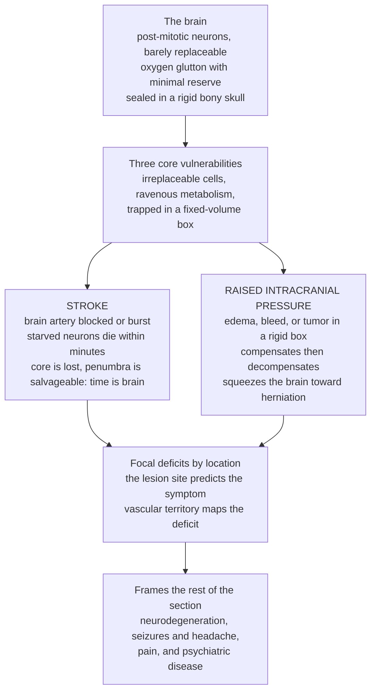

# 🧠 Neurological Pathophysiology

> [!abstract] TL;DR
> The nervous system is the body's **electrical control network**, and it fails in ways no other organ does because of three peculiar properties. First, its cells are **post-mitotic** — neurons are largely irreplaceable, so damage tends to be **permanent** rather than healed. Second, it is a **metabolic glutton with almost no reserve** — the brain is 2 percent of body weight but burns 20 percent of the body's oxygen, running second by second on delivered blood. Third, it is **sealed in a rigid bony box** where there is no room to swell. From these three facts flow the section's two flagship emergencies. **Stroke** is the brain's version of a heart attack: block a cerebral artery (or burst one) and starved neurons begin dying within *minutes* — hence **"time is brain,"** roughly **1.9 million neurons lost per minute** of a large-vessel occlusion — leaving an already-dead **core** surrounded by a still-salvageable **penumbra** that races against the clock. **Raised intracranial pressure** is the rigid-box catastrophe: by the **Monro-Kellie doctrine**, any added volume — edema, a bleed, a tumor, trapped cerebrospinal fluid — is buffered silently until compensation is exhausted, after which pressure climbs steeply and can squeeze the brain until it **herniates** and dies. Because the deficit reflects *where* the lesion sits, neurology reads the body backward from symptom to location. As the opener for the Neurological and Musculoskeletal section, this note establishes the localization-and-vulnerability logic beneath everything that follows — neurodegeneration, seizures and headache, pain, and psychiatric disease — and bridges to the basic science in the Neuroscience vault.

---

## Intuition

**Analogy — the brain is the irreplaceable control room of a building, and unlike every other part of the building it can neither be rewired nor given more space.** Imagine a skyscraper whose entire operation is run from one control room packed with delicate, hand-built electronics. Three things make this room uniquely precarious. It runs on **live power only** — there is no battery backup, so if the mains flicker for even a couple of minutes the boards start frying. Its components are **bespoke and irreplaceable** — burn a board and it stays burnt; the room does not grow new ones. And it is **bricked into a sealed vault** with no expansion joint — the walls cannot bulge outward.

Now watch how it breaks. Cut the power cable feeding one wall of the room and, within *minutes*, the electronics on that wall begin to die. The instant the cable is cut there is already a scorched zone that is gone for good — the **core** — but ringed around it is a dimmer zone still receiving a trickle of current from neighbouring cables: flickering, not yet dead, **salvageable if you restore power fast**. This is the **penumbra**, and every minute you delay, more of that flickering ring goes permanently dark. That race is a **stroke**, and it is exactly why clinicians chant **"time is brain."**

The second failure needs no power cut at all. Suppose water leaks into the sealed vault, or a component swells, or a growth appears. In any ordinary room the walls would give a little and nothing much would happen. But this vault is rigid, so at first the room quietly makes space — squeezing out some spare fluid and slack cabling — and the pressure barely rises. You would never know from the outside. Then the slack runs out. From that **tipping point** on, every extra millilitre sends the pressure climbing steeply, crushing the very electronics it surrounds and eventually forcing the room's contents to squeeze through the one gap in the vault floor — a lethal spiral. This is **raised intracranial pressure** ending in **herniation**. Everything else in this section — which neurons degenerate, why the room misfires into a seizure, how it signals pain, how its chemistry drifts into psychiatric illness — is a variation on these same three unforgiving facts: the components are irreplaceable, they live on the knife-edge of their blood supply, and they are trapped in a box where pressure kills.

---

## How It Works

### The nervous system's three special vulnerabilities

Neurological disease is best understood not as a catalogue of syndromes but as the consequences of a few structural facts. Almost every emergency in this section is one of these vulnerabilities cashed out.

1. **Neurons are post-mitotic — damage is usually permanent.** Mature neurons have essentially exited the cell cycle and do not divide to replace losses (adult neurogenesis exists but is limited to a few niches and does not repair a stroke). The central nervous system also lacks the robust regeneration seen elsewhere: myelin debris and glial scarring actively inhibit axon regrowth. The clinical corollary is stark — where other tissues heal, the CNS **scars and loses function**, so prevention and rapid rescue matter far more than repair.
2. **The brain is metabolically ravenous with almost no reserve.** Maintaining ion gradients across excitable membranes is enormously expensive; the sodium-potassium pump alone consumes a large share of cerebral ATP. The brain therefore demands a continuous supply of **oxygen and glucose** and stores almost none of either. Normal cerebral blood flow is roughly 50 mL per 100 g of tissue per minute; drop it and neurons fall silent within seconds and die within minutes. This is why the brain is the organ most **exquisitely sensitive to ischemia**.
3. **The brain is protected yet trapped.** Evolution armoured this precious, fragile tissue behind a **bony skull**, wrapped it in **meninges**, cushioned it in **cerebrospinal fluid (CSF)**, and screened its chemistry through the **blood-brain barrier**. But the same rigid skull that protects it becomes a trap: there is no room to swell. Protection and confinement are two faces of one anatomical fact.

A fourth, cross-cutting principle organizes the entire neurological examination: **localization**. Because different regions do different jobs, the *pattern* of deficit points to the *place* of the lesion. A **focal** deficit (one-sided weakness, a visual field cut, loss of speech) implicates a discrete structure or its blood supply; a **diffuse** process (delirium, coma, global slowing) implicates a widespread or systemic insult. Neurology reasons backward from symptom to site — the logic that makes the bedside exam a form of anatomy.

### Stroke: the flagship cerebrovascular emergency

A **stroke** is the sudden loss of neurological function caused by a vascular event. It comes in two mechanistically opposite forms.

**Ischemic stroke (about 85 percent)** is occlusion of a cerebral artery cutting off blood flow.

- **Thrombotic** occlusion forms a clot locally on an atherosclerotic plaque — the same disease that clogs coronary arteries, now in the carotid or intracranial vessels.
- **Embolic** occlusion lodges a clot that travelled from elsewhere, classically from the fibrillating left atrium in **atrial fibrillation** or from a carotid plaque.
- The tissue physiology is the crux. Flow does not fall uniformly. At the centre, flow collapses below roughly 10 mL per 100 g per minute and neurons die almost immediately: the **infarct core**, already lost. Around it lies a rim where collateral vessels sustain flow at roughly 10 to 20 mL per 100 g per minute — enough to keep neurons alive but too little to keep them firing. This is the **ischemic penumbra**: functionally silent but structurally viable, and **salvageable if flow is restored**. Left alone, the penumbra progressively converts to core over hours. Rescuing it is the entire point of acute stroke care — **"time is brain"** — achieved by **reperfusion**: intravenous **thrombolysis** to dissolve the clot or mechanical **thrombectomy** to pull it out.

**Hemorrhagic stroke (about 15 percent)** is bleeding rather than blockage, and it damages in two ways at once — the escaped blood destroys and irritates tissue, *and* it adds volume to the rigid box, raising pressure.

- **Intracerebral hemorrhage (ICH)** is bleeding into the brain parenchyma, most often driven by chronic **hypertension** rupturing small deep penetrating arteries.
- **Subarachnoid hemorrhage (SAH)** is bleeding into the CSF space, classically from a ruptured **aneurysm**, presenting as a "thunderclap" worst-headache-of-life.

A **transient ischemic attack (TIA)** is a brief ischemic episode that resolves without infarction — a warning shot that flags high short-term stroke risk. The **shared risk factors** tie stroke firmly to cardiovascular disease: hypertension (the single largest), atrial fibrillation, atherosclerosis, diabetes, and smoking.

Because arteries supply defined territories, the **deficit maps the vessel**: a middle cerebral artery stroke tends to weaken the contralateral face and arm and, in the dominant hemisphere, impair language; an anterior cerebral artery stroke favours the contralateral leg; a posterior cerebral artery stroke cuts the visual field; brainstem or posterior-circulation strokes produce vertigo, ataxia, and crossed signs. Vascular anatomy and the localization principle are the same idea viewed twice.

### Raised intracranial pressure: the rigid-box catastrophe

The skull is a fixed container holding three roughly incompressible contents — **brain, blood, and CSF**. The **Monro-Kellie doctrine** states that because total volume cannot change, any increase in one compartment (or any new mass) must be offset by an equal decrease in another, or pressure rises.

At first, the system compensates gracefully: it shunts CSF into the spinal sac and squeezes blood out of the compliant cerebral veins. During this phase, substantial volume can be added while **intracranial pressure (ICP) barely moves** — the reason a slowly growing tumor can reach alarming size while the patient feels well. But these buffers are finite. Once they are exhausted, the **pressure-volume curve turns sharply upward**: past this **tipping point**, each additional millilitre produces a steep, accelerating rise in pressure. This is **decompensation**, and it is a runaway process.

Two consequences make raised ICP lethal:

- **Falling perfusion.** The brain is perfused by the difference between arterial pressure and the pressure inside the skull: **cerebral perfusion pressure (CPP) = mean arterial pressure (MAP) − ICP**. As ICP climbs, CPP falls, throttling blood flow and inflicting *ischemia* on top of the original insult — a vicious cycle, since ischemia causes more swelling. The body's emergency response, the **Cushing reflex** (rising blood pressure with slowing heart rate), is a last-ditch attempt to defend CPP and a sign of dangerously high ICP.
- **Herniation.** With nowhere to expand, brain tissue is forced through the rigid partitions and openings inside and below the skull. **Subfalcine, uncal (transtentorial), central,** and **tonsillar** herniation each compress specific structures; uncal herniation stretches the third cranial nerve, producing a "blown" fixed and dilated pupil, while tonsillar herniation crushes the brainstem's respiratory centres — the final common pathway to death.

The causes of raised ICP are simply the things that add volume to the box: **cerebral edema** (swelling, e.g. around an infarct or injury), **hemorrhage**, a **tumor** (mass effect), and **hydrocephalus** (CSF accumulating because its circulation or absorption is blocked).

### The broader landscape this opener frames

Stroke and raised ICP are the flagship emergencies, but the same principles govern the rest of neurological disease. **Traumatic brain and spinal cord injury** combine mechanical destruction of irreplaceable tissue with a *secondary* injury cascade of edema and raised ICP. **CNS infections** — meningitis (inflammation of the meninges) and encephalitis (of the brain itself) — turn the protected compartment into a trap when inflammation swells the very box meant to shield it. **Demyelination**, epitomised by **multiple sclerosis**, is an autoimmune attack that strips the myelin insulation from central axons, slowing or blocking conduction. **Hydrocephalus**, **brain tumors**, and disorders of **consciousness and coma** round out the mechanisms. Each is a different answer to the same question this section asks: how does an electrical control network of irreplaceable cells, run on the knife-edge of its blood supply and locked in a rigid box, fail?

### The whole arc, from special vulnerability to section map



*Read the top box as the three facts that make the brain uniquely fragile; both flagship emergencies fall out of them, both express themselves as location-specific deficits, and that localization logic is the through-line for every disorder the section explores next.*

---

## Key Concepts

### Secondary (intuitive)

- **The brain is the body's control room, and it cannot be rewired or given more space.** Neurons are largely irreplaceable, so brain damage tends to be **permanent**.
- **The brain is an oxygen glutton with no backup battery.** It is 2 percent of body weight but uses 20 percent of the oxygen, so even a couple of minutes without blood starts killing cells.
- **Stroke is the brain's heart attack.** Block a brain artery and neurons die within minutes — **"time is brain."** A small clot pulled out or dissolved fast can save the brain around the dead centre.
- **The skull cannot expand.** Any swelling, bleeding, or growth raises the **pressure** inside, and past a tipping point the pressure climbs fast and can crush the brain.
- **Where the damage is decides the symptom.** Weakness on one side, loss of speech, or a lost patch of vision each point to a specific spot — which is how a doctor "reads" a brain problem.

### Undergraduate (formal)

- **The three organizing vulnerabilities:** neurons are **post-mitotic** (poor regeneration, so injury is often permanent); the brain is **metabolically demanding** with minimal reserve (extreme ischemia sensitivity); it is **protected yet confined** (skull, meninges, CSF, blood-brain barrier, but no room to swell). Add the **localization** principle: focal versus diffuse deficits identify the lesion.
- **Ischemic vs hemorrhagic stroke.** Ischemic (about 85 percent): thrombotic or embolic occlusion; the **core** (flow below roughly 10 mL/100 g/min, irreversibly dead) versus the **penumbra** (roughly 10 to 20, viable but silent, salvageable by **reperfusion**). Hemorrhagic (about 15 percent): intracerebral (hypertensive small-vessel rupture) or subarachnoid (aneurysm).
- **Time is brain.** The penumbra converts to core over hours; rapid **thrombolysis** or **thrombectomy** aims to reopen the vessel before it does. A **TIA** is transient ischemia without infarction and a warning of high stroke risk.
- **Vascular territories and risk factors.** Deficits follow the occluded artery (middle, anterior, posterior cerebral, or posterior circulation). Major risk factors — hypertension, atrial fibrillation, atherosclerosis, diabetes, smoking — link stroke to cardiovascular disease.
- **The Monro-Kellie doctrine.** Brain + blood + CSF in a fixed skull; added volume is buffered by CSF and venous displacement until compensation is exhausted, after which the **pressure-volume curve** rises steeply (decompensation).
- **Cerebral perfusion pressure** = MAP − ICP. Rising ICP lowers perfusion, adding secondary ischemia; unchecked, mass effect drives **herniation** (subfalcine, uncal, central, tonsillar).

### Graduate (mechanistic and systems)

- **The excitotoxic ischemic cascade.** Energy failure collapses ion gradients, depolarizing neurons and dumping **glutamate**, which overactivates NMDA receptors and floods cells with **calcium**. Calcium triggers proteases, lipases, and nitric oxide synthase, and mitochondrial failure generates **reactive oxygen species**; the penumbra is lost to this delayed, potentially interruptible cascade rather than to the instantaneous energy failure of the core. This is why the penumbra is a *therapeutic* target and why the timeline is measured in hours.
- **Reperfusion injury and hemorrhagic transformation.** Restoring flow is essential but not free: reoxygenation drives an oxidative burst and disrupts the blood-brain barrier, so a bland infarct can undergo **hemorrhagic transformation** — the reason thrombolysis carries bleeding risk and is time- and imaging-gated. Modern selection uses perfusion imaging to estimate **core-versus-penumbra mismatch** and extend the treatment window in the right patients.
- **Cerebral autoregulation and its loss.** Healthy brain holds cerebral blood flow roughly constant across mean arterial pressures of about 50 to 150 mmHg by myogenic adjustment of arteriolar tone. Ischemia and injury **abolish autoregulation** locally, making flow pressure-passive — so blood pressure and CPP management become delicate, since both hypotension (ischemia) and hypertension (edema, hemorrhagic transformation) can harm.
- **The elastance curve quantifies the tipping point.** The intracranial pressure-volume relationship is exponential: **elastance** (the pressure change per unit volume) is low while compensatory reserve remains, then rises sharply. Compliance is not fixed but state-dependent, which is why a patient can decompensate abruptly from an apparently stable baseline, and why ICP monitoring reads the *slope* one is sitting on, not just the current pressure.
- **Secondary injury as the treatable frontier.** In stroke, traumatic brain injury, and infection alike, the *initial* insult is often beyond reach, but the **secondary** cascade — edema, raised ICP, falling CPP, excitotoxicity, and inflammation — unfolds over hours to days and is where intensive care intervenes. Neurocritical care is essentially the management of Monro-Kellie physiology and perfusion in real time.
- **Localization as an inverse problem.** The neurological exam solves a mapping from deficit to lesion using the fixed wiring of the nervous system: decussations mean cortical lesions produce contralateral signs; the somatotopic map means face-arm versus leg patterns distinguish arterial territories; brainstem "crossed" findings localize with millimetre precision. Imaging confirms what the exam predicts — a bridge back to the anatomy detailed in the Neuroscience vault.

---

## Python Demo

```python
# Neurological pathophysiology in two pictures:
#   (a) "TIME IS BRAIN" -- the ISCHEMIC PENUMBRA racing the clock. After a
#       large-vessel occlusion the infarct CORE is already lost, but a
#       surrounding PENUMBRA stays viable on collateral flow and converts to
#       dead tissue over hours (~1.9 million neurons lost per minute, Saver 2006).
#       -> the neurons still SALVAGEABLE by reperfusion collapse with delay,
#          which is why reopening the artery FAST is everything.
#   (b) THE RIGID BOX (Monro-Kellie) -- the intracranial PRESSURE-VOLUME curve.
#       Added volume (edema, bleed, tumor) is buffered by displacing CSF and
#       venous blood, so PRESSURE STAYS LOW at first; once that reserve is spent
#       the curve turns sharply upward -> DECOMPENSATION and herniation risk.
#       Cerebral perfusion pressure (CPP = MAP - ICP) falls as ICP climbs.
import numpy as np
import matplotlib.pyplot as plt

# ---------- (a) Time is brain: salvageable neurons vs delay to reperfusion ----------
t = np.linspace(0, 600, 400)              # minutes from onset of occlusion to reperfusion
rate = 1.9                                 # MILLIONS of neurons lost per minute (Saver 2006)
total_at_risk = 1200.0                     # MILLIONS of neurons in the territory at risk (~1.2 billion)
core0 = 120.0                              # MILLIONS already dead at onset (the infarct core)

lost = np.minimum(core0 + rate * t, total_at_risk)   # neurons irreversibly lost by time t
salvageable = total_at_risk - lost                    # penumbra still rescuable
pct_salv = 100.0 * salvageable / total_at_risk

t_fast, t_slow = 90.0, 270.0               # reperfuse at 1.5 h vs 4.5 h
salv_fast = np.interp(t_fast, t, salvageable)
salv_slow = np.interp(t_slow, t, salvageable)

# ---------- (b) Monro-Kellie: intracranial pressure-volume curve ----------
V = np.linspace(0, 130, 400)               # mL of added intracranial volume
P0, P1, V0 = 8.0, 0.7, 25.0                # baseline ICP, elastance scale, compensatory reserve
ICP = P0 + P1 * (np.exp(V / V0) - 1.0)     # exponential pressure-volume (Langfitt) curve
threshold = 20.0                           # mmHg: raised ICP begins here
V_knee = np.interp(threshold, ICP, V)      # volume at which compensation is exhausted
MAP = 90.0                                 # mean arterial pressure (mmHg)
CPP = np.clip(MAP - ICP, 0, None)          # cerebral perfusion pressure

fig, (ax1, ax2) = plt.subplots(1, 2, figsize=(14, 5.5))

# --- panel (a) ---
ax1.plot(t, pct_salv, color="#2980B9", lw=2.4)
ax1.fill_between(t, 0, pct_salv, where=(t <= 180), color="#2ECC71", alpha=0.18,
                 label="golden window")
for tt, ss, col in [(t_fast, salv_fast, "#27AE60"), (t_slow, salv_slow, "#C0392B")]:
    ax1.axvline(tt, color=col, ls="--", lw=1.3)
    ax1.plot(tt, 100.0 * ss / total_at_risk, "o", color=col)
ax1.annotate(f"reperfuse at {t_fast:.0f} min\n-> {salv_fast:.0f}M neurons saved",
             xy=(t_fast, 100.0 * salv_fast / total_at_risk), xytext=(150, 78),
             fontsize=8.5, color="#1E8449",
             arrowprops=dict(arrowstyle="->", color="#27AE60"))
ax1.annotate(f"reperfuse at {t_slow:.0f} min\n-> only {salv_slow:.0f}M left",
             xy=(t_slow, 100.0 * salv_slow / total_at_risk), xytext=(330, 55),
             fontsize=8.5, color="#922B21",
             arrowprops=dict(arrowstyle="->", color="#C0392B"))
ax1.set_xlabel("Minutes from occlusion to reperfusion")
ax1.set_ylabel("Salvageable neurons (% of territory at risk)")
ax1.set_title('(a) "Time is brain": the penumbra races the clock')
ax1.set_ylim(0, 100); ax1.set_xlim(0, 600)
ax1.legend(loc="upper right", fontsize=8); ax1.grid(alpha=0.3)

# --- panel (b) ---
ax2.plot(V, ICP, color="#8E44AD", lw=2.4, label="ICP (pressure-volume curve)")
ax2.axhline(threshold, color="#C0392B", ls=":", lw=1.3, label="raised-ICP threshold (20 mmHg)")
ax2.axvspan(0, V_knee, color="#2ECC71", alpha=0.12)
ax2.axvspan(V_knee, 130, color="#C0392B", alpha=0.10)
ax2.axvline(V_knee, color="#7F8C8D", lw=0.9)
ax2.text(V_knee / 2, 78, "compensated\n(reserve intact)", ha="center", fontsize=8, color="#1E8449")
ax2.text((V_knee + 130) / 2, 78, "decompensated\n(steep rise)", ha="center", fontsize=8, color="#922B21")
ax2.annotate("tipping point:\ncompensation exhausted",
             xy=(V_knee, threshold), xytext=(V_knee - 46, 42), fontsize=8.5,
             arrowprops=dict(arrowstyle="->", color="#7F8C8D"))
ax2.plot(V, CPP, color="#E67E22", lw=1.8, ls="--", label="CPP = MAP - ICP")
ax2.set_xlabel("Added intracranial volume (mL)")
ax2.set_ylabel("Pressure (mmHg)")
ax2.set_title("(b) The rigid box: Monro-Kellie pressure-volume curve")
ax2.set_ylim(0, 95); ax2.set_xlim(0, 130)
ax2.legend(loc="center left", fontsize=8); ax2.grid(alpha=0.3)

plt.tight_layout()
plt.show()

print(f"Penumbra lost at ~{rate} million neurons/min: "
      f"reperfusing at {t_fast:.0f} min saves ~{salv_fast:.0f}M, "
      f"at {t_slow:.0f} min only ~{salv_slow:.0f}M remain -> time is brain.")
print(f"Monro-Kellie tipping point at ~{V_knee:.0f} mL added volume "
      f"(ICP crosses {threshold:.0f} mmHg); beyond it pressure climbs steeply "
      f"and CPP collapses toward ischemia.")
```

**What you see.** *Panel (a)* is the quantitative meaning of "time is brain." Because the salvageable **penumbra** converts to dead **core** at a roughly steady, brutal pace — on the order of **1.9 million neurons per minute** in a large-vessel stroke — the fraction of tissue still rescuable **falls steeply with every minute of delay**. Reopen the artery inside the golden window and most of the at-risk brain survives; wait a few hours and there is little left to save. This is why stroke systems obsess over onset-to-reperfusion time. *Panel (b)* is the rigid-box physics of the **Monro-Kellie doctrine**. As volume is added — swelling, a bleed, a tumor — the purple pressure curve **stays almost flat** while CSF and venous blood are displaced: the patient can harbour a surprising amount of extra volume with near-normal pressure, which is exactly what makes slow lesions so treacherous. Once that compensatory reserve is spent at the **tipping point**, the curve **turns sharply upward**, small further increases spike the pressure, and the orange perfusion-pressure line (CPP = MAP − ICP) **collapses** — inflicting secondary ischemia on a brain already in trouble and threatening herniation.

---

## Real-World Applications

- **Acute stroke systems of care.** The entire architecture of stroke response — public "FAST" recognition, ambulance pre-notification, "code stroke" pathways, rapid CT/CT-angiography, and door-to-needle and door-to-groin metrics — exists to compress the delay on panel (a). **Thrombolysis** (dissolving the clot) and mechanical **thrombectomy** (retrieving it) are the reperfusion tools; perfusion imaging that estimates **core-versus-penumbra mismatch** now selects patients for treatment even in extended time windows.
- **Neurocritical care and ICP management.** Managing raised ICP is applied Monro-Kellie physiology in real time: removing volume from the box (draining CSF via an external ventricular drain, evacuating a hematoma), shrinking brain water (osmotic therapy with mannitol or hypertonic saline), or, in extremis, **decompressive craniectomy** — literally removing part of the skull to relieve the fixed-volume constraint. Targets are set on **CPP**, not ICP alone.
- **Blood-pressure and anticoagulation decisions.** Because ischemic and hemorrhagic strokes are opposite problems, management diverges sharply: ischemic stroke tolerates higher pressures to perfuse the penumbra, while hemorrhage demands blood-pressure lowering; **atrial fibrillation** is anticoagulated to prevent embolic stroke, yet anticoagulation raises bleeding risk — the balance this pathophysiology forces.
- **The neurological examination as a diagnostic instrument.** Localizing a lesion from the pattern of weakness, sensory loss, visual fields, speech, and reflexes lets clinicians predict the vessel or structure involved before imaging — the practical payoff of the localization principle, and the reason a careful bedside exam still guides which scan to order and how to read it.
- **Trauma and the "talk and deteriorate" patient.** A head-injured patient who is initially lucid then declines is the flat-then-steep ICP curve in action: an expanding epidural or subdural hematoma is silently buffered until the tipping point, after which decompensation is rapid — the rationale for observation, serial exams, and urgent imaging after significant head injury.

---

## Common Pitfalls

- **Assuming brain injury heals like a cut.** Because neurons are post-mitotic and the CNS scars rather than regenerates, most neurological damage is **permanent**. Treating stroke or spinal injury as something that will "get better on its own" wastes the narrow window in which rescue is actually possible.
- **Underestimating a slow-growing or slowly bleeding lesion because the patient looks well.** The flat portion of the Monro-Kellie curve means large tumors and expanding hematomas can be nearly silent — until they are not. Reassurance based on current appearance ignores the *slope* the patient is sitting on.
- **Treating all strokes the same.** Ischemic and hemorrhagic strokes are opposites; giving a clot-buster to a bleed is catastrophic. This is why **imaging precedes treatment** in every stroke pathway — the clinical picture alone cannot distinguish them reliably.
- **Fixating on ICP and forgetting perfusion.** The number that matters for tissue survival is **CPP = MAP − ICP**. Aggressively lowering ICP while ignoring blood pressure, or letting MAP drop, can starve the brain just as effectively as high pressure does.
- **Confusing the core with the penumbra.** The core is already dead and no therapy recovers it; the whole enterprise of acute stroke care targets the **penumbra**. Failing to reopen the vessel quickly does not "stabilize" the core — it lets the salvageable rim die.
- **Reading this as medical advice.** This note describes disease *mechanisms* at textbook level. It is not guidance for any individual's symptoms or treatment. Sudden weakness, facial droop, speech difficulty, the worst headache of one's life, or a declining level of consciousness are **emergencies** requiring immediate professional care.

---

## Related Concepts

**Within this section (Neurological and Musculoskeletal Disease).** This opener establishes the localization-and-vulnerability logic for the notes that follow, all of which inherit these organizing principles. *Neurodegenerative and Cognitive Disorders* takes up the first vulnerability at its extreme — the slow, selective, irreversible loss of post-mitotic neurons in Alzheimer's, Parkinson's, and related diseases. *Seizures, Headache, and Neurological Dysfunction* covers the electrical control network misfiring rather than dying — the excitable membrane pushed into runaway synchronous discharge, and the pain networks of headache. *Pain Pathophysiology and Management* (shared with the musculoskeletal material) examines how the nervous system signals and sometimes distorts pain. *Psychiatric and Behavioral Disorders* follows the same brain into disorders of mood, thought, and behaviour where the chemistry and circuitry drift. Reaching across to the previous section, *Cardiovascular Pathophysiology* is the essential companion to stroke: the atherosclerosis, embolism, and atrial fibrillation described there are the very mechanisms that occlude cerebral arteries, so ischemic stroke is in large part cerebrovascular cardiovascular disease. These are prose references to sibling notes in the Clinical Medicine vault.

**Across the vault (Glob-verified links).**

- [[Clinical_Medicine/01_Foundations_of_Disease_and_Pathophysiology/Clinical_Medicine_and_Pathophysiology_Overview|Clinical Medicine and Pathophysiology Overview]] — the parent hub; frames disease as failed homeostasis and compensation turned harmful, exactly the Monro-Kellie decompensation pattern.
- [[Clinical_Medicine/01_Foundations_of_Disease_and_Pathophysiology/Cellular_Injury_and_Adaptation|Cellular Injury and Adaptation]] — the reversible-injury-versus-irreversible-necrosis biology that defines the salvageable penumbra against the dead infarct core.
- [[Clinical_Medicine/01_Foundations_of_Disease_and_Pathophysiology/Inflammation_and_Tissue_Repair|Inflammation and Tissue Repair]] — the edema and inflammatory response that swells the brain in stroke, injury, and CNS infection, feeding raised intracranial pressure.
- [[Neuroscience/06_Clinical_and_Applied_Neuroscience/Stroke_and_Traumatic_Brain_Injury|Stroke and Traumatic Brain Injury]] — the Neuroscience-vault companion covering the cellular ischemic cascade and injury mechanisms at basic-science depth.
- [[Neuroscience/02_Neuroanatomy_and_Brain_Structure/Gross_Anatomy_of_the_Brain|Gross Anatomy of the Brain]] — the vascular territories and regional map that turn the localization principle into specific deficits.
- [[Neuroscience/01_Cellular_and_Molecular_Neuroscience/Neuron_Structure_and_Function|Neuron Structure and Function]] — why neurons are post-mitotic and poorly regenerating, so damage is permanent.
- [[Neuroscience/01_Cellular_and_Molecular_Neuroscience/Action_Potentials_and_Resting_Membrane_Potential|Action Potentials and Resting Membrane Potential]] — the ion-pumping cost that makes the brain metabolically ravenous and ischemia-sensitive, and the glutamate-driven excitotoxicity of the penumbra.
- [[Neuroscience/01_Cellular_and_Molecular_Neuroscience/Glial_Cells_and_Blood_Brain_Barrier|Glial Cells and Blood-Brain Barrier]] — the protective barrier whose breakdown drives edema and hemorrhagic transformation.
- [[Neuroscience/03_Systems_Neuroscience/Pain_and_Nociception|Pain and Nociception]] — the nociceptive machinery underlying the pain material later in this section.
- [[Neuroscience/06_Clinical_and_Applied_Neuroscience/Neurodegenerative_Diseases|Neurodegenerative Diseases]] — the basic-science bridge to the neurodegeneration note this opener frames.
- [[Biology/09_Human_Physiology_and_Anatomy/Homeostasis_and_the_Nervous_System|Homeostasis and the Nervous System]] — the baseline nervous-system physiology this note describes failing.
- [[Biology/11_Microbiology_and_Immunology/The_Adaptive_Immune_System|The Adaptive Immune System]] — the autoimmune attack that strips central myelin in multiple sclerosis (demyelination).
- [[Health_Nutrition_and_Longevity/01_Foundations_of_Health/Biomarkers_and_Measuring_Health|Biomarkers and Measuring Health]] — how blood pressure and other modifiable stroke-risk markers are measured and interpreted for prevention.

---

## Review Questions

**Secondary.** Using the "irreplaceable control room" picture, explain why doctors say "time is brain" during a stroke. What is the difference between the part of the brain that is already lost and the part that can still be saved, and why does every minute of delay matter? Then explain, in plain terms, why a swelling or bleed inside the skull is so dangerous when the skull itself cannot stretch.

**Undergraduate.** Distinguish **ischemic** from **hemorrhagic** stroke by mechanism, and explain the concepts of the **infarct core** and the **ischemic penumbra**, including why reperfusion targets one and not the other. Separately, state the **Monro-Kellie doctrine** and use it to explain why intracranial pressure can stay near-normal for a while as a mass grows and then rise abruptly, and define **cerebral perfusion pressure**.

**Graduate.** A patient with a large-vessel middle cerebral artery occlusion has a small infarct core but a large penumbra on perfusion imaging. Explain, using the **excitotoxic cascade**, **cerebral autoregulation**, and the risk of **hemorrhagic transformation**, why rapid reperfusion is beneficial yet not without hazard, and how imaging-based **mismatch** selection and blood-pressure targets attempt to navigate that trade-off. Then connect this to the Monro-Kellie **elastance curve**: why can a stroke that seems stable decompensate suddenly, and how does that shape neurocritical-care monitoring?

---

## Sources

- Ropper, A. H., Samuels, M. A., Klein, J. P., & Prasad, S. *Adams and Victor's Principles of Neurology* (11th ed.). McGraw-Hill — cerebrovascular disease, raised intracranial pressure and herniation, and the localization-based neurological examination.
- Loscalzo, J., Fauci, A., Kasper, D., et al. (eds.). *Harrison's Principles of Internal Medicine* (21st ed.). McGraw-Hill — Neurology section: cerebrovascular disease and stroke; coma and raised intracranial pressure.
- Hall, J. E., & Hall, M. E. *Guyton and Hall Textbook of Medical Physiology* (14th ed.). Elsevier — cerebral blood flow, autoregulation, cerebrospinal fluid, and the intracranial pressure system.
- Purves, D., Augustine, G. J., Fitzpatrick, D., et al. *Neuroscience* (6th ed.). Sinauer/Oxford — the cellular and systems basis of neuronal vulnerability, excitability, and injury.
- Saver, J. L. (2006). "Time is brain — quantified." *Stroke*, 37(1), 263–266 — the ~1.9 million neurons-per-minute estimate underlying panel (a).

---

#clinical-medicine #neurology #stroke #intracranial-pressure #pathophysiology
